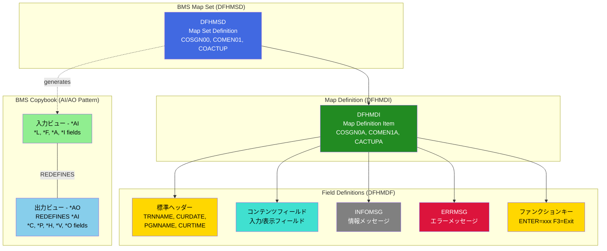

# BMSパターン (BMS Patterns)

## CardDemo COBOL/CICS アプリケーション コードスタイルカタログ

本文書は、CardDemo メインフレームアプリケーションにおけるBMS (Basic Mapping Support) パターンを定義します。DFHMSD/DFHMDI/DFHMDF構造、AI/AO二重ビューパターン、属性語彙、色彩語彙、標準画面要素などの3270端末インターフェースパターンを含みます。

---

## 目次

- [必須パターン (MUST)](#必須パターン-must)
  - [DFHMSD構造](#dfhmsd構造)
  - [DFHMDI/DFHMDF構造](#dfhmdidfhmdf構造)
  - [AI/AO二重ビューパターン](#aiao二重ビューパターン)
  - [ERRMSGフィールド要件](#errmsgフィールド要件)
- [推奨パターン (SHOULD)](#推奨パターン-should)
  - [属性語彙](#属性語彙)
  - [色彩語彙](#色彩語彙)
  - [標準ヘッダーフィールド](#標準ヘッダーフィールド)
  - [INFOMSGフィールド使用](#infomsgフィールド使用)
- [BMS構造階層図](#bms構造階層図)
- [相互参照](#相互参照)

---

## 必須パターン (MUST)

以下のパターンは**必須**です。違反は自動却下となります。

---

### DFHMSD構造

```yaml
パターン名: DFHMSD構造
優先度: MUST
カテゴリ: API
ファイルパス: app/bms/COSGN00.bms:19-25
スニペット: |
  COSGN00 DFHMSD CTRL=(ALARM,FREEKB),                                    -
                 EXTATT=YES,                                             -
                 LANG=COBOL,                                             -
                 MODE=INOUT,                                             -
                 STORAGE=AUTO,                                           -
                 TIOAPFX=YES,                                            -
                 TYPE=&&SYSPARM
検証基準:
  - LANG=COBOLパラメータが必須である
  - MODE=INOUTを使用して入出力両方をサポートする
  - STORAGE=AUTOを使用して自動ストレージ管理を有効にする
  - TIOAPFX=YESを使用してTIOA接頭辞を含める
  - TYPE=&&SYSPARMを使用して柔軟なコンパイルを可能にする
根拠: CICS BMS マップの正しいコンパイルとランタイム動作を保証するため
```

**詳細説明:**

DFHMSD (Define Map Set Definition) マクロは、BMS マップセットの開始を定義します。以下のパラメータが必須です:

| パラメータ | 必須値 | 説明 |
|-----------|--------|------|
| `LANG` | `COBOL` | 生成されるコピーブックの言語を指定 |
| `MODE` | `INOUT` | 入力と出力の両方向を有効化 |
| `STORAGE` | `AUTO` | マップに対する自動ストレージ管理 |
| `TIOAPFX` | `YES` | TIOA (Terminal I/O Area) 接頭辞を含める |
| `TYPE` | `&&SYSPARM` | コンパイル時のパラメータ化を可能にする |

**オプションパラメータ:**

| パラメータ | 例 | 説明 |
|-----------|-----|------|
| `CTRL` | `(ALARM,FREEKB)` | 端末制御オプション（アラーム音、キーボード解放） |
| `EXTATT` | `YES` | 拡張属性のサポートを有効化 |

**補足コード例 (COACTUP.bms):**

```bms
COACTUP DFHMSD LANG=COBOL,                                             -
               MODE=INOUT,                                             -
               STORAGE=AUTO,                                           -
               TIOAPFX=YES,                                            -
               TYPE=&&SYSPARM
```

**Source:** `app/bms/COACTUP.bms:20-24`

---

### DFHMDI/DFHMDF構造

```yaml
パターン名: DFHMDI/DFHMDF構造
優先度: MUST
カテゴリ: API
ファイルパス: app/bms/COSGN00.bms:26-40
スニペット: |
  COSGN0A DFHMDI COLUMN=1,                                               -
                 LINE=1,                                                 -
                 SIZE=(24,80)
          DFHMDF ATTRB=(ASKIP,NORM),                                     -
                 COLOR=BLUE,                                             -
                 LENGTH=6,                                               -
                 POS=(1,1),                                              -
                 INITIAL='Tran :'
  TRNNAME DFHMDF ATTRB=(ASKIP,FSET,NORM),                                -
                 COLOR=BLUE,                                             -
                 LENGTH=4,                                               -
                 POS=(1,8)
検証基準:
  - DFHMDIにSIZE=(24,80)を使用して標準3270画面サイズを定義する
  - DFHMDFにはPOSパラメータで行と列を(row,column)形式で指定する
  - DFHMDFには必ずLENGTHパラメータを含める
  - DFHMDFには必ずATTRBパラメータで属性を指定する
  - 名前付きフィールドはDFHMDFの前にラベルを配置する
根拠: 標準3270端末の画面サイズに準拠し、一貫したフィールド配置を保証するため
```

**詳細説明:**

**DFHMDI (Define Map Definition Item) - マップ定義:**

| パラメータ | 必須 | 説明 |
|-----------|------|------|
| `SIZE` | ○ | 画面サイズ。標準は`(24,80)`（24行×80列） |
| `LINE` | △ | マップの開始行（デフォルト1） |
| `COLUMN` | △ | マップの開始列（デフォルト1） |
| `CTRL` | △ | 端末制御オプション |
| `DSATTS` | △ | 動的属性オプション |
| `MAPATTS` | △ | マップ属性オプション |

**DFHMDF (Define Map Field) - フィールド定義:**

| パラメータ | 必須 | 説明 |
|-----------|------|------|
| `POS` | ○ | フィールド位置 `(row,column)` |
| `LENGTH` | ○ | フィールド長（0も許容） |
| `ATTRB` | ○ | フィールド属性 |
| `COLOR` | △ | フィールド色 |
| `INITIAL` | △ | 初期値 |
| `HILIGHT` | △ | ハイライト属性 |
| `JUSTIFY` | △ | 位置揃え |

**追加コード例 (COACTUPC.bms with DSATTS/MAPATTS):**

```bms
CACTUPA DFHMDI CTRL=(FREEKB),                                          -
               DSATTS=(COLOR,HILIGHT,PS,VALIDN),                       -
               MAPATTS=(COLOR,HILIGHT,PS,VALIDN),                      -
               SIZE=(24,80)
```

**Source:** `app/bms/COACTUP.bms:25-28`

---

### AI/AO二重ビューパターン

```yaml
パターン名: AI/AO二重ビューパターン
優先度: MUST
カテゴリ: API
ファイルパス: app/cpy-bms/COACTUP.CPY:17-50, 343-400
スニペット: |
  *---------- 入力ビュー (Input View) ----------
   01  CACTUPAI.
       02  FILLER PIC X(12).
       02  TRNNAMEL    COMP  PIC  S9(4).
       02  TRNNAMEF    PICTURE X.
       02  FILLER REDEFINES TRNNAMEF.
         03 TRNNAMEA    PICTURE X.
       02  FILLER   PICTURE X(4).
       02  TRNNAMEI  PIC X(4).
       ...
  *---------- 出力ビュー (Output View) ----------
   01  CACTUPAO REDEFINES CACTUPAI.
       02  FILLER PIC X(12).
       02  FILLER PICTURE X(3).
       02  TRNNAMEC    PICTURE X.
       02  TRNNAMEP    PICTURE X.
       02  TRNNAMEH    PICTURE X.
       02  TRNNAMEV    PICTURE X.
       02  TRNNAMEO  PIC X(4).
検証基準:
  - 入力ビュー01レベルには必ず「AI」接尾辞を使用する（例: CACTUPAI）
  - 出力ビュー01レベルには必ず「AO」接尾辞を使用し、REDEFINES句で入力ビューを参照する
  - 入力ビューフィールドには *L（長さ）、*F（フラグ）、*A（属性）、*I（入力データ）接尾辞を使用する
  - 出力ビューフィールドには *C（色）、*P（保護）、*H（ハイライト）、*V（検証）、*O（出力データ）接尾辞を使用する
  - 最初の12バイトはFILLER PIC X(12)でTIOAFBA領域を予約する
根拠: メモリ効率と入出力の明確な分離を実現するため。CICS BMS RECEIVE/SENDコマンドで使用
```

**詳細説明:**

AI/AO二重ビューパターンは、単一のストレージ領域を入力と出力の両方に効率的に使用するための設計パターンです。

**入力ビュー (AI - Application Input) フィールド接尾辞:**

| 接尾辞 | フィールド名例 | PIC句 | 説明 |
|--------|--------------|-------|------|
| `*L` | `TRNNAMEL` | `COMP PIC S9(4)` | フィールド長（2バイトバイナリ） |
| `*F` | `TRNNAMEF` | `PICTURE X` | フラグバイト |
| `*A` | `TRNNAMEA` | `PICTURE X` | 属性バイト（REDEFINESで*Fと重複） |
| `*I` | `TRNNAMEI` | `PIC X(n)` | 入力データフィールド |

**出力ビュー (AO - Application Output) フィールド接尾辞:**

| 接尾辞 | フィールド名例 | PIC句 | 説明 |
|--------|--------------|-------|------|
| `*C` | `TRNNAMEC` | `PICTURE X` | 色属性 |
| `*P` | `TRNNAMEP` | `PICTURE X` | 保護属性 |
| `*H` | `TRNNAMEH` | `PICTURE X` | ハイライト属性 |
| `*V` | `TRNNAMEV` | `PICTURE X` | 検証属性 |
| `*O` | `TRNNAMEO` | `PIC X(n)` | 出力データフィールド |

**コード例 (COSGN00.CPY - シンプルな例):**

```cobol
       01  COSGN0AI.
           02  FILLER PIC X(12).
           02  TRNNAMEL    COMP  PIC  S9(4).
           02  TRNNAMEF    PICTURE X.
           02  FILLER REDEFINES TRNNAMEF.
             03 TRNNAMEA    PICTURE X.
           02  FILLER   PICTURE X(4).
           02  TRNNAMEI  PIC X(4).
           ...
           02  ERRMSGL    COMP  PIC  S9(4).
           02  ERRMSGF    PICTURE X.
           02  FILLER REDEFINES ERRMSGF.
             03 ERRMSGA    PICTURE X.
           02  FILLER   PICTURE X(4).
           02  ERRMSGI  PIC X(78).
       01  COSGN0AO REDEFINES COSGN0AI.
           02  FILLER PIC X(12).
           02  FILLER PICTURE X(3).
           02  TRNNAMEC    PICTURE X.
           02  TRNNAMEP    PICTURE X.
           02  TRNNAMEH    PICTURE X.
           02  TRNNAMEV    PICTURE X.
           02  TRNNAMEO  PIC X(4).
           ...
           02  FILLER PICTURE X(3).
           02  ERRMSGC    PICTURE X.
           02  ERRMSGP    PICTURE X.
           02  ERRMSGH    PICTURE X.
           02  ERRMSGV    PICTURE X.
           02  ERRMSGO  PIC X(78).
```

**Source:** `app/cpy-bms/COSGN00.CPY:17-84, 85-152`

**使用例 (CICS RECEIVE/SEND):**

```cobol
      * 入力の受信
       EXEC CICS RECEIVE MAP('COSGN0A')
                 MAPSET('COSGN00')
                 INTO(COSGN0AI)
                 RESP(WS-RESP-CD)
       END-EXEC.

      * 出力の送信
       MOVE 'Value' TO TRNNAMEO.
       EXEC CICS SEND MAP('COSGN0A')
                 MAPSET('COSGN00')
                 FROM(COSGN0AO)
                 ERASE
                 RESP(WS-RESP-CD)
       END-EXEC.
```

---

### ERRMSGフィールド要件

```yaml
パターン名: ERRMSGフィールド要件
優先度: MUST
カテゴリ: API
ファイルパス: app/bms/COSGN00.bms:197-200
スニペット: |
  ERRMSG  DFHMDF ATTRB=(ASKIP,BRT,FSET),                                 -
                 COLOR=RED,                                              -
                 LENGTH=78,                                              -
                 POS=(23,1)
検証基準:
  - すべてのマップにERRMSGフィールドを含める
  - ERRMSGは画面下部（通常23行目）に配置する
  - ERRMSGのLENGTHは78（画面幅-2）を標準とする
  - ATTRB=(ASKIP,BRT,FSET)を使用してスキップ可能、明るい表示、フィールドセットとする
  - COLOR=REDを使用してエラーメッセージを赤色で表示する
根拠: すべての画面で一貫したエラーメッセージ表示位置を確保し、ユーザーエクスペリエンスを向上させるため
```

**詳細説明:**

ERRMSGフィールドは、すべてのCardDemoアプリケーション画面に必須のエラーメッセージ表示フィールドです。

**標準ERRMSGフィールド仕様:**

| 属性 | 標準値 | 説明 |
|------|--------|------|
| 位置 | `POS=(23,1)` | 画面の23行目（下から2行目） |
| 長さ | `LENGTH=78` | 画面幅80から属性バイト2を引いた長さ |
| 属性 | `ASKIP,BRT,FSET` | 自動スキップ、明るい表示、送信時に含める |
| 色 | `RED` | エラーを示す赤色 |

**全マップでの適用例:**

**COSGN00.bms (ログイン画面):**
```bms
ERRMSG  DFHMDF ATTRB=(ASKIP,BRT,FSET),                                 -
               COLOR=RED,                                              -
               LENGTH=78,                                              -
               POS=(23,1)
```

**COMEN01.bms (メインメニュー):**
```bms
ERRMSG  DFHMDF ATTRB=(ASKIP,BRT,FSET),                                 -
               COLOR=RED,                                              -
               LENGTH=78,                                              -
               POS=(23,1)
```

**COACTUP.bms (アカウント更新):**
```bms
ERRMSG  DFHMDF ATTRB=(ASKIP,BRT,FSET),                                 -
               COLOR=RED,                                              -
               LENGTH=78,                                              -
               POS=(23,1)
```

**Source:** `app/bms/COSGN00.bms:197-200`, `app/bms/COMEN01.bms:154-157`, `app/bms/COACTUP.bms:489-492`

---

## 推奨パターン (SHOULD)

以下のパターンは**推奨**です。逸脱する場合は正当な理由の文書化が必要です。

---

### 属性語彙

```yaml
パターン名: 属性語彙
優先度: SHOULD
カテゴリ: API
ファイルパス: app/bms/COSGN00.bms:29-175
スニペット: |
  *---------- 保護フィールド（表示のみ） ----------
          DFHMDF ATTRB=(ASKIP,NORM),
                 COLOR=BLUE,
                 ...
  *---------- 入力フィールド ----------
  USERID  DFHMDF ATTRB=(FSET,IC,NORM,UNPROT),
                 COLOR=GREEN,
                 HILIGHT=OFF,
                 ...
  *---------- パスワードフィールド（非表示） ----------
  PASSWD  DFHMDF ATTRB=(DRK,FSET,UNPROT),
                 COLOR=GREEN,
                 HILIGHT=OFF,
                 ...
検証基準:
  - 表示専用フィールドにはASKIPまたはPROTを使用する
  - 入力フィールドにはUNPROTを使用する
  - 変更追跡が必要なフィールドにはFSETを使用する
  - 初期カーソル位置にはICを使用する
  - 通常輝度にはNORM、高輝度にはBRT、非表示にはDRKを使用する
根拠: 一貫したフィールド動作と3270端末の標準的なユーザーインターフェース規則に従うため
```

**詳細説明:**

BMS属性 (ATTRB) は、フィールドの動作と表示特性を定義します。

**保護属性:**

| 属性 | 説明 | 使用場面 |
|------|------|----------|
| `ASKIP` | 自動スキップ（保護+スキップ） | ラベル、表示専用データ |
| `PROT` | 保護（カーソルは入るがデータ入力不可） | 参照データ |
| `UNPROT` | 非保護（入力可能） | 入力フィールド |

**輝度属性:**

| 属性 | 説明 | 使用場面 |
|------|------|----------|
| `NORM` | 通常輝度 | 標準表示 |
| `BRT` | 高輝度（明るい） | 強調表示、エラーメッセージ |
| `DRK` | 非表示（暗い） | パスワード、機密データ |

**修飾属性:**

| 属性 | 説明 | 使用場面 |
|------|------|----------|
| `FSET` | フィールドセット（常にMDT設定） | 出力フィールド、変更追跡 |
| `IC` | 初期カーソル位置 | 最初の入力フィールド |
| `NUM` | 数値入力専用 | 数値フィールド |

**コード例（属性の組み合わせ）:**

```bms
*---------- ラベル（保護・通常輝度） ----------
        DFHMDF ATTRB=(ASKIP,NORM),
               COLOR=BLUE,
               LENGTH=6,
               POS=(1,1),
               INITIAL='Tran :'

*---------- データ表示（保護・出力用） ----------
TRNNAME DFHMDF ATTRB=(ASKIP,FSET,NORM),
               COLOR=BLUE,
               LENGTH=4,
               POS=(1,8)

*---------- 入力フィールド（初期カーソル） ----------
USERID  DFHMDF ATTRB=(FSET,IC,NORM,UNPROT),
               COLOR=GREEN,
               HILIGHT=OFF,
               LENGTH=8,
               POS=(19,43)

*---------- パスワード（非表示） ----------
PASSWD  DFHMDF ATTRB=(DRK,FSET,UNPROT),
               COLOR=GREEN,
               HILIGHT=OFF,
               LENGTH=8,
               POS=(20,43)

*---------- 数値入力 ----------
OPTION  DFHMDF ATTRB=(FSET,IC,NORM,NUM,UNPROT),
               HILIGHT=UNDERLINE,
               JUSTIFY=(RIGHT,ZERO),
               LENGTH=2,
               POS=(20,41)
```

**Source:** `app/bms/COSGN00.bms:29-36, 156-160, 175-180`, `app/bms/COMEN01.bms:145-149`

---

### 色彩語彙

```yaml
パターン名: 色彩語彙
優先度: SHOULD
カテゴリ: API
ファイルパス: app/bms/COSGN00.bms:29-200
スニペット: |
  *---------- BLUE: ヘッダー、ラベル ----------
          DFHMDF ATTRB=(ASKIP,NORM),
                 COLOR=BLUE,
                 LENGTH=6,
                 POS=(1,1),
                 INITIAL='Tran :'
  *---------- YELLOW: タイトル、ファンクションキー ----------
  TITLE01 DFHMDF ATTRB=(ASKIP,FSET,NORM),
                 COLOR=YELLOW,
                 LENGTH=40,
                 POS=(1,21)
  *---------- GREEN: 入力フィールド ----------
  USERID  DFHMDF ATTRB=(FSET,IC,NORM,UNPROT),
                 COLOR=GREEN,
                 ...
  *---------- RED: エラーメッセージ ----------
  ERRMSG  DFHMDF ATTRB=(ASKIP,BRT,FSET),
                 COLOR=RED,
                 LENGTH=78,
                 POS=(23,1)
  *---------- TURQUOISE: プロンプト、説明 ----------
          DFHMDF ATTRB=(ASKIP,NORM),
                 COLOR=TURQUOISE,
                 LENGTH=49,
                 POS=(17,16),
                 INITIAL='Type your User ID and Password...'
検証基準:
  - BLUE: ヘッダー、ラベル、システム情報に使用する
  - YELLOW: タイトル、ファンクションキー説明に使用する
  - GREEN: 入力可能フィールド、成功メッセージに使用する
  - RED: エラーメッセージに使用する
  - TURQUOISE: プロンプト、説明テキストに使用する
  - NEUTRAL: 強調しない一般テキストに使用する
根拠: 視覚的な一貫性とユーザーエクスペリエンスの向上、フィールドタイプの即時識別を可能にするため
```

**詳細説明:**

色彩の一貫した使用は、ユーザーがフィールドのタイプと重要度を即座に識別できるようにします。

**CardDemo色彩標準:**

| 色 | 使用目的 | 例 |
|----|----------|-----|
| `BLUE` | ヘッダー、ラベル、システム情報 | Tran:, Prog:, Date:, Time: |
| `YELLOW` | タイトル、ファンクションキー | 画面タイトル、F3=Exit |
| `GREEN` | 入力フィールド、成功ステータス | ユーザーID、パスワード入力欄 |
| `RED` | エラーメッセージ、警告 | ERRMSG フィールド |
| `TURQUOISE` | プロンプト、説明、ガイダンス | 「User ID:」などの入力促進テキスト |
| `NEUTRAL` | 装飾、背景テキスト | 中性的な情報テキスト |

**コード例 (COSGN00.bms - 全色の使用):**

```bms
*---------- BLUE: ヘッダー情報 ----------
        DFHMDF ATTRB=(ASKIP,NORM),
               COLOR=BLUE,
               LENGTH=6,
               POS=(1,1),
               INITIAL='Tran :'
TRNNAME DFHMDF ATTRB=(ASKIP,FSET,NORM),
               COLOR=BLUE,
               LENGTH=4,
               POS=(1,8)

*---------- YELLOW: タイトル ----------
TITLE01 DFHMDF ATTRB=(ASKIP,FSET,NORM),
               COLOR=YELLOW,
               LENGTH=40,
               POS=(1,21)

*---------- NEUTRAL: 装飾テキスト ----------
        DFHMDF ATTRB=(ASKIP,NORM),
               COLOR=NEUTRAL,
               LENGTH=66,
               POS=(5,6),
               INITIAL='This is a Credit Card Demo Application...'

*---------- TURQUOISE: プロンプト ----------
        DFHMDF ATTRB=(ASKIP,NORM),
               COLOR=TURQUOISE,
               LENGTH=49,
               POS=(17,16),
               INITIAL='Type your User ID and Password, then press ENTER:'

*---------- GREEN: 入力フィールド ----------
USERID  DFHMDF ATTRB=(FSET,IC,NORM,UNPROT),
               COLOR=GREEN,
               HILIGHT=OFF,
               LENGTH=8,
               POS=(19,43)

*---------- RED: エラーメッセージ ----------
ERRMSG  DFHMDF ATTRB=(ASKIP,BRT,FSET),
               COLOR=RED,
               LENGTH=78,
               POS=(23,1)

*---------- YELLOW: ファンクションキー ----------
        DFHMDF ATTRB=(ASKIP,NORM),
               COLOR=YELLOW,
               LENGTH=22,
               POS=(24,1),
               INITIAL='ENTER=Sign-on  F3=Exit'
```

**Source:** `app/bms/COSGN00.bms:29-206`

---

### 標準ヘッダーフィールド

```yaml
パターン名: 標準ヘッダーフィールド
優先度: SHOULD
カテゴリ: API
ファイルパス: app/bms/COSGN00.bms:29-74
スニペット: |
  *---------- 行1: トランザクション名、タイトル、日付 ----------
          DFHMDF ATTRB=(ASKIP,NORM),
                 COLOR=BLUE,
                 LENGTH=6,
                 POS=(1,1),
                 INITIAL='Tran :'
  TRNNAME DFHMDF ATTRB=(ASKIP,FSET,NORM),
                 COLOR=BLUE,
                 LENGTH=4,
                 POS=(1,8)
  TITLE01 DFHMDF ATTRB=(ASKIP,FSET,NORM),
                 COLOR=YELLOW,
                 LENGTH=40,
                 POS=(1,21)
          DFHMDF ATTRB=(ASKIP,NORM),
                 COLOR=BLUE,
                 LENGTH=6,
                 POS=(1,64),
                 INITIAL='Date :'
  CURDATE DFHMDF ATTRB=(ASKIP,FSET,NORM),
                 COLOR=BLUE,
                 LENGTH=8,
                 POS=(1,71),
                 INITIAL='mm/dd/yy'
  *---------- 行2: プログラム名、サブタイトル、時刻 ----------
          DFHMDF ATTRB=(ASKIP,NORM),
                 COLOR=BLUE,
                 LENGTH=6,
                 POS=(2,1),
                 INITIAL='Prog :'
  PGMNAME DFHMDF ATTRB=(FSET,NORM,PROT),
                 COLOR=BLUE,
                 LENGTH=8,
                 POS=(2,8)
  TITLE02 DFHMDF ATTRB=(ASKIP,FSET,NORM),
                 COLOR=YELLOW,
                 LENGTH=40,
                 POS=(2,21)
          DFHMDF ATTRB=(ASKIP,NORM),
                 COLOR=BLUE,
                 LENGTH=6,
                 POS=(2,64),
                 INITIAL='Time :'
  CURTIME DFHMDF ATTRB=(FSET,NORM,PROT),
                 COLOR=BLUE,
                 LENGTH=9,
                 POS=(2,71),
                 INITIAL='Ahh:mm:ss'
検証基準:
  - すべてのマップの1行目にTRNNAME（トランザクション名）、TITLE01、CURDATE（日付）を含める
  - すべてのマップの2行目にPGMNAME（プログラム名）、TITLE02、CURTIME（時刻）を含める
  - 標準配置: (1,1)からトランザクション、(1,21)からタイトル、(1,64)から日付
  - 標準配置: (2,1)からプログラム、(2,21)からサブタイトル、(2,64)から時刻
根拠: 一貫した画面レイアウトでユーザーオリエンテーションを提供し、アプリケーション全体で統一感を維持するため
```

**詳細説明:**

標準ヘッダーフィールドは、すべてのCardDemoアプリケーション画面で一貫したナビゲーション情報を提供します。

**標準ヘッダーレイアウト:**

```
行1: Tran: XXXX  [______タイトル1______]        Date : mm/dd/yy
行2: Prog: XXXXXXXX  [____サブタイトル____]     Time : hh:mm:ss
```

**必須ヘッダーフィールド:**

| フィールド名 | 位置 | 長さ | 説明 |
|-------------|------|------|------|
| `TRNNAME` | (1,8) | 4 | CICSトランザクションID |
| `TITLE01` | (1,21) | 40 | メインタイトル |
| `CURDATE` | (1,71) | 8 | 現在日付 (mm/dd/yy) |
| `PGMNAME` | (2,8) | 8 | プログラムID |
| `TITLE02` | (2,21) | 40 | サブタイトル |
| `CURTIME` | (2,71) | 8-9 | 現在時刻 (hh:mm:ss) |

**コード例 (COMEN01.bms - メインメニュー):**

```bms
        DFHMDF ATTRB=(ASKIP,NORM),
               COLOR=BLUE,
               LENGTH=5,
               POS=(1,1),
               INITIAL='Tran:'
TRNNAME DFHMDF ATTRB=(ASKIP,FSET,NORM),
               COLOR=BLUE,
               LENGTH=4,
               POS=(1,7)
TITLE01 DFHMDF ATTRB=(ASKIP,FSET,NORM),
               COLOR=YELLOW,
               LENGTH=40,
               POS=(1,21)
        DFHMDF ATTRB=(ASKIP,NORM),
               COLOR=BLUE,
               LENGTH=5,
               POS=(1,65),
               INITIAL='Date:'
CURDATE DFHMDF ATTRB=(ASKIP,FSET,NORM),
               COLOR=BLUE,
               LENGTH=8,
               POS=(1,71),
               INITIAL='mm/dd/yy'
        DFHMDF ATTRB=(ASKIP,NORM),
               COLOR=BLUE,
               LENGTH=5,
               POS=(2,1),
               INITIAL='Prog:'
PGMNAME DFHMDF ATTRB=(ASKIP,FSET,NORM),
               COLOR=BLUE,
               LENGTH=8,
               POS=(2,7)
TITLE02 DFHMDF ATTRB=(ASKIP,FSET,NORM),
               COLOR=YELLOW,
               LENGTH=40,
               POS=(2,21)
        DFHMDF ATTRB=(ASKIP,NORM),
               COLOR=BLUE,
               LENGTH=5,
               POS=(2,65),
               INITIAL='Time:'
CURTIME DFHMDF ATTRB=(ASKIP,FSET,NORM),
               COLOR=BLUE,
               LENGTH=8,
               POS=(2,71),
               INITIAL='hh:mm:ss'
```

**Source:** `app/bms/COMEN01.bms:29-74`

---

### INFOMSGフィールド使用

```yaml
パターン名: INFOMSGフィールド使用
優先度: SHOULD
カテゴリ: API
ファイルパス: app/bms/COACTUP.bms:480-486
スニペット: |
  INFOMSG DFHMDF ATTRB=(ASKIP),                                          -
                 COLOR=NEUTRAL,                                          -
                 HILIGHT=OFF,                                            -
                 LENGTH=45,                                              -
                 POS=(22,23)
          DFHMDF LENGTH=0,                                               -
                 POS=(22,69)
検証基準:
  - エラー以外の情報メッセージにはINFOMSGフィールドを使用する
  - INFOMSGはERRMSGとは別の行に配置する（通常22行目）
  - INFOMSGにはCOLOR=NEUTRALまたはGREENを使用する（REDは使用しない）
  - 確認メッセージや操作指示にINFOMSGを使用する
根拠: エラーメッセージと情報メッセージを明確に区別し、ユーザーに適切なフィードバックを提供するため
```

**詳細説明:**

INFOMSGフィールドは、エラー以外の情報メッセージを表示するための推奨フィールドです。ERRMSGとは異なる用途と表示特性を持ちます。

**ERRMSG vs INFOMSG の比較:**

| 属性 | ERRMSG | INFOMSG |
|------|--------|---------|
| 目的 | エラー・警告表示 | 情報・確認メッセージ表示 |
| 位置 | 23行目（画面下部） | 22行目またはコンテンツ領域 |
| 色 | RED（赤） | NEUTRAL/GREEN |
| 輝度 | BRT（高輝度） | NORM（通常輝度） |
| 使用例 | 「入力エラーです」 | 「正常に保存されました」 |

**コード例:**

```bms
*---------- 情報メッセージ（22行目） ----------
INFOMSG DFHMDF ATTRB=(ASKIP),
               COLOR=NEUTRAL,
               HILIGHT=OFF,
               LENGTH=45,
               POS=(22,23)
        DFHMDF LENGTH=0,
               POS=(22,69)

*---------- エラーメッセージ（23行目） ----------
ERRMSG  DFHMDF ATTRB=(ASKIP,BRT,FSET),
               COLOR=RED,
               LENGTH=78,
               POS=(23,1)
```

**Source:** `app/bms/COACTUP.bms:480-492`

---

## BMS構造階層図

以下のMermaid図は、CardDemo BMSマップの構造階層を示します。



### 画面レイアウト構造

```mermaid
graph LR
    subgraph "24x80 3270 Screen Layout"
        direction TB
        ROW1[行1: Tran: XXXX | タイトル1 | Date: mm/dd/yy]
        ROW2[行2: Prog: XXXXXXXX | サブタイトル | Time: hh:mm:ss]
        ROW3_21[行3-21: コンテンツ領域<br/>入力フィールド・表示データ]
        ROW22[行22: INFOMSG - 情報メッセージ]
        ROW23[行23: ERRMSG - エラーメッセージ]
        ROW24[行24: ファンクションキー説明]
    end

    ROW1 --> ROW2
    ROW2 --> ROW3_21
    ROW3_21 --> ROW22
    ROW22 --> ROW23
    ROW23 --> ROW24

    style ROW1 fill:#4169E1,color:#fff
    style ROW2 fill:#4169E1,color:#fff
    style ROW3_21 fill:#40E0D0,color:#000
    style ROW22 fill:#808080,color:#fff
    style ROW23 fill:#DC143C,color:#fff
    style ROW24 fill:#FFD700,color:#000
```

---

## 相互参照

### 関連ドキュメント

| ドキュメント | 関連内容 |
|-------------|----------|
| [データ契約](./data-contracts.md) | AI/AOコピーブックのPIC句定義、COMMAREA構造との連携 |
| [アーキテクチャパターン](./architecture-patterns.md) | CICS SEND/RECEIVEコマンドでのBMSマップ使用パターン |
| [エラー処理](./error-handling.md) | ERRMSGフィールドへのエラーメッセージ出力パターン |

### コピーブック参照

| BMSマップ | 生成コピーブック | 使用プログラム |
|----------|-----------------|---------------|
| `COSGN00.bms` | `COSGN00.CPY` (COSGN0AI/COSGN0AO) | `COSGN00C.cbl` |
| `COMEN01.bms` | `COMEN01.CPY` (COMEN1AI/COMEN1AO) | `COMEN01C.cbl` |
| `COACTUP.bms` | `COACTUP.CPY` (CACTUPAI/CACTUPAO) | `COACTUPC.cbl` |

### DFHBMSCA属性定数

BMS属性バイトの設定には、標準コピーブック `DFHBMSCA` の定数を使用します:

| 定数名 | 用途 |
|--------|------|
| `DFHBMASK` | ASKIP属性 |
| `DFHBMPRF` | PROT+FSET属性 |
| `DFHBMPRO` | PROT属性 |
| `DFHBMUNP` | UNPROT属性 |
| `DFHBMUNN` | UNPROT+NUM属性 |
| `DFHBMDAR` | DRK属性 |
| `DFHBMBRY` | BRT属性 |

---

## カタログ準拠レポート形式

BMSマップ生成時には、以下の形式で準拠レポートを作成してください:

```plaintext
=== カタログ準拠レポート ===
生成ファイル: app/bms/NEWMAP.bms
適用ルール数: 9
MUST準拠: 合格
SHOULD準拠: 合格
逸脱項目:
  - なし
```

**MUST違反例:**

```plaintext
=== カタログ準拠レポート ===
生成ファイル: app/bms/BADMAP.bms
適用ルール数: 9
MUST準拠: 不合格
SHOULD準拠: N/A
逸脱項目:
  - DFHMSD構造: TYPE=&&SYSPARMが欠落
  - ERRMSGフィールド要件: ERRMSGフィールドが未定義
```

---

<!-- Ver: CodeStyleCatalog_v1.0 Date: 2025-02-04 -->
