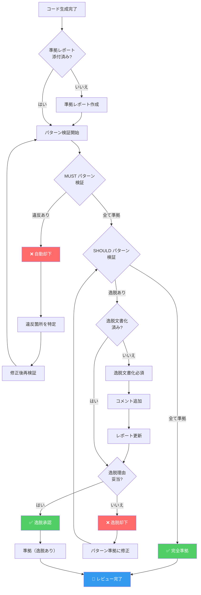
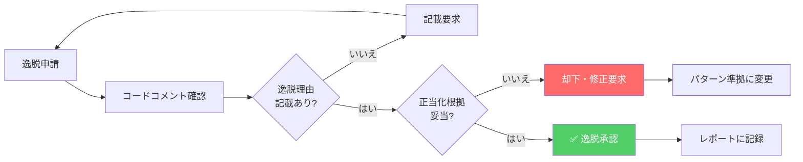
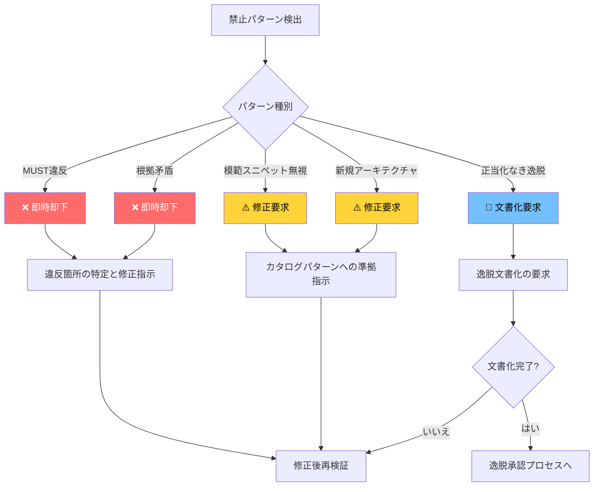

# 準拠レポート (Compliance Reporting)

## CardDemo COBOL/CICS アプリケーション コードスタイルカタログ

本文書は、CardDemo メインフレームアプリケーションのコードスタイルカタログに対する準拠レポートの形式、検証チェックリスト、逸脱文書化テンプレート、およびレビューワークフローを定義します。すべてのコード生成出力は、本ドキュメントに従った準拠レポートを添付する必要があります。

---

## 目次

- [コンプライアンスレポート形式 (Compliance Report Format)](#コンプライアンスレポート形式-compliance-report-format)
  - [標準レポートテンプレート](#標準レポートテンプレート)
  - [フィールド詳細説明](#フィールド詳細説明)
  - [出力例](#出力例)
- [検証チェックリスト (Validation Checklist)](#検証チェックリスト-validation-checklist)
  - [MUST優先度パターン（25項目）](#must優先度パターン25項目)
  - [SHOULD優先度パターン（18項目）](#should優先度パターン18項目)
  - [MAY優先度パターン（6項目）](#may優先度パターン6項目)
- [逸脱文書化 (Deviation Documentation)](#逸脱文書化-deviation-documentation)
  - [SHOULD逸脱要件](#should逸脱要件)
  - [コードコメントでの正当化テンプレート](#コードコメントでの正当化テンプレート)
  - [有効な逸脱理由の例](#有効な逸脱理由の例)
- [レビューワークフロー (Review Workflow)](#レビューワークフロー-review-workflow)
  - [準拠検証フローチャート](#準拠検証フローチャート)
  - [ステップバイステップのレビュープロセス](#ステップバイステップのレビュープロセス)
  - [自動却下基準](#自動却下基準)
  - [逸脱承認プロセス](#逸脱承認プロセス)
- [禁止パターン (Prohibited Patterns)](#禁止パターン-prohibited-patterns)
- [関連ドキュメント](#関連ドキュメント)

---

## コンプライアンスレポート形式 (Compliance Report Format)

すべてのコード生成出力には、以下の形式に従った準拠レポートを添付する必要があります。

### 標準レポートテンプレート

```plaintext
=== カタログ準拠レポート ===
生成ファイル: [パス]
適用ルール数: [N]
MUST準拠: [合格/不合格]
SHOULD準拠: [合格/逸脱あり]
逸脱項目:
  - [ルール名]: [正当化理由]
```

### フィールド詳細説明

| フィールド | 説明 | 必須 | 入力形式 |
|-----------|------|------|----------|
| **生成ファイル** | 生成されたファイルのリポジトリ相対パス | ✅ | `app/cbl/NEWPROG.cbl` |
| **適用ルール数** | 当該ファイルに適用されたカタログルールの総数 | ✅ | 整数値（例: `15`） |
| **MUST準拠** | MUST優先度パターンへの準拠状態 | ✅ | `合格` または `不合格` |
| **SHOULD準拠** | SHOULD優先度パターンへの準拠状態 | ✅ | `合格` または `逸脱あり` |
| **逸脱項目** | 逸脱したルールとその正当化理由のリスト | 条件付き | SHOULD逸脱時のみ必須 |

### 出力例

#### 完全準拠の場合

```plaintext
=== カタログ準拠レポート ===
生成ファイル: app/cbl/CONEWPGM.cbl
適用ルール数: 18
MUST準拠: 合格
SHOULD準拠: 合格
逸脱項目:
  - なし
```

#### SHOULD逸脱ありの場合

```plaintext
=== カタログ準拠レポート ===
生成ファイル: app/cbl/COSPECIAL.cbl
適用ルール数: 22
MUST準拠: 合格
SHOULD準拠: 逸脱あり
逸脱項目:
  - 段落番号規則: 外部ライブラリ統合により9500番台を使用（LE呼び出し用）
  - WS-接頭辞規則: CICS共有領域のためEIB接頭辞を使用
```

#### MUST違反の場合（自動却下）

```plaintext
=== カタログ準拠レポート ===
生成ファイル: app/cbl/COBADPGM.cbl
適用ルール数: 12
MUST準拠: 不合格
SHOULD準拠: 検証中断
逸脱項目:
  - [MUST] CICS-RESP-RESP2-エラーハンドリング: EXEC CICSコマンドにRESPパラメータが欠落

⚠️ MUST違反のため自動却下。修正後に再検証してください。
```

---

## 検証チェックリスト (Validation Checklist)

以下のチェックリストは、コード生成時に適用されるすべてのパターンを網羅しています。各項目は参照元のパターンドキュメントにリンクしています。

### MUST優先度パターン（25項目）

MUST優先度パターンは**必須**です。1つでも違反がある場合、自動的にレビュー失敗となります。

| # | パターン名 | カテゴリ | ドキュメント参照 | チェック |
|---|-----------|---------|-----------------|----------|
| 1 | IDENTIFICATION DIVISION構造 | アーキテクチャ | [architecture-patterns.md](./architecture-patterns.md#identification-division構造) | ☐ |
| 2 | ENVIRONMENT DIVISION構造 | アーキテクチャ | [architecture-patterns.md](./architecture-patterns.md#environment-division構造) | ☐ |
| 3 | DATA DIVISION組織 | アーキテクチャ | [architecture-patterns.md](./architecture-patterns.md#data-division組織) | ☐ |
| 4 | PROCEDURE DIVISION構造 | アーキテクチャ | [architecture-patterns.md](./architecture-patterns.md#procedure-division構造) | ☐ |
| 5 | CICS-RESP-RESP2-エラーハンドリング | エラー処理 | [error-handling.md](./error-handling.md#cics-resp-resp2-エラーハンドリング) | ☐ |
| 6 | バッチAPPL-RESULTコード | エラー処理 | [error-handling.md](./error-handling.md#バッチappl-resultコード) | ☐ |
| 7 | プログラムID接頭辞（CB\*/CO\*） | 命名規則 | [naming-conventions.md](./naming-conventions.md#プログラムid接頭辞) | ☐ |
| 8 | コピーブック命名（CV\*/CS\*/CO\*） | 命名規則 | [naming-conventions.md](./naming-conventions.md#コピーブック命名) | ☐ |
| 9 | 01レベルレコード定義 | データベース | [data-contracts.md](./data-contracts.md#01レベルレコード定義) | ☐ |
| 10 | RECLN文書化 | データベース | [data-contracts.md](./data-contracts.md#recln文書化) | ☐ |
| 11 | FILLERパディング規則 | データベース | [data-contracts.md](./data-contracts.md#fillerパディング規則) | ☐ |
| 12 | PIC句形式 | データベース | [data-contracts.md](./data-contracts.md#pic句形式) | ☐ |
| 13 | COMMAREA契約 | データベース | [data-contracts.md](./data-contracts.md#commarea契約) | ☐ |
| 14 | DFHMSD必須パラメータ | API | [bms-patterns.md](./bms-patterns.md#dfhmsd構造) | ☐ |
| 15 | DFHMDI 24x80グリッド | API | [bms-patterns.md](./bms-patterns.md#dfhmdidfhmdf構造) | ☐ |
| 16 | DFHMDFフィールド定義 | API | [bms-patterns.md](./bms-patterns.md#dfhmdidfhmdf構造) | ☐ |
| 17 | AI/AO二重ビューパターン | API | [bms-patterns.md](./bms-patterns.md#aiao二重ビューパターン) | ☐ |
| 18 | ERRMSGフィールド要件 | API | [bms-patterns.md](./bms-patterns.md#errmsgフィールド要件) | ☐ |
| 19 | 88レベル条件名-ISVALID | テスト | [validation-patterns.md](./validation-patterns.md#88レベル条件名-isvalid) | ☐ |
| 20 | 88レベル条件名-NOT-OK | テスト | [validation-patterns.md](./validation-patterns.md#88レベル条件名-not-ok) | ☐ |
| 21 | Apache-2.0ライセンスヘッダー | アーキテクチャ | [architecture-patterns.md](./architecture-patterns.md#apache-20ライセンスヘッダー) | ☐ |
| 22 | バージョンタグコメント | アーキテクチャ | [architecture-patterns.md](./architecture-patterns.md#バージョンタグコメント) | ☐ |
| 23 | COPY文使用 | アーキテクチャ | [architecture-patterns.md](./architecture-patterns.md#copy文使用) | ☐ |
| 24 | FDレコード定義 | データベース | [data-contracts.md](./data-contracts.md#fdレコード定義) | ☐ |
| 25 | FILE STATUS処理 | エラー処理 | [error-handling.md](./error-handling.md#file-status処理) | ☐ |

### SHOULD優先度パターン（18項目）

SHOULD優先度パターンは**推奨**です。デフォルトで適用され、逸脱する場合は文書化された正当化理由が必要です。

| # | パターン名 | カテゴリ | ドキュメント参照 | チェック |
|---|-----------|---------|-----------------|----------|
| 1 | 段落番号規則（0000-9999） | アーキテクチャ | [architecture-patterns.md](./architecture-patterns.md#段落番号規則) | ☐ |
| 2 | 9910-DISPLAY-IO-STATUS | エラー処理 | [error-handling.md](./error-handling.md#9910-display-io-status) | ☐ |
| 3 | WS-RETURN-MSGメッセージング | エラー処理 | [error-handling.md](./error-handling.md#ws-return-msgメッセージング) | ☐ |
| 4 | 9999-ABEND-PROGRAMパターン | エラー処理 | [error-handling.md](./error-handling.md#9999-abend-programパターン) | ☐ |
| 5 | WS-フィールド接頭辞 | 命名規則 | [naming-conventions.md](./naming-conventions.md#フィールド接頭辞) | ☐ |
| 6 | FD-フィールド接頭辞 | 命名規則 | [naming-conventions.md](./naming-conventions.md#フィールド接頭辞) | ☐ |
| 7 | FLG-条件接頭辞 | 命名規則 | [naming-conventions.md](./naming-conventions.md#flg-条件接頭辞) | ☐ |
| 8 | REDEFINESオーバーレイパターン | データベース | [data-contracts.md](./data-contracts.md#redefinesオーバーレイ) | ☐ |
| 9 | S9(n)V99小数形式 | データベース | [data-contracts.md](./data-contracts.md#s9nv99小数形式) | ☐ |
| 10 | BMS色彩語彙 | API | [bms-patterns.md](./bms-patterns.md#色彩語彙) | ☐ |
| 11 | BMS属性語彙 | API | [bms-patterns.md](./bms-patterns.md#属性語彙) | ☐ |
| 12 | 標準ヘッダーフィールド | API | [bms-patterns.md](./bms-patterns.md#標準ヘッダーフィールド) | ☐ |
| 13 | INPUT-OK/INPUT-ERRORフラグ | テスト | [validation-patterns.md](./validation-patterns.md#input-okinput-errorフラグ) | ☐ |
| 14 | WS-EDIT-\*変数命名 | テスト | [validation-patterns.md](./validation-patterns.md#ws-edit-変数命名) | ☐ |
| 15 | INFOMSGフィールド使用 | API | [bms-patterns.md](./bms-patterns.md#infomsgフィールド使用) | ☐ |
| 16 | コメントブロック形式 | アーキテクチャ | [architecture-patterns.md](./architecture-patterns.md#コメントブロック形式) | ☐ |
| 17 | セクション組織 | アーキテクチャ | [architecture-patterns.md](./architecture-patterns.md#セクション組織) | ☐ |
| 18 | 一貫したインデント | アーキテクチャ | [architecture-patterns.md](./architecture-patterns.md#一貫したインデント) | ☐ |

### MAY優先度パターン（6項目）

MAY優先度パターンは**任意**です。開発者の裁量で適用されます。

| # | パターン名 | カテゴリ | ドキュメント参照 | チェック |
|---|-----------|---------|-----------------|----------|
| 1 | PERFORM...THRU構造 | アーキテクチャ | [architecture-patterns.md](./architecture-patterns.md#performthru構造) | ☐ |
| 2 | GO TO使用（意図的なもの） | アーキテクチャ | [validation-patterns.md](./validation-patterns.md#go-to使用意図的なもの) | ☐ |
| 3 | CEEDAYS言語環境サービス | テスト | [validation-patterns.md](./validation-patterns.md#ceedays言語環境サービス) | ☐ |
| 4 | BMSでのASCIIアート | API | [bms-patterns.md](./bms-patterns.md) | ☐ |
| 5 | HILIGHT=UNDERLINE使用 | API | [bms-patterns.md](./bms-patterns.md) | ☐ |
| 6 | ゼロ長DFHMDF | API | [bms-patterns.md](./bms-patterns.md) | ☐ |

---

## 逸脱文書化 (Deviation Documentation)

SHOULD優先度パターンからの逸脱は許容されますが、必ず文書化された正当化理由が必要です。

### SHOULD逸脱要件

SHOULD優先度パターンから逸脱する場合、以下の要件を満たす必要があります：

1. **逸脱理由の明記**: なぜカタログパターンに従わないのかを明確に説明
2. **技術的正当性**: 逸脱が技術的に必要または優位である理由を示す
3. **コード内コメント**: ソースコード内に逸脱コメントを記述
4. **準拠レポートへの記載**: 準拠レポートの逸脱項目セクションに記載

### コードコメントでの正当化テンプレート

逸脱する場合、以下の形式でソースコード内にコメントを追加してください：

```cobol
      ******************************************************************
      * カタログ逸脱: [ルール名]
      * 逸脱理由: [なぜ標準パターンに従わないか]
      * 正当化根拠: [技術的または業務的な正当性]
      ******************************************************************
```

**使用例:**

```cobol
      ******************************************************************
      * カタログ逸脱: 段落番号規則
      * 逸脱理由: 外部ライブラリ呼び出しセクションを分離するため
      * 正当化根拠: LE (Language Environment) サービス呼び出しを
      *             9500番台で管理し、アプリケーション終了処理（9000番台）
      *             と明確に区別する必要がある
      ******************************************************************
       9500-CALL-LE-SERVICES.
           CALL 'CEE3ABD' USING ABCODE TIMING.
           EXIT.
```

### 逸脱文書化フォーマット

準拠レポートに記載する逸脱項目は、以下の形式で記述してください：

```
ルール名: [カタログのパターン名]
逸脱理由: [なぜ標準パターンに従わないか - 簡潔に1行で]
正当化根拠: [技術的または業務的な正当性 - 詳細説明]
```

### 有効な逸脱理由の例

以下は、SHOULD優先度パターンからの逸脱が認められる一般的な理由です：

#### 許容される逸脱理由

| 逸脱カテゴリ | 有効な理由の例 | 説明 |
|-------------|---------------|------|
| **外部統合** | 外部ライブラリのAPI制約 | 外部コンポーネント（LE、MQ、DB2等）の規約に従う必要がある場合 |
| **レガシー互換性** | 既存システムとのインターフェース維持 | 既存のCOMMARE定義やファイルレイアウトとの互換性が必要な場合 |
| **パフォーマンス** | 処理効率の最適化 | 測定可能なパフォーマンス向上が確認された場合 |
| **プラットフォーム制約** | z/OS固有の要件 | 特定のz/OS機能やCICS制約に起因する場合 |
| **業務要件** | ビジネスロジックの特殊性 | 標準パターンでは業務要件を満たせない場合 |

#### 拒否される逸脱理由

以下の理由は逸脱の正当化として**認められません**：

| 拒否される理由 | 説明 |
|---------------|------|
| 「個人的な好み」 | 開発者の主観的な好みはルール逸脱の理由にならない |
| 「時間がなかった」 | スケジュール制約はコード品質を犠牲にする理由にならない |
| 「よく分からなかった」 | カタログパターンの理解不足は学習で解消すべき |
| 「面倒だった」 | 実装の手間はパターン遵守を避ける理由にならない |
| 「他の場所でも違反している」 | 既存の違反は新たな違反を正当化しない |

---

## レビューワークフロー (Review Workflow)

### 準拠検証フローチャート

以下のフローチャートは、コード生成後の準拠検証プロセスを示します：



### ステップバイステップのレビュープロセス

#### Step 1: 準拠レポート確認

1. 生成されたコードに準拠レポートが添付されていることを確認
2. レポートが標準テンプレート形式に従っていることを検証
3. すべての必須フィールドが記入されていることを確認

#### Step 2: MUST パターン検証

1. 検証チェックリストの MUST 項目（25項目）を順番に確認
2. 各パターンに対して、コードが要件を満たしているか検証
3. **1つでも違反があれば、即座にレビュー失敗**
4. 違反があった場合、具体的な違反箇所と修正方法を明示

```plaintext
MUST違反検出例:
----------------------------------------------
パターン: CICS-RESP-RESP2-エラーハンドリング
ファイル: app/cbl/COBADPGM.cbl
行番号: 250-255
違反内容: EXEC CICS READ コマンドに RESP パラメータがない
修正方法: RESP(WS-RESP-CD) RESP2(WS-REAS-CD) を追加
----------------------------------------------
```

#### Step 3: SHOULD パターン検証

1. 検証チェックリストの SHOULD 項目（18項目）を確認
2. 各パターンに対して、コードが要件を満たしているか検証
3. 逸脱がある場合、正当化文書を確認
4. 逸脱理由が妥当であれば承認、不十分であれば修正を要求

#### Step 4: MAY パターン確認（参考）

1. MAY パターンの適用状況を参考として記録
2. 適用されている場合、正しく実装されているか確認
3. 適用されていなくても問題なし

#### Step 5: 最終判定

| 状態 | 判定 | アクション |
|------|------|----------|
| MUST全準拠 + SHOULD全準拠 | ✅ 完全準拠 | 承認 |
| MUST全準拠 + SHOULD逸脱あり（文書化済み） | ✅ 条件付き準拠 | 承認（逸脱記録付き） |
| MUST全準拠 + SHOULD逸脱あり（未文書化） | ⚠️ 文書化必要 | 逸脱文書化後に再レビュー |
| MUST違反あり | ❌ 自動却下 | 修正後に再検証 |

### 自動却下基準

以下の条件に1つでも該当する場合、**自動的にレビュー失敗**となります：

#### 即時却下条件

1. **MUST パターン違反**
   - 25項目のMUSTパターンのいずれかに違反している
   - 例: EXEC CICS コマンドに RESP パラメータがない

2. **準拠レポート欠落**
   - 生成コードに準拠レポートが添付されていない
   - レポート形式が標準テンプレートに従っていない

3. **禁止パターン検出**
   - 本ドキュメントで定義された禁止パターンに該当するコード

4. **ライセンスヘッダー欠落**
   - Apache-2.0 ライセンスヘッダーが含まれていない

#### 却下時の対応

```plaintext
=== 自動却下通知 ===
対象ファイル: [パス]
却下理由: MUST パターン違反
違反パターン: [パターン名]
違反箇所: [ファイル名:行番号]
違反内容: [具体的な違反の説明]

修正手順:
1. [具体的な修正手順1]
2. [具体的な修正手順2]
3. 修正完了後、再度準拠検証を実施

参照: [関連パターンドキュメントへのリンク]
```

### 逸脱承認プロセス

SHOULD パターンからの逸脱は、以下のプロセスで承認されます：



#### 逸脱承認基準

| 基準 | 説明 | 例 |
|------|------|-----|
| **技術的必然性** | パターン準拠が技術的に不可能または非効率 | 外部APIの制約により変数名を変更不可 |
| **互換性要件** | 既存システムとの互換性維持が必要 | レガシーCOMMAREA構造との整合性 |
| **パフォーマンス優位** | 逸脱により明確なパフォーマンス向上 | ループ内での冗長処理回避 |
| **業務要件** | 特殊な業務ロジックへの対応 | 規制要件による特殊フォーマット |

---

## 禁止パターン (Prohibited Patterns)

以下のパターンは、コードスタイルカタログの使用において**明示的に禁止**されています。これらのパターンが検出された場合、自動的にレビュー失敗となります。

### 禁止パターン一覧

#### 1. MUSTルール違反コード生成

```yaml
禁止パターン名: MUSTルール違反コード生成
説明: MUST優先度のカタログルールに違反するコードを生成すること
違反例: |
  * EXEC CICS コマンドに RESP パラメータがない
  * PROGRAM-ID がファイル名と一致しない
  * Apache-2.0 ライセンスヘッダーがない
  * FILE STATUS が指定されていない
結果: 自動却下（即時）
```

#### 2. 模範スニペット無視

```yaml
禁止パターン名: 模範スニペット無視
説明: カタログに同等の構造を持つ模範スニペットが存在する場合に、それを無視して独自の実装を行うこと
違反例: |
  カタログにある 88レベル条件名パターン:
    88 FLG-YEAR-ISVALID        VALUE LOW-VALUES.
    88 FLG-YEAR-NOT-OK         VALUE '0'.
  
  禁止される独自実装:
    88 YEAR-VALID              VALUE 'Y'.
    88 YEAR-INVALID            VALUE 'N'.
結果: レビューでの修正要求
```

#### 3. 確立パターン無視の新規アーキテクチャ

```yaml
禁止パターン名: 確立パターン無視の新規アーキテクチャ
説明: カタログに確立されたアーキテクチャパターンが存在するにもかかわらず、独自の新しいアプローチを採用すること
違反例: |
  カタログの段落番号規則:
    0000: 初期化
    1000-8000: メイン処理
    9000: 終了処理
  
  禁止される独自アプローチ:
    A000-INIT
    B000-PROCESS
    C000-CLEANUP
結果: レビューでの修正要求
```

#### 4. 正当化なき逸脱

```yaml
禁止パターン名: 正当化なき逸脱
説明: SHOULD優先度パターンからの逸脱において、明示的な正当化理由なしにルールを無視すること
違反例: |
  * コードコメントに逸脱理由がない
  * 準拠レポートの逸脱項目セクションが空
  * 「面倒だから」などの無効な理由
結果: 逸脱文書化要求または却下
```

#### 5. カタログ根拠への矛盾

```yaml
禁止パターン名: カタログ根拠への矛盾
説明: カタログパターンの「根拠」セクションに記載された理由に明確に矛盾するコードを生成すること
違反例: |
  カタログ根拠: 
    「RESP2と組み合わせることで完全な診断情報を取得できる」
  
  矛盾するコード:
    EXEC CICS READ FILE('ACCTFILE')
              RESP(WS-RESP-CD)   *> RESP2 を意図的に省略
    END-EXEC
    *> 診断情報は不要と判断
結果: 自動却下（根拠違反）
```

### 禁止パターン検出時の対応

禁止パターンが検出された場合、以下のプロセスに従います：



---

## 関連ドキュメント

本ドキュメントは、以下のコードスタイルカタログドキュメントと連携して使用されます：

### パターンドキュメント

| ドキュメント | 説明 | 含まれるパターン数 |
|-------------|------|-------------------|
| [architecture-patterns.md](./architecture-patterns.md) | アーキテクチャパターン | 12パターン |
| [naming-conventions.md](./naming-conventions.md) | 命名規則 | 8パターン |
| [error-handling.md](./error-handling.md) | エラー処理 | 6パターン |
| [data-contracts.md](./data-contracts.md) | データ契約 | 10パターン |
| [bms-patterns.md](./bms-patterns.md) | BMS/UIパターン | 8パターン |
| [validation-patterns.md](./validation-patterns.md) | 検証パターン | 5パターン |

### カタログ概要

| ドキュメント | 説明 |
|-------------|------|
| [README.md](./README.md) | カタログ概要とクイックリファレンス |
| [index.md](./index.md) | 統計サマリーとパターン一覧 |

### 優先度レベル定義

| 優先度 | 日本語 | 実施 | 違反時の対応 |
|--------|-------|------|-------------|
| **MUST** | 必須 | 交渉不可 | 自動却下 |
| **SHOULD** | 推奨 | デフォルト適用 | 逸脱文書化必須 |
| **MAY** | 任意 | 開発者裁量 | 対応不要 |

### ソースファイル参照

本準拠レポートドキュメントで参照される模範実装：

| ファイルパス | 種別 | 参照パターン |
|-------------|------|-------------|
| `app/cbl/COACTUPC.cbl` | CICS オンライン | RESP/RESP2、88レベル条件、WS-EDIT-\* |
| `app/cbl/CBACT01C.cbl` | バッチ | APPL-RESULT、段落番号、9910/9999 |
| `app/bms/COSGN00.bms` | BMS マップ | DFHMSD/DFHMDI/DFHMDF |
| `app/cpy/COCOM01Y.cpy` | コピーブック | COMMAREA契約、レコード定義 |
| `app/cpy/CSUTLDPY.cpy` | 手続きコピーブック | 検証パターン、GO TO使用 |
| `app/cpy-bms/COACTUP.CPY` | BMSコピーブック | AI/AO二重ビュー |

---

<!-- Ver: CodeStyleCatalog_v1.0 Date: 2024 -->
