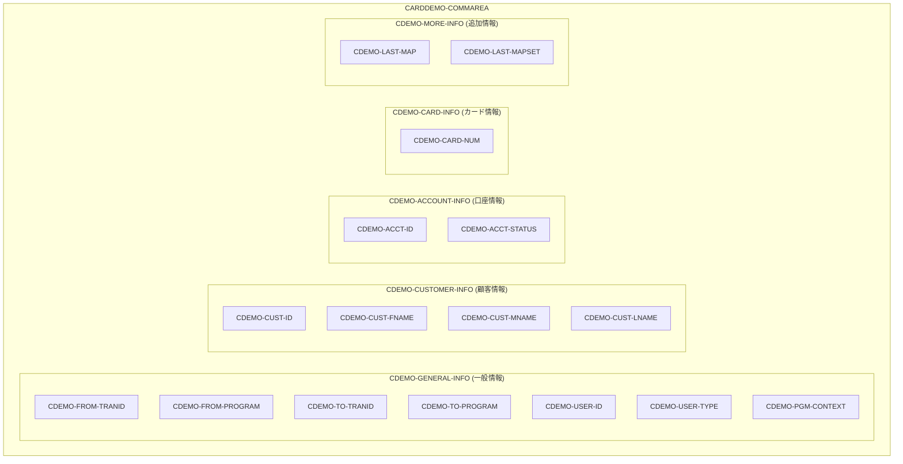
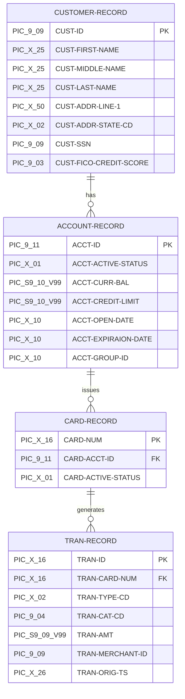
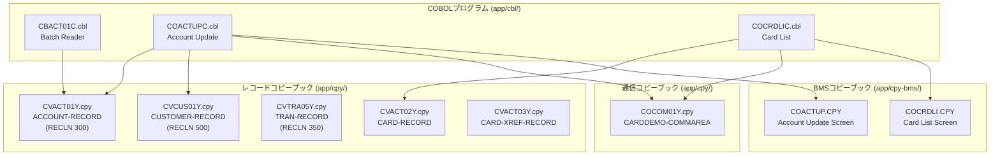

# データ契約 (Data Contracts)

## CardDemo COBOL/CICS アプリケーション コードスタイルカタログ

本文書は、CardDemo メインフレームアプリケーションにおけるデータ契約パターンを定義します。コピーブック構造、レコードレイアウト、PIC句規約、COMMAREA契約などのデータ定義パターンを含みます。

---

## 目次

- [必須パターン (MUST)](#必須パターン-must)
  - [コピーブック構造](#コピーブック構造)
  - [01レベルレコード定義](#01レベルレコード定義)
  - [RECLN文書化](#recln文書化)
  - [FILLERパディング規則](#fillerパディング規則)
  - [PIC句形式](#pic句形式)
  - [COMMAREA契約](#commarea契約)
  - [FDレコード定義](#fdレコード定義)
- [推奨パターン (SHOULD)](#推奨パターン-should)
  - [REDEFINESオーバーレイ](#redefinesオーバーレイ)
  - [S9(n)V99小数形式](#s9nv99小数形式)
- [データモデル関連図](#データモデル関連図)
- [相互参照](#相互参照)

---

## 必須パターン (MUST)

以下のパターンは**必須**です。違反は自動却下となります。

---

### コピーブック構造

```yaml
パターン名: コピーブック構造
優先度: MUST
カテゴリ: データベース
ファイルパス: app/cpy/COCOM01Y.cpy:1-19
スニペット: |
   ******************************************************************
   * Communication area for CardDemo application programs
   ******************************************************************
   * Copyright Amazon.com, Inc. or its affiliates.                   
   * All Rights Reserved.                                            
   *                                                                 
   * Licensed under the Apache License, Version 2.0 (the "License"). 
   * You may not use this file except in compliance with the License.
   * You may obtain a copy of the License at                         
   *                                                                 
   *    http://www.apache.org/licenses/LICENSE-2.0                   
   *                                                                 
   * Unless required by applicable law or agreed to in writing,      
   * software distributed under the License is distributed on an     
   * "AS IS" BASIS, WITHOUT WARRANTIES OR CONDITIONS OF ANY KIND,    
   * either express or implied. See the License for the specific     
   * language governing permissions and limitations under the License
   ****************************************************************** 
    01 CARDDEMO-COMMAREA.
検証基準:
  - Apache-2.0 ライセンスヘッダーを含めること
  - 目的を説明するコメントブロックを含めること
  - 01レベルでメイン構造を定義すること
  - ファイル末尾にバージョンタグを含めること
根拠: 法的コンプライアンス（Apache-2.0）およびインターフェース契約の明確な文書化のため
```

**コピーブックヘッダー例 (CVACT01Y):**

```cobol
      *****************************************************************
      *    Data-structure for  account entity (RECLN 300)
      *****************************************************************
       01  ACCOUNT-RECORD.
```

**Source:** `app/cpy/CVACT01Y.cpy:1-4`

---

### 01レベルレコード定義

```yaml
パターン名: 01レベルレコード定義
優先度: MUST
カテゴリ: データベース
ファイルパス: app/cpy/CVACT01Y.cpy:4-17
スニペット: |
    01  ACCOUNT-RECORD.
        05  ACCT-ID                           PIC 9(11).
        05  ACCT-ACTIVE-STATUS                PIC X(01).
        05  ACCT-CURR-BAL                     PIC S9(10)V99.
        05  ACCT-CREDIT-LIMIT                 PIC S9(10)V99.
        05  ACCT-CASH-CREDIT-LIMIT            PIC S9(10)V99.
        05  ACCT-OPEN-DATE                    PIC X(10).
        05  ACCT-EXPIRAION-DATE               PIC X(10). 
        05  ACCT-REISSUE-DATE                 PIC X(10).
        05  ACCT-CURR-CYC-CREDIT              PIC S9(10)V99.
        05  ACCT-CURR-CYC-DEBIT               PIC S9(10)V99.
        05  ACCT-ADDR-ZIP                     PIC X(10).
        05  ACCT-GROUP-ID                     PIC X(10).
        05  FILLER                            PIC X(178).
検証基準:
  - メインレコードは 01 レベルで定義すること
  - フィールドは 05 レベルで定義すること
  - 各フィールドに適切な PIC 句を指定すること
  - レコード長を RECLN に合わせるため FILLER でパディングすること
根拠: 一貫したレコード構造によりすべてのデータ定義の保守性を向上させる
```

**顧客レコード例 (CVCUS01Y):**

```cobol
       01  CUSTOMER-RECORD.
           05  CUST-ID                                 PIC 9(09).
           05  CUST-FIRST-NAME                         PIC X(25).
           05  CUST-MIDDLE-NAME                        PIC X(25).
           05  CUST-LAST-NAME                          PIC X(25).
           05  CUST-ADDR-LINE-1                        PIC X(50).
           ...
           05  FILLER                                  PIC X(168).
```

**Source:** `app/cpy/CVCUS01Y.cpy:4-23`

---

### RECLN文書化

```yaml
パターン名: RECLN文書化
優先度: MUST
カテゴリ: データベース
ファイルパス: app/cpy/CVACT01Y.cpy:1-3
スニペット: |
   *****************************************************************
   *    Data-structure for  account entity (RECLN 300)
   *****************************************************************
検証基準:
  - コメントブロックにレコード長をバイト単位で明記すること
  - 形式: (RECLN nnn) を使用すること
  - エンティティの目的を説明する記述を含めること
根拠: インターフェース契約としてレコードサイズを明確に文書化し、VSAM レコード定義との整合性を確保する
```

**RECLN文書化例:**

| コピーブック | RECLN | 説明 |
|--------------|-------|------|
| `CVACT01Y.cpy` | 300 | ACCOUNT-RECORD |
| `CVCUS01Y.cpy` | 500 | CUSTOMER-RECORD |
| `CVTRA05Y.cpy` | 350 | TRAN-RECORD |

**トランザクションレコード例 (CVTRA05Y):**

```cobol
      *****************************************************************         
      *    Data-structure for TRANsaction record (RECLN = 350)                  
      *****************************************************************         
       01  TRAN-RECORD.
```

**Source:** `app/cpy/CVTRA05Y.cpy:1-4`

---

### FILLERパディング規則

```yaml
パターン名: FILLERパディング規則
優先度: MUST
カテゴリ: データベース
ファイルパス: app/cpy/CVACT01Y.cpy:17
スニペット: |
        05  FILLER                            PIC X(178).
検証基準:
  - レコード末尾に FILLER を配置して正確な RECLN に合わせること
  - FILLER のサイズ = RECLN - (すべてのフィールドサイズの合計)
  - FILLER には PIC X(nnn) を使用すること
根拠: VSAM 固定長レコードとの互換性を確保し、レコード長不一致によるファイルエラーを防止する
```

**FILLER計算例 (ACCOUNT-RECORD):**

| フィールド | サイズ (バイト) |
|------------|----------------|
| ACCT-ID | 11 |
| ACCT-ACTIVE-STATUS | 1 |
| ACCT-CURR-BAL | 12 (S9(10)V99) |
| ACCT-CREDIT-LIMIT | 12 |
| ACCT-CASH-CREDIT-LIMIT | 12 |
| ACCT-OPEN-DATE | 10 |
| ACCT-EXPIRAION-DATE | 10 |
| ACCT-REISSUE-DATE | 10 |
| ACCT-CURR-CYC-CREDIT | 12 |
| ACCT-CURR-CYC-DEBIT | 12 |
| ACCT-ADDR-ZIP | 10 |
| ACCT-GROUP-ID | 10 |
| **小計** | **122** |
| FILLER | 178 |
| **合計 (RECLN)** | **300** |

**Source:** `app/cpy/CVACT01Y.cpy:5-17`

---

### PIC句形式

```yaml
パターン名: PIC句形式
優先度: MUST
カテゴリ: データベース
ファイルパス: app/cpy/CVACT01Y.cpy:5-16
スニペット: |
        05  ACCT-ID                           PIC 9(11).
        05  ACCT-ACTIVE-STATUS                PIC X(01).
        05  ACCT-CURR-BAL                     PIC S9(10)V99.
        05  ACCT-CREDIT-LIMIT                 PIC S9(10)V99.
        05  ACCT-OPEN-DATE                    PIC X(10).
        05  CUST-FICO-CREDIT-SCORE            PIC 9(03).
検証基準:
  - 数値には PIC 9(n) を使用すること
  - 英数字には PIC X(n) を使用すること
  - 符号付き数値には PIC S9(n) を使用すること
  - 小数には V を使用すること（例: S9(10)V99）
  - 桁数は括弧内に指定すること（例: 9(11), X(25)）
根拠: 標準 COBOL データ型規約によりデータの整合性と相互運用性を確保する
```

**PIC句タイプ一覧:**

| PIC形式 | 説明 | 例 | 使用場面 |
|---------|------|-----|----------|
| `PIC 9(n)` | 符号なし数値 | `PIC 9(11)` | ID、コード |
| `PIC X(n)` | 英数字 | `PIC X(25)` | 名前、説明 |
| `PIC S9(n)` | 符号付き数値 | `PIC S9(10)` | 数量、カウント |
| `PIC S9(n)V99` | 符号付き小数 | `PIC S9(10)V99` | 金額 |
| `PIC 9(n)V99` | 符号なし小数 | `PIC 9(5)V99` | 正の金額 |

**トランザクションレコード例 (CVTRA05Y):**

```cobol
        05  TRAN-ID                                 PIC X(16).
        05  TRAN-TYPE-CD                            PIC X(02).
        05  TRAN-CAT-CD                             PIC 9(04).
        05  TRAN-SOURCE                             PIC X(10).
        05  TRAN-DESC                               PIC X(100).
        05  TRAN-AMT                                PIC S9(09)V99.
```

**Source:** `app/cpy/CVTRA05Y.cpy:5-10`

---

### COMMAREA契約

```yaml
パターン名: COMMAREA契約
優先度: MUST
カテゴリ: データベース
ファイルパス: app/cpy/COCOM01Y.cpy:19-44
スニペット: |
    01 CARDDEMO-COMMAREA.
       05 CDEMO-GENERAL-INFO.
          10 CDEMO-FROM-TRANID             PIC X(04).
          10 CDEMO-FROM-PROGRAM            PIC X(08).
          10 CDEMO-TO-TRANID               PIC X(04).
          10 CDEMO-TO-PROGRAM              PIC X(08).
          10 CDEMO-USER-ID                 PIC X(08).
          10 CDEMO-USER-TYPE               PIC X(01).
             88 CDEMO-USRTYP-ADMIN         VALUE 'A'.
             88 CDEMO-USRTYP-USER          VALUE 'U'.
          10 CDEMO-PGM-CONTEXT             PIC 9(01).
             88 CDEMO-PGM-ENTER            VALUE 0.
             88 CDEMO-PGM-REENTER          VALUE 1.
       05 CDEMO-CUSTOMER-INFO.
          10 CDEMO-CUST-ID                 PIC 9(09).
          ...
       05 CDEMO-ACCOUNT-INFO.
          10 CDEMO-ACCT-ID                 PIC 9(11).
          ...
検証基準:
  - プログラム間通信エリアを定義すること
  - FROM/TO プログラム識別子を含めること
  - ユーザーコンテキスト情報を含めること
  - 88レベル条件名でステータス値を定義すること
  - 論理的にグループ化された 05 レベルセクションを使用すること
根拠: CICS プログラム間通信のインターフェース契約として機能し、ナビゲーションとコンテキスト管理を実現する
```

**COMMAREA構造:**



**Source:** `app/cpy/COCOM01Y.cpy:19-44`

---

### FDレコード定義

```yaml
パターン名: FDレコード定義
優先度: MUST
カテゴリ: データベース
ファイルパス: app/cbl/CBACT01C.cbl:36-40
スニペット: |
    DATA DIVISION.
    FILE SECTION.
    FD  ACCTFILE-FILE.
    01  FD-ACCTFILE-REC.
        05 FD-ACCT-ID                        PIC 9(11).
        05 FD-ACCT-DATA                      PIC X(289).
検証基準:
  - FD (File Description) は SELECT 文と一致すること
  - 01 レベルでレコード構造を定義すること
  - キーフィールドを先頭に配置すること
  - FD- 接頭辞を使用してフィールド名を区別すること
根拠: VSAM アクセスのためのファイル記述契約を定義し、SELECT 文との整合性を確保する
```

**FILE-CONTROL と FD の対応:**

```cobol
       FILE-CONTROL.
           SELECT ACCTFILE-FILE ASSIGN TO ACCTFILE
                  ORGANIZATION IS INDEXED
                  ACCESS MODE  IS SEQUENTIAL
                  RECORD KEY   IS FD-ACCT-ID
                  FILE STATUS  IS ACCTFILE-STATUS.

       DATA DIVISION.
       FILE SECTION.
       FD  ACCTFILE-FILE.
       01  FD-ACCTFILE-REC.
           05 FD-ACCT-ID                        PIC 9(11).
           05 FD-ACCT-DATA                      PIC X(289).
```

**Source:** `app/cbl/CBACT01C.cbl:28-40`

**FD と COPY の連携パターン:**

```cobol
       WORKING-STORAGE SECTION.
      *****************************************************************
       COPY CVACT01Y.
```

**解説:** FD で最小限のレコード定義を行い、WORKING-STORAGE で COPY 文によりコピーブックの完全なレコード構造を取り込む。これにより、READ ... INTO 構文で FD から WORKING-STORAGE へデータを転送できる。

**Source:** `app/cbl/CBACT01C.cbl:42-45`

---

## 推奨パターン (SHOULD)

以下のパターンは**推奨**です。デフォルトで適用され、逸脱には文書化された正当化理由が必要です。

---

### REDEFINESオーバーレイ

```yaml
パターン名: REDEFINESオーバーレイ
優先度: SHOULD
カテゴリ: データベース
ファイルパス: app/cbl/COACTUPC.cbl:83-99
スニペット: |
        10 WS-EDIT-US-PHONE-NUM                 PIC X(15).
        10 WS-EDIT-US-PHONE-NUM-X REDEFINES
           WS-EDIT-US-PHONE-NUM.
           20 FILLER                            PIC X(1).
           20 WS-EDIT-US-PHONE-NUMA             PIC X(3).
           20 WS-EDIT-US-PHONE-NUMA-N REDEFINES
              WS-EDIT-US-PHONE-NUMA             PIC 9(3).
           20 FILLER                            PIC X(1).
           20 WS-EDIT-US-PHONE-NUMB             PIC X(3).
           20 WS-EDIT-US-PHONE-NUMB-N REDEFINES
              WS-EDIT-US-PHONE-NUMB             PIC 9(3).
           20 FILLER                            PIC X(1).
           20 WS-EDIT-US-PHONE-NUMC             PIC X(4).
           20 WS-EDIT-US-PHONE-NUMC-N REDEFINES
              WS-EDIT-US-PHONE-NUMC             PIC 9(4).
           20 FILLER                            PIC X(2).
検証基準:
  - 同一ストレージへの型別アクセスに REDEFINES を使用すること
  - REDEFINES するフィールドは元フィールドと同じサイズであること
  - -X, -N などの接尾辞で用途を明示すること
根拠: 効率的なメモリ使用と、同一データへの複数型アクセスを実現する
```

**BMS コピーブックでの REDEFINES (AI/AO パターン):**

```cobol
       01  CACTUPAI.
           02  FILLER PIC X(12).
           02  TRNNAMEL    COMP  PIC  S9(4).
           02  TRNNAMEF    PICTURE X.
           02  FILLER REDEFINES TRNNAMEF.
             03 TRNNAMEA    PICTURE X.
           02  FILLER   PICTURE X(4).
           02  TRNNAMEI  PIC X(4).
           ...
       01  CACTUPAO REDEFINES CACTUPAI.
           02  FILLER PIC X(12).
           02  FILLER PICTURE X(3).
           02  TRNNAMEC    PICTURE X.
           02  TRNNAMEP    PICTURE X.
           02  TRNNAMEH    PICTURE X.
           02  TRNNAMEV    PICTURE X.
           02  TRNNAMEO  PIC X(4).
```

**Source:** `app/cpy-bms/COACTUP.CPY:17-24, 343-350`

**解説:** BMS コピーブックでは、入力ビュー (AI) と出力ビュー (AO) を REDEFINES で定義する。詳細は [bms-patterns.md](bms-patterns.md) を参照。

---

### S9(n)V99小数形式

```yaml
パターン名: S9(n)V99小数形式
優先度: SHOULD
カテゴリ: データベース
ファイルパス: app/cpy/CVACT01Y.cpy:7-9
スニペット: |
        05  ACCT-CURR-BAL                     PIC S9(10)V99.
        05  ACCT-CREDIT-LIMIT                 PIC S9(10)V99.
        05  ACCT-CASH-CREDIT-LIMIT            PIC S9(10)V99.
検証基準:
  - 金額フィールドには PIC S9(10)V99 を使用すること
  - S (符号) を含めて正負両方の値を扱えること
  - V (仮想小数点) を使用して小数点位置を固定すること
  - 99 で小数2桁を確保すること（セント単位）
根拠: 通貨表現の標準形式として、符号付き金額と一貫した小数位置を確保する
```

**金額フィールド例:**

| フィールド | PIC句 | 説明 |
|------------|-------|------|
| ACCT-CURR-BAL | S9(10)V99 | 現在残高（正負可） |
| ACCT-CREDIT-LIMIT | S9(10)V99 | 与信限度額 |
| ACCT-CURR-CYC-CREDIT | S9(10)V99 | 当期クレジット |
| ACCT-CURR-CYC-DEBIT | S9(10)V99 | 当期デビット |
| TRAN-AMT | S9(09)V99 | 取引金額 |

**トランザクション金額例 (CVTRA05Y):**

```cobol
        05  TRAN-AMT                                PIC S9(09)V99.
```

**Source:** `app/cpy/CVTRA05Y.cpy:10`

---

## データモデル関連図

以下の図は、CardDemo アプリケーションの主要なデータエンティティ間の関係を示します。



### コピーブック関連図



---

## 相互参照

### 関連ドキュメント

| ドキュメント | 関連内容 |
|--------------|----------|
| [architecture-patterns.md](architecture-patterns.md) | プログラム構造、COPY文使用パターン |
| [bms-patterns.md](bms-patterns.md) | AI/AO二重ビューパターン、BMSコピーブック構造 |
| [naming-conventions.md](naming-conventions.md) | コピーブック命名規則 (CV*, CS*, CO*) |
| [validation-patterns.md](validation-patterns.md) | 88レベル条件名パターン |
| [error-handling.md](error-handling.md) | FILE STATUS ハンドリング |

### コピーブックソースファイル一覧

| コピーブック | パス | RECLN | 説明 |
|--------------|------|-------|------|
| CVACT01Y | `app/cpy/CVACT01Y.cpy` | 300 | 口座レコード |
| CVACT02Y | `app/cpy/CVACT02Y.cpy` | - | カードレコード |
| CVACT03Y | `app/cpy/CVACT03Y.cpy` | - | カード相互参照 |
| CVCUS01Y | `app/cpy/CVCUS01Y.cpy` | 500 | 顧客レコード |
| CVTRA01Y-07Y | `app/cpy/CVTRA*.cpy` | 350 | トランザクション関連 |
| COCOM01Y | `app/cpy/COCOM01Y.cpy` | - | COMMAREA |
| CSMSG01Y | `app/cpy/CSMSG01Y.cpy` | - | メッセージ定義 |
| CSMSG02Y | `app/cpy/CSMSG02Y.cpy` | - | ABEND構造 |

---

<!-- Ver: CodeStyleCatalog_v1.0 Date: 2024 -->
