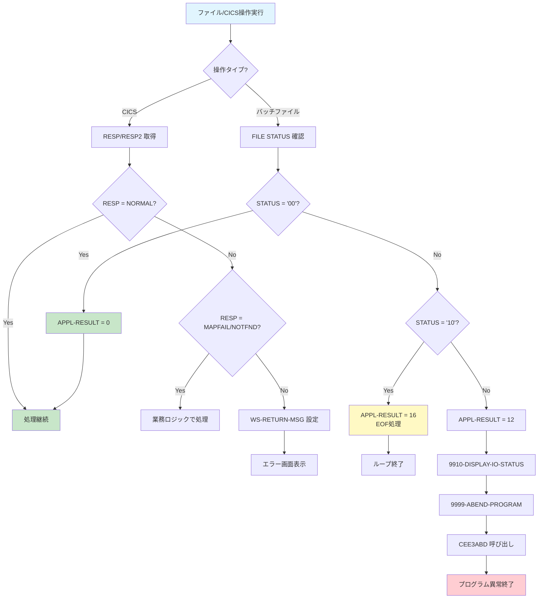
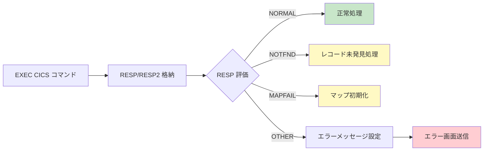
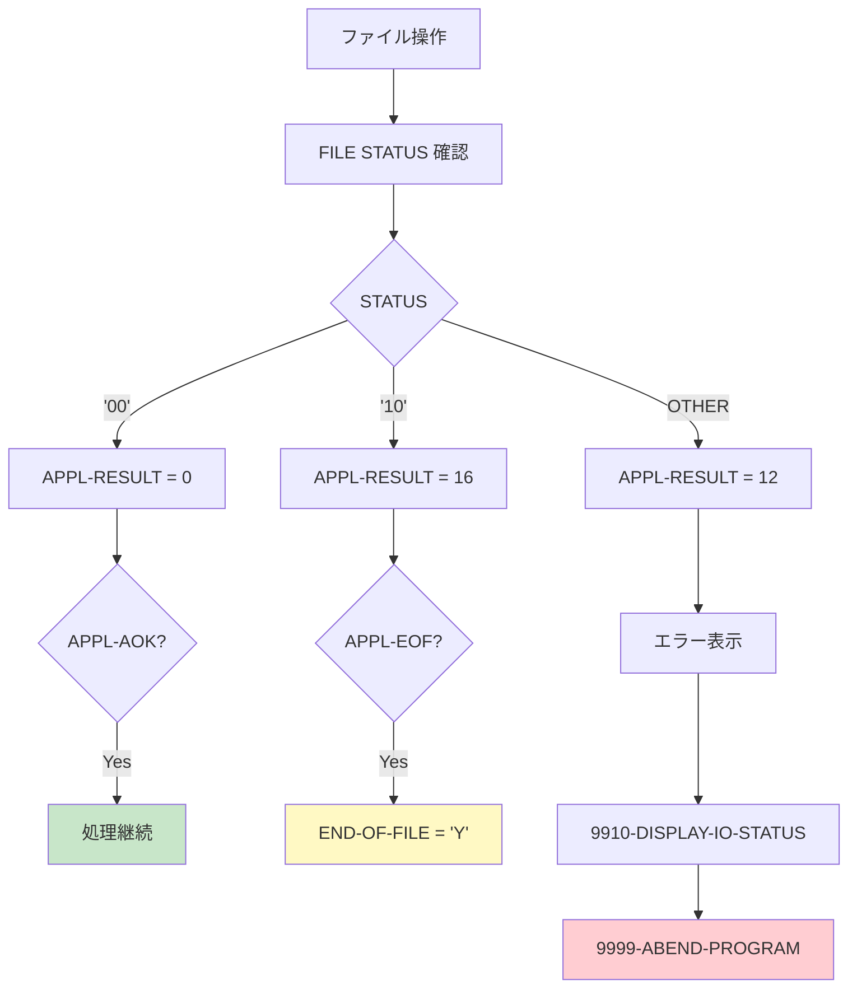

# エラー処理 (Error Handling)

## CardDemo COBOL/CICS アプリケーション コードスタイルカタログ

本文書は、CardDemo メインフレームアプリケーションにおけるエラー処理パターンを定義します。すべてのコード生成は、本カタログのパターンに従う必要があります。

---

## 目次

- [必須パターン (MUST)](#必須パターン-must)
  - [CICS-RESP-RESP2-エラーハンドリング](#cics-resp-resp2-エラーハンドリング)
  - [バッチAPPL-RESULTコード](#バッチappl-resultコード)
  - [FILE STATUS処理](#file-status処理)
- [推奨パターン (SHOULD)](#推奨パターン-should)
  - [9910-DISPLAY-IO-STATUS](#9910-display-io-status)
  - [WS-RETURN-MSGメッセージング](#ws-return-msgメッセージング)
  - [9999-ABEND-PROGRAMパターン](#9999-abend-programパターン)
  - [ABEND-DATA構造](#abend-data構造)
- [エラー処理決定フロー図](#エラー処理決定フロー図)
- [関連ドキュメント](#関連ドキュメント)

---

## 必須パターン (MUST)

以下のパターンは**必須**です。違反は自動却下となります。

---

### CICS-RESP-RESP2-エラーハンドリング

```yaml
パターン名: CICS-RESP-RESP2-エラーハンドリング
優先度: MUST
カテゴリ: エラー処理
ファイルパス: app/cbl/COACTUPC.cbl:1040-1045
スニペット: |
  EXEC CICS RECEIVE MAP(LIT-THISMAP)
            MAPSET(LIT-THISMAPSET)
            INTO(CACTUPAI)
            RESP(WS-RESP-CD)
            RESP2(WS-REAS-CD)
  END-EXEC
検証基準:
  - すべての EXEC CICS コマンドに RESP パラメータを含めること
  - RESP と RESP2 の両方を常に取得すること
  - RESP コードを WS-RESP-CD に格納すること
  - RESP2 コードを WS-REAS-CD に格納すること
根拠: CICS API エラーを確実に捕捉し、適切なエラー処理を可能にするため。RESP のみでは詳細なエラー原因が特定できないケースがあり、RESP2 と組み合わせることで完全な診断情報を取得できる。
```

**WORKING-STORAGE SECTION でのレスポンスコード変数定義:**

```cobol
       01  WS-MISC-STORAGE.
      ******************************************************************
      * General CICS related
      ******************************************************************
          05 WS-CICS-PROCESSNG-VARS.
             07 WS-RESP-CD                          PIC S9(09) COMP
                                                    VALUE ZEROS.
             07 WS-REAS-CD                          PIC S9(09) COMP
                                                    VALUE ZEROS.
```

**Source:** `app/cbl/COACTUPC.cbl:35-43`

**レスポンスコードの評価例:**

```cobol
       EVALUATE TRUE
           WHEN WS-RESP-CD = DFHRESP(NORMAL)
               CONTINUE
           WHEN WS-RESP-CD = DFHRESP(MAPFAIL)
               SET ACUP-DETAILS-NOT-FETCHED TO TRUE
           WHEN OTHER
               MOVE 'Error receiving map' TO WS-RETURN-MSG
               PERFORM 9999-HANDLE-CICS-ERROR
       END-EVALUATE
```

**一般的な CICS RESP コード:**

| RESP コード | 定数名 | 意味 |
|------------|--------|------|
| 0 | DFHRESP(NORMAL) | 正常完了 |
| 12 | DFHRESP(FILENOTFOUND) | ファイルが見つからない |
| 13 | DFHRESP(NOTFND) | レコードが見つからない |
| 17 | DFHRESP(ENDFILE) | ファイル終端 |
| 22 | DFHRESP(DUPKEY) | 重複キー |
| 26 | DFHRESP(INVREQ) | 無効な要求 |
| 36 | DFHRESP(MAPFAIL) | マップ失敗 |

---

### バッチAPPL-RESULTコード

```yaml
パターン名: バッチAPPL-RESULTコード
優先度: MUST
カテゴリ: エラー処理
ファイルパス: app/cbl/CBACT01C.cbl:61-64
スニペット: |
  01  APPL-RESULT             PIC S9(9)   COMP.
      88  APPL-AOK            VALUE 0.
      88  APPL-EOF            VALUE 16.
検証基準:
  - 0 (APPL-AOK): 正常完了
  - 16 (APPL-EOF): ファイル終端到達
  - 12: エラー発生
  - 88 レベル条件名を使用して判定すること
  - すべてのファイル操作後に APPL-RESULT を設定すること
根拠: すべてのバッチプログラムで一貫したリターンコードセマンティクスを実現。88 レベル条件名により、コードの可読性と保守性が向上する。
```

**APPL-RESULT を使用したファイル操作例:**

```cobol
       1000-ACCTFILE-GET-NEXT.
           READ ACCTFILE-FILE INTO ACCOUNT-RECORD.
           IF  ACCTFILE-STATUS = '00'
               MOVE 0 TO APPL-RESULT
               PERFORM 1100-DISPLAY-ACCT-RECORD
           ELSE
               IF  ACCTFILE-STATUS = '10'
                   MOVE 16 TO APPL-RESULT
               ELSE
                   MOVE 12 TO APPL-RESULT
               END-IF
           END-IF
           IF  APPL-AOK
               CONTINUE
           ELSE
               IF  APPL-EOF
                   MOVE 'Y' TO END-OF-FILE
               ELSE
                   DISPLAY 'ERROR READING ACCOUNT FILE'
                   MOVE ACCTFILE-STATUS TO IO-STATUS
                   PERFORM 9910-DISPLAY-IO-STATUS
                   PERFORM 9999-ABEND-PROGRAM
               END-IF
           END-IF
           EXIT.
```

**Source:** `app/cbl/CBACT01C.cbl:92-116`

**APPL-RESULT コード体系:**

| コード | 意味 | アクション |
|--------|------|-----------|
| 0 | 正常完了 | 処理継続 |
| 8 | 初期状態/未処理 | 処理待ち |
| 12 | エラー発生 | エラー処理実行 |
| 16 | EOF 到達 | ループ終了 |

---

### FILE STATUS処理

```yaml
パターン名: FILE STATUS処理
優先度: MUST
カテゴリ: エラー処理
ファイルパス: app/cbl/CBACT01C.cbl:46-59
スニペット: |
  01  ACCTFILE-STATUS.
      05  ACCTFILE-STAT1      PIC X.
      05  ACCTFILE-STAT2      PIC X.

  01  IO-STATUS.
      05  IO-STAT1            PIC X.
      05  IO-STAT2            PIC X.
  01  TWO-BYTES-BINARY        PIC 9(4) BINARY.
  01  TWO-BYTES-ALPHA         REDEFINES TWO-BYTES-BINARY.
      05  TWO-BYTES-LEFT      PIC X.
      05  TWO-BYTES-RIGHT     PIC X.
  01  IO-STATUS-04.
      05  IO-STATUS-0401      PIC 9   VALUE 0.
      05  IO-STATUS-0403      PIC 999 VALUE 0.
検証基準:
  - すべての SELECT 文に FILE STATUS 句を指定すること
  - ファイルステータスは2バイト構造で定義すること（STAT1 + STAT2）
  - '00' は成功を示す
  - '10' はファイル終端（EOF）を示す
  - すべてのファイル操作後にステータスを確認すること
  - バイナリステータス変換用の構造を用意すること
根拠: ファイル操作ステータスの確実な検出。2バイト分解によりバイナリフォーマットのステータスコードも正確に解釈できる。
```

**SELECT 文での FILE STATUS 指定例:**

```cobol
       FILE-CONTROL.
           SELECT ACCTFILE-FILE ASSIGN TO ACCTFILE
                  ORGANIZATION IS INDEXED
                  ACCESS MODE  IS SEQUENTIAL
                  RECORD KEY   IS FD-ACCT-ID
                  FILE STATUS  IS ACCTFILE-STATUS.
```

**Source:** `app/cbl/CBACT01C.cbl:28-33`

**複数ファイルでの FILE STATUS 定義:**

```cobol
       01  TRNXFILE-STATUS.
           05  TRNXFILE-STAT1      PIC X.
           05  TRNXFILE-STAT2      PIC X.

       01  XREFFILE-STATUS.
           05  XREFFILE-STAT1      PIC X.
           05  XREFFILE-STAT2      PIC X.

       01  CUSTFILE-STATUS.
           05  CUSTFILE-STAT1      PIC X.
           05  CUSTFILE-STAT2      PIC X.

       01  ACCTFILE-STATUS.
           05  ACCTFILE-STAT1      PIC X.
           05  ACCTFILE-STAT2      PIC X.
```

**Source:** `app/cbl/CBSTM03B.CBL:83-97`

**主要な FILE STATUS コード:**

| コード | 意味 |
|--------|------|
| 00 | 正常完了 |
| 02 | 重複キー（正常） |
| 10 | ファイル終端 |
| 22 | 重複キー（エラー） |
| 23 | レコード未発見 |
| 35 | ファイル未発見 |
| 39 | 属性不一致 |
| 9x | I/O エラー（VSAM 固有） |

---

## 推奨パターン (SHOULD)

以下のパターンは**推奨**です。デフォルトで適用し、逸脱には文書化された正当な理由が必要です。

---

### 9910-DISPLAY-IO-STATUS

```yaml
パターン名: 9910-DISPLAY-IO-STATUS
優先度: SHOULD
カテゴリ: エラー処理
ファイルパス: app/cbl/CBACT01C.cbl:176-189
スニペット: |
  9910-DISPLAY-IO-STATUS.
      IF  IO-STATUS NOT NUMERIC
      OR  IO-STAT1 = '9'
          MOVE IO-STAT1 TO IO-STATUS-04(1:1)
          MOVE 0        TO TWO-BYTES-BINARY
          MOVE IO-STAT2 TO TWO-BYTES-RIGHT
          MOVE TWO-BYTES-BINARY TO IO-STATUS-0403
          DISPLAY 'FILE STATUS IS: NNNN' IO-STATUS-04
      ELSE
          MOVE '0000' TO IO-STATUS-04
          MOVE IO-STATUS TO IO-STATUS-04(3:2)
          DISPLAY 'FILE STATUS IS: NNNN' IO-STATUS-04
      END-IF
      EXIT.
検証基準:
  - 段落番号 9910 を使用すること
  - ステータスを 4 桁 NNNN 形式でフォーマットすること
  - バイナリステータス（'9x'）を適切に変換すること
  - 診断用に DISPLAY 文を使用すること
根拠: トラブルシューティングのための標準化されたエラー診断出力。バイナリフォーマットのVSAMステータスも正確に表示できる。
```

**使用例（エラー発生時の呼び出し）:**

```cobol
       ELSE
           DISPLAY 'ERROR READING ACCOUNT FILE'
           MOVE ACCTFILE-STATUS TO IO-STATUS
           PERFORM 9910-DISPLAY-IO-STATUS
           PERFORM 9999-ABEND-PROGRAM
       END-IF
```

**Source:** `app/cbl/CBACT01C.cbl:110-113`

> **参照:** 段落番号規則については [アーキテクチャパターン - 段落番号規則](architecture-patterns.md#段落番号規則) を参照してください。

---

### WS-RETURN-MSGメッセージング

```yaml
パターン名: WS-RETURN-MSGメッセージング
優先度: SHOULD
カテゴリ: エラー処理
ファイルパス: app/cbl/COACTUPC.cbl:479-528
スニペット: |
  05  WS-RETURN-MSG                         PIC X(75).
    88  WS-RETURN-MSG-OFF                   VALUE SPACES.
    88  WS-EXIT-MESSAGE                     VALUE
        'PF03 pressed.Exiting              '.
    88  WS-PROMPT-FOR-ACCT                  VALUE
        'Account number not provided'.
    88  NO-CHANGES-DETECTED                 VALUE
        'No change detected with respect to values fetched.'.
    88  SEARCHED-ACCT-NOT-NUMERIC           VALUE
        'Account number must be a non zero 11 digit number'.
検証基準:
  - CICS プログラムではユーザー向けメッセージに WS-RETURN-MSG を使用すること
  - 88 レベル条件名で定型メッセージを定義すること
  - メッセージ組み立てには STRING 文を使用すること
  - メッセージ上書き防止のため WS-RETURN-MSG-OFF を確認すること
根拠: CICS プログラムにおける一貫したユーザーエラーメッセージ表示。88 レベル条件名によりメッセージの一元管理と可読性が向上する。
```

**STRING を使用した動的メッセージ組み立て:**

```cobol
       IF WS-RETURN-MSG-OFF
          STRING
            FUNCTION TRIM(WS-EDIT-VARIABLE-NAME)
            ' must be supplied.'
            DELIMITED BY SIZE
            INTO WS-RETURN-MSG
          END-STRING
       END-IF
```

**Source:** `app/cbl/COACTUPC.cbl:1838-1845`

**検証エラー時のメッセージ設定例:**

```cobol
       IF WS-RETURN-MSG-OFF
         STRING
          'Account Number if supplied must be a 11 digit'
          ' Non-Zero Number'
         DELIMITED BY SIZE
         INTO WS-RETURN-MSG
       END-IF
```

**Source:** `app/cbl/COACTUPC.cbl:1805-1811`

**画面へのメッセージ出力:**

```cobol
       MOVE WS-RETURN-MSG  TO CCARD-ERROR-MSG
```

**Source:** `app/cbl/COACTUPC.cbl:1030`

---

### 9999-ABEND-PROGRAMパターン

```yaml
パターン名: 9999-ABEND-PROGRAMパターン
優先度: SHOULD
カテゴリ: エラー処理
ファイルパス: app/cbl/CBACT01C.cbl:169-173
スニペット: |
  9999-ABEND-PROGRAM.
      DISPLAY 'ABENDING PROGRAM'
      MOVE 0 TO TIMING
      MOVE 999 TO ABCODE
      CALL 'CEE3ABD'.
検証基準:
  - 段落番号 9999 を異常終了処理専用とすること
  - 異常終了前に 'ABENDING PROGRAM' を DISPLAY すること
  - Language Environment (LE) の CEE3ABD を呼び出すこと
  - ABCODE に適切なエラーコードを設定すること
  - TIMING = 0 で即時終了を指定すること
根拠: LE 統合による一貫した異常終了処理。CEE3ABD により、ダンプ出力とリソース解放が適切に行われる。
```

**必要な変数定義:**

```cobol
       01  ABCODE                  PIC S9(9) BINARY.
       01  TIMING                  PIC S9(9) BINARY.
```

**Source:** `app/cbl/CBACT01C.cbl:66-67`

**ファイルオープンエラーでの呼び出し例:**

```cobol
       0000-ACCTFILE-OPEN.
           MOVE 8 TO APPL-RESULT.
           OPEN INPUT ACCTFILE-FILE
           IF  ACCTFILE-STATUS = '00'
               MOVE 0 TO APPL-RESULT
           ELSE
               MOVE 12 TO APPL-RESULT
           END-IF
           IF  APPL-AOK
               CONTINUE
           ELSE
               DISPLAY 'ERROR OPENING ACCTFILE'
               MOVE ACCTFILE-STATUS TO IO-STATUS
               PERFORM 9910-DISPLAY-IO-STATUS
               PERFORM 9999-ABEND-PROGRAM
           END-IF
           EXIT.
```

**Source:** `app/cbl/CBACT01C.cbl:133-149`

> **参照:** 段落番号規則については [アーキテクチャパターン - 段落番号規則](architecture-patterns.md#段落番号規則) を参照してください。

---

### ABEND-DATA構造

```yaml
パターン名: ABEND-DATA構造
優先度: SHOULD
カテゴリ: エラー処理
ファイルパス: app/cpy/CSMSG02Y.cpy:21-29
スニペット: |
  01  ABEND-DATA.
    05  ABEND-CODE                            PIC X(4)
        VALUE SPACES.
    05  ABEND-CULPRIT                         PIC X(8)
        VALUE SPACES.
    05  ABEND-REASON                          PIC X(50)
        VALUE SPACES.
    05  ABEND-MSG                             PIC X(72)
        VALUE SPACES.
検証基準:
  - 4 文字の ABEND-CODE を含めること
  - 8 文字の ABEND-CULPRIT（原因プログラム/段落）を含めること
  - 50 文字の ABEND-REASON（詳細理由）を含めること
  - 72 文字の ABEND-MSG（表示用メッセージ）を含めること
  - コピーブック CSMSG02Y として共有すること
根拠: 標準化された異常終了診断情報。どのプログラムでも一貫した形式で異常終了情報を記録・表示できる。
```

**コピーブックのインクルード:**

```cobol
      *Abend Variables
       COPY CSMSG02Y.
```

**Source:** `app/cbl/COACTUPC.cbl:620-621`

**ABEND-DATA の使用例:**

```cobol
       MOVE 'DB01'        TO ABEND-CODE
       MOVE 'READ-ACCT'   TO ABEND-CULPRIT
       MOVE 'VSAM READ ERROR ON ACCOUNT FILE' TO ABEND-REASON
       STRING 'ABEND ' ABEND-CODE ' IN ' ABEND-CULPRIT
              DELIMITED BY SIZE INTO ABEND-MSG
       END-STRING
       PERFORM 9999-ABEND-PROGRAM
```

---

## エラー処理決定フロー図

以下の図は、CardDemo アプリケーションにおけるエラー処理の決定フローを示します。



### CICS エラー処理フロー



### バッチエラー処理フロー



---

## 関連ドキュメント

- [アーキテクチャパターン](architecture-patterns.md) - プログラム構造と段落番号規則
- [データ契約](data-contracts.md) - コピーブック構造とレコードレイアウト
- [検証パターン](validation-patterns.md) - 88レベル条件名と入力検証
- [準拠レポート](compliance-reporting.md) - カタログ準拠確認方法

---

## パターンサマリー

| パターン名 | 優先度 | カテゴリ | 主要ソース |
|-----------|--------|----------|-----------|
| CICS-RESP-RESP2-エラーハンドリング | MUST | エラー処理 | `app/cbl/COACTUPC.cbl` |
| バッチAPPL-RESULTコード | MUST | エラー処理 | `app/cbl/CBACT01C.cbl` |
| FILE STATUS処理 | MUST | エラー処理 | `app/cbl/CBACT01C.cbl` |
| 9910-DISPLAY-IO-STATUS | SHOULD | エラー処理 | `app/cbl/CBACT01C.cbl` |
| WS-RETURN-MSGメッセージング | SHOULD | エラー処理 | `app/cbl/COACTUPC.cbl` |
| 9999-ABEND-PROGRAMパターン | SHOULD | エラー処理 | `app/cbl/CBACT01C.cbl` |
| ABEND-DATA構造 | SHOULD | エラー処理 | `app/cpy/CSMSG02Y.cpy` |

---

<!-- Ver: CodeStyleCatalog_v1.0 Date: 2024 -->
