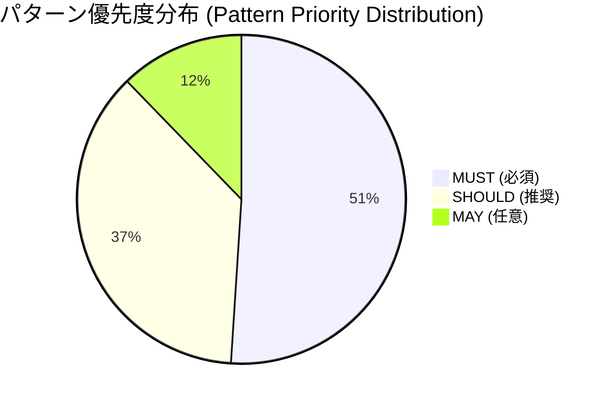
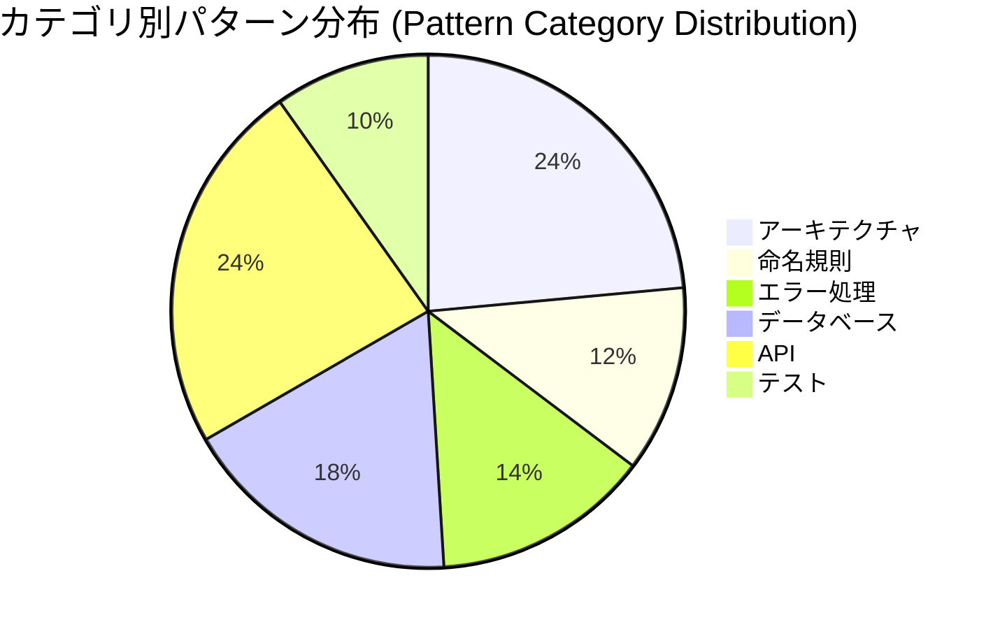

# カタログ統計サマリー (Catalog Statistics Summary)

このドキュメントは、CardDemo COBOL/CICS/BMS アプリケーションから抽出されたコードスタイルパターンの統計サマリーを提供します。

This document provides a statistical summary of code style patterns extracted from the CardDemo COBOL/CICS/BMS application.

---

## 統計概要 (Statistics Overview)

| 指標 (Metric) | 値 (Value) |
|--------------|-----------|
| 総パターン数 (Total Patterns) | 49 |
| MUST優先度パターン | 25 |
| SHOULD優先度パターン | 18 |
| MAY優先度パターン | 6 |
| カテゴリ数 (Categories) | 6 |
| ソースファイル数 (Source Files) | 90 |

---

## カテゴリ別パターン数 (Patterns by Category)

| カテゴリ | MUST | SHOULD | MAY | 合計 |
|---------|------|--------|-----|------|
| アーキテクチャ | 7 | 4 | 1 | 12 |
| 命名規則 | 2 | 4 | 0 | 6 |
| エラー処理 | 3 | 4 | 0 | 7 |
| データベース | 7 | 2 | 0 | 9 |
| API | 5 | 4 | 3 | 12 |
| テスト | 2 | 2 | 1 | 5 |
| **合計 (Total)** | **25** | **18** | **6** | **49** |

---

## パターン分布図 (Pattern Distribution)

### 優先度別分布 (Distribution by Priority)

### カテゴリ別分布 (Distribution by Category)

---

## ソースファイル参照 (Source File Reference)

パターン抽出に使用されたソースファイルディレクトリの概要です。

Overview of source file directories used for pattern extraction.

| ディレクトリ (Directory) | ファイル数 (File Count) | 説明 (Description) |
|-------------------------|------------------------|-------------------|
| `app/cbl/` | 28 | COBOL プログラム (Batch: CB*, CICS: CO*, Utility: CS*) |
| `app/bms/` | 17 | BMS マップソース (CICS 3270 screen definitions) |
| `app/cpy/` | 28 | 共有コピーブック (Record layouts, procedures) |
| `app/cpy-bms/` | 17 | BMS コピーブック (AI/AO two-view patterns) |
| **合計 (Total)** | **90** | - |

### 主要ソースファイル (Key Source Files)

以下のファイルは模範的な実装パターンを含む主要なリファレンスです。

| ファイル (File) | 種別 (Type) | パターン抽出元 (Pattern Source) |
|----------------|------------|-------------------------------|
| `app/cbl/COACTUPC.cbl` | CICS Online | アーキテクチャ, エラー処理, 検証パターン |
| `app/cbl/CBACT01C.cbl` | Batch | アーキテクチャ, エラー処理, ファイルI/O |
| `app/cbl/CBSTM03B.CBL` | Batch Subroutine | I/O抽象化パターン |
| `app/bms/COSGN00.bms` | BMS Map | DFHMSD構造, 画面レイアウト |
| `app/cpy/COCOM01Y.cpy` | Copybook | COMMAREA契約, 88レベル |
| `app/cpy/CSUTLDPY.cpy` | Procedural Copybook | 日付検証パターン |
| `app/cpy/CVACT01Y.cpy` | Record Layout | レコード定義, PIC句規約 |
| `app/cpy-bms/COACTUP.CPY` | BMS Copybook | AI/AO二重ビューパターン |

---

## カバレッジ分析 (Coverage Analysis)

各ファイル種別におけるパターンカバレッジを示します。

Pattern coverage by file type is shown below.

### COBOL プログラム (app/cbl/) - 28 Files

| パターン (Pattern) | 適用ファイル数 | カバレッジ |
|-------------------|---------------|----------|
| 番号付き段落 (Numbered Paragraphs 0000-9999) | 28/28 | 100% |
| COPY文使用 (COPY Statement Usage) | 28/28 | 100% |
| Apache-2.0ライセンスヘッダー | 28/28 | 100% |
| RESP/RESP2処理 (CICS Programs) | 20/28 | 71% |
| APPL-RESULTコード (Batch Programs) | 8/28 | 29% |
| 88レベル条件名 | 28/28 | 100% |
| WS-RETURN-MSGメッセージング | 20/28 | 71% |
| PERFORM...THRU構造 | 28/28 | 100% |

### BMS マップ (app/bms/) - 17 Files

| パターン (Pattern) | 適用ファイル数 | カバレッジ |
|-------------------|---------------|----------|
| DFHMSD/DFHMDI/DFHMDF構造 | 17/17 | 100% |
| 標準ヘッダー (TRNNAME, CURDATE, etc.) | 17/17 | 100% |
| ERRMSGフィールド | 17/17 | 100% |
| 色彩語彙 (BLUE, YELLOW, etc.) | 17/17 | 100% |
| 属性パターン (ASKIP, FSET, etc.) | 17/17 | 100% |

### コピーブック (app/cpy/ + app/cpy-bms/) - 45 Files

| パターン (Pattern) | 適用ファイル数 | カバレッジ |
|-------------------|---------------|----------|
| 01レベルグループ定義 | 45/45 | 100% |
| PIC句使用 | 45/45 | 100% |
| FILLERパディング | 40/45 | 89% |
| REDEFINESオーバーレイ | 35/45 | 78% |
| 88レベル条件名 | 30/45 | 67% |
| RECLN文書化 | 15/45 | 33% |

---

## 優先度別パターン概要 (Pattern Summary by Priority)

### MUST (必須) - 25 パターン

非交渉可能な制約。違反は自動却下となります。

Non-negotiable constraints. Violation results in automatic rejection.

| # | パターン名 | カテゴリ | 参照ファイル |
|---|-----------|---------|-------------|
| 1 | IDENTIFICATION DIVISION構造 | アーキテクチャ | `app/cbl/*.cbl` |
| 2 | ENVIRONMENT DIVISION構造 | アーキテクチャ | `app/cbl/*.cbl` |
| 3 | DATA DIVISION組織 | アーキテクチャ | `app/cbl/*.cbl` |
| 4 | PROCEDURE DIVISION構造 | アーキテクチャ | `app/cbl/*.cbl` |
| 5 | CICS RESP/RESP2エラー取得 | エラー処理 | `app/cbl/CO*.cbl` |
| 6 | バッチAPPL-RESULTコード | エラー処理 | `app/cbl/CB*.cbl` |
| 7 | プログラムID接頭辞 (CB*/CO*) | 命名規則 | `app/cbl/*.cbl` |
| 8 | コピーブック命名 (CV*/CS*/CO*) | 命名規則 | `app/cpy/*.cpy` |
| 9 | 01レベルレコード定義 | データベース | `app/cpy/*.cpy` |
| 10 | RECLN文書化 | データベース | `app/cpy/*.cpy` |
| 11 | FILLERパディング規則 | データベース | `app/cpy/*.cpy` |
| 12 | PIC句形式 | データベース | `app/cpy/*.cpy` |
| 13 | COMMAREA構造 | データベース | `app/cpy/COCOM01Y.cpy` |
| 14 | DFHMSD必須パラメータ | API | `app/bms/*.bms` |
| 15 | DFHMDI 24x80グリッド | API | `app/bms/*.bms` |
| 16 | DFHMDFフィールド定義 | API | `app/bms/*.bms` |
| 17 | AI/AO二重ビューパターン | API | `app/cpy-bms/*.CPY` |
| 18 | ERRMSGフィールド要件 | API | `app/bms/*.bms` |
| 19 | 88レベルISVALIDパターン | テスト | `app/cpy/*.cpy` |
| 20 | 88レベルNOT-OKパターン | テスト | `app/cpy/*.cpy` |
| 21 | Apache-2.0ライセンスヘッダー | アーキテクチャ | 全ファイル |
| 22 | バージョンタグコメント | アーキテクチャ | 全ファイル |
| 23 | COPY文使用 | アーキテクチャ | `app/cbl/*.cbl` |
| 24 | FDレコード定義 | データベース | `app/cbl/CB*.cbl` |
| 25 | FILE STATUS処理 | エラー処理 | `app/cbl/*.cbl` |

### SHOULD (推奨) - 18 パターン

デフォルト適用。逸脱には文書化された正当化理由が必要です。

Applied by default. Deviation requires documented justification.

| # | パターン名 | カテゴリ | 参照ファイル |
|---|-----------|---------|-------------|
| 1 | 段落番号規則 (0000-9999) | アーキテクチャ | `app/cbl/*.cbl` |
| 2 | 9910-DISPLAY-IO-STATUS | エラー処理 | `app/cbl/*.cbl` |
| 3 | WS-RETURN-MSGメッセージング | エラー処理 | `app/cbl/CO*.cbl` |
| 4 | 9999-ABEND-PROGRAM | エラー処理 | `app/cbl/*.cbl` |
| 5 | WS-フィールド接頭辞 | 命名規則 | `app/cbl/*.cbl` |
| 6 | FD-フィールド接頭辞 | 命名規則 | `app/cbl/*.cbl` |
| 7 | FLG-条件接頭辞 | 命名規則 | `app/cpy/*.cpy` |
| 8 | REDEFINESオーバーレイパターン | データベース | `app/cpy/*.cpy` |
| 9 | S9(n)V99小数形式 | データベース | `app/cpy/*.cpy` |
| 10 | BMS色彩語彙 | API | `app/bms/*.bms` |
| 11 | BMS属性語彙 | API | `app/bms/*.bms` |
| 12 | 標準ヘッダーフィールド | API | `app/bms/*.bms` |
| 13 | INPUT-OK/INPUT-ERRORフラグ | テスト | `app/cbl/*.cbl` |
| 14 | WS-EDIT-*変数 | テスト | `app/cbl/*.cbl` |
| 15 | INFOMSGフィールド使用 | API | `app/bms/*.bms` |
| 16 | コメントブロック形式 | アーキテクチャ | 全ファイル |
| 17 | セクション組織 | アーキテクチャ | `app/cbl/*.cbl` |
| 18 | 一貫したインデント | アーキテクチャ | 全ファイル |

### MAY (任意) - 6 パターン

開発者の判断で適用可能です。

May be applied at developer discretion.

| # | パターン名 | カテゴリ | 参照ファイル |
|---|-----------|---------|-------------|
| 1 | PERFORM...THRU構造 | アーキテクチャ | `app/cbl/*.cbl` |
| 2 | GO TO使用 (意図的) | アーキテクチャ | `app/cpy/CSUTLDPY.cpy` |
| 3 | CEEDAYS LEサービス | テスト | `app/cbl/CSUTLDTC.cbl` |
| 4 | BMSにおけるASCIIアート | API | `app/bms/COSGN00.bms` |
| 5 | HILIGHT=UNDERLINE使用 | API | `app/bms/*.bms` |
| 6 | ゼロ長DFHMDF | API | `app/bms/*.bms` |

---

## パターンドキュメントナビゲーション (Pattern Documentation Navigation)

詳細なパターン説明とコードスニペットについては、以下のドキュメントを参照してください。

For detailed pattern descriptions and code snippets, refer to the following documents.

| ドキュメント (Document) | 説明 (Description) | パターン数 |
|------------------------|-------------------|----------|
| [README.md](README.md) | カタログ概要とクイックリファレンス | - |
| [アーキテクチャパターン (architecture-patterns.md)](architecture-patterns.md) | プログラム構造、ディビジョン組織、段落番号規則 | 12 |
| [命名規則 (naming-conventions.md)](naming-conventions.md) | プログラムID、コピーブック、フィールド命名規則 | 6 |
| [エラー処理 (error-handling.md)](error-handling.md) | RESP/RESP2、APPL-RESULT、ABEND処理 | 7 |
| [データ契約 (data-contracts.md)](data-contracts.md) | コピーブック構造、レコードレイアウト、COMMAREA | 9 |
| [BMSパターン (bms-patterns.md)](bms-patterns.md) | DFHMSD構造、AI/AO、属性・色彩語彙 | 12 |
| [検証パターン (validation-patterns.md)](validation-patterns.md) | 88レベル条件、入力検証、日付検証 | 5 |
| [準拠レポート (compliance-reporting.md)](compliance-reporting.md) | コンプライアンスレポート形式、検証チェックリスト | - |

---

## カタログ使用方法 (How to Use This Catalog)

1. **パターン特定**: 生成するコードに適用可能なパターンを特定します
2. **MUST適用**: MUST優先度パターンは例外なく適用します
3. **SHOULD検討**: SHOULD優先度パターンは正当な理由がない限り適用します
4. **MAY選択**: MAY優先度パターンは開発者の判断で適用します
5. **レポート生成**: [compliance-reporting.md](compliance-reporting.md)に従ってコンプライアンスレポートを生成します

---

## 関連リソース (Related Resources)

- **メインREADME**: [../../README.md](../../README.md) - CardDemoアプリケーション全体のドキュメント
- **コントリビューティングガイド**: [../../CONTRIBUTING.md](../../CONTRIBUTING.md) - 貢献ワークフロー

---

<!-- Ver: CodeStyleCatalog_v1.0 Date: 2024 -->
