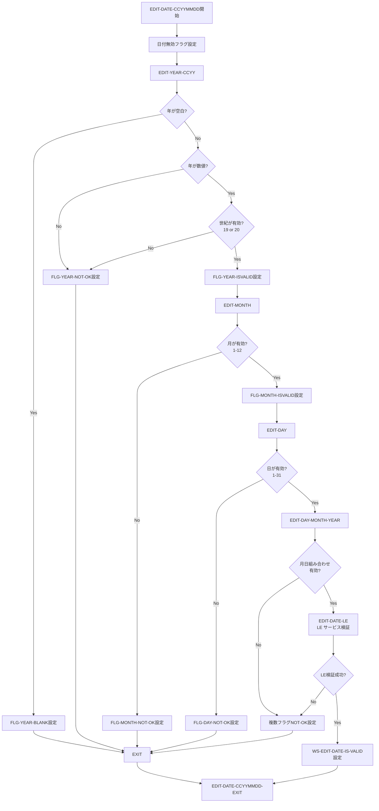
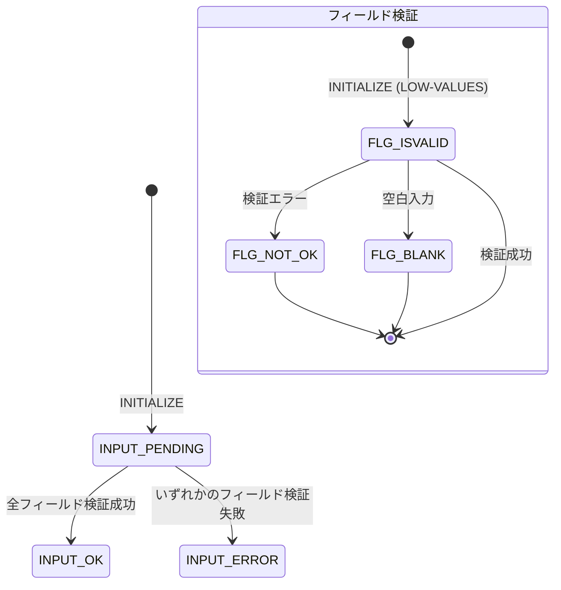
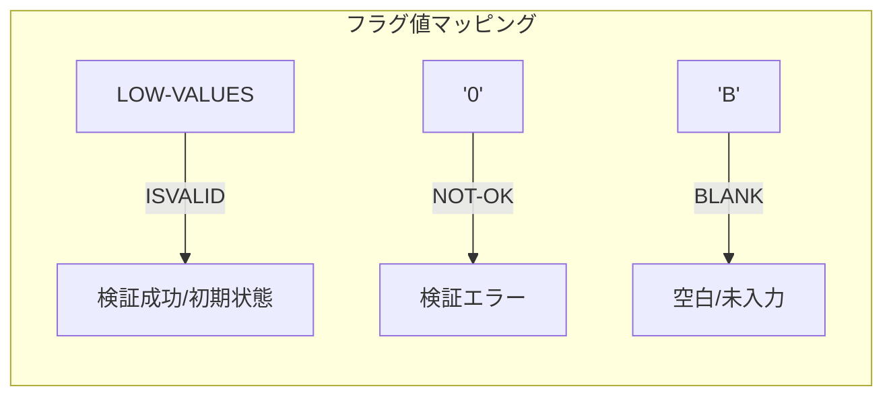

# 検証パターン (Validation Patterns)

## CardDemo COBOL/CICS アプリケーション コードスタイルカタログ

本文書は、CardDemo メインフレームアプリケーションにおける検証パターン（テスト/検証パターン）を定義します。すべてのコード生成は、本カタログのパターンに従う必要があります。

---

## 目次

- [必須パターン (MUST)](#必須パターン-must)
  - [88レベル条件名-ISVALID](#88レベル条件名-isvalid)
  - [88レベル条件名-NOT-OK](#88レベル条件名-not-ok)
  - [88レベル条件名-BLANK](#88レベル条件名-blank)
- [推奨パターン (SHOULD)](#推奨パターン-should)
  - [入力検証パターン](#入力検証パターン)
  - [日付検証-CCYYMMDD](#日付検証-ccyymmdd)
  - [INPUT-OK/INPUT-ERRORフラグ](#input-okinput-errorフラグ)
  - [WS-EDIT-*変数命名](#ws-edit-変数命名)
- [任意パターン (MAY)](#任意パターン-may)
  - [CEEDAYS言語環境サービス](#ceedays言語環境サービス)
  - [GO TO使用（意図的なもの）](#go-to使用意図的なもの)
- [検証フロー図](#検証フロー図)
- [関連ドキュメント](#関連ドキュメント)

---

## 必須パターン (MUST)

以下のパターンは**必須**です。違反は自動却下となります。

---

### 88レベル条件名-ISVALID

```yaml
パターン名: 88レベル条件名-ISVALID
優先度: MUST
カテゴリ: テスト
ファイルパス: app/cpy/CSUTLDWY.cpy:47, app/cbl/COACTUPC.cbl:57-79
スニペット: |
   10 WS-EDIT-YEAR-FLG                 PIC X(01).
      88 FLG-YEAR-ISVALID              VALUE LOW-VALUES.
      88 FLG-YEAR-NOT-OK               VALUE '0'.
      88 FLG-YEAR-BLANK                VALUE 'B'.
   10 WS-EDIT-MONTH                    PIC X(01).
      88 FLG-MONTH-ISVALID             VALUE LOW-VALUES.
      88 FLG-MONTH-NOT-OK              VALUE '0'.
      88 FLG-MONTH-BLANK               VALUE 'B'.
検証基準:
  - すべての検証フラグは 88 レベル条件で定義すること
  - ISVALID 条件は必ず VALUE LOW-VALUES を使用すること
  - 各フラグ変数に対し、ISVALID/NOT-OK/BLANK の3条件をセットで定義すること
  - フラグ変数名は FLG-*-ISVALID の形式とすること
根拠: 検証状態の一貫したチェックをすべてのプログラムで実現するため。LOW-VALUES は初期化時にフラグがリセットされ、明示的にエラーを設定するまで「有効」として扱われる。
```

**追加例 (COACTUPC.cbl):**

```cobol
       10 WS-FLG-SIGNED-NUMBER-EDIT            PIC X(1).
          88  FLG-SIGNED-NUMBER-ISVALID        VALUE LOW-VALUES.
          88  FLG-SIGNED-NUMBER-NOT-OK         VALUE '0'.
          88  FLG-SIGNED-NUMBER-BLANK          VALUE 'B'.

       10 WS-EDIT-ALPHA-ONLY-FLAGS             PIC X(1).
          88  FLG-ALPHA-ISVALID                VALUE LOW-VALUES.
          88  FLG-ALPHA-NOT-OK                 VALUE '0'.
          88  FLG-ALPHA-BLANK                  VALUE 'B'.
```

**Source:** `app/cbl/COACTUPC.cbl:56-67`

**パターン使用方法:**

```cobol
      * 検証成功時
       SET FLG-YEAR-ISVALID              TO TRUE
      
      * 検証フラグのリセット
       INITIALIZE WS-EDIT-YEAR-FLG
      * --> LOW-VALUES になり、FLG-YEAR-ISVALID が TRUE になる
```

---

### 88レベル条件名-NOT-OK

```yaml
パターン名: 88レベル条件名-NOT-OK
優先度: MUST
カテゴリ: テスト
ファイルパス: app/cbl/COACTUPC.cbl:58-74
スニペット: |
   10 WS-EDIT-MANDATORY-FLAGS              PIC X(1).
      88  FLG-MANDATORY-ISVALID            VALUE LOW-VALUES.
      88  FLG-MANDATORY-NOT-OK             VALUE '0'.
      88  FLG-MANDATORY-BLANK              VALUE 'B'.
   10 WS-EDIT-YES-NO                       PIC X(1)
                                           VALUE 'N'.
      88 FLG-YES-NO-ISVALID                VALUES 'Y', 'N'.
      88 FLG-YES-NO-NOT-OK                 VALUE '0'.
      88 FLG-YES-NO-BLANK                  VALUE 'B'.
検証基準:
  - NOT-OK 条件は VALUE '0' を使用すること
  - エラー検出時は SET FLG-*-NOT-OK TO TRUE で設定すること
  - NOT-OK は数値の '0' であり、LOW-VALUES とは異なることに注意
根拠: 明示的なエラー状態の設定を可能にし、初期化状態（ISVALID）とエラー状態を明確に区別するため。
```

**エラー設定例 (CSUTLDPY.cpy):**

```cobol
       IF WS-EDIT-DATE-CCYY            IS NOT NUMERIC
          SET INPUT-ERROR              TO TRUE
          SET  FLG-YEAR-NOT-OK         TO TRUE
          IF WS-RETURN-MSG-OFF
             STRING
               FUNCTION TRIM(WS-EDIT-VARIABLE-NAME)
               ' must be 4 digit number.'
               DELIMITED BY SIZE
               INTO WS-RETURN-MSG
          END-IF
          GO TO EDIT-YEAR-CCYY-EXIT
       ELSE
          CONTINUE
       END-IF
```

**Source:** `app/cpy/CSUTLDPY.cpy:48-61`

---

### 88レベル条件名-BLANK

```yaml
パターン名: 88レベル条件名-BLANK
優先度: MUST
カテゴリ: テスト
ファイルパス: app/cpy/CSUTLDWY.cpy:49-57
スニペット: |
   20 WS-EDIT-YEAR-FLG                 PIC X(01).
      88 FLG-YEAR-ISVALID              VALUE LOW-VALUES.
      88 FLG-YEAR-NOT-OK               VALUE '0'.
      88 FLG-YEAR-BLANK                VALUE 'B'.
   20 WS-EDIT-MONTH                    PIC X(01).
      88 FLG-MONTH-ISVALID             VALUE LOW-VALUES.
      88 FLG-MONTH-NOT-OK              VALUE '0'.
      88 FLG-MONTH-BLANK               VALUE 'B'.
   20 WS-EDIT-DAY                      PIC X(01).
      88 FLG-DAY-ISVALID               VALUE LOW-VALUES.
      88 FLG-DAY-NOT-OK                VALUE '0'.
      88 FLG-DAY-BLANK                 VALUE 'B'.
検証基準:
  - BLANK 条件は VALUE 'B' を使用すること
  - 空白入力検出時は SET FLG-*-BLANK TO TRUE で設定すること
  - 必須フィールドが未入力の場合は BLANK 状態を明示的に設定すること
根拠: 空白（未入力）とその他のエラー状態を区別可能にし、ユーザーへの適切なエラーメッセージ生成を支援するため。
```

**BLANK 検出パターン:**

```cobol
       IF WS-EDIT-DATE-CCYY            EQUAL LOW-VALUES
       OR WS-EDIT-DATE-CCYY            EQUAL SPACES
          SET INPUT-ERROR              TO TRUE
          SET  FLG-YEAR-BLANK          TO TRUE
          IF WS-RETURN-MSG-OFF
             STRING
               FUNCTION TRIM(WS-EDIT-VARIABLE-NAME)
               ' : Year must be supplied.'
               DELIMITED BY SIZE
               INTO WS-RETURN-MSG
          END-IF
          GO TO EDIT-YEAR-CCYY-EXIT
       ELSE
          CONTINUE
       END-IF
```

**Source:** `app/cpy/CSUTLDPY.cpy:29-45`

---

## 推奨パターン (SHOULD)

以下のパターンは**推奨**です。適用がデフォルトであり、逸脱には正当化理由の文書化が必要です。

---

### 入力検証パターン

```yaml
パターン名: 入力検証パターン
優先度: SHOULD
カテゴリ: テスト
ファイルパス: app/cbl/COACTUPC.cbl:51-146
スニペット: |
   05  WS-GENERIC-EDITS.
     10 WS-EDIT-VARIABLE-NAME                PIC X(25).
     10 WS-EDIT-SIGNED-NUMBER-9V2-X          PIC X(15).
     10 WS-FLG-SIGNED-NUMBER-EDIT            PIC X(1).
        88  FLG-SIGNED-NUMBER-ISVALID        VALUE LOW-VALUES.
        88  FLG-SIGNED-NUMBER-NOT-OK         VALUE '0'.
        88  FLG-SIGNED-NUMBER-BLANK          VALUE 'B'.
     10 WS-EDIT-ALPHANUM-ONLY                PIC X(256).
     10 WS-EDIT-ALPHANUM-LENGTH              PIC S9(4) COMP-3.
検証基準:
  - 入力編集用変数は WS-EDIT-* 接頭辞を使用すること
  - 各編集変数には対応するフラグ変数を定義すること
  - フラグ変数は ISVALID/NOT-OK/BLANK の3状態を持つこと
  - 検証対象変数名を格納する WS-EDIT-VARIABLE-NAME を用意すること
根拠: 一貫した検証状態管理を実現し、エラーメッセージに変数名を動的に含められるようにするため。
```

**複合フィールド検証例 (US電話番号):**

```cobol
       10 WS-EDIT-US-PHONE-NUM                 PIC X(15).
       10 WS-EDIT-US-PHONE-NUM-X REDEFINES
          WS-EDIT-US-PHONE-NUM.
          20 FILLER                            PIC X(1).
          20 WS-EDIT-US-PHONE-NUMA             PIC X(3).
          20 WS-EDIT-US-PHONE-NUMA-N REDEFINES
             WS-EDIT-US-PHONE-NUMA             PIC 9(3).
          20 FILLER                            PIC X(1).
          20 WS-EDIT-US-PHONE-NUMB             PIC X(3).
          20 WS-EDIT-US-PHONE-NUMB-N REDEFINES
             WS-EDIT-US-PHONE-NUMB             PIC 9(3).
          20 FILLER                            PIC X(1).
          20 WS-EDIT-US-PHONE-NUMC             PIC X(4).
          20 WS-EDIT-US-PHONE-NUMC-N REDEFINES
             WS-EDIT-US-PHONE-NUMC             PIC 9(4).
          20 FILLER                            PIC X(2).
       10 WS-EDIT-US-PHONE-NUM-FLGS.
           88 WS-EDIT-US-PHONE-IS-INVALID      VALUE '000'.
           88 WS-EDIT-US-PHONE-IS-VALID        VALUE LOW-VALUES.
           20 WS-EDIT-US-PHONEA-FLG            PIC X(01).
              88 FLG-EDIT-US-PHONEA-ISVALID    VALUE LOW-VALUES.
              88 FLG-EDIT-US-PHONEA-NOT-OK     VALUE '0'.
              88 FLG-EDIT-US-PHONEA-BLANK      VALUE 'B'.
```

**Source:** `app/cbl/COACTUPC.cbl:82-107`

---

### 日付検証-CCYYMMDD

```yaml
パターン名: 日付検証-CCYYMMDD
優先度: SHOULD
カテゴリ: テスト
ファイルパス: app/cpy/CSUTLDPY.cpy:18-90
スニペット: |
   EDIT-DATE-CCYYMMDD.
       SET WS-EDIT-DATE-IS-INVALID   TO TRUE
       .
  
   EDIT-YEAR-CCYY.
       SET FLG-YEAR-NOT-OK             TO TRUE
  
       IF WS-EDIT-DATE-CCYY            EQUAL LOW-VALUES
       OR WS-EDIT-DATE-CCYY            EQUAL SPACES
          SET INPUT-ERROR              TO TRUE
          SET  FLG-YEAR-BLANK          TO TRUE
          ...
          GO TO EDIT-YEAR-CCYY-EXIT
       ELSE
          CONTINUE
       END-IF
  
       IF WS-EDIT-DATE-CCYY            IS NOT NUMERIC
          SET INPUT-ERROR              TO TRUE
          SET  FLG-YEAR-NOT-OK         TO TRUE
          ...
       END-IF
検証基準:
  - 日付検証は EDIT-DATE-CCYYMMDD 段落で開始すること
  - 世紀、年、月、日を個別に検証すること
  - 月と日の組み合わせ（2月30日など）を検証すること
  - うるう年の検証を含めること
根拠: 堅牢な日付検証により、無効な日付入力を防止し、データ整合性を確保するため。
```

**日付構造定義 (CSUTLDWY.cpy):**

```cobol
       10 WS-EDIT-DATE-CCYYMMDD.
          20 WS-EDIT-DATE-CCYY.
             25 WS-EDIT-DATE-CC                PIC X(2).
             25 WS-EDIT-DATE-CC-N REDEFINES    WS-EDIT-DATE-CC
                                               PIC 9(2).
                88 THIS-CENTURY                VALUE 20.
                88 LAST-CENTURY                VALUE 19.
             25 WS-EDIT-DATE-YY                PIC X(2).
             25 WS-EDIT-DATE-YY-N REDEFINES    WS-EDIT-DATE-YY
                                               PIC 9(2).
          20 WS-EDIT-DATE-CCYY-N  REDEFINES
             WS-EDIT-DATE-CCYY                 PIC 9(4).
          20 WS-EDIT-DATE-MM                   PIC X(2).
          20 WS-EDIT-DATE-MM-N REDEFINES WS-EDIT-DATE-MM
                                               PIC 9(2).
             88 WS-VALID-MONTH                 VALUES 1 THROUGH 12.
             88 WS-31-DAY-MONTH                VALUES 1, 3, 5, 7,
                                                      8, 10, 12.
             88 WS-FEBRUARY                    VALUE 2.
          20 WS-EDIT-DATE-DD                   PIC X(2).
          20 WS-EDIT-DATE-DD-N REDEFINES WS-EDIT-DATE-DD
                                               PIC 9(2).
             88 WS-VALID-DAY                   VALUES 1 THROUGH 31.
             88 WS-DAY-31                      VALUE 31.
             88 WS-DAY-30                      VALUE 30.
             88 WS-DAY-29                      VALUE 29.
```

**Source:** `app/cpy/CSUTLDWY.cpy:4-32`

**うるう年検証ロジック:**

```cobol
       IF  WS-FEBRUARY
       AND WS-DAY-29
           IF WS-EDIT-DATE-YY-N = 0
              MOVE 400                TO  WS-DIV-BY
           ELSE
              MOVE 4                  TO  WS-DIV-BY
           END-IF
           DIVIDE WS-EDIT-DATE-CCYY-N
               BY WS-DIV-BY
           GIVING WS-DIVIDEND
           REMAINDER WS-REMAINDER
           IF WS-REMAINDER = ZEROES
              CONTINUE
           ELSE
              SET INPUT-ERROR          TO TRUE
              SET FLG-DAY-NOT-OK       TO TRUE
              SET FLG-MONTH-NOT-OK     TO TRUE
              SET FLG-YEAR-NOT-OK      TO TRUE
              ...
           END-IF
       END-IF
```

**Source:** `app/cpy/CSUTLDPY.cpy:243-272`

---

### INPUT-OK/INPUT-ERRORフラグ

```yaml
パターン名: INPUT-OK/INPUT-ERRORフラグ
優先度: SHOULD
カテゴリ: テスト
ファイルパス: app/cbl/COACTUPC.cbl:171-174
スニペット: |
   05  WS-INPUT-FLAG                         PIC X(1).
     88  INPUT-OK                            VALUE '0'.
     88  INPUT-ERROR                         VALUE '1'.
     88  INPUT-PENDING                       VALUE LOW-VALUES.
検証基準:
  - 全体的な入力検証状態を WS-INPUT-FLAG で管理すること
  - 検証成功時は INPUT-OK を設定すること
  - 検証失敗時は INPUT-ERROR を設定すること
  - 検証開始時は INPUT-PENDING（LOW-VALUES）にすること
根拠: 複数フィールドの検証結果を集約し、最終的な入力可否判定を一元管理するため。
```

**入力検証フロー例:**

```cobol
      * 検証開始時にフラグ初期化
       INITIALIZE WS-INPUT-FLAG
      * --> INPUT-PENDING が TRUE になる
      
      * 各フィールドの検証
       PERFORM EDIT-ACCOUNT-NUMBER
       PERFORM EDIT-CUSTOMER-NAME
       PERFORM EDIT-DATE-OF-BIRTH
      
      * 検証結果に基づく処理分岐
       IF INPUT-OK
          PERFORM PROCESS-VALID-INPUT
       ELSE
          PERFORM DISPLAY-ERROR-MESSAGES
       END-IF
```

---

### WS-EDIT-*変数命名

```yaml
パターン名: WS-EDIT-*変数命名
優先度: SHOULD
カテゴリ: テスト
ファイルパス: app/cbl/COACTUPC.cbl:53-146
スニペット: |
   10 WS-EDIT-VARIABLE-NAME                PIC X(25).
   10 WS-EDIT-SIGNED-NUMBER-9V2-X          PIC X(15).
   10 WS-EDIT-ALPHANUM-ONLY                PIC X(256).
   10 WS-EDIT-ALPHANUM-LENGTH              PIC S9(4) COMP-3.
   10 WS-EDIT-US-PHONE-NUM                 PIC X(15).
   10 WS-EDIT-US-SSN                       PIC X(9).
検証基準:
  - 編集（検証）用変数には WS-EDIT-* 接頭辞を使用すること
  - 数値検証用には *-N サフィックスで REDEFINES を定義すること
  - フラグ用には *-FLG または *-FLGS サフィックスを使用すること
根拠: 編集用変数を明確に識別し、コードの可読性と保守性を向上させるため。
```

**完全な検証フィールド構造例:**

```cobol
       10 WS-EDIT-US-SSN.
           20 WS-EDIT-US-SSN-PART1              PIC X(3).
           20 WS-EDIT-US-SSN-PART1-N REDEFINES
              WS-EDIT-US-SSN-PART1              PIC 9(3).
              88 INVALID-SSN-PART1  VALUES      0,
                                                666,
                                                900 THRU 999.
           20 WS-EDIT-US-SSN-PART2              PIC X(2).
           20 WS-EDIT-US-SSN-PART2-N REDEFINES
              WS-EDIT-US-SSN-PART2              PIC 9(2).
           20 WS-EDIT-US-SSN-PART3              PIC X(4).
           20 WS-EDIT-US-SSN-PART3-N REDEFINES
              WS-EDIT-US-SSN-PART3              PIC 9(4).
       10 WS-EDIT-US-SSN-N REDEFINES
          WS-EDIT-US-SSN                        PIC 9(09).
       10 WS-EDIT-US-SSN-FLGS.
           88 WS-EDIT-US-SSN-IS-INVALID         VALUE '000'.
           88 WS-EDIT-US-SSN-IS-VALID           VALUE LOW-VALUES.
           20 WS-EDIT-US-SSN-PART1-FLGS         PIC X(01).
              88 FLG-EDIT-US-SSN-PART1-ISVALID  VALUE LOW-VALUES.
              88 FLG-EDIT-US-SSN-PART1-NOT-OK   VALUE '0'.
              88 FLG-EDIT-US-SSN-PART1-BLANK    VALUE 'B'.
```

**Source:** `app/cbl/COACTUPC.cbl:117-146`

---

## 任意パターン (MAY)

以下のパターンは**任意**です。開発者の裁量で適用します。

---

### CEEDAYS言語環境サービス

```yaml
パターン名: CEEDAYS言語環境サービス
優先度: MAY
カテゴリ: テスト
ファイルパス: app/cbl/CSUTLDTC.cbl:116-120
スニペット: |
   CALL "CEEDAYS" USING                                                 
          WS-DATE-TO-TEST,                                              
          WS-DATE-FORMAT,                                               
          OUTPUT-LILLIAN,                                               
          FEEDBACK-CODE                                                 
検証基準:
  - 複雑な日付計算には LE サービス（CEEDAYS）を使用すること
  - フィードバックコードでエラーを適切にハンドリングすること
  - 日付フォーマットはマスク（YYYYMMDD 等）で指定すること
根拠: z/OS ランタイムサービスを活用し、正確な日付処理と Lillian 日付変換を実現するため。
```

**CEEDAYS 呼び出し用データ構造:**

```cobol
      ****  Date passed to CEEDAYS API                                          
       01 WS-DATE-TO-TEST.                                                    
            02  Vstring-length      PIC S9(4) BINARY.                         
            02  Vstring-text.                                                 
                03  Vstring-char    PIC X                                     
                            OCCURS 0 TO 256 TIMES                             
                            DEPENDING ON Vstring-length                       
                               of WS-DATE-TO-TEST.                            
      ****  DATE FORMAT PASSED TO CEEDAYS API                                   
       01 WS-DATE-FORMAT.                                                     
            02  Vstring-length      PIC S9(4) BINARY.                         
            02  Vstring-text.                                                 
                03  Vstring-char    PIC X                                     
                            OCCURS 0 TO 256 TIMES                             
                            DEPENDING ON Vstring-length                       
                               of WS-DATE-FORMAT.                             
      ****  OUTPUT from CEEDAYS - LILLIAN DATE FORMAT                           
       01 OUTPUT-LILLIAN    PIC S9(9) USAGE IS BINARY.
```

**Source:** `app/cbl/CSUTLDTC.cbl:24-41`

**フィードバックコード定義:**

```cobol
      * CEEDAYS API FEEDBACK CODE                                               
        01 FEEDBACK-CODE.                                                     
         02  FEEDBACK-TOKEN-VALUE. 
           88  FC-INVALID-DATE       VALUE X'0000000000000000'.
           88  FC-INSUFFICIENT-DATA  VALUE X'000309CB59C3C5C5'.
           88  FC-BAD-DATE-VALUE     VALUE X'000309CC59C3C5C5'.
           88  FC-INVALID-ERA        VALUE X'000309CD59C3C5C5'.
           88  FC-UNSUPP-RANGE       VALUE X'000309D159C3C5C5'.
           88  FC-INVALID-MONTH      VALUE X'000309D659C3C5C5'.
           88  FC-BAD-PIC-STRING     VALUE X'000309D659C3C5C5'.
           88  FC-NON-NUMERIC-DATA   VALUE X'000309D859C3C5C5'.
           88  FC-YEAR-IN-ERA-ZERO   VALUE X'000309D959C3C5C5'.
```

**Source:** `app/cbl/CSUTLDTC.cbl:59-70`

**フィードバック評価パターン:**

```cobol
       EVALUATE TRUE                                                        
          WHEN FC-INVALID-DATE                                   
             MOVE 'Date is valid'      TO WS-RESULT              
          WHEN FC-INSUFFICIENT-DATA                              
             MOVE 'Insufficient'       TO WS-RESULT              
          WHEN FC-BAD-DATE-VALUE                                 
             MOVE 'Datevalue error'    TO WS-RESULT              
          WHEN FC-INVALID-ERA                                    
             MOVE 'Invalid Era    '    TO WS-RESULT              
          WHEN FC-UNSUPP-RANGE                                   
             MOVE 'Unsupp. Range  '    TO WS-RESULT              
          WHEN FC-INVALID-MONTH                                  
             MOVE 'Invalid month  '    TO WS-RESULT              
          WHEN FC-BAD-PIC-STRING                                 
             MOVE 'Bad Pic String '    TO WS-RESULT              
          WHEN FC-NON-NUMERIC-DATA                               
             MOVE 'Nonnumeric data'    TO WS-RESULT              
          WHEN FC-YEAR-IN-ERA-ZERO                               
             MOVE 'YearInEra is 0 '    TO WS-RESULT              
          WHEN OTHER                                             
             MOVE 'Date is invalid'    TO WS-RESULT 
       END-EVALUATE
```

**Source:** `app/cbl/CSUTLDTC.cbl:128-149`

**CSUTLDTC プログラム呼び出し例 (CSUTLDPY.cpy):**

```cobol
       EDIT-DATE-LE.
           INITIALIZE WS-DATE-VALIDATION-RESULT
           MOVE 'YYYYMMDD'                   TO WS-DATE-FORMAT

           CALL 'CSUTLDTC'
           USING WS-EDIT-DATE-CCYYMMDD
               , WS-DATE-FORMAT
               , WS-DATE-VALIDATION-RESULT

           IF WS-SEVERITY-N = 0
              CONTINUE
           ELSE
              SET INPUT-ERROR                TO TRUE
              SET FLG-DAY-NOT-OK             TO TRUE
              SET FLG-MONTH-NOT-OK           TO TRUE
              SET FLG-YEAR-NOT-OK            TO TRUE
              ...
           END-IF
```

**Source:** `app/cpy/CSUTLDPY.cpy:284-320`

---

### GO TO使用（意図的なもの）

```yaml
パターン名: GO TO使用（意図的なもの）
優先度: MAY
カテゴリ: テスト
ファイルパス: app/cpy/CSUTLDPY.cpy:42
スニペット: |
   IF WS-EDIT-DATE-CCYY            EQUAL LOW-VALUES
   OR WS-EDIT-DATE-CCYY            EQUAL SPACES
      SET INPUT-ERROR              TO TRUE
      SET  FLG-YEAR-BLANK          TO TRUE
      IF WS-RETURN-MSG-OFF
         STRING
           FUNCTION TRIM(WS-EDIT-VARIABLE-NAME)
           ' : Year must be supplied.'
           DELIMITED BY SIZE
           INTO WS-RETURN-MSG
      END-IF
  *   Intentional violation of structured programming norms
      GO TO EDIT-YEAR-CCYY-EXIT
   ELSE
      CONTINUE
   END-IF
検証基準:
  - GO TO は検証段落の早期終了にのみ使用すること
  - 使用する場合は、段落の EXIT 点への遷移に限定すること
  - コメントで意図的な使用であることを明記すること
根拠: 検証ロジックでは複数の検証条件が順次チェックされ、エラー発見時に即座に段落を終了することで、不要な処理をスキップできるため。
```

**注意:** GO TO 使用は構造化プログラミング規範からの逸脱ですが、検証コードでは早期終了パターンとして広く使用されています。使用する場合は、その意図を明確にコメントで記載してください。

---

## 検証フロー図

### 日付検証フロー



### 入力検証状態遷移



### 88レベル条件値一覧



---

## 関連ドキュメント

- [アーキテクチャパターン](./architecture-patterns.md) - プログラム構造とディビジョン組織
- [命名規則](./naming-conventions.md) - FLG-* 接頭辞とフィールド命名規則
- [エラー処理](./error-handling.md) - エラーメッセージ表示パターンと ABEND 処理
- [データ契約](./data-contracts.md) - コピーブック構造と 88 レベル条件定義

---

## パターンサマリー

| パターン名 | 優先度 | カテゴリ | 主要ソース |
|-----------|-------|---------|-----------|
| 88レベル条件名-ISVALID | MUST | テスト | `CSUTLDWY.cpy`, `COACTUPC.cbl` |
| 88レベル条件名-NOT-OK | MUST | テスト | `COACTUPC.cbl`, `CSUTLDPY.cpy` |
| 88レベル条件名-BLANK | MUST | テスト | `CSUTLDWY.cpy`, `CSUTLDPY.cpy` |
| 入力検証パターン | SHOULD | テスト | `COACTUPC.cbl` |
| 日付検証-CCYYMMDD | SHOULD | テスト | `CSUTLDPY.cpy`, `CSUTLDWY.cpy` |
| INPUT-OK/INPUT-ERRORフラグ | SHOULD | テスト | `COACTUPC.cbl` |
| WS-EDIT-*変数命名 | SHOULD | テスト | `COACTUPC.cbl` |
| CEEDAYS言語環境サービス | MAY | テスト | `CSUTLDTC.cbl` |
| GO TO使用（意図的なもの） | MAY | テスト | `CSUTLDPY.cpy` |

---

## カタログ準拠チェックリスト

検証パターン準拠を確認するためのチェックリスト:

```plaintext
=== 検証パターン準拠チェック ===
[ ] 88レベル条件が ISVALID/NOT-OK/BLANK の3状態で定義されている
[ ] ISVALID 条件は VALUE LOW-VALUES を使用している
[ ] NOT-OK 条件は VALUE '0' を使用している
[ ] BLANK 条件は VALUE 'B' を使用している
[ ] 入力検証変数は WS-EDIT-* 接頭辞を使用している
[ ] 全体的な検証状態は WS-INPUT-FLAG で管理されている
[ ] 日付検証には CCYYMMDD 構造を使用している
[ ] 必要に応じて LE サービス (CEEDAYS) を統合している
```

---

<!-- Ver: CodeStyleCatalog_v1.0 Date: 2024 -->
