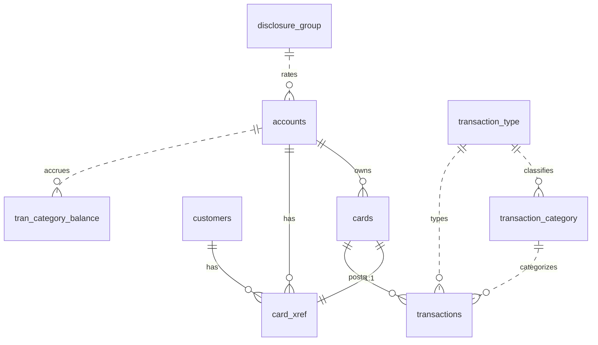

# CardDemo Data Model

The modernized CardDemo replaces the legacy IBM mainframe storage layer — VSAM
KSDS clusters with alternate indexes plus flat sequential (PS) datasets — with a
**PostgreSQL 17** relational schema. The schema is created by the Alembic
migration [`0001_initial_schema`](../backend/alembic/versions/0001_initial_schema.py)
and seeded by `0002_seed_data` from the ASCII sample data in
[`../app/data/ASCII/*.txt`](../app/data/ASCII). Every logical record layout, key,
and relationship declared in the COBOL copybooks under
[`../app/cpy/`](../app/cpy) is preserved: VSAM primary (KSDS) keys become
`PRIMARY KEY` constraints, VSAM alternate indexes (AIX) become `UNIQUE` or
secondary `INDEX` objects, and the relationships implicit in the `CARDXREF`
cross-reference file become explicit `FOREIGN KEY` constraints.

> **Source of truth.** The authoritative column names, SQL types, keys, and
> indexes are the SQLAlchemy models in
> [`../backend/app/models/`](../backend/app/models) and the Alembic migration
> [`0001_initial_schema.py`](../backend/alembic/versions/0001_initial_schema.py).
> This document is reconciled against those files; the COBOL `PIC` clauses shown
> throughout are the **legacy lineage** (origin), not the live DDL.

## 1. Overview

CardDemo persists ten tables. Nine map one-to-one to a legacy VSAM/PS dataset
and its COBOL record copybook; the tenth relationship set (`card_xref`) makes the
former cross-reference file explicit. `accounts.group_id` is a nullable, indexed
logical reference to `disclosure_group.group_id` (not a hard foreign key): the
disclosure-group primary key is composite, so `group_id` alone cannot be a
single-column FK target, and the legacy `ACCT-GROUP-ID PIC X(10)` was a free-text
field with no standalone account-group dataset to reference (AAP §0.5.1, §0.8.1).
Two migration-era corrections that this
model applies and that are documented below are: (1) all monetary and rate fields
are **signed zoned-decimal DISPLAY**, not `COMP-3` packed decimal, and map to
PostgreSQL `NUMERIC(p,s)` handled as Python `Decimal` — **never** floating point
(a regulatory-correctness requirement); and (2) the disclosure interest rate uses
`NUMERIC(6,2)` (four integer + two fractional digits), not `NUMERIC(5,2)`.

## 2. Table of Contents

- [1. Overview](#1-overview)
- [3. COBOL to PostgreSQL Type Mapping](#3-cobol-to-postgresql-type-mapping)
- [4. Entity-Relationship Overview](#4-entity-relationship-overview)
- [5. Table Catalog](#5-table-catalog)
  - [`users`](#users)
  - [`accounts`](#accounts)
  - [`customers`](#customers)
  - [`cards`](#cards)
  - [`card_xref`](#card_xref)
  - [`transactions`](#transactions)
  - [`tran_category_balance`](#tran_category_balance)
  - [`disclosure_group`](#disclosure_group)
  - [`transaction_type`](#transaction_type)
  - [`transaction_category`](#transaction_category)
- [6. Numeric Precision Summary](#6-numeric-precision-summary)
- [7. Indexes and Keys Summary](#7-indexes-and-keys-summary)
- [8. Seed Data](#8-seed-data)
- [9. Related Documentation](#9-related-documentation)

## 3. COBOL to PostgreSQL Type Mapping

Every column derives from a fixed set of type-mapping rules applied to the COBOL
`PIC` clauses. Drop `FILLER` fields — they exist only to pad the fixed VSAM
record length and carry no business data.

| COBOL PIC | PostgreSQL type | Rule |
|-----------|-----------------|------|
| `PIC X(n)` | `VARCHAR(n)` | Variable-length alphanumeric text. |
| `PIC X(n)` (fixed-width code) | `CHAR(n)` | Fixed-width codes/flags (e.g. status, state, type codes). |
| `PIC 9(n)` (identifier) | `VARCHAR(n)` | Numeric identifiers (`ACCT-ID`, `CUST-ID`, card/category codes) map to text to **preserve leading zeros** — never an integer type. |
| `PIC 9(n)` (true count) | `SMALLINT` | Only where the value is a genuine small number, e.g. `CUST-FICO-CREDIT-SCORE`. |
| `PIC S9(n)V99` | `NUMERIC(n+2,2)` | Signed decimal money/rate → exact decimal (Python `Decimal`), **never float**. See the zoned-decimal note below. |
| `PIC X(10)` (date text) | `DATE` | 10-byte `YYYY-MM-DD` text. |
| `PIC X(26)` (timestamp text) | `TIMESTAMPTZ` | 26-byte timestamp text → `DateTime(timezone=True)`. |
| VSAM primary (KSDS) key | `PRIMARY KEY` | Record key at `RKP=0`. |
| VSAM alternate index (AIX) | `UNIQUE` or secondary `INDEX` | Non-unique AIX → non-unique `INDEX`; unique AIX → `UNIQUE`. |
| `FILLER` | *(dropped)* | Record-length padding only; never mapped to a column. |

**Signed zoned decimal (not `COMP-3`).** The money and rate fields are signed
zoned-decimal `DISPLAY` — no `COMP-3` / `PACKED-DECIMAL` clause appears in any
copybook. The sign is carried as an *overpunch* in the zone nibble of the last
digit, and the decimal point is *implied* (no `.` is stored). Decoding is
centralized in
[`../backend/app/utils/decimal_utils.py`](../backend/app/utils/decimal_utils.py);
values are `Decimal` in Python and `NUMERIC` in PostgreSQL end to end.

```text
PIC S9(09)V99, value +1234.56 (DISPLAY, implied decimal point):
  stored digits : 0 0 0 0 0 1 2 3 4 5 6      (11 digit positions, no '.')
  sign          : overpunch in the last digit's zone nibble
                  (C or F = positive, D = negative)
  decoded value : Decimal("1234.56")         (never a binary float)
```

## 4. Entity-Relationship Overview

The diagram below shows the relationships between the ten tables. **Solid**
lines are enforced `FOREIGN KEY` constraints; **dashed** lines are logical
references that are indexed but intentionally have no hard foreign key (by scope
discipline that matches the ORM models — for example the composite-keyed
transaction lookups).



Relationship notes:

- `cards.acct_id` → `accounts.acct_id` (enforced FK).
- `card_xref.xref_card_num` → `cards.card_num`, `card_xref.cust_id` →
  `customers.cust_id`, `card_xref.acct_id` → `accounts.acct_id` (three enforced
  FKs realizing the legacy `CARDXREF` integrity).
- `transactions.card_num` → `cards.card_num` (enforced FK).
- `accounts.group_id` → `disclosure_group.group_id` is a **logical, indexed
  reference, not an enforced FK** (dashed line above). `disclosure_group` has a
  composite primary key (`group_id, tran_type_cd, tran_cat_cd`), so `group_id`
  alone cannot be a single-column FK target; the column is a plain indexed
  `VARCHAR(10)` matching the free-text legacy `ACCT-GROUP-ID X(10)`. `group_id`
  is nullable (the seed leaves it blank in every row).
- `transactions.tran_type_cd` / `tran_cat_cd` and `transaction_category` →
  `transaction_type` are logical lookups, not enforced FKs (matches the models).

## 5. Table Catalog

Each subsection lists the source copybook and legacy record length (`RECLN`), a
purpose sentence, and the column layout. The **Key/Index** column records primary
keys (`PK`), foreign keys (`FK`), and secondary indexes exactly as the migration
creates them. The **Legacy field (PIC)** column is the copybook lineage. `FILLER`
padding is excluded from every table (its length is noted for record parity).

### `users`

Source: [`../app/cpy/CSUSR01Y.cpy`](../app/cpy/CSUSR01Y.cpy) (`SEC-USER-DATA`,
RECLN 80). Application sign-on identities and roles, replacing the legacy VSAM
`USRSEC` KSDS.

| Column | Type | Key/Index | Legacy field (PIC) |
|--------|------|-----------|--------------------|
| `user_id` | `VARCHAR(8)` | PK | `SEC-USR-ID X(08)` |
| `first_name` | `VARCHAR(20)` | | `SEC-USR-FNAME X(20)` |
| `last_name` | `VARCHAR(20)` | | `SEC-USR-LNAME X(20)` |
| `password_hash` | `VARCHAR(255)` | | `SEC-USR-PWD X(08)` — plaintext replaced by a bcrypt **hash** |
| `user_type` | `CHAR(1)` | | `SEC-USR-TYPE X(01)` — `'A'` = admin, `'U'` = regular |

`FILLER X(23)` dropped (padding to RECLN 80). The legacy 8-character plaintext
`SEC-USR-PWD` is **never** stored or returned; it becomes a one-way
`password_hash`. Users are seeded from the EBCDIC-only `USRSEC` dataset (there is
no ASCII copy), with passwords hashed on load.

### `accounts`

Source: [`../app/cpy/CVACT01Y.cpy`](../app/cpy/CVACT01Y.cpy) (`ACCOUNT-RECORD`,
RECLN 300). One row per credit-card account, ported from VSAM `ACCTDATA`
(`KEYLEN=11`, `RKP=0`).

| Column | Type | Key/Index | Legacy field (PIC) |
|--------|------|-----------|--------------------|
| `acct_id` | `VARCHAR(11)` | PK | `ACCT-ID 9(11)` |
| `active_status` | `CHAR(1)` | | `ACCT-ACTIVE-STATUS X(01)` |
| `curr_bal` | `NUMERIC(12,2)` | | `ACCT-CURR-BAL S9(10)V99` |
| `credit_limit` | `NUMERIC(12,2)` | | `ACCT-CREDIT-LIMIT S9(10)V99` |
| `cash_credit_limit` | `NUMERIC(12,2)` | | `ACCT-CASH-CREDIT-LIMIT S9(10)V99` |
| `open_date` | `DATE` | | `ACCT-OPEN-DATE X(10)` |
| `expiration_date` | `DATE` | | `ACCT-EXPIRAION-DATE X(10)` |
| `reissue_date` | `DATE` | | `ACCT-REISSUE-DATE X(10)` |
| `curr_cyc_credit` | `NUMERIC(12,2)` | | `ACCT-CURR-CYC-CREDIT S9(10)V99` |
| `curr_cyc_debit` | `NUMERIC(12,2)` | | `ACCT-CURR-CYC-DEBIT S9(10)V99` |
| `addr_zip` | `VARCHAR(10)` | | `ACCT-ADDR-ZIP X(10)` |
| `group_id` | `VARCHAR(10)` | INDEX `ix_accounts_group_id` | `ACCT-GROUP-ID X(10)` |

`FILLER X(178)` dropped. All five monetary fields are `NUMERIC(12,2)` (`Decimal`,
never float). `group_id` is a nullable, plain **indexed column** — a logical
reference to `disclosure_group.group_id`, **not** an enforced foreign key.
`disclosure_group` has a composite primary key (`group_id, tran_type_cd,
tran_cat_cd`), so `group_id` alone cannot be a single-column FK target; the
column preserves the free-text legacy `ACCT-GROUP-ID X(10)` (blank in every seed
row) and its index backs account-group lookups (AAP §0.5.1, §0.8.1).

### `customers`

Source: [`../app/cpy/CVCUS01Y.cpy`](../app/cpy/CVCUS01Y.cpy) (`CUSTOMER-RECORD`,
RECLN 500). Cardholder demographic and contact data, ported from VSAM
`CUSTDATA` (`KEYLEN=9`, `RKP=0`).

| Column | Type | Key/Index | Legacy field (PIC) |
|--------|------|-----------|--------------------|
| `cust_id` | `VARCHAR(9)` | PK | `CUST-ID 9(09)` |
| `first_name` | `VARCHAR(25)` | | `CUST-FIRST-NAME X(25)` |
| `middle_name` | `VARCHAR(25)` | | `CUST-MIDDLE-NAME X(25)` |
| `last_name` | `VARCHAR(25)` | | `CUST-LAST-NAME X(25)` |
| `addr_line_1` | `VARCHAR(50)` | | `CUST-ADDR-LINE-1 X(50)` |
| `addr_line_2` | `VARCHAR(50)` | | `CUST-ADDR-LINE-2 X(50)` |
| `addr_line_3` | `VARCHAR(50)` | | `CUST-ADDR-LINE-3 X(50)` |
| `addr_state_cd` | `CHAR(2)` | | `CUST-ADDR-STATE-CD X(02)` |
| `addr_country_cd` | `CHAR(3)` | | `CUST-ADDR-COUNTRY-CD X(03)` |
| `addr_zip` | `VARCHAR(10)` | | `CUST-ADDR-ZIP X(10)` |
| `phone_num_1` | `VARCHAR(15)` | | `CUST-PHONE-NUM-1 X(15)` |
| `phone_num_2` | `VARCHAR(15)` | | `CUST-PHONE-NUM-2 X(15)` |
| `ssn` | `VARCHAR(9)` | **masked** | `CUST-SSN 9(09)` |
| `govt_issued_id` | `VARCHAR(20)` | | `CUST-GOVT-ISSUED-ID X(20)` |
| `date_of_birth` | `DATE` | | `CUST-DOB-YYYY-MM-DD X(10)` |
| `eft_account_id` | `VARCHAR(10)` | | `CUST-EFT-ACCOUNT-ID X(10)` |
| `pri_card_holder_ind` | `CHAR(1)` | | `CUST-PRI-CARD-HOLDER-IND X(01)` |
| `fico_credit_score` | `SMALLINT` | | `CUST-FICO-CREDIT-SCORE 9(03)` |

`FILLER X(168)` dropped. `ssn` is stored in full but **masked** in UI and API
responses. `fico_credit_score` is the one numeric field kept as a true integer
(`SMALLINT`); all other `9(n)` identifiers stay text to preserve leading zeros.

### `cards`

Source: [`../app/cpy/CVACT02Y.cpy`](../app/cpy/CVACT02Y.cpy) (`CARD-RECORD`,
RECLN 150). One row per plastic card, ported from VSAM `CARDDATA` (`KEYLEN=16`,
`RKP=0`; alternate index on the account id at `AXRKP=5`).

| Column | Type | Key/Index | Legacy field (PIC) |
|--------|------|-----------|--------------------|
| `card_num` | `VARCHAR(16)` | PK, **masked** | `CARD-NUM X(16)` |
| `acct_id` | `VARCHAR(11)` | FK → `accounts.acct_id`, INDEX `ix_cards_acct_id` | `CARD-ACCT-ID 9(11)` |
| `embossed_name` | `VARCHAR(50)` | | `CARD-EMBOSSED-NAME X(50)` |
| `expiration_date` | `DATE` | | `CARD-EXPIRAION-DATE X(10)` |
| `active_status` | `CHAR(1)` | | `CARD-ACTIVE-STATUS X(01)` |

The legacy `CARD-CVV-CD 9(03)` field is **deliberately not persisted** (QA
finding C-03; AAP 0.7.8): the `cards` table has **no `cvv_cd` column**, so there
is no CVV value at rest to store, mask, or leak. Migration `0003` idempotently
drops the column from any database that was first migrated at revision `0001`
while it still declared the column. `FILLER X(59)` and `CARD-CVV-CD` are both
dropped. `card_num` is masked to its last four digits before it appears in any
response. The `ix_cards_acct_id` index is the relational form of the `CARDDATA`
alternate index and powers the card-list-by-account screen (`COCRDLIC` /
`CCLI`).

### `card_xref`

Source: [`../app/cpy/CVACT03Y.cpy`](../app/cpy/CVACT03Y.cpy) (`CARD-XREF-RECORD`,
RECLN 50). The card ↔ customer ↔ account cross-reference, implemented as a
physical table whose three foreign keys make the legacy `CARDXREF` referential
integrity explicit. (It may alternatively be realized as a view over
`cards` + `customers`.)

| Column | Type | Key/Index | Legacy field (PIC) |
|--------|------|-----------|--------------------|
| `xref_card_num` | `VARCHAR(16)` | PK, FK → `cards.card_num` | `XREF-CARD-NUM X(16)` |
| `cust_id` | `VARCHAR(9)` | FK → `customers.cust_id`, INDEX `ix_card_xref_cust_id` | `XREF-CUST-ID 9(09)` |
| `acct_id` | `VARCHAR(11)` | FK → `accounts.acct_id`, INDEX `ix_card_xref_acct_id` | `XREF-ACCT-ID 9(11)` |

`FILLER X(14)` dropped. The physical primary-key column is `xref_card_num`; the
ORM exposes it to the schema layer under the synonym `card_num` (an ORM-only
alias that adds no physical column). The index on `acct_id` mirrors the VSAM
alternate index (`AXRKP=25`, non-unique).

### `transactions`

Source: [`../app/cpy/CVTRA05Y.cpy`](../app/cpy/CVTRA05Y.cpy) (`TRAN-RECORD`,
RECLN 350); the daily posting input is
[`../app/cpy/CVTRA06Y.cpy`](../app/cpy/CVTRA06Y.cpy) (`DALYTRAN-RECORD`, also
RECLN 350). The posted transaction ledger, ported from VSAM `TRANSACT`
(`KEYLEN=16`, `RKP=0`).

| Column | Type | Key/Index | Legacy field (PIC) |
|--------|------|-----------|--------------------|
| `tran_id` | `VARCHAR(16)` | PK | `TRAN-ID X(16)` |
| `tran_type_cd` | `CHAR(2)` | | `TRAN-TYPE-CD X(02)` |
| `tran_cat_cd` | `VARCHAR(4)` | | `TRAN-CAT-CD 9(04)` |
| `tran_source` | `VARCHAR(10)` | | `TRAN-SOURCE X(10)` |
| `tran_desc` | `VARCHAR(100)` | | `TRAN-DESC X(100)` |
| `tran_amt` | `NUMERIC(11,2)` | | `TRAN-AMT S9(09)V99` |
| `merchant_id` | `VARCHAR(9)` | | `TRAN-MERCHANT-ID 9(09)` |
| `merchant_name` | `VARCHAR(50)` | | `TRAN-MERCHANT-NAME X(50)` |
| `merchant_city` | `VARCHAR(50)` | | `TRAN-MERCHANT-CITY X(50)` |
| `merchant_zip` | `VARCHAR(10)` | | `TRAN-MERCHANT-ZIP X(10)` |
| `card_num` | `VARCHAR(16)` | FK → `cards.card_num`, INDEX `ix_transactions_card_num` | `TRAN-CARD-NUM X(16)` |
| `orig_ts` | `TIMESTAMPTZ` | | `TRAN-ORIG-TS X(26)` |
| `proc_ts` | `TIMESTAMPTZ` | | `TRAN-PROC-TS X(26)` |
| `status` | `VARCHAR(10)` | | *(staging column; no copybook field)* |

`FILLER X(20)` dropped. `tran_amt` is `NUMERIC(11,2)` (`Decimal`, never float).
`tran_type_cd` and `tran_cat_cd` are logical lookups into `transaction_type` and
`transaction_category` (no enforced FK). The `ix_transactions_card_num` index
supports the transaction-list-by-card screen (`COTRN00C` / `CT00`).

**Daily-transaction staging.** The 350-byte `DALYTRAN` daily record
(`CVTRA06Y`) is the input to posting. It is modeled here with a `status` column
that stages rows `PENDING` → `POSTED` (defaulting to `'POSTED'`, since the table
is fundamentally the `CVTRA05Y` posted ledger); an equivalent design is a
separate `daily_transactions` staging table. Posted rows carry a processing
timestamp in `proc_ts`.

### `tran_category_balance`

Source: [`../app/cpy/CVTRA01Y.cpy`](../app/cpy/CVTRA01Y.cpy)
(`TRAN-CAT-BAL-RECORD`, RECLN 50). The per-account, per-category running balance
used by interest calculation, ported from VSAM `TCATBALF`.

| Column | Type | Key/Index | Legacy field (PIC) |
|--------|------|-----------|--------------------|
| `acct_id` | `VARCHAR(11)` | PK (composite) | `TRANCAT-ACCT-ID 9(11)` |
| `tran_type_cd` | `CHAR(2)` | PK (composite) | `TRANCAT-TYPE-CD X(02)` |
| `tran_cat_cd` | `VARCHAR(4)` | PK (composite) | `TRANCAT-CD 9(04)` |
| `balance` | `NUMERIC(11,2)` | | `TRAN-CAT-BAL S9(09)V99` |

`FILLER X(22)` dropped. The three key parts form the composite primary key. No
foreign keys are defined, by design (matching the ORM). `balance` is
`NUMERIC(11,2)` (`Decimal`, never float).

### `disclosure_group`

Source: [`../app/cpy/CVTRA02Y.cpy`](../app/cpy/CVTRA02Y.cpy)
(`DIS-GROUP-RECORD`, RECLN 50). Interest-rate disclosure groups keyed by group,
transaction type, and transaction category, ported from VSAM `DISCGRP`.

| Column | Type | Key/Index | Legacy field (PIC) |
|--------|------|-----------|--------------------|
| `group_id` | `VARCHAR(10)` | PK (composite) | `DIS-ACCT-GROUP-ID X(10)` |
| `tran_type_cd` | `CHAR(2)` | PK (composite) | `DIS-TRAN-TYPE-CD X(02)` |
| `tran_cat_cd` | `VARCHAR(4)` | PK (composite) | `DIS-TRAN-CAT-CD 9(04)` |
| `interest_rate` | `NUMERIC(6,2)` | | `DIS-INT-RATE S9(04)V99` |

`FILLER X(28)` dropped. `interest_rate` is `NUMERIC(6,2)` — four integer plus two
fractional digits (six significant digits). The ORM exposes `group_id` under the
synonym `acct_group_id` for the schema layer.

### `transaction_type`

Source: [`../app/cpy/CVTRA03Y.cpy`](../app/cpy/CVTRA03Y.cpy)
(`TRAN-TYPE-RECORD`, RECLN 60). Two-character transaction-type lookup, ported
from VSAM `TRANTYPE`.

| Column | Type | Key/Index | Legacy field (PIC) |
|--------|------|-----------|--------------------|
| `tran_type` | `CHAR(2)` | PK | `TRAN-TYPE X(02)` |
| `tran_type_desc` | `VARCHAR(50)` | | `TRAN-TYPE-DESC X(50)` |

`FILLER X(08)` dropped. A standalone lookup table with no foreign keys or
secondary indexes.

### `transaction_category`

Source: [`../app/cpy/CVTRA04Y.cpy`](../app/cpy/CVTRA04Y.cpy) (`TRAN-CAT-RECORD`,
RECLN 60). Transaction-category descriptions keyed by transaction type and
category code, ported from VSAM `TRANCATG`.

| Column | Type | Key/Index | Legacy field (PIC) |
|--------|------|-----------|--------------------|
| `tran_type_cd` | `CHAR(2)` | PK (composite) | `TRAN-TYPE-CD X(02)` |
| `tran_cat_cd` | `VARCHAR(4)` | PK (composite) | `TRAN-CAT-CD 9(04)` |
| `tran_cat_type_desc` | `VARCHAR(50)` | | `TRAN-CAT-TYPE-DESC X(50)` |

`FILLER X(04)` dropped. The `9(04)` category code is stored as `VARCHAR(4)` to
preserve significant leading zeros (e.g. `"0001"`), per the numeric-identifier
mapping rule.


## 6. Numeric Precision Summary

All monetary and rate values are exact decimals. They decode from signed
zoned-decimal `DISPLAY` (see [Section 3](#3-cobol-to-postgresql-type-mapping)) and
are represented as PostgreSQL `NUMERIC(p,s)` and Python `Decimal` end to end —
**floating point is never used**, because binary rounding would break regulatory
parity with the legacy system.

| Field group | PostgreSQL type | Legacy PIC |
|-------------|-----------------|------------|
| Account monetary fields — `curr_bal`, `credit_limit`, `cash_credit_limit`, `curr_cyc_credit`, `curr_cyc_debit` | `NUMERIC(12,2)` | `S9(10)V99` |
| Transaction amount and category balance — `transactions.tran_amt`, `tran_category_balance.balance` | `NUMERIC(11,2)` | `S9(09)V99` |
| Disclosure interest rate — `disclosure_group.interest_rate` | `NUMERIC(6,2)` | `S9(04)V99` |

The scale is always `2` (two implied fractional digits), and the precision is the
COBOL digit count plus the two fractional positions. Zoned-decimal decoding is
centralized in
[`../backend/app/utils/decimal_utils.py`](../backend/app/utils/decimal_utils.py).

## 7. Indexes and Keys Summary

**Primary keys.** Every table has an explicit primary key; four are composite.

| Table | Primary key |
|-------|-------------|
| `users` | `user_id` |
| `accounts` | `acct_id` |
| `customers` | `cust_id` |
| `cards` | `card_num` |
| `card_xref` | `xref_card_num` |
| `transactions` | `tran_id` |
| `tran_category_balance` | `(acct_id, tran_type_cd, tran_cat_cd)` |
| `disclosure_group` | `(group_id, tran_type_cd, tran_cat_cd)` |
| `transaction_type` | `tran_type` |
| `transaction_category` | `(tran_type_cd, tran_cat_cd)` |

**Foreign keys.** Five enforced foreign keys realize the legacy VSAM referential
relationships (chiefly the `CARDXREF` cross-reference).

| Constraint | Child column | References |
|------------|--------------|------------|
| `fk_cards_acct_id_accounts` | `cards.acct_id` | `accounts.acct_id` |
| `fk_card_xref_xref_card_num_cards` | `card_xref.xref_card_num` | `cards.card_num` |
| `fk_card_xref_cust_id_customers` | `card_xref.cust_id` | `customers.cust_id` |
| `fk_card_xref_acct_id_accounts` | `card_xref.acct_id` | `accounts.acct_id` |
| `fk_transactions_card_num_cards` | `transactions.card_num` | `cards.card_num` |

**Secondary indexes.** Five non-unique secondary indexes re-express the VSAM
alternate indexes and support the browse screens.

| Index | Table (columns) | Purpose |
|-------|-----------------|---------|
| `ix_accounts_group_id` | `accounts(group_id)` | Backs account-group lookups (`accounts.group_id` → `disclosure_group.group_id`, a logical reference — not an enforced FK). |
| `ix_cards_acct_id` | `cards(acct_id)` | Card-list-by-account (`COCRDLIC` / `CCLI`). |
| `ix_card_xref_cust_id` | `card_xref(cust_id)` | Cross-reference by customer. |
| `ix_card_xref_acct_id` | `card_xref(acct_id)` | Cross-reference by account (VSAM AIX). |
| `ix_transactions_card_num` | `transactions(card_num)` | Transaction-list-by-card (`COTRN00C` / `CT00`). |

## 8. Seed Data

The relational tables are seeded from the fixed-width, headerless ASCII sample
files in [`../app/data/ASCII/`](../app/data/ASCII): `acctdata`, `carddata`,
`cardxref`, `custdata`, `dailytran`, `discgrp`, `tcatbal`, `trancatg`, and
`trantype`. The `users` table is seeded from the **EBCDIC-only** `USRSEC` dataset
(no ASCII copy exists), with each plaintext `SEC-USR-PWD` converted to a
one-way hash on load — plaintext is never stored.

Loading is performed by the batch loaders under
[`../batch/loaders/`](../batch/loaders); see [`./batch.md`](./batch.md) for the
loader-to-dataset mapping and run order. The sample sign-on accounts `ADMIN001`
and `USER0001` (documented password `PASSWORD`) are **non-production seed data
only**: they are stored hashed, must never be treated as real credentials, and
must never be hardcoded anywhere in the application.

## 9. Related Documentation

- [Architecture overview](./architecture.md)
- [API reference](./api-reference.md)
- [Batch jobs and loaders](./batch.md)
- [Traceability matrix](./traceability.md)
- [Project README](../README.md)

