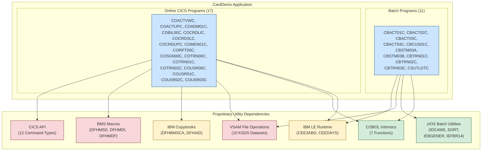

# Executive Summary — Proprietary Utilities Assessment

## AWS CardDemo Mainframe-to-Cloud Migration Analysis

**Document Type:** Migration Analysis Executive Summary
**Application:** AWS CardDemo — Credit Card Management System
**Date:** 2025
**Audience:** Business Stakeholders, Technical Leadership, Migration Program Managers

---

## Table of Contents

- [Overview](#overview)
- [Key Findings Summary](#key-findings-summary)
- [Migration Readiness Score](#migration-readiness-score)
- [Critical Path Items](#critical-path-items)
- [Stakeholder Recommendations](#stakeholder-recommendations)
- [Report Navigation](#report-navigation)

---

## Overview

### Purpose of This Assessment

This document presents a comprehensive assessment of all proprietary mainframe utility dependencies within the AWS CardDemo application. The analysis was conducted to support stakeholder confidence in the feasibility and planning of a mainframe-to-cloud migration by providing:

1. **Complete visibility** into every proprietary technology dependency in the application
2. **Concrete migration plans** with specific Java library and framework replacements for each dependency
3. **Honest risk disclosure** identifying areas where migration complexity is highest and behavioral differences are most likely
4. **A testing strategy** to validate that migrated components produce identical results to their mainframe counterparts

CardDemo is a credit card management demonstration application built on IBM mainframe technologies. It serves as a representative example of enterprise mainframe workloads, handling account management, credit card operations, transaction processing, bill payment, user administration, and batch reporting.

### Scope of Analysis

The assessment covers the complete CardDemo codebase across all technology layers:

| Component | Count | Location | Description |
|:----------|------:|:---------|:------------|
| COBOL Programs — Batch | 11 | `app/cbl/CB*.cbl`, `app/cbl/CS*.cbl` | Batch processing programs for account processing, transaction posting, interest calculation, statement generation, and date validation |
| COBOL Programs — Online (CICS) | 17 | `app/cbl/CO*.cbl` | Interactive programs for account viewing, credit card management, transaction entry, bill payment, reporting, user administration, and sign-on |
| Copybooks | 28 | `app/cpy/` | Shared data structure definitions including record layouts, screen maps, communication areas, and IBM-proprietary constant sets |
| BMS Map Sources | 17 | `app/bms/` | 3270 terminal screen definitions specifying field positions, attributes, colors, and input validation for all online program screens |
| VSAM Catalog Snapshot | 1 | `app/catlg/LISTCAT.txt` | IDCAMS LISTCAT output documenting 10 VSAM KSDS cluster definitions with key positions, record sizes, and storage attributes |
| Test Data Fixtures | 9 | `app/data/ASCII/` | Fixed-width ASCII data files for accounts, cards, customers, transactions, disclosure groups, category balances, and user security records |

**Technologies assessed:** COBOL, CICS Transaction Server, VSAM (Virtual Storage Access Method), JCL (Job Control Language), RACF (Resource Access Control Facility), IBM Language Environment (LE) runtime services, BMS (Basic Mapping Support) macros, and z/OS batch utilities.

Source: `app/cbl/` (28 programs), `app/cpy/` (28 copybooks), `app/bms/` (17 BMS maps), `app/catlg/LISTCAT.txt`, `README.md`

---

## Key Findings Summary

The assessment identified **7 categories of proprietary utility dependencies** spanning the entire application. The table below summarizes the scope and distribution of each category.

### Proprietary Utility Inventory Summary

| Category | Utilities Found | Programs Affected | Total Usage Sites | Risk Level |
|:---------|:----------------|:------------------|:-----------------:|:----------:|
| IBM LE Runtime Services | 2 (CEE3ABD, CEEDAYS) | 10 programs | 11 call sites | Medium–High |
| CICS Transaction Server API | 12 distinct command types | 17 online programs | ~170 EXEC CICS commands | Medium–Very High |
| z/OS Batch Utilities | 4 (IDCAMS, SORT, IEBGENER, IEFBR14) | 6+ batch JCL jobs | 15+ JCL steps | Low–Medium |
| BMS Map Macros | 3 (DFHMSD, DFHMDI, DFHMDF) | 17 BMS sources | 17 screen definitions | Very High |
| IBM Proprietary Copybooks | 2 (DFHBMSCA, DFHAID) | All 17 CICS programs | 34+ COPY statements | Medium |
| COBOL Intrinsic Functions | 7 migration-relevant functions | 10+ programs | ~175 function references | Low |
| VSAM File Operations | 10 KSDS datasets | All 28 programs | Universal FILE STATUS checking | High |

### Category Details

**IBM Language Environment Runtime Services** — Two IBM-specific runtime services were identified:

- **CEE3ABD** (Abend Handler): Called by 9 batch programs (CBACT01C, CBACT02C, CBACT03C, CBACT04C, CBCUS01C, CBSTM03A, CBTRN01C, CBTRN02C, CBTRN03C) to perform abnormal program termination when unrecoverable errors occur during file operations.
  Source: `app/cbl/CBACT01C.cbl:173`

- **CEEDAYS** (Lillian Date Conversion): Wrapped by the CSUTLDTC utility program and consumed indirectly by CORPT00C and COTRN02C through the CSUTLDPY copybook. Converts text dates to Lillian day numbers (days since October 15, 1582) for date validation, with 8 distinct error feedback conditions.
  Source: `app/cbl/CSUTLDTC.cbl:116-120`

**CICS Transaction Server API** — 12 distinct command types were identified across 17 online programs, totaling approximately 170 EXEC CICS command invocations:

- **File Control** (READ, WRITE, REWRITE, DELETE): 13 programs access VSAM files (ACCTDAT, CARDDAT, XREFDAT, CRDTRN, USRSEC, CARDAIX) through CICS file control commands.
- **Browse Control** (STARTBR, READNEXT, READPREV, ENDBR): 5 programs implement sequential record browsing with cursor-based positioning.
- **Program Control** (XCTL, RETURN, LINK): Used for inter-program navigation, menu routing, and pseudo-conversational return with transaction IDs.
- **Terminal Control** (SEND MAP, RECEIVE MAP, SEND TEXT): All 17 CICS programs use screen I/O commands tied to 17 BMS map definitions.
- **System Services** (ASSIGN, ASKTIME, FORMATTIME): Used by COSGN00C for system identification and COBIL00C for timestamp formatting.
  Source: `app/cbl/COSGN00C.cbl:198`, `app/cbl/COBIL00C.cbl:251`
- **Transient Data Queue** (WRITEQ TD): CORPT00C writes dynamically generated JCL to the 'JOBS' queue for asynchronous batch job submission via the JES internal reader.
  Source: `app/cbl/CORPT00C.cbl:517-523`

**z/OS Batch Utilities** — 4 IBM utilities are referenced across batch JCL jobs:

- **IDCAMS**: Used by 10+ JCL jobs (DEFVSAM, ACCTFILE, CARDFILE, CUSTFILE, XREFFILE, TCATBALF, TRANBKP, DISCGRP, TRANCATG, TRANTYPE, TRANIDX) for VSAM dataset definition, data loading, and alternate index creation.
  Source: `README.md:238-251`
- **SORT** (DFSORT/SyncSort): Used by the COMBTRAN job to merge daily transactions with system transactions.
  Source: `README.md:254`
- **IEBGENER**: Used by the DUSRSECJ job for initial load of user security data from a sequential source.
  Source: `README.md:237`
- **IEFBR14**: Used by CLOSEFIL and OPENFIL jobs for VSAM file allocation and deallocation management.
  Source: `README.md:247,252`

**BMS Map Macros** — 17 BMS source files use three IBM macro types to define 3270 terminal screen layouts:

- **DFHMSD**: Defines mapset-level properties (language, I/O mode, storage options)
- **DFHMDI**: Defines individual map dimensions and screen regions
- **DFHMDF**: Defines field-level attributes (position, length, protection, color, highlighting, input/output format)

These screen definitions serve as the user interface contract for all 17 online CICS programs.

**IBM Proprietary Copybooks** — 2 copybooks used universally across CICS programs:

- **DFHBMSCA**: Character Attribute Set constants for screen field appearance control (protected, unprotected, bright, dark, color attributes)
- **DFHAID**: Attention Identifier constants for keyboard input handling (ENTER, CLEAR, PF1–PF24 function keys)

**COBOL Intrinsic Functions** — 7 functions require mapping to Java equivalents:

CURRENT-DATE (26 references), UPPER-CASE (50 references), TRIM (65 references), NUMVAL-C (13 references), TEST-NUMVAL-C (6 references), MOD (1 reference), INTEGER-OF-DATE (1 reference).

### Highest-Risk Items

The following proprietary dependencies carry the greatest migration risk due to the absence of direct Java equivalents or the need for fundamental architectural changes:

1. **TDQ/JCL Batch Submission** — CORPT00C dynamically constructs JCL and writes it to a Transient Data Queue routed to the JES internal reader for asynchronous batch job submission. No direct Java equivalent exists for this pattern.
   Source: `app/cbl/CORPT00C.cbl:517-523`

2. **BMS 3270 Screen Definitions** — 17 BMS map files define the entire user interface using a coordinate-based, field-attribute model specific to 3270 terminals. Migration requires a complete presentation layer replacement.

3. **VSAM Browse Semantics** — Cursor-based sequential browsing (STARTBR/READNEXT/READPREV/ENDBR) with position maintenance differs from SQL cursor behavior, affecting pagination and data navigation logic.

4. **CEEDAYS Date Edge Cases** — The IBM Language Environment CEEDAYS service returns 8 distinct feedback conditions for date validation errors. Java's `java.time` provides fewer granular error categories, creating potential behavioral differences at boundary conditions.
   Source: `app/cbl/CSUTLDTC.cbl:62-70`

---

## Migration Readiness Score

The aggregate migration readiness assessment classifies all proprietary utilities into three tiers based on the availability of Java equivalents, behavioral fidelity risk, and implementation effort required.

### Readiness Tier Summary

```
┌──────────────────────────────────────────────────────────────────────┐
│                    MIGRATION READINESS OVERVIEW                      │
├──────────────────────────────────────────────────────────────────────┤
│                                                                      │
│   LOW RISK (Direct Java Equivalents Available)            ~30%       │
│   ████████████░░░░░░░░░░░░░░░░░░░░░░░░░░░░░░░░░░░░░░░░░             │
│   IEBGENER, IEFBR14, COBOL Intrinsics, IDCAMS, System Services      │
│                                                                      │
│   MEDIUM RISK (Java Equivalents Require Validation)       ~35%       │
│   ████████████████░░░░░░░░░░░░░░░░░░░░░░░░░░░░░░░░░░░░░             │
│   CEE3ABD, CICS File Control, SORT, COMMAREA, Copybooks              │
│                                                                      │
│   HIGH RISK (Architectural Rethinking Required)           ~35%       │
│   ████████████████░░░░░░░░░░░░░░░░░░░░░░░░░░░░░░░░░░░░░             │
│   TDQ/JCL, BMS Maps, VSAM Browse, CEEDAYS Edge Cases                │
│                                                                      │
└──────────────────────────────────────────────────────────────────────┘
```

### Detailed Readiness by Utility

| Utility | Readiness Tier | Java Equivalent | Key Concern |
|:--------|:---------------|:----------------|:------------|
| IEBGENER | LOW | `java.nio.file.Files.copy()` | Straightforward sequential file copy |
| IEFBR14 | LOW | `java.nio.file.Files` create/delete | Trivial file system operations |
| COBOL Intrinsics | LOW | Java Standard Library (`java.time`, `Math`, `String`) | Well-matched function-by-function |
| CICS ASSIGN/ASKTIME/FORMATTIME | LOW | `System.getProperty()`, `java.time.LocalDateTime` | Standard system operations |
| IDCAMS | LOW–MEDIUM | DDL scripts, Flyway/Liquibase | VSAM cluster attributes require schema translation |
| CEE3ABD | MEDIUM | Custom exception framework + `System.exit()` | Dump diagnostic differences |
| CICS File Control (CRUD) | MEDIUM | Spring Data JPA, JDBC | Transaction boundary semantics differ |
| SORT (DFSORT) | MEDIUM | Java Streams API, Apache Commons CSV | EBCDIC collation and fixed-width record handling |
| COMMAREA / Copybooks | MEDIUM | Java enums, constants, HttpSession | Byte-level layout mapping required |
| CEEDAYS | MEDIUM–HIGH | `java.time.LocalDate`, `JulianFields` | 8 feedback conditions map to fewer Java exceptions |
| CICS TDQ (WRITEQ TD) | HIGH | JMS + Spring Batch, or AWS Batch | No direct equivalent; architectural replacement needed |
| VSAM Browse (STARTBR/READNEXT) | HIGH | Spring Data JPA Pageable, JDBC cursors | Cursor positioning and locking differ |
| BMS Map Macros | HIGH | Spring MVC + Thymeleaf, or REST + SPA | Complete UI paradigm shift from 3270 to web |

### Overall Assessment

- **Approximately 30% of dependencies** (by count) can be migrated with direct library substitution and minimal risk. These include file copy utilities, null program replacements, intrinsic function mappings, and basic system service calls.

- **Approximately 35% of dependencies** require careful implementation and behavioral validation. Java equivalents exist but differ in error handling semantics, transaction boundaries, or data encoding. Thorough testing is essential to confirm behavioral parity.

- **Approximately 35% of dependencies** require architectural rethinking or custom development. These represent the most significant migration investment and include the entire presentation layer (BMS to web), asynchronous batch job submission, and VSAM browse patterns.

---

## Critical Path Items

The following four items represent the highest-impact migration challenges that should be addressed first in planning and resource allocation. Each affects multiple programs and requires early architectural decisions that will shape the overall migration approach.

### 1. BMS-to-Web User Interface Migration

**Impact:** All 17 online CICS programs depend on 17 BMS map definitions for their user interface.

The CardDemo application's entire user experience is defined through BMS (Basic Mapping Support) macros that describe 3270 terminal screens using a fixed 24×80 character grid with field-level attributes for position, length, color, protection, and highlighting. This coordinate-based screen model has no direct equivalent in modern web technologies.

**Why this is critical:** Every online program's user interaction logic is coupled to the BMS/3270 model. The migration requires a complete presentation layer replacement — either HTML forms with CSS styling, a REST API with a single-page application frontend, or a combination. This decision affects the architecture of all 17 online programs and should be made early.

**Recommended approach:** Map DFHMSD mapsets to page templates, DFHMDI maps to form sections, and DFHMDF fields to HTML input elements. Replace DFHBMSCA attribute constants with CSS classes and DFHAID key constants with JavaScript event handlers.

### 2. TDQ/JCL Replacement Architecture

**Impact:** CORPT00C (Transaction Reports) submits batch jobs by dynamically constructing JCL and writing records to a Transient Data Queue routed to the JES internal reader.

Source: `app/cbl/CORPT00C.cbl:517-523`

This is a mainframe-specific pattern for triggering asynchronous batch work from an online transaction. The CICS program writes 80-byte JCL records to the 'JOBS' TDQ, which the system routes to JES for job scheduling and execution.

**Why this is critical:** No single Java library replicates this behavior. The replacement must address both the message queuing mechanism (replacing TDQ) and the batch execution trigger (replacing JES internal reader submission). This requires an architectural decision about the target batch execution platform.

**Recommended approach:** Use a message queue (JMS with ActiveMQ or RabbitMQ) for the queuing layer and Spring Batch or AWS Batch for job execution. The online application publishes a job request message; a listener triggers batch execution.

### 3. VSAM-to-RDBMS Data Layer Migration

**Impact:** 10 VSAM KSDS (Key-Sequenced Data Set) clusters serve as the application's data store, accessed by all 28 programs.

Source: `app/catlg/LISTCAT.txt` (10 VSAM cluster definitions)

The VSAM catalog snapshot documents cluster attributes including key length, key position, record size, CI (Control Interval) size, and storage allocation for datasets covering accounts, cards, customers, transactions, cross-references, disclosure groups, category balances, and user security.

**Why this is critical:** The VSAM-to-RDBMS mapping is foundational — every program that reads or writes data depends on the data layer. The KSDS key structure, record layouts (defined in copybooks), and file status checking patterns must all be translated to relational database schemas, SQL operations, and exception handling.

**Recommended approach:** Map each VSAM KSDS cluster to a relational database table, with KSDS keys becoming primary keys and record fields becoming columns. Use the copybook record layouts (CVACT01Y, CVACT02Y, CVACT03Y, CUSTREC, CVTRA01Y–CVTRA05Y) as the authoritative field definitions. Apply IDCAMS DEFINE CLUSTER attributes to inform DDL design. Use Flyway or Liquibase for schema version management.

### 4. CICS Pseudo-Conversational State Management

**Impact:** All 17 CICS online programs use the COMMAREA (Communication Area) defined in COCOM01Y.cpy for inter-program state passing.

Source: `app/cpy/COCOM01Y.cpy` (CARDDEMO-COMMAREA, structured fields for user context, customer info, account info, card info, and navigation state)

The CICS pseudo-conversational programming model works as follows: a program processes a user request, sends a screen to the terminal, and then terminates — returning control to CICS with a RETURN TRANSID command and a COMMAREA containing the application state. When the user responds, CICS starts a new program instance and passes the saved COMMAREA back. This model is fundamentally different from the stateful session model used in web applications.

**Why this is critical:** The COMMAREA is the backbone of the application's state management. Its fixed byte-level layout carries user identity, current program context, customer and account identifiers, and navigation history. The migration must preserve the application's conversational flow while adapting to a web-compatible state management mechanism (such as HTTP sessions, server-side session stores, or JWT tokens).

**Recommended approach:** Map COMMAREA fields to a Java session bean or session-scoped Spring component. Replace XCTL/RETURN TRANSID navigation with Spring MVC controller routing and request mapping. Maintain the same logical flow while using HTTP session state instead of CICS COMMAREA.

---

## Stakeholder Recommendations

### Recommended Migration Approach: Phased Execution

Based on the assessment findings, a four-phase migration approach is recommended, sequenced to address the lowest-risk, most self-contained components first and build toward the higher-complexity interactive components.

#### Phase 1: Batch Program Migration

**Scope:** 11 batch COBOL programs (CBACT01C–CBACT04C, CBCUS01C, CBSTM03A, CBSTM03B, CBTRN01C–CBTRN03C, CSUTLDTC)

**Rationale:** Batch programs have well-defined input/output boundaries (read file → process → write file) with minimal interactive dependencies. They rely on CEE3ABD for error handling and VSAM for file I/O — both of which have established Java replacement patterns.

**Key activities:**
- Replace CEE3ABD abend calls with a Java exception handling framework
- Replace CEEDAYS date validation with `java.time` API equivalents
- Replace VSAM file I/O with JDBC or JPA data access
- Replace CBSTM03B centralized I/O subroutine with a Java service/DAO pattern
- Validate batch output against existing test data fixtures using byte-by-byte comparison

**Estimated complexity:** Medium

#### Phase 2: Data Layer Migration

**Scope:** 10 VSAM KSDS clusters, IDCAMS operations, SORT utility, IEBGENER, IEFBR14

**Rationale:** Establishing the relational database schema and data migration pipeline is a prerequisite for the online program migration. This phase converts VSAM datasets to relational tables, replaces JCL-based data management jobs with SQL scripts, and validates data integrity.

**Key activities:**
- Design relational schema from VSAM cluster attributes and copybook record layouts
- Convert IDCAMS DEFINE CLUSTER operations to DDL (CREATE TABLE) scripts
- Replace SORT merge operations with Java-based file processing
- Replace IEBGENER sequential copy with Java file I/O
- Migrate test data fixtures and validate record-level data integrity

**Estimated complexity:** Medium

#### Phase 3: Online Program Migration

**Scope:** 17 CICS online programs, 17 BMS maps, COMMAREA state management, TDQ batch submission

**Rationale:** This is the highest-complexity phase, requiring replacement of the CICS pseudo-conversational model, 3270 screen definitions, and the TDQ job submission mechanism. It should be undertaken after the data layer is stable.

**Key activities:**
- Replace BMS map definitions with web UI templates (HTML/CSS) or REST API endpoints
- Replace CICS program control (XCTL/RETURN) with Spring MVC controller routing
- Replace COMMAREA state management with HTTP session or Spring session beans
- Replace DFHBMSCA/DFHAID constants with CSS classes and JavaScript event handlers
- Replace TDQ WRITEQ TD with message queue (JMS) and batch execution trigger
- Implement field-level validation to match BMS DFHMDF constraints

**Estimated complexity:** High to Very High

#### Phase 4: Integration Testing and Behavioral Parity Validation

**Scope:** End-to-end testing across all migrated components

**Rationale:** Comprehensive validation ensures the migrated application produces identical results to the mainframe original. This phase uses the test data fixtures as baseline and applies per-utility behavioral parity test cases.

**Key activities:**
- Execute byte-by-byte file comparison for batch output files
- Validate RDBMS state against VSAM record snapshots after each operation
- Run regression test suite using extracted test data points
- Validate date conversion edge cases (CEEDAYS feedback conditions)
- Perform end-to-end user workflow testing for all online functions
- Document and resolve any behavioral differences

**Estimated complexity:** Medium

### Resource Requirements

| Role | Responsibility | Estimated Need |
|:-----|:---------------|:---------------|
| Java Spring Developers | Core migration implementation (Spring Boot, Spring Data, Spring MVC, Spring Batch) | 3–5 developers |
| COBOL Domain Experts | Source code analysis, business rule validation, behavioral parity review | 1–2 specialists |
| Database Engineers | VSAM-to-RDBMS schema design, data migration, query optimization | 1–2 engineers |
| UI/UX Developers | BMS-to-web interface conversion, responsive design, accessibility | 1–2 developers |
| Test/QA Engineers | Behavioral parity test design, regression test execution, CI pipeline setup | 2–3 engineers |
| Project Manager | Phase coordination, stakeholder communication, risk tracking | 1 manager |

### Key Success Factors

1. **Behavioral parity as the acceptance criterion** — The migrated Java application must produce identical results to the mainframe original for all business operations. Functional equivalence without byte-level output matching must be explicitly justified and documented.

2. **Early architectural decisions** — The four critical path items (BMS replacement, TDQ replacement, VSAM-to-RDBMS mapping, COMMAREA state management) require architectural decisions before coding begins. These decisions shape the overall migration approach.

3. **Incremental validation** — Each migration phase should include its own validation cycle rather than deferring all testing to Phase 4. Early defect detection reduces rework.

4. **Mainframe expertise retention** — COBOL domain knowledge is essential for understanding business rules embedded in the source code. Subject matter experts should be available throughout all phases.

---

## Utility Dependency Overview

The following diagram provides a high-level view of how the CardDemo application's programs depend on proprietary utility categories:



**Legend:**
- 🟢 Green: Low Risk — Direct Java equivalents available
- 🟡 Yellow: Medium Risk — Java equivalents require behavioral validation
- 🔴 Red: High Risk — Architectural rethinking or custom development required

---

## Report Navigation

This executive summary is the entry point for a comprehensive five-part migration analysis. Each document provides progressively deeper technical detail for implementation teams.

| Document | Description | Audience |
|:---------|:------------|:---------|
| **[Full Utility Inventory](01-proprietary-utility-inventory.md)** | Exhaustive catalog of all proprietary utilities classified by type, with parameters, consuming programs, and source code citations | Technical Architects, Developers |
| **[Dependency Impact Analysis](02-dependency-impact-analysis.md)** | Per-utility complexity assessment (Low/Medium/High/Very High) with specific Java equivalent mappings and behavioral gap flags | Technical Leads, Migration Engineers |
| **[Migration Strategy](03-migration-strategy.md)** | Per-utility migration playbooks with recommended approaches, Java library versions, and COBOL-to-Java code mapping examples | Developers, Solution Architects |
| **[Risk Assessment Details](04-risk-assessment.md)** | Risk matrix classifying each utility by migration difficulty and behavioral fidelity risk, with unknowns disclosure and vendor engagement recommendations | Project Managers, Risk Officers, Technical Leadership |
| **[Testing & Validation Framework](05-testing-validation-framework.md)** | Behavioral parity testing strategy with byte-by-byte file comparison, database state validation, per-utility test cases, and CI pipeline design | QA Engineers, Test Architects |

### Supporting Diagrams

| Diagram | Description |
|:--------|:------------|
| **[Utility Dependency Map](diagrams/utility-dependency-map.md)** | Mermaid graph mapping all 28 COBOL programs to their proprietary utility dependencies |
| **[CICS Command Migration Flow](diagrams/cics-command-flow.md)** | Sequence diagram showing CICS command categories and their Spring/Java migration paths |
| **[VSAM-to-RDBMS Mapping](diagrams/vsam-to-rdbms-mapping.md)** | ER diagram mapping VSAM KSDS clusters to relational database tables |
| **[Batch Job Migration Flow](diagrams/batch-job-migration-flow.md)** | Flowchart showing each batch job's utility chain and the Java/cloud replacement pipeline |

---

*This assessment was produced through static analysis of the complete CardDemo codebase. All utility references cite specific source files and line numbers for traceability. For questions or updates, refer to the individual analysis documents linked above.*
