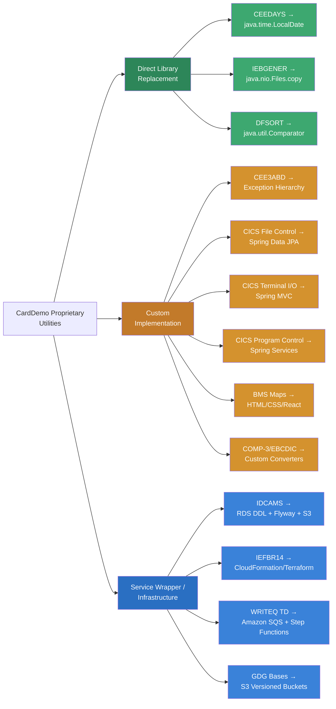

# CardDemo Proprietary Mainframe Utility Assessment — Executive Summary

## Purpose

This document presents a comprehensive inventory and migration analysis of all IBM proprietary dependencies in the **AWS CardDemo COBOL/CICS/VSAM application**. The assessment was conducted through systematic static code analysis of every source artifact in the repository, combined with external documentation research against IBM official references and community migration resources.

The goal is to provide stakeholders with an evidence-based understanding of **exactly** what proprietary dependencies exist, a researched migration path for each, a transparent risk assessment, and a concrete testing strategy to validate behavioral parity between mainframe and Java implementations.

---

## Scope Overview

The analysis encompasses the complete CardDemo application codebase:

| Artifact Category | Count | Description |
|-------------------|------:|-------------|
| **COBOL Source Programs** | 28 | 9 batch programs (`CBACT01C`–`CBTRN03C`), 1 utility (`CSUTLDTC`), 1 batch I/O subroutine (`CBSTM03B`), and 17 online CICS programs (`COACTUPC`–`COUSR03C`) |
| **Copybooks** | 28 | Record layouts (`CVACT01Y`, `CVCUS01Y`, `CVTRA01Y`–`CVTRA07Y`), communication areas (`COCOM01Y`), screen contracts, and system definitions (`DFHAID`, `DFHBMSCA`) |
| **BMS Mapsets** | 17 | 3270 terminal screen definitions for all online transactions — from signon (`COSGN00`) through account management, credit cards, transactions, reports, and user administration |
| **VSAM KSDS Clusters** | 13 | Key-Sequenced Data Sets for accounts, cards, customers, transactions, cross-references, disclosure groups, category balances, and user security |
| **Alternate Indexes (AIX)** | 3 | Secondary access paths: `TRANSACT-AIX1`, `TRANSACT-AIX2`, `CARDXREF-AIX1` |
| **GDG Bases** | 7+ | Generation Data Groups for daily rejects (`DALYREJS`), system transactions (`SYSTRAN`), backups, combined transactions, and reports |
| **Batch Jobs** | 18 | Complete job catalog from `CLOSEFIL` through `POSTTRAN` → `INTCALC` → `COMBTRAN` → `CREASTMT` pipeline to `OPENFIL` |

> **Source**: Application inventory derived from [`README.md`](../../README.md) batch job catalog and online transaction tables, VSAM topology from [`app/catlg/LISTCAT.txt`](../../app/catlg/LISTCAT.txt), and static analysis of all source files in [`app/cbl/`](../../app/cbl/).

---

## Key Findings Summary

### 20+ Distinct Proprietary Utilities Identified Across 5 Categories

**1. IBM Language Environment (LE) Callable Services** — 2 utilities

| Utility | Function | Usage | Source Reference |
|---------|----------|-------|------------------|
| **`CEE3ABD`** | Terminates enclave with user abend code | 9 batch programs — all use `ABCODE=999`, `TIMING=0` | [`CBACT01C.cbl:173`](../../app/cbl/CBACT01C.cbl), and 8 additional batch programs |
| **`CEEDAYS`** | Converts character date to Lilian format (days since October 14, 1582) | 1 wrapper program, called from 2 online programs | [`CSUTLDTC.cbl:116`](../../app/cbl/CSUTLDTC.cbl) — wrapper called from `CORPT00C` and `COTRN02C` |

**2. CICS Runtime Commands** — 18 distinct command types

Across all 19 online programs, 18 distinct `EXEC CICS` command types were identified:

- **File Control** (8 types): `READ`, `WRITE`, `REWRITE`, `DELETE`, `STARTBR`, `READNEXT`, `READPREV`, `ENDBR` — VSAM record-level access operations
- **Terminal I/O** (2 types): `SEND MAP`, `RECEIVE MAP` — BMS-based 3270 screen interaction
- **Program Control** (2 types): `RETURN`, `XCTL` — Pseudo-conversational flow and inter-program transfer
- **Error Handling** (2 types): `HANDLE`, `ABEND` — Condition handling and controlled termination
- **System Services** (4 types): `ASKTIME`, `FORMATTIME`, `ASSIGN`, `WRITEQ TD` — Timestamp retrieval, system info, and Transient Data Queue operations

> **Notable finding**: `EXEC CICS WRITEQ TD QUEUE('JOBS')` in [`CORPT00C.cbl`](../../app/cbl/CORPT00C.cbl) implements a unique online-to-batch coupling pattern, submitting JCL records to an extrapartition TDQ for JES job submission — a pattern with no direct Java equivalent.

**3. JCL Utility Programs** — 4 utilities

| Utility | Batch Jobs | Function |
|---------|-----------|----------|
| **`IDCAMS`** | `DEFGDGB`, `ACCTFILE`, `CARDFILE`, `CUSTFILE`, `DISCGRP`, `TRANFILE`, `TRANCATG`, `TRANTYPE`, `XREFFILE`, `TCATBALF`, `TRANBKP`, `TRANIDX` | VSAM dataset lifecycle: `DEFINE CLUSTER`, `REPRO`, `DELETE`, `ALTER`, `LISTCAT` |
| **`DFSORT`** | `COMBTRAN` | High-performance sort/merge of transaction records |
| **`IEBGENER`** | `DUSRSECJ` | Sequential file copy for user security data loading |
| **`IEFBR14`** | `CLOSEFIL`, `OPENFIL` | No-operation placeholder for VSAM file availability control via JCL DD statements |

**4. BMS Map Processing** — 3 macro types + 2 copybooks

- **`DFHMSD`** / **`DFHMDI`** / **`DFHMDF`** macros define all 17 mapsets for 3270 terminal screens
- **`DFHBMSCA`** copybook provides character attribute constants (colors, highlighting) — used in all 19 online programs
- **`DFHAID`** copybook provides attention identifier constants (PF keys, ENTER, CLEAR) — used in all 19 online programs

**5. VSAM File Access Patterns**

- **13 KSDS clusters** with key lengths ranging from 2 bytes (`TRANTYPE`) to 16 bytes (`CARDDATA`, `TRANSACT`)
- **3 Alternate Index paths** enabling secondary key access for transactions and card cross-references
- **7+ GDG bases** providing generation-based versioning for batch output datasets
- Average record lengths range from 50 bytes (`CARDXREF`, `DISCGRP`, `TCATBALF`) to 500 bytes (`CUSTDATA`)

### External Documentation Researched

Every identified utility has been researched against IBM official documentation and community migration sources. Key references include:

- IBM z/OS Language Environment Programming Reference (CEE3ABD, CEEDAYS)
- IBM z/OS DFSMS Access Method Services (IDCAMS)
- IBM z/OS DFSORT Application Programming Guide SC23-6878
- IBM z/OS DFSMSdfp Utilities (IEBGENER)
- IBM z/OS MVS JCL Reference (IEFBR14)
- IBM CICS Transaction Server Application Programming Reference
- Community migration case studies (ING Bank/SoftwareMining COBOL-to-Java migration)

> Full citations and URLs are available in [Section 02 — External Documentation Research](./02-external-documentation-research.md).

### Java Migration Path Identified for Each Dependency

Every proprietary utility has a recommended Java migration target with specific library candidates:

| Proprietary Utility | Java Migration Target | Library / Framework |
|---------------------|----------------------|---------------------|
| `CEEDAYS` | `java.time.LocalDate` with Lilian epoch conversion | JDK 8+ `java.time` API |
| `CEE3ABD` | Custom exception hierarchy with abend code mapping | Standard Java exception handling |
| `IDCAMS` | AWS RDS DDL scripts + Flyway migrations + S3 lifecycle | Flyway 9.x, AWS SDK 2.x |
| `DFSORT` | `java.util.Comparator` with stream-based sort | Apache Commons IO 2.15.x |
| `IEBGENER` | `java.nio.file.Files.copy()` | JDK NIO (built-in) |
| `IEFBR14` | No-op — replaced by infrastructure provisioning | CloudFormation / Terraform |
| CICS File Control | Spring Data JPA repositories | Spring Data JPA 3.x, Hibernate 6.x |
| CICS Terminal I/O | Spring MVC controllers | Spring Web MVC 6.x, Thymeleaf 3.x |
| CICS Program Control | Spring service layer with DI | Spring Framework 6.x |
| `WRITEQ TD` | Amazon SQS or AWS Step Functions | AWS SDK for Java 2.x |
| BMS Maps | HTML/CSS forms or React components | React 18.x or Thymeleaf 3.x |

> Detailed recommendations with code examples are in [Section 04 — Migration Strategy Per Utility](./04-migration-strategy-per-utility.md).

---

## Migration Feasibility Assessment

Migration feasibility is assessed across three confidence tiers based on the availability of direct Java equivalents, the maturity of migration patterns, and the complexity of behavioral replication:

### HIGH Confidence — Direct Java Equivalents Exist

| Component | Rationale |
|-----------|-----------|
| **Language Environment Services** (`CEEDAYS`, `CEE3ABD`) | `CEEDAYS` maps directly to `java.time.LocalDate` with a custom Lilian epoch offset (October 14, 1582). `CEE3ABD` maps to Java exception handling with application-specific error codes. Both have well-documented IBM specifications and straightforward Java implementations. |
| **JCL Utilities** (`IEBGENER`, `IEFBR14`) | `IEBGENER` is a trivial file copy (`java.nio.file.Files.copy()`). `IEFBR14` is a no-op whose function (dataset allocation) is handled by infrastructure provisioning in the cloud. |

### MEDIUM Confidence — Requires Pattern Translation

| Component | Rationale |
|-----------|-----------|
| **CICS File Control Commands** | VSAM KSDS operations (`READ`, `WRITE`, `REWRITE`, `DELETE`, `STARTBR`, `READNEXT`, `READPREV`, `ENDBR`) have well-understood JPA/JDBC equivalents, but the record-level locking semantics (`READ UPDATE`) and browse cursor patterns require careful translation to JPA pessimistic locking and pagination. |
| **CICS Terminal I/O** | BMS map rendering (`SEND MAP`, `RECEIVE MAP`) requires field-by-field mapping of 17 mapsets to web UI components. The pattern is well-understood (Spring MVC / REST API), but the volume of screen definitions requires significant effort. |
| **JCL Utilities** (`IDCAMS`, `DFSORT`) | Both have established migration patterns, but `IDCAMS` supports a wide command vocabulary (DEFINE, REPRO, DELETE, ALTER, LISTCAT) that requires comprehensive DDL scripting, and `DFSORT` performance characteristics on large transaction volumes need validation. |

### LOW Confidence — Requires Custom Architecture

| Component | Rationale |
|-----------|-----------|
| **CICS Pseudo-Conversational Pattern** | The `RETURN TRANSID/COMMAREA` pattern that underpins all 19 online programs requires a fundamental architectural translation from stateless CICS task cycling to HTTP session management or JWT-based state handling. |
| **`WRITEQ TD` Batch Coupling** | The online-to-batch bridge in `CORPT00C` (writing JCL records to a Transient Data Queue for JES submission) has no direct equivalent and requires a redesigned async workflow using Amazon SQS and AWS Step Functions. |
| **COMP-3 / EBCDIC Data Handling** | Packed decimal (`PIC S9(n) COMP-3`) and EBCDIC-encoded data across all VSAM datasets require byte-level conversion logic with careful validation against the sample data in `app/data/EBCDIC/` and `app/data/ASCII/`. |

---

## Risk Synopsis

### Risk Distribution Summary

| Risk Level | Count | Percentage | Utilities |
|:----------:|------:|-----------:|-----------|
| **HIGH** | 5 | 25% | CICS pseudo-conversational pattern, VSAM-to-JDBC file control (8 commands), WRITEQ TD batch coupling, VSAM KSDS/AIX topology migration, COMP-3/EBCDIC data conversion |
| **MEDIUM** | 5 | 25% | BMS-to-web UI mapping (17 mapsets), DFSORT, IDCAMS, CICS ASKTIME/FORMATTIME, CICS HANDLE/ABEND |
| **LOW** | 4 | 20% | CEE3ABD, CEEDAYS, IEBGENER, IEFBR14 |
| **Architectural** | 6 | 30% | CICS program control (RETURN/XCTL), COMMAREA state management, DFHBMSCA/DFHAID copybook translation, GDG-to-S3 versioning, batch job orchestration, CICS ASSIGN |

### HIGH RISK Items — Key Concerns

| HIGH RISK Utility | Primary Risk Factor | Mitigation Approach |
|-------------------|--------------------|--------------------|
| **CICS Pseudo-Conversational** | Fundamental architectural mismatch — CICS task cycling vs. HTTP stateless model requires complete redesign of program flow across all 19 online programs | Implement Spring Security session management with JWT tokens; map COMMAREA fields to session attributes; prototype with `COSGN00C` signon flow first |
| **VSAM-to-JDBC File Control** | 8 CICS file control commands with record-level locking semantics, browse cursors, and RESP/RESP2 error patterns differ fundamentally from JPA | Map to Spring Data JPA with pessimistic locking (`@Lock`); replace browse operations with paginated queries; implement comprehensive RESP code → exception mapping |
| **WRITEQ TD Batch Coupling** | Unique pattern in `CORPT00C` — no direct Java equivalent for online-to-JES job submission via TDQ | Replace with Amazon SQS message publication triggering AWS Step Functions workflow; preserve JCL parameter passing via SQS message attributes |
| **VSAM KSDS/AIX Topology** | 13 clusters + 3 alternate indexes require schema design that preserves key structures, access patterns, and referential integrity not explicitly enforced in VSAM | Design RDS schema with Flyway-managed DDL preserving all primary keys; implement AIX equivalents as secondary indexes; validate with full dataset reload |
| **COMP-3/EBCDIC Data Conversion** | Binary packed decimal and EBCDIC encoding across all datasets requires byte-level precision during data migration | Develop custom EBCDIC-to-ASCII converter validated against `app/data/` sample pairs; implement COMP-3 unpacker with edge case testing (signed values, odd-length fields) |

> Detailed risk analysis, mitigation narratives, and vendor engagement recommendations are in [Section 05 — Risk Assessment](./05-risk-assessment.md).

---

## Utility Migration Decision Tree

The following diagram classifies each proprietary utility into one of three migration approach categories:

**Legend**:
- 🟩 **Direct Library Replacement** (GREEN): An existing Java standard library or well-established open-source library provides equivalent functionality with minimal custom code.
- 🟧 **Custom Implementation** (ORANGE): Requires purpose-built Java code leveraging specific frameworks (Spring, JPA) with significant design and testing effort.
- 🟦 **Service Wrapper / Infrastructure** (BLUE): The mainframe utility function is replaced by an AWS managed service or infrastructure-as-code provisioning rather than application code.

---

## Report Navigation

This executive summary is the entry point to the complete migration analysis documentation. The report is organized into six main analysis sections and five detailed appendices:

### Main Analysis Sections

| # | Section | Description |
|---|---------|-------------|
| 00 | **Executive Summary** *(this document)* | Stakeholder-facing overview, key findings, risk synopsis |
| 01 | [Proprietary Utility Inventory](./01-proprietary-utility-inventory.md) | Complete catalog of all IBM proprietary utilities with source locations, parameters, and classifications |
| 02 | [External Documentation Research](./02-external-documentation-research.md) | Per-utility web search findings with IBM documentation URLs, behavioral specifications, and community migration patterns |
| 03 | [Dependency Impact Analysis](./03-dependency-impact-analysis.md) | Cross-referenced behavioral analysis of each utility in CardDemo context with complexity ratings |
| 04 | [Migration Strategy Per Utility](./04-migration-strategy-per-utility.md) | Concrete Java implementation recommendations with specific library candidates and code examples |
| 05 | [Risk Assessment](./05-risk-assessment.md) | Risk matrix with HIGH/MEDIUM/LOW classifications, documentation gap analysis, and mitigation narratives |
| 06 | [Testing & Validation Framework](./06-testing-validation-framework.md) | Byte-level comparison strategy, database state validation, regression test design, and edge case catalog |

### Appendices

| ID | Appendix | Description |
|----|----------|-------------|
| A | [CICS Command Reference](./appendices/A-cics-command-reference.md) | Complete EXEC CICS command inventory with per-program usage matrix and Spring MVC/JPA mapping |
| B | [VSAM Dataset Catalog](./appendices/B-vsam-dataset-catalog.md) | Full VSAM topology — 13 KSDS clusters, 3 AIX paths, 7+ GDG bases — with RDS/S3 migration targets |
| C | [Batch Job Dependency Map](./appendices/C-batch-job-dependency-map.md) | Batch processing chain documentation with utility dependencies and JCL-to-Step Functions mapping |
| D | [BMS Screen Inventory](./appendices/D-bms-screen-inventory.md) | 17 BMS mapset catalog with field definitions, AID key handling, and web UI migration considerations |
| E | [Source Code Cross-Reference](./appendices/E-source-code-cross-reference.md) | Master index mapping every COBOL source file to its proprietary dependencies with line-number citations |

---

## Methodology Notes

This assessment was produced through:

1. **Static code analysis** of all 28 COBOL source files using pattern matching for `CALL` statements, `EXEC CICS` commands, `COPY` directives, and file I/O declarations
2. **VSAM catalog parsing** of the IDCAMS `LISTCAT` output in [`app/catlg/LISTCAT.txt`](../../app/catlg/LISTCAT.txt)
3. **External documentation research** against IBM official documentation, community tutorials, and migration case studies — using search queries following prescribed templates (e.g., "[Utility Name] IBM mainframe documentation", "[Utility Name] Java equivalent")
4. **Cross-reference validation** ensuring every technical claim traces to a specific source file and, where possible, a line number within the CardDemo repository

All source code citations use paths relative to the repository root (e.g., `app/cbl/CSUTLDTC.cbl:116`). All external documentation links are preserved in [Section 02](./02-external-documentation-research.md) as the canonical citation store.

---

*Next: [Proprietary Utility Inventory →](./01-proprietary-utility-inventory.md)*
