# 1. Proprietary Utility Inventory — Complete Catalog of IBM Mainframe Dependencies

> **Document Status:** Complete | **Last Updated:** 2024 | **Classification:** Migration Analysis
>
> This document provides a comprehensive catalog of every IBM proprietary mainframe utility, runtime service, and system dependency identified in the AWS CardDemo application. Each entry specifies the utility name, invocation parameters, expected behavior, source file locations with line-number citations, and classification as business logic or infrastructure. This inventory serves as the foundation for all subsequent migration analysis sections.

---

## Table of Contents

- [1.1 Overview and Methodology](#11-overview-and-methodology)
- [1.2 Summary of Findings](#12-summary-of-findings)
- [1.3 IBM Language Environment Callable Services](#13-ibm-language-environment-callable-services)
  - [1.3.1 CEE3ABD — Terminate Enclave with Abend](#131-cee3abd--terminate-enclave-with-abend)
  - [1.3.2 CEEDAYS — Convert Date to Lilian Format](#132-ceedays--convert-date-to-lilian-format)
- [1.4 CICS Runtime Commands](#14-cics-runtime-commands)
  - [1.4.1 File Control Commands](#141-file-control-commands)
  - [1.4.2 Terminal I/O Commands](#142-terminal-io-commands)
  - [1.4.3 Program Control Commands](#143-program-control-commands)
  - [1.4.4 Error Handling Commands](#144-error-handling-commands)
  - [1.4.5 System Service Commands](#145-system-service-commands)
- [1.5 JCL Utility Programs](#15-jcl-utility-programs)
  - [1.5.1 IDCAMS — Access Method Services](#151-idcams--access-method-services)
  - [1.5.2 DFSORT — Data Facility Sort](#152-dfsort--data-facility-sort)
  - [1.5.3 IEBGENER — Sequential Dataset Copy](#153-iebgener--sequential-dataset-copy)
  - [1.5.4 IEFBR14 — No-Operation Utility](#154-iefbr14--no-operation-utility)
- [1.6 BMS Map Processing](#16-bms-map-processing)
  - [1.6.1 BMS Macros (DFHMSD, DFHMDI, DFHMDF)](#161-bms-macros-dfhmsd-dfhmdi-dfhmdf)
  - [1.6.2 BMS Copybooks (DFHBMSCA, DFHAID)](#162-bms-copybooks-dfhbmsca-dfhaid)
- [1.7 VSAM File Access Patterns](#17-vsam-file-access-patterns)
  - [1.7.1 KSDS Clusters](#171-ksds-clusters)
  - [1.7.2 Alternate Indexes and Paths](#172-alternate-indexes-and-paths)
  - [1.7.3 Generation Data Groups](#173-generation-data-groups)
- [1.8 Classification Summary](#18-classification-summary)
- [1.9 Utility Classification Diagram](#19-utility-classification-diagram)
- [1.10 Per-Program Dependency Matrix](#110-per-program-dependency-matrix)
- [Navigation](#navigation)

---

## 1.1 Overview and Methodology

### Scope

This inventory catalogs **every** IBM proprietary mainframe dependency in the CardDemo application, spanning:

- **28 COBOL source programs** in `app/cbl/` (11 batch, 17 online CICS)
- **28 copybooks** in `app/cpy/` (record layouts, screen I/O contracts, procedural includes)
- **17 BMS mapset definitions** in `app/bms/` (3270 terminal screen layouts)
- **1 VSAM catalog snapshot** in `app/catlg/LISTCAT.txt` (dataset topology)
- **Batch job catalog** documented in `README.md` (JCL utility references)

### Methodology

The inventory was constructed through **static code analysis** using the following extraction patterns:

| Pattern | Target | Purpose |
|---------|--------|---------|
| `CALL '...'` / `CALL "..."` | `app/cbl/*.cbl`, `app/cbl/*.CBL` | Identify Language Environment service invocations |
| `EXEC CICS ...` | `app/cbl/CO*.cbl` | Extract all CICS runtime command types and parameters |
| `COPY ...` | `app/cbl/CO*.cbl` | Identify BMS copybook dependencies (DFHBMSCA, DFHAID) |
| `DFHMSD` / `DFHMDI` / `DFHMDF` | `app/bms/*.bms` | Catalog BMS macro usage across mapsets |
| `CLUSTER` / `AIX` / `GDG BASE` | `app/catlg/LISTCAT.txt` | Extract VSAM dataset topology |
| Batch job table | `README.md` | Map JCL utility references (IDCAMS, SORT, IEBGENER, IEFBR14) |

### Classification Scheme

Each utility is classified into one of two categories:

- **Business Logic** — Utilities that implement or directly support application-specific processing (e.g., date conversion for business rules)
- **Infrastructure** — Utilities that provide runtime services, data management, terminal I/O, or system operations not specific to business domain logic

---

## 1.2 Summary of Findings

| Category | Utility Count | Total Occurrences | Classification |
|----------|:------------:|:-----------------:|----------------|
| IBM Language Environment Services | 2 | 10 CALL statements | 1 Business Logic, 1 Infrastructure |
| CICS Runtime Commands | 18 command types | 150 EXEC CICS statements | Infrastructure (all) |
| JCL Utility Programs | 4 | 20 batch job references | Infrastructure (all) |
| BMS Map Processing | 3 macro types + 2 copybooks | 953 macro invocations + 34 COPY statements | Infrastructure (all) |
| VSAM File Access Patterns | 10 KSDS + 3 AIX + 7 GDG | 20 dataset entities | Infrastructure (all) |
| **Total** | **27+ distinct utilities** | **1,100+ invocations** | **1 Business Logic, 26+ Infrastructure** |

> **Key Finding:** Only **CEEDAYS** (date-to-Lilian conversion) is classified as Business Logic support because it directly implements date arithmetic used in business rule evaluation. All other utilities are Infrastructure dependencies that provide runtime, data management, or terminal I/O services.

---

## 1.3 IBM Language Environment Callable Services

The IBM z/OS Language Environment (LE) provides callable services that COBOL programs invoke via the `CALL` statement. CardDemo uses two LE services:

### 1.3.1 CEE3ABD — Terminate Enclave with Abend

| Property | Value |
|----------|-------|
| **Full Name** | CEE3ABD — Terminate Enclave with User Abend Code |
| **IBM Product** | z/OS Language Environment (LE) |
| **Classification** | Infrastructure (error handling) |
| **Usage Count** | 9 programs (all batch programs) |
| **Risk Level** | LOW |

**Description:** `CEE3ABD` terminates the current Language Environment enclave with a user-defined abend code. In CardDemo, it serves as the standard abnormal termination mechanism for all batch programs, invoked when an unrecoverable error condition is detected (typically a VSAM file status error).

**Parameters:**

| Parameter | COBOL Declaration | Value in CardDemo | Description |
|-----------|-------------------|-------------------|-------------|
| `ABCODE` | `PIC S9(9) BINARY` | `999` | User abend code passed to the system |
| `TIMING` | `PIC S9(9) BINARY` | `0` | Timing flag: `0` = abend immediately without cleanup |

**Invocation Pattern:**

```cobol
       01  ABCODE                  PIC S9(9) BINARY.
       01  TIMING                  PIC S9(9) BINARY.
       ...
           MOVE 0 TO TIMING
           MOVE 999 TO ABCODE
           CALL 'CEE3ABD'.
```

**Source Locations:**

| Program | File Path | Line | Context |
|---------|-----------|:----:|---------|
| CBACT01C | [app/cbl/CBACT01C.cbl](../../app/cbl/CBACT01C.cbl) | 173 | Account file read — abend on file error |
| CBACT02C | [app/cbl/CBACT02C.cbl](../../app/cbl/CBACT02C.cbl) | 158 | Account record processing — abend on file error |
| CBACT03C | [app/cbl/CBACT03C.cbl](../../app/cbl/CBACT03C.cbl) | 158 | Account update processing — abend on file error |
| CBACT04C | [app/cbl/CBACT04C.cbl](../../app/cbl/CBACT04C.cbl) | 632 | Interest calculation — abend on file error |
| CBCUS01C | [app/cbl/CBCUS01C.cbl](../../app/cbl/CBCUS01C.cbl) | 158 | Customer file processing — abend on file error |
| CBSTM03A | [app/cbl/CBSTM03A.CBL](../../app/cbl/CBSTM03A.CBL) | 923 | Statement generation driver — abend on file error |
| CBTRN01C | [app/cbl/CBTRN01C.cbl](../../app/cbl/CBTRN01C.cbl) | 473 | Transaction posting — abend on file error |
| CBTRN02C | [app/cbl/CBTRN02C.cbl](../../app/cbl/CBTRN02C.cbl) | 711 | Transaction validation — abend on file error |
| CBTRN03C | [app/cbl/CBTRN03C.cbl](../../app/cbl/CBTRN03C.cbl) | 630 | Transaction processing — abend on file error |

**Behavioral Notes:**
- All 9 batch programs use identical parameter values: `ABCODE=999`, `TIMING=0`
- The abend code `999` is a CardDemo application convention, not an IBM-mandated value
- `TIMING=0` specifies immediate termination without executing cleanup routines
- In each program, `CEE3ABD` is called within an error-handling paragraph triggered by non-zero VSAM file status codes

> **External Research:** See [Section 2.2.2 — CEE3ABD](./02-external-documentation-research.md#222-cee3abd--terminate-enclave-with-abend) for IBM documentation links and Java migration analysis.

---

### 1.3.2 CEEDAYS — Convert Date to Lilian Format

| Property | Value |
|----------|-------|
| **Full Name** | CEEDAYS — Convert Date to Lilian Format |
| **IBM Product** | z/OS Language Environment (LE) |
| **Classification** | **Business Logic Support** (date conversion) |
| **Usage Count** | 1 direct invocation + 2 caller programs |
| **Risk Level** | LOW |

**Description:** `CEEDAYS` converts a character-format date string into a Lilian date — an integer representing the number of days since **October 14, 1582** (the start of the Gregorian calendar). In CardDemo, this service is wrapped by the utility program `CSUTLDTC.cbl` and called from two online CICS programs for date validation in report generation and transaction processing.

**Parameters:**

| Parameter | COBOL Declaration | Description |
|-----------|-------------------|-------------|
| `WS-DATE-TO-TEST` | Vstring (length + text) | Input date value as a variable-length character string |
| `WS-DATE-FORMAT` | Vstring (length + text) | Picture string describing the input date format (e.g., `YYYY-MM-DD`) |
| `OUTPUT-LILLIAN` | `PIC S9(9) USAGE IS BINARY` | Output Lilian date (days since October 14, 1582) |
| `FEEDBACK-CODE` | Group item with SEVERITY, MSG-NO, FACILITY-ID | Error feedback token indicating success or specific failure condition |

**Invocation Pattern (from wrapper program CSUTLDTC.cbl):**

```cobol
      ****  Date passed to CEEDAYS API
         01 WS-DATE-TO-TEST.
              02  Vstring-length      PIC S9(4) BINARY.
              02  Vstring-text.
                  03  Vstring-char    PIC X
                              OCCURS 0 TO 256 TIMES
                              DEPENDING ON Vstring-length
                                 of WS-DATE-TO-TEST.

      ****  OUTPUT from CEEDAYS - LILLIAN DATE FORMAT
         01 OUTPUT-LILLIAN    PIC S9(9) USAGE IS BINARY.

           CALL "CEEDAYS" USING
                  WS-DATE-TO-TEST,
                  WS-DATE-FORMAT,
                  OUTPUT-LILLIAN,
                  FEEDBACK-CODE
```
*Source: [app/cbl/CSUTLDTC.cbl:25–41, 116–120](../../app/cbl/CSUTLDTC.cbl)*

**Feedback Code Conditions (defined in CSUTLDTC.cbl:62–70):**

| Condition Name | Hex Value | Meaning |
|----------------|-----------|---------|
| `FC-INVALID-DATE` | `X'0000000000000000'` | Date is valid (success) |
| `FC-INSUFFICIENT-DATA` | `X'000309CB59C3C5C5'` | Insufficient data in input |
| `FC-BAD-DATE-VALUE` | `X'000309CC59C3C5C5'` | Invalid date value |
| `FC-INVALID-ERA` | `X'000309CD59C3C5C5'` | Invalid era specification |
| `FC-UNSUPP-RANGE` | `X'000309D159C3C5C5'` | Unsupported date range |
| `FC-INVALID-MONTH` | `X'000309D559C3C5C5'` | Invalid month value |
| `FC-BAD-PIC-STRING` | `X'000309D659C3C5C5'` | Invalid picture string format |
| `FC-NON-NUMERIC-DATA` | `X'000309D859C3C5C5'` | Non-numeric data in date field |
| `FC-YEAR-IN-ERA-ZERO` | `X'000309D959C3C5C5'` | Year in era is zero |

**Source Locations:**

| Program | File Path | Line(s) | Role |
|---------|-----------|:-------:|------|
| CSUTLDTC | [app/cbl/CSUTLDTC.cbl](../../app/cbl/CSUTLDTC.cbl) | 116 | **Direct CEEDAYS invocation** — wrapper program |
| CORPT00C | [app/cbl/CORPT00C.cbl](../../app/cbl/CORPT00C.cbl) | 392, 412 | Calls CSUTLDTC for date validation in report date range selection |
| COTRN02C | [app/cbl/COTRN02C.cbl](../../app/cbl/COTRN02C.cbl) | 393, 413 | Calls CSUTLDTC for date validation in transaction add processing |

**Behavioral Notes:**
- CSUTLDTC is a reusable wrapper that accepts a date string, format mask, and returns a result message via the LINKAGE SECTION
- The wrapper evaluates 9 distinct feedback code conditions and translates them into human-readable status messages
- The Lilian date epoch (October 14, 1582) is the first day of the Gregorian calendar; this epoch is hardcoded in the LE runtime, not configurable
- CEEDAYS handles leap year calculations internally, including the Gregorian correction

> **External Research:** See [Section 2.2.1 — CEEDAYS](./02-external-documentation-research.md#221-ceedays--convert-date-to-lilian-format) for IBM documentation links and Java `LocalDate` equivalence analysis.

---

## 1.4 CICS Runtime Commands

The CardDemo online subsystem uses **18 distinct EXEC CICS command types** across **17 online CICS programs**. These commands are grouped by functional category below.

### CICS Command Summary Table

| # | Command | Occurrences | Programs | Category | Classification |
|:-:|---------|:-----------:|:--------:|----------|----------------|
| 1 | `SEND MAP` | 31 | 17 | Terminal I/O | Infrastructure |
| 2 | `RETURN` | 26 | 17 | Program Control | Infrastructure |
| 3 | `READ` | 20 | 13 | File Control | Infrastructure |
| 4 | `RECEIVE MAP` | 17 | 17 | Terminal I/O | Infrastructure |
| 5 | `XCTL` | 9 | 6 | Program Control | Infrastructure |
| 6 | `HANDLE ABEND` | 8 | 4 | Error Handling | Infrastructure |
| 7 | `STARTBR` | 6 | 5 | File Control | Infrastructure |
| 8 | `READPREV` | 6 | 5 | File Control | Infrastructure |
| 9 | `ENDBR` | 5 | 5 | File Control | Infrastructure |
| 10 | `READNEXT` | 4 | 3 | File Control | Infrastructure |
| 11 | `ABEND` | 4 | 4 | Error Handling | Infrastructure |
| 12 | `WRITE` | 3 | 3 | File Control | Infrastructure |
| 13 | `REWRITE` | 2 | 2 | File Control | Infrastructure |
| 14 | `ASSIGN` | 2 | 1 | System Service | Infrastructure |
| 15 | `WRITEQ TD` | 1 | 1 | System Service | Infrastructure |
| 16 | `FORMATTIME` | 1 | 1 | System Service | Infrastructure |
| 17 | `ASKTIME` | 1 | 1 | System Service | Infrastructure |
| 18 | `DELETE` | 1 | 1 | File Control | Infrastructure |
| | **Total** | **150** | **17** | | |

---

### 1.4.1 File Control Commands

CICS File Control commands provide record-level access to VSAM KSDS datasets. These represent the **largest migration surface area** in the CardDemo application.

#### EXEC CICS READ

| Property | Value |
|----------|-------|
| **Occurrences** | 20 |
| **Programs** | 13 (COACTUPC, COACTVWC, COBIL00C, COCRDLIC, COCRDSLC, COCRDUPC, COSGN00C, COTRN00C, COTRN01C, COTRN02C, COUSR00C, COUSR02C, COUSR03C) |
| **Classification** | Infrastructure (File Control) |

**Description:** Reads a single record from a VSAM KSDS file by primary key or alternate key. Supports `UPDATE` option for subsequent `REWRITE` or `DELETE` operations.

**Key Parameters Used in CardDemo:**

| Parameter | Description | Example |
|-----------|-------------|---------|
| `DATASET` / `FILE` | VSAM file name (DD name) | `LIT-CARDXREFNAME-ACCT-PATH` |
| `INTO` | Target data area for the record | `CARD-XREF-RECORD` |
| `RIDFLD` | Record identification field (key value) | `WS-CARD-RID-ACCT-ID-X` |
| `KEYLENGTH` | Length of the key field | `LENGTH OF WS-CARD-RID-ACCT-ID-X` |
| `LENGTH` | Expected record length | `LENGTH OF CARD-XREF-RECORD` |
| `UPDATE` | Lock record for subsequent REWRITE/DELETE | (present in update flows) |
| `RESP` / `RESP2` | Response code fields | `WS-RESP-CD`, `WS-REAS-CD` |

**Representative Invocation:**

```cobol
           EXEC CICS READ
               DATASET   (LIT-CARDXREFNAME-ACCT-PATH)
               RIDFLD    (WS-CARD-RID-ACCT-ID-X)
               KEYLENGTH (LENGTH OF WS-CARD-RID-ACCT-ID-X)
               INTO      (CARD-XREF-RECORD)
               LENGTH    (LENGTH OF CARD-XREF-RECORD)
               RESP      (WS-RESP-CD)
               RESP2     (WS-REAS-CD)
           END-EXEC
```
*Source: [app/cbl/COACTUPC.cbl:3654–3662](../../app/cbl/COACTUPC.cbl)*

---

#### EXEC CICS WRITE

| Property | Value |
|----------|-------|
| **Occurrences** | 3 |
| **Programs** | 3 (COBIL00C, COTRN02C, COUSR01C) |
| **Classification** | Infrastructure (File Control) |

**Description:** Inserts a new record into a VSAM KSDS file. The record key must not already exist in the file.

**Key Parameters:** `FILE`, `FROM` (source data area), `RIDFLD` (record key), `LENGTH`, `RESP`, `RESP2`

**Source Locations:**

| Program | File Path | Line |
|---------|-----------|:----:|
| COBIL00C | [app/cbl/COBIL00C.cbl](../../app/cbl/COBIL00C.cbl) | 512 |
| COTRN02C | [app/cbl/COTRN02C.cbl](../../app/cbl/COTRN02C.cbl) | 713 |
| COUSR01C | [app/cbl/COUSR01C.cbl](../../app/cbl/COUSR01C.cbl) | 240 |

---

#### EXEC CICS REWRITE

| Property | Value |
|----------|-------|
| **Occurrences** | 2 |
| **Programs** | 2 (COBIL00C, COUSR02C) |
| **Classification** | Infrastructure (File Control) |

**Description:** Updates an existing record that was previously read with the `UPDATE` option. The record remains locked between the `READ UPDATE` and `REWRITE`.

**Key Parameters:** `FILE`, `FROM` (updated record data), `LENGTH`, `RESP`, `RESP2`

**Source Locations:**

| Program | File Path | Line |
|---------|-----------|:----:|
| COBIL00C | [app/cbl/COBIL00C.cbl](../../app/cbl/COBIL00C.cbl) | 379 |
| COUSR02C | [app/cbl/COUSR02C.cbl](../../app/cbl/COUSR02C.cbl) | 360 |

---

#### EXEC CICS DELETE

| Property | Value |
|----------|-------|
| **Occurrences** | 1 |
| **Programs** | 1 (COUSR03C) |
| **Classification** | Infrastructure (File Control) |

**Description:** Deletes a record from a VSAM KSDS file. In CardDemo, used exclusively for user security record deletion.

**Key Parameters:** `FILE`, `RIDFLD`, `KEYLENGTH`, `RESP`, `RESP2`

**Source Location:** [app/cbl/COUSR03C.cbl:307](../../app/cbl/COUSR03C.cbl)

---

#### EXEC CICS STARTBR / READNEXT / READPREV / ENDBR (Browse Operations)

| Command | Occurrences | Programs |
|---------|:-----------:|:--------:|
| `STARTBR` | 6 | 5 (COBIL00C, COCRDLIC, COTRN00C, COTRN02C, COUSR00C) |
| `READNEXT` | 4 | 3 (COCRDLIC, COTRN00C, COUSR00C) |
| `READPREV` | 6 | 5 (COBIL00C, COCRDLIC, COTRN00C, COTRN02C, COUSR00C) |
| `ENDBR` | 5 | 5 (COBIL00C, COCRDLIC, COTRN00C, COTRN02C, COUSR00C) |

**Description:** Browse operations enable sequential traversal of VSAM KSDS records. `STARTBR` positions the browse cursor, `READNEXT`/`READPREV` retrieve records in forward/reverse order, and `ENDBR` releases the browse.

**Key Parameters:**
- `STARTBR`: `FILE`, `RIDFLD` (starting key position), `KEYLENGTH`, `GTEQ`/`EQUAL`
- `READNEXT`/`READPREV`: `FILE`, `INTO` (target data area), `RIDFLD`, `KEYLENGTH`
- `ENDBR`: `FILE`

**Representative Invocation:**

```cobol
           EXEC CICS STARTBR
               FILE     (LIT-TRNXFILE)
               RIDFLD   (WS-TRNX-RID)
               KEYLENGTH(WS-TRNX-KEYLEN)
               GTEQ
               RESP     (WS-RESP-CD)
               RESP2    (WS-REAS-CD)
           END-EXEC
```
*Source: [app/cbl/COTRN00C.cbl:593–600](../../app/cbl/COTRN00C.cbl)*

---

### 1.4.2 Terminal I/O Commands

#### EXEC CICS SEND MAP

| Property | Value |
|----------|-------|
| **Occurrences** | 31 |
| **Programs** | 17 (all online CICS programs) |
| **Classification** | Infrastructure (Terminal I/O) |

**Description:** Sends a BMS-formatted map to the 3270 terminal. This is the primary mechanism for displaying screens to the user. Supports `MAPONLY` (template only), `DATAONLY` (data only), and combined modes.

**Key Parameters:** `MAP` (map name), `MAPSET` (mapset name), `FROM` (data source), `CURSOR` (cursor position), `ERASE`, `ERASEAUP`, `FREEKB`

**Programs Using SEND MAP:** COACTUPC, COACTVWC, COADM01C, COBIL00C, COCRDLIC, COCRDSLC, COCRDUPC, COMEN01C, CORPT00C, COSGN00C, COTRN00C, COTRN01C, COTRN02C, COUSR00C, COUSR01C, COUSR02C, COUSR03C

---

#### EXEC CICS RECEIVE MAP

| Property | Value |
|----------|-------|
| **Occurrences** | 17 |
| **Programs** | 17 (all online CICS programs) |
| **Classification** | Infrastructure (Terminal I/O) |

**Description:** Receives user input from a BMS-formatted 3270 terminal screen into a program data area.

**Key Parameters:** `MAP` (map name), `MAPSET` (mapset name), `INTO` (target data area)

**Programs Using RECEIVE MAP:** COACTUPC, COACTVWC, COADM01C, COBIL00C, COCRDLIC, COCRDSLC, COCRDUPC, COMEN01C, CORPT00C, COSGN00C, COTRN00C, COTRN01C, COTRN02C, COUSR00C, COUSR01C, COUSR02C, COUSR03C

---

### 1.4.3 Program Control Commands

#### EXEC CICS RETURN

| Property | Value |
|----------|-------|
| **Occurrences** | 26 |
| **Programs** | 17 (all online CICS programs) |
| **Classification** | Infrastructure (Program Control) |

**Description:** Returns control to CICS. In CardDemo's **pseudo-conversational** design pattern, `RETURN` with the `TRANSID` and `COMMAREA` options suspends the transaction between user interactions. The transaction ID causes CICS to re-invoke the program when the user submits the next screen input.

**Key Parameters:**
- `TRANSID` — Transaction identifier to be initiated on next terminal input
- `COMMAREA` — Communication area passed between pseudo-conversational iterations
- `LENGTH` — Length of the communication area

**Representative Invocation:**

```cobol
           EXEC CICS RETURN
               TRANSID  (LIT-THISTRANID)
               COMMAREA (CARDDEMO-COMMAREA)
               LENGTH   (LENGTH OF CARDDEMO-COMMAREA)
           END-EXEC
```

---

#### EXEC CICS XCTL

| Property | Value |
|----------|-------|
| **Occurrences** | 9 |
| **Programs** | 6 (COACTUPC, COACTVWC, COCRDLIC, COCRDSLC, COCRDUPC, COSGN00C) |
| **Classification** | Infrastructure (Program Control) |

**Description:** Transfers control to another CICS program. Unlike `LINK`, `XCTL` does not expect a return to the calling program. The COMMAREA is passed to the target program.

**Key Parameters:** `PROGRAM` (target program name), `COMMAREA`, `LENGTH`

---

### 1.4.4 Error Handling Commands

#### EXEC CICS HANDLE ABEND

| Property | Value |
|----------|-------|
| **Occurrences** | 8 |
| **Programs** | 4 (COACTUPC, COACTVWC, COCRDSLC, COCRDUPC) |
| **Classification** | Infrastructure (Error Handling) |

**Description:** Establishes an abend exit routine. When an abend occurs, control transfers to the specified label instead of abnormally terminating the transaction.

**Key Parameters:** `LABEL` (paragraph name for abend handling routine)

**Representative Invocation:**

```cobol
           EXEC CICS HANDLE ABEND
               LABEL(ABEND-ROUTINE)
           END-EXEC
```
*Source: [app/cbl/COACTUPC.cbl:862](../../app/cbl/COACTUPC.cbl)*

---

#### EXEC CICS ABEND

| Property | Value |
|----------|-------|
| **Occurrences** | 4 |
| **Programs** | 4 (COACTUPC, COACTVWC, COCRDSLC, COCRDUPC) |
| **Classification** | Infrastructure (Error Handling) |

**Description:** Abnormally terminates the current CICS transaction with an abend code. Used as the last resort when error recovery is not possible within the online programs.

**Key Parameters:** `ABCODE` (4-character abend code)

**Source Locations:**

| Program | File Path | Line |
|---------|-----------|:----:|
| COACTUPC | [app/cbl/COACTUPC.cbl](../../app/cbl/COACTUPC.cbl) | 4222 |
| COACTVWC | [app/cbl/COACTVWC.cbl](../../app/cbl/COACTVWC.cbl) | 934 |
| COCRDSLC | [app/cbl/COCRDSLC.cbl](../../app/cbl/COCRDSLC.cbl) | 875 |
| COCRDUPC | [app/cbl/COCRDUPC.cbl](../../app/cbl/COCRDUPC.cbl) | 1550 |

---

### 1.4.5 System Service Commands

#### EXEC CICS ASKTIME + EXEC CICS FORMATTIME

| Property | Value |
|----------|-------|
| **Occurrences** | 1 each (always paired) |
| **Programs** | 1 (COBIL00C) |
| **Classification** | Infrastructure (System Service) |

**Description:** `ASKTIME` retrieves the current system time as an absolute time value (ABSTIME — a packed decimal number representing milliseconds since January 1, 1900). `FORMATTIME` converts this absolute time into human-readable formatted strings.

**Invocation Pattern:**

```cobol
           EXEC CICS ASKTIME
             ABSTIME(WS-ABS-TIME)
           END-EXEC

           EXEC CICS FORMATTIME
             ABSTIME(WS-ABS-TIME)
             YYYYMMDD(WS-CUR-DATE-X10)
             DATESEP('-')
             TIME(WS-CUR-TIME-X08)
             TIMESEP(':')
           END-EXEC
```
*Source: [app/cbl/COBIL00C.cbl:251–262](../../app/cbl/COBIL00C.cbl)*

**Key Parameters:**
- `ABSTIME` — Absolute time value (8-byte packed decimal)
- `YYYYMMDD` — Date output in YYYY-MM-DD format
- `DATESEP` — Date separator character
- `TIME` — Time output in HH:MM:SS format
- `TIMESEP` — Time separator character

---

#### EXEC CICS ASSIGN

| Property | Value |
|----------|-------|
| **Occurrences** | 2 |
| **Programs** | 1 (COSGN00C) |
| **Classification** | Infrastructure (System Service) |

**Description:** Retrieves system-level information about the current CICS environment. In CardDemo, used in the sign-on program to obtain the CICS application ID and system ID for display on the login screen.

**Invocation Pattern:**

```cobol
           EXEC CICS ASSIGN
               APPLID(APPLIDO OF COSGN0AO)
           END-EXEC

           EXEC CICS ASSIGN
               SYSID(SYSIDO OF COSGN0AO)
           END-EXEC
```
*Source: [app/cbl/COSGN00C.cbl:198–204](../../app/cbl/COSGN00C.cbl)*

**Key Parameters:**
- `APPLID` — CICS application identifier (VTAM APPLID)
- `SYSID` — CICS system identifier (4-character SYSID)

---

#### EXEC CICS WRITEQ TD

| Property | Value |
|----------|-------|
| **Occurrences** | 1 |
| **Programs** | 1 (CORPT00C) |
| **Classification** | Infrastructure (System Service — Online-to-Batch Coupling) |

**Description:** Writes a record to a CICS Transient Data Queue (TDQ). In CardDemo, this is a **critical coupling mechanism** between the online and batch subsystems. The report generation program (`CORPT00C`) writes JCL records to the `JOBS` TDQ, which triggers batch job submission through JES (Job Entry Subsystem).

**Invocation Pattern:**

```cobol
           EXEC CICS WRITEQ TD
             QUEUE ('JOBS')
             FROM (JCL-RECORD)
             LENGTH (LENGTH OF JCL-RECORD)
             RESP(WS-RESP-CD)
             RESP2(WS-REAS-CD)
           END-EXEC
```
*Source: [app/cbl/CORPT00C.cbl:517–524](../../app/cbl/CORPT00C.cbl)*

**Key Parameters:**
- `QUEUE` — Transient Data Queue name (`'JOBS'` in CardDemo)
- `FROM` — Source data area containing the JCL record to write
- `LENGTH` — Length of the data record

**Behavioral Notes:**
- The `JOBS` TDQ is an **extrapartition** Transient Data Queue mapped to a JES internal reader
- Each record written to this queue represents one line of JCL
- Multiple `WRITEQ TD` calls build up a complete JCL job stream for batch execution
- This pattern represents the **only direct online-to-batch coupling** in CardDemo and is a HIGH RISK migration target

---

## 1.5 JCL Utility Programs

The CardDemo batch processing environment references **4 IBM JCL utility programs** across **20 batch job definitions** documented in the `README.md` batch job catalog.

### 1.5.1 IDCAMS — Access Method Services

| Property | Value |
|----------|-------|
| **Full Name** | IDCAMS — Integrated Data Catalog Access Method Services |
| **IBM Product** | z/OS DFSMS (Data Facility Storage Management Subsystem) |
| **Classification** | Infrastructure (VSAM Dataset Lifecycle Management) |
| **JCL Jobs Using IDCAMS** | 12 (DEFVSAM, DEFGDGB, ACCTFILE, CARDFILE, CUSTFILE, DISCGRP, TRANFILE, TRANCATG, TRANTYPE, XREFFILE, TCATBALF, TRANBKP, TRANIDX) |
| **Risk Level** | MEDIUM |

**Description:** IDCAMS is the primary utility for managing VSAM datasets. In CardDemo, it is used extensively for defining VSAM KSDS clusters, loading initial data via REPRO, deleting and redefining datasets during refresh, defining Alternate Indexes (AIX), and defining GDG base entries.

**IDCAMS Commands Used in CardDemo:**

| Command | Function | JCL Jobs |
|---------|----------|----------|
| `DEFINE CLUSTER` | Creates VSAM KSDS clusters with key definitions | DEFVSAM, ACCTFILE, CARDFILE, CUSTFILE, DISCGRP, TRANFILE, TRANCATG, TRANTYPE, XREFFILE, TCATBALF, TRANBKP |
| `REPRO` | Copies data from sequential files into VSAM clusters | ACCTFILE, CARDFILE, CUSTFILE, DISCGRP, TRANFILE, TRANCATG, TRANTYPE, XREFFILE, TCATBALF, TRANBKP |
| `DELETE` | Removes existing VSAM clusters before redefinition | ACCTFILE, CARDFILE, CUSTFILE, DISCGRP, TRANFILE, TRANCATG, TRANTYPE, XREFFILE, TCATBALF, TRANBKP |
| `ALTER` | Modifies attributes of existing clusters | Various |
| `LISTCAT` | Lists catalog entries (output in `app/catlg/LISTCAT.txt`) | LISTCAT utility job |
| `DEFINE AIX` | Creates Alternate Indexes for VSAM clusters | TRANIDX |
| `DEFINE GDG` | Creates Generation Data Group base definitions | DEFGDGB |

**Batch Job Inventory (from `README.md`):**

| Job Name | Function | IDCAMS Operations |
|----------|----------|-------------------|
| DEFGDGB | Setup GDG Bases | DEFINE GDG |
| ACCTFILE | Refresh Account Master | DELETE, DEFINE CLUSTER, REPRO |
| CARDFILE | Refresh Card Master | DELETE, DEFINE CLUSTER, REPRO |
| CUSTFILE | Refresh Customer Master | DELETE, DEFINE CLUSTER, REPRO |
| DISCGRP | Load Disclosure Group File | DELETE, DEFINE CLUSTER, REPRO |
| TRANFILE | Load Transaction Master | DELETE, DEFINE CLUSTER, REPRO |
| TRANCATG | Load Transaction Category Types | DELETE, DEFINE CLUSTER, REPRO |
| TRANTYPE | Load Transaction Type File | DELETE, DEFINE CLUSTER, REPRO |
| XREFFILE | Load Account/Card/Customer Cross Reference | DELETE, DEFINE CLUSTER, REPRO |
| TCATBALF | Refresh Transaction Category Balance | DELETE, DEFINE CLUSTER, REPRO |
| TRANBKP | Refresh Transaction Master Backup | DELETE, DEFINE CLUSTER, REPRO |
| TRANIDX | Define AIX for Transaction File | DEFINE AIX, DEFINE PATH |

*Source: [README.md:238–256](../../README.md)*

> **External Research:** See [Section 2.3.1 — IDCAMS](./02-external-documentation-research.md#231-idcams--access-method-services) for IBM documentation links and AWS RDS/S3 migration analysis.

---

### 1.5.2 DFSORT — Data Facility Sort

| Property | Value |
|----------|-------|
| **Full Name** | DFSORT — Data Facility Sort |
| **IBM Product** | z/OS DFSORT |
| **Classification** | Infrastructure (Data Processing) |
| **JCL Jobs** | 1 (COMBTRAN) |
| **Risk Level** | MEDIUM |

**Description:** DFSORT is the z/OS high-performance sort/merge/copy utility. In CardDemo, it is referenced in the `COMBTRAN` batch job to combine daily transaction files with system transaction records into a merged transaction dataset.

**Usage in CardDemo:**

| Job Name | Function | DFSORT Operations |
|----------|----------|-------------------|
| COMBTRAN | Combine transaction files | SORT FIELDS / MERGE FIELDS |

**Context:** The COMBTRAN job is part of the batch processing chain: `POSTTRAN → INTCALC → COMBTRAN → CREASTMT`. DFSORT merges the daily transaction output with existing transaction data, sorting by transaction key fields.

*Source: [README.md:255](../../README.md)*

> **External Research:** See [Section 2.3.2 — DFSORT](./02-external-documentation-research.md#232-dfsort--data-facility-sort) for IBM documentation links and Java `Comparator` equivalence analysis.

---

### 1.5.3 IEBGENER — Sequential Dataset Copy

| Property | Value |
|----------|-------|
| **Full Name** | IEBGENER — General Purpose Sequential Dataset Copy Utility |
| **IBM Product** | z/OS DFSMSdfp Utilities |
| **Classification** | Infrastructure (Data Loading) |
| **JCL Jobs** | 1 (DUSRSECJ) |
| **Risk Level** | LOW |

**Description:** IEBGENER copies records from a sequential input dataset to a sequential output dataset. In CardDemo, it is used in the `DUSRSECJ` job to perform the initial load of the user security VSAM file from a sequential source dataset.

**Usage in CardDemo:**

| Job Name | Function | IEBGENER Operations |
|----------|----------|---------------------|
| DUSRSECJ | Initial Load of User Security File | Sequential file copy from PS to VSAM input |

*Source: [README.md:238](../../README.md)*

> **External Research:** See [Section 2.3.3 — IEBGENER](./02-external-documentation-research.md#233-iebgener--sequential-dataset-copy-utility) for IBM documentation links and `java.nio.file.Files.copy()` equivalence analysis.

---

### 1.5.4 IEFBR14 — No-Operation Utility

| Property | Value |
|----------|-------|
| **Full Name** | IEFBR14 — No-Operation Utility Program |
| **IBM Product** | z/OS MVS |
| **Classification** | Infrastructure (Dataset Availability Control) |
| **JCL Jobs** | 2 (CLOSEFIL, OPENFIL) |
| **Risk Level** | LOW |

**Description:** IEFBR14 is a minimal program that does nothing and immediately returns to the operating system. Its purpose in JCL is to trigger dataset allocation and deallocation through DD statement processing, without executing any actual data operations. In CardDemo, it is used to control VSAM file availability in the CICS region:

- **CLOSEFIL** — Closes VSAM files currently held open by CICS, making them available for batch processing
- **OPENFIL** — Re-opens VSAM files for CICS access after batch processing completes

| Job Name | Function |
|----------|----------|
| CLOSEFIL | Close VSAM files in CICS |
| OPENFIL | Open files in CICS |

*Source: [README.md:248, 253](../../README.md)*

> **External Research:** See [Section 2.3.4 — IEFBR14](./02-external-documentation-research.md#234-iefbr14--no-operation-utility) for IBM documentation links and infrastructure-as-code equivalence analysis.

---

## 1.6 BMS Map Processing

Basic Mapping Support (BMS) is the CICS facility for defining and managing 3270 terminal screen layouts. CardDemo uses BMS extensively for all online user interface screens.

### 1.6.1 BMS Macros (DFHMSD, DFHMDI, DFHMDF)

| Macro | Purpose | Occurrences | Scope |
|-------|---------|:-----------:|-------|
| `DFHMSD` | **Mapset definition** — defines a group of related maps | 34 | 17 mapsets (2 per mapset: TYPE=DSECT and TYPE=MAP) |
| `DFHMDI` | **Map definition** — defines an individual screen layout within a mapset | 17 | 1 per mapset |
| `DFHMDF` | **Field definition** — defines individual fields on a screen (position, length, attributes, initial values) | 902 | Distributed across all 17 mapsets |

**Classification:** Infrastructure (Terminal I/O)

**BMS Mapset Inventory:**

| # | Mapset File | Transaction | Screen Function |
|:-:|-------------|-------------|-----------------|
| 1 | [COACTUP.bms](../../app/bms/COACTUP.bms) | CA00/CA01 | Account Update |
| 2 | [COACTVW.bms](../../app/bms/COACTVW.bms) | CA00 | Account View |
| 3 | [COADM01.bms](../../app/bms/COADM01.bms) | CADM | Admin Menu |
| 4 | [COBIL00.bms](../../app/bms/COBIL00.bms) | CB00 | Bill Payment |
| 5 | [COCRDLI.bms](../../app/bms/COCRDLI.bms) | CC00 | Credit Card List |
| 6 | [COCRDSL.bms](../../app/bms/COCRDSL.bms) | CC00 | Credit Card Detail Select |
| 7 | [COCRDUP.bms](../../app/bms/COCRDUP.bms) | CC00 | Credit Card Update |
| 8 | [COMEN01.bms](../../app/bms/COMEN01.bms) | CM00 | Main Menu |
| 9 | [CORPT00.bms](../../app/bms/CORPT00.bms) | CR00 | Report Selection |
| 10 | [COSGN00.bms](../../app/bms/COSGN00.bms) | CSGN | Sign-On |
| 11 | [COTRN00.bms](../../app/bms/COTRN00.bms) | CT00 | Transaction List |
| 12 | [COTRN01.bms](../../app/bms/COTRN01.bms) | CT00 | Transaction Detail |
| 13 | [COTRN02.bms](../../app/bms/COTRN02.bms) | CT00 | Transaction Add |
| 14 | [COUSR00.bms](../../app/bms/COUSR00.bms) | CU00 | User List |
| 15 | [COUSR01.bms](../../app/bms/COUSR01.bms) | CU01 | User Add |
| 16 | [COUSR02.bms](../../app/bms/COUSR02.bms) | CU02 | User Update |
| 17 | [COUSR03.bms](../../app/bms/COUSR03.bms) | CU03 | User Delete |

> **Appendix Reference:** See [Appendix D — BMS Screen Inventory](./appendices/D-bms-screen-inventory.md) for detailed field-level definitions, attribute specifications, and web UI migration considerations for each mapset.

---

### 1.6.2 BMS Copybooks (DFHBMSCA, DFHAID)

| Copybook | Purpose | Programs Using |
|----------|---------|:--------------:|
| `DFHBMSCA` | **Character Attribute Definitions** — defines symbolic names for 3270 field attributes (colors, highlighting, protection, intensity) | 17 (all online programs) |
| `DFHAID` | **Attention Identifier Definitions** — defines symbolic names for 3270 AID keys (PF1–PF24, ENTER, CLEAR, PA1–PA3) | 17 (all online programs) |

**Classification:** Infrastructure (Terminal I/O)

**Description:**
- `DFHBMSCA` provides constants like `DFHBMUNP` (unprotected), `DFHBMPRO` (protected), `DFHBMASB` (bright), `DFHBMASK` (askip), and color attribute bytes used in `SEND MAP` operations
- `DFHAID` provides constants like `DFHENTER` (Enter key), `DFHCLEAR` (Clear key), `DFHPF3` (PF3 key), `DFHPF7` (PF7 — scroll up), `DFHPF8` (PF8 — scroll down) used in keyboard input evaluation after `RECEIVE MAP`

**Representative Usage:**

```cobol
       COPY DFHBMSCA.
       COPY DFHAID.
```
*Source: [app/cbl/COACTUPC.cbl:615–616](../../app/cbl/COACTUPC.cbl)*

---

## 1.7 VSAM File Access Patterns

The CardDemo application's persistent data storage is entirely based on **VSAM (Virtual Storage Access Method)** datasets. The complete topology is documented in the IDCAMS LISTCAT output at `app/catlg/LISTCAT.txt`.

### 1.7.1 KSDS Clusters

**10 KSDS (Key-Sequenced Data Set) clusters** form the core data storage:

| # | Cluster Name | Short Name | Key Length | Record Length | RKP | Description |
|:-:|-------------|:----------:|:----------:|:-------------:|:---:|-------------|
| 1 | AWS.M2.CARDDEMO.ACCTDATA.VSAM.KSDS | ACCTDATA | 11 | 300 | 0 | Account master records |
| 2 | AWS.M2.CARDDEMO.CARDDATA.VSAM.KSDS | CARDDATA | 16 | 150 | 0 | Card master records |
| 3 | AWS.M2.CARDDEMO.CARDXREF.VSAM.KSDS | CARDXREF | 16 | 50 | 0 | Card cross-reference (card-to-account mapping) |
| 4 | AWS.M2.CARDDEMO.CUSTDATA.VSAM.KSDS | CUSTDATA | 9 | 500 | 0 | Customer master records |
| 5 | AWS.M2.CARDDEMO.DISCGRP.VSAM.KSDS | DISCGRP | 11 | 50 | 0 | Disclosure group codes |
| 6 | AWS.M2.CARDDEMO.TCATBALF.VSAM.KSDS | TCATBALF | 16 | 50 | 0 | Transaction category balance forward |
| 7 | AWS.M2.CARDDEMO.TRANCATG.VSAM.KSDS | TRANCATG | 16 | 50 | 0 | Transaction category types |
| 8 | AWS.M2.CARDDEMO.TRANSACT.VSAM.KSDS | TRANSACT | 16 | 350 | 0 | Transaction records (primary store) |
| 9 | AWS.M2.CARDDEMO.TRANTYPE.VSAM.KSDS | TRANTYPE | 16 | 50 | 0 | Transaction type codes |
| 10 | AWS.M2.CARDDEMO.USRSEC.VSAM.KSDS | USRSEC | 8 | 80 | 0 | User security records (authentication) |

*Source: [app/catlg/LISTCAT.txt](../../app/catlg/LISTCAT.txt)*

**Key:** `RKP` = Relative Key Position (byte offset where primary key begins in the record)

---

### 1.7.2 Alternate Indexes and Paths

**3 Alternate Indexes (AIX)** with associated **PATH** definitions enable secondary key access:

| AIX Name | Base Cluster | AIX Key | Purpose |
|----------|-------------|---------|---------|
| AWS.M2.CARDDEMO.CARDDATA.VSAM.AIX | CARDDATA.VSAM.KSDS | Card → Account mapping | Look up card data by alternate key |
| AWS.M2.CARDDEMO.CARDXREF.VSAM.AIX | CARDXREF.VSAM.KSDS | Cross-reference alternate key | Look up cross-reference by alternate key |
| AWS.M2.CARDDEMO.TRANSACT.VSAM.AIX | TRANSACT.VSAM.KSDS | Transaction alternate key | Look up transactions by alternate key |

**PATH Definitions:**

| Path Name | Associated AIX |
|-----------|---------------|
| AWS.M2.CARDDEMO.CARDDATA.VSAM.AIX.PATH | CARDDATA.VSAM.AIX |
| AWS.M2.CARDDEMO.CARDXREF.VSAM.AIX.PATH | CARDXREF.VSAM.AIX |
| AWS.M2.CARDDEMO.TRANSACT.VSAM.AIX.PATH | TRANSACT.VSAM.AIX |

*Source: [app/catlg/LISTCAT.txt](../../app/catlg/LISTCAT.txt)*

> **Appendix Reference:** See [Appendix B — VSAM Dataset Catalog](./appendices/B-vsam-dataset-catalog.md) for detailed dataset attributes, record layout cross-references with copybooks, and RDS table mapping recommendations.

---

### 1.7.3 Generation Data Groups

**7 GDG (Generation Data Group) base entries** manage versioned sequential datasets:

| GDG Base Name | Short Name | Purpose |
|---------------|:----------:|---------|
| AWS.M2.CARDDEMO.DALYREJS | DALYREJS | Daily rejected transaction records |
| AWS.M2.CARDDEMO.SYSTRAN | SYSTRAN | System-generated transaction records |
| AWS.M2.CARDDEMO.TCATBALF.BKUP | TCATBALF.BKUP | Transaction category balance backup |
| AWS.M2.CARDDEMO.TRANREPT | TRANREPT | Transaction report output |
| AWS.M2.CARDDEMO.TRANSACT.BKUP | TRANSACT.BKUP | Transaction master backup |
| AWS.M2.CARDDEMO.TRANSACT.COMBINED | TRANSACT.COMBINED | Combined transaction output |
| AWS.M2.CARDDEMO.TRANSACT.DALY | TRANSACT.DALY | Daily transaction records |

*Source: [app/catlg/LISTCAT.txt](../../app/catlg/LISTCAT.txt)*

**Behavioral Notes:**
- GDG base entries define a catalog structure where each generation (G0001V00, G0002V00, etc.) represents a versioned instance of the dataset
- The LISTCAT output shows active generations for `DALYREJS` (G0022V00 through G0026V00), confirming active batch processing cycles
- GDG datasets are primarily used in the batch processing chain for transaction accumulation, backup, and reporting

**Classification:** Infrastructure (Data Storage — Versioned Sequential)

---

## 1.8 Classification Summary

### Business Logic vs. Infrastructure Classification

| Classification | Utilities | Count | Rationale |
|----------------|-----------|:-----:|-----------|
| **Business Logic** | CEEDAYS (via CSUTLDTC wrapper) | 1 | Directly implements date arithmetic used in business rule evaluation for report date ranges and transaction date validation |
| **Infrastructure** | CEE3ABD, all 18 CICS commands, IDCAMS, DFSORT, IEBGENER, IEFBR14, BMS macros, DFHBMSCA, DFHAID, VSAM access patterns | 26+ | Provide runtime services, data management, terminal I/O, error handling, and system operations that are not specific to the credit card business domain |

### Detailed Classification Table

| Utility | Category | Classification | Justification |
|---------|----------|----------------|---------------|
| **CEEDAYS** | Language Environment | **Business Logic** | Date-to-Lilian conversion is integral to business date validation |
| CEE3ABD | Language Environment | Infrastructure | Generic error termination mechanism |
| EXEC CICS READ | CICS File Control | Infrastructure | Generic record retrieval service |
| EXEC CICS WRITE | CICS File Control | Infrastructure | Generic record insertion service |
| EXEC CICS REWRITE | CICS File Control | Infrastructure | Generic record update service |
| EXEC CICS DELETE | CICS File Control | Infrastructure | Generic record deletion service |
| EXEC CICS STARTBR | CICS File Control | Infrastructure | Generic browse initiation |
| EXEC CICS READNEXT | CICS File Control | Infrastructure | Generic forward sequential read |
| EXEC CICS READPREV | CICS File Control | Infrastructure | Generic reverse sequential read |
| EXEC CICS ENDBR | CICS File Control | Infrastructure | Generic browse termination |
| EXEC CICS SEND MAP | CICS Terminal I/O | Infrastructure | Generic screen output service |
| EXEC CICS RECEIVE MAP | CICS Terminal I/O | Infrastructure | Generic screen input service |
| EXEC CICS RETURN | CICS Program Control | Infrastructure | Generic transaction control |
| EXEC CICS XCTL | CICS Program Control | Infrastructure | Generic program transfer |
| EXEC CICS HANDLE ABEND | CICS Error Handling | Infrastructure | Generic error handler registration |
| EXEC CICS ABEND | CICS Error Handling | Infrastructure | Generic abnormal termination |
| EXEC CICS ASKTIME | CICS System Service | Infrastructure | Generic system time retrieval |
| EXEC CICS FORMATTIME | CICS System Service | Infrastructure | Generic time formatting |
| EXEC CICS ASSIGN | CICS System Service | Infrastructure | Generic system info retrieval |
| EXEC CICS WRITEQ TD | CICS System Service | Infrastructure | Generic TDQ messaging |
| IDCAMS | JCL Utility | Infrastructure | VSAM dataset lifecycle management |
| DFSORT | JCL Utility | Infrastructure | Generic sort/merge processing |
| IEBGENER | JCL Utility | Infrastructure | Generic sequential file copy |
| IEFBR14 | JCL Utility | Infrastructure | No-op for dataset allocation |
| DFHMSD/DFHMDI/DFHMDF | BMS Macros | Infrastructure | Screen layout definitions |
| DFHBMSCA / DFHAID | BMS Copybooks | Infrastructure | Attribute and key identifier constants |

---

## 1.9 Utility Classification Diagram

```mermaid
graph TD
    ROOT["CardDemo Proprietary<br/>Utility Dependencies"]
    
    ROOT --> LE["IBM Language<br/>Environment"]
    ROOT --> CICS["CICS Runtime<br/>Commands"]
    ROOT --> JCL["JCL Utility<br/>Programs"]
    ROOT --> BMS["BMS Map<br/>Processing"]
    ROOT --> VSAM["VSAM File<br/>Access Patterns"]
    
    LE --> CEE3ABD["CEE3ABD<br/><i>9 programs</i><br/>Infrastructure"]
    LE --> CEEDAYS["CEEDAYS<br/><i>1 program + 2 callers</i><br/><b>Business Logic</b>"]
    
    CICS --> FC["File Control<br/><i>7 command types</i>"]
    CICS --> TIO["Terminal I/O<br/><i>2 command types</i>"]
    CICS --> PC["Program Control<br/><i>2 command types</i>"]
    CICS --> EH["Error Handling<br/><i>2 command types</i>"]
    CICS --> SS["System Services<br/><i>5 command types</i>"]
    
    FC --> READ["READ<br/><i>20 occurrences</i>"]
    FC --> WRITE_CMD["WRITE<br/><i>3 occurrences</i>"]
    FC --> REWRITE_CMD["REWRITE<br/><i>2 occurrences</i>"]
    FC --> DELETE_CMD["DELETE<br/><i>1 occurrence</i>"]
    FC --> BROWSE["STARTBR / READNEXT<br/>READPREV / ENDBR<br/><i>21 occurrences</i>"]
    
    TIO --> SEND["SEND MAP<br/><i>31 occurrences</i>"]
    TIO --> RECEIVE["RECEIVE MAP<br/><i>17 occurrences</i>"]
    
    PC --> RETURN_CMD["RETURN<br/><i>26 occurrences</i>"]
    PC --> XCTL_CMD["XCTL<br/><i>9 occurrences</i>"]
    
    EH --> HANDLE["HANDLE ABEND<br/><i>8 occurrences</i>"]
    EH --> ABEND_CMD["ABEND<br/><i>4 occurrences</i>"]
    
    SS --> ASKFMT["ASKTIME /<br/>FORMATTIME<br/><i>2 occurrences</i>"]
    SS --> ASSIGN_CMD["ASSIGN<br/><i>2 occurrences</i>"]
    SS --> WRITEQ["WRITEQ TD<br/><i>1 occurrence</i>"]
    
    JCL --> IDCAMS_U["IDCAMS<br/><i>12 jobs</i>"]
    JCL --> DFSORT_U["DFSORT<br/><i>1 job</i>"]
    JCL --> IEBGENER_U["IEBGENER<br/><i>1 job</i>"]
    JCL --> IEFBR14_U["IEFBR14<br/><i>2 jobs</i>"]
    
    BMS --> MACROS["DFHMSD / DFHMDI<br/>DFHMDF<br/><i>953 invocations</i>"]
    BMS --> CPYBOOKS["DFHBMSCA / DFHAID<br/><i>34 COPY statements</i>"]
    
    VSAM --> KSDS["10 KSDS<br/>Clusters"]
    VSAM --> AIX["3 Alternate<br/>Indexes + Paths"]
    VSAM --> GDG["7 GDG<br/>Base Entries"]
    
    style CEEDAYS fill:#4CAF50,color:#fff
    style CEE3ABD fill:#2196F3,color:#fff
    style FC fill:#FF9800,color:#fff
    style TIO fill:#FF9800,color:#fff
    style PC fill:#FF9800,color:#fff
    style EH fill:#FF9800,color:#fff
    style SS fill:#FF9800,color:#fff
    style IDCAMS_U fill:#9C27B0,color:#fff
    style DFSORT_U fill:#9C27B0,color:#fff
    style IEBGENER_U fill:#9C27B0,color:#fff
    style IEFBR14_U fill:#9C27B0,color:#fff
    style MACROS fill:#607D8B,color:#fff
    style CPYBOOKS fill:#607D8B,color:#fff
    style KSDS fill:#795548,color:#fff
    style AIX fill:#795548,color:#fff
    style GDG fill:#795548,color:#fff
```



**Legend:**
- 🟢 Green = Business Logic | 🔵 Blue = LE Infrastructure | 🟠 Orange = CICS Runtime | 🟣 Purple = JCL Utilities | ⬛ Gray = BMS | 🟤 Brown = VSAM

---

## 1.10 Per-Program Dependency Matrix

### Batch Programs

| Program | CEE3ABD | CEEDAYS | CBSTM03B | VSAM I/O |
|---------|:-------:|:-------:|:--------:|:--------:|
| CBACT01C | ✅ (line 173) | — | — | INDEXED |
| CBACT02C | ✅ (line 158) | — | — | INDEXED |
| CBACT03C | ✅ (line 158) | — | — | INDEXED |
| CBACT04C | ✅ (line 632) | — | — | INDEXED |
| CBCUS01C | ✅ (line 158) | — | — | INDEXED |
| CBSTM03A | ✅ (line 923) | — | ✅ (line 351+) | via CBSTM03B |
| CBSTM03B | — | — | — | INDEXED (TRNX, XREF, CUST, ACCT) |
| CBTRN01C | ✅ (line 473) | — | — | INDEXED |
| CBTRN02C | ✅ (line 711) | — | — | INDEXED |
| CBTRN03C | ✅ (line 630) | — | — | INDEXED |
| CSUTLDTC | — | ✅ (line 116) | — | — |

### Online CICS Programs

| Program | SEND | RECV | READ | WRITE | REWRT | DEL | STBR | RDNX | RDPV | ENDBR | RETN | XCTL | HNDL | ABND | ASGN | WRTQ | ASKT | FMTT |
|---------|:----:|:----:|:----:|:-----:|:-----:|:---:|:----:|:----:|:----:|:-----:|:----:|:----:|:----:|:----:|:----:|:----:|:----:|:----:|
| COACTUPC | ✅ | ✅ | ✅ | — | — | — | — | — | — | — | ✅ | ✅ | ✅ | ✅ | — | — | — | — |
| COACTVWC | ✅ | ✅ | ✅ | — | — | — | — | — | — | — | ✅ | ✅ | ✅ | ✅ | — | — | — | — |
| COADM01C | ✅ | ✅ | — | — | — | — | — | — | — | — | ✅ | — | — | — | — | — | — | — |
| COBIL00C | ✅ | ✅ | ✅ | ✅ | ✅ | — | ✅ | — | ✅ | ✅ | ✅ | — | — | — | — | — | ✅ | ✅ |
| COCRDLIC | ✅ | ✅ | ✅ | — | — | — | ✅ | ✅ | ✅ | ✅ | ✅ | ✅ | — | — | — | — | — | — |
| COCRDSLC | ✅ | ✅ | ✅ | — | — | — | — | — | — | — | ✅ | ✅ | ✅ | ✅ | — | — | — | — |
| COCRDUPC | ✅ | ✅ | ✅ | — | — | — | — | — | — | — | ✅ | ✅ | ✅ | ✅ | — | — | — | — |
| COMEN01C | ✅ | ✅ | — | — | — | — | — | — | — | — | ✅ | — | — | — | — | — | — | — |
| CORPT00C | ✅ | ✅ | — | — | — | — | — | — | — | — | ✅ | — | — | — | — | ✅ | — | — |
| COSGN00C | ✅ | ✅ | ✅ | — | — | — | — | — | — | — | ✅ | ✅ | — | — | ✅ | — | — | — |
| COTRN00C | ✅ | ✅ | ✅ | — | — | — | ✅ | ✅ | ✅ | ✅ | ✅ | — | — | — | — | — | — | — |
| COTRN01C | ✅ | ✅ | ✅ | — | — | — | — | — | — | — | ✅ | — | — | — | — | — | — | — |
| COTRN02C | ✅ | ✅ | ✅ | ✅ | — | — | ✅ | — | ✅ | ✅ | ✅ | — | — | — | — | — | — | — |
| COUSR00C | ✅ | ✅ | ✅ | — | — | — | ✅ | ✅ | ✅ | ✅ | ✅ | — | — | — | — | — | — | — |
| COUSR01C | ✅ | ✅ | — | ✅ | — | — | — | — | — | — | ✅ | — | — | — | — | — | — | — |
| COUSR02C | ✅ | ✅ | ✅ | — | ✅ | — | — | — | — | — | ✅ | — | — | — | — | — | — | — |
| COUSR03C | ✅ | ✅ | ✅ | — | — | ✅ | — | — | — | — | ✅ | — | — | — | — | — | — | — |

**Column Legend:**
SEND = SEND MAP | RECV = RECEIVE MAP | READ = READ | WRITE = WRITE | REWRT = REWRITE | DEL = DELETE | STBR = STARTBR | RDNX = READNEXT | RDPV = READPREV | ENDBR = ENDBR | RETN = RETURN | XCTL = XCTL | HNDL = HANDLE ABEND | ABND = ABEND | ASGN = ASSIGN | WRTQ = WRITEQ TD | ASKT = ASKTIME | FMTT = FORMATTIME

> **Appendix Reference:** See [Appendix E — Source Code Cross-Reference](./appendices/E-source-code-cross-reference.md) for the complete master index mapping every COBOL source file to its proprietary dependencies with line-number citations.

---

## Navigation

| | |
|---|---|
| **Previous:** | [Executive Summary](./00-executive-summary.md) |
| **Next:** | [External Documentation Research](./02-external-documentation-research.md) |
| **Appendices:** | [A — CICS Command Reference](./appendices/A-cics-command-reference.md) · [B — VSAM Dataset Catalog](./appendices/B-vsam-dataset-catalog.md) · [D — BMS Screen Inventory](./appendices/D-bms-screen-inventory.md) · [E — Source Code Cross-Reference](./appendices/E-source-code-cross-reference.md) |

---

*This document is part of the [CardDemo Migration Analysis](./00-executive-summary.md) report series.*
