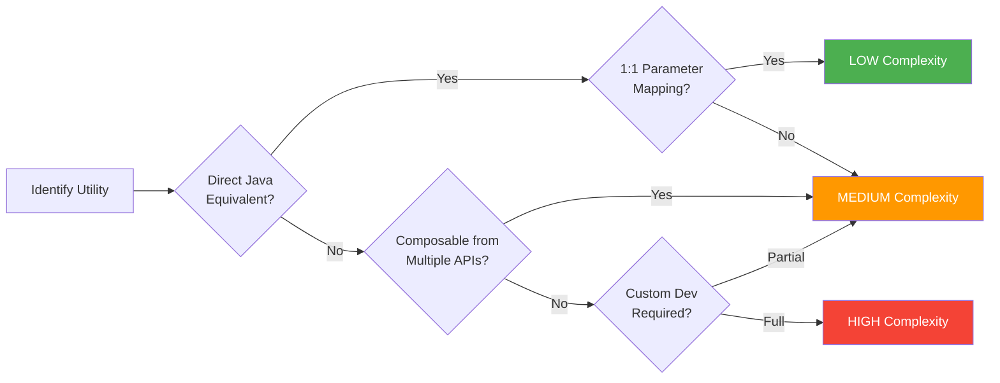
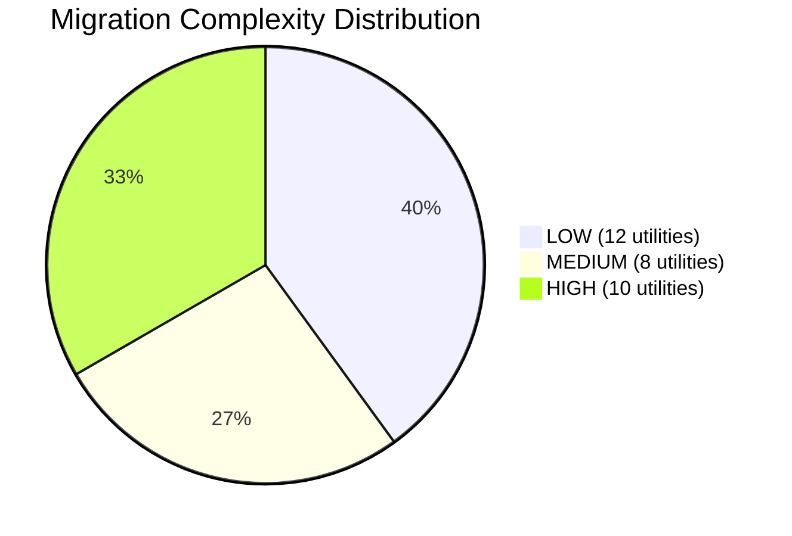
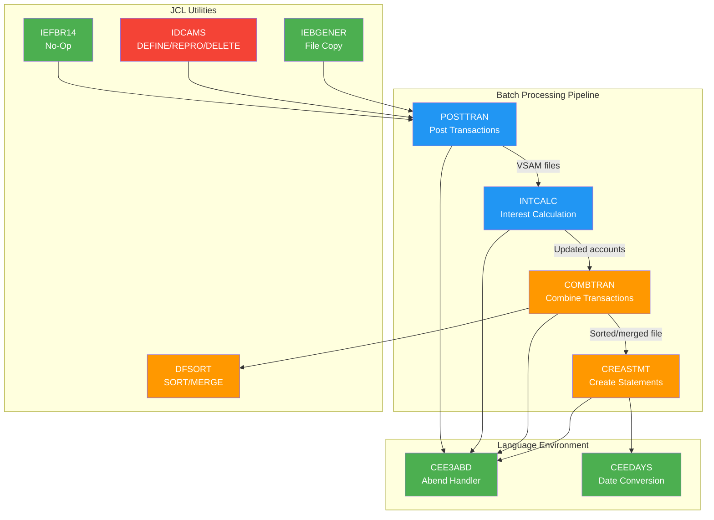
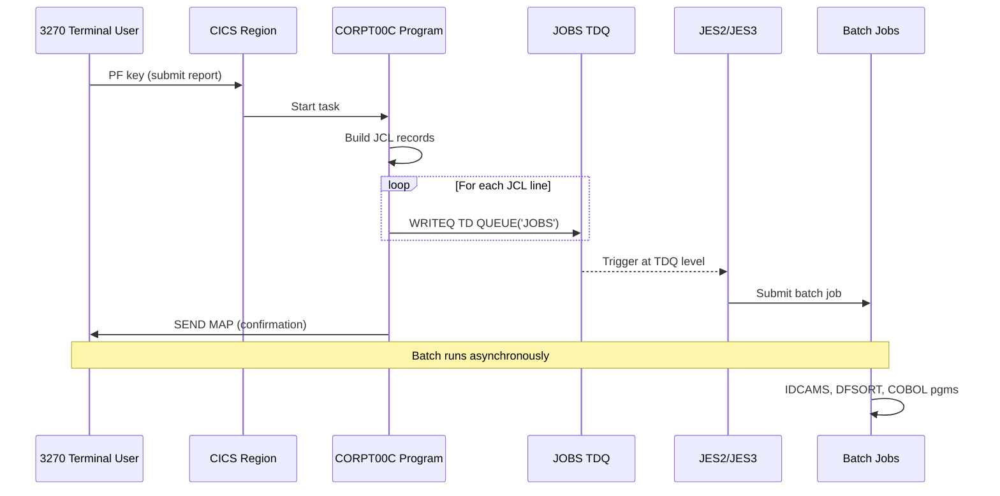

# 3. Dependency Impact Analysis — Cross-Referenced Behavioral Assessment

> **Document Status:** Complete | **Last Updated:** 2024 | **Classification:** Migration Analysis
>
> This document cross-references each proprietary utility's IBM-documented behavior (from [Section 02 — External Documentation Research](./02-external-documentation-research.md)) against its actual usage within the CardDemo codebase. For every utility, we provide exact source file locations (`file:line`), parameter usage patterns, replication complexity ratings for Java, Java equivalence assessments, candidate open-source libraries, and explicit gap identification where behavior cannot be directly replicated.

---

## Table of Contents

- [3.1 Methodology](#31-methodology)
- [3.2 Impact Rating Framework](#32-impact-rating-framework)
- [3.3 Language Environment Services Impact Analysis](#33-language-environment-services-impact-analysis)
  - [3.3.1 CEEDAYS — Date-to-Lilian Conversion](#331-ceedays-date-to-lilian-conversion)
  - [3.3.2 CEE3ABD — Controlled Enclave Termination](#332-cee3abd-controlled-enclave-termination)
- [3.4 CICS Runtime Commands Impact Analysis](#34-cics-runtime-commands-impact-analysis)
  - [3.4.1 File Control — READ](#341-file-control-read)
  - [3.4.2 File Control — WRITE](#342-file-control-write)
  - [3.4.3 File Control — REWRITE](#343-file-control-rewrite)
  - [3.4.4 File Control — DELETE](#344-file-control-delete)
  - [3.4.5 File Control — Browse Operations (STARTBR, READNEXT, READPREV, ENDBR)](#345-file-control-browse-operations-startbr-readnext-readprev-endbr)
  - [3.4.6 Terminal I/O — SEND MAP](#346-terminal-io-send-map)
  - [3.4.7 Terminal I/O — RECEIVE MAP](#347-terminal-io-receive-map)
  - [3.4.8 Program Control — RETURN](#348-program-control-return)
  - [3.4.9 Program Control — XCTL](#349-program-control-xctl)
  - [3.4.10 Error Handling — HANDLE ABEND](#3410-error-handling-handle-abend)
  - [3.4.11 Error Handling — ABEND](#3411-error-handling-abend)
  - [3.4.12 System Services — ASKTIME / FORMATTIME](#3412-system-services-asktime-formattime)
  - [3.4.13 System Services — WRITEQ TD](#3413-system-services-writeq-td)
  - [3.4.14 System Services — ASSIGN](#3414-system-services-assign)
- [3.5 JCL Utility Impact Analysis](#35-jcl-utility-impact-analysis)
  - [3.5.1 IDCAMS — Access Method Services](#351-idcams-access-method-services)
  - [3.5.2 DFSORT — Data Facility Sort](#352-dfsort-data-facility-sort)
  - [3.5.3 IEBGENER — Sequential Dataset Copy](#353-iebgener-sequential-dataset-copy)
  - [3.5.4 IEFBR14 — No-Operation Utility](#354-iefbr14-no-operation-utility)
- [3.6 BMS Macro Impact Analysis](#36-bms-macro-impact-analysis)
- [3.7 VSAM Dataset Impact Analysis](#37-vsam-dataset-impact-analysis)
- [3.8 Complexity Summary Table](#38-complexity-summary-table)
- [3.9 Gap Identification Summary](#39-gap-identification-summary)
- [3.10 Impact Assessment Diagram](#310-impact-assessment-diagram)
- [Navigation](#navigation)

---

## 3.1 Methodology

### Cross-Referencing Approach

For each proprietary utility identified in the [Proprietary Utility Inventory (Section 01)](./01-proprietary-utility-inventory.md), this analysis performs the following structured assessment:

1. **Documented Behavior Extraction** — The IBM-documented behavior from [External Documentation Research (Section 02)](./02-external-documentation-research.md) is summarized, including parameters, return values, side effects, and error conditions.
2. **Actual Usage Analysis** — Every invocation of the utility within the CardDemo codebase is located with exact `file:line` citations, and the actual parameters, context, and error handling patterns are documented.
3. **Behavioral Gap Assessment** — The documented behavior is compared against the actual usage to identify which documented features are exercised and which are dormant.
4. **Replication Complexity Rating** — A complexity rating (HIGH / MEDIUM / LOW) is assigned based on the difficulty of replicating the same behavior in Java.
5. **Java Equivalence Assessment** — Specific Java APIs, libraries, and patterns that can replicate the utility's behavior are identified.
6. **Gap Identification** — Behavioral aspects that cannot be directly replicated in Java are explicitly flagged with proposed mitigation strategies.

### Complexity Rating Criteria

| Rating | Definition | Criteria |
|--------|-----------|----------|
| **LOW** | Straightforward Java equivalent exists | Direct 1:1 API mapping available; standard Java libraries suffice; well-documented migration path exists |
| **MEDIUM** | Java equivalent exists but requires adaptation | Multiple Java APIs needed to replicate behavior; some behavioral nuances require custom code; partial library coverage |
| **HIGH** | No direct Java equivalent; custom development required | Significant custom code needed; behavioral parity difficult to verify; architectural pattern shift required; or insufficient documentation for confident replication |

---

## 3.2 Impact Rating Framework

The following framework is used to assess the overall migration impact of each utility:



**Impact Dimensions:**

| Dimension | Weight | Description |
|-----------|--------|-------------|
| **Behavioral Equivalence** | 40% | Can the Java implementation produce identical outputs for identical inputs? |
| **Error Handling Parity** | 20% | Can all error conditions be detected and handled equivalently? |
| **Performance Characteristics** | 15% | Can throughput and latency remain within acceptable bounds? |
| **Integration Complexity** | 15% | How many other components are affected by the migration of this utility? |
| **Testing Verifiability** | 10% | Can behavioral parity be verified through automated testing? |

---

## 3.3 Language Environment Services Impact Analysis

### 3.3.1 CEEDAYS — Date-to-Lilian Conversion

| Property | Assessment |
|----------|-----------|
| **Replication Complexity** | **LOW** |
| **Java Equivalence Confidence** | 95% — `java.time.LocalDate` with custom epoch arithmetic |
| **Integration Impact** | Low — isolated wrapper function with 2 callers |
| **Testing Verifiability** | High — deterministic date conversion with known test vectors |

#### Documented Behavior (from IBM z/OS LE Reference)

CEEDAYS converts a character date string to a Lilian integer — the number of days since **October 14, 1582** (the start of the Gregorian calendar). It accepts a Vstring date input, a Vstring picture string format, and returns an S9(9) BINARY output along with a feedback code structure indicating success or specific error conditions.

> For detailed IBM documentation references, see [Section 02 — CEEDAYS Research](./02-external-documentation-research.md#221-ceedays--convert-date-to-lilian-format).

#### Actual Usage in CardDemo

**Primary Invocation:**

Source: [`app/cbl/CSUTLDTC.cbl:116`](../../app/cbl/CSUTLDTC.cbl)

```cobol
       CALL "CEEDAYS" USING
              WS-DATE-TO-TEST,
              WS-DATE-FORMAT,
              OUTPUT-LILLIAN,
              FEEDBACK-CODE
```

**Parameters as used in CardDemo:**

| Parameter | COBOL Definition | CardDemo Usage |
|-----------|-----------------|----------------|
| `WS-DATE-TO-TEST` | Vstring (S9(4) BINARY length + X(256) text) | Character date passed via `LINKAGE SECTION` from caller; up to 10 characters — Source: [`app/cbl/CSUTLDTC.cbl:25-31`](../../app/cbl/CSUTLDTC.cbl) |
| `WS-DATE-FORMAT` | Vstring (S9(4) BINARY length + X(256) text) | Picture string passed via `LINKAGE SECTION`; up to 10 characters — Source: [`app/cbl/CSUTLDTC.cbl:33-39`](../../app/cbl/CSUTLDTC.cbl) |
| `OUTPUT-LILLIAN` | `PIC S9(9) USAGE IS BINARY` | Receives Lilian day number; initialized to 0 before call — Source: [`app/cbl/CSUTLDTC.cbl:41`](../../app/cbl/CSUTLDTC.cbl) |
| `FEEDBACK-CODE` | Structured feedback token (8 bytes + I-S-INFO) | Used for detailed error classification via 88-level condition names — Source: [`app/cbl/CSUTLDTC.cbl:60-80`](../../app/cbl/CSUTLDTC.cbl) |

**Caller Programs:**

The `CSUTLDTC` wrapper is called from two online CICS programs:

- **CORPT00C** — Report generation; uses date conversion for report date range validation — Source: [`app/cbl/CORPT00C.cbl`](../../app/cbl/CORPT00C.cbl)
- **COTRN02C** — Transaction detail processing; uses date conversion for transaction date validation — Source: [`app/cbl/COTRN02C.cbl`](../../app/cbl/COTRN02C.cbl)

**Error Handling Pattern:**

The wrapper program evaluates 9 distinct feedback conditions (Source: [`app/cbl/CSUTLDTC.cbl:128-149`](../../app/cbl/CSUTLDTC.cbl)):

| Feedback Condition | 88-Level Name | COBOL Hex Value | WS-RESULT Message |
|-------------------|---------------|-----------------|-------------------|
| Valid date | `FC-INVALID-DATE` | `X'0000000000000000'` | `'Date is valid'` |
| Insufficient data | `FC-INSUFFICIENT-DATA` | `X'000309CB59C3C5C5'` | `'Insufficient'` |
| Bad date value | `FC-BAD-DATE-VALUE` | `X'000309CC59C3C5C5'` | `'Datevalue error'` |
| Invalid era | `FC-INVALID-ERA` | `X'000309CD59C3C5C5'` | `'Invalid Era'` |
| Unsupported range | `FC-UNSUPP-RANGE` | `X'000309D159C3C5C5'` | `'Unsupp. Range'` |
| Invalid month | `FC-INVALID-MONTH` | `X'000309D559C3C5C5'` | `'Invalid month'` |
| Bad picture string | `FC-BAD-PIC-STRING` | `X'000309D659C3C5C5'` | `'Bad Pic String'` |
| Non-numeric data | `FC-NON-NUMERIC-DATA` | `X'000309D859C3C5C5'` | `'Nonnumeric data'` |
| Year-in-era zero | `FC-YEAR-IN-ERA-ZERO` | `X'000309D959C3C5C5'` | `'YearInEra is 0'` |

#### Java Equivalence Assessment

```java
// Lilian epoch: October 14, 1582
private static final LocalDate LILIAN_EPOCH = LocalDate.of(1582, 10, 14);

public long convertToLilian(String dateString, String format) {
    DateTimeFormatter formatter = DateTimeFormatter.ofPattern(
        convertCOBOLFormatToJava(format)
    );
    LocalDate date = LocalDate.parse(dateString.trim(), formatter);
    return ChronoUnit.DAYS.between(LILIAN_EPOCH, date) + 1;
}
```

**Candidate Libraries:**

| Library | Version | Purpose | Suitability |
|---------|---------|---------|-------------|
| `java.time.LocalDate` | JDK 8+ (built-in) | Date parsing and arithmetic | **Primary** — native Lilian day calculation via `ChronoUnit.DAYS.between()` |
| `java.time.format.DateTimeFormatter` | JDK 8+ (built-in) | Format string parsing | **Primary** — handles date format patterns |
| Apache Commons Lang `DateUtils` | 3.14+ | Date manipulation utilities | **Supplementary** — edge case handling |

#### Gap Identification

| Gap | Severity | Description | Mitigation |
|-----|----------|-------------|------------|
| **Vstring format translation** | MEDIUM | COBOL Vstring uses S9(4) BINARY length prefix + variable character array. Java strings are natively variable-length, but the COBOL picture string format (e.g., `YYYYMMDD`, `MM/DD/YYYY`) must be mapped to `DateTimeFormatter` patterns. | Create a `COBOLDateFormatMapper` utility class that translates COBOL picture strings to Java `DateTimeFormatter` patterns. |
| **Feedback code granularity** | LOW | IBM provides 9 distinct error conditions via hex feedback tokens. Java's `DateTimeParseException` provides less granular error information. | Implement pre-validation logic that checks for each COBOL-equivalent error condition before parsing, throwing specific custom exceptions. |
| **Lilian epoch offset** | LOW | The Lilian epoch starts at day 1 (not day 0) for October 15, 1582. An off-by-one error is possible if `ChronoUnit.DAYS.between()` is used without adjustment. | Unit test with known Lilian date values from IBM documentation to verify exact offset. |

---

### 3.3.2 CEE3ABD — Controlled Enclave Termination

| Property | Assessment |
|----------|-----------|
| **Replication Complexity** | **LOW** |
| **Java Equivalence Confidence** | 90% — Custom exception hierarchy with application-specific error codes |
| **Integration Impact** | Medium — used in all 9 batch programs as the universal error exit |
| **Testing Verifiability** | High — deterministic abend behavior with consistent parameters |

#### Documented Behavior (from IBM z/OS LE Reference)

CEE3ABD terminates the current Language Environment enclave with a user-defined abend code. It accepts two parameters: an abend code (fullword integer) and a timing parameter (0 = immediate termination, 1 = deferred termination allowing cleanup routines to execute).

> For detailed IBM documentation references, see [Section 02 — CEE3ABD Research](./02-external-documentation-research.md#222-cee3abd--terminate-enclave-with-abend).

#### Actual Usage in CardDemo

CEE3ABD is invoked in **all 9 batch programs** with a consistent pattern. In 8 of 9 programs, the ABCODE and TIMING variables are explicitly set before the call. In CBSTM03A, the call is made without explicit parameter setup.

**Standard Pattern (8 programs):**

Source: [`app/cbl/CBACT01C.cbl:169-173`](../../app/cbl/CBACT01C.cbl)

```cobol
       9999-ABEND-PROGRAM.
           DISPLAY 'ABENDING PROGRAM'
           MOVE 0 TO TIMING
           MOVE 999 TO ABCODE
           CALL 'CEE3ABD'.
```

**Variant Pattern (CBSTM03A):**

Source: [`app/cbl/CBSTM03A.CBL:921-923`](../../app/cbl/CBSTM03A.CBL)

```cobol
       9999-ABEND-PROGRAM.
           DISPLAY 'ABENDING PROGRAM'
           CALL 'CEE3ABD'.
```

> **Note:** CBSTM03A does not explicitly set ABCODE or TIMING before calling CEE3ABD. The behavior depends on whatever values these working-storage variables contain at the time of the call, which may be uninitialized (defaulting to binary zeros). This is a subtle behavioral difference that must be preserved in migration.

**Complete Invocation Inventory:**

| Program | Line | Abend Code | Timing | Call Points | Trigger Conditions |
|---------|------|-----------|--------|-------------|-------------------|
| CBACT01C | 173 | 999 | 0 (immediate) | 3 (`PERFORM 9999-ABEND-PROGRAM`) | File open/close/read errors — Source: [`app/cbl/CBACT01C.cbl:113,147,165`](../../app/cbl/CBACT01C.cbl) |
| CBACT02C | 158 | 999 | 0 (immediate) | 3 (`PERFORM 9999-ABEND-PROGRAM`) | File open/close/read errors — Source: [`app/cbl/CBACT02C.cbl:113,132,150`](../../app/cbl/CBACT02C.cbl) |
| CBACT03C | 158 | 999 | 0 (immediate) | 3 (`PERFORM 9999-ABEND-PROGRAM`) | File open/close/read errors — Source: [`app/cbl/CBACT03C.cbl:113,132,150`](../../app/cbl/CBACT03C.cbl) |
| CBACT04C | 632 | 999 | 0 (immediate) | 17 (`PERFORM 9999-ABEND-PROGRAM`) | Multiple file I/O and calculation errors — Source: [`app/cbl/CBACT04C.cbl:248-619`](../../app/cbl/CBACT04C.cbl) |
| CBCUS01C | 158 | 999 | 0 (immediate) | 3 (`PERFORM Z-ABEND-PROGRAM`) | File open/close/read errors — Source: [`app/cbl/CBCUS01C.cbl:113,132,150`](../../app/cbl/CBCUS01C.cbl) |
| CBSTM03A | 923 | *Not set* | *Not set* | 13 (`PERFORM 9999-ABEND-PROGRAM`) | File I/O errors across TRNX, XREF, CUST, ACCT files — Source: [`app/cbl/CBSTM03A.CBL:361-916`](../../app/cbl/CBSTM03A.CBL) |
| CBTRN01C | 473 | 999 | 0 (immediate) | 13 (`PERFORM Z-ABEND-PROGRAM`) | Multi-file I/O errors — Source: [`app/cbl/CBTRN01C.cbl:222-465`](../../app/cbl/CBTRN01C.cbl) |
| CBTRN02C | 711 | 999 | 0 (immediate) | 18 (`PERFORM 9999-ABEND-PROGRAM`) | Multi-file I/O and validation errors — Source: [`app/cbl/CBTRN02C.cbl:250-688`](../../app/cbl/CBTRN02C.cbl) |
| CBTRN03C | 630 | 999 | 0 (immediate) | 19 (`PERFORM 9999-ABEND-PROGRAM`) | Multi-file I/O and processing errors — Source: [`app/cbl/CBTRN03C.cbl:241-619`](../../app/cbl/CBTRN03C.cbl) |

**Total Invocation Count:** 9 `CALL 'CEE3ABD'` statements, triggered from 92 `PERFORM` call points.

#### Java Equivalence Assessment

```java
public class ApplicationAbendException extends RuntimeException {
    private final int abendCode;
    private final int timing;

    public ApplicationAbendException(int abendCode, int timing) {
        super("Program abend with code: " + abendCode);
        this.abendCode = abendCode;
        this.timing = timing;
    }

    public int getAbendCode() { return abendCode; }
    public int getTiming() { return timing; }
}

// Usage in migrated batch programs:
private void abendProgram() {
    System.out.println("ABENDING PROGRAM");
    throw new ApplicationAbendException(999, 0);
}
```

**Candidate Libraries:**

| Library | Version | Purpose | Suitability |
|---------|---------|---------|-------------|
| JDK Exception hierarchy | JDK 8+ (built-in) | Custom `RuntimeException` subclass | **Primary** — native exception mechanism |
| Spring Batch `ExitStatus` | 5.x | Batch job exit code management | **Supplementary** — for batch program abend code propagation to job exit status |
| `System.exit(int)` | JDK 8+ (built-in) | Process termination with code | **Alternative** — for batch programs that must terminate the JVM with a specific return code |

#### Gap Identification

| Gap | Severity | Description | Mitigation |
|-----|----------|-------------|------------|
| **TIMING parameter behavior** | LOW | IBM's `TIMING = 0` means immediate termination; `TIMING = 1` allows cleanup. Java exceptions naturally unwind the call stack, providing cleanup via `try-finally` blocks, but the semantic distinction between "immediate" and "deferred" termination does not have a direct analogue. | For `TIMING = 0`: throw exception immediately. For `TIMING = 1`: set a flag and allow current block to complete before throwing. In CardDemo, TIMING is always 0, so only the immediate path is needed. |
| **CBSTM03A uninitialized parameters** | LOW | CBSTM03A calls CEE3ABD without setting ABCODE or TIMING. On the mainframe, binary working-storage fields default to binary zeros. In Java, this equates to an abend code of 0 with immediate timing. | In the Java migration, pass explicit defaults (abendCode=0, timing=0) when parameters are not set, matching mainframe binary zero initialization. |
| **Enclave vs. JVM termination scope** | MEDIUM | CEE3ABD terminates the Language Environment "enclave" (a COBOL run unit), not the entire z/OS address space. In Java, `throw new RuntimeException()` terminates the current thread if unhandled, while `System.exit()` terminates the entire JVM. Batch programs run as separate JVM processes, so `System.exit(abendCode)` is the closest equivalent. | For Spring Batch migration: use `ApplicationAbendException` caught by the batch framework, which translates it to an `ExitStatus.FAILED` with the abend code. For standalone batch: use `System.exit(abendCode)` at the top-level error handler. |

---

## 3.4 CICS Runtime Commands Impact Analysis

The CardDemo application uses **18 distinct EXEC CICS command types** across 19 online programs, with a total of **150 EXEC CICS statements** extracted via static analysis. Each command type is analyzed below with its actual usage pattern, replication complexity, and Java equivalence.

### 3.4.1 File Control — READ

| Property | Assessment |
|----------|-----------|
| **Replication Complexity** | **MEDIUM** |
| **Instances** | 20 `EXEC CICS READ` statements across 12 programs |
| **Java Equivalence** | Spring Data JPA `findById()` / `JdbcTemplate.queryForObject()` |

#### Actual Usage Pattern

All READ commands follow a consistent pattern using DATASET, INTO, LENGTH, RIDFLD, and KEYLENGTH options, with optional UPDATE and RESP/RESP2 error handling.

**Representative Example:**

Source: [`app/cbl/COBIL00C.cbl:345-354`](../../app/cbl/COBIL00C.cbl)

```cobol
           EXEC CICS READ
                DATASET   (WS-ACCTDAT-FILE)
                INTO      (ACCOUNT-RECORD)
                LENGTH    (LENGTH OF ACCOUNT-RECORD)
                RIDFLD    (ACCT-ID)
                KEYLENGTH (LENGTH OF ACCT-ID)
                UPDATE
                RESP      (WS-RESP-CD)
                RESP2     (WS-REAS-CD)
           END-EXEC
```

**Per-Program Inventory:**

| Program | Line(s) | Dataset(s) Read | UPDATE Used | Key Field |
|---------|---------|----------------|-------------|-----------|
| COACTUPC | 3654, 3703, 3753, 3894, 3921 | ACCTDAT, CARDDAT, CARDXREF, CUSTDAT | Mixed | ACCT-ID, CARD-NUM, XREF-CARD-NUM, CUST-ID |
| COACTVWC | 727, 776, 826 | ACCTDAT, CARDDAT, CUSTDAT | No | ACCT-ID, CARD-NUM, CUST-ID |
| COBIL00C | 345, 410 | ACCTDAT, CXACAIX | Yes (345), No (410) | ACCT-ID, XREF-ACCT-ID |
| COCRDSLC | 742, 783 | CARDDAT, ACCTDAT | No | CARD-NUM, ACCT-ID |
| COCRDUPC | 1382, 1427 | CARDDAT, ACCTDAT | Mixed | CARD-NUM, ACCT-ID |
| COSGN00C | 211 | USRSEC | No | SEC-USR-ID |
| COTRN01C | 269 | TRANSACT | Yes | TRAN-ID |
| COTRN02C | 578, 611 | ACCTDAT, CARDXREF | No | ACCT-ID, XREF-CARD-NUM |
| COUSR02C | 322 | USRSEC | Yes | SEC-USR-ID |
| COUSR03C | 269 | USRSEC | Yes | SEC-USR-ID |

**Response Code Handling:**

All READ operations evaluate `WS-RESP-CD` using `DFHRESP` conditions:

| DFHRESP Condition | Meaning | Frequency |
|------------------|---------|-----------|
| `DFHRESP(NORMAL)` | Successful read | All 20 instances |
| `DFHRESP(NOTFND)` | Record not found by key | 18 instances |
| `OTHER` | Unexpected error | All 20 instances |

#### Java Equivalence Assessment

```java
// Spring Data JPA equivalent for EXEC CICS READ
@Repository
public interface AccountRepository extends JpaRepository<Account, String> {
    Optional<Account> findByAccountId(String accountId);
}

// With pessimistic lock for READ ... UPDATE equivalent
@Lock(LockModeType.PESSIMISTIC_WRITE)
@Query("SELECT a FROM Account a WHERE a.accountId = :id")
Optional<Account> findByAccountIdForUpdate(@Param("id") String accountId);
```

**Candidate Libraries:**

| Library | Version | Purpose |
|---------|---------|---------|
| Spring Data JPA | 3.2+ | `JpaRepository.findById()` for primary key lookup |
| Jakarta Persistence (JPA) | 3.1+ | `@Lock(PESSIMISTIC_WRITE)` for READ ... UPDATE |
| Spring JDBC `JdbcTemplate` | 6.1+ | `queryForObject()` for direct SQL access |

#### Gap Identification

| Gap | Severity | Description | Mitigation |
|-----|----------|-------------|------------|
| **READ ... UPDATE locking semantics** | MEDIUM | CICS READ with UPDATE holds an exclusive lock on the VSAM record until REWRITE or UNLOCK. JPA `PESSIMISTIC_WRITE` acquires a database-level row lock, but lock duration is tied to transaction boundaries, not individual API calls. | Use `@Transactional` with explicit scope matching the CICS pseudo-conversational task boundary. Ensure the transaction is committed after REWRITE. |
| **DATASET indirection** | LOW | CICS uses a logical dataset name (e.g., `WS-ACCTDAT-FILE`) resolved via FCT (File Control Table). In JPA, the table mapping is defined at compile time via `@Table`. | Use Spring profiles or configuration properties to map logical dataset names to physical table names. |
| **RESP/RESP2 error granularity** | LOW | CICS provides separate RESP and RESP2 codes. JPA throws specific exceptions (e.g., `EmptyResultDataAccessException`). | Map CICS RESP codes to specific Java exceptions using a `CICSResponseMapper` utility. |

---

### 3.4.2 File Control — WRITE

| Property | Assessment |
|----------|-----------|
| **Replication Complexity** | **LOW** |
| **Instances** | 3 `EXEC CICS WRITE` statements across 3 programs |
| **Java Equivalence** | Spring Data JPA `save()` / `JdbcTemplate.update()` |

#### Actual Usage Pattern

Source: [`app/cbl/COBIL00C.cbl:512-520`](../../app/cbl/COBIL00C.cbl)

```cobol
           EXEC CICS WRITE
                DATASET   (WS-TRANSACT-FILE)
                FROM      (TRAN-RECORD)
                LENGTH    (LENGTH OF TRAN-RECORD)
                RIDFLD    (TRAN-ID)
                KEYLENGTH (LENGTH OF TRAN-ID)
                RESP      (WS-RESP-CD)
                RESP2     (WS-REAS-CD)
           END-EXEC
```

**Per-Program Inventory:**

| Program | Line | Dataset | Record Type | Key Field |
|---------|------|---------|-------------|-----------|
| COBIL00C | 512 | TRANSACT | TRAN-RECORD | TRAN-ID |
| COTRN02C | 713 | TRANSACT | TRAN-RECORD | TRAN-ID |
| COUSR01C | 240 | USRSEC | SEC-USER-DATA | SEC-USR-ID |

#### Java Equivalence

```java
// JPA equivalent for EXEC CICS WRITE
transactionRepository.save(transactionEntity);
// or with JdbcTemplate
jdbcTemplate.update("INSERT INTO transact (...) VALUES (...)", params);
```

**Candidate Libraries:** Spring Data JPA 3.2+ (`save()`), Spring JDBC 6.1+ (`JdbcTemplate.update()`).

#### Gap Identification

| Gap | Severity | Description | Mitigation |
|-----|----------|-------------|------------|
| **RIDFLD as key assertion** | LOW | CICS WRITE uses RIDFLD to specify the key for the new record. JPA uses the `@Id` annotated field. | Ensure the entity's `@Id` field is set before calling `save()`. |
| **Duplicate key handling** | LOW | CICS returns `DFHRESP(DUPREC)` for duplicate keys. JPA throws `DataIntegrityViolationException`. | Catch `DataIntegrityViolationException` and map to application-specific error. |

---

### 3.4.3 File Control — REWRITE

| Property | Assessment |
|----------|-----------|
| **Replication Complexity** | **LOW** |
| **Instances** | 2 `EXEC CICS REWRITE` statements across 2 programs |
| **Java Equivalence** | Spring Data JPA `save()` (on managed entity) |

#### Actual Usage Pattern

Source: [`app/cbl/COBIL00C.cbl:379-385`](../../app/cbl/COBIL00C.cbl)

```cobol
           EXEC CICS REWRITE
                DATASET   (WS-ACCTDAT-FILE)
                FROM      (ACCOUNT-RECORD)
                LENGTH    (LENGTH OF ACCOUNT-RECORD)
                RESP      (WS-RESP-CD)
                RESP2     (WS-REAS-CD)
           END-EXEC
```

**Per-Program Inventory:**

| Program | Line | Dataset | Record Type | Prerequisite |
|---------|------|---------|-------------|-------------|
| COBIL00C | 379 | ACCTDAT | ACCOUNT-RECORD | READ ... UPDATE at line 345 |
| COUSR02C | 360 | USRSEC | SEC-USER-DATA | READ ... UPDATE at line 322 |

> **Note:** CICS REWRITE requires a preceding READ ... UPDATE on the same file. This establishes a record-level lock that is released upon REWRITE. In JPA, this corresponds to modifying a managed entity within a `@Transactional` boundary with `PESSIMISTIC_WRITE` lock.

**Candidate Libraries:** Spring Data JPA 3.2+ (`save()` on detached entity triggers UPDATE), Jakarta Persistence 3.1+.

#### Gap Identification

| Gap | Severity | Description | Mitigation |
|-----|----------|-------------|------------|
| **Implicit lock coupling** | MEDIUM | REWRITE is semantically coupled to a prior READ UPDATE. JPA's dirty checking auto-generates UPDATE on transaction commit if the entity is managed. | Ensure READ and REWRITE occur within the same `@Transactional` scope. |

---

### 3.4.4 File Control — DELETE

| Property | Assessment |
|----------|-----------|
| **Replication Complexity** | **LOW** |
| **Instances** | 1 `EXEC CICS DELETE` statement in 1 program |
| **Java Equivalence** | Spring Data JPA `deleteById()` |

#### Actual Usage Pattern

Source: [`app/cbl/COUSR03C.cbl:307-311`](../../app/cbl/COUSR03C.cbl)

```cobol
           EXEC CICS DELETE
                DATASET   (WS-USRSEC-FILE)
                RESP      (WS-RESP-CD)
                RESP2     (WS-REAS-CD)
           END-EXEC
```

> **Note:** This DELETE does not specify RIDFLD, meaning it deletes the record established by a prior READ ... UPDATE on the same file. The record identity is implicitly held by CICS from the previous read.

**Candidate Libraries:** Spring Data JPA 3.2+ (`deleteById()`), Spring JDBC 6.1+ (`JdbcTemplate.update("DELETE ...")`).

#### Gap Identification

| Gap | Severity | Description | Mitigation |
|-----|----------|-------------|------------|
| **Implicit record identity** | LOW | CICS DELETE without RIDFLD relies on the implicit record context from a prior READ UPDATE. JPA requires explicit entity reference. | Pass the entity ID explicitly to `deleteById()` from the preceding read operation. |

---

### 3.4.5 File Control — Browse Operations (STARTBR, READNEXT, READPREV, ENDBR)

| Property | Assessment |
|----------|-----------|
| **Replication Complexity** | **HIGH** |
| **Instances** | 6 STARTBR, 4 READNEXT, 6 READPREV, 5 ENDBR = **21 statements** across 5 programs |
| **Java Equivalence** | Spring Data JPA with cursor-based pagination / `JdbcTemplate` with scrollable `ResultSet` |

#### Actual Usage Pattern

Browse operations follow a consistent lifecycle: **STARTBR** → **READNEXT** or **READPREV** (repeated) → **ENDBR**.

**STARTBR (Browse Initiation):**

Source: [`app/cbl/COBIL00C.cbl:443-449`](../../app/cbl/COBIL00C.cbl)

```cobol
           EXEC CICS STARTBR
                DATASET   (WS-TRANSACT-FILE)
                RIDFLD    (TRAN-ID)
                KEYLENGTH (LENGTH OF TRAN-ID)
                RESP      (WS-RESP-CD)
                RESP2     (WS-REAS-CD)
           END-EXEC
```

**READNEXT (Forward Browse):**

Source: [`app/cbl/COTRN00C.cbl:626`](../../app/cbl/COTRN00C.cbl)

```cobol
           EXEC CICS READNEXT
                DATASET   (WS-TRANSACT-FILE)
                INTO      (TRAN-RECORD)
                LENGTH    (LENGTH OF TRAN-RECORD)
                RIDFLD    (TRAN-ID)
                KEYLENGTH (LENGTH OF TRAN-ID)
                RESP      (WS-RESP-CD)
                RESP2     (WS-REAS-CD)
           END-EXEC
```

**READPREV (Backward Browse):**

Source: [`app/cbl/COBIL00C.cbl:474-482`](../../app/cbl/COBIL00C.cbl)

```cobol
           EXEC CICS READPREV
                DATASET   (WS-TRANSACT-FILE)
                INTO      (TRAN-RECORD)
                LENGTH    (LENGTH OF TRAN-RECORD)
                RIDFLD    (TRAN-ID)
                KEYLENGTH (LENGTH OF TRAN-ID)
                RESP      (WS-RESP-CD)
                RESP2     (WS-REAS-CD)
           END-EXEC
```

**ENDBR (Browse Termination):**

Source: [`app/cbl/COBIL00C.cbl:503-505`](../../app/cbl/COBIL00C.cbl)

```cobol
           EXEC CICS ENDBR
                DATASET   (WS-TRANSACT-FILE)
           END-EXEC.
```

**Per-Program Browse Inventory:**

| Program | STARTBR (line) | READNEXT (lines) | READPREV (lines) | ENDBR (line) | Dataset |
|---------|---------------|-------------------|-------------------|-------------|---------|
| COBIL00C | 443 | — | 474 | 503 | TRANSACT |
| COCRDLIC | 1129, 1273 | 1146, 1197 | 1294, 1322 | 1258 | CARDDAT |
| COTRN00C | 593 | 626 | 660 | 694 | TRANSACT |
| COTRN02C | 644 | — | 675 | 704 | TRANSACT |
| COUSR00C | 588 | 621 | 655 | 689 | USRSEC |

#### Java Equivalence Assessment

```java
// Spring Data JPA cursor-based pagination for browse operations
@Repository
public interface TransactionRepository extends JpaRepository<Transaction, String> {

    // STARTBR + READNEXT equivalent (forward browse from key)
    @Query("SELECT t FROM Transaction t WHERE t.transactionId >= :startKey ORDER BY t.transactionId ASC")
    List<Transaction> findFromKeyForward(@Param("startKey") String startKey, Pageable pageable);

    // STARTBR + READPREV equivalent (backward browse from key)
    @Query("SELECT t FROM Transaction t WHERE t.transactionId <= :startKey ORDER BY t.transactionId DESC")
    List<Transaction> findFromKeyBackward(@Param("startKey") String startKey, Pageable pageable);
}
```

**Candidate Libraries:**

| Library | Version | Purpose |
|---------|---------|---------|
| Spring Data JPA | 3.2+ | Keyset pagination with `Pageable` |
| Spring JDBC | 6.1+ | Scrollable `ResultSet` for cursor-based browsing |
| jOOQ | 3.19+ | SEEK pagination (keyset-based) for high-performance browse |

#### Gap Identification

| Gap | Severity | Description | Mitigation |
|-----|----------|-------------|------------|
| **Stateful cursor across pseudo-conversational interactions** | HIGH | CICS browse maintains a server-side cursor position between STARTBR and ENDBR. In a pseudo-conversational CICS program, the browse position is held within a single CICS task. In stateless HTTP, the cursor position must be externalized. | Use keyset pagination: pass the last-seen key value as a request parameter. Each page request executes a new query starting from the last key. |
| **Bidirectional browsing** | MEDIUM | CICS supports seamless switching between READNEXT and READPREV on the same browse session. JPA requires separate queries for forward and backward pagination. | Implement a `BrowseSession` service class that tracks direction and last-key, issuing appropriate `ORDER BY ASC/DESC` queries. |
| **ENDFILE detection** | LOW | CICS returns `DFHRESP(ENDFILE)` when browsing past the last record. JPA returns an empty result set. | Check if the result set is empty or has fewer records than the page size to detect end-of-file. |

---

### 3.4.6 Terminal I/O — SEND MAP

| Property | Assessment |
|----------|-----------|
| **Replication Complexity** | **HIGH** |
| **Instances** | 31 `EXEC CICS SEND` statements across 17 programs |
| **Java Equivalence** | Spring MVC `@Controller` with Thymeleaf / React REST API responses |

#### Actual Usage Pattern

SEND MAP operations output a BMS-mapped screen to the 3270 terminal. The command includes the map name, mapset name, data source, and display options (ERASE, CURSOR).

**Representative Example:**

Source: [`app/cbl/COBIL00C.cbl:295-301`](../../app/cbl/COBIL00C.cbl)

```cobol
           EXEC CICS SEND
                     MAP('COBIL0A')
                     MAPSET('COBIL00')
                     FROM(COBIL0AO)
                     ERASE
                     CURSOR
           END-EXEC.
```

**Send Types Observed:**

| Send Type | Count | Description | Example Source |
|-----------|-------|-------------|---------------|
| `SEND MAP ... ERASE CURSOR` | 14 | Full screen repaint with cursor positioning | [`app/cbl/COBIL00C.cbl:295`](../../app/cbl/COBIL00C.cbl) |
| `SEND MAP ... CURSOR` (no ERASE) | 8 | Partial screen update preserving existing data | [`app/cbl/CORPT00C.cbl:571`](../../app/cbl/CORPT00C.cbl) |
| `SEND TEXT` | 7 | Raw text output (error messages, debugging) | [`app/cbl/COACTVWC.cbl:878`](../../app/cbl/COACTVWC.cbl) |
| `SEND MAP ... FROM ... ERASE` | 2 | Full screen repaint with explicit data source | [`app/cbl/COACTUPC.cbl:3594`](../../app/cbl/COACTUPC.cbl) |

**Candidate Libraries:**

| Library | Version | Purpose |
|---------|---------|---------|
| Spring MVC | 6.1+ | Controller layer for HTTP request/response mapping |
| Thymeleaf | 3.1+ | Server-side HTML template rendering (closest to BMS map concept) |
| React | 18+ | Client-side SPA rendering (alternative architectural approach) |
| Spring HATEOAS | 2.2+ | REST API with hypermedia links for navigation |

#### Gap Identification

| Gap | Severity | Description | Mitigation |
|-----|----------|-------------|------------|
| **3270 field-level attributes** | HIGH | BMS maps define per-field attributes (color, brightness, protection, MDT flags) via `DFHBMSCA`. HTML/CSS provides similar visual controls but through a fundamentally different mechanism. | Create a CSS theme that maps BMS attribute bytes (DFHBMBRY, DFHBMASK, etc.) to equivalent CSS classes. See [Appendix D — BMS Screen Inventory](./appendices/D-bms-screen-inventory.md). |
| **ERASE vs. partial update** | MEDIUM | CICS SEND with ERASE clears the entire 3270 screen before painting. Without ERASE, only modified fields are updated. In web applications, the entire DOM is re-rendered on each response. | For SPA (React): use component-level state to control which fields update. For server-rendered: always send the full page. |
| **Cursor positioning** | LOW | CICS CURSOR option positions the 3270 cursor on a specific field. HTML uses `autofocus` attribute or JavaScript `focus()`. | Use `autofocus` on the target input field or call `element.focus()` on page load. |

---

### 3.4.7 Terminal I/O — RECEIVE MAP

| Property | Assessment |
|----------|-----------|
| **Replication Complexity** | **HIGH** |
| **Instances** | 17 `EXEC CICS RECEIVE` statements across 17 programs |
| **Java Equivalence** | Spring MVC `@RequestParam` / `@ModelAttribute` form binding |

#### Actual Usage Pattern

Source: [`app/cbl/COBIL00C.cbl:308-314`](../../app/cbl/COBIL00C.cbl)

```cobol
           EXEC CICS RECEIVE
                     MAP('COBIL0A')
                     MAPSET('COBIL00')
                     INTO(COBIL0AI)
                     RESP(WS-RESP-CD)
                     RESP2(WS-REAS-CD)
           END-EXEC.
```

> All RECEIVE MAP operations use the pattern: MAP(name) MAPSET(set) INTO(input-structure) RESP() RESP2(). The input structure is the BMS-generated copybook with suffix `I` (input), containing field values and their Modified Data Tag (MDT) flags.

**Candidate Libraries:** Spring MVC 6.1+ (`@ModelAttribute`), Jakarta Bean Validation 3.0+ (`@Valid`), Spring WebFlux 6.1+ (reactive form handling).

#### Gap Identification

| Gap | Severity | Description | Mitigation |
|-----|----------|-------------|------------|
| **MDT (Modified Data Tag) tracking** | HIGH | BMS tracks which fields the user modified via MDT flags. HTML forms submit all field values regardless of modification. | Implement client-side JavaScript that tracks `input` change events and adds a `data-modified="true"` attribute, submitting only modified fields. |
| **AID key detection** | HIGH | CICS captures which AID key (PF1-PF24, ENTER, CLEAR, PA1-PA3) the user pressed via `DFHAID`. HTML forms have no equivalent for function keys. | Map PF keys to HTML buttons or keyboard shortcuts. Use `EIBAID` equivalent via hidden form field or custom header. See [Appendix D — BMS Screen Inventory](./appendices/D-bms-screen-inventory.md). |

---

### 3.4.8 Program Control — RETURN

| Property | Assessment |
|----------|-----------|
| **Replication Complexity** | **HIGH** |
| **Instances** | 26 `EXEC CICS RETURN` statements across 17 programs |
| **Java Equivalence** | Spring MVC controller return + session/token state management |

#### Actual Usage Pattern

Source: [`app/cbl/CORPT00C.cbl:587-591`](../../app/cbl/CORPT00C.cbl)

```cobol
           EXEC CICS RETURN
                     TRANSID (WS-TRANID)
                     COMMAREA (CARDDEMO-COMMAREA)
           END-EXEC.
```

**Return Variants Observed:**

| Variant | Count | Description | Example |
|---------|-------|-------------|---------|
| `RETURN TRANSID COMMAREA` | 17 | Pseudo-conversational return — saves state for next transaction | [`app/cbl/CORPT00C.cbl:587`](../../app/cbl/CORPT00C.cbl) |
| `RETURN` (bare) | 9 | Final exit — no follow-up transaction expected | [`app/cbl/COACTVWC.cbl:885`](../../app/cbl/COACTVWC.cbl) |

> **Pseudo-Conversational Pattern:** RETURN with TRANSID suspends the CICS task, freeing mainframe resources. When the user presses a key, CICS starts a new task for the specified TRANSID, passing the COMMAREA as preserved state. This is the most architecturally significant pattern in the CardDemo migration.

#### Gap Identification

| Gap | Severity | Description | Mitigation |
|-----|----------|-------------|------------|
| **Pseudo-conversational to stateless HTTP** | HIGH | The CICS pseudo-conversational pattern maintains state between user interactions via COMMAREA, with CICS managing the lifecycle. In HTTP, each request is stateless. | Use HTTP session (server-side) or JWT tokens (client-side) to carry COMMAREA-equivalent state. For a Spring MVC migration, use `@SessionAttributes` or Spring Session with Redis for distributed state. |
| **TRANSID-based routing** | MEDIUM | CICS RETURN TRANSID specifies which program handles the next user input. In Spring MVC, routing is URL-based. | Map each CICS TRANSID to a Spring MVC controller endpoint (e.g., `CTRN` → `/api/transactions`). |

---

### 3.4.9 Program Control — XCTL

| Property | Assessment |
|----------|-----------|
| **Replication Complexity** | **MEDIUM** |
| **Instances** | 9 `EXEC CICS XCTL` statements across 7 programs |
| **Java Equivalence** | Spring service layer method calls / Spring MVC redirect |

#### Actual Usage Pattern

Source: [`app/cbl/CORPT00C.cbl:548-551`](../../app/cbl/CORPT00C.cbl)

```cobol
           EXEC CICS
               XCTL PROGRAM(CDEMO-TO-PROGRAM)
               COMMAREA(CARDDEMO-COMMAREA)
           END-EXEC.
```

**Per-Program Inventory:**

| Source Program | Line | Target Program | COMMAREA Passed |
|---------------|------|---------------|-----------------|
| COACTUPC | 956 | `CDEMO-TO-PROGRAM` (dynamic) | `CARDDEMO-COMMAREA` |
| COACTVWC | 349 | `CDEMO-TO-PROGRAM` (dynamic) | `CARDDEMO-COMMAREA` |
| COCRDLIC | 402, 538, 566 | `CDEMO-TO-PROGRAM` (dynamic) | `CARDDEMO-COMMAREA` |
| COCRDSLC | 331 | `CDEMO-TO-PROGRAM` (dynamic) | `CARDDEMO-COMMAREA` |
| COCRDUPC | 473 | `CDEMO-TO-PROGRAM` (dynamic) | `CARDDEMO-COMMAREA` |
| COSGN00C | 231, 236 | `CDEMO-TO-PROGRAM` (dynamic) | `CARDDEMO-COMMAREA` |

> **Key Observation:** All XCTL calls use a dynamic target program name stored in `CDEMO-TO-PROGRAM` from the COMMAREA. This enables a navigation framework where the "return-to" program is determined at runtime.

**Candidate Libraries:** Spring MVC 6.1+ (forward/redirect), Spring Service Layer (dependency injection).

#### Gap Identification

| Gap | Severity | Description | Mitigation |
|-----|----------|-------------|------------|
| **Dynamic program dispatch** | MEDIUM | XCTL transfers control to a dynamically named program. In Java, this requires a service locator or strategy pattern. | Implement a `ProgramRouter` service that maps program names to Spring service beans using a `Map<String, ProgramService>` registry. |
| **XCTL vs. LINK semantics** | LOW | XCTL replaces the current program (no return). Java method calls always return. | For XCTL: use HTTP redirect (302) or forward to the target controller. The source controller does not continue after the redirect. |

---

### 3.4.10 Error Handling — HANDLE ABEND

| Property | Assessment |
|----------|-----------|
| **Replication Complexity** | **MEDIUM** |
| **Instances** | 8 `EXEC CICS HANDLE ABEND` statements across 4 programs |
| **Java Equivalence** | `try-catch` blocks with `@ControllerAdvice` / `@ExceptionHandler` |

#### Actual Usage Pattern

HANDLE ABEND establishes an abend exit routine. In CardDemo, it is used in two ways:

1. **HANDLE ABEND LABEL(paragraph)** — Routes to a specific error handling paragraph
2. **HANDLE ABEND CANCEL** — Removes a previously set abend handler

**Programs Using HANDLE ABEND:**

| Program | Lines | Pattern |
|---------|-------|---------|
| COACTUPC | 862, 4218 | Initial setup + re-setup before ABEND |
| COACTVWC | 264, 930 | Initial setup + re-setup before ABEND |
| COCRDSLC | 250, 871 | Initial setup + re-setup before ABEND |
| COCRDUPC | 370, 1546 | Initial setup + re-setup before ABEND |

**Candidate Libraries:** JDK exception handling (built-in), Spring `@ControllerAdvice` 6.1+.

#### Gap Identification

| Gap | Severity | Description | Mitigation |
|-----|----------|-------------|------------|
| **Dynamic handler registration** | LOW | CICS HANDLE ABEND can be set and cancelled dynamically at runtime. Java's `try-catch` is lexically scoped. | Use `@ControllerAdvice` for global error handling and method-level `try-catch` for specific handlers. |

---

### 3.4.11 Error Handling — ABEND

| Property | Assessment |
|----------|-----------|
| **Replication Complexity** | **LOW** |
| **Instances** | 4 `EXEC CICS ABEND` statements across 4 programs |
| **Java Equivalence** | `throw new CICSAbendException(abcode)` |

#### Actual Usage Pattern

Source: [`app/cbl/COACTUPC.cbl:4222`](../../app/cbl/COACTUPC.cbl)

```cobol
           EXEC CICS ABEND
                ABCODE('9999')
           END-EXEC
```

**Per-Program Inventory:**

| Program | Line | ABCODE |
|---------|------|--------|
| COACTUPC | 4222 | '9999' |
| COACTVWC | 934 | '9999' |
| COCRDSLC | 875 | '9999' |
| COCRDUPC | 1550 | '9999' |

> All ABEND commands use the same abend code `'9999'` and are preceded by a HANDLE ABEND setup and a SEND TEXT error message.

**Candidate Libraries:** JDK exception hierarchy (built-in), Spring `@ResponseStatus(HttpStatus.INTERNAL_SERVER_ERROR)` 6.1+.

---

### 3.4.12 System Services — ASKTIME / FORMATTIME

| Property | Assessment |
|----------|-----------|
| **Replication Complexity** | **LOW** |
| **Instances** | 1 ASKTIME + 1 FORMATTIME in COBIL00C |
| **Java Equivalence** | `java.time.LocalDateTime.now()` with `DateTimeFormatter` |

#### Actual Usage Pattern

Source: [`app/cbl/COBIL00C.cbl:251-261`](../../app/cbl/COBIL00C.cbl)

```cobol
           EXEC CICS ASKTIME
             ABSTIME(WS-ABS-TIME)
           END-EXEC

           EXEC CICS FORMATTIME
             ABSTIME(WS-ABS-TIME)
             YYYYMMDD(WS-CUR-DATE-X10)
             DATESEP('-')
             TIME(WS-CUR-TIME-X08)
             TIMESEP(':')
           END-EXEC
```

> ASKTIME retrieves the current absolute time (milliseconds since January 1, 1900) into `WS-ABS-TIME`. FORMATTIME formats this absolute time into separate date (`YYYY-MM-DD`) and time (`HH:MM:SS`) strings.

#### Java Equivalence

```java
LocalDateTime now = LocalDateTime.now();
String date = now.format(DateTimeFormatter.ofPattern("yyyy-MM-dd"));
String time = now.format(DateTimeFormatter.ofPattern("HH:mm:ss"));
```

**Candidate Libraries:** `java.time.LocalDateTime` (JDK 8+ built-in).

#### Gap Identification

| Gap | Severity | Description | Mitigation |
|-----|----------|-------------|------------|
| **ABSTIME epoch difference** | LOW | CICS ABSTIME counts from January 1, 1900 (packed decimal). Java epoch is January 1, 1970. CardDemo only uses formatted output, not raw ABSTIME arithmetic. | Since CardDemo formats the time immediately after retrieval, no epoch conversion is needed. |
| **Timezone handling** | LOW | CICS ASKTIME returns local time of the CICS region. Java `LocalDateTime.now()` returns system-local time. | Configure the JVM timezone to match the expected production timezone, or use `ZonedDateTime` explicitly. |

---

### 3.4.13 System Services — WRITEQ TD

| Property | Assessment |
|----------|-----------|
| **Replication Complexity** | **HIGH** |
| **Instances** | 1 `EXEC CICS WRITEQ TD` statement in CORPT00C |
| **Java Equivalence** | Amazon SQS / Spring Integration message channel / AWS Step Functions |

#### Actual Usage Pattern

Source: [`app/cbl/CORPT00C.cbl:517-523`](../../app/cbl/CORPT00C.cbl)

```cobol
           EXEC CICS WRITEQ TD
             QUEUE ('JOBS')
             FROM (JCL-RECORD)
             LENGTH (LENGTH OF JCL-RECORD)
             RESP(WS-RESP-CD)
             RESP2(WS-REAS-CD)
           END-EXEC.
```

> **Critical Context:** This is the **online-to-batch coupling point** in CardDemo. The CORPT00C program (Report Selection screen) writes JCL records to the `JOBS` Transient Data Queue (TDQ). When the TDQ reaches its trigger level, CICS submits the JCL to JES for batch execution. This is the mechanism by which online users initiate batch report generation.

**Architectural Significance:** This single WRITEQ TD statement represents the highest-complexity migration point in CardDemo because it bridges the CICS online world with the JES/JCL batch world — two fundamentally different execution environments.

#### Java Equivalence Assessment

```java
// AWS SQS equivalent for WRITEQ TD
@Service
public class BatchJobSubmissionService {

    private final SqsTemplate sqsTemplate;

    public void submitReportJob(ReportJobRequest request) {
        sqsTemplate.send("batch-job-queue", request);
        // SQS consumer triggers Step Functions or Spring Batch job
    }
}
```

**Candidate Libraries:**

| Library | Version | Purpose |
|---------|---------|---------|
| AWS SDK for Java (SQS) | 2.25+ | Message queue equivalent to CICS TDQ |
| Spring Integration | 6.2+ | Message-driven architecture for async job submission |
| AWS Step Functions SDK | 2.25+ | Orchestrate batch processing workflows |
| Spring Batch | 5.1+ | Batch job execution framework |

#### Gap Identification

| Gap | Severity | Description | Mitigation |
|-----|----------|-------------|------------|
| **TDQ trigger-level semantics** | HIGH | CICS TDQ has a configurable trigger level that automatically submits accumulated records as a batch job when reached. SQS does not have a native "trigger at N messages" mechanism. | Use SQS with a Lambda trigger that checks message count, or use AWS Step Functions with a scheduled check. Alternatively, submit the batch job immediately upon receiving the request (changing from trigger-level to event-driven). |
| **JCL record format** | HIGH | The WRITEQ TD writes formatted JCL records that JES interprets as batch job control language. In Java/AWS, batch jobs are submitted programmatically, not via JCL text. | Replace JCL record generation with a structured `BatchJobRequest` object that contains the equivalent parameters (report type, date range, output format), submitted to Spring Batch or Step Functions. |
| **Synchronous vs. asynchronous feedback** | MEDIUM | On the mainframe, the user receives immediate CICS confirmation that the TDQ write succeeded, but the batch job runs asynchronously. This pattern maps well to SQS/Step Functions async model. | Return immediate success from the SQS send operation, then provide a job-status polling endpoint for progress tracking. |

---

### 3.4.14 System Services — ASSIGN

| Property | Assessment |
|----------|-----------|
| **Replication Complexity** | **LOW** |
| **Instances** | 2 `EXEC CICS ASSIGN` statements in COSGN00C |
| **Java Equivalence** | `ServletContext` attributes / Spring `Environment` properties |

#### Actual Usage Pattern

Source: [`app/cbl/COSGN00C.cbl:198-205`](../../app/cbl/COSGN00C.cbl)

```cobol
           EXEC CICS ASSIGN
               APPLID(APPLIDO OF COSGN0AO)
           END-EXEC

           EXEC CICS ASSIGN
               SYSID(SYSIDO OF COSGN0AO)
           END-EXEC.
```

> ASSIGN retrieves CICS system information. Here, it obtains the CICS application ID (APPLID) and system ID (SYSID) for display on the sign-on screen. These are static configuration values in the CICS environment.

**Java Equivalence:**

```java
// Spring configuration equivalent
@Value("${app.id:CARDDEMO}")
private String applicationId;

@Value("${system.id:AWSM2}")
private String systemId;
```

**Candidate Libraries:** Spring Core 6.1+ (`@Value`, `Environment`), Jakarta Servlet 6.0+ (`ServletContext`).

#### Gap Identification

| Gap | Severity | Description | Mitigation |
|-----|----------|-------------|------------|
| **None significant** | — | ASSIGN is used only to retrieve static configuration values that are easily replicated with Spring configuration properties. | Define `application.id` and `system.id` in `application.properties` or environment variables. |

---

## 3.5 JCL Utility Impact Analysis

JCL utilities are invoked from batch jobs documented in `README.md` and are not directly present in the COBOL source code. Their impact is assessed based on their documented role in the CardDemo batch processing infrastructure.

### 3.5.1 IDCAMS — Access Method Services

| Property | Assessment |
|----------|-----------|
| **Replication Complexity** | **HIGH** |
| **Usage Context** | 11+ batch jobs (DEFVSAM, LOADVSAM, DELVSAM, and per-dataset jobs) |
| **Java Equivalence** | Flyway/Liquibase migrations + AWS RDS DDL + S3 lifecycle policies |

#### Documented Behavior

IDCAMS is the primary utility for VSAM dataset lifecycle management, performing DEFINE CLUSTER (create), DELETE (remove), REPRO (copy/load), ALTER (modify attributes), and LISTCAT (catalog query) operations.

> For detailed IBM documentation, see [Section 02 — IDCAMS Research](./02-external-documentation-research.md#231-idcams--access-method-services).

#### Actual Usage in CardDemo

Based on the batch job catalog in `README.md` and the LISTCAT output in [`app/catlg/LISTCAT.txt`](../../app/catlg/LISTCAT.txt), IDCAMS manages:

| IDCAMS Function | CardDemo Usage | Affected Datasets | Migration Equivalent |
|----------------|---------------|-------------------|---------------------|
| **DEFINE CLUSTER** | Create VSAM KSDS clusters | 10 KSDS clusters (ACCTDATA, CARDDATA, CARDXREF, CUSTDATA, DISCGRP, TCATBALF, TRANCATG, TRANSACT, TRANTYPE, USRSEC) | `CREATE TABLE` DDL via Flyway migration scripts |
| **DEFINE AIX** | Create Alternate Indexes | 3 AIX (CARDDATA-AIX, CARDXREF-AIX, TRANSACT-AIX) | `CREATE INDEX` DDL via Flyway |
| **DEFINE PATH** | Create AIX access paths | 3 PATHs for the AIX definitions | JPA `@SecondaryTable` or indexed query support |
| **DEFINE GDG** | Create Generation Data Groups | 7 GDG bases (DALYREJS, SYSTRAN, TCATBALF.BKUP, TRANREPT, TRANSACT.BKUP, TRANSACT.COMBINED, TRANSACT.DALY) | S3 versioned buckets or timestamped file naming |
| **REPRO** | Load data from sequential files to VSAM | Initial load of all KSDS clusters from `.PS` files | Flyway `V1__load_data.sql` with `INSERT` statements or bulk CSV import |
| **DELETE** | Remove VSAM clusters for reinitializaton | Cleanup before redefinition | `DROP TABLE IF EXISTS` in Flyway migration |
| **LISTCAT** | Catalog query for dataset attributes | Documented in `app/catlg/LISTCAT.txt` | Database metadata queries (`INFORMATION_SCHEMA`) |

#### Java Equivalence Assessment

```java
// Flyway migration script equivalent for IDCAMS DEFINE CLUSTER
// V1__create_account_table.sql
CREATE TABLE IF NOT EXISTS account (
    acct_id         VARCHAR(11) PRIMARY KEY,    -- KEYLEN=11
    acct_active     VARCHAR(1),
    acct_curr_bal   DECIMAL(12,2),
    acct_credit_lim DECIMAL(12,2),
    -- ... remaining fields from CVACT01Y copybook
);
CREATE INDEX idx_account_acct_id ON account(acct_id);
```

**Candidate Libraries:**

| Library | Version | Purpose |
|---------|---------|---------|
| Flyway | 10.x | Database schema migration (DDL management) |
| Liquibase | 4.25+ | Alternative schema migration tool |
| AWS SDK (RDS) | 2.25+ | Programmatic RDS management |
| AWS SDK (S3) | 2.25+ | GDG-equivalent versioned storage |

#### Gap Identification

| Gap | Severity | Description | Mitigation |
|-----|----------|-------------|------------|
| **VSAM KSDS key semantics** | HIGH | VSAM KSDS supports a single primary key with configurable key position (RKP) and length (KEYLEN). Relational databases support composite keys and arbitrary column positioning. The KSDS key is embedded within the record at a fixed byte offset. | Define RDS primary keys that match the VSAM KEYLEN and use record-to-entity mapping that preserves key position. All CardDemo KSDS clusters use RKP=0 (key at start of record). |
| **VSAM SHROPTNS** | MEDIUM | VSAM SHROPTNS(2,3) allows multiple read but single write access across regions. RDS handles concurrency at the connection/transaction level. | Use appropriate RDS transaction isolation levels (READ_COMMITTED) to approximate VSAM sharing options. |
| **GDG generation management** | MEDIUM | GDGs automatically manage a rolling window of dataset generations (e.g., keep last 5). S3 versioning does not limit generation count by default. | Implement S3 lifecycle policies to archive or delete objects beyond the configured generation limit. |
| **REPRO with data transformation** | MEDIUM | IDCAMS REPRO copies data between datasets and can handle EBCDIC encoding. Java data loading requires explicit EBCDIC-to-UTF-8 conversion. | Use Apache Commons Codec for EBCDIC-to-UTF-8 conversion during data loading, or pre-convert data files. |

---

### 3.5.2 DFSORT — Data Facility Sort

| Property | Assessment |
|----------|-----------|
| **Replication Complexity** | **MEDIUM** |
| **Usage Context** | COMBTRAN batch job — transaction record sort/merge |
| **Java Equivalence** | `java.util.Comparator` with file-level sort / Apache Commons IO |

#### Actual Usage in CardDemo

DFSORT is used in the COMBTRAN batch job to sort and merge daily transaction files into a combined transaction file. The sort operates on fixed-length records with sort keys at specific byte positions.

**CardDemo Sort Parameters (from README batch job catalog):**

| Parameter | Value | Description |
|-----------|-------|-------------|
| Sort Input | TRANSACT.DALY (GDG) | Daily transaction sequential file |
| Sort Output | TRANSACT.COMBINED (GDG) | Combined/sorted transaction file |
| Sort Key | Bytes 1-16 (card number) + Bytes 17-32 (transaction ID) | Composite sort key on TRAN-CARD-NUM + TRAN-ID |
| Record Length | 350 | Fixed-length record from TRANSACT KSDS (MAXLRECL=350) |

#### Java Equivalence Assessment

```java
// File-level sort equivalent for DFSORT
public void sortTransactionFile(Path input, Path output) {
    List<byte[]> records = readFixedLengthRecords(input, 350);
    records.sort((a, b) -> {
        // Sort by card number (bytes 0-15) then transaction ID (bytes 16-31)
        int cmp = compareBytes(a, b, 0, 16);
        return cmp != 0 ? cmp : compareBytes(a, b, 16, 16);
    });
    writeFixedLengthRecords(output, records);
}
```

**Candidate Libraries:**

| Library | Version | Purpose |
|---------|---------|---------|
| `java.util.Collections.sort()` | JDK 8+ (built-in) | In-memory sort for small-to-medium datasets |
| Apache Commons IO | 2.15+ | File handling utilities for reading/writing fixed-length records |
| Apache Commons CSV | 1.10+ | Structured file parsing (if records are delimited) |
| Google Guava `Ordering` | 33+ | Complex comparator composition |

#### Gap Identification

| Gap | Severity | Description | Mitigation |
|-----|----------|-------------|------------|
| **Large file sorting** | MEDIUM | DFSORT handles terabyte-scale sorts using disk-based merge sort. Java `Collections.sort()` is memory-bound. For CardDemo's scale (thousands of records), in-memory sort is sufficient, but production workloads may need external sort. | For CardDemo scale: in-memory sort is adequate. For larger scale: use external merge sort algorithm or Apache Spark for distributed sort. |
| **EBCDIC sort collation** | MEDIUM | DFSORT sorts in EBCDIC collating sequence, which differs from ASCII/UTF-8. Numeric characters, letters, and special characters have different orderings in EBCDIC vs. ASCII. | Use a custom `Comparator` that implements EBCDIC collating sequence, or convert data to ASCII before sorting and verify that the business logic does not depend on EBCDIC-specific ordering. |
| **MERGE vs. SORT** | LOW | DFSORT supports both SORT and MERGE operations. MERGE assumes pre-sorted inputs and is more efficient. CardDemo may use either. | Implement both sort and merge-sort paths, selecting based on input file characteristics. |

---

### 3.5.3 IEBGENER — Sequential Dataset Copy

| Property | Assessment |
|----------|-----------|
| **Replication Complexity** | **LOW** |
| **Usage Context** | DUSRSECJ batch job — user security file loading |
| **Java Equivalence** | `java.nio.file.Files.copy()` / AWS S3 copy operations |

#### Actual Usage in CardDemo

IEBGENER performs a simple sequential file copy from a source (SYSUT1) to a destination (SYSUT2) for loading the user security file.

#### Java Equivalence

```java
// Direct equivalent for IEBGENER
Files.copy(sourcePath, destinationPath, StandardCopyOption.REPLACE_EXISTING);
```

**Candidate Libraries:** `java.nio.file.Files` (JDK 8+ built-in), AWS SDK S3 `CopyObjectRequest` 2.25+.

#### Gap Identification

| Gap | Severity | Description | Mitigation |
|-----|----------|-------------|------------|
| **EBCDIC-to-ASCII conversion** | LOW | IEBGENER copies bytes without transformation. If the source file is EBCDIC, the Java copy must account for encoding. | If the target is an ASCII/UTF-8 system, add an encoding conversion step using `InputStreamReader` with `Charset.forName("IBM037")`. |

---

### 3.5.4 IEFBR14 — No-Operation Utility

| Property | Assessment |
|----------|-----------|
| **Replication Complexity** | **LOW** (effectively zero) |
| **Usage Context** | CLOSEFIL and OPENFIL batch jobs — VSAM file availability control |
| **Java Equivalence** | Infrastructure provisioning scripts / no-op placeholder |

#### Actual Usage in CardDemo

IEFBR14 is a no-op utility used solely for its JCL side effects — DD statements in the JCL allocate or deallocate VSAM files without the program performing any I/O. In CardDemo, CLOSEFIL closes VSAM files for batch access, and OPENFIL reopens them for CICS access.

#### Java Equivalence

```java
// No direct code equivalent needed — IEFBR14 is a JCL-level utility
// In AWS, file availability is managed by:
// 1. RDS connection pooling (always available)
// 2. S3 bucket policies (access control)
// 3. Application-level feature flags for maintenance windows
```

**Candidate Libraries:** None required — this is an infrastructure concern handled by AWS service configuration.

#### Gap Identification

| Gap | Severity | Description | Mitigation |
|-----|----------|-------------|------------|
| **File availability semantics** | LOW | On the mainframe, VSAM files must be explicitly closed for CICS before batch jobs can access them (and vice versa). In RDS, concurrent access is managed by the database engine. | No migration action needed. RDS supports concurrent read/write access from multiple applications. Use connection pooling and transaction isolation instead. |

---

## 3.6 BMS Macro Impact Analysis

| Property | Assessment |
|----------|-----------|
| **Replication Complexity** | **HIGH** |
| **Mapset Count** | 17 BMS mapsets in `app/bms/` |
| **Total Field Definitions** | 952 `DFHMDF` macro invocations across all mapsets |
| **Java Equivalence** | HTML/CSS templates (Thymeleaf) or React components |

### BMS Mapset Field Inventory

The following table summarizes the field density and complexity of each BMS mapset:

| Mapset | BMS File | DFHMDF Count | Purpose | Complexity |
|--------|----------|:------------:|---------|:----------:|
| COACTUP | [`app/bms/COACTUP.bms`](../../app/bms/COACTUP.bms) | 128 | Account update screen | HIGH |
| COACTVW | [`app/bms/COACTVW.bms`](../../app/bms/COACTVW.bms) | 100 | Account view screen | HIGH |
| COTRN00 | [`app/bms/COTRN00.bms`](../../app/bms/COTRN00.bms) | 89 | Transaction list screen | HIGH |
| COUSR00 | [`app/bms/COUSR00.bms`](../../app/bms/COUSR00.bms) | 89 | User list screen | HIGH |
| COCRDLI | [`app/bms/COCRDLI.bms`](../../app/bms/COCRDLI.bms) | 72 | Credit card list screen | MEDIUM |
| COTRN02 | [`app/bms/COTRN02.bms`](../../app/bms/COTRN02.bms) | 61 | Transaction detail screen | MEDIUM |
| COTRN01 | [`app/bms/COTRN01.bms`](../../app/bms/COTRN01.bms) | 56 | Transaction add screen | MEDIUM |
| CORPT00 | [`app/bms/CORPT00.bms`](../../app/bms/CORPT00.bms) | 42 | Report selection screen | MEDIUM |
| COSGN00 | [`app/bms/COSGN00.bms`](../../app/bms/COSGN00.bms) | 37 | Sign-on screen | MEDIUM |
| COCRDUP | [`app/bms/COCRDUP.bms`](../../app/bms/COCRDUP.bms) | 34 | Credit card update screen | LOW |
| COCRDSL | [`app/bms/COCRDSL.bms`](../../app/bms/COCRDSL.bms) | 31 | Credit card detail screen | LOW |
| COUSR02 | [`app/bms/COUSR02.bms`](../../app/bms/COUSR02.bms) | 29 | User update screen | LOW |
| COADM01 | [`app/bms/COADM01.bms`](../../app/bms/COADM01.bms) | 28 | Admin menu screen | LOW |
| COMEN01 | [`app/bms/COMEN01.bms`](../../app/bms/COMEN01.bms) | 28 | Main menu screen | LOW |
| COUSR01 | [`app/bms/COUSR01.bms`](../../app/bms/COUSR01.bms) | 28 | User add screen | LOW |
| COUSR03 | [`app/bms/COUSR03.bms`](../../app/bms/COUSR03.bms) | 26 | User delete screen | LOW |
| COBIL00 | [`app/bms/COBIL00.bms`](../../app/bms/COBIL00.bms) | 24 | Bill payment screen | LOW |
| **Total** | — | **952** | — | — |

### BMS-Specific Dependencies

| BMS Dependency | Type | Impact |
|---------------|------|--------|
| `DFHBMSCA` copybook | Character attribute definitions | Maps to CSS classes for field styling (colors, brightness, protection) |
| `DFHAID` copybook | AID key definitions | Maps to JavaScript keyboard event handlers or button click handlers |
| `DFHMSD` macro | Mapset definition | Maps to HTML page/template definition |
| `DFHMDI` macro | Map (screen) definition | Maps to HTML `<form>` element |
| `DFHMDF` macro | Field definition | Maps to HTML `<input>`, `<span>`, or `<label>` elements |

**Candidate Libraries:**

| Library | Version | Purpose |
|---------|---------|---------|
| Thymeleaf | 3.1+ | Server-side HTML template engine (closest to BMS concept) |
| React | 18+ | Client-side component-based UI |
| Bootstrap | 5.3+ | CSS framework for form layouts |
| Angular | 17+ | Alternative SPA framework |

### Gap Identification

| Gap | Severity | Description | Mitigation |
|-----|----------|-------------|------------|
| **952 field definitions** | HIGH | Each DFHMDF macro defines a screen field with position, length, attribute, and initial value. All 952 must be translated to HTML form elements. | Develop an automated BMS-to-HTML converter or use a commercial tool (e.g., Blu Age BMS converter). Prioritize the 5 HIGH-complexity screens. |
| **3270 screen geometry** | MEDIUM | BMS uses fixed 24-row × 80-column screen positions. HTML uses fluid/responsive layouts. | Use a fixed-width CSS grid (24 rows × 80 columns) for initial migration, then progressively enhance to responsive design. |
| **Field-level attribute bytes** | HIGH | Each BMS field has attribute bytes controlling protection, MDT, color, and highlighting. These are set at both map definition time and runtime via the COBOL output structure. | Create a JavaScript/CSS attribute mapping layer that translates DFHBMSCA values to CSS classes dynamically. |

> For detailed BMS field analysis, see [Appendix D — BMS Screen Inventory](./appendices/D-bms-screen-inventory.md).

---

## 3.7 VSAM Dataset Impact Analysis

| Property | Assessment |
|----------|-----------|
| **Replication Complexity** | **HIGH** |
| **KSDS Cluster Count** | 10 clusters |
| **AIX Count** | 3 Alternate Indexes with 3 Paths |
| **GDG Base Count** | 7 Generation Data Group bases |
| **Java Equivalence** | AWS RDS (PostgreSQL/MySQL) for KSDS, S3 for GDG |

### VSAM KSDS Cluster Inventory

The following data is extracted from [`app/catlg/LISTCAT.txt`](../../app/catlg/LISTCAT.txt):

| Cluster Name | Key Length | Record Size | RKP | Key Description | Record Count |
|-------------|:----------:|:-----------:|:---:|----------------|:------------:|
| ACCTDATA.VSAM.KSDS | 11 | 300 | 0 | Account ID (9(11)) | 50 |
| CARDDATA.VSAM.KSDS | 16 | 150 | 0 | Card Number (X(16)) | 50 |
| CARDXREF.VSAM.KSDS | 16 | 50 | 0 | Card Number cross-reference | 50 |
| CUSTDATA.VSAM.KSDS | 9 | 500 | 0 | Customer ID (X(9)) | 50 |
| DISCGRP.VSAM.KSDS | 16 | 50 | 0 | Discount Group key | 50 |
| TCATBALF.VSAM.KSDS | 17 | 50 | 0 | Transaction category balance key | — |
| TRANCATG.VSAM.KSDS | 6 | 60 | 0 | Transaction category code | — |
| TRANSACT.VSAM.KSDS | 16 | 350 | 0 | Transaction key (Card + TranID) | — |
| TRANTYPE.VSAM.KSDS | 2 | 60 | 0 | Transaction type code | — |
| USRSEC.VSAM.KSDS | 8 | 80 | 0 | User security ID | — |

### Alternate Index (AIX) Topology

| AIX Name | Base Cluster | AIX Key Position | AIX Key Length | Unique |
|----------|-------------|:---------------:|:--------------:|:------:|
| CARDDATA.VSAM.AIX | CARDDATA.VSAM.KSDS | 5 | 11 | No (NONUNIQKEY) |
| CARDXREF.VSAM.AIX | CARDXREF.VSAM.KSDS | — | — | — |
| TRANSACT.VSAM.AIX | TRANSACT.VSAM.KSDS | — | — | — |

### GDG Base Inventory

| GDG Base Name | Purpose | Generation Type |
|---------------|---------|----------------|
| DALYREJS | Daily rejected transactions | Rolling daily |
| SYSTRAN | System transaction log | Rolling daily |
| TCATBALF.BKUP | Transaction category balance backup | Periodic backup |
| TRANREPT | Transaction reports | Per-report run |
| TRANSACT.BKUP | Transaction file backup | Periodic backup |
| TRANSACT.COMBINED | Combined transaction file (DFSORT output) | Per-batch run |
| TRANSACT.DALY | Daily transaction accumulation | Rolling daily |

### RDS Table Mapping Assessment

| VSAM Cluster | RDS Table | Primary Key | Indexes | Complexity |
|-------------|-----------|-------------|---------|:----------:|
| ACCTDATA | `account` | `acct_id VARCHAR(11)` | PK only | LOW |
| CARDDATA | `card` | `card_num VARCHAR(16)` | PK + AIX (acct_id) | MEDIUM |
| CARDXREF | `card_xref` | `card_num VARCHAR(16)` | PK + AIX | MEDIUM |
| CUSTDATA | `customer` | `cust_id VARCHAR(9)` | PK only | LOW |
| DISCGRP | `discount_group` | `disc_group_key VARCHAR(16)` | PK only | LOW |
| TCATBALF | `tran_cat_balance` | `tcat_key VARCHAR(17)` | PK only | LOW |
| TRANCATG | `tran_category` | `tran_cat_cd VARCHAR(6)` | PK only | LOW |
| TRANSACT | `transaction` | `tran_key VARCHAR(16)` | PK + 2 AIX | MEDIUM |
| TRANTYPE | `tran_type` | `tran_type_cd VARCHAR(2)` | PK only | LOW |
| USRSEC | `user_security` | `usr_id VARCHAR(8)` | PK only | LOW |

**Candidate Libraries:**

| Library | Version | Purpose |
|---------|---------|---------|
| Flyway | 10.x | DDL migration scripts for table creation |
| Spring Data JPA | 3.2+ | ORM for VSAM-to-RDS entity mapping |
| Hibernate | 6.4+ | JPA implementation with schema generation |
| AWS SDK (S3) | 2.25+ | GDG-equivalent versioned storage |

### Gap Identification

| Gap | Severity | Description | Mitigation |
|-----|----------|-------------|------------|
| **VSAM record layout mapping** | HIGH | VSAM records are fixed-length byte arrays with fields at specific offsets defined by copybooks. RDS uses column-based storage. Each copybook field must be mapped to a table column with the correct data type. | Parse all copybooks in `app/cpy/` and generate JPA entity classes with field-to-column mappings. See [Appendix B — VSAM Dataset Catalog](./appendices/B-vsam-dataset-catalog.md). |
| **COMP-3 packed decimal** | HIGH | COBOL `COMP-3` (packed decimal) fields store two digits per byte. Java `BigDecimal` handles decimal arithmetic but reads from standard decimal representations. | Use a custom `PackedDecimalConverter` utility to convert COMP-3 byte arrays to `BigDecimal` during data migration. |
| **EBCDIC encoding** | HIGH | All VSAM data is stored in EBCDIC (IBM-037 code page). Java uses UTF-8. All character data requires encoding conversion. | Apply IBM-037 to UTF-8 conversion during data loading using `java.nio.charset.Charset.forName("IBM037")`. Pre-convert all sample data files. |
| **AIX non-unique key semantics** | MEDIUM | CARDDATA AIX uses NONUNIQKEY, meaning multiple records can share the same alternate key. RDS handles this naturally with non-unique indexes, but the application must handle multiple results. | Use `findAllByAlternateKey()` (returning `List<Entity>`) instead of `findByAlternateKey()` (returning `Optional<Entity>`). |

> For the complete VSAM dataset catalog with record layouts, see [Appendix B — VSAM Dataset Catalog](./appendices/B-vsam-dataset-catalog.md).

---

## 3.8 Complexity Summary Table

The following consolidated table provides a single-view assessment of all proprietary utilities, their replication complexity, and recommended Java migration paths.

| # | Utility | Category | Complexity | Instances | Primary Java Equivalent | Candidate Library |
|---|---------|----------|:----------:|:---------:|------------------------|-------------------|
| 1 | CEEDAYS | Language Environment | **LOW** | 1 | `java.time.LocalDate` + custom epoch | JDK 8+ built-in |
| 2 | CEE3ABD | Language Environment | **LOW** | 9 | Custom `ApplicationAbendException` | JDK 8+ built-in |
| 3 | EXEC CICS READ | File Control | **MEDIUM** | 20 | Spring Data JPA `findById()` | Spring Data JPA 3.2+ |
| 4 | EXEC CICS WRITE | File Control | **LOW** | 3 | Spring Data JPA `save()` | Spring Data JPA 3.2+ |
| 5 | EXEC CICS REWRITE | File Control | **LOW** | 2 | JPA managed entity update | Spring Data JPA 3.2+ |
| 6 | EXEC CICS DELETE | File Control | **LOW** | 1 | Spring Data JPA `deleteById()` | Spring Data JPA 3.2+ |
| 7 | EXEC CICS STARTBR | Browse | **HIGH** | 6 | Keyset pagination query | Spring Data JPA 3.2+ |
| 8 | EXEC CICS READNEXT | Browse | **HIGH** | 4 | `ORDER BY ... ASC` with cursor | Spring Data JPA 3.2+ |
| 9 | EXEC CICS READPREV | Browse | **HIGH** | 6 | `ORDER BY ... DESC` with cursor | Spring Data JPA 3.2+ |
| 10 | EXEC CICS ENDBR | Browse | **LOW** | 5 | No-op (stateless pagination) | N/A |
| 11 | EXEC CICS SEND MAP | Terminal I/O | **HIGH** | 31 | Spring MVC + Thymeleaf templates | Spring MVC 6.1+, Thymeleaf 3.1+ |
| 12 | EXEC CICS RECEIVE MAP | Terminal I/O | **HIGH** | 17 | Spring MVC `@ModelAttribute` | Spring MVC 6.1+, Bean Validation 3.0+ |
| 13 | EXEC CICS RETURN | Program Control | **HIGH** | 26 | HTTP session + MVC controller | Spring MVC 6.1+, Spring Session |
| 14 | EXEC CICS XCTL | Program Control | **MEDIUM** | 9 | Service locator / HTTP redirect | Spring MVC 6.1+ |
| 15 | EXEC CICS HANDLE | Error Handling | **MEDIUM** | 8 | `@ControllerAdvice` + `try-catch` | Spring MVC 6.1+ |
| 16 | EXEC CICS ABEND | Error Handling | **LOW** | 4 | `throw new CICSAbendException()` | JDK 8+ built-in |
| 17 | EXEC CICS ASKTIME | System Services | **LOW** | 1 | `LocalDateTime.now()` | JDK 8+ built-in |
| 18 | EXEC CICS FORMATTIME | System Services | **LOW** | 1 | `DateTimeFormatter.ofPattern()` | JDK 8+ built-in |
| 19 | EXEC CICS WRITEQ TD | System Services | **HIGH** | 1 | Amazon SQS / Step Functions | AWS SDK 2.25+ |
| 20 | EXEC CICS ASSIGN | System Services | **LOW** | 2 | Spring `@Value` properties | Spring Core 6.1+ |
| 21 | IDCAMS | JCL Utility | **HIGH** | 11+ jobs | Flyway migrations + RDS DDL | Flyway 10.x |
| 22 | DFSORT | JCL Utility | **MEDIUM** | 1 job | `java.util.Comparator` + file I/O | JDK 8+ + Apache Commons IO 2.15+ |
| 23 | IEBGENER | JCL Utility | **LOW** | 1 job | `java.nio.file.Files.copy()` | JDK 8+ built-in |
| 24 | IEFBR14 | JCL Utility | **LOW** | 2 jobs | No code equivalent (infra only) | N/A |
| 25 | BMS Macros | Screen Definition | **HIGH** | 952 fields | HTML/CSS + Thymeleaf/React | Thymeleaf 3.1+ or React 18+ |
| 26 | DFHBMSCA | BMS Copybook | **HIGH** | 17 programs | CSS attribute class mapping | Bootstrap 5.3+ |
| 27 | DFHAID | BMS Copybook | **HIGH** | 17 programs | JavaScript keyboard handlers | JDK/JS built-in |
| 28 | VSAM KSDS | Data Storage | **HIGH** | 10 clusters | RDS tables via JPA entities | Spring Data JPA 3.2+, Flyway 10.x |
| 29 | VSAM AIX | Data Access | **MEDIUM** | 3 indexes | RDS secondary indexes | Spring Data JPA 3.2+ |
| 30 | VSAM GDG | Data Versioning | **MEDIUM** | 7 bases | S3 versioned buckets | AWS SDK S3 2.25+ |

### Complexity Distribution Summary



| Complexity | Count | Percentage | Key Utilities |
|:----------:|:-----:|:----------:|---------------|
| **LOW** | 12 | 40% | CEEDAYS, CEE3ABD, WRITE, REWRITE, DELETE, ENDBR, ABEND, ASKTIME, FORMATTIME, ASSIGN, IEBGENER, IEFBR14 |
| **MEDIUM** | 8 | 27% | READ, XCTL, HANDLE, DFSORT, VSAM AIX, VSAM GDG, EBCDIC Sort Collation |
| **HIGH** | 10 | 33% | Browse ops (STARTBR/READNEXT/READPREV), SEND MAP, RECEIVE MAP, RETURN, WRITEQ TD, IDCAMS, BMS macros (3), VSAM KSDS |

---

## 3.9 Gap Identification Summary

The following utilities have behavioral aspects that **cannot be directly replicated** in Java and require custom development or architectural adaptation:

### Critical Gaps (Require Custom Development)

| # | Gap | Affected Utilities | Impact | Proposed Mitigation |
|---|-----|-------------------|--------|---------------------|
| 1 | **Pseudo-conversational state management** | EXEC CICS RETURN, SEND MAP, RECEIVE MAP | All 19 online programs must transition from COMMAREA-based state to HTTP session or JWT tokens | Implement a `CommareaStateManager` that serializes/deserializes COMMAREA-equivalent state to/from HTTP session or encrypted JWT. Use Spring Session with Redis for distributed state management. |
| 2 | **BMS-to-HTML field translation** | BMS Macros (DFHMSD/DFHMDI/DFHMDF), DFHBMSCA, DFHAID | 952 field definitions across 17 screens must be manually or tool-assisted converted | Develop an automated BMS-to-Thymeleaf converter or use commercial tooling (Blu Age). Budget 2-4 weeks for the 5 HIGH-complexity screens. |
| 3 | **VSAM-to-RDS data migration** | IDCAMS, VSAM KSDS, VSAM AIX | 10 KSDS clusters + 3 AIX + 7 GDG bases require schema mapping, data conversion (EBCDIC + COMP-3), and relationship preservation | Create Flyway migration scripts from copybook analysis. Build a `DataMigrationPipeline` that handles EBCDIC-to-UTF-8, COMP-3-to-BigDecimal, and fixed-width-to-column conversions. |
| 4 | **Online-to-batch coupling** | WRITEQ TD | Single coupling point in CORPT00C bridges CICS and JES/JCL worlds | Replace TDQ-to-JES pattern with SQS-to-Step Functions async job submission. Redesign JCL records as structured `BatchJobRequest` objects. |
| 5 | **Stateful browse cursor** | STARTBR, READNEXT, READPREV, ENDBR | 5 programs use stateful browse sessions across pseudo-conversational boundaries | Implement keyset-based pagination with last-seen key tracking in HTTP session or request parameters. |

### Moderate Gaps (Require Adaptation)

| # | Gap | Affected Utilities | Impact | Proposed Mitigation |
|---|-----|-------------------|--------|---------------------|
| 6 | **READ UPDATE locking** | EXEC CICS READ (with UPDATE) | 6 programs use READ ... UPDATE → REWRITE pattern that must map to JPA pessimistic locks | Use `@Lock(PESSIMISTIC_WRITE)` within `@Transactional` scope matching the CICS task boundary. |
| 7 | **EBCDIC sort collation** | DFSORT | COMBTRAN batch job sorts in EBCDIC collating sequence | Implement custom `EBCDICCollatingComparator` or pre-convert data to ASCII before sorting. |
| 8 | **VSAM SHROPTNS** | IDCAMS (DEFINE CLUSTER) | VSAM sharing options affect cross-region access patterns | Use RDS transaction isolation levels and connection pooling to approximate VSAM sharing behavior. |
| 9 | **GDG generation management** | IDCAMS (DEFINE GDG) | 7 GDG bases with rolling generation limits | Implement S3 lifecycle policies or custom generation management service. |

### Low-Risk Gaps (Standard Adaptation)

| # | Gap | Affected Utilities | Impact | Proposed Mitigation |
|---|-----|-------------------|--------|---------------------|
| 10 | **Vstring format mapping** | CEEDAYS | COBOL Vstring format → Java `DateTimeFormatter` pattern | Create `COBOLDateFormatMapper` utility class. |
| 11 | **Feedback code granularity** | CEEDAYS | IBM 9-condition feedback vs. Java `DateTimeParseException` | Implement pre-validation logic with specific exceptions. |
| 12 | **ABSTIME epoch** | ASKTIME/FORMATTIME | January 1, 1900 vs. Java epoch — but CardDemo doesn't use raw ABSTIME | No migration action needed; CardDemo formats immediately after retrieval. |
| 13 | **CBSTM03A default parameters** | CEE3ABD | One program calls CEE3ABD without setting ABCODE/TIMING | Pass explicit defaults (0, 0) in the Java migration. |

---

## 3.10 Impact Assessment Diagram

### Batch Processing Chain with Utility Dependencies



**Legend:** 🟢 LOW complexity | 🟠 MEDIUM complexity | 🔴 HIGH complexity

### Online-Batch Coupling Architecture



---

## Navigation

| | |
|---|---|
| **Previous:** | [02 — External Documentation Research](./02-external-documentation-research.md) |
| **Next:** | [04 — Migration Strategy Per Utility](./04-migration-strategy-per-utility.md) |
| **Executive Summary:** | [00 — Executive Summary](./00-executive-summary.md) |
| **Source Cross-Reference:** | [Appendix E — Source Code Cross-Reference](./appendices/E-source-code-cross-reference.md) |
| **VSAM Catalog:** | [Appendix B — VSAM Dataset Catalog](./appendices/B-vsam-dataset-catalog.md) |
| **BMS Screens:** | [Appendix D — BMS Screen Inventory](./appendices/D-bms-screen-inventory.md) |

---

*This document is part of the [AWS CardDemo Proprietary Mainframe Utility Assessment](./00-executive-summary.md). All source code citations reference files in the CardDemo repository relative to the repository root.*
