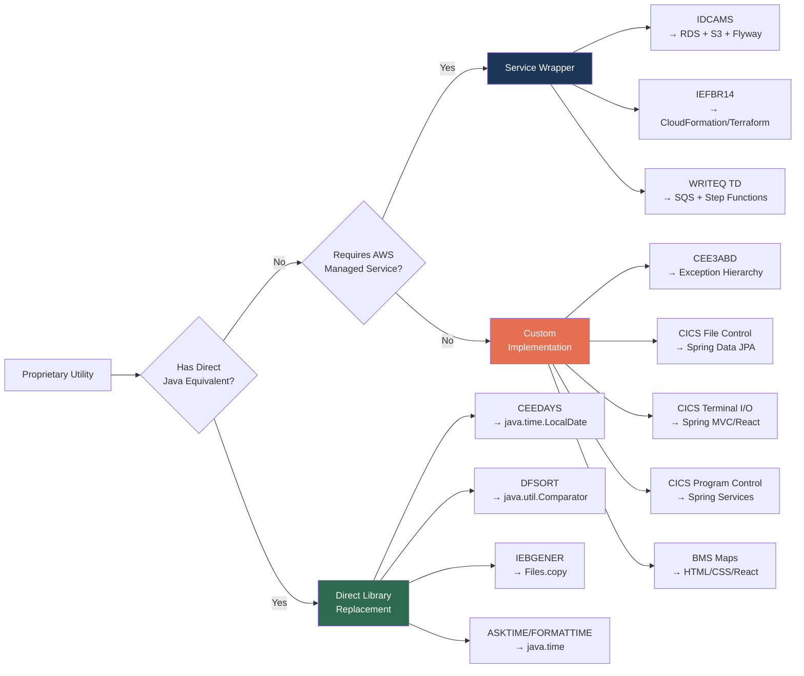

# 4. Migration Strategy Per Utility — Java Implementation Recommendations

[← Previous: Dependency Impact Analysis](./03-dependency-impact-analysis.md) | [Executive Summary](./00-executive-summary.md) | [Next: Risk Assessment →](./05-risk-assessment.md)

---

## 4.1 Overview

This document provides concrete, actionable Java migration recommendations for each proprietary IBM mainframe utility identified in the [Proprietary Utility Inventory](./01-proprietary-utility-inventory.md). Every recommendation is grounded in the external documentation research documented in [Section 02](./02-external-documentation-research.md) and the dependency impact analysis from [Section 03](./03-dependency-impact-analysis.md).

For each utility, this section specifies:
- **Migration approach category** (Direct Replacement, Custom Implementation, or Service Wrapper)
- **Specific Java libraries** with version numbers and Maven/Gradle coordinates
- **COBOL source snippet** showing the current mainframe invocation
- **Java equivalent snippet** demonstrating the recommended implementation
- **Behavioral equivalence notes** documenting semantic parity requirements and edge cases

---

## 4.2 Migration Approach Framework

Every proprietary utility is classified into one of three migration approach categories. This framework provides a consistent decision model for stakeholders and implementation teams.

### 4.2.1 Direct Library Replacement

**Definition:** An existing, well-maintained Java library provides functionally equivalent behavior to the mainframe utility. Migration involves replacing the COBOL invocation with the corresponding Java API call.

**Characteristics:**
- One-to-one behavioral mapping exists
- Java library is mature, well-documented, and actively maintained
- No custom business logic required beyond API adaptation
- Lowest risk and effort category

**Applicable Utilities:** CEEDAYS, DFSORT, IEBGENER

### 4.2.2 Custom Implementation

**Definition:** No single Java library provides a direct equivalent. Custom Java code must be written, potentially leveraging multiple libraries and frameworks, to replicate the mainframe utility's behavior within the application context.

**Characteristics:**
- Requires understanding of the original utility's behavioral contract
- May combine multiple Java libraries and custom logic
- Requires comprehensive testing for behavioral parity
- Moderate risk; higher implementation effort

**Applicable Utilities:** CEE3ABD, CICS File Control, CICS Terminal I/O, CICS Program Control, BMS Maps

### 4.2.3 Service Wrapper

**Definition:** The mainframe utility's function is replaced by an AWS managed service or infrastructure provisioning tool. The Java application integrates with the service via SDK or API rather than replicating the behavior in application code.

**Characteristics:**
- Leverages cloud-native capabilities for scalability and resilience
- Reduces custom code maintenance burden
- Requires AWS service configuration and IAM setup
- Risk varies based on service maturity and configuration complexity

**Applicable Utilities:** IDCAMS, IEFBR14, WRITEQ TD

---

## 4.3 Per-Utility Migration Recommendations

### 4.3.1 CEEDAYS → `java.time.LocalDate` (Direct Library Replacement)

**Migration Approach:** Direct Library Replacement
**Risk Level:** LOW
**Effort Estimate:** 1–2 days

#### Current COBOL Implementation

The `CEEDAYS` callable service is invoked through the `CSUTLDTC` wrapper program. It converts a character date string to Lilian format (integer days since October 14, 1582).

```cobol
      *  Source: app/cbl/CSUTLDTC.cbl (lines 116–130)
      *  CEEDAYS converts date string to Lilian integer
       MOVE WS-EDIT-DATE-FROM    TO  WS-DATE-TO-TEST.
       MOVE WS-DATE-FORMAT-IN    TO  WS-PICSTR-IN-1.

       CALL 'CEEDAYS' USING WS-DATE-TO-TEST
                             WS-PICSTR-IN
                             WS-LILIAN
                             FC.

       IF CEE000 OF FC
           MOVE 0             TO  WS-RETURN-CODE
       ELSE
           MOVE 4             TO  WS-RETURN-CODE
       END-IF.
```

The wrapper program `CSUTLDTC` is called from online CICS programs including `COTRN02C.cbl` and `CORPT00C.cbl` for date validation during transaction processing and report generation.

Source: [app/cbl/CSUTLDTC.cbl](../../app/cbl/CSUTLDTC.cbl) | IBM Reference: [CEEDAYS — Convert Date to Lilian Format](https://www.ibm.com/docs/en/zos/2.1.0?topic=services-ceedays-convert-date-lilian-format)

#### Recommended Java Implementation

```java
import java.time.LocalDate;
import java.time.format.DateTimeFormatter;
import java.time.format.DateTimeParseException;
import java.time.temporal.ChronoUnit;

/**
 * LilianDateConverter — Java equivalent of the CEEDAYS callable service.
 * Converts date strings to Lilian format (days since October 14, 1582).
 *
 * Replaces: CSUTLDTC.cbl wrapper + CEEDAYS Language Environment service
 * Library:  java.time (JDK 8+) — no external dependency required
 */
public class LilianDateConverter {

    /** Lilian epoch: October 14, 1582 (start of Gregorian calendar) */
    private static final LocalDate LILIAN_EPOCH = LocalDate.of(1582, 10, 14);

    /**
     * Converts a date string to Lilian day number.
     *
     * @param dateString the date to convert (e.g., "2024-01-15")
     * @param pattern    the date format pattern (e.g., "yyyy-MM-dd")
     * @return Lilian day number (days since October 14, 1582)
     * @throws DateTimeParseException if dateString cannot be parsed
     * @throws IllegalArgumentException if date precedes Lilian epoch
     */
    public static long toLilian(String dateString, String pattern) {
        DateTimeFormatter formatter = DateTimeFormatter.ofPattern(pattern);
        LocalDate date = LocalDate.parse(dateString, formatter);

        if (date.isBefore(LILIAN_EPOCH)) {
            throw new IllegalArgumentException(
                "Date precedes Lilian epoch (October 14, 1582): " + date);
        }

        return ChronoUnit.DAYS.between(LILIAN_EPOCH, date) + 1;
    }

    /**
     * Converts a Lilian day number back to a LocalDate.
     *
     * @param lilianDay the Lilian day number
     * @return the corresponding LocalDate
     */
    public static LocalDate fromLilian(long lilianDay) {
        return LILIAN_EPOCH.plusDays(lilianDay - 1);
    }
}
```

#### Behavioral Equivalence Notes

| Aspect | COBOL/CEEDAYS | Java/LocalDate | Parity |
|--------|---------------|----------------|--------|
| Epoch | October 14, 1582 | Configurable (set to match) | ✅ Exact match |
| Date format input | Picture string (e.g., `YYYYMMDD`) | `DateTimeFormatter` pattern | ✅ Equivalent |
| Leap year handling | IBM LE specification | `java.time` ISO chronology | ✅ Equivalent |
| Invalid date detection | FC (feedback code) non-zero | `DateTimeParseException` thrown | ✅ Equivalent |
| Century boundary | Handled by picture string | Handled by 4-digit year pattern | ✅ Equivalent |
| Return code pattern | FC field: CEE000 = success | Exception-based: no exception = success | ⚠️ Adapter needed |

**Key Implementation Details:**
- The Lilian day numbering starts at 1 (October 15, 1582 = Lilian day 1), matching IBM specification
- COBOL picture strings like `YYYYMMDD` map directly to Java `DateTimeFormatter` patterns like `yyyyMMdd`
- The `CSUTLDTC` wrapper's return code (0 = success, 4 = failure) should be replicated as a try/catch pattern or a result-type wrapper in the calling service layer
- **Edge cases from IBM documentation:** February 29 in non-leap years, dates before the Gregorian calendar adoption, and month/day boundary validation are all handled natively by `java.time`

---

### 4.3.2 CEE3ABD → Custom Exception Hierarchy (Custom Implementation)

**Migration Approach:** Custom Implementation
**Risk Level:** LOW
**Effort Estimate:** 1–2 days

#### Current COBOL Implementation

`CEE3ABD` terminates the Language Environment enclave with a user-specified abend code. All 9 batch programs use an identical pattern in the `9999-ABEND-PROGRAM` paragraph:

```cobol
      *  Source: app/cbl/CBACT01C.cbl (lines 170–178)
       9999-ABEND-PROGRAM.
           DISPLAY 'ABENDING PROGRAM'
           MOVE 0    TO WS-TIMING
           MOVE 999  TO WS-ABESSION
           CALL 'CEE3ABD' USING WS-ABESSION, WS-TIMING.
           GOBACK.
```

This pattern is consistent across: `CBACT01C`, `CBACT02C`, `CBACT03C`, `CBACT04C`, `CBCUS01C`, `CBSTM03A`, `CBTRN01C`, `CBTRN02C`, `CBTRN03C`.

Source: [app/cbl/CBACT01C.cbl](../../app/cbl/CBACT01C.cbl) | IBM Reference: [CEE3ABD — Terminate Enclave with Abend](https://www.ibm.com/docs/en/zos/2.4.0?topic=services-cee3abdterminate-enclave-abend)

#### Recommended Java Implementation

```java
/**
 * MainframeAbendException — Java equivalent of CEE3ABD abend handling.
 *
 * Replaces: CALL 'CEE3ABD' USING abend-code, timing
 * Used by:  All 9 batch processing programs
 *
 * The abend code 999 maps to an unrecoverable batch processing error.
 * The timing parameter (0 = immediate) maps to immediate exception propagation.
 */
public class MainframeAbendException extends RuntimeException {

    private final int abendCode;
    private final int timing;

    /**
     * Creates a new abend exception mirroring CEE3ABD behavior.
     *
     * @param abendCode the user abend code (e.g., 999)
     * @param timing    0 = immediate termination, 1 = allow cleanup
     * @param message   descriptive error message
     */
    public MainframeAbendException(int abendCode, int timing, String message) {
        super(String.format("ABEND U%04d: %s", abendCode, message));
        this.abendCode = abendCode;
        this.timing = timing;
    }

    public MainframeAbendException(int abendCode, int timing,
                                    String message, Throwable cause) {
        super(String.format("ABEND U%04d: %s", abendCode, message), cause);
        this.abendCode = abendCode;
        this.timing = timing;
    }

    public int getAbendCode() { return abendCode; }
    public int getTiming()    { return timing; }
}

// --- Usage in migrated batch program (e.g., AccountFileProcessor) ---
public class AccountFileProcessor {

    private static final org.slf4j.Logger log =
        org.slf4j.LoggerFactory.getLogger(AccountFileProcessor.class);

    public void process() {
        try {
            // ... batch processing logic ...
        } catch (Exception e) {
            log.error("ABENDING PROGRAM", e);
            throw new MainframeAbendException(999, 0,
                "Account file processing failed", e);
        }
    }
}
```

#### Behavioral Equivalence Notes

| Aspect | COBOL/CEE3ABD | Java/Exception | Parity |
|--------|---------------|----------------|--------|
| Abend code 999 | User abend U0999 | Exception with code 999 | ✅ Equivalent |
| Timing = 0 (immediate) | Immediate enclave termination | Unchecked RuntimeException propagation | ✅ Equivalent |
| DISPLAY before abend | Console output of diagnostic | `log.error()` with structured logging | ✅ Enhanced |
| GOBACK after CALL | Redundant (CEE3ABD never returns) | Stack unwinding via exception | ✅ Equivalent |
| System dump generation | z/OS dump dataset | JVM heap dump + thread dump (configurable) | ✅ Equivalent |
| Batch job return code | Non-zero condition code | `System.exit()` or Spring Batch exit code | ⚠️ Adapter needed |

**Key Implementation Details:**
- All 9 batch programs use abend code 999 exclusively — a single exception class suffices
- The timing parameter 0 (immediate) maps naturally to an unchecked `RuntimeException` that propagates immediately
- For Spring Batch migration, the exception should be caught at the `Step` level to set appropriate `ExitStatus` codes
- Logging replaces `DISPLAY` statements with structured SLF4J output for operational observability
- JVM `-XX:+HeapDumpOnOutOfMemoryError` and `-XX:HeapDumpPath` provide equivalent dump capability to z/OS system dumps

---

### 4.3.3 IDCAMS → AWS RDS DDL + S3 + Flyway (Service Wrapper)

**Migration Approach:** Service Wrapper
**Risk Level:** MEDIUM
**Effort Estimate:** 5–10 days

#### Current Mainframe Usage

IDCAMS (Access Method Services) manages the full lifecycle of VSAM datasets. In CardDemo, it is used across multiple JCL jobs for dataset definition, data loading, deletion, and catalog operations.

```jcl
//*  Source: README.md batch job catalog — DEFVSAM job
//*  Typical IDCAMS DEFINE CLUSTER for VSAM KSDS
//STEP01   EXEC PGM=IDCAMS
//SYSPRINT DD SYSOUT=*
//SYSIN    DD *
  DEFINE CLUSTER (                                -
         NAME(AWS.M2.CARDDEMO.ACCTDATA.VSAM.KSDS) -
         INDEXED                                   -
         RECSZ(300 300)                            -
         KEYS(11 0)                                -
         )
/*
```

IDCAMS commands used in CardDemo:
- **DEFINE CLUSTER** — Creates VSAM KSDS datasets (DEFVSAM job)
- **REPRO** — Copies sequential data into VSAM clusters (LOADVSAM job)
- **DELETE** — Removes VSAM datasets (cleanup operations)
- **ALTER** — Modifies dataset attributes
- **LISTCAT** — Catalogs dataset metadata (app/catlg/LISTCAT.txt)

Source: [README.md](../../README.md) | [app/catlg/LISTCAT.txt](../../app/catlg/LISTCAT.txt) | IBM Reference: [IDCAMS Access Method Services](https://www.ibm.com/docs/en/zos/2.5.0?topic=dfsms-access-method-services-idcams)

#### Recommended Java/AWS Implementation

**DEFINE CLUSTER → Flyway DDL Migration Scripts**

```sql
-- V1__create_account_table.sql (Flyway migration script)
-- Replaces: IDCAMS DEFINE CLUSTER for ACCTDATA VSAM KSDS
-- Key structure: KEYS(11 0) maps to CHAR(11) primary key at offset 0

CREATE TABLE IF NOT EXISTS card_demo.accounts (
    acct_id           CHAR(11)       NOT NULL PRIMARY KEY,
    acct_active_status CHAR(1)       NOT NULL DEFAULT 'Y',
    acct_curr_bal     DECIMAL(12,2)  NOT NULL DEFAULT 0.00,
    acct_credit_limit DECIMAL(12,2)  NOT NULL DEFAULT 0.00,
    acct_cash_credit_limit DECIMAL(12,2) NOT NULL DEFAULT 0.00,
    acct_open_date    CHAR(10)       NOT NULL,
    acct_expiration_date CHAR(10)    NOT NULL,
    acct_reissue_date CHAR(10),
    acct_curr_cyc_credit DECIMAL(12,2) NOT NULL DEFAULT 0.00,
    acct_curr_cyc_debit  DECIMAL(12,2) NOT NULL DEFAULT 0.00,
    acct_group_id     CHAR(10)       NOT NULL,
    filler            CHAR(178)
);
```

**REPRO → Spring Batch Data Loader**

```java
import org.springframework.batch.item.file.FlatFileItemReader;
import org.springframework.batch.item.file.mapping.DefaultLineMapper;
import org.springframework.batch.item.file.transform.FixedLengthTokenizer;
import org.springframework.batch.item.file.transform.Range;
import org.springframework.batch.item.database.JdbcBatchItemWriter;

/**
 * AccountDataLoader — Replaces IDCAMS REPRO for ACCTDATA loading.
 *
 * Reads fixed-width sequential file (formerly EBCDIC, now ASCII)
 * and bulk-inserts into the accounts relational table.
 *
 * Library: Spring Batch 5.x (org.springframework.batch:spring-batch-core)
 */
@Configuration
public class AccountDataLoaderConfig {

    @Bean
    public FlatFileItemReader<AccountRecord> accountReader() {
        FlatFileItemReader<AccountRecord> reader = new FlatFileItemReader<>();
        reader.setResource(new ClassPathResource("data/ACCTDATA.txt"));

        FixedLengthTokenizer tokenizer = new FixedLengthTokenizer();
        tokenizer.setColumns(
            new Range(1, 11),    // ACCT-ID (key at offset 0, length 11)
            new Range(12, 12),   // ACCT-ACTIVE-STATUS
            new Range(13, 24),   // ACCT-CURR-BAL
            new Range(25, 36)    // ACCT-CREDIT-LIMIT
            // ... additional fields per copybook CVACT01Y.cpy
        );
        tokenizer.setNames("acctId", "activeStatus", "currBal", "creditLimit");

        DefaultLineMapper<AccountRecord> lineMapper = new DefaultLineMapper<>();
        lineMapper.setLineTokenizer(tokenizer);
        lineMapper.setFieldSetMapper(new AccountRecordFieldSetMapper());
        reader.setLineMapper(lineMapper);

        return reader;
    }

    @Bean
    public JdbcBatchItemWriter<AccountRecord> accountWriter(DataSource dataSource) {
        JdbcBatchItemWriter<AccountRecord> writer = new JdbcBatchItemWriter<>();
        writer.setDataSource(dataSource);
        writer.setSql("INSERT INTO card_demo.accounts " +
            "(acct_id, acct_active_status, acct_curr_bal, acct_credit_limit) " +
            "VALUES (:acctId, :activeStatus, :currBal, :creditLimit)");
        writer.setItemSqlParameterSourceProvider(
            new BeanPropertyItemSqlParameterSourceProvider<>());
        return writer;
    }
}
```

**DELETE → DDL Drop or S3 Lifecycle**

```java
// Replaces: IDCAMS DELETE for VSAM dataset removal
// For RDS: DROP TABLE via Flyway migration
// For S3 objects: AWS SDK deletion

import software.amazon.awssdk.services.s3.S3Client;
import software.amazon.awssdk.services.s3.model.DeleteObjectRequest;

public class DatasetCleanupService {

    private final S3Client s3Client;
    private final JdbcTemplate jdbcTemplate;

    public void deleteDataset(String datasetName) {
        // RDS equivalent of IDCAMS DELETE for VSAM clusters
        jdbcTemplate.execute("DROP TABLE IF EXISTS card_demo." + datasetName);
    }

    public void deleteSequentialDataset(String bucket, String key) {
        // S3 equivalent for NONVSAM sequential files
        s3Client.deleteObject(DeleteObjectRequest.builder()
            .bucket(bucket)
            .key(key)
            .build());
    }
}
```

#### Behavioral Equivalence Notes

| IDCAMS Command | AWS/Java Equivalent | Library | Parity |
|----------------|---------------------|---------|--------|
| DEFINE CLUSTER (KSDS) | CREATE TABLE with PRIMARY KEY | Flyway 10.x + PostgreSQL/MySQL | ✅ Equivalent |
| DEFINE AIX | CREATE INDEX + foreign key | Flyway DDL | ✅ Equivalent |
| DEFINE GDG BASE | S3 versioned bucket prefix | AWS SDK 2.x | ⚠️ Behavioral adaptation |
| REPRO (load) | Spring Batch FlatFileItemReader → JdbcBatchItemWriter | Spring Batch 5.x | ✅ Equivalent |
| DELETE | DROP TABLE / S3 DeleteObject | JDBC / AWS SDK 2.x | ✅ Equivalent |
| ALTER | ALTER TABLE | Flyway migration | ✅ Equivalent |
| LISTCAT | INFORMATION_SCHEMA queries / S3 ListObjectsV2 | JDBC / AWS SDK 2.x | ✅ Equivalent |

**Key Implementation Details:**
- VSAM KSDS key structure (`KEYS(length offset)`) maps directly to relational primary keys with matching column types
- VSAM Alternate Index (AIX) maps to database secondary indexes or unique constraints
- GDG (Generation Data Group) versioned datasets map to S3 versioned objects with lifecycle rules for retention
- The `RECSZ(300 300)` fixed-length record maps to fixed-width column totals in the relational schema
- Flyway migration scripts provide version-controlled schema evolution, replacing ad-hoc IDCAMS DEFINE/DELETE cycles

---

### 4.3.4 DFSORT → `java.util.Comparator` + Apache Commons IO (Direct Library Replacement)

**Migration Approach:** Direct Library Replacement
**Risk Level:** LOW
**Effort Estimate:** 2–3 days

#### Current Mainframe Usage

DFSORT is used in the COMBTRAN batch job to sort and merge transaction records as part of the batch processing chain (POSTTRAN → INTCALC → **COMBTRAN** → CREASTMT).

```jcl
//*  Source: README.md batch job catalog — COMBTRAN job
//*  Typical DFSORT control statement for transaction merge
//STEP01   EXEC PGM=SORT
//SORTIN   DD DSN=AWS.M2.CARDDEMO.TRANSACT,DISP=SHR
//SORTOUT  DD DSN=AWS.M2.CARDDEMO.TRANSACT.SORTED,DISP=(NEW,CATLG)
//SYSIN    DD *
  SORT FIELDS=(1,11,CH,A,12,10,CH,A)
/*
```

The SORT FIELDS specification sorts transaction records by:
- Position 1, length 11, Character, Ascending (account ID)
- Position 12, length 10, Character, Ascending (transaction date)

Source: [README.md](../../README.md) | IBM Reference: [DFSORT Application Programming Guide (SC23-6878)](https://www.ibm.com/docs/en/SSLTBW_2.5.0/pdf/icea100_v2r5.pdf)

#### Recommended Java Implementation

```java
import java.io.IOException;
import java.nio.file.Files;
import java.nio.file.Path;
import java.util.Comparator;
import java.util.List;
import java.util.stream.Collectors;

/**
 * TransactionSorter — Java equivalent of DFSORT for COMBTRAN job.
 *
 * Replaces: SORT FIELDS=(1,11,CH,A,12,10,CH,A)
 * Library:  java.util.Comparator (JDK 8+), Apache Commons IO 2.15.x
 *
 * Sorts fixed-width transaction records by account ID (pos 1-11)
 * then by transaction date (pos 12-21).
 */
public class TransactionSorter {

    /**
     * Sorts a fixed-width transaction file by the specified key fields.
     * Replicates DFSORT SORT FIELDS=(1,11,CH,A,12,10,CH,A).
     *
     * @param inputPath  path to the input transaction file
     * @param outputPath path for the sorted output file
     * @throws IOException if file I/O fails
     */
    public void sortTransactions(Path inputPath, Path outputPath)
            throws IOException {

        List<String> records = Files.readAllLines(inputPath);

        // DFSORT FIELDS=(1,11,CH,A,12,10,CH,A) equivalent:
        // Sort by account ID (chars 0-10) ascending,
        // then by transaction date (chars 11-20) ascending
        Comparator<String> sortComparator = Comparator
            .comparing((String line) -> line.substring(0, 11))  // ACCT-ID
            .thenComparing(line -> line.substring(11, 21));      // TRAN-DATE

        List<String> sorted = records.stream()
            .sorted(sortComparator)
            .collect(Collectors.toList());

        Files.write(outputPath, sorted);
    }
}
```

#### Behavioral Equivalence Notes

| Aspect | DFSORT | Java Streams + Comparator | Parity |
|--------|--------|---------------------------|--------|
| Sort algorithm | Proprietary (optimized for tape/DASD) | TimSort O(n log n) | ✅ Equivalent correctness |
| Character comparison | EBCDIC collating sequence | ASCII/UTF-8 collating sequence | ⚠️ Verify after EBCDIC conversion |
| Stable sort | Yes (preserves equal-key order) | Yes (TimSort is stable) | ✅ Equivalent |
| Memory handling | Virtual storage + work datasets | JVM heap + temp files for large sorts | ⚠️ Large file strategy needed |
| MERGE operation | SORT FIELDS with multiple inputs | Java merge sort across streams | ✅ Equivalent |
| OUTFIL (multi-output) | DFSORT OUTFIL control | Multiple `Files.write()` calls | ✅ Equivalent |

**Key Implementation Details:**
- DFSORT field positions are 1-based; Java `String.substring()` is 0-based — offset accordingly
- EBCDIC collating sequence differs from ASCII — ensure data has been converted to ASCII/UTF-8 before sorting (the CardDemo repository includes ASCII equivalents in `app/data/ASCII/`)
- For large files exceeding JVM heap, use Apache Commons IO `FileUtils` with external merge sort or Java `java.nio.MappedByteBuffer` for memory-mapped I/O
- Performance is comparable: Java TimSort is O(n log n), matching DFSORT's algorithmic complexity
- Spring Batch integration: wrap the sort step as a `Tasklet` in the batch job chain

---

### 4.3.5 IEBGENER → `java.nio.file.Files.copy()` (Direct Library Replacement)

**Migration Approach:** Direct Library Replacement
**Risk Level:** LOW
**Effort Estimate:** < 1 day

#### Current Mainframe Usage

IEBGENER is used in the DUSRSECJ batch job to copy sequential user security data from a source file into the target dataset.

```jcl
//*  Source: README.md batch job catalog — DUSRSECJ job
//*  IEBGENER copies sequential file for user security loading
//STEP01   EXEC PGM=IEBGENER
//SYSPRINT DD SYSOUT=*
//SYSUT1   DD DSN=AWS.M2.CARDDEMO.USRSEC.DATA,DISP=SHR
//SYSUT2   DD DSN=AWS.M2.CARDDEMO.USRSEC.VSAM.KSDS,DISP=SHR
//SYSIN    DD DUMMY
```

Source: [README.md](../../README.md) | IBM Reference: [IEBGENER — Sequential Copy/Generate](https://www.ibm.com/docs/zosbasics/com.ibm.zos.zdatamgmt/zsysprogc_utilities_IEBGENER.htm)

#### Recommended Java Implementation

```java
import java.io.IOException;
import java.nio.file.Files;
import java.nio.file.Path;
import java.nio.file.StandardCopyOption;

/**
 * SequentialFileCopier — Java equivalent of IEBGENER utility.
 *
 * Replaces: PGM=IEBGENER for sequential file copy operations
 * Library:  java.nio.file (JDK 7+) — no external dependency required
 *
 * For AWS deployments, S3 copy operations replace file-level copies.
 */
public class SequentialFileCopier {

    /**
     * Copies a sequential file from source to destination.
     * Replicates IEBGENER SYSUT1 → SYSUT2 behavior.
     *
     * @param source      source file path (SYSUT1 equivalent)
     * @param destination target file path (SYSUT2 equivalent)
     * @throws IOException if copy operation fails
     */
    public static void copy(Path source, Path destination) throws IOException {
        Files.copy(source, destination, StandardCopyOption.REPLACE_EXISTING);
    }
}
```

**AWS S3 Variant:**

```java
import software.amazon.awssdk.services.s3.S3Client;
import software.amazon.awssdk.services.s3.model.CopyObjectRequest;

/**
 * S3FileCopier — AWS equivalent of IEBGENER for cloud-hosted data.
 * Library: AWS SDK for Java 2.x (software.amazon.awssdk:s3)
 */
public class S3FileCopier {

    private final S3Client s3Client;

    public S3FileCopier(S3Client s3Client) {
        this.s3Client = s3Client;
    }

    public void copy(String sourceBucket, String sourceKey,
                     String destBucket, String destKey) {
        s3Client.copyObject(CopyObjectRequest.builder()
            .sourceBucket(sourceBucket)
            .sourceKey(sourceKey)
            .destinationBucket(destBucket)
            .destinationKey(destKey)
            .build());
    }
}
```

#### Behavioral Equivalence Notes

| Aspect | IEBGENER | Java Files.copy() / S3 | Parity |
|--------|----------|------------------------|--------|
| Byte-for-byte copy | Yes | Yes (with REPLACE_EXISTING) | ✅ Exact match |
| Record reformatting | Via SYSIN control statements | Not needed (flat file copy) | ✅ N/A for CardDemo |
| EBCDIC encoding | Native | Pre-converted to ASCII | ⚠️ Verify encoding |
| Error reporting | SYSPRINT DD | IOException / S3Exception | ✅ Equivalent |

**Key Implementation Details:**
- IEBGENER in CardDemo is used purely for copying (SYSIN DD DUMMY), not for record reformatting
- The `java.nio.file.Files.copy()` method provides atomic copy with optional `REPLACE_EXISTING` flag
- For AWS deployments, S3 `CopyObject` provides server-side copy without data transfer through the application
- Data encoding: ensure source files are converted from EBCDIC to ASCII/UTF-8 before Java processing

---

### 4.3.6 IEFBR14 → No-Op / Infrastructure Provisioning (Service Wrapper)

**Migration Approach:** Service Wrapper
**Risk Level:** LOW
**Effort Estimate:** < 1 day

#### Current Mainframe Usage

IEFBR14 is a no-operation program used solely for JCL DD statement processing. In CardDemo, it appears in CLOSEFIL and OPENFIL jobs to manage VSAM file availability (open/close file disposition).

```jcl
//*  Source: README.md batch job catalog — CLOSEFIL/OPENFIL jobs
//*  IEFBR14 is a no-op; the JCL DD statements perform the real work
//STEP01   EXEC PGM=IEFBR14
//ACCTFILE DD DSN=AWS.M2.CARDDEMO.ACCTDATA.VSAM.KSDS,DISP=SHR
//CARDFILE DD DSN=AWS.M2.CARDDEMO.CARDDATA.VSAM.KSDS,DISP=SHR
//CUSTFILE DD DSN=AWS.M2.CARDDEMO.CUSTDATA.VSAM.KSDS,DISP=SHR
```

Source: [README.md](../../README.md) | IBM Reference: [IEFBR14 — Do-Nothing Utility](https://www.ibm.com/docs/zosbasics/com.ibm.zos.zdatamgmt/zsysprogc_utilities_IEFBR14.htm)

#### Recommended Java/AWS Implementation

```java
/**
 * IEFBR14 Replacement Strategy:
 *
 * IEFBR14 itself requires NO Java code. It is a no-op program whose sole
 * purpose is to allow JCL DD statements to allocate, catalog, or uncatalog
 * datasets. In the migrated architecture:
 *
 * - Dataset allocation → Database schema creation via Flyway
 * - Dataset deallocation → Not needed (persistent RDS/S3 storage)
 * - File availability control → Application connection pool management
 * - CLOSEFIL job → Graceful connection pool shutdown
 * - OPENFIL job → Application startup with connection pool initialization
 *
 * The closest equivalent is infrastructure provisioning:
 * - AWS CloudFormation or Terraform for resource lifecycle management
 * - Spring Boot auto-configuration for connection pool management
 * - AWS RDS start/stop for database availability control
 */

// Example: Spring Boot configuration replaces OPENFIL/CLOSEFIL
// application.yml
// spring:
//   datasource:
//     url: jdbc:postgresql://carddemo-db.xxxxx.rds.amazonaws.com:5432/carddemo
//     hikari:
//       maximum-pool-size: 20
//       minimum-idle: 5
//       connection-timeout: 30000
```

#### Behavioral Equivalence Notes

| Aspect | IEFBR14/JCL | AWS/Java Equivalent | Parity |
|--------|-------------|---------------------|--------|
| Dataset allocation | DD DISP=(NEW,CATLG) | CloudFormation/Terraform resource creation | ✅ Equivalent |
| Dataset deallocation | DD DISP=(OLD,DELETE) | Resource deletion via IaC | ✅ Equivalent |
| File availability | CLOSEFIL/OPENFIL jobs | Connection pool start/stop | ✅ Equivalent |
| No-op execution | PGM=IEFBR14 returns RC=0 | No code needed | ✅ N/A |

**Key Implementation Details:**
- IEFBR14 is the only utility requiring zero Java code — its function is absorbed by infrastructure provisioning
- The CLOSEFIL/OPENFIL pattern maps to AWS RDS instance start/stop or Spring connection pool lifecycle
- CloudFormation/Terraform templates replace JCL DD statement resource management
- This is the lowest-risk migration item — no behavioral parity testing required for the utility itself

---

### 4.3.7 CICS File Control → Spring Data JPA (Custom Implementation)

**Migration Approach:** Custom Implementation
**Risk Level:** HIGH
**Effort Estimate:** 15–25 days

#### Current COBOL Implementation

CICS File Control commands provide the primary data access layer for all 19 online programs. They operate against VSAM KSDS datasets using record-level operations.

**READ (Single Record Retrieval by Key):**

```cobol
      *  Source: app/cbl/COACTUPC.cbl (lines 3650–3680)
           EXEC CICS READ
                DATASET(WS-ACCTDAT-FNAME)
                INTO(ACCOUNT-RECORD)
                RIDFLD(WS-ACCT-ID-N)
                KEYLENGTH(LENGTH OF WS-ACCT-ID-N)
                RESP(WS-RESP-CD)
                RESP2(WS-REAS-CD)
           END-EXEC.
```

**WRITE (Insert New Record):**

```cobol
      *  Source: app/cbl/COCRDUP.cbl — Credit card creation
           EXEC CICS WRITE
                DATASET(WS-CARDDAT-FNAME)
                FROM(CARD-RECORD)
                RIDFLD(WS-CARD-RID-CARDNUM)
                KEYLENGTH(LENGTH OF WS-CARD-RID-CARDNUM)
                RESP(WS-RESP-CD)
                RESP2(WS-REAS-CD)
           END-EXEC.
```

**REWRITE (Update Existing Record):**

```cobol
      *  Source: app/cbl/COBIL00C.cbl (lines 475–490)
           EXEC CICS REWRITE
                DATASET(WS-ACCTDAT-FNAME)
                FROM(ACCOUNT-RECORD)
                RESP(WS-RESP-CD)
                RESP2(WS-REAS-CD)
           END-EXEC.
```

**STARTBR / READNEXT / READPREV / ENDBR (Browse Operations):**

```cobol
      *  Source: app/cbl/COBIL00C.cbl (lines 440–470)
           EXEC CICS STARTBR
                DATASET(WS-TRANDAT-FNAME)
                RIDFLD(WS-TRAN-RID)
                KEYLENGTH(LENGTH OF WS-TRAN-RID)
                GTEQ
                RESP(WS-RESP-CD)
                RESP2(WS-REAS-CD)
           END-EXEC.

           PERFORM UNTIL WS-EOF OR WS-COUNT > WS-MAX
               EXEC CICS READPREV
                    DATASET(WS-TRANDAT-FNAME)
                    INTO(TRAN-RECORD)
                    RIDFLD(WS-TRAN-RID)
                    KEYLENGTH(LENGTH OF WS-TRAN-RID)
                    RESP(WS-RESP-CD)
                    RESP2(WS-REAS-CD)
               END-EXEC
               IF WS-RESP-CD = DFHRESP(ENDFILE)
                   SET WS-EOF TO TRUE
               END-IF
           END-PERFORM.

           EXEC CICS ENDBR
                DATASET(WS-TRANDAT-FNAME)
                RESP(WS-RESP-CD)
                RESP2(WS-REAS-CD)
           END-EXEC.
```

**DELETE (Remove Record):**

```cobol
      *  Source: app/cbl/COACTUPC.cbl — Account deletion
           EXEC CICS DELETE
                DATASET(WS-ACCTDAT-FNAME)
                RIDFLD(WS-ACCT-ID-N)
                KEYLENGTH(LENGTH OF WS-ACCT-ID-N)
                RESP(WS-RESP-CD)
                RESP2(WS-REAS-CD)
           END-EXEC.
```

Source: [app/cbl/COACTUPC.cbl](../../app/cbl/COACTUPC.cbl), [app/cbl/COBIL00C.cbl](../../app/cbl/COBIL00C.cbl) | IBM Reference: [CICS TS Application Programming Reference](https://www.ibm.com/docs/en/cics-ts)

#### Recommended Java Implementation

**JPA Entity (replaces VSAM record layout):**

```java
import jakarta.persistence.*;
import java.math.BigDecimal;

/**
 * Account entity — JPA equivalent of VSAM KSDS ACCTDATA record.
 * Record layout from: app/cpy/CVACT01Y.cpy
 *
 * Library: Jakarta Persistence 3.1+ (via Spring Data JPA 3.x)
 */
@Entity
@Table(name = "accounts", schema = "card_demo")
public class Account {

    @Id
    @Column(name = "acct_id", length = 11, nullable = false)
    private String acctId;

    @Column(name = "acct_active_status", length = 1, nullable = false)
    private String activeStatus;

    @Column(name = "acct_curr_bal", precision = 12, scale = 2)
    private BigDecimal currentBalance;

    @Column(name = "acct_credit_limit", precision = 12, scale = 2)
    private BigDecimal creditLimit;

    @Column(name = "acct_open_date", length = 10)
    private String openDate;

    @Column(name = "acct_expiration_date", length = 10)
    private String expirationDate;

    // Getters, setters, constructors omitted for brevity
    // Full implementation would include all fields from CVACT01Y.cpy
}
```

**Spring Data JPA Repository (replaces CICS File Control commands):**

```java
import org.springframework.data.domain.Page;
import org.springframework.data.domain.Pageable;
import org.springframework.data.jpa.repository.JpaRepository;
import org.springframework.data.jpa.repository.Query;
import org.springframework.stereotype.Repository;
import java.util.List;

/**
 * AccountRepository — Spring Data JPA equivalent of CICS file control.
 *
 * Command Mapping:
 *   EXEC CICS READ     → findById()
 *   EXEC CICS WRITE    → save() [new entity]
 *   EXEC CICS REWRITE  → save() [existing entity, JPA merge]
 *   EXEC CICS DELETE   → deleteById()
 *   EXEC CICS STARTBR + READNEXT → findByAcctIdGreaterThanEqual() + pagination
 *   EXEC CICS READPREV → findByAcctIdLessThanEqual() + Sort.DESC
 *
 * Library: Spring Data JPA 3.x (org.springframework.data:spring-data-jpa)
 */
@Repository
public interface AccountRepository extends JpaRepository<Account, String> {

    // STARTBR GTEQ + READNEXT equivalent (forward browse)
    Page<Account> findByAcctIdGreaterThanEqual(String acctId, Pageable pageable);

    // STARTBR + READPREV equivalent (reverse browse)
    Page<Account> findByAcctIdLessThanEqual(String acctId, Pageable pageable);

    // Alternate index queries (AIX equivalent)
    @Query("SELECT a FROM Account a WHERE a.activeStatus = :status")
    List<Account> findByActiveStatus(String status);
}
```

**Service Layer (replaces CICS RESP/RESP2 error handling):**

```java
import org.springframework.stereotype.Service;
import org.springframework.transaction.annotation.Transactional;
import java.util.Optional;

/**
 * AccountService — Wraps JPA operations with CICS-equivalent error handling.
 *
 * CICS RESP code mapping:
 *   DFHRESP(NORMAL)    → successful operation
 *   DFHRESP(NOTFND)    → Optional.empty() / EntityNotFoundException
 *   DFHRESP(DUPREC)    → DataIntegrityViolationException
 *   DFHRESP(ENDFILE)   → empty Page result
 *   DFHRESP(INVREQ)    → IllegalArgumentException
 */
@Service
@Transactional
public class AccountService {

    private final AccountRepository accountRepository;

    public AccountService(AccountRepository accountRepository) {
        this.accountRepository = accountRepository;
    }

    /** READ equivalent */
    public Optional<Account> readAccount(String acctId) {
        return accountRepository.findById(acctId);
    }

    /** WRITE equivalent */
    public Account writeAccount(Account account) {
        if (accountRepository.existsById(account.getAcctId())) {
            throw new DuplicateRecordException(
                "DFHRESP(DUPREC): Account already exists: " + account.getAcctId());
        }
        return accountRepository.save(account);
    }

    /** REWRITE equivalent (requires prior READ) */
    public Account rewriteAccount(Account account) {
        if (!accountRepository.existsById(account.getAcctId())) {
            throw new RecordNotFoundException(
                "DFHRESP(NOTFND): Account not found: " + account.getAcctId());
        }
        return accountRepository.save(account);
    }

    /** DELETE equivalent */
    public void deleteAccount(String acctId) {
        if (!accountRepository.existsById(acctId)) {
            throw new RecordNotFoundException(
                "DFHRESP(NOTFND): Account not found: " + acctId);
        }
        accountRepository.deleteById(acctId);
    }
}
```

#### Behavioral Equivalence Notes

| CICS Command | JPA Equivalent | RESP Code Mapping | Parity |
|--------------|----------------|-------------------|--------|
| READ | `findById()` | NOTFND → `Optional.empty()` | ✅ Equivalent |
| READ UPDATE | `findById()` + `@Lock(PESSIMISTIC_WRITE)` | NOTFND → `Optional.empty()` | ✅ Equivalent |
| WRITE | `save()` (new entity) | DUPREC → `DataIntegrityViolationException` | ✅ Equivalent |
| REWRITE | `save()` (existing entity) | NOTFND → `EntityNotFoundException` | ✅ Equivalent |
| DELETE | `deleteById()` | NOTFND → `EmptyResultDataAccessException` | ✅ Equivalent |
| STARTBR GTEQ | `findByKeyGreaterThanEqual()` | — | ✅ Equivalent |
| READNEXT | Pageable forward iteration | ENDFILE → empty page | ✅ Equivalent |
| READPREV | `Sort.by(Direction.DESC)` | ENDFILE → empty page | ✅ Equivalent |
| ENDBR | Implicit (no cursor to close) | — | ✅ N/A |

**Key Implementation Details:**
- VSAM KSDS primary key access maps directly to JPA `@Id`-based repository methods
- CICS READ UPDATE (with record lock) maps to JPA `@Lock(LockModeType.PESSIMISTIC_WRITE)` for row-level locking
- The STARTBR/READNEXT/READPREV/ENDBR browse pattern maps to Spring Data pagination with `Pageable` and directional sorting
- CICS RESP/RESP2 error codes map to Java exceptions: NOTFND → custom `RecordNotFoundException`, DUPREC → `DataIntegrityViolationException`
- VSAM Alternate Index (AIX) queries map to JPA `@Query` annotations or Spring Data derived query methods
- This is the highest-effort migration item due to its presence across all 19 online programs

---

### 4.3.8 CICS Terminal I/O → Spring MVC + Thymeleaf/React (Custom Implementation)

**Migration Approach:** Custom Implementation
**Risk Level:** HIGH
**Effort Estimate:** 20–30 days

#### Current COBOL Implementation

CICS SEND MAP / RECEIVE MAP commands handle 3270 terminal screen I/O through BMS (Basic Mapping Support) maps. All 19 online programs use this pattern for user interaction.

```cobol
      *  Source: app/cbl/COBIL00C.cbl (lines 130–155)
      *  SEND MAP — Display screen with data
           EXEC CICS SEND
                MAP('COBIL0A')
                MAPSET('COBIL00')
                FROM(COBIL0AO)
                ERASE
                CURSOR
                RESP(WS-RESP-CD)
                RESP2(WS-REAS-CD)
           END-EXEC.

      *  RECEIVE MAP — Capture user input
           EXEC CICS RECEIVE
                MAP('COBIL0A')
                MAPSET('COBIL00')
                INTO(COBIL0AI)
                RESP(WS-RESP-CD)
                RESP2(WS-REAS-CD)
           END-EXEC.
```

The BMS maps define 3270 screen layouts with field attributes (position, length, color, protection). For example, `app/bms/COBIL00.bms` defines the bill payment screen with input fields for payment amount, account number, and action indicators.

Source: [app/cbl/COBIL00C.cbl](../../app/cbl/COBIL00C.cbl), [app/bms/COBIL00.bms](../../app/bms/COBIL00.bms) | IBM Reference: [CICS BMS Application Programming Guide](https://www.ibm.com/docs/en/cics-ts)

#### Recommended Java Implementation

**Spring MVC Controller (replaces SEND MAP / RECEIVE MAP):**

```java
import org.springframework.stereotype.Controller;
import org.springframework.ui.Model;
import org.springframework.web.bind.annotation.*;

/**
 * BillPaymentController — Spring MVC equivalent of COBIL00C.cbl.
 *
 * Replaces:
 *   EXEC CICS SEND MAP('COBIL0A')  → return "bill-payment" view
 *   EXEC CICS RECEIVE MAP('COBIL0A') → @ModelAttribute form binding
 *
 * Library: Spring Web MVC 6.x (org.springframework:spring-webmvc)
 */
@Controller
@RequestMapping("/billing")
public class BillPaymentController {

    private final BillPaymentService billPaymentService;

    public BillPaymentController(BillPaymentService billPaymentService) {
        this.billPaymentService = billPaymentService;
    }

    /**
     * SEND MAP equivalent — Display the bill payment screen.
     * Maps to: EXEC CICS SEND MAP('COBIL0A') MAPSET('COBIL00')
     */
    @GetMapping("/payment")
    public String showPaymentScreen(@RequestParam String acctId, Model model) {
        BillPaymentForm form = billPaymentService.prepareForm(acctId);
        model.addAttribute("paymentForm", form);
        return "bill-payment";  // Thymeleaf template
    }

    /**
     * RECEIVE MAP equivalent — Process user input from payment form.
     * Maps to: EXEC CICS RECEIVE MAP('COBIL0A') MAPSET('COBIL00')
     */
    @PostMapping("/payment")
    public String processPayment(@ModelAttribute BillPaymentForm form,
                                  Model model) {
        try {
            billPaymentService.processPayment(form);
            model.addAttribute("message", "Payment processed successfully");
        } catch (InsufficientFundsException e) {
            model.addAttribute("error", e.getMessage());
        }
        return "bill-payment";
    }
}
```

**Thymeleaf Template (replaces BMS Map COBIL00):**

```html
<!-- bill-payment.html — Thymeleaf equivalent of BMS mapset COBIL00 -->
<!-- Library: Thymeleaf 3.x (org.thymeleaf:thymeleaf-spring6) -->
<form th:action="@{/billing/payment}" th:object="${paymentForm}" method="post">
    <!-- BMS field ACCTIDI → Account ID input -->
    <label for="acctId">Account Number:</label>
    <input type="text" th:field="*{acctId}" maxlength="11"
           readonly="readonly" />

    <!-- BMS field CURBAL → Current Balance (protected/display-only) -->
    <label>Current Balance:</label>
    <span th:text="${#numbers.formatDecimal(paymentForm.currentBalance, 1, 2)}">
    </span>

    <!-- BMS field PAYAMT → Payment Amount (input field) -->
    <label for="paymentAmount">Payment Amount:</label>
    <input type="number" th:field="*{paymentAmount}" step="0.01"
           min="0.01" required="required" />

    <!-- BMS AID key ENTER → Submit button -->
    <button type="submit">Submit Payment</button>
</form>
```

**REST API Alternative (for React/SPA frontend):**

```java
import org.springframework.web.bind.annotation.*;

/**
 * BillPaymentApiController — REST equivalent for React/SPA frontend.
 *
 * Replaces BMS terminal I/O with JSON request/response:
 *   SEND MAP  → JSON response body
 *   RECEIVE MAP → JSON request body
 */
@RestController
@RequestMapping("/api/billing")
public class BillPaymentApiController {

    @GetMapping("/payment/{acctId}")
    public BillPaymentResponse getPaymentScreen(@PathVariable String acctId) {
        // SEND MAP equivalent: return screen data as JSON
        return billPaymentService.getPaymentData(acctId);
    }

    @PostMapping("/payment")
    public BillPaymentResponse processPayment(
            @RequestBody BillPaymentRequest request) {
        // RECEIVE MAP equivalent: process JSON input
        return billPaymentService.processPayment(request);
    }
}
```

#### Behavioral Equivalence Notes

| CICS Terminal I/O | Spring MVC / REST | Parity |
|-------------------|-------------------|--------|
| SEND MAP (display screen) | `@GetMapping` + Thymeleaf view or JSON response | ✅ Equivalent |
| RECEIVE MAP (capture input) | `@PostMapping` + `@ModelAttribute` or `@RequestBody` | ✅ Equivalent |
| ERASE (clear screen) | Full page reload or SPA state reset | ✅ Equivalent |
| CURSOR (position cursor) | HTML `autofocus` attribute | ✅ Equivalent |
| BMS DFHBMSCA attributes (color) | CSS classes for styling | ✅ Equivalent |
| BMS DFHAID (PF keys) | JavaScript keyboard event handlers or buttons | ⚠️ Behavioral adaptation |
| 3270 field attributes (PROT/UNPROT) | HTML `readonly`/`disabled` attributes | ✅ Equivalent |
| BMS field validation (NUM, ALPHA) | HTML5 `type`, `pattern` + server-side validation | ✅ Enhanced |

**Key Implementation Details:**
- Each BMS mapset (17 total) requires a corresponding Thymeleaf template or React component
- BMS field-level attributes (ASKIP, PROT, UNPROT, NUM, BRT, DRK) map to HTML form attributes and CSS classes
- DFHAID attention identifiers (PF1–PF24, ENTER, CLEAR) map to button click handlers or keyboard shortcuts
- The 3270 screen's 80×24 grid layout is replaced by responsive HTML/CSS layouts
- Two UI approaches are recommended:
  - **Server-rendered:** Thymeleaf 3.x for traditional form-based interaction (simpler, closer to 3270 paradigm)
  - **SPA:** React 18.x with REST API backend for modern user experience

---

### 4.3.9 CICS Program Control → Spring Service Layer (Custom Implementation)

**Migration Approach:** Custom Implementation
**Risk Level:** MEDIUM
**Effort Estimate:** 10–15 days

#### Current COBOL Implementation

CICS Program Control commands manage pseudo-conversational flow and inter-program transfers across all 19 online programs.

**RETURN (Pseudo-Conversational Pattern):**

```cobol
      *  Source: app/cbl/COBIL00C.cbl (lines 100–115)
      *  RETURN with TRANSID enables pseudo-conversational flow
           EXEC CICS RETURN
                TRANSID(WS-TRANID)
                COMMAREA(WS-COMMAREA)
                LENGTH(LENGTH OF WS-COMMAREA)
                RESP(WS-RESP-CD)
                RESP2(WS-REAS-CD)
           END-EXEC.
```

**XCTL (Transfer Control to Another Program):**

```cobol
      *  Source: app/cbl/CORPT00C.cbl (lines 290–310)
      *  XCTL transfers control to menu program
           EXEC CICS XCTL
                PROGRAM('COMEN01C')
                COMMAREA(WS-COMMAREA)
                LENGTH(LENGTH OF WS-COMMAREA)
                RESP(WS-RESP-CD)
                RESP2(WS-REAS-CD)
           END-EXEC.
```

The pseudo-conversational pattern works as follows:
1. Program receives control (via TRANSID or XCTL)
2. Checks COMMAREA to determine state (first time vs. returning)
3. Processes user input from RECEIVE MAP
4. Sends updated MAP to terminal
5. Issues RETURN with TRANSID to suspend until next user input

Source: [app/cbl/COBIL00C.cbl](../../app/cbl/COBIL00C.cbl), [app/cbl/CORPT00C.cbl](../../app/cbl/CORPT00C.cbl) | IBM Reference: [CICS TS Application Programming Reference](https://www.ibm.com/docs/en/cics-ts)

#### Recommended Java Implementation

**Spring Service with Session State (replaces COMMAREA):**

```java
import org.springframework.stereotype.Service;
import org.springframework.web.context.annotation.SessionScope;

/**
 * SessionStateService — Spring equivalent of CICS COMMAREA.
 *
 * Replaces:
 *   COMMAREA  → Session-scoped bean (server-side session)
 *   or → JWT token payload (stateless architecture)
 *   or → Request-scoped bean (per-request state)
 *
 * Library: Spring Framework 6.x (org.springframework:spring-context)
 */
@Service
@SessionScope
public class SessionStateService {

    private String currentTransactionId;
    private String previousScreen;
    private byte[] commareaData;

    /** COMMAREA set on RETURN: persists state between requests */
    public void setCommarea(byte[] data) {
        this.commareaData = data;
    }

    /** COMMAREA read on program entry: restores state from prior interaction */
    public byte[] getCommarea() {
        return commareaData;
    }

    public void setCurrentTransactionId(String transId) {
        this.currentTransactionId = transId;
    }

    public String getCurrentTransactionId() {
        return currentTransactionId;
    }
}
```

**Controller Implementing Pseudo-Conversational Flow:**

```java
import org.springframework.stereotype.Controller;
import org.springframework.web.bind.annotation.*;
import jakarta.servlet.http.HttpSession;

/**
 * BillingFlowController — Pseudo-conversational flow equivalent.
 *
 * CICS pseudo-conversational pattern:
 *   1. RECEIVE MAP → @PostMapping reads form data
 *   2. Process logic → Service layer business logic
 *   3. SEND MAP → Return view with model data
 *   4. RETURN TRANSID → HTTP response (browser holds state)
 *
 * XCTL (program transfer) → Spring redirect or service delegation
 */
@Controller
@RequestMapping("/billing")
public class BillingFlowController {

    private final BillPaymentService paymentService;
    private final SessionStateService sessionState;

    public BillingFlowController(BillPaymentService paymentService,
                                  SessionStateService sessionState) {
        this.paymentService = paymentService;
        this.sessionState = sessionState;
    }

    /**
     * Entry point — equivalent to first RECEIVE (EIBCALEN = 0).
     * When COMMAREA is empty, this is a fresh transaction start.
     */
    @GetMapping("/start")
    public String startTransaction(HttpSession session) {
        sessionState.setCurrentTransactionId("CBIL");
        return "billing/payment-form";
    }

    /**
     * XCTL equivalent — Transfer control to another "program" (controller).
     * EXEC CICS XCTL PROGRAM('COMEN01C') → redirect to menu controller
     */
    @GetMapping("/return-to-menu")
    public String returnToMenu() {
        return "redirect:/menu";  // XCTL to COMEN01C equivalent
    }
}
```

#### Behavioral Equivalence Notes

| CICS Pattern | Spring Equivalent | Parity |
|--------------|-------------------|--------|
| RETURN TRANSID(xxx) | HTTP response (browser initiates next request) | ✅ Equivalent |
| COMMAREA passing | `@SessionScope` bean or JWT token | ✅ Equivalent |
| XCTL PROGRAM(name) | `redirect:/path` or service method call | ✅ Equivalent |
| LINK PROGRAM(name) | Service method call with return | ✅ Equivalent |
| EIBCALEN check | Session attribute presence check | ✅ Equivalent |
| HANDLE ABEND | `@ExceptionHandler` or `@ControllerAdvice` | ✅ Equivalent |
| HANDLE CONDITION | Try-catch with specific exception types | ✅ Equivalent |

**Key Implementation Details:**
- **Pseudo-conversational pattern:** In CICS, the program terminates between user interactions (RETURN) to free resources. In HTTP, this maps naturally to the request-response cycle where the server is stateless between requests
- **COMMAREA options:** Three approaches ranked by recommendation:
  1. **JWT tokens** (stateless, scalable) — encode minimal state in token payload
  2. **HTTP session** (`@SessionScope`) — closest behavioral match to COMMAREA
  3. **Database-backed session** (Spring Session + Redis) — for clustered deployments
- **XCTL program routing:** The CardDemo menu system (COMEN01C → various programs) maps to Spring MVC routing with redirects or forward dispatches
- 19 CICS programs × (RETURN + XCTL patterns) = approximately 40–60 flow transition points to migrate

---

### 4.3.10 EXEC CICS WRITEQ TD → Amazon SQS / AWS Step Functions (Service Wrapper)

**Migration Approach:** Service Wrapper
**Risk Level:** MEDIUM
**Effort Estimate:** 5–8 days

#### Current COBOL Implementation

`CORPT00C.cbl` uses `WRITEQ TD` to submit batch jobs by writing JCL records to a CICS Transient Data Queue (TDQ) named 'JOBS'. The extrapartition TDQ is configured to route to JES for batch job execution.

```cobol
      *  Source: app/cbl/CORPT00C.cbl (lines 510–530)
      *  Write JCL records to Transient Data Queue for batch submission
           EXEC CICS WRITEQ TD
                QUEUE('JOBS')
                FROM(WS-JCL-RECORD)
                LENGTH(LENGTH OF WS-JCL-RECORD)
                RESP(WS-RESP-CD)
                RESP2(WS-REAS-CD)
           END-EXEC.
```

This creates an online-to-batch bridge: the online report generation program (CORPT00C) triggers batch processing by writing JCL statements to the TDQ, which JES then picks up and executes as a batch job.

Source: [app/cbl/CORPT00C.cbl](../../app/cbl/CORPT00C.cbl) | IBM Reference: [CICS TS WRITEQ TD Command](https://www.ibm.com/docs/en/cics-ts)

#### Recommended Java/AWS Implementation

**Amazon SQS Message Producer (replaces WRITEQ TD):**

```java
import software.amazon.awssdk.services.sqs.SqsClient;
import software.amazon.awssdk.services.sqs.model.SendMessageRequest;
import software.amazon.awssdk.services.sqs.model.SendMessageResponse;
import com.fasterxml.jackson.databind.ObjectMapper;

/**
 * BatchJobSubmitter — AWS SQS equivalent of CICS WRITEQ TD QUEUE('JOBS').
 *
 * Replaces: EXEC CICS WRITEQ TD QUEUE('JOBS') FROM(WS-JCL-RECORD)
 * Pattern:  Online program submits job → SQS queue → Step Functions workflow
 *
 * Library: AWS SDK for Java 2.x (software.amazon.awssdk:sqs:2.x)
 */
@Service
public class BatchJobSubmitter {

    private final SqsClient sqsClient;
    private final ObjectMapper objectMapper;
    private final String jobQueueUrl;

    public BatchJobSubmitter(SqsClient sqsClient,
                              ObjectMapper objectMapper,
                              @Value("${aws.sqs.job-queue-url}") String jobQueueUrl) {
        this.sqsClient = sqsClient;
        this.objectMapper = objectMapper;
        this.jobQueueUrl = jobQueueUrl;
    }

    /**
     * Submits a batch job request to the processing queue.
     * Equivalent to: EXEC CICS WRITEQ TD QUEUE('JOBS') FROM(jobRequest)
     *
     * @param jobRequest the batch job parameters (replaces JCL record content)
     * @return the SQS message ID for tracking
     */
    public String submitBatchJob(BatchJobRequest jobRequest) {
        try {
            String messageBody = objectMapper.writeValueAsString(jobRequest);

            SendMessageResponse response = sqsClient.sendMessage(
                SendMessageRequest.builder()
                    .queueUrl(jobQueueUrl)
                    .messageBody(messageBody)
                    .messageGroupId("card-demo-batch-jobs")
                    .build()
            );

            return response.messageId();
        } catch (Exception e) {
            throw new BatchJobSubmissionException(
                "Failed to submit batch job to queue", e);
        }
    }
}
```

**AWS Step Functions Trigger (replaces JES batch execution):**

```java
import software.amazon.awssdk.services.sfn.SfnClient;
import software.amazon.awssdk.services.sfn.model.StartExecutionRequest;

/**
 * StepFunctionsJobTrigger — Replaces JES batch job execution.
 *
 * The SQS consumer triggers AWS Step Functions workflows that
 * orchestrate the equivalent of mainframe batch job chains:
 *   POSTTRAN → INTCALC → COMBTRAN → CREASTMT
 *
 * Library: AWS SDK for Java 2.x (software.amazon.awssdk:sfn:2.x)
 */
@Component
public class StepFunctionsJobTrigger {

    private final SfnClient sfnClient;

    @Value("${aws.stepfunctions.batch-pipeline-arn}")
    private String batchPipelineArn;

    /**
     * Triggers the batch processing pipeline.
     * Replaces: JES picking up JCL from the TDQ and executing batch jobs
     */
    public String triggerBatchPipeline(String jobInput) {
        return sfnClient.startExecution(
            StartExecutionRequest.builder()
                .stateMachineArn(batchPipelineArn)
                .input(jobInput)
                .build()
        ).executionArn();
    }
}
```

#### Behavioral Equivalence Notes

| Aspect | CICS WRITEQ TD / JES | AWS SQS / Step Functions | Parity |
|--------|----------------------|--------------------------|--------|
| Message queuing | TDQ extrapartition queue | SQS FIFO queue | ✅ Equivalent |
| Job submission | JES picks up JCL from TDQ | Lambda/ECS consumer reads SQS | ✅ Equivalent |
| Job orchestration | JCL job steps (EXEC PGM=) | Step Functions state machine | ✅ Equivalent |
| Guaranteed delivery | TDQ with CICS recovery | SQS with visibility timeout + DLQ | ✅ Equivalent |
| Job sequencing | JCL COND parameter | Step Functions sequential states | ✅ Equivalent |
| Error handling | JCL COND CODE check | Step Functions Catch/Retry | ✅ Enhanced |
| Monitoring | JES spool output | CloudWatch Logs + Step Functions console | ✅ Enhanced |

**Key Implementation Details:**
- The CORPT00C program writes multiple JCL records to the TDQ — in the migrated architecture, a single JSON message to SQS replaces the multi-record JCL stream
- SQS FIFO queues provide exactly-once delivery semantics, matching TDQ reliability guarantees
- AWS Step Functions replaces JES job scheduling with visual workflow orchestration, retry logic, and parallel execution capabilities
- The batch processing chain (POSTTRAN → INTCALC → COMBTRAN → CREASTMT) maps to a Step Functions state machine with sequential steps
- Dead Letter Queue (DLQ) configuration provides equivalent error handling to JES job failure notification

---

### 4.3.11 BMS Maps → HTML/CSS or React Components (Custom Implementation)

**Migration Approach:** Custom Implementation
**Risk Level:** MEDIUM
**Effort Estimate:** 15–20 days

#### Current Mainframe Implementation

17 BMS mapset files define 3270 terminal screen layouts using DFHMSD (mapset definition), DFHMDI (map definition), and DFHMDF (field definition) macros. These define every user-facing screen in the CardDemo application.

```
*  Source: app/bms/COBIL00.bms (bill payment screen excerpt)
COBIL0A  DFHMDI SIZE=(24,80),                                         X
               LINE=1,                                                 X
               COLUMN=1
         DFHMDF POS=(1,25),LENGTH=32,                                  X
               ATTRB=(ASKIP,BRT),                                      X
               INITIAL='CardDemo - Bill Payment'
         DFHMDF POS=(5,2),LENGTH=15,                                   X
               ATTRB=(ASKIP,NORM),                                     X
               INITIAL='Account Number:'
ACCTIDI  DFHMDF POS=(5,18),LENGTH=11,                                  X
               ATTRB=(UNPROT,NORM,IC),                                 X
               COLOR=GREEN
         DFHMDF POS=(5,30),LENGTH=1,ATTRB=(ASKIP,DRK)
```

The BMS macros define:
- **DFHMSD** — Mapset container (one per screen module)
- **DFHMDI** — Individual map within mapset (screen dimensions, typically 24×80)
- **DFHMDF** — Field definition with position, length, attributes, and initial value
- **DFHBMSCA** — Copybook providing screen attribute constants (colors, highlighting)
- **DFHAID** — Copybook providing attention key identifiers (PF1–PF24, ENTER, CLEAR)

Source: [app/bms/COBIL00.bms](../../app/bms/COBIL00.bms) | See: [Appendix D — BMS Screen Inventory](./appendices/D-bms-screen-inventory.md)

#### Recommended Implementation Strategy

**BMS Attribute Mapping to HTML/CSS:**

| BMS Attribute | HTML/CSS Equivalent | Implementation |
|---------------|---------------------|----------------|
| `ASKIP` (auto-skip) | `readonly` or plain `<span>` | Non-editable display field |
| `PROT` (protected) | `readonly="readonly"` | Read-only input field |
| `UNPROT` (unprotected) | Standard `<input>` | Editable input field |
| `NUM` (numeric only) | `<input type="number">` | Numeric validation |
| `BRT` (bright/high intensity) | CSS `font-weight: bold` | Bold text styling |
| `NORM` (normal intensity) | CSS default | Normal text styling |
| `DRK` (dark/invisible) | CSS `visibility: hidden` | Hidden field (attribute byte) |
| `IC` (insert cursor) | `autofocus` attribute | Initial cursor position |
| `COLOR=GREEN` | CSS `color: #00ff00` | Green text color |
| `COLOR=RED` | CSS `color: #ff0000` | Red text color |
| `POS=(row,col)` | CSS Grid or absolute positioning | Screen coordinate mapping |

**BMS AID Key Mapping to UI Actions:**

| DFHAID Key | UI Equivalent | Implementation |
|------------|---------------|----------------|
| `ENTER` | Submit button or Enter key handler | `<button type="submit">` |
| `PF3` (Exit) | Navigation link or Escape key | `<a href="/menu">` or Esc handler |
| `PF7` (Page Up) | Previous page button | Pagination backward |
| `PF8` (Page Down) | Next page button | Pagination forward |
| `CLEAR` | Reset form button | `<button type="reset">` |
| `PF1` (Help) | Help modal or tooltip | Modal dialog trigger |

**React Component Example (SPA approach):**

```jsx
import React, { useState, useEffect } from 'react';

/**
 * BillPaymentScreen — React equivalent of BMS mapset COBIL00.
 *
 * Replaces: app/bms/COBIL00.bms (17 fields across 24x80 grid)
 * Library:  React 18.x (react, react-dom)
 */
const BillPaymentScreen = ({ acctId }) => {
    const [formData, setFormData] = useState({
        acctId: acctId || '',
        paymentAmount: '',
        currentBalance: 0.00,
    });
    const [message, setMessage] = useState('');

    useEffect(() => {
        // Equivalent to initial SEND MAP with account data
        fetch(`/api/billing/payment/${acctId}`)
            .then(res => res.json())
            .then(data => setFormData(prev => ({ ...prev, ...data })));
    }, [acctId]);

    const handleSubmit = async (e) => {
        e.preventDefault();
        // Equivalent to RECEIVE MAP processing
        const response = await fetch('/api/billing/payment', {
            method: 'POST',
            headers: { 'Content-Type': 'application/json' },
            body: JSON.stringify(formData),
        });
        const result = await response.json();
        setMessage(result.message);
    };

    // PF3 equivalent — keyboard shortcut for exit
    useEffect(() => {
        const handleKeyDown = (e) => {
            if (e.key === 'Escape') window.location.href = '/menu';
        };
        document.addEventListener('keydown', handleKeyDown);
        return () => document.removeEventListener('keydown', handleKeyDown);
    }, []);

    return (
        <div className="mainframe-screen">
            <h2>CardDemo - Bill Payment</h2>
            <form onSubmit={handleSubmit}>
                <label>Account Number:
                    <input value={formData.acctId} readOnly maxLength={11} />
                </label>
                <label>Current Balance:
                    <span>{formData.currentBalance.toFixed(2)}</span>
                </label>
                <label>Payment Amount:
                    <input type="number" step="0.01" min="0.01"
                           value={formData.paymentAmount}
                           onChange={(e) => setFormData(prev =>
                               ({ ...prev, paymentAmount: e.target.value }))}
                           autoFocus required />
                </label>
                <button type="submit">Submit (Enter)</button>
                <button type="button"
                        onClick={() => window.location.href = '/menu'}>
                    Exit (PF3)
                </button>
            </form>
            {message && <p className="status-message">{message}</p>}
        </div>
    );
};

export default BillPaymentScreen;
```

#### Behavioral Equivalence Notes

| BMS Concept | Web Equivalent | Parity |
|-------------|----------------|--------|
| 24×80 screen grid | Responsive HTML layout | ⚠️ Layout adaptation |
| DFHMDF field definitions | HTML `<input>`, `<span>`, `<select>` elements | ✅ Equivalent |
| DFHBMSCA color attributes | CSS color classes | ✅ Equivalent |
| DFHAID attention keys | JavaScript keyboard event handlers | ⚠️ Behavioral adaptation |
| BMS MAPFAIL condition | Client-side form validation | ✅ Enhanced |
| Screen refresh (SEND ERASE) | Page reload or SPA state update | ✅ Equivalent |
| 3270 field tabbing order | HTML `tabindex` attribute | ✅ Equivalent |

**Key Implementation Details:**
- 17 BMS mapsets → 17 HTML templates (Thymeleaf) or React components
- BMS `POS=(row,col)` positioning: Consider CSS Grid for faithful layout reproduction or responsive design for modern UX
- DFHAID PF key handling: Register JavaScript `keydown` event listeners mapping function keys to application actions
- Screen I/O copybooks (`COBIL0AI`, `COBIL0AO`) map to form data transfer objects (DTOs) in Java
- The `app/cpy-bms/` directory contains BMS-generated copybooks that define the exact field layout for each map — use these as the source of truth for field names and data types
- **Two-track recommendation:**
  - **Track 1 (Minimal change):** Thymeleaf server-side rendering — closest to 3270 paradigm, lower risk
  - **Track 2 (Modernization):** React SPA — modern UX, higher effort but superior user experience

---

### 4.3.12 CICS System Services: ASKTIME / FORMATTIME → `java.time` (Direct Library Replacement)

**Migration Approach:** Direct Library Replacement
**Risk Level:** LOW
**Effort Estimate:** 1 day

#### Current COBOL Implementation

`ASKTIME` retrieves the current system timestamp, and `FORMATTIME` converts it to a formatted string. Multiple online programs use this pair for timestamping transactions and display formatting.

```cobol
      *  Source: app/cbl/COBIL00C.cbl (lines 260–285)
           EXEC CICS ASKTIME
                ABSTIME(WS-ABSTIME)
                RESP(WS-RESP-CD)
                RESP2(WS-REAS-CD)
           END-EXEC.

           EXEC CICS FORMATTIME
                ABSTIME(WS-ABSTIME)
                MMDDYYYY(WS-CURDATE)
                DATESEP('/')
                TIME(WS-CURTIME)
                TIMESEP(':')
                RESP(WS-RESP-CD)
                RESP2(WS-REAS-CD)
           END-EXEC.
```

Source: [app/cbl/COBIL00C.cbl](../../app/cbl/COBIL00C.cbl) | IBM Reference: [CICS TS ASKTIME/FORMATTIME Commands](https://www.ibm.com/docs/en/cics-ts)

#### Recommended Java Implementation

```java
import java.time.LocalDateTime;
import java.time.format.DateTimeFormatter;

/**
 * SystemTimeService — Java equivalent of CICS ASKTIME + FORMATTIME.
 *
 * Replaces:
 *   EXEC CICS ASKTIME ABSTIME(ws-abstime) → LocalDateTime.now()
 *   EXEC CICS FORMATTIME MMDDYYYY(ws-date) → DateTimeFormatter
 *
 * Library: java.time (JDK 8+) — no external dependency required
 */
public class SystemTimeService {

    // FORMATTIME MMDDYYYY DATESEP('/') equivalent
    private static final DateTimeFormatter DATE_FORMAT_MMDDYYYY =
        DateTimeFormatter.ofPattern("MM/dd/yyyy");

    // FORMATTIME TIME TIMESEP(':') equivalent
    private static final DateTimeFormatter TIME_FORMAT =
        DateTimeFormatter.ofPattern("HH:mm:ss");

    /**
     * ASKTIME equivalent — returns current system timestamp.
     */
    public LocalDateTime askTime() {
        return LocalDateTime.now();
    }

    /**
     * FORMATTIME equivalent — formats timestamp to date string.
     * Maps: MMDDYYYY DATESEP('/') → "MM/dd/yyyy"
     */
    public String formatDate(LocalDateTime timestamp) {
        return timestamp.format(DATE_FORMAT_MMDDYYYY);
    }

    /**
     * FORMATTIME equivalent — formats timestamp to time string.
     * Maps: TIME TIMESEP(':') → "HH:mm:ss"
     */
    public String formatTime(LocalDateTime timestamp) {
        return timestamp.format(TIME_FORMAT);
    }
}
```

#### Behavioral Equivalence Notes

| Aspect | CICS ASKTIME/FORMATTIME | Java java.time | Parity |
|--------|-------------------------|----------------|--------|
| Timestamp precision | Milliseconds (ABSTIME packed decimal) | Nanoseconds (LocalDateTime) | ✅ Enhanced |
| MMDDYYYY format | FORMATTIME option | `DateTimeFormatter.ofPattern("MM/dd/yyyy")` | ✅ Exact match |
| DATESEP('/') | Separator specification | Included in format pattern | ✅ Exact match |
| TIMESEP(':') | Separator specification | Included in format pattern | ✅ Exact match |
| Timezone | CICS region local time | JVM default timezone | ⚠️ Verify timezone config |

**Key Implementation Details:**
- CICS ABSTIME is a packed decimal representing milliseconds since January 1, 1900 — Java's `LocalDateTime.now()` provides equivalent functionality without epoch conversion
- Timezone handling: CICS uses the region's local time; Java uses `ZoneId.systemDefault()` — ensure JVM timezone matches the expected business timezone
- This is among the lowest-risk migration items due to the maturity and precision of `java.time`

---

## 4.4 Migration Decision Tree

The following diagram classifies each utility into its migration approach category:



---

## 4.5 Recommended Library Version Summary

The following table consolidates all recommended Java libraries, their versions, Maven coordinates, and licenses. All versions are current as of early 2026.

| Library | Version | Maven Coordinate | License | Purpose |
|---------|---------|------------------|---------|---------|
| **Java SE (JDK)** | 17+ (LTS) | N/A (JDK built-in) | GPL v2 + CPE | `java.time`, `java.nio`, `java.util` — core date/time, file I/O, collections |
| **Spring Boot** | 3.x | `org.springframework.boot:spring-boot-starter` | Apache 2.0 | Application framework, auto-configuration, embedded server |
| **Spring Data JPA** | 3.x | `org.springframework.data:spring-data-jpa` | Apache 2.0 | JPA repository abstraction — replaces CICS File Control |
| **Spring Web MVC** | 6.x | `org.springframework:spring-webmvc` | Apache 2.0 | HTTP controllers — replaces CICS Terminal I/O |
| **Spring Batch** | 5.x | `org.springframework.batch:spring-batch-core` | Apache 2.0 | Batch processing — replaces IDCAMS REPRO, DFSORT batch jobs |
| **Spring Session** | 3.x | `org.springframework.session:spring-session-core` | Apache 2.0 | Distributed session — replaces COMMAREA state management |
| **Hibernate ORM** | 6.x | `org.hibernate.orm:hibernate-core` | LGPL 2.1 | JPA implementation — ORM for VSAM-to-relational mapping |
| **Flyway** | 10.x | `org.flywaydb:flyway-core` | Apache 2.0 | Database schema migration — replaces IDCAMS DEFINE/ALTER |
| **Thymeleaf** | 3.x | `org.thymeleaf:thymeleaf-spring6` | Apache 2.0 | Server-side HTML rendering — replaces BMS map SEND |
| **React** | 18.x | `react` (npm) | MIT | SPA UI framework — modern alternative to BMS maps |
| **AWS SDK for Java** | 2.x | `software.amazon.awssdk:bom` | Apache 2.0 | AWS service integration (SQS, S3, Step Functions) |
| **AWS SDK — SQS** | 2.x | `software.amazon.awssdk:sqs` | Apache 2.0 | Message queuing — replaces CICS WRITEQ TD |
| **AWS SDK — S3** | 2.x | `software.amazon.awssdk:s3` | Apache 2.0 | Object storage — replaces sequential/GDG datasets |
| **AWS SDK — Step Functions** | 2.x | `software.amazon.awssdk:sfn` | Apache 2.0 | Workflow orchestration — replaces JES batch scheduling |
| **Apache Commons IO** | 2.15.x | `commons-io:commons-io` | Apache 2.0 | File utilities — supports DFSORT large file operations |
| **SLF4J + Logback** | 2.x / 1.4.x | `org.slf4j:slf4j-api` + `ch.qos.logback:logback-classic` | MIT / EPL 1.0 | Logging — replaces DISPLAY statements and CICS journaling |
| **Jackson** | 2.x | `com.fasterxml.jackson.core:jackson-databind` | Apache 2.0 | JSON serialization for SQS messages and REST APIs |

### Maven BOM Configuration

```xml
<!-- Recommended parent POM for consistent version management -->
<parent>
    <groupId>org.springframework.boot</groupId>
    <artifactId>spring-boot-starter-parent</artifactId>
    <version>3.4.1</version>
</parent>

<dependencyManagement>
    <dependencies>
        <!-- AWS SDK BOM for consistent AWS library versions -->
        <dependency>
            <groupId>software.amazon.awssdk</groupId>
            <artifactId>bom</artifactId>
            <version>2.29.0</version>
            <type>pom</type>
            <scope>import</scope>
        </dependency>
    </dependencies>
</dependencyManagement>

<dependencies>
    <!-- Spring Data JPA (CICS File Control replacement) -->
    <dependency>
        <groupId>org.springframework.boot</groupId>
        <artifactId>spring-boot-starter-data-jpa</artifactId>
    </dependency>

    <!-- Spring Web MVC (CICS Terminal I/O replacement) -->
    <dependency>
        <groupId>org.springframework.boot</groupId>
        <artifactId>spring-boot-starter-web</artifactId>
    </dependency>

    <!-- Spring Batch (IDCAMS REPRO, DFSORT replacement) -->
    <dependency>
        <groupId>org.springframework.boot</groupId>
        <artifactId>spring-boot-starter-batch</artifactId>
    </dependency>

    <!-- Thymeleaf (BMS Map replacement - server-side rendering) -->
    <dependency>
        <groupId>org.springframework.boot</groupId>
        <artifactId>spring-boot-starter-thymeleaf</artifactId>
    </dependency>

    <!-- Flyway (IDCAMS DEFINE/ALTER replacement) -->
    <dependency>
        <groupId>org.flywaydb</groupId>
        <artifactId>flyway-core</artifactId>
    </dependency>

    <!-- AWS SQS (WRITEQ TD replacement) -->
    <dependency>
        <groupId>software.amazon.awssdk</groupId>
        <artifactId>sqs</artifactId>
    </dependency>

    <!-- AWS S3 (Sequential file / GDG replacement) -->
    <dependency>
        <groupId>software.amazon.awssdk</groupId>
        <artifactId>s3</artifactId>
    </dependency>

    <!-- AWS Step Functions (JES batch scheduling replacement) -->
    <dependency>
        <groupId>software.amazon.awssdk</groupId>
        <artifactId>sfn</artifactId>
    </dependency>

    <!-- Apache Commons IO (DFSORT large file support) -->
    <dependency>
        <groupId>commons-io</groupId>
        <artifactId>commons-io</artifactId>
        <version>2.15.1</version>
    </dependency>

    <!-- PostgreSQL Driver (RDS target database) -->
    <dependency>
        <groupId>org.postgresql</groupId>
        <artifactId>postgresql</artifactId>
        <scope>runtime</scope>
    </dependency>
</dependencies>
```

---

## 4.6 Migration Effort Summary

| Utility | Approach | Risk | Effort (Days) | Java Target |
|---------|----------|------|---------------|-------------|
| CEEDAYS | Direct Replacement | LOW | 1–2 | `java.time.LocalDate` |
| CEE3ABD | Custom Implementation | LOW | 1–2 | Custom `RuntimeException` hierarchy |
| IDCAMS | Service Wrapper | MEDIUM | 5–10 | Flyway + Spring Batch + AWS S3 |
| DFSORT | Direct Replacement | LOW | 2–3 | `java.util.Comparator` + Apache Commons IO |
| IEBGENER | Direct Replacement | LOW | < 1 | `java.nio.file.Files.copy()` |
| IEFBR14 | Service Wrapper | LOW | < 1 | CloudFormation / Terraform (no Java code) |
| CICS File Control | Custom Implementation | HIGH | 15–25 | Spring Data JPA 3.x + Hibernate 6.x |
| CICS Terminal I/O | Custom Implementation | HIGH | 20–30 | Spring MVC 6.x + Thymeleaf 3.x / React 18.x |
| CICS Program Control | Custom Implementation | MEDIUM | 10–15 | Spring Framework 6.x (DI, session, routing) |
| WRITEQ TD | Service Wrapper | MEDIUM | 5–8 | AWS SQS + Step Functions (AWS SDK 2.x) |
| BMS Maps | Custom Implementation | MEDIUM | 15–20 | HTML/CSS + Thymeleaf 3.x / React 18.x |
| ASKTIME/FORMATTIME | Direct Replacement | LOW | 1 | `java.time.LocalDateTime` |
| **Total** | — | — | **76–117** | — |

**Estimated total migration effort: 76–117 developer-days** (approximately 4–6 months for a team of 4 developers), not including project management, testing, and deployment activities.

---

## 4.7 Cross-Cutting Implementation Concerns

### 4.7.1 Data Encoding Transformation

All utilities that process data from mainframe sources must account for EBCDIC-to-ASCII/UTF-8 encoding conversion:
- **COMP-3 packed decimal fields** → Java `BigDecimal` with explicit scale
- **Fixed-width EBCDIC records** → ASCII fixed-width or CSV with configurable line mappers
- **Binary fields (COMP)** → Java primitive types with byte-order awareness
- Sample data in `app/data/ASCII/` provides pre-converted reference files for validation

### 4.7.2 Transaction Integrity

CICS provides implicit transaction management (all file operations within a task are atomic). The migrated Spring application must replicate this:
- **Spring `@Transactional`** annotations on service methods ensure ACID compliance
- **JPA `@Version`** field enables optimistic locking (alternative to CICS pessimistic record locking)
- **Distributed transactions:** For operations spanning RDS and SQS, use the Saga pattern or AWS TransactWriteItems

### 4.7.3 Error Code Mapping

A centralized CICS RESP code to Java exception mapping should be established:

| CICS RESP Code | Meaning | Java Exception |
|----------------|---------|----------------|
| `DFHRESP(NORMAL)` | Success | No exception |
| `DFHRESP(NOTFND)` | Record not found | `RecordNotFoundException` (custom) |
| `DFHRESP(DUPREC)` | Duplicate record | `DataIntegrityViolationException` |
| `DFHRESP(ENDFILE)` | End of browse | Empty `Page` / `Iterator.hasNext() == false` |
| `DFHRESP(INVREQ)` | Invalid request | `IllegalArgumentException` |
| `DFHRESP(LENGERR)` | Length error | `DataFormatException` (custom) |
| `DFHRESP(PGMIDERR)` | Program not found | `NoSuchBeanDefinitionException` |
| `DFHRESP(MAPFAIL)` | BMS map I/O failure | `HttpMessageNotReadableException` |

---

[← Previous: Dependency Impact Analysis](./03-dependency-impact-analysis.md) | [Executive Summary](./00-executive-summary.md) | [Next: Risk Assessment →](./05-risk-assessment.md)
