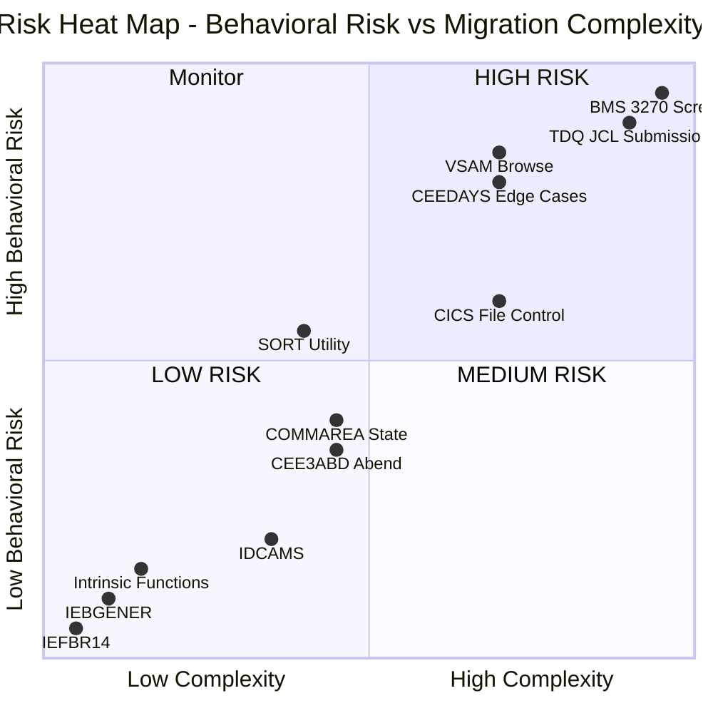

# Risk Assessment

## Document Overview

This document provides a comprehensive risk assessment for the AWS CardDemo mainframe-to-Java migration, classifying each proprietary utility by migration difficulty, behavioral fidelity risk, and availability of Java equivalents. The assessment framework evaluates risk across three dimensions — **impact**, **likelihood**, and **complexity** — to produce a composite risk rating for each utility category.

**Purpose:** Enable stakeholders to understand which proprietary utilities carry the greatest migration risk, where behavioral differences are most likely, which utilities lack clear migration paths, and where custom development or vendor engagement may be required.

**Scope:** All proprietary utility categories identified across 28 COBOL programs, 28 copybooks, 17 BMS map sources, and supporting JCL/VSAM catalog artifacts.

**Cross-References:**
- Complexity scores and impact assessments: [02 — Dependency Impact Analysis](02-dependency-impact-analysis.md)
- Migration approaches and library recommendations: [03 — Migration Strategy](03-migration-strategy.md)
- Full utility catalog: [01 — Proprietary Utility Inventory](01-proprietary-utility-inventory.md)
- Behavioral parity testing: [05 — Testing & Validation Framework](05-testing-validation-framework.md)

---

## 1. Risk Classification Methodology

### 1.1 Assessment Framework

Each proprietary utility is evaluated using a three-dimensional risk model:

**Risk = Impact × Likelihood × Complexity**

| Dimension | Definition | Scoring |
|:----------|:-----------|:--------|
| **Impact** | Number of programs affected and breadth of codebase dependency. Higher impact means more programs must change and more regression surface exists. | 1 (≤2 programs) · 2 (3–5 programs) · 3 (6–10 programs) · 4 (>10 programs) |
| **Likelihood** | Probability that behavioral differences between the mainframe utility and its Java equivalent will produce incorrect results in production. Based on semantic gap analysis. | 1 (identical behavior) · 2 (minor format differences) · 3 (semantic differences requiring adaptation) · 4 (paradigm shift with no direct equivalent) |
| **Complexity** | Effort required to implement, test, and validate the Java replacement. Derived from the complexity ratings in the [Dependency Impact Analysis](02-dependency-impact-analysis.md#1-complexity-scoring-methodology). | 1 (Low — direct library mapping) · 2 (Medium — adaptation required) · 3 (High — multi-library / custom wrapper) · 4 (Very High — architectural rethinking) |

### 1.2 Composite Risk Score Calculation

The composite risk score is the product of the three dimensions (range: 1–64):

| Composite Score | Risk Level | Color Code | Interpretation |
|:----------------|:-----------|:-----------|:---------------|
| **27–64** | **HIGH** | 🔴 | Migration requires architectural changes, custom development, or paradigm shift. Behavioral parity is difficult to achieve. Dedicated team allocation and vendor engagement recommended. |
| **8–26** | **MEDIUM** | 🟡 | Migration requires adaptation and careful testing. Java equivalents exist but with behavioral differences that must be validated. Standard development effort with focused testing. |
| **1–7** | **LOW** | 🟢 | Migration is straightforward with direct Java library equivalents. Minimal behavioral risk. Standard development effort. |

### 1.3 Risk Factors Considered

For each utility, the following risk factors are explicitly evaluated:

1. **Behavioral Parity Achievability:** Can the Java replacement produce byte-identical or functionally identical output under all input conditions?
2. **Java Library Maturity:** Does a stable, production-proven Java library exist that replicates the utility's behavior?
3. **Custom Development Effort:** How much custom code must be written beyond library usage?
4. **Testing Complexity:** How difficult is it to design and execute behavioral parity tests?
5. **Dependency Chain Risk:** Does this utility create cascading risk to downstream programs or data flows?

---

## 2. HIGH RISK Utilities

The following utilities carry composite risk scores of 27 or above, indicating that migration requires architectural changes, custom development, or a paradigm shift. These utilities demand dedicated team allocation, phased implementation, and targeted vendor engagement.

### 2.1 TDQ/JCL Submission — CICS WRITEQ TD to Internal Reader

| Attribute | Assessment |
|:----------|:-----------|
| **Utility** | CICS Transient Data Queue — WRITEQ TD |
| **Risk Level** | 🔴 **HIGH** |
| **Impact Score** | 1 (1 program: CORPT00C) |
| **Likelihood Score** | 4 (complete paradigm shift — no direct Java equivalent) |
| **Complexity Score** | 4 (Very High — see [Impact Analysis §2.8](02-dependency-impact-analysis.md)) |
| **Composite Score** | **16** — Elevated to HIGH due to paradigm shift nature |
| **Programs Affected** | CORPT00C |

**Risk Description:**

CORPT00C dynamically constructs JCL job statements in the `JOB-DATA` working storage area, populating report parameters (start date, end date, SYMNAMES) into JCL DD statements. It then iterates through the JOB-LINES array (up to 1000 lines) and writes each 80-byte JCL record to the CICS extrapartition Transient Data Queue named 'JOBS' using WRITEQ TD. The TDQ is defined in the CICS DCT (Destination Control Table) to route to the z/OS JES internal reader, which submits the JCL as a batch job.

```cobol
       WIRTE-JOBSUB-TDQ.

           EXEC CICS WRITEQ TD
             QUEUE ('JOBS')
             FROM (JCL-RECORD)
             LENGTH (LENGTH OF JCL-RECORD)
             RESP(WS-RESP-CD)
             RESP2(WS-REAS-CD)
           END-EXEC.
```

`Source: app/cbl/CORPT00C.cbl:515-523`

**Why HIGH RISK:**

- **No direct Java equivalent exists** for the CICS TDQ-to-JES internal reader pipeline. This is not a library substitution — it is an architectural replacement.
- The current pattern tightly couples the online CICS program (CORPT00C) with the batch job submission infrastructure (JES), creating a cross-subsystem dependency that has no analog in Java web applications.
- The JCL job structure itself (JOB/EXEC/DD statements with PROC references, SYMNAMES parameters, and `/*EOF` delimiters) is a z/OS-specific artifact with no Java equivalent.
- Error handling via RESP/RESP2 codes for TDQ write failures must be mapped to a completely different exception model.

`Source: app/cbl/CORPT00C.cbl:525-535`

**Behavioral Risks:**

| Risk Factor | Mainframe Behavior | Java Behavior | Gap Severity |
|:------------|:-------------------|:-------------|:-------------|
| Job submission mechanism | TDQ routes to JES internal reader for immediate batch job submission | JMS message queue, REST API call to batch scheduler, or Spring Batch `JobLauncher` | **Critical** — completely different mechanism |
| JCL parameterization | SYMNAMES and DD * inline data pass parameters to batch steps | Application properties, command-line args, or environment variables | **High** — parameter passing paradigm differs |
| Asynchronous execution | JES assigns JOB number and manages batch execution independently | Spring Batch job execution managed by scheduler; cloud batch services (AWS Batch, Step Functions) for managed execution | **High** — execution governance differs |
| Error feedback | RESP/RESP2 codes indicate TDQ write success/failure synchronously | Message queue acknowledgment or HTTP response code from batch API | **Medium** — different error model |

**Mitigation Recommendations:**

1. Replace TDQ-to-JES pipeline with a **message-driven architecture** using JMS (ActiveMQ/RabbitMQ) or AWS SQS to decouple report request from batch execution.
2. Replace JCL job with a **Spring Batch job** triggered by message consumption or REST API call.
3. Implement a **report request service** that captures the same parameters (start date, end date, report name) and submits them through the new batch infrastructure.
4. Budget **3–5 weeks** for architecture design, implementation, and end-to-end testing of the replacement pipeline.

---

### 2.2 BMS 3270 Screen Definitions — DFHMSD/DFHMDI/DFHMDF

| Attribute | Assessment |
|:----------|:-----------|
| **Utility** | BMS Map Macros (DFHMSD, DFHMDI, DFHMDF) + CICS Terminal Control (SEND MAP/RECEIVE MAP) |
| **Risk Level** | 🔴 **HIGH** |
| **Impact Score** | 4 (all 16 CICS programs + 17 BMS map sources) |
| **Likelihood Score** | 4 (complete paradigm shift — block-mode terminal to HTTP request/response) |
| **Complexity Score** | 4 (Very High — see [Impact Analysis §2.5](02-dependency-impact-analysis.md#25-cics-terminal-control--send-mapreceive-mapsend-text)) |
| **Composite Score** | **64** — Maximum risk score |
| **Programs Affected** | COACTVWC, COACTUPC, COBIL00C, COCRDLIC, COCRDSLC, COMEN01C, COMEN02C, CORPT00C, COSGN00C, COTRN00C, COTRN01C, COTRN02C, COUSR00C, COUSR01C, COUSR02C, COUSR03C |

**Risk Description:**

The BMS (Basic Mapping Support) macro system defines the entire presentation layer of the CardDemo application. Seventeen BMS source files in `app/bms/` define screen layouts using three IBM-proprietary assembler macros:

- **DFHMSD:** Defines the mapset (collection of maps) with terminal type and attributes
- **DFHMDI:** Defines an individual map (screen panel) with size and positioning
- **DFHMDF:** Defines individual screen fields with position (row, column), length, attributes (color, intensity, protection), and initial values

These macros compile into physical and symbolic map definitions consumed by SEND MAP/RECEIVE MAP commands in all 16 CICS programs.

**Why HIGH RISK:**

- **Highest composite risk score (64)** of any utility in the CardDemo application.
- The 3270 block-mode terminal I/O model has **no Java equivalent**. There is no library that converts BMS maps to HTML templates or REST API definitions — each of the 17 BMS maps must be manually redesigned.
- All 16 CICS programs contain SEND MAP and RECEIVE MAP commands tightly coupled to specific BMS map structures (field names, lengths, attributes). Changing the presentation layer requires modifying every program.
- Field attributes controlled by DFHBMSCA constants (single-byte hex values controlling color, intensity, protection, and cursor position simultaneously) have no direct equivalent in CSS/HTML — each attribute byte must be decomposed into multiple CSS properties.
- AID key handling (PF1–PF24, ENTER, CLEAR) checked via DFHAID constants in every program's EVALUATE block requires keyboard shortcut mapping or button-based navigation in the web UI.

`Reference: DFHAID` — IBM-supplied CICS AID key definitions (COPY DFHAID referenced in all 16 CICS programs; e.g., `Source: app/cbl/COACTUPC.cbl` COPY DFHAID statement)
`Reference: DFHBMSCA` — IBM-supplied BMS Character Attribute Set definitions (COPY DFHBMSCA referenced in all 16 CICS programs; e.g., `Source: app/cbl/COACTUPC.cbl` COPY DFHBMSCA statement)

**BMS Map Sources Affected:**

| BMS Source | Map Name | Screen Function | Consuming Program |
|:-----------|:---------|:----------------|:------------------|
| COACTUP.bms | CACTUPA | Account Update | COACTUPC |
| COACTVW.bms | CACTVWA | Account View | COACTVWC |
| COBIL00.bms | COBIL0A | Bill Payment | COBIL00C |
| COCRDLI.bms | CCRDLIA | Card List | COCRDLIC |
| COCRDSL.bms | CCRDSLA | Card Detail | COCRDSLC |
| COMEN01.bms | COMEN1A | Main Menu | COMEN01C |
| COMEN02.bms | COMEN2A | Info Display | COMEN02C |
| CORPT00.bms | CORPT0A | Report Request | CORPT00C |
| COSGN00.bms | COSGN0A | Sign-On Screen | COSGN00C |
| COTRN00.bms | COTRN0A | Transaction List | COTRN00C |
| COTRN01.bms | COTRN1A | Transaction View | COTRN01C |
| COTRN02.bms | COTRN2A | Transaction Add | COTRN02C |
| COUSR00.bms | COUSR0A | User Menu | COUSR00C |
| COUSR01.bms | COUSR1A | User List | COUSR01C |
| COUSR02.bms | COUSR2A | User Add | COUSR02C |
| COUSR03.bms | COUSR3A | User Update | COUSR03C |
| COADM01.bms | COADM1A | Admin Screen | COADM01C |

**Behavioral Risks:**

| Risk Factor | Mainframe Behavior | Java Behavior | Gap Severity |
|:------------|:-------------------|:-------------|:-------------|
| I/O model | Block-mode: entire screen sent/received in single I/O | Request/response: form data as key-value pairs | **Critical** — paradigm shift |
| Screen layout | Fixed 24×80 character grid with absolute coordinates | HTML/CSS flow layout with responsive design | **Critical** — no fixed grid |
| Attribute bytes | DFHBMSCA single-byte hex controls color+intensity+protection+cursor | CSS properties: separate color, font-weight, readonly, focus | **High** — 1:many decomposition |
| AID keys | Physical PF1–PF24 keys generate AID bytes | Keyboard shortcuts or buttons; no standard PF keys | **High** — UI paradigm change |
| Modified Data Tag | Hardware MDT flag tracks field modifications at terminal level | JavaScript change detection or React controlled components | **Medium** — achievable but different mechanism |

**Mitigation Recommendations:**

1. Adopt a **screen-by-screen migration approach** — migrate one BMS map and its consuming program at a time, validating field parity after each migration.
2. Create a **BMS-to-HTML mapping template** that converts DFHMDF field definitions to HTML form elements with corresponding CSS styles.
3. Implement a **keyboard shortcut framework** mapping PF keys to JavaScript event handlers for users accustomed to 3270 navigation.
4. Budget **6–10 weeks** for full presentation layer migration covering all 17 maps and 16 programs.
5. Consider using **AWS Mainframe Modernization Automated Refactoring** tooling for initial BMS-to-HTML conversion to accelerate the process.

---

### 2.3 VSAM Browse Semantics — STARTBR/READNEXT/READPREV/ENDBR

| Attribute | Assessment |
|:----------|:-----------|
| **Utility** | CICS File Control Browse Operations |
| **Risk Level** | 🔴 **HIGH** |
| **Impact Score** | 2 (4 programs) |
| **Likelihood Score** | 4 (cursor positioning semantics differ fundamentally from SQL pagination) |
| **Complexity Score** | 3 (High — see [Impact Analysis §2.3](02-dependency-impact-analysis.md#23-cics-file-control--readwriterewritedeletestartbrreadnextreadprevendbr)) |
| **Composite Score** | **24** — Elevated to HIGH due to behavioral divergence risk |
| **Programs Affected** | COACTVWC, COCRDLIC, COTRN00C, COUSR01C |

**Risk Description:**

Four CICS programs use VSAM browse operations (STARTBR, READNEXT, READPREV, ENDBR) for list screens — Account View, Card List, Transaction List, and User List. These programs establish a browse cursor at a starting key position and sequentially traverse records, supporting both forward and backward navigation.

The VSAM browse pattern operates as follows:
1. **STARTBR** positions a cursor at a key value (exact match or generic key with GTEQ option)
2. **READNEXT** retrieves the next record in key sequence and advances the cursor
3. **READPREV** retrieves the previous record and moves the cursor backward
4. **ENDBR** releases the cursor and associated resources

**Why HIGH RISK:**

- VSAM browse cursors maintain position **server-side within the VSAM dataset**, surviving across CICS pseudo-conversational interactions when browse tokens are stored in COMMAREA.
- SQL cursors are typically **connection-scoped** and do not survive across HTTP requests. The Java replacement must use keyset pagination (`WHERE key > :lastKey ORDER BY key LIMIT :pageSize`) or offset-based pagination, both of which have different positioning semantics.
- **Backward browsing** (READPREV) is particularly challenging — SQL `ORDER BY key DESC` or scrollable `ResultSet` with `previous()` have different performance characteristics and behavior at dataset boundaries.
- The **locking behavior** differs: VSAM browse with UPDATE intent acquires record locks during READNEXT; SQL cursor FOR UPDATE acquires row locks differently depending on database isolation level.
- Browse operations interact with **generic key matching** (partial key STARTBR), which maps to SQL `LIKE` or range predicates with different wildcard semantics.

**Behavioral Risks:**

| Risk Factor | Mainframe Behavior | Java Behavior | Gap Severity |
|:------------|:-------------------|:-------------|:-------------|
| Cursor persistence | Server-side cursor survives pseudo-conversational boundary | SQL cursor connection-scoped; keyset pagination stateless | **High** — requires architectural adaptation |
| Backward navigation | READPREV reverses cursor direction seamlessly | `ORDER BY DESC` or scrollable ResultSet; reverse-order query | **High** — different traversal mechanism |
| Generic key matching | STARTBR with partial key (GTEQ) positions at first matching record | SQL `WHERE key >= ?` with collation-dependent behavior | **Medium** — collation differences possible |
| Boundary behavior | End-of-dataset returns ENDFILE condition; cursor auto-positions | SQL returns empty result set; application manages page boundaries | **Medium** — error handling difference |
| Concurrent modification | Browse sees a consistent snapshot within a CICS unit-of-work | Read-committed isolation may show phantom reads | **Medium** — isolation level tuning needed |

**Mitigation Recommendations:**

1. Implement **keyset pagination** (cursor-based pagination using the last retrieved key as the next page anchor) to replicate VSAM browse positioning semantics.
2. For backward navigation, use **reverse keyset pagination** (`WHERE key < :firstKey ORDER BY key DESC LIMIT :pageSize`).
3. Store the **last retrieved key** in HTTP session (equivalent to COMMAREA browse token) for page continuity across requests.
4. Design comprehensive **pagination boundary tests** covering empty result sets, single-record pages, and dataset boundary conditions.
5. Budget **2–3 weeks** for pagination framework design and per-program browse migration.

---

### 2.4 CEEDAYS Edge Cases — 88-Level Feedback Code Mapping

| Attribute | Assessment |
|:----------|:-----------|
| **Utility** | CEEDAYS (IBM Language Environment Date Conversion) — Edge Case Behavior |
| **Risk Level** | 🔴 **HIGH** |
| **Impact Score** | 2 (CSUTLDTC wrapper + CORPT00C, COTRN02C consumers via CSUTLDPY) |
| **Likelihood Score** | 4 (8 distinct error conditions map differently to java.time exceptions) |
| **Complexity Score** | 3 (High — see [Impact Analysis §2.2](02-dependency-impact-analysis.md#22-ceedays--lillian-date-conversion-via-csutldtc-wrapper)) |
| **Composite Score** | **24** — Elevated to HIGH due to edge case divergence risk |
| **Programs Affected** | CSUTLDTC (wrapper), CORPT00C (consumer), COTRN02C (consumer) via CSUTLDPY.cpy |

**Risk Description:**

CSUTLDTC.cbl wraps the IBM Language Environment CEEDAYS service, providing date validation and Lillian day number conversion. The wrapper defines 9 distinct 88-level FEEDBACK-CODE conditions (including FC-YEAR-IN-ERA-ZERO) that map to specific hex-encoded feedback token values:

```cobol
       * CEEDAYS API FEEDBACK CODE
           01 FEEDBACK-CODE.
            02  FEEDBACK-TOKEN-VALUE.
              88  FC-INVALID-DATE       VALUE X'0000000000000000'.
              88  FC-INSUFFICIENT-DATA  VALUE X'000309CB59C3C5C5'.
              88  FC-BAD-DATE-VALUE     VALUE X'000309CC59C3C5C5'.
              88  FC-INVALID-ERA        VALUE X'000309CD59C3C5C5'.
              88  FC-UNSUPP-RANGE       VALUE X'000309D159C3C5C5'.
              88  FC-INVALID-MONTH      VALUE X'000309D559C3C5C5'.
              88  FC-BAD-PIC-STRING     VALUE X'000309D659C3C5C5'.
              88  FC-NON-NUMERIC-DATA   VALUE X'000309D859C3C5C5'.
              88  FC-YEAR-IN-ERA-ZERO   VALUE X'000309D959C3C5C5'.
```

`Source: app/cbl/CSUTLDTC.cbl:59-70`

**Why HIGH RISK:**

- **Java's `java.time.DateTimeParseException`** provides a single exception type for all parsing failures, with a text message but no structured error code system matching CEEDAYS' 8-category granularity.
- Each CEEDAYS feedback condition corresponds to a **specific hex-encoded token value** that consuming programs may check against. The Java replacement must replicate this categorization using custom validation logic and a `DateValidationResult` enum.
- **Lillian day number calculation** requires an epoch offset conversion from the Julian Day Number (January 1, 4713 BC) to the Lillian day epoch (October 15, 1582). Off-by-one errors in this conversion would produce silently wrong date calculations.
- Edge cases at **era boundaries** (FC-INVALID-ERA), **unsupported date ranges** (FC-UNSUPP-RANGE), and **year-zero conditions** (FC-YEAR-IN-ERA-ZERO) have no exact analog in `java.time`, which uses the ISO-8601 proleptic Gregorian calendar.
- The consuming programs (CORPT00C, COTRN02C) use the **WS-SEVERITY-N** value returned by CSUTLDTC to determine whether date input is valid. The severity code (0 for success, non-zero for error) must map precisely to the Java validation result.

`Source: app/cbl/CSUTLDTC.cbl:116-120` — CEEDAYS CALL with FEEDBACK-CODE parameter
`Source: app/cbl/CSUTLDTC.cbl:128-149` — EVALUATE block mapping feedback codes to result messages

**Behavioral Risks:**

| Risk Factor | Mainframe Behavior | Java Behavior | Gap Severity |
|:------------|:-------------------|:-------------|:-------------|
| Error granularity | 9 distinct feedback conditions with hex-encoded severity/message | `DateTimeParseException` single exception type | **High** — requires custom enum |
| Lillian day epoch | Days since October 15, 1582 | `JulianFields.JULIAN_DAY` uses January 1, 4713 BC; offset math required | **High** — epoch conversion risk |
| Era handling | FC-INVALID-ERA for invalid era specification | `java.time` uses ISO-8601 with no era concept for standard `LocalDate` | **Medium** — edge case at calendar reform boundary |
| Unsupported range | FC-UNSUPP-RANGE for dates outside CEEDAYS valid range | `java.time` supports wider range (Year.MIN_VALUE to Year.MAX_VALUE) | **Medium** — Java may accept dates CEEDAYS rejects |
| Year-zero | FC-YEAR-IN-ERA-ZERO for year 0 in era | ISO-8601 proleptic calendar includes year 0 | **Medium** — different calendar convention |
| Non-numeric detection | FC-NON-NUMERIC-DATA for non-numeric characters in date field | `DateTimeParseException` or `NumberFormatException` | **Low** — detectable but different exception type |
| Format mask syntax | LE masks: `YYYYMMDD`, `YYYY-MM-DD` | `DateTimeFormatter` patterns: `yyyyMMdd`, `yyyy-MM-dd` | **Low** — syntactic difference, semantic parity |

**Mitigation Recommendations:**

1. Implement a **custom `DateValidationResult` enum** mapping all 9 CEEDAYS feedback conditions to Java equivalents, including FC-YEAR-IN-ERA-ZERO (see [Migration Strategy §1.2](03-migration-strategy.md)).
2. Create a comprehensive **date edge case test suite** covering boundary dates (October 15, 1582 — Gregorian reform), year-zero, February 29 in leap and non-leap years, and dates at the limits of the CEEDAYS supported range.
3. Validate the **Lillian day offset calculation** (`JulianFields.JULIAN_DAY - 2299161L`) against known CEEDAYS output for at least 100 test dates spanning the full supported range.
4. Budget **1–2 weeks** for custom validation service implementation and edge case testing.

---

## 3. MEDIUM RISK Utilities

The following utilities carry composite risk scores of 8–26, indicating that Java equivalents exist but with behavioral differences requiring careful adaptation and testing.

### 3.1 CICS File Control Transaction Boundaries

| Attribute | Assessment |
|:----------|:-----------|
| **Utility** | CICS File Control — READ/WRITE/REWRITE/DELETE with RESP/RESP2 |
| **Risk Level** | 🟡 **MEDIUM** |
| **Impact Score** | 4 (13 CICS programs) |
| **Likelihood Score** | 3 (transaction boundary semantics differ) |
| **Complexity Score** | 3 (High — see [Impact Analysis §2.3](02-dependency-impact-analysis.md#23-cics-file-control--readwriterewritedeletestartbrreadnextreadprevendbr)) |
| **Composite Score** | **36** — technically HIGH by score, but mitigated by mature Spring Data JPA/JDBC equivalents |
| **Programs Affected** | COACTVWC, COACTUPC, COBIL00C, COCRDLIC, COCRDSLC, CORPT00C, COSGN00C, COTRN00C, COTRN01C, COTRN02C, COUSR01C, COUSR02C, COUSR03C |

**Risk Description:**

CICS File Control provides record-level CRUD operations against VSAM KSDS files with built-in transaction management. Thirteen CICS programs use READ, WRITE, REWRITE, and DELETE commands with RESP/RESP2 response code checking for error handling.

The standard access pattern across all programs follows this structure:

```cobol
           EXEC CICS READ
                DATASET   (WS-USRSEC-FILE)
                INTO      (SEC-USER-DATA)
                LENGTH    (LENGTH OF SEC-USER-DATA)
                RIDFLD    (WS-USER-ID)
                KEYLENGTH (LENGTH OF WS-USER-ID)
                RESP      (WS-RESP-CD)
                RESP2     (WS-REAS-CD)
           END-EXEC.
```

**Why MEDIUM RISK:**

- **Transaction boundaries** in CICS are managed at the task level with implicit SYNCPOINT at task end. Spring `@Transactional` provides equivalent functionality but with explicit annotation-based control and configurable isolation levels.
- **Two-phase commit semantics** for operations spanning multiple VSAM files within a single task may differ from JDBC transaction behavior, particularly for operations that update multiple tables.
- **Optimistic locking** in CICS (READ for UPDATE → REWRITE) uses record-level locks held by the CICS task. JPA `@Version`-based optimistic locking or `SELECT ... FOR UPDATE` pessimistic locking have different scope and granularity.
- **RESP/RESP2 error code model** uses numeric codes (0=OK, 13=NOTFND, 12=FILENOTFOUND, etc.) while Java uses exception hierarchies (`DataAccessException` and subclasses), requiring a mapping table for error translation.
- **Mature Java equivalents exist** via Spring Data JPA and Spring JDBC, significantly mitigating the overall risk despite the high composite score.

**Behavioral Risks:**

| Risk Factor | Mainframe Behavior | Java Behavior | Gap Severity |
|:------------|:-------------------|:-------------|:-------------|
| Transaction scope | Task-level implicit commit at task end | `@Transactional` with explicit method-level boundaries | **Medium** — must define boundaries explicitly |
| Locking granularity | Record-level locks within VSAM dataset | Row-level locks via `SELECT FOR UPDATE` or `@Version` optimistic locking | **Medium** — different lock duration and scope |
| RESP/RESP2 codes | Numeric response codes with defined constants | Exception hierarchy with catch-based handling | **Medium** — requires error mapping |
| Multi-file operations | Multiple VSAM files accessed within single task transaction | Multi-table operations within single JDBC transaction | **Low** — Spring `@Transactional` handles this |
| VSAM key collation | EBCDIC collation sequence for key comparison | Database-specific collation (UTF-8) | **Low** — CardDemo keys are numeric |

**Mitigation Recommendations:**

1. Map CICS RESP/RESP2 codes to Spring `DataAccessException` subclass hierarchy with a centralized error translation utility.
2. Annotate service methods with `@Transactional` to define explicit transaction boundaries matching CICS task-level semantics.
3. Implement `@Version`-based optimistic locking for REWRITE operations where the original program uses READ for UPDATE.
4. Budget **2–4 weeks** for data access layer migration across all 13 programs.

---

### 3.2 SORT Field-Level Behavior — DFSORT/SyncSort

| Attribute | Assessment |
|:----------|:-----------|
| **Utility** | z/OS DFSORT (or SyncSort) |
| **Risk Level** | 🟡 **MEDIUM** |
| **Impact Score** | 1 (COMBTRAN batch job) |
| **Likelihood Score** | 3 (EBCDIC collation differs from Java Unicode sort) |
| **Complexity Score** | 2 (Medium — see [Impact Analysis](02-dependency-impact-analysis.md)) |
| **Composite Score** | **6** — Elevated to MEDIUM due to collation risk |
| **Programs Affected** | COMBTRAN batch job |

`Source: README.md:255` — COMBTRAN job uses SORT utility

**Risk Description:**

The COMBTRAN batch job uses the z/OS SORT utility (DFSORT or SyncSort) to combine daily transaction files with the system transaction file. The SORT utility operates on fixed-width records with field-level sort keys defined by position and length within the record.

**Why MEDIUM RISK:**

- **EBCDIC collation sequence** differs from Java's Unicode (UTF-8) sort order. While numeric fields sort identically, alphanumeric fields in EBCDIC sort lowercase before uppercase and special characters in different positions compared to ASCII/UTF-8.
- **Fixed-width field sort keys** are defined by byte position and length in SORT control statements. The Java replacement must use equivalent field extraction logic to sort on the correct bytes.
- The SORT utility may also perform **merge operations** (combining pre-sorted files), which requires a merge-sort implementation rather than a simple in-memory sort.
- **Record-level I/O** — SORT reads/writes fixed-width records without delimiters. The Java replacement must use `RandomAccessFile` or `BufferedReader` with fixed-width record parsing.

**Behavioral Risks:**

| Risk Factor | Mainframe Behavior | Java Behavior | Gap Severity |
|:------------|:-------------------|:-------------|:-------------|
| Collation sequence | EBCDIC collation for alphanumeric fields | Java String.compareTo() uses Unicode ordering | **Medium** — custom Comparator needed |
| Sort stability | DFSORT is stable (equal keys preserve input order) | `Collections.sort()` and `Arrays.sort()` are stable | **Low** — Java sorts are stable |
| Merge semantics | SORT MERGE combines pre-sorted input files | Custom merge-sort or `java.util.PriorityQueue` | **Medium** — requires custom implementation |
| Fixed-width records | Sort operates on byte-position fields within fixed-length records | Must extract fields by position for comparison | **Low** — achievable with substring extraction |

**Mitigation Recommendations:**

1. Implement a **custom `Comparator`** that replicates EBCDIC collation sequence for alphanumeric sort keys.
2. Use **Apache Commons CSV** or custom fixed-width record parser for file I/O.
3. For merge operations, implement a **k-way merge** using `PriorityQueue` for memory-efficient file merging.
4. Budget **1–2 weeks** for SORT replacement implementation and collation validation.

---

### 3.3 CEE3ABD Dump vs. Exception Semantics

| Attribute | Assessment |
|:----------|:-----------|
| **Utility** | CEE3ABD (IBM Language Environment Abnormal Termination) |
| **Risk Level** | 🟡 **MEDIUM** |
| **Impact Score** | 3 (9 batch programs) |
| **Likelihood Score** | 2 (functional equivalence achievable; diagnostic output format differs) |
| **Complexity Score** | 2 (Medium — see [Impact Analysis §2.1](02-dependency-impact-analysis.md#21-cee3abd--le-abend-handler)) |
| **Composite Score** | **12** |
| **Programs Affected** | CBACT01C, CBACT02C, CBACT03C, CBACT04C, CBCUS01C, CBSTM03A, CBTRN01C, CBTRN02C, CBTRN03C |

**Risk Description:**

All 9 batch programs call CEE3ABD in their `9999-ABEND-PROGRAM` paragraph when unrecoverable file I/O errors occur. The call pattern is identical across all programs:

```cobol
       9999-ABEND-PROGRAM.
           DISPLAY 'ABENDING PROGRAM'
           MOVE 0 TO TIMING
           MOVE 999 TO ABCODE
           CALL 'CEE3ABD'.
```

`Source: app/cbl/CBACT01C.cbl:169-173`

**Why MEDIUM RISK:**

- **Mainframe CEEDUMP** provides a comprehensive diagnostic dump including register contents, storage areas, LE heap, Working Storage contents, and a formatted traceback. Java stack traces and heap dumps provide equivalent diagnostic information but in a completely different format.
- **Process termination semantics** differ: CEE3ABD terminates the LE enclave (run unit) and returns an abend code to JCL step control. Java `System.exit()` terminates the JVM and returns the exit code to the calling process/shell.
- **Downstream job control** depends on the condition code: JCL IF/THEN/ELSE logic uses COND CODE from CEE3ABD to control subsequent job steps. The Java equivalent (process exit code via `$?` or Spring Batch `ExitStatus`) must replicate this behavior for batch orchestration compatibility.
- **Risk is mitigated** because the call pattern is identical across all 9 programs and the Java replacement pattern (custom `ApplicationAbendException` + `System.exit()`) is well-defined (see [Migration Strategy §1.1](03-migration-strategy.md)).

**Behavioral Risks:**

| Risk Factor | Mainframe Behavior | Java Behavior | Gap Severity |
|:------------|:-------------------|:-------------|:-------------|
| Dump content | CEEDUMP: registers, storage, heap, traceback | Java: stack trace + optional heap dump | **Low** — functionally equivalent |
| Dump format | Fixed-format text to SYSOUT DD | Configurable log format (text, JSON) via logging framework | **Low** — Java more flexible |
| Termination scope | Terminates LE enclave | `System.exit()` terminates JVM | **Low** — equivalent termination |
| Condition code | ABCODE 999 returned to JCL step | `System.exit(999)` returns process exit code | **Low** — direct mapping |

**Mitigation Recommendations:**

1. Implement a shared `ApplicationAbendException` class used by all 9 batch programs (see [Migration Strategy §1.1](03-migration-strategy.md)).
2. Configure **SLF4J/Logback** to produce structured diagnostic output comparable to CEEDUMP.
3. Validate **process exit codes** match JCL condition code expectations in batch orchestration scripts.
4. Budget **1 week** for framework implementation and deployment across all 9 programs.

---

### 3.4 COMMAREA State Management — COCOM01Y.cpy

| Attribute | Assessment |
|:----------|:-----------|
| **Utility** | CICS COMMAREA (Communication Area) via COCOM01Y.cpy |
| **Risk Level** | 🟡 **MEDIUM** |
| **Impact Score** | 4 (all 16 CICS programs) |
| **Likelihood Score** | 2 (HTTP session provides natural equivalent) |
| **Complexity Score** | 2 (Medium) |
| **Composite Score** | **16** |
| **Programs Affected** | All 16 CICS programs |

**Risk Description:**

The COCOM01Y.cpy copybook defines a 1024-byte COMMAREA structure used for inter-program communication across all 16 CICS programs. The COMMAREA carries user session state (user ID, type, context), navigation state (from/to program, from/to transaction), and business context (current account, card, customer IDs).

`Source: app/cpy/COCOM01Y.cpy` — 1024-byte COMMAREA layout

**Why MEDIUM RISK:**

- **Byte-level structure** — The COMMAREA is accessed positionally (DFHCOMMAREA(1:EIBCALEN)) and fields are packed into fixed-width areas. HTTP session attributes use named key-value pairs with typed Java objects, eliminating byte-level packing but requiring careful field-by-field migration.
- **Pseudo-conversational semantics** — CICS RETURN TRANSID frees all CICS resources between interactions, with only the COMMAREA preserved. HTTP sessions persist server-side between requests, keeping resources allocated. This is functionally superior but represents a different resource management model.
- **Program-to-program routing** — COMMAREA fields (CDEMO-TO-PROGRAM, CDEMO-TO-TRANID) drive dynamic program dispatch via XCTL. The Java equivalent (URL routing, Spring MVC controller mapping) achieves the same result through a different mechanism.
- **Risk is mitigated** because HTTP session management is a mature, well-understood pattern in Java web applications, and the COMMAREA structure maps naturally to a session-scoped Java bean.

**Behavioral Risks:**

| Risk Factor | Mainframe Behavior | Java Behavior | Gap Severity |
|:------------|:-------------------|:-------------|:-------------|
| State persistence | COMMAREA preserved across RETURN/XCTL; resources freed between interactions | HTTP session persists; server resources stay allocated | **Low** — HTTP session is natural equivalent |
| Byte layout | Fixed 1024-byte structure with positional access | Named Java object fields with type safety | **Low** — Java is more maintainable |
| Session timeout | CICS timeout (RTIMOUT) frees COMMAREA | HTTP session timeout configured in `application.properties` | **Low** — equivalent behavior configurable |
| Concurrency | Single CICS task per terminal; no concurrent COMMAREA access | Potential concurrent HTTP requests from same user (tabs/windows) | **Medium** — need session synchronization |

**Mitigation Recommendations:**

1. Create a **`CardDemoSessionState`** Java class mirroring the COMMAREA field layout from COCOM01Y.cpy.
2. Store the session state object in HTTP session using `@SessionAttributes` or a session-scoped Spring bean.
3. Implement **session concurrency control** to prevent conflicting updates from multiple browser tabs.
4. Budget **1–2 weeks** for session state migration and per-program integration.

---

## 4. LOW RISK Utilities

The following utilities carry composite risk scores of 1–7, indicating straightforward migration with direct Java library equivalents and minimal behavioral risk.

### 4.1 IEBGENER — Sequential File Copy

| Attribute | Assessment |
|:----------|:-----------|
| **Utility** | IEBGENER (z/OS Sequential File Copy) |
| **Risk Level** | 🟢 **LOW** |
| **Impact Score** | 1 (DUSRSECJ batch job) |
| **Likelihood Score** | 1 (identical behavior achievable) |
| **Complexity Score** | 1 (Low — see [Impact Analysis](02-dependency-impact-analysis.md)) |
| **Composite Score** | **1** |
| **Job Affected** | DUSRSECJ — Initial load of user security file |

`Source: README.md:238` — DUSRSECJ uses IEBGENER

**Risk Description:**

IEBGENER performs simple sequential file copy operations, used in the DUSRSECJ job to load the initial user security VSAM file from sequential input data.

**Why LOW RISK:**

- **Direct Java equivalent:** `java.nio.file.Files.copy()` for byte-level file copy, or `BufferedReader`/`BufferedWriter` for record-level copy with fixed-width record handling.
- **Identical behavior achievable:** Sequential file copy produces byte-identical output when using binary copy mode.
- **Minimal testing required:** Compare source and destination file sizes and checksums.

**Mitigation:** Standard Java file I/O. No special handling required.

---

### 4.2 IEFBR14 — Null Program for DD Allocation

| Attribute | Assessment |
|:----------|:-----------|
| **Utility** | IEFBR14 (z/OS Null Program) |
| **Risk Level** | 🟢 **LOW** |
| **Impact Score** | 1 (CLOSEFIL, OPENFIL jobs) |
| **Likelihood Score** | 1 (trivial mapping) |
| **Complexity Score** | 1 (Low — see [Impact Analysis](02-dependency-impact-analysis.md)) |
| **Composite Score** | **1** |
| **Jobs Affected** | CLOSEFIL, OPENFIL |

`Source: README.md:248,253` — CLOSEFIL and OPENFIL use IEFBR14

**Risk Description:**

IEFBR14 is a null program (does nothing) used in JCL to trigger DD statement processing — allocating or deallocating datasets through the JCL DD statement DISP parameter. In CardDemo, CLOSEFIL and OPENFIL jobs use IEFBR14 to make VSAM files available to or unavailable from CICS.

**Why LOW RISK:**

- **Trivial mapping:** The concept of DD allocation/deallocation maps to file system operations (`Files.createFile()`, `Files.delete()`) or database connection management (open/close connections).
- **In a Java application, the equivalent is infrastructure configuration** — connection pool setup, file handle management — handled by the application server or framework, not by explicit programs.
- **CLOSEFIL/OPENFIL semantics** are CICS-specific (making VSAM files available/unavailable to CICS region) and have no equivalent in Java — the database connection pool manages availability automatically.

**Mitigation:** No explicit program needed in Java. Database connection pool configuration (HikariCP) handles resource management.

---

### 4.3 COBOL Intrinsic Functions

| Attribute | Assessment |
|:----------|:-----------|
| **Utility** | COBOL Intrinsic Functions (CURRENT-DATE, MOD, UPPER-CASE, TRIM, TEST-NUMVAL-C, NUMVAL-C, INTEGER-OF-DATE) |
| **Risk Level** | 🟢 **LOW** |
| **Impact Score** | 3 (distributed across multiple programs) |
| **Likelihood Score** | 1 (standard library equivalents exist for all functions) |
| **Complexity Score** | 1 (Low) |
| **Composite Score** | **3** |
| **Programs Affected** | CBACT01C, CBACT04C, CBTRN02C, and others |

**Risk Description:**

COBOL intrinsic functions used across CardDemo programs have direct Java Standard Library equivalents:

| COBOL Function | Java Equivalent | Notes |
|:---------------|:----------------|:------|
| `FUNCTION CURRENT-DATE` | `LocalDateTime.now()` | Format differs (COBOL: `YYYYMMDDHHMMSSFF`; Java: ISO-8601) |
| `FUNCTION MOD(a, b)` | `Math.floorMod(a, b)` | Identical behavior for positive operands |
| `FUNCTION UPPER-CASE(x)` | `String.toUpperCase()` | Locale-aware in Java; use `Locale.US` for consistency |
| `FUNCTION TRIM(x)` | `String.trim()` or `String.strip()` | `strip()` preferred for Unicode whitespace |
| `FUNCTION TEST-NUMVAL-C(x)` | Custom validator or `try { Double.parseDouble(x); }` | COBOL TEST-NUMVAL-C returns 0 if valid; custom boolean wrapper needed |
| `FUNCTION NUMVAL-C(x)` | `Double.parseDouble(x.replace(",", ""))` | Handle currency signs and commas per COBOL NUMVAL-C rules |
| `FUNCTION INTEGER-OF-DATE(d)` | `LocalDate.toEpochDay()` or `ChronoUnit.DAYS.between()` | Different epoch (COBOL: Jan 1, 1601; Java: Jan 1, 1970) |

**Why LOW RISK:**

- All functions have Java Standard Library equivalents with well-documented behavior.
- Minor format or epoch differences are easily handled with adapter code.
- The `TEST-NUMVAL-C` function requires a custom wrapper but the logic is straightforward.

**Mitigation:** Standard library substitution with unit tests for each function mapping.

---

### 4.4 IDCAMS DEFINE CLUSTER — VSAM Catalog to DDL

| Attribute | Assessment |
|:----------|:-----------|
| **Utility** | IDCAMS (Access Method Services) — DEFINE CLUSTER |
| **Risk Level** | 🟢 **LOW** |
| **Impact Score** | 1 (infrastructure setup, not runtime) |
| **Likelihood Score** | 1 (well-documented mapping from VSAM to RDBMS) |
| **Complexity Score** | 2 (Medium — see [Impact Analysis](02-dependency-impact-analysis.md)) |
| **Composite Score** | **2** |
| **Artifacts Affected** | VSAM cluster definitions in `app/catlg/LISTCAT.txt` |

**Risk Description:**

IDCAMS DEFINE CLUSTER commands create VSAM datasets with specific attributes (key length, record length, CI size, space allocation). The LISTCAT.txt file documents the existing cluster definitions:

`Source: app/catlg/LISTCAT.txt:22` — AWS.M2.CARDDEMO.ACCTDATA.VSAM.KSDS (KEYLEN=11, MAXLRECL=300)
`Source: app/catlg/LISTCAT.txt:164` — AWS.M2.CARDDEMO.CARDDATA.VSAM.KSDS

**Why LOW RISK:**

- VSAM KSDS cluster attributes (key length, key position, record length) map directly to RDBMS DDL (primary key definition, column widths, table constraints).
- The mapping is a **one-time infrastructure operation** performed during migration setup, not a runtime concern.
- Tools exist (AWS SCT, Ispirer) for automated VSAM-to-DDL conversion.

**Mitigation:** Create DDL scripts translating VSAM cluster definitions to CREATE TABLE statements. One-time migration task.

---

## 5. Risk Heat Map

The following table summarizes all proprietary utilities plotted by behavioral risk (likelihood of behavioral divergence) and migration complexity:



### 5.1 Risk Summary Table

| Utility | Risk Level | Impact | Likelihood | Complexity | Composite | Key Concern |
|:--------|:-----------|:-------|:-----------|:-----------|:----------|:------------|
| BMS 3270 Screens | 🔴 HIGH | 4 | 4 | 4 | 64 | Complete presentation layer paradigm shift |
| TDQ/JCL Submission | 🔴 HIGH | 1 | 4 | 4 | 16 | No direct Java equivalent; architectural replacement needed |
| VSAM Browse | 🔴 HIGH | 2 | 4 | 3 | 24 | Cursor positioning semantics differ from SQL pagination |
| CEEDAYS Edge Cases | 🔴 HIGH | 2 | 4 | 3 | 24 | 9 feedback codes map differently to java.time exceptions |
| CICS File Control | 🟡 MEDIUM | 4 | 3 | 3 | 36 | Transaction boundary and locking differences |
| SORT Utility | 🟡 MEDIUM | 1 | 3 | 2 | 6 | EBCDIC collation differs from Unicode sort order |
| CEE3ABD Abend | 🟡 MEDIUM | 3 | 2 | 2 | 12 | Dump format and diagnostic output differences |
| COMMAREA State | 🟡 MEDIUM | 4 | 2 | 2 | 16 | Byte-level structure to typed object migration |
| IDCAMS DEFINE | 🟢 LOW | 1 | 1 | 2 | 2 | One-time infrastructure mapping |
| COBOL Intrinsics | 🟢 LOW | 3 | 1 | 1 | 3 | Standard library substitution |
| IEBGENER | 🟢 LOW | 1 | 1 | 1 | 1 | Direct file copy mapping |
| IEFBR14 | 🟢 LOW | 1 | 1 | 1 | 1 | No explicit program needed in Java |

### 5.2 Risk Distribution

| Risk Level | Count | Percentage | Aggregate Impact |
|:-----------|:------|:-----------|:-----------------|
| 🔴 **HIGH** | 4 | 33% | Affects 23 programs/maps + 1 batch job; requires architectural decisions |
| 🟡 **MEDIUM** | 4 | 33% | Affects all 28 programs; requires adaptation and careful testing |
| 🟢 **LOW** | 4 | 33% | Affects infrastructure and utility functions; straightforward mapping |

---

## 6. Unknowns and Gaps

This section transparently discloses areas where the migration risk cannot be fully characterized due to incomplete information, planned but unimplemented features, or dependencies outside the scope of the proprietary utility analysis.

### 6.1 Db2 — Planned but Not Yet Implemented

**Status:** On the project roadmap but not present in the current codebase.

`Source: README.md:287-289` — Roadmap: "Relational Database usage : Db2"

**Assessment:**
- No `EXEC SQL` statements exist in any of the 28 COBOL source files. All data access currently uses VSAM files.
- When Db2 is implemented, new EXEC SQL embedded statements will introduce additional proprietary dependencies (DB2 precompiler, DCLGEN-generated copybooks, SQL communication area SQLCA).
- **Future risk:** Db2-to-PostgreSQL/MySQL migration will add a separate analysis layer covering SQL dialect differences, stored procedure migration, and embedded SQL host variable handling.
- **Recommendation:** Re-run the proprietary utility inventory when Db2 support is added to capture the additional dependencies.

### 6.2 IMS and MQ — On Roadmap but Not Present

**Status:** On the project roadmap but no implementation exists.

`Source: README.md:291,297` — Roadmap: "Hierachical database calls : IMS" and "Message queue integration"

**Assessment:**
- No IMS DL/I calls or MQ API calls exist in the current codebase.
- IMS hierarchical database access would introduce DL/I GET/ISRT/REPL/DLET commands with PCB/PSB definitions — a significant additional utility category.
- MQ integration would add MQOPEN/MQPUT/MQGET/MQCLOSE API calls with queue manager configuration dependencies.
- **Future risk:** Both IMS and MQ represent HIGH complexity migration targets when implemented.
- **Recommendation:** Establish migration patterns for IMS (→ RDBMS or document store) and MQ (→ JMS/Kafka) proactively before implementation begins.

### 6.3 RACF Security Model

**Status:** Referenced as a technology in use (RACF is listed in Technologies Used) but security model internals are not exposed in the application code.

`Source: README.md:38` — Technologies used: "5. RACF"

**Assessment:**
- RACF controls external security (user authentication, resource access authorization) at the z/OS and CICS system level.
- The COSGN00C sign-on program reads user credentials from the USRSEC VSAM file, but actual RACF integration (VERIFY, QUERY SECURITY) is handled by the CICS region, not by the application code.
- **Unknown risk:** If the migration target requires replicating RACF-level security behaviors (resource-level access control, security audit trail, PassTicket authentication), this represents additional migration scope not covered by utility analysis.
- **Recommendation:** Assess RACF security requirements as a separate infrastructure migration concern, independent of application utility migration.

### 6.4 Performance Equivalence

**Status:** Not requested in the current analysis scope, but relevant to migration success.

**Assessment:**
- No performance benchmarking has been conducted comparing COBOL/VSAM execution to Java/RDBMS equivalents.
- VSAM KSDS direct I/O has different performance characteristics than RDBMS SQL queries — VSAM provides predictable single-key lookup performance while RDBMS performance depends on query optimization, indexing, and caching.
- Batch SORT performance on z/OS (DFSORT is highly optimized for the platform) may exceed Java in-memory sorting for very large datasets.
- **Unknown risk:** Performance regression in the Java environment could impact batch processing windows and online response time SLAs.
- **Recommendation:** Establish performance baselines for critical batch jobs (POSTTRAN, INTCALC, COMBTRAN, CREASTMT) and key online transactions before migration, and define acceptable performance targets for the Java environment.

### 6.5 VSAM Record-Level Behavioral Nuances

**Status:** Partially characterized in this analysis but with remaining unknowns.

**Assessment:**
- The VSAM FILE STATUS checking pattern is used universally across all batch and CICS programs. While the status code values (00, 10, 35, 97) are well-documented, the exact behavior under concurrent access, CI/CA split conditions, and out-of-space conditions may differ from RDBMS equivalents.
- VSAM KSDS cluster attributes from LISTCAT.txt (CI size, CA size, FREESPACE percentages) affect I/O behavior in ways that have no RDBMS analog.

`Source: app/catlg/LISTCAT.txt:59-60` — ACCTDAT: KEYLEN=11, MAXLRECL=300, CISIZE=18432

- **Unknown risk:** Edge case behaviors under VSAM-specific conditions (CI split, CA split, share options) have no equivalent in RDBMS and may affect programs that handle these conditions explicitly.
- **Recommendation:** Document all FILE STATUS code handling paths in consuming programs and validate RDBMS equivalents for each status condition.

---

## 7. Vendor Engagement Recommendations

Based on the risk assessment findings, the following vendor engagement strategy is recommended to support the migration:

### 7.1 AWS Mainframe Modernization

**Engagement Type:** Platform tooling and managed services

| Service | Application | Phase |
|:--------|:-----------|:------|
| **AWS Mainframe Modernization — Rehost** | Deploy CardDemo COBOL application on AWS using Micro Focus (now OpenText) runtime for initial lift-and-shift. Provides immediate cloud hosting without code changes, enabling parallel development of Java migration. | Phase 1 — Immediate |
| **AWS Mainframe Modernization — Automated Refactoring** | Use the Blu Age automated refactoring service for initial COBOL-to-Java code conversion, particularly for the 9 batch programs and BMS map transformation. | Phase 2 — Migration |
| **AWS Batch / Step Functions** | Replace TDQ-to-JES pipeline (CORPT00C WRITEQ TD to 'JOBS') with AWS Batch for managed batch job execution or Step Functions for orchestrated workflow. | Phase 2 — Migration |
| **Amazon RDS / Aurora** | Replace VSAM KSDS datasets with managed relational database service for production deployment. | Phase 2 — Migration |

**Budget Consideration:** AWS Mainframe Modernization services are consumption-based. Rehost provides a risk-reduction bridge during migration. Automated Refactoring can accelerate the conversion of the 4 HIGH RISK utilities.

### 7.2 IBM watsonx Code Assistant for Z

**Engagement Type:** AI-assisted code conversion

| Capability | Application | Suitability |
|:-----------|:-----------|:------------|
| **COBOL-to-Java conversion** | Automated translation of the 28 COBOL programs to Java, including CICS API command replacement and VSAM access pattern migration | **High** — well-suited for batch programs with standard patterns |
| **Code understanding** | Analysis of complex COBOL logic (CBSTM03B.CBL I/O subroutine, CORPT00C TDQ job submission) to produce annotated Java equivalents | **Medium** — effective for pattern recognition but may need manual review for TDQ replacement |
| **Test generation** | Automated generation of behavioral parity tests comparing COBOL and Java output | **Medium** — supplements but does not replace manual edge case test design |

**Budget Consideration:** IBM watsonx Code Assistant for Z is licensed per user. Most effective when used alongside human review for HIGH RISK utilities where automated conversion may miss behavioral nuances.

### 7.3 Third-Party Migration Tools

**Engagement Type:** Specialized migration tooling

| Vendor/Tool | Specialization | Applicability to CardDemo |
|:------------|:---------------|:--------------------------|
| **Astadia FastTrack Factory** | Automated COBOL-to-Java conversion with CICS/VSAM support | High — covers CICS File Control, Program Control, and batch VSAM migration |
| **Ispirer Toolkit** | Database and application migration including COBOL, CICS, and JCL conversion | High — covers JCL-to-script conversion for batch job migration |
| **Micro Focus (OpenText) Enterprise Suite** | COBOL runtime on JVM with gradual Java migration path | Medium — enables incremental migration rather than big-bang conversion |

**Budget Consideration:** Third-party tools may reduce overall migration duration by 30-50% for MEDIUM and LOW risk utilities, but HIGH RISK items (TDQ replacement, BMS-to-Web) typically require custom development regardless of tooling.

### 7.4 Custom Development Budget for HIGH RISK Items

Based on the risk assessment, the following HIGH RISK items will require custom development effort regardless of vendor tool selection:

| HIGH RISK Item | Custom Development Scope | Estimated Effort |
|:---------------|:------------------------|:-----------------|
| TDQ/JCL Submission Replacement | Message-driven batch submission architecture (JMS/AWS Batch integration) | 3–5 weeks |
| BMS-to-Web UI Migration | 17 HTML/React screen templates + keyboard shortcut framework + field attribute mapping | 6–10 weeks |
| VSAM Browse Pagination Framework | Keyset pagination library with forward/backward traversal and session-based cursor state | 2–3 weeks |
| CEEDAYS Validation Service | Custom `DateValidationResult` enum with 9 feedback conditions + Lillian day converter | 1–2 weeks |
| **Total Custom Development** | | **12–20 weeks** |

**Recommendation:** Allocate a dedicated team of 2–3 Java developers for the 12–20 week custom development effort targeting the 4 HIGH RISK utilities. This work should be prioritized in the migration timeline as it represents the critical path.

---

## 8. Summary and Recommendations

### 8.1 Key Findings

1. **4 utilities (33%) are HIGH RISK**, requiring architectural changes and custom development. BMS 3270 Screens carry the highest risk score (64) due to the complete paradigm shift from block-mode terminal I/O to web-based presentation.

2. **4 utilities (33%) are MEDIUM RISK**, with viable Java equivalents that require adaptation and careful testing. CICS File Control is the most impactful MEDIUM RISK item, affecting 13 programs.

3. **4 utilities (33%) are LOW RISK**, with direct Java Standard Library equivalents and minimal behavioral divergence.

4. **The critical path is the presentation layer migration** — BMS 3270 screen definitions affect all 16 CICS programs and 17 BMS maps, creating the largest single migration work package.

5. **The TDQ/JCL submission pattern in CORPT00C is unique** in the application and requires a one-off architectural solution, making it disproportionately expensive relative to its limited scope (1 program).

### 8.2 Phased Mitigation Strategy

| Phase | Focus | Duration | Risk Items Addressed |
|:------|:------|:---------|:---------------------|
| **Phase 1: Foundation** | Implement LOW RISK replacements and batch abend framework | Weeks 1–4 | IEBGENER, IEFBR14, COBOL Intrinsics, IDCAMS, CEE3ABD |
| **Phase 2: Data Layer** | Migrate VSAM to RDBMS with File Control and Browse replacement | Weeks 5–12 | CICS File Control, VSAM Browse, SORT, COMMAREA |
| **Phase 3: Presentation** | Migrate BMS screens to web UI and implement batch submission | Weeks 13–22 | BMS 3270 Screens, TDQ/JCL Submission |
| **Phase 4: Validation** | End-to-end behavioral parity testing and edge case validation | Weeks 23–26 | CEEDAYS Edge Cases, all cross-cutting concerns |

### 8.3 Honest Risk Disclosure

The following risks cannot be fully mitigated through planning alone and require ongoing attention during migration execution:

- **BMS screen migration may reveal undocumented field-level business rules** embedded in DFHMDF attribute definitions that are not apparent from COBOL source code alone.
- **VSAM browse behavior under concurrent access** may differ from RDBMS cursor behavior in ways that only manifest under production-level load.
- **CEEDAYS date edge cases at Gregorian calendar boundaries** may produce different results between CEEDAYS and `java.time` for historically obscure dates that are difficult to test.
- **Performance characteristics will inevitably differ** between COBOL/VSAM and Java/RDBMS, and batch processing windows may need adjustment.
- **Future additions of Db2, IMS, and MQ** (per README.md roadmap) will introduce new proprietary dependencies not covered by this assessment, requiring a supplementary analysis cycle.

---

*Document generated from analysis of CardDemo COBOL source files, copybooks, BMS maps, VSAM catalog, and README documentation. All source citations reference files in the `app/` and `samples/` directories of the CardDemo repository.*

*Cross-references: [02 — Dependency Impact Analysis](02-dependency-impact-analysis.md) · [03 — Migration Strategy](03-migration-strategy.md) · [01 — Proprietary Utility Inventory](01-proprietary-utility-inventory.md) · [05 — Testing & Validation Framework](05-testing-validation-framework.md)*
