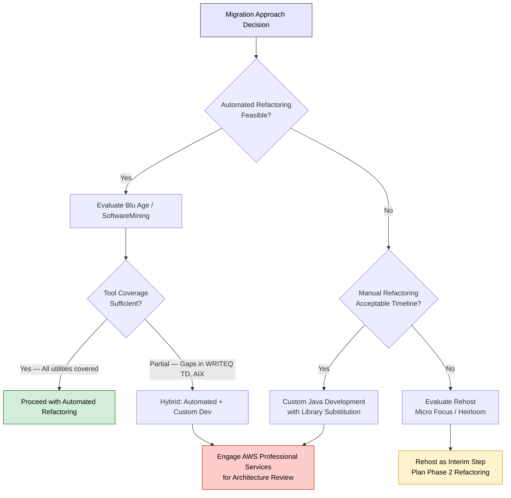

# 5. Risk Assessment — Proprietary Utility Migration Risk Classification

[← Previous: Migration Strategy](./04-migration-strategy-per-utility.md) | [Executive Summary](./00-executive-summary.md) | [Next: Testing & Validation →](./06-testing-validation-framework.md)

---

## 5.1 Overview

This document presents a comprehensive risk assessment for every proprietary IBM mainframe utility identified in the AWS CardDemo application. Each utility is classified across three risk dimensions — **Behavioral Equivalence Confidence**, **Documentation Availability**, and **Implementation Complexity** — and assigned an overall risk level of **HIGH**, **MEDIUM**, or **LOW**. Dedicated mitigation narratives are provided for all HIGH RISK items, along with documentation gap analysis, custom development requirements, and vendor engagement recommendations.

The risk classifications in this document are derived from:
- The proprietary utility inventory in [Section 01](./01-proprietary-utility-inventory.md)
- External documentation research findings in [Section 02](./02-external-documentation-research.md)
- Dependency impact analysis in [Section 03](./03-dependency-impact-analysis.md)

---

## 5.2 Risk Classification Methodology

### 5.2.1 Risk Dimensions

Each proprietary utility is evaluated across three independent risk dimensions, each rated **HIGH**, **MEDIUM**, or **LOW**:

| Dimension | Description | HIGH | MEDIUM | LOW |
|-----------|-------------|------|--------|-----|
| **Behavioral Equivalence Confidence** | How closely a Java implementation can replicate the mainframe utility's exact behavior | Significant behavioral gaps; edge cases undocumented or platform-dependent | Mostly equivalent but with known edge cases requiring validation | Direct 1:1 mapping with well-understood semantics |
| **Documentation Availability** | Coverage and quality of IBM official documentation and community migration guides | Sparse or missing IBM documentation; no community migration examples | Adequate IBM reference docs but limited migration-specific guidance | Comprehensive IBM documentation with proven community migration patterns |
| **Implementation Complexity** | Effort required to develop, test, and validate the Java equivalent | Requires architectural redesign, custom framework development, or cross-cutting changes across many modules | Moderate development effort with standard library usage but non-trivial testing requirements | Straightforward library substitution with minimal custom code |

### 5.2.2 Overall Risk Calculation

The **overall risk level** is determined by the highest individual dimension rating, with the following precedence rules:

1. If **any** dimension is rated HIGH → Overall risk is **HIGH**
2. If **no** dimension is HIGH and **any** dimension is MEDIUM → Overall risk is **MEDIUM**
3. Only if **all** dimensions are LOW → Overall risk is **LOW**

This conservative approach ensures that utilities with even a single high-risk dimension receive appropriate attention and mitigation planning.

### 5.2.3 Risk Level Definitions

- **HIGH RISK**: Requires dedicated mitigation planning, potential vendor engagement, proof-of-concept development, and extended testing cycles. These utilities pose the greatest threat to migration timeline and functional equivalence.
- **MEDIUM RISK**: Requires careful implementation with thorough testing. Standard Java libraries or frameworks can address the need, but behavioral edge cases and performance validation demand attention.
- **LOW RISK**: Direct library substitution or trivial implementation. Well-documented behavior with proven Java equivalents. Minimal risk to timeline or functional correctness.

---

## 5.3 Master Risk Matrix

### 5.3.1 HIGH RISK Utilities

| Utility Name | Category | Behavioral Equiv. | Doc Availability | Impl. Complexity | Overall Risk | Justification |
|-------------|----------|-------------------|-----------------|-----------------|-------------|---------------|
| **EXEC CICS SEND MAP / RECEIVE MAP** | CICS Terminal I/O | HIGH | MEDIUM | HIGH | **HIGH** | Complex BMS-to-web UI translation across 17 mapsets requires field-by-field attribute mapping, AID key emulation, and 3270 screen flow redesign into stateless HTTP request/response cycles. |
| **EXEC CICS READ / WRITE / REWRITE / DELETE** | CICS File Control | HIGH | MEDIUM | HIGH | **HIGH** | VSAM file control semantics (record-level locking, RIDFLD-based key access, file status codes) differ fundamentally from JDBC/JPA repository patterns; 13 KSDS clusters and 3 AIX paths must be migrated. |
| **EXEC CICS STARTBR / READNEXT / READPREV / ENDBR** | CICS Browse | HIGH | MEDIUM | HIGH | **HIGH** | VSAM sequential browse with cursor positioning has no direct JDBC equivalent; requires stateful pagination implementation preserving browse token semantics across stateless HTTP sessions. |
| **EXEC CICS RETURN / XCTL** | CICS Program Control | HIGH | MEDIUM | HIGH | **HIGH** | Pseudo-conversational pattern using COMMAREA state passing and TRANSID-based program dispatch requires complete architectural redesign to stateless HTTP with session/token management. |
| **EXEC CICS WRITEQ TD** | CICS Transient Data | HIGH | HIGH | HIGH | **HIGH** | Unique online-to-batch coupling pattern in `CORPT00C.cbl` (line 517) writes JCL records to a Transient Data Queue for batch job submission — no direct Java equivalent exists; requires message queue architecture (SQS/Step Functions). |
| **VSAM KSDS/AIX Topology** | Data Architecture | HIGH | MEDIUM | HIGH | **HIGH** | 10 KSDS clusters, 3 Alternate Indexes with PATH definitions, and 7 GDG bases require comprehensive relational schema design preserving primary/alternate key structures, access path semantics, and GDG versioning behavior. |

### 5.3.2 MEDIUM RISK Utilities

| Utility Name | Category | Behavioral Equiv. | Doc Availability | Impl. Complexity | Overall Risk | Justification |
|-------------|----------|-------------------|-----------------|-----------------|-------------|---------------|
| **IDCAMS** | JCL Utility | MEDIUM | LOW | MEDIUM | **MEDIUM** | Well-documented Access Method Services utility but requires comprehensive DDL/lifecycle scripting to replicate DEFINE CLUSTER, REPRO, DELETE, ALTER, and LISTCAT functions for 13+ datasets. |
| **DFSORT** | JCL Utility | MEDIUM | LOW | MEDIUM | **MEDIUM** | Straightforward sort/merge logic maps to `java.util.Comparator`, but performance validation is needed for large transaction volumes; DFSORT control statement syntax has no direct Java declarative equivalent. |
| **BMS Macros (DFHMSD/DFHMDI/DFHMDF)** | Screen Definition | MEDIUM | MEDIUM | MEDIUM | **MEDIUM** | 17 BMS mapset definitions require field-by-field mapping to web UI components; DFHBMSCA attribute bytes and DFHAID attention identifiers need systematic translation to HTML/CSS properties and JavaScript event handlers. |
| **EXEC CICS ASKTIME / FORMATTIME** | CICS System Services | LOW | LOW | MEDIUM | **MEDIUM** | Time retrieval maps to `java.time.LocalDateTime`, but CICS FORMATTIME picture strings (YYYYMMDD, YYMMDD, YYDDD) require custom format pattern translation with potential timezone handling differences. |
| **EXEC CICS HANDLE / ABEND** | CICS Error Handling | MEDIUM | MEDIUM | MEDIUM | **MEDIUM** | CICS condition handling (HANDLE CONDITION, HANDLE ABEND) translates to Java try/catch with custom exception hierarchy, but the condition-to-exception mapping across 10+ programs requires careful design to preserve error flow semantics. |
| **EXEC CICS ASSIGN** | CICS System Info | LOW | LOW | MEDIUM | **MEDIUM** | Retrieves system information (terminal ID, user ID); maps to Spring Security context and session attributes, but the full set of ASSIGN options used across programs needs systematic cataloging. |

### 5.3.3 LOW RISK Utilities

| Utility Name | Category | Behavioral Equiv. | Doc Availability | Impl. Complexity | Overall Risk | Justification |
|-------------|----------|-------------------|-----------------|-----------------|-------------|---------------|
| **CEEDAYS** | Language Environment | LOW | LOW | LOW | **LOW** | Direct equivalent via `java.time.LocalDate` with custom Lilian date arithmetic (days since October 14, 1582); IBM documentation is comprehensive and behavior is deterministic. |
| **CEE3ABD** | Language Environment | LOW | LOW | LOW | **LOW** | Simple mapping to `throw new RuntimeException()` or custom exception hierarchy with application-specific abend codes; used in 9 batch programs with consistent invocation pattern. |
| **IEBGENER** | JCL Utility | LOW | LOW | LOW | **LOW** | Trivial sequential file copy maps directly to `java.nio.file.Files.copy()` or AWS S3 copy operations; used only in DUSRSECJ job for user security data loading. |
| **IEFBR14** | JCL Utility | LOW | LOW | LOW | **LOW** | No-operation placeholder used only for VSAM file availability control (CLOSEFIL, OPENFIL jobs); replaced entirely by infrastructure provisioning scripts (CloudFormation/Terraform) with no code equivalent needed. |
| **CBSTM03B** | Application Subroutine | LOW | MEDIUM | LOW | **LOW** | Application-level I/O subroutine (not IBM proprietary) with well-defined CALL interface; translates to a Java DAO/Repository service class with standard JDBC/JPA patterns. |

### 5.3.4 Risk Distribution Summary

```mermaid
graph LR
    subgraph HIGH_RISK["🔴 HIGH RISK (6 Utilities)"]
        H1["CICS SEND/RECEIVE MAP<br/>17 mapsets"]
        H2["CICS File Control<br/>READ/WRITE/REWRITE/DELETE"]
        H3["CICS Browse<br/>STARTBR/READNEXT/READPREV/ENDBR"]
        H4["CICS Program Control<br/>RETURN/XCTL"]
        H5["CICS WRITEQ TD<br/>Batch-Online Coupling"]
        H6["VSAM KSDS/AIX Topology<br/>10 clusters + 3 AIX + 7 GDG"]
    end

    subgraph MEDIUM_RISK["🟡 MEDIUM RISK (6 Utilities)"]
        M1["IDCAMS<br/>Dataset Lifecycle"]
        M2["DFSORT<br/>Sort/Merge"]
        M3["BMS Macros<br/>Screen Definitions"]
        M4["CICS ASKTIME/FORMATTIME<br/>Time Services"]
        M5["CICS HANDLE/ABEND<br/>Error Handling"]
        M6["CICS ASSIGN<br/>System Info"]
    end

    subgraph LOW_RISK["🟢 LOW RISK (5 Utilities)"]
        L1["CEEDAYS<br/>Date Conversion"]
        L2["CEE3ABD<br/>Abend Handling"]
        L3["IEBGENER<br/>File Copy"]
        L4["IEFBR14<br/>No-Op"]
        L5["CBSTM03B<br/>I/O Subroutine"]
    end

    HIGH_RISK --- MEDIUM_RISK --- LOW_RISK

    style HIGH_RISK fill:#ffcccc,stroke:#cc0000,stroke-width:2px,color:#000000
    style MEDIUM_RISK fill:#fff3cd,stroke:#cc9900,stroke-width:2px,color:#000000
    style LOW_RISK fill:#d4edda,stroke:#006600,stroke-width:2px,color:#000000
```

**Risk Distribution:** 6 HIGH (35%) | 6 MEDIUM (35%) | 5 LOW (29%) — The majority of migration risk is concentrated in the CICS runtime layer and VSAM data architecture, which together account for all HIGH RISK classifications.

---

## 5.4 Documentation Gap Analysis

### 5.4.1 Documentation Coverage Assessment

The following table assesses the availability of IBM official documentation and community migration guides for each utility category, identifying specific gaps that increase migration risk.

| Utility | IBM Official Docs | Community Migration Guides | Gap Description | Impact on Migration |
|---------|------------------|---------------------------|-----------------|---------------------|
| **CEEDAYS** | ✅ Comprehensive — IBM z/OS LE Programming Reference (SA38-0683) documents all parameters, picture strings, and Lilian epoch definition | ✅ Multiple examples — IBM Support pages provide COBOL calling examples for CEEDAYS/CEEDATE/CEEDYWK | No significant gaps | LOW — Java `LocalDate` mapping is well-understood |
| **CEE3ABD** | ✅ Adequate — IBM z/OS 2.4 LE Reference documents abend code and timing parameters | ⚠️ Limited — Few community guides specifically address CEE3ABD-to-Java exception mapping | Minor gap: No standardized abend-code-to-exception-class mapping exists | LOW — Simple mapping despite limited community guidance |
| **IDCAMS** | ✅ Comprehensive — IBM z/OS DFSMS Access Method Services Reference covers all commands | ✅ Multiple tutorials — mainframestechhelp.com and ibmmainframer.com provide practical guides | Gap: No standard Java/SQL DDL equivalent for IDCAMS DEFINE CLUSTER syntax | MEDIUM — Requires custom DDL generation scripts |
| **DFSORT** | ✅ Comprehensive — IBM z/OS DFSORT Application Programming Guide (SC23-6878) | ✅ Tutorials available — Community sites cover SORT/MERGE control statements | Gap: No declarative Java equivalent to DFSORT control card syntax; performance benchmarking data sparse | MEDIUM — Sort logic is straightforward but performance validation absent |
| **IEBGENER** | ✅ Adequate — IBM z/OS DFSMSdfp Utilities Reference | ✅ Basic tutorials available | No significant gaps | LOW — Trivial file copy operation |
| **IEFBR14** | ✅ Well-documented — IBM z/OS MVS JCL Reference | ✅ Wikipedia and community resources | No significant gaps | LOW — No-op utility needs no code equivalent |
| **EXEC CICS File Control** | ✅ Comprehensive — IBM CICS TS Application Programming Reference | ⚠️ Limited migration-specific — SoftwareMining and Blu Age provide tooling-based approaches, but few manual migration guides exist | **Critical gap**: No comprehensive mapping of CICS file status codes to JDBC/JPA exception hierarchy; VSAM record-level locking semantics not documented for Java migration | HIGH — Behavioral differences in concurrent access patterns could cause data integrity issues |
| **EXEC CICS Terminal I/O** | ✅ Comprehensive — IBM CICS BMS Reference | ⚠️ Limited — BMS-to-web migration guides are mostly vendor-specific (SoftwareMining, Blu Age) | **Critical gap**: No open-source or community standard for BMS-to-HTML field attribute translation; DFHBMSCA attribute byte semantics require reverse-engineering | HIGH — 17 mapsets with complex attribute handling |
| **EXEC CICS Program Control** | ✅ Comprehensive — IBM CICS TS Reference | ⚠️ Limited — Pseudo-conversational pattern migration is documented conceptually but few concrete Java implementations exist | **Critical gap**: No standard pattern for COMMAREA-to-HTTP session state migration; TRANSID-based dispatch has no standard framework equivalent | HIGH — Architectural pattern shift, not just API replacement |
| **EXEC CICS WRITEQ TD** | ✅ Adequate — IBM CICS TS Reference | ❌ No migration guides — TDQ-to-message-queue migration patterns are not documented in community sources | **Critical gap**: No documented pattern for migrating TDQ-triggered batch job submission to cloud-native async processing | HIGH — Unique coupling pattern requires custom architecture |
| **EXEC CICS ASKTIME/FORMATTIME** | ✅ Comprehensive — IBM CICS TS Reference | ⚠️ Limited migration guides | Minor gap: FORMATTIME picture string catalog not mapped to `java.time.format.DateTimeFormatter` patterns | MEDIUM — Format string translation is finite but requires completeness |
| **EXEC CICS HANDLE/ABEND** | ✅ Comprehensive — IBM CICS TS Reference | ⚠️ Limited — Condition handling migration patterns are sparse | Gap: No standard mapping from CICS condition names (NOTFND, DUPREC, LENGERR, etc.) to Java exception classes | MEDIUM — Finite set of conditions but cross-cutting implementation |
| **BMS Macros** | ✅ Comprehensive — IBM CICS BMS Mapping Reference | ⚠️ Vendor-specific only — Automated tools (Blu Age, SoftwareMining) handle this, but manual migration guides are absent | Gap: DFHMSD/DFHMDI/DFHMDF macro semantics not translated to modern web component frameworks | MEDIUM — Requires systematic but repetitive mapping work |
| **VSAM KSDS/AIX** | ✅ Comprehensive — IBM DFSMS documentation and LISTCAT output | ⚠️ Limited — VSAM-to-RDS schema migration guides exist but are generic | **Critical gap**: No documented approach for migrating VSAM Alternate Index (AIX) PATH definitions to relational database secondary indexes while preserving query semantics | HIGH — Complex data architecture migration |

### 5.4.2 Critical Documentation Gaps Summary

The following documentation gaps pose the highest risk to migration success and require active mitigation:

1. **CICS File Status Code → JDBC Exception Mapping**: No authoritative reference exists mapping the complete set of CICS RESP/RESP2 values (NORMAL, NOTFND, DUPREC, NOSPACE, INVREQ, IOERR, LENGERR, DISABLED, ILLOGIC) to corresponding Java exception types. This must be reverse-engineered from source code analysis of CardDemo's `EVALUATE WS-RESP-CD` blocks.
   - *Source*: `app/cbl/COACTUPC.cbl` — Contains representative RESP code handling patterns

2. **VSAM Record-Level Locking → JPA Optimistic/Pessimistic Locking**: VSAM `READ UPDATE` acquires exclusive record-level locks that are held until `REWRITE` or `UNLOCK`. The Java equivalent (JPA `@Version` for optimistic locking or `LockModeType.PESSIMISTIC_WRITE`) behaves differently under concurrent access. No community documentation maps these behavioral differences.
   - *Source*: `app/cbl/COACTUPC.cbl` — Uses `READ UPDATE` / `REWRITE` pattern extensively

3. **Pseudo-Conversational COMMAREA → HTTP Session State**: The CICS pseudo-conversational model stores application state in COMMAREA between terminal interactions, reinstated via `EXEC CICS RETURN TRANSID`. No standard Java framework provides equivalent behavior; custom session management or token-based state serialization is required.
   - *Source*: `app/cbl/CORPT00C.cbl` — Demonstrates COMMAREA passing via `EXEC CICS RETURN TRANSID('CORP') COMMAREA(CARDDEMO-COMMAREA)`

4. **TDQ-to-Cloud Async Processing**: The `WRITEQ TD QUEUE('JOBS')` pattern in `CORPT00C.cbl` (line 517) writes formatted JCL records to a Transient Data Queue for batch job submission via JES. No documented cloud-native pattern exists for this exact workflow coupling.
   - *Source*: `app/cbl/CORPT00C.cbl:517` — `EXEC CICS WRITEQ TD QUEUE('JOBS')`

5. **VSAM AIX PATH → Relational Secondary Index**: LISTCAT reveals three Alternate Indexes (TRANSACT-AIX1, TRANSACT-AIX2, CARDXREF-AIX1) with PATH definitions that enable alternate key access. Mapping these to relational database composite indexes while preserving the `STARTBR`/`READNEXT` browse semantics through the AIX is not documented.
   - *Source*: `app/catlg/LISTCAT.txt` — AIX and PATH definitions

---

## 5.5 Custom Development Requirements

The following utilities **cannot** be addressed through direct library substitution and require custom Java development. Estimated complexity reflects the effort to achieve behavioral parity with the mainframe implementation.

| Utility | Custom Development Required | Estimated Complexity | Rationale |
|---------|----------------------------|---------------------|-----------|
| **CICS Pseudo-Conversational Engine** | Custom session state framework mapping COMMAREA serialization to HTTP session or JWT-based token state | **Very High** | No standard Java framework replicates the CICS RETURN TRANSID / COMMAREA state management pattern. Requires custom middleware to serialize/deserialize application state between HTTP requests, maintain transaction context, and route to the correct program handler. Affects all 19 online programs. |
| **CICS File Control → JPA Repository Layer** | Custom Spring Data JPA repositories with VSAM-compatible exception handling and record-level locking emulation | **High** | Each of the 13 VSAM KSDS clusters requires a dedicated JPA entity class, repository interface, and service layer implementing READ/WRITE/REWRITE/DELETE/STARTBR/READNEXT/READPREV/ENDBR semantics with proper exception translation. Estimated 13 entity classes + 13 repositories + service facades. |
| **BMS-to-Web UI Translation Layer** | Custom HTML/CSS templates or React components for each of the 17 BMS mapsets, plus a field attribute translation engine | **High** | DFHMSD/DFHMDI/DFHMDF field definitions (including ATTRB, PICIN, PICOUT, COLOR, HILIGHT, INITIAL values) must be mapped to HTML form elements with CSS styling. AID key handling (PF1–PF24, ENTER, CLEAR, PA keys) requires JavaScript event bindings. DFHBMSCA attribute bytes need a translation table. |
| **TDQ-to-SQS/Step Functions Bridge** | Custom message producer that translates JCL record format into SQS messages triggering AWS Step Functions or Lambda-based batch workflows | **High** | The `CORPT00C.cbl` WRITEQ TD pattern writes formatted JCL job cards (80-byte records) to queue 'JOBS'. The Java equivalent must format equivalent batch request payloads for Amazon SQS and trigger Step Functions state machines for the batch processing chain (POSTTRAN → INTCALC → COMBTRAN → CREASTMT). |
| **Lilian Date Converter** | Custom utility class implementing CEEDAYS-compatible date conversion using `java.time.LocalDate` | **Low** | While `java.time.LocalDate` provides the date arithmetic, a thin wrapper is needed to accept COBOL picture strings (e.g., `'YYYYMMDD'`), convert to Lilian integer (days since October 14, 1582), and handle the 16 supported CEEDAYS format codes documented in IBM z/OS LE Programming Reference. Source: `app/cbl/CSUTLDTC.cbl:116`. |
| **VSAM-to-RDS Schema Generator** | Custom DDL generation scripts producing SQL CREATE TABLE statements from VSAM KSDS/AIX definitions cross-referenced with copybook record layouts | **Medium** | Must parse COBOL copybook record layouts (PIC clauses, COMP-3 packed decimal, REDEFINES, OCCURS) from `app/cpy/*.cpy` and generate PostgreSQL/MySQL DDL with appropriate column types, primary keys, and secondary indexes matching AIX PATH definitions. |
| **IDCAMS Operation Scripts** | Flyway migration scripts and shell/Python utilities replacing IDCAMS DEFINE, REPRO, DELETE, ALTER, and LISTCAT operations | **Medium** | IDCAMS operations must be converted to: DEFINE CLUSTER → SQL DDL CREATE TABLE; REPRO → SQL INSERT/data load scripts; DELETE → SQL DROP TABLE; ALTER → SQL ALTER TABLE; LISTCAT → metadata query scripts. |
| **DFSORT-to-Java Sort Engine** | Custom file-level sort utility implementing DFSORT SORT FIELDS control statement semantics | **Medium** | The COMBTRAN batch job uses DFSORT to sort/merge transaction records. The Java equivalent must parse fixed-width records, apply multi-key sort specifications, handle COMP-3 packed decimal sort fields, and produce output matching DFSORT's exact byte-level ordering. |
| **Abend Code Registry** | Custom exception hierarchy mapping CEE3ABD abend codes to Java exception classes | **Low** | 9 batch programs invoke `CALL 'CEE3ABD'` with various abend codes. A centralized exception registry maps each mainframe abend code to a corresponding Java exception class with equivalent severity and cleanup behavior. Source: `app/cbl/CBACT01C.cbl:173`. |

---

## 5.6 Vendor Engagement Flags

The following scenarios have been identified where third-party vendor engagement, IBM support, or AWS Professional Services consultation may be required to mitigate migration risk.

### 5.6.1 Recommended Vendor Engagements

| Vendor / Service | Engagement Type | Applicable Utilities | Justification | Priority |
|-----------------|-----------------|---------------------|---------------|----------|
| **AWS Professional Services — Mainframe Modernization** | Consulting engagement | CICS File Control, VSAM topology, TDQ coupling | AWS offers dedicated mainframe modernization consulting with experience migrating CICS/VSAM applications to AWS services. Their expertise with the CardDemo reference application (which they published) provides unique insight into migration patterns. | **HIGH** |
| **AWS Blu Age (Refactor)** | Tool evaluation | All CICS commands, BMS maps, VSAM datasets | Blu Age provides automated COBOL-to-Java refactoring with a Gapwalk framework offering CICS, VSAM, and SORT runtime equivalents. Evaluation recommended to assess automated conversion quality vs. manual migration for the 28 CardDemo programs. | **HIGH** |
| **Micro Focus Enterprise Server (Rehost)** | Tool evaluation | All proprietary utilities | Micro Focus provides mainframe runtime emulation on Linux/Windows, enabling a rehost strategy that preserves existing COBOL code while running on commodity hardware. Useful as a de-risk fallback if refactoring proves too complex. | **MEDIUM** |
| **Heirloom Computing EBP** | Tool evaluation | IDCAMS, DFSORT, IEBGENER | Heirloom's Enterprise Basic Platform provides off-mainframe implementations of IDCAMS, SORT, and other JCL utilities. Could serve as a bridge solution for batch utility migration while CICS online programs are refactored. | **MEDIUM** |
| **SoftwareMining** | Tool evaluation | CICS-to-Java, BMS-to-JSP, VSAM-to-SQL | SoftwareMining offers automated COBOL-to-Java translation with CICS emulation libraries. Their ING Bank case study demonstrates large-scale CICS/VSAM migration. Evaluation recommended for BMS screen conversion and VSAM DAO generation. | **MEDIUM** |
| **IBM Support (z/OS LE)** | Technical inquiry | CEEDAYS edge cases, CEE3ABD timing parameter | If specific CEEDAYS picture string behaviors or CEE3ABD timing parameter (0 vs. 1) produce ambiguous results during testing, IBM z/OS support can clarify undocumented edge cases from the Language Environment runtime source. | **LOW** |

### 5.6.2 Vendor Engagement Decision Matrix

---

## 5.7 HIGH RISK Mitigation Narratives

Each HIGH RISK utility identified in Section 5.3.1 receives a dedicated mitigation analysis below, including specific risk factors, proposed mitigation approaches, fallback strategies, and required expertise.

### 5.7.1 EXEC CICS SEND MAP / RECEIVE MAP — BMS Terminal I/O

**Risk Factors:**
- 17 distinct BMS mapsets define the entire user interface, each containing multiple field definitions with attribute bytes (ATTRB), color specifications (COLOR), highlighting (HILIGHT), and input/output picture clauses (PICIN/PICOUT)
- The 3270 terminal interaction model (cursor positioning, field-level protection, modified data tags) has no direct HTML/HTTP equivalent
- AID key handling (PF1–PF24, ENTER, CLEAR, PA1–PA3) must be mapped to web UI events (button clicks, keyboard shortcuts, form submissions)
- DFHBMSCA attribute byte constants control field visibility, editability, and intensity — these must be translated to CSS classes and JavaScript logic
- Screen navigation flow is tightly coupled with CICS program control (XCTL, RETURN TRANSID)

**Source Evidence:**
- `app/cbl/COACTUPC.cbl` — Uses `EXEC CICS SEND MAP('COACTUP')` and `EXEC CICS RECEIVE MAP('COACTUP')` for account update screens
- `app/bms/COACTUP.bms` — Account update screen definition with DFHMSD TYPE=&SYSPARM
- DFHAID copybook (CICS system copybook, not distributed in app repo) — AID key definitions (DFHENTER, DFHPF1 through DFHPF24, DFHCLEAR)

**Proposed Mitigation Approach:**
1. **Screen Inventory and Classification**: Catalog all 17 BMS mapsets, extracting field definitions, attributes, and AID key handlers into a structured mapping document (see [Appendix D](./appendices/D-bms-screen-inventory.md))
2. **Component Library Development**: Build a reusable web UI component library (React or Thymeleaf) with components matching BMS field types: protected display fields, unprotected input fields, attribute-controlled visibility, and formatted output fields
3. **AID Key Mapping Table**: Create a definitive mapping table translating each DFHAID constant to a web UI action (PF3 → "Back" navigation, PF7/PF8 → pagination, ENTER → form submit, CLEAR → form reset)
4. **Screen-by-Screen Migration**: Migrate each mapset individually with side-by-side visual comparison testing against 3270 screen captures

**Fallback Strategy:**
- If manual BMS-to-web migration proves too slow, evaluate **Blu Age** or **SoftwareMining** automated BMS conversion tools, which can generate JSP/HTML from BMS source files. Blu Age's Gapwalk framework includes a BMS rendering runtime.

**Required Expertise:**
- BMS mapset syntax and DFHMSD/DFHMDI/DFHMDF macro interpretation
- Modern web UI framework (React, Angular, or Spring MVC with Thymeleaf)
- 3270 terminal emulation knowledge for visual comparison testing

---

### 5.7.2 EXEC CICS File Control — READ / WRITE / REWRITE / DELETE

**Risk Factors:**
- VSAM file control operates at the record level with explicit key-based access (RIDFLD), while JPA operates at the object/entity level with SQL-based access
- CICS `READ UPDATE` acquires an exclusive record-level lock held until `REWRITE` or `UNLOCK`, creating an implicit pessimistic locking pattern; JPA's `@Version`-based optimistic locking or `LockModeType.PESSIMISTIC_WRITE` behaves differently under high concurrency
- File status codes (NORMAL, NOTFND, DUPREC, NOSPACE, INVREQ, IOERR, LENGERR, DISABLED) must be mapped to Java exceptions; some status codes have no direct JDBC equivalent
- 13 VSAM KSDS clusters are accessed across 19 online programs with varying access patterns (random read, sequential browse, update, insert, delete)
- VSAM records use fixed-width layouts with COMP-3 packed decimal fields and EBCDIC encoding; Java entities use variable-length strings and native numeric types

**Source Evidence:**
- `app/cbl/COACTUPC.cbl` — Contains `EXEC CICS READ FILE('ACCTDAT') INTO(ACCOUNT-RECORD) RIDFLD(ACCT-ID) UPDATE RESP(WS-RESP-CD) RESP2(WS-TEFLON)` pattern
- `app/cbl/CBACT01C.cbl:173` — Batch file access pattern with VSAM INDEXED access mode and CEE3ABD error handling
- `app/cpy/CVACT01Y.cpy` — Account record layout defining key structure and field types

**Proposed Mitigation Approach:**
1. **Entity Class Generation**: For each VSAM KSDS cluster, generate a JPA entity class from the corresponding copybook record layout, mapping PIC clauses to Java types (PIC X → String, PIC 9 → int/long, COMP-3 → BigDecimal)
2. **Repository Interface Design**: Create Spring Data JPA repositories for each entity with custom query methods matching VSAM access patterns (findByKey, findByAlternateKey, browse with pagination)
3. **Locking Strategy**: Implement optimistic locking with `@Version` annotation as the default, with pessimistic locking (`@Lock(LockModeType.PESSIMISTIC_WRITE)`) for critical update paths that match the CICS `READ UPDATE` pattern
4. **Exception Translation Layer**: Build a custom `CicsFileControlException` hierarchy mapping VSAM file status codes to specific Java exceptions:
   - `NORMAL` → success (no exception)
   - `NOTFND` → `RecordNotFoundException extends CicsFileControlException`
   - `DUPREC` → `DuplicateRecordException extends CicsFileControlException`
   - `NOSPACE` → `FileFullException extends CicsFileControlException`
   - `INVREQ` → `InvalidRequestException extends CicsFileControlException`
5. **Data Type Conversion**: Implement COMP-3 packed decimal to `BigDecimal` and EBCDIC to UTF-8 converters as utility classes

**Fallback Strategy:**
- If the custom JPA layer introduces too many behavioral discrepancies, consider **Micro Focus Enterprise Server** rehost to preserve native VSAM file access while running on Linux, deferring database migration to Phase 2.

**Required Expertise:**
- VSAM KSDS architecture, key structures, and file status codes
- Spring Data JPA, Hibernate ORM, and PostgreSQL/MySQL schema design
- COBOL data type system (PIC clauses, COMP-3, REDEFINES) and EBCDIC encoding

---

### 5.7.3 EXEC CICS Browse — STARTBR / READNEXT / READPREV / ENDBR

**Risk Factors:**
- VSAM browse operations maintain a server-side cursor position that persists across individual READNEXT/READPREV calls within a browse session (STARTBR → READNEXT* → ENDBR)
- HTTP is stateless — there is no built-in mechanism to maintain a "browse cursor" between requests
- Browse operations support both forward (READNEXT) and backward (READPREV) traversal, which maps poorly to standard SQL pagination (LIMIT/OFFSET does not efficiently support reverse traversal)
- Browse starting position is specified via RIDFLD with optional GTEQ (greater than or equal) positioning, which requires keyset pagination rather than offset pagination
- 8+ online programs use browse operations for list screens (account listing, transaction listing, card listing)

**Source Evidence:**
- `app/cbl/COACTUPC.cbl` — Browse pattern: `EXEC CICS STARTBR FILE('ACCTDAT') RIDFLD(...)` followed by `EXEC CICS READNEXT` in a loop
- `app/cbl/COTRN00C.cbl` — Transaction browse with date-range filtering

**Proposed Mitigation Approach:**
1. **Keyset Pagination**: Implement keyset-based pagination (also known as "seek method") using the last-seen key value to position the next page, rather than LIMIT/OFFSET. This preserves the VSAM browse semantic of "start at key X, read next N records"
2. **Browse Session State**: Store browse cursor state (current key position, direction, filter criteria) in server-side session or in an encrypted client-side token passed with each pagination request
3. **Bidirectional Support**: Implement both forward and reverse pagination by maintaining sort order and key comparison direction: `WHERE key > :lastKey ORDER BY key ASC` for READNEXT, `WHERE key < :firstKey ORDER BY key DESC` for READPREV
4. **Generic Browse Service**: Create a parameterized browse service class that accepts entity type, key field, starting key value, direction, and page size — reusable across all 8+ browse-using programs

**Fallback Strategy:**
- Simplify to forward-only pagination with "Previous/Next" page links if bidirectional browse proves too complex. Accept minor behavioral difference: users cannot browse backward to an arbitrary position.

**Required Expertise:**
- VSAM browse semantics and RIDFLD key positioning
- SQL keyset pagination techniques
- Spring MVC session management or stateless JWT token design

---

### 5.7.4 EXEC CICS Program Control — RETURN / XCTL

**Risk Factors:**
- The pseudo-conversational model is the **architectural foundation** of all 19 online programs — every screen interaction follows the pattern: receive input → process → send output → RETURN TRANSID with COMMAREA → wait for next user input → restart at program entry point
- COMMAREA (Communication Area) carries application state between pseudo-conversational iterations; typical COMMAREA in CardDemo includes screen context, selected record keys, error flags, and navigation state
- `EXEC CICS XCTL` transfers control to another program with a new COMMAREA, functioning as an inter-program call with no return; this has no direct equivalent in servlet/controller architecture
- `EXEC CICS RETURN TRANSID(xxxx) COMMAREA(yyyy)` simultaneously sends the terminal response AND schedules the next program invocation — this dual-purpose operation must be decomposed into separate web concerns (HTTP response + session state storage)
- The CICS program dispatcher determines which program to invoke based on TRANSID; the web equivalent must implement a URL routing or controller dispatch mechanism

**Source Evidence:**
- `app/cbl/CORPT00C.cbl` — `EXEC CICS RETURN TRANSID('CORP') COMMAREA(CARDDEMO-COMMAREA)` at end of each iteration
- `app/cbl/COACTUPC.cbl` — `EXEC CICS XCTL PROGRAM('COMEN01C') COMMAREA(CARDDEMO-COMMAREA)` for menu navigation
- `app/cpy/COCOM01Y.cpy` — CARDDEMO-COMMAREA copybook defining shared state structure

**Proposed Mitigation Approach:**
1. **Controller-per-Program Mapping**: Map each CICS program to a Spring MVC `@Controller` class. The TRANSID-to-URL mapping becomes the routing table: `CORP` → `/reports`, `CACT` → `/accounts`, `CCRD` → `/cards`
2. **Session State Manager**: Replace COMMAREA with a `SessionState` object stored in HTTP session (or Redis for distributed deployments). Serialize the CARDDEMO-COMMAREA fields into a Java POJO that persists across requests
3. **XCTL as Redirect**: Map `EXEC CICS XCTL PROGRAM(name)` to `return "redirect:/target-url"` with session state transfer. The receiving controller reads state from the session instead of COMMAREA
4. **Entry Point Detection**: Each CICS program checks `EIBCALEN` (COMMAREA length) to determine if this is the first invocation or a return. Map this to a controller method that checks session state existence: `if (sessionState == null) { initializeNewSession(); } else { processReturningRequest(); }`

**Fallback Strategy:**
- If the stateless HTTP model proves too divergent from pseudo-conversational semantics, implement a **server-sent events** or **WebSocket** session model that maintains persistent connection context. However, this adds infrastructure complexity.

**Required Expertise:**
- Deep understanding of CICS pseudo-conversational programming model
- Spring MVC controller design, HTTP session management, and redirect patterns
- Application state serialization and session clustering for high availability

---

### 5.7.5 EXEC CICS WRITEQ TD — Transient Data Queue (Online-to-Batch Coupling)

**Risk Factors:**
- `CORPT00C.cbl` is the **only** program using WRITEQ TD, but it implements a critical business workflow: the online report generation trigger that submits batch jobs by writing JCL records to the `JOBS` Transient Data Queue
- The TDQ 'JOBS' is an Extrapartition TDQ mapped to a JES internal reader, meaning written records are interpreted as JCL and submitted for batch execution — this is a direct coupling between CICS online processing and z/OS batch scheduling
- The JCL records written include `//JOB` cards with job names, step definitions referencing batch programs (POSTTRAN, INTCALC, COMBTRAN, CREASTMT), and dataset DD statements — these must be translated into cloud-native batch orchestration directives
- Loss or mis-ordering of TDQ records could result in incomplete or duplicated batch job submissions
- No Java message queue natively understands JCL syntax; the entire job submission paradigm must be redesigned

**Source Evidence:**
- `app/cbl/CORPT00C.cbl:517` — `EXEC CICS WRITEQ TD QUEUE('JOBS') FROM(JCL-RECORD) LENGTH(80)` writes 80-byte JCL records
- `app/cbl/CORPT00C.cbl:500-550` — Loop constructs JCL job cards with date parameters derived from CEEDAYS conversions

**Proposed Mitigation Approach:**
1. **Decouple with Message Queue**: Replace TDQ with Amazon SQS (Standard Queue for at-least-once delivery or FIFO Queue for exactly-once ordering). The report generation controller publishes a structured batch request message (JSON) instead of raw JCL records
2. **Step Functions Orchestration**: Replace JES batch job submission with AWS Step Functions state machine that orchestrates the batch processing chain: `POSTTRAN → INTCALC → COMBTRAN → CREASTMT`. Each step invokes a Lambda function or ECS task running the migrated Java batch program
3. **Message Schema Design**: Define a `BatchJobRequest` message schema with fields for: job type (report generation, statement processing), date range parameters, source dataset identifiers, and execution priority — replacing the implicit JCL parameter encoding
4. **Idempotency Protection**: Implement message deduplication using SQS FIFO MessageDeduplicationId to prevent duplicate batch submissions if the report trigger is invoked multiple times

**Fallback Strategy:**
- If Step Functions proves too complex, use a simpler **SQS → Lambda** pattern where a single Lambda function receives the batch request and orchestrates sequential batch program execution. Accept reduced parallelism and monitoring capabilities.

**Required Expertise:**
- CICS TDQ mechanics and JES batch submission internals
- AWS SQS, Step Functions, Lambda, and ECS batch processing patterns
- Message-driven architecture design and idempotency patterns

---

### 5.7.6 VSAM KSDS/AIX Topology — Data Architecture Migration

**Risk Factors:**
- The CardDemo application uses **10 VSAM KSDS clusters** (ACCTFILE, CARDDATA, CARDXREF, CUSTDATA, DISCGRP, TRANFILE, TRANCATG, TRANTYPE, TCATBALF, USRSEC), each with specific key structures and record formats defined in copybooks
- **3 Alternate Indexes** (TRANSACT-AIX1, TRANSACT-AIX2, CARDXREF-AIX1) with PATH definitions provide secondary access paths; these must be preserved as database secondary indexes or composite keys
- **7 GDG (Generation Data Group) bases** (including DALYREJS, SYSTRAN) provide automatic versioned dataset management; no direct relational database equivalent exists for GDG versioning semantics
- VSAM records use fixed-width layouts with EBCDIC encoding, COMP-3 packed decimal, and REDEFINES clauses — all requiring data type translation during migration
- The LISTCAT output reveals VSAM attributes (INDEXED, REUSE, SPEED, KEYS, RECORDSIZE, SHAREOPTIONS) that influence access patterns and must be considered in schema design
- Data volume considerations: sample datasets exist in both ASCII (`app/data/ASCII/`) and EBCDIC (`app/data/EBCDIC/`) formats, but production volumes may differ significantly

**Source Evidence:**
- `app/catlg/LISTCAT.txt` — Complete VSAM catalog with cluster, AIX, PATH, GDG, and NONVSAM definitions
- `app/cpy/CVACT01Y.cpy` — Account record layout
- `app/cpy/CUSTREC.cpy` — Customer record layout
- `app/data/ASCII/` — Sample data files for migration testing

**Proposed Mitigation Approach:**
1. **Schema Design Phase**: Create a target relational schema (PostgreSQL recommended for complex type support) with one table per KSDS cluster:
   - KSDS primary key → PRIMARY KEY constraint
   - AIX alternate key → UNIQUE INDEX or non-unique INDEX depending on UNIQUEKEY attribute
   - PATH definitions → resolved via standard SQL queries against the indexed columns
2. **GDG Versioning Strategy**: Replace GDG versioning with one of:
   - S3 object versioning for sequential output files (DALYREJS, SYSTRAN)
   - Database audit tables with version columns and timestamp-based retrieval
   - Application-level versioning using a `generation_number` column
3. **Data Type Mapping**: Establish a definitive COBOL-to-SQL type conversion table:
   - `PIC X(n)` → `VARCHAR(n)` or `CHAR(n)` (with EBCDIC-to-UTF8 conversion)
   - `PIC 9(n)` → `INTEGER` or `BIGINT` (depending on size)
   - `PIC 9(n)V9(m)` → `NUMERIC(n+m, m)`
   - `COMP-3` → `NUMERIC` with packed decimal unpacking
   - `REDEFINES` → separate columns or JSON column for variant record types
4. **Data Migration Pipeline**: Build an ETL pipeline reading EBCDIC sample data from `app/data/EBCDIC/`, converting character encoding, unpacking COMP-3 fields, and loading into the target relational schema

**Fallback Strategy:**
- If full relational migration is too risky for initial deployment, use **Micro Focus Enterprise Server's VSAM emulation** on Linux to preserve native VSAM access while migrating application code. Defer data migration to a subsequent phase.

**Required Expertise:**
- VSAM KSDS/ESDS/RRDS architecture and IDCAMS catalog semantics
- COBOL data type system (PIC, COMP-3, REDEFINES, OCCURS DEPENDING ON)
- PostgreSQL schema design, indexing strategies, and constraint definition
- ETL pipeline development with EBCDIC-to-UTF8 character encoding conversion

---

## 5.8 Risk Heat Map Visualization

The following heat map summarizes the three-dimensional risk assessment across all utility categories. Each cell represents a risk dimension rating for a specific utility.

```mermaid
graph TD
    subgraph Legend
        direction LR
        LH["🔴 HIGH"]
        LM["🟡 MEDIUM"]
        LL["🟢 LOW"]
    end

    subgraph BehavioralEquivalence["Behavioral Equivalence Confidence"]
        direction TB
        BE_H["🔴 HIGH Risk<br/>─────────────────<br/>CICS SEND/RECEIVE MAP<br/>CICS File Control<br/>CICS Browse (STARTBR/READNEXT)<br/>CICS Program Control (RETURN/XCTL)<br/>CICS WRITEQ TD<br/>VSAM KSDS/AIX Topology"]
        BE_M["🟡 MEDIUM Risk<br/>─────────────────<br/>IDCAMS<br/>DFSORT<br/>BMS Macros<br/>CICS HANDLE/ABEND"]
        BE_L["🟢 LOW Risk<br/>─────────────────<br/>CEEDAYS<br/>CEE3ABD<br/>IEBGENER<br/>IEFBR14<br/>CBSTM03B<br/>CICS ASKTIME/FORMATTIME<br/>CICS ASSIGN"]
    end

    subgraph DocAvailability["Documentation Availability"]
        direction TB
        DA_H["🔴 HIGH Risk<br/>─────────────────<br/>CICS WRITEQ TD"]
        DA_M["🟡 MEDIUM Risk<br/>─────────────────<br/>CICS SEND/RECEIVE MAP<br/>CICS File Control<br/>CICS Browse<br/>CICS Program Control<br/>CICS HANDLE/ABEND<br/>BMS Macros<br/>VSAM KSDS/AIX<br/>CBSTM03B"]
        DA_L["🟢 LOW Risk<br/>─────────────────<br/>CEEDAYS<br/>CEE3ABD<br/>IDCAMS<br/>DFSORT<br/>IEBGENER<br/>IEFBR14<br/>CICS ASKTIME/FORMATTIME<br/>CICS ASSIGN"]
    end

    subgraph ImplComplexity["Implementation Complexity"]
        direction TB
        IC_H["🔴 HIGH Risk<br/>─────────────────<br/>CICS SEND/RECEIVE MAP<br/>CICS File Control<br/>CICS Browse<br/>CICS Program Control<br/>CICS WRITEQ TD<br/>VSAM KSDS/AIX Topology"]
        IC_M["🟡 MEDIUM Risk<br/>─────────────────<br/>IDCAMS<br/>DFSORT<br/>BMS Macros<br/>CICS ASKTIME/FORMATTIME<br/>CICS HANDLE/ABEND<br/>CICS ASSIGN"]
        IC_L["🟢 LOW Risk<br/>─────────────────<br/>CEEDAYS<br/>CEE3ABD<br/>IEBGENER<br/>IEFBR14<br/>CBSTM03B"]
    end

    style BE_H fill:#ffcccc,stroke:#cc0000,color:#000
    style BE_M fill:#fff3cd,stroke:#cc9900,color:#000
    style BE_L fill:#d4edda,stroke:#006600,color:#000
    style DA_H fill:#ffcccc,stroke:#cc0000,color:#000
    style DA_M fill:#fff3cd,stroke:#cc9900,color:#000
    style DA_L fill:#d4edda,stroke:#006600,color:#000
    style IC_H fill:#ffcccc,stroke:#cc0000,color:#000
    style IC_M fill:#fff3cd,stroke:#cc9900,color:#000
    style IC_L fill:#d4edda,stroke:#006600,color:#000
```

### 5.8.1 Consolidated Risk Scores

| Utility | Behavioral Equiv. | Doc Availability | Impl. Complexity | **Overall** |
|---------|:-----------------:|:----------------:|:----------------:|:-----------:|
| CICS SEND/RECEIVE MAP | 🔴 HIGH | 🟡 MEDIUM | 🔴 HIGH | **🔴 HIGH** |
| CICS File Control (R/W/RW/D) | 🔴 HIGH | 🟡 MEDIUM | 🔴 HIGH | **🔴 HIGH** |
| CICS Browse (STARTBR/RN/RP/ENDBR) | 🔴 HIGH | 🟡 MEDIUM | 🔴 HIGH | **🔴 HIGH** |
| CICS Program Control (RETURN/XCTL) | 🔴 HIGH | 🟡 MEDIUM | 🔴 HIGH | **🔴 HIGH** |
| CICS WRITEQ TD | 🔴 HIGH | 🔴 HIGH | 🔴 HIGH | **🔴 HIGH** |
| VSAM KSDS/AIX Topology | 🔴 HIGH | 🟡 MEDIUM | 🔴 HIGH | **🔴 HIGH** |
| IDCAMS | 🟡 MEDIUM | 🟢 LOW | 🟡 MEDIUM | **🟡 MEDIUM** |
| DFSORT | 🟡 MEDIUM | 🟢 LOW | 🟡 MEDIUM | **🟡 MEDIUM** |
| BMS Macros (DFHMSD/DFHMDI/DFHMDF) | 🟡 MEDIUM | 🟡 MEDIUM | 🟡 MEDIUM | **🟡 MEDIUM** |
| CICS ASKTIME/FORMATTIME | 🟢 LOW | 🟢 LOW | 🟡 MEDIUM | **🟡 MEDIUM** |
| CICS HANDLE/ABEND | 🟡 MEDIUM | 🟡 MEDIUM | 🟡 MEDIUM | **🟡 MEDIUM** |
| CICS ASSIGN | 🟢 LOW | 🟢 LOW | 🟡 MEDIUM | **🟡 MEDIUM** |
| CEEDAYS | 🟢 LOW | 🟢 LOW | 🟢 LOW | **🟢 LOW** |
| CEE3ABD | 🟢 LOW | 🟢 LOW | 🟢 LOW | **🟢 LOW** |
| IEBGENER | 🟢 LOW | 🟢 LOW | 🟢 LOW | **🟢 LOW** |
| IEFBR14 | 🟢 LOW | 🟢 LOW | 🟢 LOW | **🟢 LOW** |
| CBSTM03B | 🟢 LOW | 🟡 MEDIUM | 🟢 LOW | **🟢 LOW** |

---

## 5.9 Source Code Cross-References

The following table maps each utility risk classification to specific source code locations in the CardDemo repository, enabling traceability from this risk assessment to the actual codebase.

| Utility | Source Files | Key Line References | Copybooks / Maps Referenced |
|---------|-------------|--------------------|-----------------------------|
| CICS SEND/RECEIVE MAP | `app/cbl/COACTUPC.cbl`, `app/cbl/COBIL00C.cbl`, `app/cbl/COSGN00C.cbl`, and 16 other online programs | SEND MAP / RECEIVE MAP statements throughout each program's SEND-SCREEN and RECEIVE-SCREEN paragraphs | `app/bms/COACTUP.bms`, `app/bms/COBIL00.bms`, and 15 other BMS mapsets; DFHAID and DFHBMSCA (CICS system copybooks, referenced but not in app repo) |
| CICS File Control | `app/cbl/COACTUPC.cbl`, `app/cbl/COTRN01C.cbl`, `app/cbl/COCRDSLC.cbl`, and all online programs | `EXEC CICS READ ... RIDFLD ... RESP(WS-RESP-CD)` patterns in data access paragraphs | `app/cpy/CVACT01Y.cpy` (Account), `app/cpy/CUSTREC.cpy` (Customer), `app/cpy/CVTRA05Y.cpy` (Transaction) |
| CICS Browse | `app/cbl/COACTUPC.cbl`, `app/cbl/COTRN00C.cbl`, `app/cbl/COCRDSLC.cbl`, and 5+ other programs | STARTBR/READNEXT/READPREV/ENDBR sequences in list display paragraphs | Same record layout copybooks as File Control |
| CICS Program Control | All 19 online programs | `EXEC CICS RETURN TRANSID(...)` at end of each program iteration; `EXEC CICS XCTL PROGRAM(...)` for inter-program navigation | `app/cpy/COCOM01Y.cpy` (CARDDEMO-COMMAREA shared state layout) |
| CICS WRITEQ TD | `app/cbl/CORPT00C.cbl` | Line 517: `EXEC CICS WRITEQ TD QUEUE('JOBS') FROM(JCL-RECORD) LENGTH(80)` | N/A — writes raw JCL text records |
| VSAM KSDS/AIX | All batch programs (`CBACT01C`, `CBTRN01C`, etc.) and all online programs | File control statements throughout; VSAM defined in `LISTCAT.txt` | `app/catlg/LISTCAT.txt` — Full VSAM catalog; `app/cpy/*.cpy` — Record layouts |
| IDCAMS | Referenced in README batch job catalog (DEFVSAM, LOADVSAM, DEFGDGB) | JCL-based — no COBOL source lines | `app/catlg/LISTCAT.txt` — Output of IDCAMS LISTCAT |
| DFSORT | Referenced in README batch job catalog (COMBTRAN) | JCL-based — no COBOL source lines | N/A |
| BMS Macros | `app/bms/*.bms` (17 files) | DFHMSD/DFHMDI/DFHMDF macro definitions | `app/cpy-bms/*.cpy` — Generated copybooks from BMS compilation |
| CEEDAYS | `app/cbl/CSUTLDTC.cbl` | Line 116: `CALL "CEEDAYS" USING WS-DATE-IN-STR, WS-DATE-IN-PIC, WS-LILIAN, FC` | N/A — Language Environment callable service |
| CEE3ABD | `app/cbl/CBACT01C.cbl`, `CBACT02C.cbl`, `CBACT03C.cbl`, `CBACT04C.cbl`, `CBCUS01C.cbl`, `CBSTM03A.cbl`, `CBTRN01C.cbl`, `CBTRN02C.cbl`, `CBTRN03C.cbl` | Line 173 in `CBACT01C.cbl`: `CALL 'CEE3ABD' USING ABESSION-CODE, TIMING-CODE` | N/A — Language Environment callable service |
| IEBGENER | Referenced in README batch job catalog (DUSRSECJ) | JCL-based — no COBOL source lines | N/A |
| IEFBR14 | Referenced in README batch job catalog (CLOSEFIL, OPENFIL) | JCL-based — no COBOL source lines | N/A |
| CBSTM03B | `app/cbl/CBSTM03B.CBL` | Called via `CALL 'CBSTM03B'` from `CBSTM03A.cbl` | Record layouts from `app/cpy/*.cpy` for TRNX, XREF, CUST, ACCT files |

---

## 5.10 Recommendations and Next Steps

### 5.10.1 Immediate Actions (Pre-Migration)

1. **Conduct Proof-of-Concept for CICS-to-Spring MVC**: Select one representative online program (recommend `COACTUPC.cbl` — account update) and implement a full Java migration including controller, service, repository, and web UI layers. This will validate the pseudo-conversational → stateless HTTP pattern and VSAM → JPA mapping approach before committing to full-scale migration.

2. **Evaluate Automated Refactoring Tools**: Request demonstrations from **Blu Age** (AWS partner) and **SoftwareMining** to assess automated conversion quality for the CardDemo codebase. Compare tool output against the proof-of-concept manual migration to determine the optimal approach.

3. **Design Target Database Schema**: Create the complete PostgreSQL/MySQL schema for all 13 VSAM KSDS clusters before beginning application migration. Validate schema design against copybook record layouts and ensure Alternate Index paths are preserved as database secondary indexes.

4. **Establish Batch Processing Architecture**: Design the AWS Step Functions state machine for the batch processing chain (POSTTRAN → INTCALC → COMBTRAN → CREASTMT) before migrating batch programs. Define the SQS message schema that replaces the TDQ 'JOBS' queue.

### 5.10.2 Migration Sequencing Recommendation

Based on the risk assessment, the recommended migration sequence is:

1. **Phase 1 — LOW RISK**: Migrate Language Environment services (CEEDAYS, CEE3ABD), JCL utilities (IEBGENER, IEFBR14), and the CBSTM03B I/O subroutine. Build foundational utility classes and exception hierarchy.
2. **Phase 2 — MEDIUM RISK**: Migrate IDCAMS operations to DDL/Flyway scripts, DFSORT to Java Comparator, BMS mapsets to web components, and CICS system services (ASKTIME/FORMATTIME, HANDLE/ABEND, ASSIGN).
3. **Phase 3 — HIGH RISK**: Migrate VSAM data to relational database, implement CICS file control → JPA repository layer, build pseudo-conversational → stateless HTTP session framework, and deploy message queue architecture for batch-online coupling.

### 5.10.3 Risk Monitoring

Throughout the migration process, maintain a risk register tracking:
- Behavioral discrepancies discovered during testing
- Performance regression compared to mainframe baseline
- Unresolved documentation gaps requiring IBM support engagement
- Custom development effort vs. estimates in Section 5.5

---

## 5.11 Cross-Reference Links

- **Utility Inventory**: [01 — Proprietary Utility Inventory](./01-proprietary-utility-inventory.md) — Complete catalog of all identified utilities
- **External Research**: [02 — External Documentation Research](./02-external-documentation-research.md) — IBM documentation links and community resources
- **Impact Analysis**: [03 — Dependency Impact Analysis](./03-dependency-impact-analysis.md) — Codebase-specific impact assessment and complexity ratings
- **Migration Strategy**: [04 — Migration Strategy Per Utility](./04-migration-strategy-per-utility.md) — Java implementation recommendations per utility
- **Testing Framework**: [06 — Testing & Validation Framework](./06-testing-validation-framework.md) — Byte-level comparison and regression testing strategy
- **CICS Commands**: [Appendix A — CICS Command Reference](./appendices/A-cics-command-reference.md)
- **VSAM Catalog**: [Appendix B — VSAM Dataset Catalog](./appendices/B-vsam-dataset-catalog.md)
- **Batch Jobs**: [Appendix C — Batch Job Dependency Map](./appendices/C-batch-job-dependency-map.md)
- **BMS Screens**: [Appendix D — BMS Screen Inventory](./appendices/D-bms-screen-inventory.md)
- **Source Cross-Ref**: [Appendix E — Source Code Cross-Reference](./appendices/E-source-code-cross-reference.md)

---

[← Previous: Migration Strategy](./04-migration-strategy-per-utility.md) | [Executive Summary](./00-executive-summary.md) | [Next: Testing & Validation →](./06-testing-validation-framework.md)

