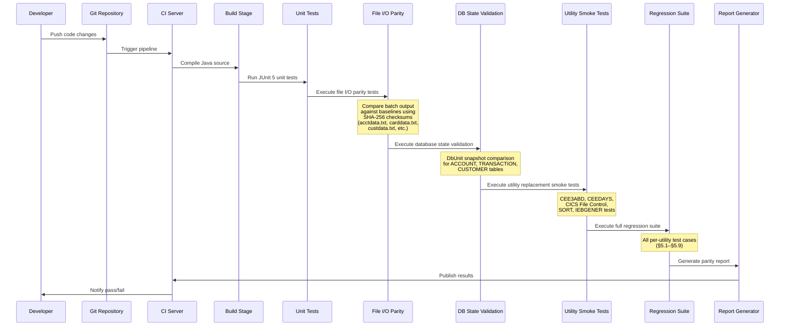

# Testing & Validation Framework

## Document Overview

This document defines the comprehensive testing and validation framework for the AWS CardDemo mainframe-to-Java migration. It establishes behavioral parity as the primary success criterion and provides detailed methodologies for file I/O validation, database state verification, regression testing, and per-utility test case design.

**Purpose:** Ensure that every migrated Java component produces results identical to its mainframe COBOL counterpart, giving stakeholders confidence that no business logic, data integrity, or operational behavior is lost during migration.

**Scope:** All proprietary utility replacements identified in the [Proprietary Utility Inventory](01-proprietary-utility-inventory.md) and migrated using the strategies defined in the [Migration Strategy](03-migration-strategy.md).

**Cross-References:**
- Utility catalog and consuming programs: [01 — Proprietary Utility Inventory](01-proprietary-utility-inventory.md)
- Per-utility migration strategies: [03 — Migration Strategy](03-migration-strategy.md)
- Impact assessments and complexity: [02 — Dependency Impact Analysis](02-dependency-impact-analysis.md)
- Risk ratings and unknowns: [04 — Risk Assessment](04-risk-assessment.md)

---

## 1. Testing Philosophy

### 1.1 Behavioral Parity as Success Criterion

The primary success criterion for the CardDemo migration is **behavioral parity**: the Java implementation must produce results that are identical to the mainframe COBOL implementation for all inputs, edge cases, and error conditions. This applies across all layers of the application:

- **Batch processing output:** Given the same input files, the Java batch programs must produce byte-identical output files.
- **Database state:** After executing the same sequence of operations, the Java programs must leave the database in the same state as the COBOL programs leave the VSAM datasets.
- **Error handling:** The Java programs must produce equivalent error codes, diagnostic information, and termination behavior as the COBOL programs.
- **Screen rendering:** The Java web UI must present the same fields, validation rules, and navigational flow as the COBOL BMS map-driven 3270 screens.
- **Transaction semantics:** The Java programs must maintain the same commit/rollback boundaries and record-locking behavior as the CICS programs.

### 1.2 Parity Levels

Not all aspects of migration require byte-level parity. The framework defines three parity levels:

| Parity Level | Definition | When Required | When Acceptable to Deviate |
|:-------------|:-----------|:-------------|:---------------------------|
| **Byte-Level Parity** | Output is bit-for-bit identical to mainframe output | Batch file I/O, sequential record generation, fixed-width data file production | Never — deviations must be treated as defects |
| **Semantic Parity** | Output conveys the same meaning and structure but may differ in encoding, whitespace, or formatting | Screen I/O (3270 → HTML/REST), log messages, diagnostic dumps | When the target platform uses a fundamentally different presentation format (e.g., EBCDIC → ASCII already handled by data conversion) |
| **Behavioral Parity** | The system exhibits the same observable behavior (same decisions, same state transitions, same error handling) but output representation may differ | CICS program control flow, transaction boundaries, abend handling, date validation | When the target platform uses a different mechanism (e.g., `System.exit()` vs. `CEE3ABD`) but the observable result (process exit code, logged error) is equivalent |

### 1.3 Deviation Justification Protocol

Any deviation from byte-level parity must be:

1. **Documented** with a justification explaining why exact parity is not achievable or not necessary.
2. **Approved** by the migration technical lead and the business domain owner.
3. **Tested** with a semantic equivalence assertion that verifies the deviation does not alter business outcomes.
4. **Tracked** in a parity deviation register for audit purposes.

---

## 2. File I/O Validation

### 2.1 Baseline Test Data Fixtures

The `app/data/ASCII/` directory contains 9 canonical test data fixtures that serve as the authoritative baseline for all file I/O validation. These files represent the VSAM dataset contents in ASCII-encoded, fixed-width format.

| Fixture File | Record Count | Record Length (bytes) | VSAM Cluster | Key Field | Key Length | Key Position (RKP) |
|:-------------|:-------------|:---------------------|:-------------|:----------|:-----------|:-------------------|
| `acctdata.txt` | 50 | 300 | AWS.M2.CARDDEMO.ACCTDATA.VSAM.KSDS | Account ID (PIC 9(11)) | 11 | 0 |
| `carddata.txt` | 50 | 150 | AWS.M2.CARDDEMO.CARDDATA.VSAM.KSDS | Card Number (PIC X(16)) | 16 | 0 |
| `cardxref.txt` | 50 | 36 | AWS.M2.CARDDEMO.CARDXREF.VSAM.KSDS | Card Number (PIC X(16)) | 16 | 0 |
| `custdata.txt` | 50 | 500 | AWS.M2.CARDDEMO.CUSTDATA.VSAM.KSDS | Customer ID (PIC X(09)) | 9 | 0 |
| `dailytran.txt` | 300 | 350 | N/A (Sequential input file) | Transaction ID (PIC X(16)) | 16 | 0 |
| `discgrp.txt` | 51 | 50 | AWS.M2.CARDDEMO.DISCGRP.VSAM.KSDS | Group Key (PIC X(16)) | 16 | 0 |
| `tcatbal.txt` | 50 | 50 | AWS.M2.CARDDEMO.TCATBALF.VSAM.KSDS | Category Key (PIC 9(11)+X(02)+9(04)) | 17 | 0 |
| `trancatg.txt` | 18 | 60 | AWS.M2.CARDDEMO.TRANCATG.VSAM.KSDS | Category Code (6 bytes) | 6 | 0 |
| `trantype.txt` | 7 | 60 | AWS.M2.CARDDEMO.TRANTYPE.VSAM.KSDS | Type Code (2 bytes) | 2 | 0 |

`Source: app/catlg/LISTCAT.txt:59-60 (ACCTDATA), :202-203 (CARDDATA), :403-404 (CARDXREF), :632-633 (CUSTDATA), :896-897 (DISCGRP), :1371-1372 (TCATBALF), :1475-1476 (TRANCATG), :3779-3780 (TRANTYPE), :3883-3884 (USRSEC)`

### 2.2 Byte-by-Byte Comparison Methodology

For batch programs that produce output files (interest calculations, transaction postings, statement generation), the validation process follows a strict byte-by-byte comparison approach:

**Step 1 — Establish Mainframe Baseline:**
1. Execute the COBOL batch program on the mainframe (or AWS Mainframe Modernization rehost environment) using the canonical test data fixtures as input.
2. Capture all output files generated by the program.
3. Convert output files from EBCDIC to ASCII using the same codepage mapping used for the input data conversion.
4. Store the ASCII-converted output files as golden baselines with SHA-256 checksums.

**Step 2 — Execute Java Equivalent:**
1. Load the same canonical test data fixtures into the Java application's data store (RDBMS or file system).
2. Execute the Java batch program with identical input parameters.
3. Capture all output files generated by the Java program.

**Step 3 — Compare:**
1. Compute SHA-256 checksums of both the baseline and Java output files.
2. If checksums match, the test passes (byte-level parity confirmed).
3. If checksums differ, perform a byte-level diff to identify exact positions of divergence.
4. Analyze each divergence against the parity deviation protocol (Section 1.3).

### 2.3 Primary Batch Program Test Targets

The following batch programs are the primary targets for file I/O validation, as they read input data files, perform business logic transformations, and write output files:

**CBACT04C — Interest Calculation:**
- **Input files:** TCATBALF (category balances), XREFFILE (card cross-reference), ACCTFILE (accounts), DISCGRP (disclosure groups)
- **Output file:** TRANSACT (calculated interest transaction records)
- **Validation:** Compare generated transaction records (350-byte fixed-width) against mainframe baseline. Verify interest amounts computed using `COMPUTE WS-MONTHLY-INT = (TRAN-CAT-BAL * DIS-INT-RATE) / 1200` match Java `BigDecimal` division results.
- `Source: app/cbl/CBACT04C.cbl:464-465`

**CBTRN02C — Transaction Posting:**
- **Input files:** DALYTRAN (daily transactions), XREFFILE (cross-reference), ACCTFILE (accounts), TCATBALF (category balances)
- **Output files:** TRANSACT (posted transaction records), DALYREJS (rejected transactions)
- **Validation:** Compare posted transaction records and reject records against mainframe baseline. Verify account balance updates match.
- `Source: app/cbl/CBTRN02C.cbl:29-61`

**CBSTM03A — Statement Generation:**
- **Input files:** TRNXFILE (transactions), XREFFILE (cross-reference), CUSTFILE (customers), ACCTFILE (accounts)
- **Output files:** STMTFILE (plain text statements), HTMLFILE (HTML statements)
- **Validation:** Compare generated statement files (80-byte text, 100-byte HTML) against mainframe baseline. Verify customer name, address, transaction details, and balance totals match.
- `Source: app/cbl/CBSTM03A.CBL:39-47`

### 2.4 SHA-256 Checksum Comparison Strategy

Every test data fixture and every program output file must have an associated SHA-256 checksum for fast integrity verification:

```java
// SHA-256 checksum comparison utility
import java.security.MessageDigest;
import java.nio.file.Files;
import java.nio.file.Path;

public class FileChecksumValidator {

    public static String computeSHA256(Path filePath) throws Exception {
        MessageDigest digest = MessageDigest.getInstance("SHA-256");
        byte[] fileBytes = Files.readAllBytes(filePath);
        byte[] hashBytes = digest.digest(fileBytes);
        StringBuilder hexString = new StringBuilder();
        for (byte b : hashBytes) {
            hexString.append(String.format("%02x", b));
        }
        return hexString.toString();
    }

    public static boolean compareChecksums(Path baselineFile, Path outputFile)
            throws Exception {
        String baselineHash = computeSHA256(baselineFile);
        String outputHash = computeSHA256(outputFile);
        return baselineHash.equals(outputHash);
    }
}
```

**Checksum Registry File Format:**

A `CHECKSUMS.sha256` file should be maintained in the test baseline directory:

```
e3b0c44298fc1c149afbf4c8996fb924...  acctdata.txt
a7ffc6f8bf1ed76651c14756a061d662...  carddata.txt
2c26b46b68ffc68ff99b453c1d304134...  custdata.txt
...
```

### 2.5 Record-Level Diff Analysis

When byte-level checksums do not match, a record-level diff analysis provides precise identification of discrepancies:

```java
// Record-level diff for fixed-width files
import org.apache.commons.io.FileUtils;
import java.io.File;
import java.util.List;

public class FixedWidthRecordDiffer {

    public static void diffRecords(File baseline, File output,
                                    int recordLength) throws Exception {
        List<String> baselineLines = FileUtils.readLines(baseline, "ASCII");
        List<String> outputLines = FileUtils.readLines(output, "ASCII");

        int maxLines = Math.max(baselineLines.size(), outputLines.size());
        for (int i = 0; i < maxLines; i++) {
            String bLine = i < baselineLines.size() ? baselineLines.get(i) : "<MISSING>";
            String oLine = i < outputLines.size() ? outputLines.get(i) : "<MISSING>";
            if (!bLine.equals(oLine)) {
                System.err.printf("DIFF at record %d:%n", i + 1);
                System.err.printf("  BASELINE: %s%n", bLine);
                System.err.printf("  OUTPUT:   %s%n", oLine);
                // Byte-level position of first difference
                for (int j = 0; j < Math.min(bLine.length(), oLine.length()); j++) {
                    if (bLine.charAt(j) != oLine.charAt(j)) {
                        System.err.printf("  FIRST DIFF at byte position %d: "
                            + "'%c' (0x%02X) vs '%c' (0x%02X)%n",
                            j, bLine.charAt(j), (int) bLine.charAt(j),
                            oLine.charAt(j), (int) oLine.charAt(j));
                        break;
                    }
                }
            }
        }
    }
}
```

---

## 3. Database State Validation

### 3.1 VSAM-to-RDBMS State Mapping

For each VSAM KSDS cluster in the CardDemo application, the Java migration replaces the file-based VSAM access with relational database tables. Database state validation ensures that the RDBMS tables contain exactly the same data as the VSAM files after executing equivalent operations.

**VSAM Cluster to RDBMS Table Mapping:**

| VSAM Cluster | Table Name | Primary Key | Record Size | Records | Key Validation |
|:-------------|:-----------|:------------|:------------|:--------|:---------------|
| AWS.M2.CARDDEMO.ACCTDATA.VSAM.KSDS | `ACCOUNT` | `ACCT_ID` (NUMERIC(11)) | 300 bytes | 50 | KEYLEN=11, RKP=0 |
| AWS.M2.CARDDEMO.CARDDATA.VSAM.KSDS | `CARD` | `CARD_NUM` (CHAR(16)) | 150 bytes | 50 | KEYLEN=16, RKP=0 |
| AWS.M2.CARDDEMO.CARDXREF.VSAM.KSDS | `CARD_XREF` | `XREF_CARD_NUM` (CHAR(16)) | 50 bytes | 50 | KEYLEN=16, RKP=0 |
| AWS.M2.CARDDEMO.CUSTDATA.VSAM.KSDS | `CUSTOMER` | `CUST_ID` (CHAR(9)) | 500 bytes | 50 | KEYLEN=9, RKP=0 |
| AWS.M2.CARDDEMO.DISCGRP.VSAM.KSDS | `DISCOUNT_GROUP` | `DISCGRP_KEY` (CHAR(16)) | 50 bytes | 51 | KEYLEN=16, RKP=0 |
| AWS.M2.CARDDEMO.TCATBALF.VSAM.KSDS | `TRAN_CAT_BAL` | `TCAT_KEY` (CHAR(17)) | 50 bytes | 100 | KEYLEN=17, RKP=0 |
| AWS.M2.CARDDEMO.TRANSACT.VSAM.KSDS | `TRANSACTION` | `TRAN_ID` (CHAR(16)) | 350 bytes | 311 | KEYLEN=16, RKP=0 |
| AWS.M2.CARDDEMO.TRANCATG.VSAM.KSDS | `TRAN_CATEGORY` | `TCAT_CODE` (CHAR(6)) | 60 bytes | 18 | KEYLEN=6, RKP=0 |
| AWS.M2.CARDDEMO.TRANTYPE.VSAM.KSDS | `TRAN_TYPE` | `TTYPE_CODE` (CHAR(2)) | 60 bytes | 7 | KEYLEN=2, RKP=0 |
| AWS.M2.CARDDEMO.USRSEC.VSAM.KSDS | `USER_SECURITY` | `USER_ID` (CHAR(8)) | 80 bytes | 10 | KEYLEN=8, RKP=0 |

`Source: app/catlg/LISTCAT.txt:59 (ACCTDATA KEYLEN=11, AVGLRECL=300), :202 (CARDDATA KEYLEN=16, AVGLRECL=150), :403 (CARDXREF KEYLEN=16, AVGLRECL=50), :632 (CUSTDATA KEYLEN=9, AVGLRECL=500), :896 (DISCGRP KEYLEN=16, AVGLRECL=50), :1371 (TCATBALF KEYLEN=17, AVGLRECL=50), :3593 (TRANSACT KEYLEN=16, AVGLRECL=350), :1475 (TRANCATG KEYLEN=6, AVGLRECL=60), :3779 (TRANTYPE KEYLEN=2, AVGLRECL=60), :3883 (USRSEC KEYLEN=8, AVGLRECL=80)`

### 3.2 DbUnit Configuration for State Snapshots

DbUnit is used to capture and compare database state before and after each batch program execution. The configuration establishes dataset snapshots that can be compared against expected baselines.

**DbUnit Dataset Configuration:**

```xml
<!-- dbunit-config.xml -->
<dbunit>
  <dataset>
    <!-- Account table snapshot -->
    <table name="ACCOUNT">
      <column>ACCT_ID</column>
      <column>ACCT_STATUS</column>
      <column>ACCT_CURR_BAL</column>
      <column>ACCT_CREDIT_LIMIT</column>
      <column>ACCT_CASH_CREDIT_LIMIT</column>
      <column>ACCT_OPEN_DATE</column>
      <column>ACCT_EXPIRY_DATE</column>
      <column>ACCT_REISSUE_DATE</column>
      <column>ACCT_CURR_CYC_CREDIT</column>
      <column>ACCT_CURR_CYC_DEBIT</column>
      <column>ACCT_GROUP_ID</column>
    </table>

    <!-- Transaction table snapshot -->
    <table name="TRANSACTION">
      <column>TRAN_ID</column>
      <column>TRAN_TYPE_CD</column>
      <column>TRAN_CAT_CD</column>
      <column>TRAN_SOURCE</column>
      <column>TRAN_DESC</column>
      <column>TRAN_AMT</column>
      <column>TRAN_CARD_NUM</column>
      <column>TRAN_MERCHANT_ID</column>
      <column>TRAN_MERCHANT_NAME</column>
      <column>TRAN_MERCHANT_CITY</column>
      <column>TRAN_MERCHANT_ZIP</column>
      <column>TRAN_ORIG_TS</column>
      <column>TRAN_PROC_TS</column>
    </table>

    <!-- Customer table snapshot -->
    <table name="CUSTOMER">
      <column>CUST_ID</column>
      <column>CUST_FIRST_NAME</column>
      <column>CUST_MIDDLE_NAME</column>
      <column>CUST_LAST_NAME</column>
      <column>CUST_ADDR_LINE_1</column>
      <column>CUST_ADDR_LINE_2</column>
      <column>CUST_ADDR_LINE_3</column>
      <column>CUST_ADDR_STATE_CD</column>
      <column>CUST_ADDR_COUNTRY_CD</column>
      <column>CUST_ADDR_ZIP</column>
      <column>CUST_PHONE_NUM_1</column>
      <column>CUST_PHONE_NUM_2</column>
      <column>CUST_SSN</column>
      <column>CUST_EFT_ACCOUNT_ID</column>
      <column>CUST_DOB</column>
      <column>CUST_FICO_CREDIT_SCORE</column>
    </table>
  </dataset>
</dbunit>
```

**State Validation Workflow:**

```java
import org.dbunit.Assertion;
import org.dbunit.database.DatabaseConnection;
import org.dbunit.dataset.IDataSet;
import org.dbunit.dataset.ITable;
import org.dbunit.dataset.xml.FlatXmlDataSetBuilder;

public class DatabaseStateValidator {

    /**
     * Compare current database state against expected baseline dataset.
     * Performs column-by-column, row-by-row comparison for each table.
     */
    public static void validateState(DatabaseConnection connection,
                                      String expectedDatasetPath,
                                      String tableName) throws Exception {
        // Load expected dataset from baseline XML
        IDataSet expectedDataSet = new FlatXmlDataSetBuilder()
            .build(new File(expectedDatasetPath));
        ITable expectedTable = expectedDataSet.getTable(tableName);

        // Fetch actual database state
        IDataSet actualDataSet = connection.createDataSet();
        ITable actualTable = actualDataSet.getTable(tableName);

        // Assert table contents match
        Assertion.assertEquals(expectedTable, actualTable);
    }
}
```

### 3.3 VSAM File Status Code Validation

COBOL programs use two-byte FILE STATUS codes to control program flow after every file operation. The Java equivalent must produce corresponding status indicators. The following status codes must be tested:

| VSAM File Status | Meaning | Java Equivalent | Test Assertion |
|:-----------------|:--------|:----------------|:---------------|
| `00` | Successful completion | Operation returns normally | No exception thrown; result set returned |
| `10` | End of file | `ResultSet.next()` returns `false` | Iterator/cursor exhaustion detected |
| `23` | Record not found | `SELECT` returns empty result | `Optional.empty()` or null returned |
| `22` | Duplicate key on WRITE | `INSERT` throws `DuplicateKeyException` | Appropriate exception caught |
| `35` | File not found on OPEN | `DataSource` connection failure | `SQLException` thrown with correct code |
| `9x` | System-level I/O error | `SQLException` or `IOException` | Error logged, abend equivalent invoked |

`Source: app/cbl/CBACT04C.cbl:237-249 (status '00' check on OPEN), :327-347 (status '00'/'10' check on READ), :357-369 (status '00' check on REWRITE)`

---

## 4. Regression Test Data Points

### 4.1 Key Fields per Test Fixture

The following data points are extracted from the canonical test data fixtures and serve as regression test anchors. These specific values must be present in the migrated system's data store and must produce identical results when queried.

#### 4.1.1 Account Data (acctdata.txt)

| Data Point | Field | Byte Position | Sample Values |
|:-----------|:------|:-------------|:--------------|
| Account ID | PIC 9(11) | 0–10 | `00000000001`, `00000000002`, `00000000003` |
| Account Status | PIC X(1) | 11 | `Y` (active) |
| Current Balance | PIC S9(9)V99 | 12–23 (with `{` sentinel) | `00000001940{`, `00000001580{`, `00000001470{` |
| Credit Limit | PIC S9(9)V99 | 24–35 | `00000020200{`, `00000061300{`, `00000049090{` |
| Open Date | PIC X(10) | Multiple positions | `2014-11-20`, `2013-06-19`, `2013-08-23` |
| Expiry Date | PIC X(10) | Multiple positions | `2025-05-20`, `2024-08-11`, `2024-01-10` |

`Source: app/data/ASCII/acctdata.txt (50 records, 300 bytes each)`

**Regression Assertions:**
- Total record count: exactly 50
- All Account IDs are unique 11-digit zero-padded numbers
- All dates conform to ISO-8601 format (YYYY-MM-DD)
- Current balance + cycle credits/debits must reconcile

#### 4.1.2 Card Data (carddata.txt)

| Data Point | Field | Byte Position | Sample Values |
|:-----------|:------|:-------------|:--------------|
| Card Number | PIC X(16) | 0–15 | `0500024453765740`, `0683586198171516`, `0923877193247330` |
| Customer ID | PIC 9(9) | 16–24 | `00000050`, `00000027567`, `00000002028` |
| Cardholder Name | PIC X(40) | 25–64 | `Aniya Von`, `Ward Jones`, `Enrico Rosenbaum` |
| Expiration Date | PIC X(10) | 65–74 | `2023-03-09`, `2025-07-13`, `2024-08-11` |
| Active Status | PIC X(1) | 75 | `Y` |

`Source: app/data/ASCII/carddata.txt (50 records, 150 bytes each)`

**Regression Assertions:**
- Total record count: exactly 50
- All card numbers are 16-digit numeric strings
- Expiration dates conform to ISO-8601 format

#### 4.1.3 Customer Data (custdata.txt)

| Data Point | Field | Byte Position | Sample Values |
|:-----------|:------|:-------------|:--------------|
| Customer ID | PIC X(9) | 0–8 | `000000001`, `000000002`, `000000003` |
| First Name | PIC X(20) | 9–28 | `Immanuel`, `Enrico`, `Larry` |
| Middle Name | PIC X(20) | 29–48 | `Madeline`, `April`, `Cody` |
| Last Name | PIC X(20) | 49–68 | `Kessler`, `Rosenbaum`, `Homenick` |
| SSN | PIC 9(9) | Multiple positions | `020973888`, `587518382`, `317460867` |
| Date of Birth | PIC X(10) | Multiple positions | `1961-06-08`, `1961-10-08`, `1987-11-30` |
| State Code | PIC X(2) | Multiple positions | `NC`, `IN`, `GA` |

`Source: app/data/ASCII/custdata.txt (50 records, 500 bytes each)`

**Regression Assertions:**
- Total record count: exactly 50
- All Customer IDs are unique 9-digit zero-padded numbers
- SSN is 9-digit numeric
- Date of Birth conforms to ISO-8601 format

#### 4.1.4 Transaction Data (dailytran.txt)

| Data Point | Field | Byte Position | Sample Values |
|:-----------|:------|:-------------|:--------------|
| Card Number | PIC X(16) | 0–15 | `0000000000683580`, `0000000001774260`, `0000000006292564` |
| Transaction Type | PIC X(2) | 16–17 | `01` (Purchase), `00` (Return), `01` (Purchase) |
| Terminal Type | PIC X(4) | 18–21 | `0001` |
| Terminal Source | PIC X(10) | 22–31 | `POS TERM`, `OPERATOR` |
| Transaction Amount | Embedded in record | Multiple positions | `0000005047G`, `0000009190}`, `0000000678H` |
| Timestamp | PIC X(26) | Multiple positions | `2022-06-10 19:27:53.000000` |

`Source: app/data/ASCII/dailytran.txt (300 records, 350 bytes each)`

**Regression Assertions:**
- Total record count: exactly 300
- All card numbers are 16-digit numeric strings
- Timestamps contain valid date-time values
- Transaction amounts use signed overpunch encoding (mainframe convention)

#### 4.1.5 Cross-Reference and Lookup Data

| Fixture | Records | Key Field | Sample Key Values | Record Length |
|:--------|:--------|:----------|:-----------------|:-------------|
| `cardxref.txt` | 50 | Card Number (16 bytes) | `0500024453765740`, `0683586198171516` | 36 bytes |
| `discgrp.txt` | 51 | Group Key (16 bytes) | `A`, `DEFAULT`, `ZEROAPR` (block prefixes) | 50 bytes |
| `tcatbal.txt` | 50 | Category Key (17 bytes) | 27-digit identifier + `{` delimiter | 50 bytes |
| `trancatg.txt` | 18 | Category Code (6 bytes) | 6-digit codes mapping to descriptions | 60 bytes |
| `trantype.txt` | 7 | Type Code (2 bytes) | `01`–`07` (canonical codes) | 60 bytes |

`Source: app/data/ASCII/cardxref.txt, discgrp.txt, tcatbal.txt, trancatg.txt, trantype.txt`

---

## 5. Per-Utility Test Cases

This section defines specific validation test cases for each proprietary utility replacement. Each test case references the migration strategy from [03 — Migration Strategy](03-migration-strategy.md) and the utility specification from [01 — Proprietary Utility Inventory](01-proprietary-utility-inventory.md).

### 5.1 CEE3ABD — Abend Handler

**Migration Strategy Reference:** Custom `ApplicationAbendException` extending `RuntimeException` with `System.exit()` (see [Migration Strategy §1.1](03-migration-strategy.md#11-cee3abd--java-exception-framework)).

**Utility Reference:** [Inventory §1.1](01-proprietary-utility-inventory.md#11-cee3abd--abend-handler)

| Test Case ID | Description | Input | Expected Result | Parity Level |
|:-------------|:------------|:------|:----------------|:-------------|
| CEE3ABD-TC01 | Normal abend with code 999 | Trigger unrecoverable I/O error in batch program | Process exits with exit code 999; diagnostic dump logged | Behavioral |
| CEE3ABD-TC02 | Abend with TIMING=0 (dump requested) | Set TIMING equivalent to 0, invoke abend | Full stack trace and memory state written to log | Behavioral |
| CEE3ABD-TC03 | Abend code propagation to JCL step | Execute batch program that abends, check return code | `$?` returns 999 in shell; downstream job step receives non-zero RC | Behavioral |
| CEE3ABD-TC04 | Abend on file OPEN failure | Attempt to open non-existent file | `ApplicationAbendException` thrown with code 999; error logged | Behavioral |
| CEE3ABD-TC05 | Abend on file READ failure | Corrupt data file causes read error | Equivalent error handling path followed; exit code matches | Behavioral |
| CEE3ABD-TC06 | Abend on file REWRITE failure | Concurrent access causing lock conflict | VSAM status code equivalence maintained in error log | Behavioral |

**Implementation Example:**

```java
@Test
void testAbendOnFileOpenFailure() {
    // Arrange: remove the input file to simulate OPEN failure
    Path missingFile = testDataDir.resolve("nonexistent_acctfile.dat");

    // Act & Assert: expect ApplicationAbendException with code 999
    ApplicationAbendException ex = assertThrows(
        ApplicationAbendException.class,
        () -> new CBACT04C(missingFile).execute()
    );
    assertEquals(999, ex.getAbendCode());
    assertTrue(ex.isGenerateDump());
}
```

`Source: app/cbl/CBACT01C.cbl:169-173 (9999-ABEND-PROGRAM paragraph with CALL 'CEE3ABD')`

### 5.2 CEEDAYS — Lillian Date Conversion

**Migration Strategy Reference:** `java.time.temporal.JulianFields` / `ChronoUnit` mapping (see [Migration Strategy §1.2](03-migration-strategy.md#12-ceedays--javatime-date-conversion)).

**Utility Reference:** [Inventory §1.2](01-proprietary-utility-inventory.md#12-ceedays--lillian-date-conversion)

| Test Case ID | Description | Input Date | Input Format | Expected Lillian Day | Expected FC |
|:-------------|:------------|:-----------|:-------------|:--------------------|:------------|
| CEEDAYS-TC01 | Valid date conversion | `2024-01-15` | `YYYY-MM-DD` | Valid positive integer | FC-INVALID-DATE (success, value `X'0000000000000000'`) |
| CEEDAYS-TC02 | Epoch date (day 1) | `1582-10-15` | `YYYY-MM-DD` | 1 | FC-INVALID-DATE (success) |
| CEEDAYS-TC03 | Invalid month (13) | `2024-13-01` | `YYYY-MM-DD` | 0 | FC-INVALID-MONTH |
| CEEDAYS-TC04 | Invalid day (Feb 30) | `2024-02-30` | `YYYY-MM-DD` | 0 | FC-BAD-DATE-VALUE |
| CEEDAYS-TC05 | Leap year Feb 29 | `2024-02-29` | `YYYY-MM-DD` | Valid positive integer | FC-INVALID-DATE (success) |
| CEEDAYS-TC06 | Non-leap year Feb 29 | `2023-02-29` | `YYYY-MM-DD` | 0 | FC-BAD-DATE-VALUE |
| CEEDAYS-TC07 | Insufficient data | `2024` | `YYYY-MM-DD` | 0 | FC-INSUFFICIENT-DATA |
| CEEDAYS-TC08 | Non-numeric data | `ABCD-EF-GH` | `YYYY-MM-DD` | 0 | FC-NON-NUMERIC-DATA |
| CEEDAYS-TC09 | Boundary: Dec 31 | `9999-12-31` | `YYYY-MM-DD` | Maximum valid Lillian | FC-INVALID-DATE (success) |
| CEEDAYS-TC10 | Empty date string | `          ` | `YYYY-MM-DD` | 0 | FC-NON-NUMERIC-DATA |

**Feedback Code Mapping from COBOL 88-Level Conditions:**

| Condition Name | Hex Value | Meaning | Java Equivalent |
|:---------------|:----------|:--------|:----------------|
| `FC-INVALID-DATE` | `X'0000000000000000'` | Date is valid (success) | `DateValidationResult.VALID` |
| `FC-INSUFFICIENT-DATA` | `X'000309CB59C3C5C5'` | Insufficient input data | `DateValidationResult.INSUFFICIENT_DATA` |
| `FC-BAD-DATE-VALUE` | `X'000309CC59C3C5C5'` | Invalid date value | `DateValidationResult.BAD_DATE_VALUE` |
| `FC-INVALID-ERA` | `X'000309CD59C3C5C5'` | Invalid era specification | `DateValidationResult.INVALID_ERA` |
| `FC-UNSUPP-RANGE` | `X'000309D159C3C5C5'` | Unsupported date range | `DateValidationResult.UNSUPPORTED_RANGE` |
| `FC-INVALID-MONTH` | `X'000309D559C3C5C5'` | Invalid month value | `DateValidationResult.INVALID_MONTH` |
| `FC-BAD-PIC-STRING` | `X'000309D659C3C5C5'` | Bad picture string format | `DateValidationResult.BAD_PIC_STRING` |
| `FC-NON-NUMERIC-DATA` | `X'000309D859C3C5C5'` | Non-numeric input data | `DateValidationResult.NON_NUMERIC_DATA` |
| `FC-YEAR-IN-ERA-ZERO` | `X'000309D959C3C5C5'` | Year in era is zero | `DateValidationResult.YEAR_IN_ERA_ZERO` |

`Source: app/cbl/CSUTLDTC.cbl:60-70 (FEEDBACK-CODE 88-level conditions), :116-120 (CALL "CEEDAYS" USING)`

**Implementation Example:**

```java
@Test
void testCeeDaysValidDate() {
    // Arrange: valid date as passed to CSUTLDTC
    String inputDate = "2024-01-15";
    String dateFormat = "YYYY-MM-DD";

    // Act: invoke Java equivalent of CEEDAYS
    DateConversionResult result = CeeDaysConverter.convert(inputDate, dateFormat);

    // Assert: verify Lillian day matches mainframe output
    assertTrue(result.isValid());
    assertEquals(DateValidationResult.VALID, result.getFeedbackCode());
    assertTrue(result.getLillianDay() > 0);
    // Cross-validate with known Lillian day calculation:
    // Lillian Day 1 = October 15, 1582 (start of Gregorian calendar)
    long expectedLillian = ChronoUnit.DAYS.between(
        LocalDate.of(1582, 10, 15), LocalDate.of(2024, 1, 15)) + 1;
    assertEquals(expectedLillian, result.getLillianDay());
}

@Test
void testCeeDaysInvalidMonth() {
    // Arrange: month 13 is invalid
    String inputDate = "2024-13-01";
    String dateFormat = "YYYY-MM-DD";

    // Act
    DateConversionResult result = CeeDaysConverter.convert(inputDate, dateFormat);

    // Assert: FC-INVALID-MONTH equivalent
    assertFalse(result.isValid());
    assertEquals(DateValidationResult.INVALID_MONTH, result.getFeedbackCode());
    assertEquals(0, result.getLillianDay());
}
```

### 5.3 CICS File Control — JDBC/JPA Operations

**Migration Strategy Reference:** Spring Data JPA / JDBC Template (see [Migration Strategy §2.1](03-migration-strategy.md#21-cics-file-control--spring-datajdbc)).

**Utility Reference:** [Inventory §2.1](01-proprietary-utility-inventory.md)

| Test Case ID | Description | CICS Command | Java Operation | Expected Result |
|:-------------|:------------|:-------------|:---------------|:----------------|
| CICSFC-TC01 | Read by exact key | `EXEC CICS READ FILE('ACCTDAT') INTO(ACCOUNT-RECORD) RIDFLD(ACCT-ID)` | `accountRepository.findById(acctId)` | Returns matching record with all fields identical |
| CICSFC-TC02 | Read with key not found | READ with non-existent key | `findById()` returns `Optional.empty()` | RESP=NOTFND equivalent; no exception thrown |
| CICSFC-TC03 | Write new record | `EXEC CICS WRITE FILE('ACCTDAT') FROM(ACCOUNT-RECORD)` | `accountRepository.save(newAccount)` | Record persisted; retrievable by key |
| CICSFC-TC04 | Write duplicate key | WRITE with existing key | `save()` throws `DuplicateKeyException` | RESP=DUPREC equivalent |
| CICSFC-TC05 | Rewrite existing record | `EXEC CICS REWRITE FILE('ACCTDAT') FROM(ACCOUNT-RECORD)` | `accountRepository.save(existingAccount)` | Record updated; new values retrievable |
| CICSFC-TC06 | Delete record | `EXEC CICS DELETE FILE('ACCTDAT') RIDFLD(ACCT-ID)` | `accountRepository.deleteById(acctId)` | Record removed; not retrievable |
| CICSFC-TC07 | Browse forward (STARTBR/READNEXT/ENDBR) | STARTBR + sequential READNEXT + ENDBR | `findAll(Sort.by("key"))` with cursor | Records returned in key sequence order |
| CICSFC-TC08 | Browse reverse (READPREV) | STARTBR + READPREV | `findAll(Sort.by("key").descending())` | Records returned in reverse key order |
| CICSFC-TC09 | Browse with generic key | STARTBR GTEQ | `findByKeyGreaterThanEqual(partialKey)` | Returns first record >= partial key |
| CICSFC-TC10 | File status after operation | Check RESP/RESP2 values | Check return code/exception type | Status codes mapped correctly |

**Browse Sequence Validation:**

```java
@Test
void testBrowseForwardSequence() {
    // Arrange: load acctdata.txt baseline into RDBMS
    loadBaselineData("acctdata.txt", "ACCOUNT");

    // Act: browse all accounts in key order (equivalent to STARTBR/READNEXT/ENDBR)
    List<Account> accounts = accountRepository.findAllByOrderByAcctIdAsc();

    // Assert: verify count and ordering match VSAM sequential browse
    assertEquals(50, accounts.size());  // matches REC-TOTAL from LISTCAT
    for (int i = 1; i < accounts.size(); i++) {
        assertTrue(accounts.get(i).getAcctId()
            .compareTo(accounts.get(i - 1).getAcctId()) > 0,
            "Records must be in ascending key order");
    }
}
```

### 5.4 CICS WRITEQ TD — JMS/Spring Batch Job Submission

**Migration Strategy Reference:** JMS or Spring Batch trigger (see [Migration Strategy §2.5](03-migration-strategy.md)).

**Utility Reference:** [Inventory §2.5](01-proprietary-utility-inventory.md)

| Test Case ID | Description | Input | Expected Result | Parity Level |
|:-------------|:------------|:------|:----------------|:-------------|
| TDQ-TC01 | Job submission via message queue | JCL record content equivalent | Message enqueued to JMS destination; batch job triggered | Behavioral |
| TDQ-TC02 | Multiple record submission | Loop writing 10+ JCL records to TDQ | All records received in order; batch job receives complete input | Behavioral |
| TDQ-TC03 | Error on queue write failure | Simulate JMS connection failure | Error logged; `WS-ERR-FLG` equivalent set to 'Y'; user notified | Behavioral |
| TDQ-TC04 | End-of-job marker | Write `/*EOF` as final record | Batch job recognizes termination; processes all prior records | Behavioral |

`Source: app/cbl/CORPT00C.cbl:517-523 (EXEC CICS WRITEQ TD QUEUE('JOBS') — writes JCL record to transient data queue for internal reader submission)`

**Implementation Example:**

```java
@Test
void testJobSubmissionViaMessageQueue() {
    // Arrange: prepare JCL content equivalent
    String jclContent = "//CARDRPT JOB ...";

    // Act: submit via JMS (replacing WRITEQ TD)
    jmsTemplate.convertAndSend("batch-job-queue", jclContent);

    // Assert: verify message received and batch job triggered
    Message received = jmsTemplate.receive("batch-job-queue");
    assertNotNull(received);
    assertEquals(jclContent, ((TextMessage) received).getText());
}

@Test
void testQueueWriteErrorHandling() {
    // Arrange: simulate JMS connection failure
    doThrow(new JmsException("Connection refused"))
        .when(jmsTemplate).convertAndSend(anyString(), anyString());

    // Act & Assert: verify error handling matches CORPT00C behavior
    ReportGenerationResult result = reportService.submitBatchJob(jclContent);
    assertTrue(result.hasError());
    assertEquals("Unable to Write TDQ (JOBS)...", result.getErrorMessage());
}
```

### 5.5 SORT — Java Sort/Merge

**Migration Strategy Reference:** Java `Collections.sort()` / file-based merge (see [Migration Strategy §3.2](03-migration-strategy.md)).

**Utility Reference:** [Inventory §3.2](01-proprietary-utility-inventory.md)

| Test Case ID | Description | Input | Expected Result | Parity Level |
|:-------------|:------------|:------|:----------------|:-------------|
| SORT-TC01 | Sort by single key ascending | Input file with unsorted records | Output file records in ascending key order, byte-identical to mainframe SORT output | Byte-Level |
| SORT-TC02 | Merge two sorted files | Two pre-sorted input files (COMBTRAN equivalent) | Merged output file with records interleaved by sort key, byte-identical | Byte-Level |
| SORT-TC03 | Sort with duplicate keys | Input with records sharing same key value | Duplicate records preserved in original order (stable sort) | Byte-Level |
| SORT-TC04 | Empty input file | Zero-record input file | Zero-record output file; no errors | Byte-Level |
| SORT-TC05 | Large file sort | Input file > 10,000 records | Correctly sorted output; performance within acceptable limits | Byte-Level |

**Implementation Example:**

```java
@Test
void testSortMergeCombtranEquivalent() throws Exception {
    // Arrange: load two pre-sorted input files
    Path inputFile1 = testDataDir.resolve("sorted_transactions_1.txt");
    Path inputFile2 = testDataDir.resolve("sorted_transactions_2.txt");
    Path expectedOutput = testDataDir.resolve("baseline_merged_output.txt");
    Path actualOutput = tempDir.resolve("merged_output.txt");

    // Act: Java merge sort equivalent of COMBTRAN SORT utility
    FileMergeSorter.merge(inputFile1, inputFile2, actualOutput, 0, 16);

    // Assert: byte-level parity with mainframe SORT output
    assertTrue(FileUtils.contentEquals(
        expectedOutput.toFile(), actualOutput.toFile()),
        "Merged output must be byte-identical to mainframe SORT baseline");

    // Verify SHA-256 checksum
    assertEquals(
        FileChecksumValidator.computeSHA256(expectedOutput),
        FileChecksumValidator.computeSHA256(actualOutput));
}
```

### 5.6 IEBGENER — Java File Copy

**Migration Strategy Reference:** `java.nio.file.Files.copy()` (see [Migration Strategy §3.3](03-migration-strategy.md)).

**Utility Reference:** [Inventory §3.3](01-proprietary-utility-inventory.md)

| Test Case ID | Description | Input | Expected Result | Parity Level |
|:-------------|:------------|:------|:----------------|:-------------|
| IEBGEN-TC01 | Sequential file copy | Fixed-width input file (300-byte records) | Output file byte-identical to input | Byte-Level |
| IEBGEN-TC02 | Copy with record length verification | Input file with known record length | Each output record exactly matches input record length | Byte-Level |
| IEBGEN-TC03 | Copy empty file | Zero-byte input file | Zero-byte output file created | Byte-Level |
| IEBGEN-TC04 | Copy large file | Input file > 1 MB | Byte-identical copy; SHA-256 checksums match | Byte-Level |
| IEBGEN-TC05 | Copy preserves fixed-width formatting | Input with space-padded fields | No trimming of trailing spaces; field widths preserved | Byte-Level |

**Implementation Example:**

```java
@Test
void testIebgenerSequentialCopy() throws Exception {
    // Arrange: use acctdata.txt as source (300-byte fixed-width records)
    Path sourceFile = Paths.get("app/data/ASCII/acctdata.txt");
    Path targetFile = tempDir.resolve("copied_acctdata.txt");

    // Act: Java equivalent of IEBGENER
    Files.copy(sourceFile, targetFile, StandardCopyOption.REPLACE_EXISTING);

    // Assert: byte-level parity
    assertTrue(FileUtils.contentEquals(sourceFile.toFile(), targetFile.toFile()),
        "IEBGENER copy must produce byte-identical output");

    // Verify record count preserved
    List<String> sourceLines = Files.readAllLines(sourceFile);
    List<String> targetLines = Files.readAllLines(targetFile);
    assertEquals(sourceLines.size(), targetLines.size());
    assertEquals(50, targetLines.size());  // acctdata.txt has 50 records
}
```

### 5.7 IEFBR14 — File System Allocation/Deallocation

**Migration Strategy Reference:** Java file system operations (see [Migration Strategy §3.4](03-migration-strategy.md)).

**Utility Reference:** [Inventory §3.4](01-proprietary-utility-inventory.md)

| Test Case ID | Description | DD Equivalent | Java Operation | Expected Result |
|:-------------|:------------|:-------------|:---------------|:----------------|
| IEFBR14-TC01 | Create empty file (DISP=(NEW,CATLG)) | Allocate new dataset | `Files.createFile()` | File exists; size = 0 bytes |
| IEFBR14-TC02 | Delete existing file (DISP=(OLD,DELETE)) | Deallocate dataset | `Files.deleteIfExists()` | File no longer exists |
| IEFBR14-TC03 | Create directory structure | Allocate PDS equivalent | `Files.createDirectories()` | Directory tree created |
| IEFBR14-TC04 | No-op when file exists (DISP=SHR) | Shared access, no change | Verify file exists; no modification | File unchanged; timestamp preserved |
| IEFBR14-TC05 | Conditional creation (DISP=(NEW,CATLG,DELETE)) | Create if not exists | `Files.createFile()` with existence check | File created only if absent |

**Implementation Example:**

```java
@Test
void testIefbr14CreateEmptyFile() throws Exception {
    // Arrange: target file should not exist
    Path targetFile = tempDir.resolve("new_dataset.dat");
    assertFalse(Files.exists(targetFile));

    // Act: Java equivalent of IEFBR14 with DISP=(NEW,CATLG)
    Files.createFile(targetFile);

    // Assert
    assertTrue(Files.exists(targetFile));
    assertEquals(0, Files.size(targetFile));
}

@Test
void testIefbr14DeleteExistingFile() throws Exception {
    // Arrange: create a file first
    Path targetFile = tempDir.resolve("existing_dataset.dat");
    Files.createFile(targetFile);
    assertTrue(Files.exists(targetFile));

    // Act: Java equivalent of IEFBR14 with DISP=(OLD,DELETE)
    Files.deleteIfExists(targetFile);

    // Assert
    assertFalse(Files.exists(targetFile));
}
```

### 5.8 BMS Maps — HTML/REST Field Rendering

**Migration Strategy Reference:** HTML form/REST API mapping (see [Migration Strategy §4](03-migration-strategy.md)).

**Utility Reference:** [Inventory §4](01-proprietary-utility-inventory.md)

| Test Case ID | Description | BMS Element | HTML Equivalent | Validation |
|:-------------|:------------|:------------|:----------------|:-----------|
| BMS-TC01 | Map set rendering | DFHMSD TYPE=MAP | HTML `<form>` element | Form renders with all fields from map definition |
| BMS-TC02 | Map field input | DFHMDF ATTRB=(UNPROT,IC) | `<input type="text">` with autofocus | Field accepts user input; autofocus on initial cursor field |
| BMS-TC03 | Protected field display | DFHMDF ATTRB=(ASKIP,BRT) | `<span>` or read-only `<input>` | Field displays data but prevents user modification |
| BMS-TC04 | Field length validation | DFHMDF LENGTH=16 | `maxlength="16"` attribute | Input truncated at 16 characters |
| BMS-TC05 | Numeric field validation | DFHMDF ATTRB=(NUM) | `<input type="number">` or pattern validation | Only numeric input accepted |
| BMS-TC06 | AID key mapping (DFHAID) | DFHENTER, DFHPF3, DFHPF7, DFHPF8 | Button clicks / keyboard shortcuts | Enter → submit, PF3 → back/exit, PF7 → page up, PF8 → page down |
| BMS-TC07 | Attribute set (DFHBMSCA) | DFHBMSCA color/highlight values | CSS styling classes | Visual attributes (color, brightness, underline) rendered equivalently |
| BMS-TC08 | Screen title rendering | COTTL01Y copybook fields | HTML header/banner | Title area displays same program name and transaction ID |
| BMS-TC09 | Error message display | CSMSG01Y/CSMSG02Y copybook fields | Error notification component | Error messages display in same screen position with same content |
| BMS-TC10 | Multi-row list display | Repeated DFHMDF definitions in list screens | HTML table or list component | All rows rendered with correct data alignment |

**Screen Parity Validation Approach:**

```java
@Test
void testAccountUpdateScreenFields() {
    // Arrange: load COACTUP.bms field definitions
    BmsMapDefinition mapDef = BmsParser.parse("app/bms/COACTUP.bms");

    // Act: render equivalent HTML form
    String htmlOutput = screenRenderer.render("account-update", testData);

    // Assert: all BMS fields have corresponding HTML elements
    for (BmsField field : mapDef.getFields()) {
        assertTrue(htmlOutput.contains("name=\"" + field.getName() + "\""),
            "HTML must contain field: " + field.getName());

        if (field.getMaxLength() > 0) {
            assertTrue(htmlOutput.contains("maxlength=\"" + field.getMaxLength() + "\""),
                "Field " + field.getName() + " must enforce max length");
        }

        if (field.isProtected()) {
            assertTrue(htmlOutput.contains("readonly") || htmlOutput.contains("disabled"),
                "Protected field " + field.getName() + " must be read-only");
        }
    }
}
```

### 5.9 CBSTM03B — Centralized I/O Subroutine

**Migration Strategy Reference:** Java DAO/Service Layer pattern (see [Migration Strategy §1](03-migration-strategy.md)).

**Utility Reference:** [Inventory §1](01-proprietary-utility-inventory.md)

`Source: app/cbl/CBSTM03B.CBL:114-230 (centralized file I/O subroutine handling TRNXFILE, XREFFILE, CUSTFILE, ACCTFILE via operation codes O/C/R/K/W/Z)`

| Test Case ID | Description | Operation Code | Java DAO Method | Expected Result |
|:-------------|:------------|:--------------|:----------------|:----------------|
| M03B-TC01 | Open TRNXFILE for sequential read | `M03B-OPEN` ('O') + DD='TRNXFILE' | `transactionDao.openForRead()` | Connection/cursor established; RC='00' |
| M03B-TC02 | Sequential read TRNXFILE | `M03B-READ` ('R') + DD='TRNXFILE' | `transactionDao.readNext()` | Next record returned; RC='00' or '10' at EOF |
| M03B-TC03 | Close TRNXFILE | `M03B-CLOSE` ('C') + DD='TRNXFILE' | `transactionDao.close()` | Resources released; RC='00' |
| M03B-TC04 | Read CUSTFILE by key | `M03B-READ-K` ('K') + DD='CUSTFILE' + KEY | `customerDao.findByKey(key)` | Record matching key returned; RC='00' or '23' if not found |
| M03B-TC05 | Read ACCTFILE by key | `M03B-READ-K` ('K') + DD='ACCTFILE' + KEY | `accountDao.findByKey(key)` | Record matching key returned; RC='00' or '23' |
| M03B-TC06 | Read XREFFILE sequentially | `M03B-READ` ('R') + DD='XREFFILE' | `xrefDao.readNext()` | Next record returned in key sequence |
| M03B-TC07 | Invalid DD name | Unknown DD name | DAO router returns error | RC set to error status; GOBACK executed |
| M03B-TC08 | End-of-file detection | Read past last record | `readNext()` returns null | RC='10'; caller detects EOF |
| M03B-TC09 | Full read cycle | OPEN → READ (all records) → CLOSE | Full DAO lifecycle | All 50 records read; EOF detected; resources released |
| M03B-TC10 | I/O status code mapping | Each operation | DAO return codes | RC matches COBOL FILE STATUS: '00', '10', '23', '35' |

**Implementation Example:**

```java
@Test
void testFullReadCycle_TRNXFILE() throws Exception {
    // Arrange: load baseline transaction data
    loadBaselineData("dailytran.txt", "TRANSACTION");

    // Act: simulate CBSTM03B full read cycle
    FileIoService ioService = new FileIoService();

    // OPEN
    String rc = ioService.execute("TRNXFILE", "O", null, 0);
    assertEquals("00", rc, "OPEN should return status 00");

    // READ all records
    int recordCount = 0;
    while (true) {
        String readRc = ioService.execute("TRNXFILE", "R", null, 0);
        if ("10".equals(readRc)) break;  // EOF
        assertEquals("00", readRc);
        recordCount++;
    }
    assertEquals(300, recordCount, "Should read all 300 daily transaction records");

    // CLOSE
    rc = ioService.execute("TRNXFILE", "C", null, 0);
    assertEquals("00", rc, "CLOSE should return status 00");
}

@Test
void testKeyedRead_CUSTFILE() throws Exception {
    // Arrange: load customer baseline
    loadBaselineData("custdata.txt", "CUSTOMER");

    FileIoService ioService = new FileIoService();
    ioService.execute("CUSTFILE", "O", null, 0);

    // Act: read by known key (Customer ID 000000001)
    String rc = ioService.execute("CUSTFILE", "K", "000000001", 9);
    assertEquals("00", rc);

    // Act: read by non-existent key
    rc = ioService.execute("CUSTFILE", "K", "999999999", 9);
    assertEquals("23", rc, "Non-existent key should return status 23 (NOTFND)");

    ioService.execute("CUSTFILE", "C", null, 0);
}
```

---

## 6. Test Automation Framework

### 6.1 Framework Architecture

The test automation framework is built on the following technology stack:

| Component | Technology | Version | Purpose |
|:----------|:-----------|:--------|:--------|
| Test Runner | JUnit 5 (Jupiter) | 5.10.x | Test lifecycle management, assertions, parameterized tests |
| File Comparison | Apache Commons IO | 2.15.x | `FileUtils.contentEquals()` for byte-level file comparison |
| Database Validation | DbUnit | 2.8.0 | Database state snapshots, expected vs. actual table comparison |
| Mocking | Mockito | 5.10.x | Mock CICS API equivalents, simulate error conditions |
| Assertion Library | AssertJ | 3.25.x | Fluent assertions for complex object comparisons |
| Test Data Management | JUnit 5 `@TempDir` | Built-in | Temporary directory management for test file I/O |
| CI Integration | Maven Surefire | 3.2.x | Test execution in CI pipeline |

### 6.2 JUnit 5 Test Structure

The test suite is organized by utility category, with each test class focused on a specific utility replacement:

```
src/test/java/com/carddemo/migration/
├── abend/
│   └── Cee3AbdParityTest.java          // CEE3ABD test cases (§5.1)
├── date/
│   └── CeeDaysParityTest.java          // CEEDAYS test cases (§5.2)
├── cics/
│   ├── FileControlParityTest.java      // CICS File Control test cases (§5.3)
│   ├── WriteqTdParityTest.java         // CICS WRITEQ TD test cases (§5.4)
│   └── BmsMapParityTest.java           // BMS Map test cases (§5.8)
├── batch/
│   ├── SortMergeParityTest.java        // SORT test cases (§5.5)
│   ├── IebgenerParityTest.java         // IEBGENER test cases (§5.6)
│   └── Iefbr14ParityTest.java          // IEFBR14 test cases (§5.7)
├── io/
│   └── Cbstm03bParityTest.java         // CBSTM03B subroutine test cases (§5.9)
├── common/
│   ├── FileChecksumValidator.java       // SHA-256 checksum comparison utility
│   ├── FixedWidthRecordDiffer.java      // Record-level diff analysis
│   ├── DatabaseStateValidator.java      // DbUnit wrapper
│   └── VsamFileStatusMapper.java        // VSAM status code assertion helper
└── integration/
    ├── CBACT04CIntegrationTest.java     // End-to-end interest calculation
    ├── CBTRN02CIntegrationTest.java     // End-to-end transaction posting
    └── CBSTM03AIntegrationTest.java     // End-to-end statement generation
```

### 6.3 Apache Commons IO File Comparison

Apache Commons IO `FileUtils.contentEquals()` provides the core byte-level comparison for all file I/O parity tests:

```java
import org.apache.commons.io.FileUtils;
import org.junit.jupiter.api.Test;
import org.junit.jupiter.api.io.TempDir;
import static org.junit.jupiter.api.Assertions.*;

class FileParityBaseTest {

    @TempDir
    Path tempDir;

    /**
     * Validates that two files are byte-for-byte identical.
     * Used for all batch program output validation.
     */
    protected void assertByteParityWithBaseline(Path baselinePath,
                                                 Path actualPath) throws Exception {
        // Fast check: file sizes must match
        assertEquals(Files.size(baselinePath), Files.size(actualPath),
            "File sizes differ — byte parity impossible");

        // Content comparison
        assertTrue(FileUtils.contentEquals(baselinePath.toFile(), actualPath.toFile()),
            String.format("Byte parity failed between baseline [%s] and actual [%s]",
                baselinePath, actualPath));

        // Checksum verification
        assertEquals(
            FileChecksumValidator.computeSHA256(baselinePath),
            FileChecksumValidator.computeSHA256(actualPath),
            "SHA-256 checksum mismatch");
    }

    /**
     * Validates record count matches expected value from LISTCAT REC-TOTAL.
     */
    protected void assertRecordCount(Path filePath, int expectedCount)
            throws Exception {
        List<String> lines = Files.readAllLines(filePath);
        assertEquals(expectedCount, lines.size(),
            String.format("Expected %d records in %s, found %d",
                expectedCount, filePath.getFileName(), lines.size()));
    }
}
```

### 6.4 DbUnit Database State Comparison

DbUnit provides before/after state snapshots for validating database changes made by batch programs:

```java
import org.dbunit.Assertion;
import org.dbunit.database.DatabaseConnection;
import org.dbunit.dataset.IDataSet;
import org.dbunit.dataset.ITable;
import org.dbunit.dataset.SortedTable;
import org.dbunit.dataset.filter.DefaultColumnFilter;

class DatabaseParityBaseTest {

    protected DatabaseConnection dbConnection;

    /**
     * Captures a snapshot of the specified table before batch execution.
     */
    protected IDataSet capturePreExecutionState(String... tableNames)
            throws Exception {
        return dbConnection.createDataSet(tableNames);
    }

    /**
     * Validates table state matches expected baseline after batch execution.
     * Sorts both tables by primary key before comparison.
     */
    protected void assertTableStateMatchesBaseline(String tableName,
                                                     ITable expectedTable)
            throws Exception {
        ITable actualTable = dbConnection.createDataSet()
            .getTable(tableName);

        // Sort both tables by first column (primary key) for deterministic comparison
        SortedTable sortedExpected = new SortedTable(expectedTable);
        SortedTable sortedActual = new SortedTable(actualTable);

        Assertion.assertEquals(sortedExpected, sortedActual);
    }

    /**
     * Validates specific column values match for a subset of rows.
     * Used for regression data point verification (Section 4).
     */
    protected void assertColumnValue(String tableName, String columnName,
                                      int rowIndex, Object expectedValue)
            throws Exception {
        ITable table = dbConnection.createDataSet().getTable(tableName);
        assertEquals(expectedValue, table.getValue(rowIndex, columnName));
    }
}
```

### 6.5 Custom VSAM File Status Assertions

A custom assertion helper maps COBOL VSAM FILE STATUS codes to Java operation outcomes:

```java
/**
 * Custom assertion helper for validating VSAM File Status code equivalence
 * in the migrated Java implementation.
 *
 * Maps two-byte COBOL FILE STATUS codes to expected Java behaviors.
 */
public class VsamFileStatusMapper {

    public enum VsamStatus {
        SUCCESS("00"),
        END_OF_FILE("10"),
        DUPLICATE_KEY("22"),
        RECORD_NOT_FOUND("23"),
        FILE_NOT_FOUND("35"),
        SYSTEM_ERROR("9x");

        private final String code;

        VsamStatus(String code) { this.code = code; }
        public String getCode() { return code; }
    }

    /**
     * Assert that a Java operation outcome matches the expected VSAM status.
     */
    public static void assertVsamStatusEquivalent(VsamStatus expectedStatus,
                                                    OperationResult result) {
        switch (expectedStatus) {
            case SUCCESS:
                assertTrue(result.isSuccess(),
                    "Expected VSAM status 00 (success)");
                break;
            case END_OF_FILE:
                assertTrue(result.isEndOfFile(),
                    "Expected VSAM status 10 (EOF)");
                break;
            case DUPLICATE_KEY:
                assertTrue(result.isDuplicateKey(),
                    "Expected VSAM status 22 (duplicate key)");
                break;
            case RECORD_NOT_FOUND:
                assertTrue(result.isNotFound(),
                    "Expected VSAM status 23 (record not found)");
                break;
            case FILE_NOT_FOUND:
                assertTrue(result.isFileNotFound(),
                    "Expected VSAM status 35 (file not found)");
                break;
            case SYSTEM_ERROR:
                assertTrue(result.isSystemError(),
                    "Expected VSAM status 9x (system error)");
                break;
        }
    }
}
```

### 6.6 Mockito for CICS API Mock Verification

Mockito is used to simulate CICS API behavior in unit tests where the full CICS environment is not available:

```java
@ExtendWith(MockitoExtension.class)
class CicsFileControlMockTest {

    @Mock
    private AccountRepository accountRepository;

    @InjectMocks
    private AccountService accountService;

    @Test
    void testReadByExactKey_MatchesExecCicsRead() {
        // Arrange: simulate EXEC CICS READ FILE('ACCTDAT')
        Account expectedAccount = new Account();
        expectedAccount.setAcctId("00000000001");
        expectedAccount.setAcctStatus("Y");
        expectedAccount.setAcctCurrBal(new BigDecimal("19400"));

        when(accountRepository.findById("00000000001"))
            .thenReturn(Optional.of(expectedAccount));

        // Act
        Optional<Account> result = accountService.readAccount("00000000001");

        // Assert: RESP=NORMAL equivalent
        assertTrue(result.isPresent());
        assertEquals("00000000001", result.get().getAcctId());
        assertEquals("Y", result.get().getAcctStatus());
        verify(accountRepository).findById("00000000001");
    }

    @Test
    void testReadNotFound_MatchesExecCicsNotfnd() {
        // Arrange: simulate EXEC CICS READ with non-existent key
        when(accountRepository.findById("99999999999"))
            .thenReturn(Optional.empty());

        // Act
        Optional<Account> result = accountService.readAccount("99999999999");

        // Assert: RESP=NOTFND equivalent
        assertFalse(result.isPresent());
    }
}
```

---

## 7. Continuous Validation Pipeline

### 7.1 Pipeline Architecture

The continuous validation pipeline integrates behavioral parity testing into the CI/CD workflow, ensuring that migration quality is continuously verified as Java implementations are developed and refined.



### 7.2 Pipeline Stages

| Stage | Tests Executed | Failure Action | Timeout |
|:------|:--------------|:---------------|:--------|
| **1. Build** | Compile all Java source | Block pipeline; notify developer | 5 min |
| **2. Unit Tests** | All JUnit 5 unit tests (per-utility mocked tests) | Block pipeline; flag failing test class | 10 min |
| **3. File I/O Parity** | Batch program output comparison (§2) | Block pipeline; generate diff report | 15 min |
| **4. DB State Validation** | DbUnit before/after snapshots (§3) | Block pipeline; generate state diff | 10 min |
| **5. Utility Smoke Tests** | One representative test per utility category (§5) | Block pipeline; flag failing utility | 10 min |
| **6. Regression Suite** | All per-utility test cases (§5.1–§5.9) | Block pipeline; generate full report | 30 min |
| **7. Parity Report** | Aggregate results, compute parity score | Generate report; archive | 2 min |

### 7.3 CI Configuration

**Maven Surefire Configuration for Staged Test Execution:**

```xml
<!-- pom.xml — test execution configuration -->
<build>
  <plugins>
    <plugin>
      <groupId>org.apache.maven.plugins</groupId>
      <artifactId>maven-surefire-plugin</artifactId>
      <version>3.2.5</version>
      <configuration>
        <groups>${test.groups}</groups>
        <systemPropertyVariables>
          <baseline.data.dir>${project.basedir}/src/test/resources/baselines</baseline.data.dir>
          <test.data.dir>${project.basedir}/src/test/resources/testdata</test.data.dir>
        </systemPropertyVariables>
      </configuration>
    </plugin>
  </plugins>
</build>

<profiles>
  <!-- Stage 2: Unit tests only -->
  <profile>
    <id>unit-tests</id>
    <properties>
      <test.groups>unit</test.groups>
    </properties>
  </profile>

  <!-- Stage 3: File I/O parity tests -->
  <profile>
    <id>file-io-parity</id>
    <properties>
      <test.groups>file-io-parity</test.groups>
    </properties>
  </profile>

  <!-- Stage 4: Database state validation -->
  <profile>
    <id>db-state-validation</id>
    <properties>
      <test.groups>db-state</test.groups>
    </properties>
  </profile>

  <!-- Stage 5: Utility smoke tests -->
  <profile>
    <id>utility-smoke</id>
    <properties>
      <test.groups>smoke</test.groups>
    </properties>
  </profile>

  <!-- Stage 6: Full regression suite -->
  <profile>
    <id>regression</id>
    <properties>
      <test.groups>regression</test.groups>
    </properties>
  </profile>
</profiles>
```

**JUnit 5 Tag Annotations for Test Categorization:**

```java
// Tag annotations for CI pipeline stage mapping
@Tag("unit")
class Cee3AbdParityTest { ... }

@Tag("file-io-parity")
class CBACT04CFileOutputParityTest { ... }

@Tag("db-state")
class AccountTableStateParityTest { ... }

@Tag("smoke")
class UtilitySmokeTest { ... }

@Tag("regression")
class FullRegressionSuiteTest { ... }
```

### 7.4 Parity Score Metric

The CI pipeline computes a **Parity Score** summarizing the overall migration quality:

| Metric | Weight | Calculation |
|:-------|:-------|:------------|
| File I/O Byte Parity | 30% | (Files with matching SHA-256 / Total output files) × 100 |
| Database State Parity | 25% | (Tables with matching state / Total tables) × 100 |
| Utility Test Pass Rate | 25% | (Passing utility tests / Total utility tests) × 100 |
| Regression Test Pass Rate | 20% | (Passing regression tests / Total regression tests) × 100 |
| **Overall Parity Score** | **100%** | **Weighted sum of above metrics** |

**Acceptance Threshold:** The migration is considered production-ready when the Overall Parity Score reaches **100%** — meaning all file outputs are byte-identical, all database states match, and all utility and regression tests pass.

### 7.5 Baseline Data Management

Test baseline data is managed as version-controlled artifacts within the test resources directory:

```
src/test/resources/
├── baselines/
│   ├── batch-output/
│   │   ├── cbact04c/
│   │   │   ├── transact_output.txt          (interest calc output baseline)
│   │   │   └── transact_output.txt.sha256
│   │   ├── cbtrn02c/
│   │   │   ├── posted_transactions.txt       (posting output baseline)
│   │   │   ├── rejected_transactions.txt     (rejects output baseline)
│   │   │   └── *.sha256
│   │   └── cbstm03a/
│   │       ├── statement_output.txt          (text statement baseline)
│   │       ├── statement_output.html         (HTML statement baseline)
│   │       └── *.sha256
│   ├── db-snapshots/
│   │   ├── pre-execution/
│   │   │   ├── account_baseline.xml
│   │   │   ├── transaction_baseline.xml
│   │   │   └── customer_baseline.xml
│   │   └── post-execution/
│   │       ├── account_expected.xml
│   │       ├── transaction_expected.xml
│   │       └── customer_expected.xml
│   └── checksums/
│       └── CHECKSUMS.sha256
├── testdata/
│   ├── acctdata.txt                          (copy of app/data/ASCII/acctdata.txt)
│   ├── carddata.txt                          (copy of app/data/ASCII/carddata.txt)
│   ├── cardxref.txt                          (copy of app/data/ASCII/cardxref.txt)
│   ├── custdata.txt                          (copy of app/data/ASCII/custdata.txt)
│   ├── dailytran.txt                         (copy of app/data/ASCII/dailytran.txt)
│   ├── discgrp.txt                           (copy of app/data/ASCII/discgrp.txt)
│   ├── tcatbal.txt                           (copy of app/data/ASCII/tcatbal.txt)
│   ├── trancatg.txt                          (copy of app/data/ASCII/trancatg.txt)
│   └── trantype.txt                          (copy of app/data/ASCII/trantype.txt)
└── dbunit/
    └── dbunit-config.xml
```

**Baseline Update Protocol:**
1. When a new mainframe baseline is produced, update the corresponding file in `baselines/`.
2. Recompute SHA-256 checksums and update `CHECKSUMS.sha256`.
3. Run the full regression suite to verify all tests still pass against the new baseline.
4. Commit baseline updates with a descriptive message referencing the mainframe execution date and parameters.

---

## Appendix A: Test Case Summary Matrix

| Utility | Test Cases | Parity Level | Section Reference |
|:--------|:-----------|:-------------|:-----------------|
| CEE3ABD | CEE3ABD-TC01 – TC06 | Behavioral | §5.1 |
| CEEDAYS | CEEDAYS-TC01 – TC10 | Behavioral | §5.2 |
| CICS File Control | CICSFC-TC01 – TC10 | Semantic/Behavioral | §5.3 |
| CICS WRITEQ TD | TDQ-TC01 – TC04 | Behavioral | §5.4 |
| SORT | SORT-TC01 – TC05 | Byte-Level | §5.5 |
| IEBGENER | IEBGEN-TC01 – TC05 | Byte-Level | §5.6 |
| IEFBR14 | IEFBR14-TC01 – TC05 | Behavioral | §5.7 |
| BMS Maps | BMS-TC01 – TC10 | Semantic | §5.8 |
| CBSTM03B | M03B-TC01 – TC10 | Behavioral | §5.9 |
| **Total** | **65 test cases** | | |

## Appendix B: Tool and Library Versions

| Tool/Library | Version | License | Repository |
|:-------------|:--------|:--------|:-----------|
| JUnit 5 (Jupiter) | 5.10.x | EPL 2.0 | `org.junit.jupiter:junit-jupiter` |
| Apache Commons IO | 2.15.x | Apache 2.0 | `commons-io:commons-io` |
| DbUnit | 2.8.0 | LGPL 2.1 | `org.dbunit:dbunit` |
| Mockito | 5.10.x | MIT | `org.mockito:mockito-core` |
| AssertJ | 3.25.x | Apache 2.0 | `org.assertj:assertj-core` |
| Maven Surefire | 3.2.x | Apache 2.0 | `org.apache.maven.plugins:maven-surefire-plugin` |
| SLF4J | 2.0.x | MIT | `org.slf4j:slf4j-api` |
| Logback | 1.4.x | EPL 1.0/LGPL 2.1 | `ch.qos.logback:logback-classic` |

## Appendix C: Glossary

| Term | Definition |
|:-----|:-----------|
| **Behavioral Parity** | The Java implementation exhibits the same observable behavior as the COBOL implementation for all inputs and edge cases |
| **Byte-Level Parity** | The Java output is bit-for-bit identical to the mainframe output |
| **Semantic Parity** | The Java output conveys the same information but may differ in encoding or formatting |
| **Golden Baseline** | A verified mainframe output file used as the reference for parity comparison |
| **Parity Score** | A weighted metric (0–100%) summarizing overall migration quality |
| **VSAM File Status** | A two-byte code returned by COBOL after each VSAM file operation (e.g., '00' = success, '10' = EOF) |
| **Lillian Day** | A date representation counting days since October 15, 1582 (start of Gregorian calendar), used by IBM CEEDAYS |
| **CEEDUMP** | A formatted diagnostic dump produced by IBM Language Environment when a program abends |
| **COMMAREA** | Communication Area — a 1024-byte buffer used for CICS inter-program data passing |
| **Abend** | Abnormal end — mainframe term for program crash/termination with a system or user abend code |
