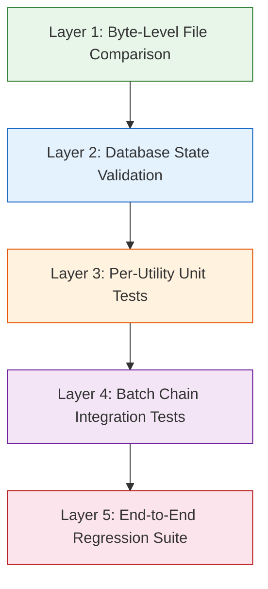
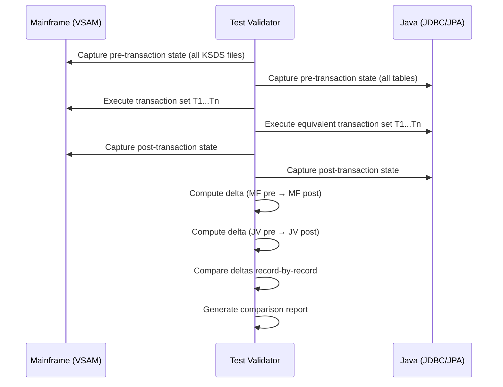
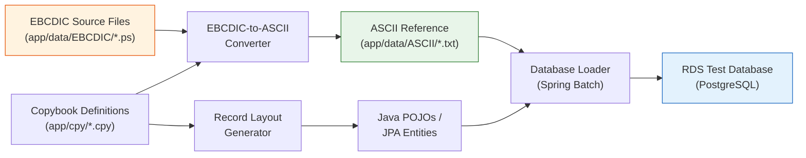
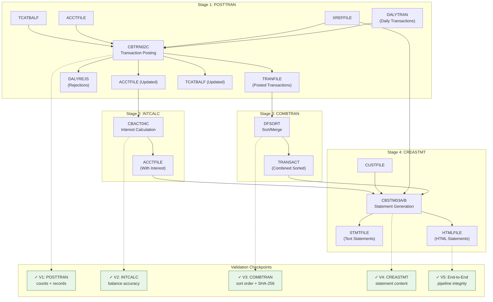
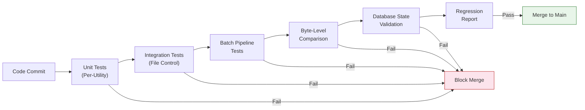

# 6. Testing & Validation Framework — Behavioral Parity Verification Strategy

> **Document Status:** Complete | **Last Updated:** 2024 | **Classification:** Migration Analysis
>
> This document defines the comprehensive testing and validation strategy for verifying that every migrated Java component demonstrates **byte-level behavioral parity** with its COBOL/CICS/VSAM mainframe counterpart. It covers file output comparison, database state validation, per-utility test case design with edge cases sourced from IBM documentation, sample data utilization, batch chain end-to-end validation, and regression test templates.

---

## Table of Contents

- [6.1 Testing Philosophy and Principles](#61-testing-philosophy-and-principles)
- [6.2 Byte-Level Comparison Strategy](#62-byte-level-comparison-strategy)
  - [6.2.1 File Output Comparison Methodology](#621-file-output-comparison-methodology)
  - [6.2.2 EBCDIC-to-ASCII Encoding Validation](#622-ebcdic-to-ascii-encoding-validation)
  - [6.2.3 COMP-3 Packed Decimal Comparison](#623-comp-3-packed-decimal-comparison)
  - [6.2.4 Fixed-Width Record Layout Validation](#624-fixed-width-record-layout-validation)
  - [6.2.5 SHA-256 Checksum Approach](#625-sha-256-checksum-approach)
- [6.3 Database State Validation](#63-database-state-validation)
  - [6.3.1 VSAM-to-JDBC State Comparison](#631-vsam-to-jdbc-state-comparison)
  - [6.3.2 Record-Level Comparison per KSDS Cluster](#632-record-level-comparison-per-ksds-cluster)
  - [6.3.3 Alternate Index Query Validation](#633-alternate-index-query-validation)
  - [6.3.4 Pre-/Post-Transaction State Snapshots](#634-pre-post-transaction-state-snapshots)
- [6.4 Per-Utility Test Case Design](#64-per-utility-test-case-design)
  - [6.4.1 CEEDAYS — Date-to-Lilian Conversion Tests](#641-ceedays--date-to-lilian-conversion-tests)
  - [6.4.2 CEE3ABD — Abend Exception Handling Tests](#642-cee3abd--abend-exception-handling-tests)
  - [6.4.3 CICS File Control — VSAM-to-JPA Operation Tests](#643-cics-file-control--vsam-to-jpa-operation-tests)
  - [6.4.4 CICS Terminal I/O — BMS-to-Web UI Tests](#644-cics-terminal-io--bms-to-web-ui-tests)
  - [6.4.5 IDCAMS — Dataset Lifecycle Tests](#645-idcams--dataset-lifecycle-tests)
  - [6.4.6 DFSORT — Sort and Merge Tests](#646-dfsort--sort-and-merge-tests)
  - [6.4.7 IEBGENER and IEFBR14 — File Copy and No-Op Tests](#647-iebgener-and-iefbr14--file-copy-and-no-op-tests)
- [6.5 Sample Data Utilization Plan](#65-sample-data-utilization-plan)
  - [6.5.1 ASCII Golden Datasets](#651-ascii-golden-datasets)
  - [6.5.2 EBCDIC Source Datasets](#652-ebcdic-source-datasets)
  - [6.5.3 Test Fixture Generation Strategy](#653-test-fixture-generation-strategy)
- [6.6 Batch Processing Chain Validation](#66-batch-processing-chain-validation)
  - [6.6.1 POSTTRAN Stage Validation](#661-posttran-stage-validation)
  - [6.6.2 INTCALC Stage Validation](#662-intcalc-stage-validation)
  - [6.6.3 COMBTRAN Stage Validation](#663-combtran-stage-validation)
  - [6.6.4 CREASTMT Stage Validation](#664-creastmt-stage-validation)
  - [6.6.5 End-to-End Pipeline Diagram](#665-end-to-end-pipeline-diagram)
- [6.7 Edge Case Catalog](#67-edge-case-catalog)
  - [6.7.1 Date Edge Cases](#671-date-edge-cases)
  - [6.7.2 Numeric Precision Edge Cases](#672-numeric-precision-edge-cases)
  - [6.7.3 EBCDIC Special Character Edge Cases](#673-ebcdic-special-character-edge-cases)
  - [6.7.4 VSAM Operation Edge Cases](#674-vsam-operation-edge-cases)
  - [6.7.5 Transaction and State Edge Cases](#675-transaction-and-state-edge-cases)
- [6.8 Regression Test Templates](#68-regression-test-templates)
  - [6.8.1 Language Environment Service Test Template](#681-language-environment-service-test-template)
  - [6.8.2 CICS File Control Test Template](#682-cics-file-control-test-template)
  - [6.8.3 CICS Terminal I/O Test Template](#683-cics-terminal-io-test-template)
  - [6.8.4 JCL Utility Test Template](#684-jcl-utility-test-template)
  - [6.8.5 Batch Pipeline Integration Test Template](#685-batch-pipeline-integration-test-template)
- [6.9 Validation Automation and CI/CD Integration](#69-validation-automation-and-cicd-integration)
- [Navigation](#navigation)

---

## 6.1 Testing Philosophy and Principles

### Core Testing Principle

Every migrated Java component must demonstrate **byte-level behavioral parity** with its COBOL counterpart. This means:

1. **Identical outputs** — Given the same inputs, the Java implementation must produce byte-for-byte identical file outputs, database states, and screen responses as the COBOL original.
2. **Identical error behavior** — Error conditions, abend codes, file status codes, and exception scenarios must map precisely to their Java equivalents with documented equivalence.
3. **Identical data transformations** — Numeric precision (COMP-3 packed decimal, COMP binary), character encoding (EBCDIC ↔ ASCII), and fixed-width record layouts must be preserved exactly.

### Validation Layers

The testing framework operates across five complementary validation layers:



| Layer | Scope | Validation Method | Frequency |
|:------|:------|:-----------------|:----------|
| **Layer 1** | File outputs (batch) | SHA-256 checksums + byte-by-byte `diff` | Every batch job execution |
| **Layer 2** | Database state (online + batch) | Record-level VSAM ↔ JDBC comparison | Every transaction cycle |
| **Layer 3** | Individual utility behavior | JUnit 5 unit tests per utility | Every code change (CI) |
| **Layer 4** | Batch processing chain | Pipeline integration tests with intermediate snapshots | Nightly / release |
| **Layer 5** | Full application regression | Complete test suite across all 28 programs | Release gate |

### Evidence Standard

All test results must produce **auditable evidence** that stakeholders can independently verify:

- SHA-256 hash comparison reports for batch file outputs
- SQL query result sets for database state comparisons
- JUnit test reports with pass/fail per test case
- Screenshot comparisons for BMS-to-web UI validation
- Performance benchmarks for sort/merge operations

> **Cross-Reference:** Utilities under test are fully cataloged in [Section 01 — Proprietary Utility Inventory](./01-proprietary-utility-inventory.md). IBM behavioral specifications used to define test cases are documented in [Section 02 — External Documentation Research](./02-external-documentation-research.md).

---

## 6.2 Byte-Level Comparison Strategy

### 6.2.1 File Output Comparison Methodology

Batch programs produce file outputs that must be compared byte-by-byte between the COBOL mainframe execution and the Java migrated execution.

**Comparison Process:**

1. **Capture mainframe output** — Execute each batch program (CBACT01C through CBTRN03C, CBSTM03A/B) on the mainframe (or mainframe emulator) with known input datasets and capture all output files.
2. **Capture Java output** — Execute the equivalent Java batch program with identical input datasets and capture all output files.
3. **Byte-level diff** — Compare files using binary diff (`cmp` on Linux or `fc /b` on Windows) to identify any byte-level discrepancies.
4. **Report generation** — Produce a structured comparison report listing: file name, mainframe SHA-256, Java SHA-256, match status, and byte offset of first difference (if any).

**Example comparison for CBTRN02C (Transaction Posting):**

The CBTRN02C program reads from `DALYTRAN` (daily transactions), writes to `TRANFILE` (transaction master), and produces `DALYREJS` (rejected transactions). All three output files require byte-level comparison.

Source: `app/cbl/CBTRN02C.cbl:29-49` — File control definitions:

```cobol
       SELECT DALYTRAN-FILE ASSIGN TO DALYTRAN
              ORGANIZATION IS SEQUENTIAL
              ACCESS MODE  IS SEQUENTIAL
              FILE STATUS  IS DALYTRAN-STATUS.

       SELECT TRANSACT-FILE ASSIGN TO TRANFILE
              ORGANIZATION IS INDEXED
              ACCESS MODE  IS RANDOM
              RECORD KEY   IS FD-TRANS-ID
              FILE STATUS  IS TRANFILE-STATUS.
```

**Java comparison equivalent:**

```java
import java.nio.file.Files;
import java.nio.file.Path;
import java.security.MessageDigest;
import java.util.Arrays;

public class BatchOutputComparator {

    public static ComparisonResult compareBatchOutputs(
            Path mainframeOutput, Path javaOutput) throws Exception {

        byte[] mainframeBytes = Files.readAllBytes(mainframeOutput);
        byte[] javaBytes = Files.readAllBytes(javaOutput);

        // SHA-256 checksum comparison
        MessageDigest digest = MessageDigest.getInstance("SHA-256");
        byte[] mainframeHash = digest.digest(mainframeBytes);
        digest.reset();
        byte[] javaHash = digest.digest(javaBytes);

        boolean hashMatch = Arrays.equals(mainframeHash, javaHash);

        // Byte-level diff for first discrepancy
        int firstDiffOffset = -1;
        int compareLength = Math.min(mainframeBytes.length, javaBytes.length);
        for (int i = 0; i < compareLength; i++) {
            if (mainframeBytes[i] != javaBytes[i]) {
                firstDiffOffset = i;
                break;
            }
        }

        return new ComparisonResult(
            hashMatch,
            mainframeBytes.length,
            javaBytes.length,
            firstDiffOffset,
            bytesToHex(mainframeHash),
            bytesToHex(javaHash)
        );
    }
}
```

### 6.2.2 EBCDIC-to-ASCII Encoding Validation

The CardDemo repository provides test data in both EBCDIC and ASCII formats, enabling direct encoding validation.

**Validation approach:**

1. Read EBCDIC source files from `app/data/EBCDIC/*.ps` as raw byte arrays
2. Apply EBCDIC-to-ASCII conversion using Java's `Charset.forName("IBM037")`
3. Compare the converted output byte-by-byte against the ASCII reference files in `app/data/ASCII/*.txt`
4. Report any character-level discrepancies with byte position and expected vs. actual values

**Critical constraint from IBM documentation:** COMP-3 packed decimal fields **must not** undergo EBCDIC-to-ASCII character conversion. The conversion process must know the exact position and length of each packed decimal field to exclude them from character translation. Standard file transfer tools like FTP with automatic character conversion do not account for packed decimal fields and may produce incorrect results.

Source: `app/data/EBCDIC/AWS.M2.CARDDEMO.ACCTDATA.PS` (15,000 bytes) vs. `app/data/ASCII/acctdata.txt` (15,050 bytes — includes line delimiters)

**EBCDIC code page mapping:**

| EBCDIC Code Page | Java Charset Name | Usage Context |
|:-----------------|:-----------------|:--------------|
| EBCDIC 037 | `IBM037` | US/Canada English — primary for CardDemo |
| EBCDIC 1140 | `IBM01140` | US/Canada with Euro sign |
| EBCDIC 500 | `IBM500` | International (Latin-1) |

**Java validation code:**

```java
import java.nio.charset.Charset;
import java.nio.file.Files;
import java.nio.file.Path;

public class EbcdicAsciiValidator {

    private static final Charset EBCDIC_CP037 = Charset.forName("IBM037");
    private static final Charset ASCII = Charset.forName("US-ASCII");

    /**
     * Validates EBCDIC-to-ASCII conversion for text-only fields.
     * COMP-3 packed decimal fields must be excluded from conversion.
     */
    public static ValidationResult validateEncoding(
            Path ebcdicFile,
            Path asciiReference,
            RecordLayout layout) throws Exception {

        byte[] ebcdicBytes = Files.readAllBytes(ebcdicFile);
        byte[] asciiRefBytes = Files.readAllBytes(asciiReference);

        int recordLength = layout.getRecordLength();
        int recordCount = ebcdicBytes.length / recordLength;
        int discrepancies = 0;

        for (int rec = 0; rec < recordCount; rec++) {
            int offset = rec * recordLength;
            for (FieldDefinition field : layout.getFields()) {
                if (field.isPackedDecimal()) {
                    // Skip COMP-3 fields — binary comparison only
                    continue;
                }
                // Convert EBCDIC text field to ASCII
                String ebcdicText = new String(
                    ebcdicBytes, offset + field.getStart(),
                    field.getLength(), EBCDIC_CP037);
                byte[] convertedAscii = ebcdicText.getBytes(ASCII);

                // Compare against reference
                for (int i = 0; i < field.getLength(); i++) {
                    int refPos = offset + field.getStart() + i;
                    if (refPos < asciiRefBytes.length
                            && convertedAscii[i] != asciiRefBytes[refPos]) {
                        discrepancies++;
                    }
                }
            }
        }
        return new ValidationResult(recordCount, discrepancies);
    }
}
```

### 6.2.3 COMP-3 Packed Decimal Comparison

COMP-3 (packed decimal) fields store two decimal digits per byte with the sign in the last nibble. These fields require specialized comparison logic because standard character encoding conversion will corrupt them.

**Packed decimal format specification:**

| COBOL Declaration | Storage Bytes | Digit Capacity | Example Value | Hex Representation |
|:-----------------|:-------------|:---------------|:-------------|:-------------------|
| `PIC S9(4) COMP-3` | 3 bytes | 4 digits + sign | +1234 | `01 23 4C` |
| `PIC S9(7) COMP-3` | 4 bytes | 7 digits + sign | -9876543 | `98 76 54 3D` |
| `PIC S9(9)V99 COMP-3` | 6 bytes | 11 digits + sign | +123456789.99 | `12 34 56 78 99 9C` |
| `PIC S9(9) COMP-3` | 5 bytes | 9 digits + sign | +999 | `00 00 00 99 9C` |

**Sign nibble values:**

| Nibble Value | Meaning |
|:-------------|:--------|
| `C` (1100) | Positive |
| `D` (1101) | Negative |
| `F` (1111) | Unsigned (positive) |

**CardDemo COMP-3 fields requiring validation** (Source: `app/cbl/CBSTM03A.CBL:59-65`, `app/cbl/COACTUPC.cbl:62-63,152-158`):

```cobol
      * From CBSTM03A.CBL — Statement generation
       01  COMP-VARIABLES          COMP.
           05  CR-CNT              PIC S9(4) VALUE 0.
           05  TR-CNT              PIC S9(4) VALUE 0.
       01  COMP3-VARIABLES         COMP-3.
           05  WS-TOTAL-AMT        PIC S9(9)V99 VALUE 0.

      * From COACTUPC.cbl — Account update
       05 WS-CALCULATION-VARS.
        10 WS-DIV-BY               PIC S9(4) COMP-3 VALUE 4.
        10 WS-DIVIDEND             PIC S9(4) COMP-3 VALUE 0.
        10 WS-REMAINDER            PIC S9(4) COMP-3 VALUE 0.
```

**Java packed decimal comparison:**

```java
import java.math.BigDecimal;

public class PackedDecimalComparator {

    /**
     * Converts COMP-3 packed decimal bytes to BigDecimal.
     * Each byte contains two BCD digits; the last nibble is the sign.
     */
    public static BigDecimal unpackComp3(byte[] packedBytes, int scale) {
        StringBuilder digits = new StringBuilder();
        for (int i = 0; i < packedBytes.length; i++) {
            int highNibble = (packedBytes[i] >> 4) & 0x0F;
            int lowNibble = packedBytes[i] & 0x0F;
            if (i < packedBytes.length - 1) {
                digits.append(highNibble);
                digits.append(lowNibble);
            } else {
                // Last byte: high nibble is digit, low nibble is sign
                digits.append(highNibble);
            }
        }

        int signNibble = packedBytes[packedBytes.length - 1] & 0x0F;
        boolean negative = (signNibble == 0x0D);

        BigDecimal value = new BigDecimal(digits.toString());
        if (scale > 0) {
            value = value.movePointLeft(scale);
        }
        return negative ? value.negate() : value;
    }

    /**
     * Compares two packed decimal fields for exact value equivalence.
     */
    public static boolean comparePackedDecimals(
            byte[] mainframeField, byte[] javaField, int scale) {
        BigDecimal mainframeValue = unpackComp3(mainframeField, scale);
        BigDecimal javaValue = unpackComp3(javaField, scale);
        return mainframeValue.compareTo(javaValue) == 0;
    }
}
```

### 6.2.4 Fixed-Width Record Layout Validation

All CardDemo VSAM files use fixed-width records. The Java migration must preserve exact field positions as defined in the copybook layouts.

**Validation approach:**

1. Parse the COBOL copybook to extract field definitions (name, PIC clause, start position, length)
2. Read a record from both mainframe and Java outputs
3. Extract each field by position and length
4. Compare field values accounting for data type (text via encoding, numeric via packed decimal, binary via raw bytes)

**Record layout test for ACCTFILE** (Source: `app/cbl/CBACT01C.cbl:38-40`):

```
Record Length: 300 bytes
Field Layout:
  Offset 0-10:   FD-ACCT-ID        PIC 9(11)    — Account ID (primary key)
  Offset 11-299: FD-ACCT-DATA      PIC X(289)   — Account data fields
```

**Detailed ACCOUNT-RECORD layout** (from copybook `CVACT01Y`):

| Field Name | PIC Clause | Start | Length | Type |
|:-----------|:-----------|:------|:-------|:-----|
| ACCT-ID | `9(11)` | 0 | 11 | Zoned decimal |
| ACCT-ACTIVE-STATUS | `X` | 11 | 1 | Character |
| ACCT-CURR-BAL | `S9(10)V99` | 12 | 12 | Signed zoned |
| ACCT-CREDIT-LIMIT | `S9(10)V99` | 24 | 12 | Signed zoned |
| ACCT-CASH-CREDIT-LIMIT | `S9(10)V99` | 36 | 12 | Signed zoned |
| ACCT-OPEN-DATE | `X(10)` | 48 | 10 | Character (YYYY-MM-DD) |
| ACCT-EXPIRAION-DATE | `X(10)` | 58 | 10 | Character (YYYY-MM-DD) |
| ACCT-REISSUE-DATE | `X(10)` | 68 | 10 | Character (YYYY-MM-DD) |
| ACCT-CURR-CYC-CREDIT | `S9(10)V99` | 78 | 12 | Signed zoned |
| ACCT-CURR-CYC-DEBIT | `S9(10)V99` | 90 | 12 | Signed zoned |
| ACCT-GROUP-ID | `X(10)` | 102 | 10 | Character |
| FILLER | `X(188)` | 112 | 188 | Padding |

**Java validation:**

```java
public class RecordLayoutValidator {

    public static RecordValidationResult validateRecord(
            byte[] mainframeRecord,
            byte[] javaRecord,
            List<FieldDefinition> fields) {

        List<FieldMismatch> mismatches = new ArrayList<>();

        for (FieldDefinition field : fields) {
            byte[] mfFieldBytes = Arrays.copyOfRange(
                mainframeRecord, field.getStart(),
                field.getStart() + field.getLength());
            byte[] javaFieldBytes = Arrays.copyOfRange(
                javaRecord, field.getStart(),
                field.getStart() + field.getLength());

            if (!Arrays.equals(mfFieldBytes, javaFieldBytes)) {
                mismatches.add(new FieldMismatch(
                    field.getName(),
                    field.getStart(),
                    field.getLength(),
                    bytesToHex(mfFieldBytes),
                    bytesToHex(javaFieldBytes)
                ));
            }
        }

        return new RecordValidationResult(
            mismatches.isEmpty(),
            mainframeRecord.length,
            javaRecord.length,
            mismatches
        );
    }
}
```

### 6.2.5 SHA-256 Checksum Approach

For large batch output files, SHA-256 checksums provide a fast first-pass validation before detailed byte-level analysis.

**Checksum workflow:**

1. After each batch job execution (both mainframe and Java), compute SHA-256 of all output files
2. Store checksums in a validation registry with timestamp, job name, and file name
3. Compare mainframe checksums against Java checksums
4. If checksums match → **PASS** (files are byte-identical)
5. If checksums differ → trigger detailed byte-level diff to identify exact discrepancies

**Checksum registry schema:**

| Column | Type | Description |
|:-------|:-----|:------------|
| `job_name` | VARCHAR(30) | Batch job identifier (e.g., `CBTRN02C`) |
| `file_name` | VARCHAR(100) | Output file path |
| `platform` | ENUM('MAINFRAME','JAVA') | Execution platform |
| `sha256_hash` | CHAR(64) | Hex-encoded SHA-256 hash |
| `file_size_bytes` | BIGINT | File size in bytes |
| `record_count` | INT | Number of records |
| `execution_timestamp` | TIMESTAMP | When the job was executed |

**Java checksum computation:**

```java
import java.nio.file.Files;
import java.nio.file.Path;
import java.security.MessageDigest;

public class BatchChecksumValidator {

    public static String computeSHA256(Path filePath) throws Exception {
        MessageDigest digest = MessageDigest.getInstance("SHA-256");
        byte[] fileBytes = Files.readAllBytes(filePath);
        byte[] hash = digest.digest(fileBytes);
        StringBuilder hexString = new StringBuilder();
        for (byte b : hash) {
            hexString.append(String.format("%02x", b));
        }
        return hexString.toString();
    }

    public static boolean validateBatchOutput(
            Path mainframeFile, Path javaFile) throws Exception {
        String mfHash = computeSHA256(mainframeFile);
        String javaHash = computeSHA256(javaFile);
        return mfHash.equals(javaHash);
    }
}
```

---

## 6.3 Database State Validation

### 6.3.1 VSAM-to-JDBC State Comparison

After transaction processing, the migrated Java application's database state (RDS/PostgreSQL) must exactly match the VSAM file state that the COBOL application would produce.

**Comparison methodology:**

1. **Baseline capture** — Before transaction processing, dump all VSAM file contents and all RDS table contents into normalized CSV format
2. **Transaction execution** — Execute the same sequence of transactions on both platforms
3. **Post-transaction capture** — Dump all VSAM file and RDS table contents again
4. **Delta comparison** — Compare the deltas (inserts, updates, deletes) between pre- and post-states on each platform
5. **Record-by-record validation** — For each affected record, compare every field value

**State comparison diagram:**



### 6.3.2 Record-Level Comparison per KSDS Cluster

Each of the 13 VSAM KSDS clusters identified in `app/catlg/LISTCAT.txt` must be validated independently.

**KSDS clusters requiring validation:**

| VSAM Cluster | Record Length | Key Length | Key Position (RKP) | RDS Target Table | Primary Key Column |
|:-------------|:------------|:-----------|:-------------------|:-----------------|:------------------|
| `AWS.M2.CARDDEMO.ACCTDATA.VSAM.KSDS` | 300 | 11 | 0 | `account` | `acct_id` |
| `AWS.M2.CARDDEMO.CARDDATA.VSAM.KSDS` | 150 | 16 | 0 | `card` | `card_num` |
| `AWS.M2.CARDDEMO.CARDXREF.VSAM.KSDS` | 50 | 16 | 0 | `card_xref` | `card_num` |
| `AWS.M2.CARDDEMO.CUSTDATA.VSAM.KSDS` | 500 | 9 | 0 | `customer` | `cust_id` |
| `AWS.M2.CARDDEMO.DISCGRP.VSAM.KSDS` | 51 | 11 | 0 | `discount_group` | `group_key` |
| `AWS.M2.CARDDEMO.TRANSACT.VSAM.KSDS` | 350 | 16 | 0 | `transaction` | `tran_id` |
| `AWS.M2.CARDDEMO.TRANCATG.VSAM.KSDS` | 18 | 4 | 0 | `tran_category` | `tran_cat_cd` |
| `AWS.M2.CARDDEMO.TRANTYPE.VSAM.KSDS` | 60 | 2 | 0 | `tran_type` | `tran_type_cd` |
| `AWS.M2.CARDDEMO.TCATBALF.VSAM.KSDS` | 50 | 17 | 0 | `tran_cat_balance` | `(acct_id, type_cd, cat_cd)` |
| `AWS.M2.CARDDEMO.USRSEC.VSAM.KSDS` | 80 | 8 | 0 | `user_security` | `user_id` |

Source: `app/catlg/LISTCAT.txt` — KSDS attributes including KEYLEN, MAXLRECL, RKP

**Per-cluster validation query template:**

```sql
-- Compare record count
SELECT 'MAINFRAME' AS source, COUNT(*) AS record_count FROM vsam_acctdata_snapshot
UNION ALL
SELECT 'JAVA' AS source, COUNT(*) AS record_count FROM account;

-- Compare specific record by primary key
SELECT m.*, j.*,
  CASE WHEN m.acct_curr_bal = j.acct_curr_bal THEN 'MATCH' ELSE 'MISMATCH' END AS bal_check,
  CASE WHEN m.acct_credit_limit = j.acct_credit_limit THEN 'MATCH' ELSE 'MISMATCH' END AS limit_check
FROM vsam_acctdata_snapshot m
JOIN account j ON m.acct_id = j.acct_id
WHERE m.acct_curr_bal != j.acct_curr_bal
   OR m.acct_credit_limit != j.acct_credit_limit;
```

### 6.3.3 Alternate Index Query Validation

Three Alternate Indexes (AIX) defined in `app/catlg/LISTCAT.txt` enable non-primary-key access patterns that must produce identical results in the Java implementation:

| AIX Name | Base Cluster | AIX Key | Uniqueness | Java Equivalent |
|:---------|:------------|:--------|:-----------|:---------------|
| `TRANSACT-AIX1` | TRANSACT | Card Number | Non-unique | `@Query("SELECT t FROM Transaction t WHERE t.cardNum = ?1")` |
| `TRANSACT-AIX2` | TRANSACT | Account ID | Non-unique | `JpaRepository.findByAccountId(accountId)` |
| `CARDXREF-AIX1` | CARDXREF | Account ID | Non-unique | `JpaRepository.findByAccountId(accountId)` |

**AIX validation tests:**

1. Query by AIX key on mainframe using `EXEC CICS STARTBR` / `READNEXT` with the alternate index
2. Query by equivalent Java index (JPA `@Query` or Spring Data derived query)
3. Compare result sets: same records, same order, same count
4. Verify non-unique key scenarios return all matching records

### 6.3.4 Pre-/Post-Transaction State Snapshots

Every test execution captures database state snapshots before and after transaction processing.

**Snapshot capture process:**

1. **Pre-snapshot** — Dump all tables to timestamped CSV files before transaction batch
2. **Execute transactions** — Run the full transaction set on both platforms
3. **Post-snapshot** — Dump all tables after transaction batch
4. **Delta computation** — Compute inserted, updated, and deleted records per table
5. **Cross-platform delta comparison** — Verify identical deltas between mainframe and Java

**Snapshot storage structure:**

```
test-results/
├── run-20240115-143000/
│   ├── pre-snapshot/
│   │   ├── mainframe/
│   │   │   ├── acctdata.csv
│   │   │   ├── transact.csv
│   │   │   └── ...
│   │   └── java/
│   │       ├── account.csv
│   │       ├── transaction.csv
│   │       └── ...
│   ├── post-snapshot/
│   │   ├── mainframe/
│   │   └── java/
│   ├── delta-report.json
│   └── comparison-summary.html
```

---

## 6.4 Per-Utility Test Case Design

### 6.4.1 CEEDAYS — Date-to-Lilian Conversion Tests

The CEEDAYS callable service converts character dates to Lilian format (integer days since October 14, 1582). The Java equivalent (`java.time.LocalDate` with custom Lilian epoch adjustment) must produce identical Lilian values for all date inputs.

Source: `app/cbl/CSUTLDTC.cbl:116-120` — CEEDAYS invocation:

```cobol
           CALL "CEEDAYS" USING
                  WS-DATE-TO-TEST,
                  WS-DATE-FORMAT,
                  OUTPUT-LILLIAN,
                  FEEDBACK-CODE
```

**Test cases derived from IBM documentation** (see [Section 02](./02-external-documentation-research.md#221-ceedays--convert-date-to-lilian-format)):

| Test ID | Input Date | Picture String | Expected Lilian | Category | Source |
|:--------|:-----------|:--------------|:---------------|:---------|:-------|
| CEEDAYS-001 | `10/15/1582` | `MM/DD/YYYY` | 1 | Boundary — first valid date | IBM LE Reference |
| CEEDAYS-002 | `12/31/9999` | `MM/DD/YYYY` | 3,074,324 | Boundary — last valid date | IBM LE Reference |
| CEEDAYS-003 | `01/01/2000` | `MM/DD/YYYY` | 152,385 | Y2K boundary | IBM LE Reference |
| CEEDAYS-004 | `12/31/1999` | `MM/DD/YYYY` | 152,384 | Y2K eve | Calculated |
| CEEDAYS-005 | `01/01/2001` | `MM/DD/YYYY` | 152,751 | Century boundary +1 | Calculated |
| CEEDAYS-006 | `02/29/2000` | `MM/DD/YYYY` | 152,444 | Leap year (divisible by 400) | Leap year rule |
| CEEDAYS-007 | `02/29/2024` | `MM/DD/YYYY` | 161,215 | Standard leap year | Leap year rule |
| CEEDAYS-008 | `02/29/1900` | `MM/DD/YYYY` | Error (FC) | Non-leap century year | Edge case |
| CEEDAYS-009 | `02/28/1900` | `MM/DD/YYYY` | 115,876 | Day before non-leap day | Edge case |
| CEEDAYS-010 | `2024-01-15` | `YYYY-MM-DD` | 161,170 | CardDemo date format | App-specific |
| CEEDAYS-011 | `20240115` | `YYYYMMDD` | 161,170 | Compact format | Format variation |
| CEEDAYS-012 | `10/14/1582` | `MM/DD/YYYY` | Error (FC) | Below valid range | IBM LE Reference |
| CEEDAYS-013 | `00/00/0000` | `MM/DD/YYYY` | Error (FC) | Invalid date — zeros | Edge case |
| CEEDAYS-014 | `02/30/2024` | `MM/DD/YYYY` | Error (FC) | Invalid day for month | Edge case |
| CEEDAYS-015 | `13/01/2024` | `MM/DD/YYYY` | Error (FC) | Invalid month (13) | Edge case |
| CEEDAYS-016 | `  01/01/2000  ` | `MM/DD/YYYY` | 152,385 | Leading/trailing blanks | IBM LE: blanks are parsed |
| CEEDAYS-017 | `ABCDEFGH` | `MM/DD/YYYY` | Error (FC) | Non-numeric data | Edge case |

**Feedback code validation** (Source: `app/cbl/CSUTLDTC.cbl:60-70`):

| Feedback Condition | Hex Value | Expected Java Exception |
|:-------------------|:----------|:-----------------------|
| `FC-INVALID-DATE` (valid) | `X'0000000000000000'` | No exception — return Lilian value |
| `FC-INSUFFICIENT-DATA` | `X'000309CB59C3C5C5'` | `DateConversionException("Insufficient data")` |
| `FC-BAD-DATE-VALUE` | `X'000309CC59C3C5C5'` | `DateConversionException("Bad date value")` |
| `FC-INVALID-ERA` | `X'000309CD59C3C5C5'` | `DateConversionException("Invalid era")` |
| `FC-UNSUPP-RANGE` | `X'000309D159C3C5C5'` | `DateConversionException("Unsupported range")` |
| `FC-INVALID-MONTH` | `X'000309D559C3C5C5'` | `DateConversionException("Invalid month")` |
| `FC-BAD-PIC-STRING` | `X'000309D659C3C5C5'` | `DateConversionException("Bad picture string")` |
| `FC-NON-NUMERIC-DATA` | `X'000309D859C3C5C5'` | `DateConversionException("Non-numeric data")` |
| `FC-YEAR-IN-ERA-ZERO` | `X'000309D959C3C5C5'` | `DateConversionException("Year in era is zero")` |

**Java Lilian date converter validation:**

```java
import java.time.LocalDate;
import java.time.temporal.ChronoUnit;

public class LilianDateConverter {

    // Lilian epoch: October 14, 1582 (Lilian day 0)
    private static final LocalDate LILIAN_EPOCH =
        LocalDate.of(1582, 10, 14);

    public static long toLilian(LocalDate date) {
        if (date.isBefore(LocalDate.of(1582, 10, 15))) {
            throw new DateConversionException("Unsupported range");
        }
        return ChronoUnit.DAYS.between(LILIAN_EPOCH, date);
    }

    public static LocalDate fromLilian(long lilianDay) {
        if (lilianDay < 1 || lilianDay > 3_074_324) {
            throw new DateConversionException("Unsupported range");
        }
        return LILIAN_EPOCH.plusDays(lilianDay);
    }
}
```

### 6.4.2 CEE3ABD — Abend Exception Handling Tests

CEE3ABD terminates an enclave with a user abend code. All 9 batch programs in CardDemo use identical invocation patterns with abend code 999 and timing parameter 0.

Source: `app/cbl/CBACT01C.cbl:169-173`:

```cobol
       9999-ABEND-PROGRAM.
           DISPLAY 'ABENDING PROGRAM'
           MOVE 0 TO TIMING
           MOVE 999 TO ABCODE
           CALL 'CEE3ABD'.
```

**Test cases:**

| Test ID | Program | Trigger Condition | ABCODE | TIMING | Expected Java Behavior |
|:--------|:--------|:-----------------|:-------|:-------|:----------------------|
| ABD-001 | CBACT01C | OPEN failure on ACCTFILE | 999 | 0 | `throw new ApplicationAbendException(999, "CBACT01C")` |
| ABD-002 | CBACT01C | READ error (not status '00' or '10') | 999 | 0 | `throw new ApplicationAbendException(999, "CBACT01C")` |
| ABD-003 | CBACT01C | CLOSE failure | 999 | 0 | `throw new ApplicationAbendException(999, "CBACT01C")` |
| ABD-004 | CBTRN02C | DALYTRAN OPEN failure | 999 | 0 | `throw new ApplicationAbendException(999, "CBTRN02C")` |
| ABD-005 | CBTRN02C | TRANFILE OPEN failure | 999 | 0 | `throw new ApplicationAbendException(999, "CBTRN02C")` |
| ABD-006 | CBTRN02C | XREFFILE OPEN failure | 999 | 0 | `throw new ApplicationAbendException(999, "CBTRN02C")` |
| ABD-007 | CBSTM03A | File I/O failure via CBSTM03B | 999 | 0 | `throw new ApplicationAbendException(999, "CBSTM03A")` |
| ABD-008 | All 9 batch | Verify DISPLAY message output | 999 | 0 | Logger output: "ABENDING PROGRAM" |
| ABD-009 | All 9 batch | Verify RETURN-CODE set | 999 | 0 | Process exit code = non-zero |

**Validation criteria:**
- Java exception class includes the abend code (999) as a property
- Exception message includes the program name for traceability
- Logging output matches the COBOL DISPLAY statement
- Process exit code is non-zero (matching mainframe abend behavior)

### 6.4.3 CICS File Control — VSAM-to-JPA Operation Tests

The 8 CICS file control commands (`READ`, `WRITE`, `REWRITE`, `DELETE`, `STARTBR`, `READNEXT`, `READPREV`, `ENDBR`) used across 19 online programs must map precisely to JPA/JDBC operations.

**Test matrix:**

| CICS Command | VSAM Operation | JPA Equivalent | Test Validation |
|:-------------|:--------------|:---------------|:----------------|
| `EXEC CICS READ FILE('ACCTFIL') INTO(...) RIDFLD(...)` | KSDS read by primary key | `repository.findById(key)` | Same record returned, all fields match |
| `EXEC CICS READ ... UPDATE` | KSDS read for update (lock) | `@Lock(PESSIMISTIC_WRITE) findById()` | Record locked, concurrent access blocked |
| `EXEC CICS WRITE FILE('ACCTFIL') FROM(...) RIDFLD(...)` | KSDS insert | `repository.save(entity)` | New record persisted, key verified |
| `EXEC CICS REWRITE FILE('ACCTFIL') FROM(...)` | KSDS update (after READ UPDATE) | `repository.save(existingEntity)` | Updated fields match, other fields unchanged |
| `EXEC CICS DELETE FILE('ACCTFIL') RIDFLD(...)` | KSDS delete by key | `repository.deleteById(key)` | Record removed, key no longer found |
| `EXEC CICS STARTBR FILE('ACCTFIL') RIDFLD(...)` | Start browse at key position | `CriteriaQuery` with `>=` predicate | Cursor positioned correctly |
| `EXEC CICS READNEXT FILE('ACCTFIL') INTO(...)` | Read next in key sequence | Iterator.next() from ordered query | Records in ascending key order |
| `EXEC CICS READPREV FILE('ACCTFIL') INTO(...)` | Read previous in key sequence | Reverse-ordered query result | Records in descending key order |
| `EXEC CICS ENDBR FILE('ACCTFIL')` | End browse session | Close EntityManager/cursor | Resources released |

**Error condition mapping:**

| CICS Condition | File Status | Java Equivalent |
|:--------------|:-----------|:----------------|
| `NOTFND` | 23 | `EmptyResultDataAccessException` or `Optional.empty()` |
| `DUPREC` | 22 | `DataIntegrityViolationException` (duplicate key) |
| `NOSPACE` | 24 | `DataAccessResourceFailureException` |
| `INVREQ` | N/A | `InvalidDataAccessApiUsageException` |
| `IOERR` | 12 | `DataAccessException` (general I/O error) |
| `LENGERR` | N/A | `TypeMismatchDataAccessException` |

### 6.4.4 CICS Terminal I/O — BMS-to-Web UI Tests

BMS map SEND/RECEIVE operations across 19 online programs must produce equivalent web UI behavior.

**Test approach:**

1. **Field-level content comparison** — Compare every BMS map field value against the corresponding HTML/REST response field
2. **Attribute mapping validation** — Verify BMS character attributes (DFHBMSCA: color, highlighting, protection) map to CSS classes
3. **AID key mapping** — Verify PF key handling (DFHAID: PF3=Back, PF7=PageUp, PF12=Cancel) maps to button/keyboard event handlers

**BMS-to-Web field mapping test template:**

| BMS Field Name | BMS Attribute | HTML Element | CSS Class | Validation |
|:---------------|:-------------|:------------|:----------|:-----------|
| `ACCTSIDI` | `UNPROT,NUM,FSET` | `<input type="text" id="acctId">` | `field-numeric` | Input accepts only numbers |
| `ACTSTATI` | `UNPROT,FSET` | `<input type="text" id="acctStatus">` | `field-alpha` | Input accepts Y/N only |
| `ERRMSGSO` | `PROT,BRT` | `<span id="errorMsg">` | `field-error text-bright` | Read-only, highlighted |

### 6.4.5 IDCAMS — Dataset Lifecycle Tests

IDCAMS operations referenced in the README batch job catalog must have equivalent validation in the Java/AWS environment.

**Test cases:**

| Test ID | IDCAMS Command | CardDemo Context | Java/AWS Equivalent | Validation |
|:--------|:--------------|:----------------|:-------------------|:-----------|
| IDC-001 | `DEFINE CLUSTER` | DEFVSAM job — creates VSAM KSDS files | `CREATE TABLE` DDL via Flyway | Table exists with correct schema |
| IDC-002 | `REPRO` | LOADVSAM job — loads data from sequential to VSAM | Spring Batch `ItemReader`→`ItemWriter` | Record count and content match |
| IDC-003 | `DELETE` | Cleanup job — removes VSAM clusters | `DROP TABLE` or `TRUNCATE TABLE` | Table removed/empty |
| IDC-004 | `ALTER` | Modify VSAM attributes | `ALTER TABLE` DDL | Schema changes applied |
| IDC-005 | `LISTCAT` | DEFVSAM job — catalog query | JPA metadata query + JDBC `DatabaseMetaData` | Table list and attributes match |
| IDC-006 | `DEFINE ALTERNATEINDEX` | AIX creation for TRANSACT, CARDXREF | `CREATE INDEX` DDL | Index exists, query returns same results |

### 6.4.6 DFSORT — Sort and Merge Tests

DFSORT is used in the COMBTRAN batch job to sort/merge transaction records. The Java implementation using `java.util.Comparator` must produce byte-identical sorted output.

**Test cases:**

| Test ID | Operation | Sort Key | Order | Input Records | Validation |
|:--------|:---------|:---------|:------|:-------------|:-----------|
| SRT-001 | SORT | Transaction ID (pos 1, len 16) | Ascending | `app/data/ASCII/dailytran.txt` (300 records) | Output file SHA-256 match |
| SRT-002 | SORT | Account ID + Date | Ascending compound | Subset of transaction records | Field-level order verification |
| SRT-003 | MERGE | Transaction ID | Ascending | Two pre-sorted input files | Merged output in correct order |
| SRT-004 | SORT | Numeric key with COMP-3 | Ascending | Records with packed decimal keys | Numeric sort order preserved |
| SRT-005 | SORT | Empty input file | N/A | 0 records | Empty output file (no error) |
| SRT-006 | SORT | Single record | Ascending | 1 record | Output equals input |
| SRT-007 | SORT | Duplicate keys | Ascending (stable) | Records with same key | Relative order of duplicates preserved |

**Java sort validation:**

```java
import java.util.Comparator;
import java.util.List;

public class TransactionSortValidator {

    /**
     * Comparator matching DFSORT FIELDS specification for COMBTRAN job.
     * Sort by transaction ID (positions 1-16), ascending order.
     */
    public static final Comparator<TransactionRecord> COMBTRAN_SORT =
        Comparator.comparing(TransactionRecord::getTransactionId);

    public static boolean validateSortOrder(List<TransactionRecord> sorted) {
        for (int i = 1; i < sorted.size(); i++) {
            if (COMBTRAN_SORT.compare(sorted.get(i - 1), sorted.get(i)) > 0) {
                return false; // Out of order
            }
        }
        return true;
    }
}
```

### 6.4.7 IEBGENER and IEFBR14 — File Copy and No-Op Tests

**IEBGENER tests** (used in DUSRSECJ job for user security file loading):

| Test ID | Input | Expected Output | Validation |
|:--------|:------|:---------------|:-----------|
| GEN-001 | User security sequential file | Exact copy of input | SHA-256 hash match |
| GEN-002 | Empty input file | Empty output file | Size = 0, no errors |
| GEN-003 | Single-record file | Exact copy | Content match |
| GEN-004 | Large file (>10,000 records) | Exact copy | SHA-256 hash match, record count match |

```java
// Java equivalent: java.nio.file.Files.copy()
Path source = Path.of("usrsec_input.dat");
Path target = Path.of("usrsec_output.dat");
Files.copy(source, target, StandardCopyOption.REPLACE_EXISTING);
// Validation: SHA-256(source) == SHA-256(target)
```

**IEFBR14 tests** (used in CLOSEFIL and OPENFIL jobs):

| Test ID | JCL Job | Purpose | Java/AWS Equivalent | Validation |
|:--------|:--------|:--------|:-------------------|:-----------|
| BR14-001 | CLOSEFIL | Make VSAM files unavailable | Service endpoint stop or DB connection pool drain | VSAM files not accessible after execution |
| BR14-002 | OPENFIL | Make VSAM files available | Service endpoint start or DB connection pool init | VSAM files accessible after execution |

> **Note:** IEFBR14 is a no-operation utility — all work is performed by JCL DD statements for dataset allocation/deallocation. In Java/AWS, this maps to infrastructure provisioning operations (CloudFormation resource creation/deletion) rather than application code.

---

## 6.5 Sample Data Utilization Plan

### 6.5.1 ASCII Golden Datasets

The following ASCII test datasets in `app/data/ASCII/` serve as **golden reference files** for migration validation:

| File | Records | Record Length | Primary Key | Content |
|:-----|:--------|:------------|:-----------|:--------|
| `acctdata.txt` | 50 | 300 bytes (+line delimiter) | Acct ID (pos 0-10) | Account master data |
| `carddata.txt` | 50 | 150 bytes | Card Number (pos 0-15) | Card information |
| `cardxref.txt` | 37 | 50 bytes | Card Number (pos 0-15) | Card-to-account cross-reference |
| `custdata.txt` | 50 | 500 bytes | Customer ID (pos 0-8) | Customer master data |
| `dailytran.txt` | 300 | 350 bytes | Transaction ID (pos 0-15) | Daily transaction records |
| `discgrp.txt` | 51 | 51 bytes | Group Key (pos 0-10) | Discount group definitions |
| `tcatbal.txt` | 51 | 50 bytes | Compound key (pos 0-16) | Transaction category balances |
| `trancatg.txt` | 61 | 18 bytes | Category Code (pos 0-3) | Transaction categories |
| `trantype.txt` | 7 | 60 bytes | Type Code (pos 0-1) | Transaction type definitions |

**Usage as golden datasets:**

1. Load ASCII datasets into the Java application's RDS database during test setup
2. Execute identical transactions on both platforms
3. Export Java database state to flat files matching the ASCII format
4. Compare exported files against expected golden outputs using byte-level comparison

### 6.5.2 EBCDIC Source Datasets

The EBCDIC test datasets in `app/data/EBCDIC/` provide the mainframe-native representation for encoding validation:

| EBCDIC File | Size (bytes) | ASCII Equivalent | Record Length |
|:------------|:------------|:----------------|:------------|
| `AWS.M2.CARDDEMO.ACCTDATA.PS` | 15,000 | `acctdata.txt` (15,050) | 300 |
| `AWS.M2.CARDDEMO.CARDDATA.PS` | 7,500 | `carddata.txt` (7,550) | 150 |
| `AWS.M2.CARDDEMO.CARDXREF.PS` | 2,500 | `cardxref.txt` (1,850) | 50 |
| `AWS.M2.CARDDEMO.CUSTDATA.PS` | 25,000 | `custdata.txt` (25,050) | 500 |
| `AWS.M2.CARDDEMO.DALYTRAN.PS` | 105,000 | `dailytran.txt` (105,300) | 350 |
| `AWS.M2.CARDDEMO.DISCGRP.PS` | 2,550 | `discgrp.txt` (2,601) | 51 |
| `AWS.M2.CARDDEMO.TCATBALF.PS` | 2,500 | `tcatbal.txt` (2,550) | 50 |
| `AWS.M2.CARDDEMO.TRANCATG.PS` | 1,080 | `trancatg.txt` (1,098) | 18 |
| `AWS.M2.CARDDEMO.TRANTYPE.PS` | 420 | `trantype.txt` (427) | 60 |
| `AWS.M2.CARDDEMO.USRSEC.PS` | 800 | N/A (no ASCII equiv) | 80 |

> **Size difference note:** EBCDIC files contain raw fixed-length records with no line delimiters. ASCII files include newline characters (`\n` = 1 byte) after each record, accounting for the size difference (e.g., 50 records × 1 byte = 50 additional bytes for `acctdata.txt`).

### 6.5.3 Test Fixture Generation Strategy

**Test data pipeline:**



**Test fixture steps:**

1. **Schema generation** — Use copybook field definitions to generate JPA entity classes and DDL scripts
2. **Data loading** — Use Spring Batch to read ASCII golden datasets and populate the test database
3. **Baseline snapshot** — Capture the initial database state as JSON/CSV for comparison
4. **Test execution** — Run the test scenario (transactions, queries, batch jobs)
5. **Result capture** — Export database state and file outputs
6. **Comparison** — Execute byte-level and record-level comparisons against golden datasets

**Test database initialization script:**

```sql
-- Load golden datasets into test tables
\COPY account FROM 'app/data/ASCII/acctdata.txt'
    WITH (FORMAT text, DELIMITER E'\t');
\COPY card FROM 'app/data/ASCII/carddata.txt'
    WITH (FORMAT text, DELIMITER E'\t');
\COPY customer FROM 'app/data/ASCII/custdata.txt'
    WITH (FORMAT text, DELIMITER E'\t');
-- Repeat for all 9 datasets
```

---

## 6.6 Batch Processing Chain Validation

The CardDemo batch processing chain consists of four sequential stages. Each stage must be validated independently and as part of the complete pipeline.

### 6.6.1 POSTTRAN Stage Validation

**Program:** CBTRN02C (Transaction Posting)

**Input files:** DALYTRAN (daily transactions), XREFFILE (card cross-reference), ACCTFILE (accounts), TCATBALF (category balances)

**Output files:** TRANFILE (posted transactions), DALYREJS (rejected transactions)

Source: `app/cbl/CBTRN02C.cbl:193-234` — Main processing loop

**Validation checkpoints:**

| Checkpoint | Validation Method |
|:-----------|:-----------------|
| Transaction count matches | `WS-TRANSACTION-COUNT` in COBOL = Java processed count |
| Rejection count matches | `WS-REJECT-COUNT` in COBOL = Java rejection count |
| TRANFILE record content | Byte-level comparison of posted records |
| DALYREJS rejection reasons | Validation trailer content matches (reason codes 0001-9999) |
| ACCTFILE balance updates | `ACCT-CURR-BAL` reflects posted transaction amounts |
| TCATBALF category totals | Category balance accumulators match |
| RETURN-CODE on rejection | `RETURN-CODE = 4` when rejections exist (Source: `CBTRN02C.cbl:229-231`) |

### 6.6.2 INTCALC Stage Validation

**Program:** CBACT04C (Interest Calculation)

**Input:** ACCTFILE (accounts with updated balances from POSTTRAN)

**Output:** ACCTFILE (accounts with computed interest)

**Validation checkpoints:**

| Checkpoint | Validation Method |
|:-----------|:-----------------|
| Interest computation accuracy | Verify `COMPUTE` arithmetic matches Java `BigDecimal` operations |
| Decimal precision | COBOL COMP-3 `PIC S9(9)V99` = Java `BigDecimal` scale 2 |
| Balance update atomicity | All accounts processed or none (equivalent of VSAM file status checking) |
| CEE3ABD on failure | Java `ApplicationAbendException(999)` thrown on OPEN/READ/CLOSE errors |

### 6.6.3 COMBTRAN Stage Validation

**Utility:** DFSORT (invoked via JCL)

**Input:** Multiple transaction files requiring sort/merge

**Output:** Combined, sorted transaction file

**Validation checkpoints:**

| Checkpoint | Validation Method |
|:-----------|:-----------------|
| Sort key correctness | Records sorted by transaction ID (ascending) |
| Record count preservation | Input record count = output record count (no duplicates added/removed) |
| Sort stability | Duplicate-key records maintain original relative order |
| Output file SHA-256 | Byte-identical output between DFSORT and `java.util.Comparator` |

### 6.6.4 CREASTMT Stage Validation

**Program:** CBSTM03A + CBSTM03B (Statement Generation)

**Input:** TRNXFILE (combined transactions), XREFFILE, CUSTFILE, ACCTFILE

**Output:** STMTFILE (plain text statements), HTMLFILE (HTML statements)

Source: `app/cbl/CBSTM03A.CBL:39-47` — File definitions:

```cobol
       SELECT STMT-FILE ASSIGN TO STMTFILE.
       SELECT HTML-FILE ASSIGN TO HTMLFILE.
```

Source: `app/cbl/CBSTM03B.CBL:114-131` — I/O subroutine dispatch:

```cobol
       PROCEDURE DIVISION USING LK-M03B-AREA.
       0000-START.
           EVALUATE LK-M03B-DD
             WHEN 'TRNXFILE'
               PERFORM 1000-TRNXFILE-PROC THRU 1999-EXIT
             WHEN 'XREFFILE'
               PERFORM 2000-XREFFILE-PROC THRU 2999-EXIT
             WHEN 'CUSTFILE'
               PERFORM 3000-CUSTFILE-PROC THRU 3999-EXIT
             WHEN 'ACCTFILE'
               PERFORM 4000-ACCTFILE-PROC THRU 4999-EXIT
             WHEN OTHER
               GO TO 9999-GOBACK.
```

**Validation checkpoints:**

| Checkpoint | Validation Method |
|:-----------|:-----------------|
| Statement content accuracy | Customer name, address, transaction list, totals match between COBOL and Java |
| COMP-3 total accumulation | `WS-TOTAL-AMT PIC S9(9)V99 COMP-3` matches Java `BigDecimal` sum |
| HTML format correctness | HTML output is well-formed and content-identical |
| CBSTM03B I/O abstraction | File operations (OPEN, READ, CLOSE) via subroutine produce identical results |
| Statement line counts | Plain text and HTML file line counts match |

### 6.6.5 End-to-End Pipeline Diagram



**End-to-end validation steps:**

1. Initialize all VSAM files / RDS tables with golden dataset from `app/data/ASCII/`
2. Execute POSTTRAN (CBTRN02C) with `dailytran.txt` as input
3. Checkpoint V1: Verify transaction counts, rejection counts, file outputs
4. Execute INTCALC (CBACT04C) on updated account file
5. Checkpoint V2: Verify interest calculation accuracy per account
6. Execute COMBTRAN (DFSORT) on posted transaction file
7. Checkpoint V3: Verify sort order and SHA-256 of combined file
8. Execute CREASTMT (CBSTM03A/B) with combined transactions
9. Checkpoint V4: Verify statement content and format
10. Checkpoint V5: Compare final state of all files/tables against expected golden outputs

---

## 6.7 Edge Case Catalog

### 6.7.1 Date Edge Cases

Sourced from IBM z/OS Language Environment Programming Reference for CEEDAYS (see [Section 02](./02-external-documentation-research.md#221-ceedays--convert-date-to-lilian-format)):

| Edge Case | Input | Expected Behavior | Risk | Source |
|:----------|:------|:-----------------|:-----|:-------|
| Gregorian calendar start | `10/15/1582` | Lilian day 1 (first valid date) | HIGH — boundary | IBM LE Reference |
| Day before Gregorian start | `10/14/1582` | Error — below valid range | HIGH — boundary | IBM LE Reference |
| Y2K boundary (Dec 31, 1999) | `12/31/1999` | Lilian day 152,384 | HIGH — Y2K | IBM LE Reference |
| Y2K boundary (Jan 1, 2000) | `01/01/2000` | Lilian day 152,385 | HIGH — Y2K | IBM LE Reference |
| Maximum date | `12/31/9999` | Lilian day 3,074,324 | MEDIUM — upper bound | IBM LE Reference |
| Leap year (div by 400) | `02/29/2000` | Valid | MEDIUM | Gregorian rules |
| Non-leap century year | `02/29/1900` | Error — invalid date | HIGH — common mistake | Gregorian rules |
| Leap year (standard) | `02/29/2024` | Valid | LOW | Gregorian rules |
| Invalid month (0) | `00/15/2024` | Error — invalid month | MEDIUM | IBM LE feedback code |
| Invalid month (13) | `13/15/2024` | Error — invalid month | MEDIUM | IBM LE feedback code |
| Invalid day (0) | `01/00/2024` | Error — bad date value | MEDIUM | IBM LE feedback code |
| Invalid day (32 in Jan) | `01/32/2024` | Error — bad date value | MEDIUM | IBM LE feedback code |
| Feb 29 in non-leap year | `02/29/2023` | Error — bad date value | HIGH — common bug | Date validation |
| Empty/blank date | `          ` | Error — insufficient data | LOW | IBM LE feedback code |
| Non-numeric characters | `AB/CD/EFGH` | Error — non-numeric data | LOW | IBM LE feedback code |
| Leading/trailing blanks | `  01/01/2000  ` | Lilian day 152,385 (blanks skipped) | MEDIUM — subtle | IBM LE Reference |

### 6.7.2 Numeric Precision Edge Cases

| Edge Case | COBOL Representation | Java Equivalent | Risk | Validation |
|:----------|:--------------------|:---------------|:-----|:-----------|
| Maximum COMP-3 (9 digits) | `PIC S9(9) COMP-3` = `+999999999` | `BigDecimal("999999999")` | MEDIUM | Value match |
| Minimum COMP-3 (9 digits) | `PIC S9(9) COMP-3` = `-999999999` | `BigDecimal("-999999999")` | MEDIUM | Value + sign match |
| Zero in COMP-3 | `PIC S9(4) COMP-3` = `+0` → `00 0C` | `BigDecimal.ZERO` | LOW | Hex bytes match |
| Negative zero in COMP-3 | `PIC S9(4) COMP-3` = `-0` → `00 0D` | `BigDecimal.ZERO` | HIGH — sign ambiguity | Platform-dependent |
| Decimal precision | `PIC S9(9)V99 COMP-3` = `123456789.99` | `BigDecimal("123456789.99")` | HIGH | Scale preservation |
| Overflow scenario | Balance exceeds `PIC S9(10)V99` range | Arithmetic overflow handling | HIGH | Error handling parity |
| Unsigned packed | `PIC 9(4) COMP-3` (sign nibble `F`) | `BigDecimal` (positive) | MEDIUM | Sign nibble `F` vs `C` |
| COMP (binary) | `PIC S9(4) COMP` = 2 bytes big-endian | `short` or `int` | MEDIUM | Endianness match |
| Mixed COMP/COMP-3 arithmetic | `COMPUTE` with both types | `BigDecimal` operations | HIGH | Intermediate precision |
| Spaces in packed field | `PIC S9(4) COMP-3` containing `x'40404040'` | S0C7 abend / exception | HIGH — data corruption | Error detection |

### 6.7.3 EBCDIC Special Character Edge Cases

| Edge Case | EBCDIC Code Point | ASCII Equivalent | Risk | Context |
|:----------|:-----------------|:----------------|:-----|:--------|
| Space character | `x'40'` | `x'20'` | LOW | All text fields |
| Overpunch sign (positive) | `x'C1'`-`x'C9'` (A-I) | Digits 1-9 with positive sign | HIGH | Signed zoned decimal |
| Overpunch sign (negative) | `x'D1'`-`x'D9'` (J-R) | Digits 1-9 with negative sign | HIGH | Signed zoned decimal |
| Low-values | `x'00'` | `x'00'` | MEDIUM | COBOL `LOW-VALUES` |
| High-values | `x'FF'` | `x'FF'` | MEDIUM | COBOL `HIGH-VALUES` |
| Currency symbol `{` | `x'C0'` in EBCDIC | Positive zero in signed zoned | HIGH | `acctdata.txt` uses `{` for `+0` |
| Newline handling | No `x'15'` or `x'0D0A'` in EBCDIC records | `\n` in ASCII files | MEDIUM | Record delimiters |
| Cent sign / special chars | `x'4A'` (¢) | `x'A2'` | LOW | Rare in CardDemo |

> **Note:** The CardDemo sample data in `app/data/ASCII/acctdata.txt` uses the `{` character to represent positive zero in signed zoned decimal fields (e.g., `00000001940{` = +19400). The `{` maps to EBCDIC `x'C0'`, which is the overpunch for positive zero in zoned decimal notation.

### 6.7.4 VSAM Operation Edge Cases

| Edge Case | CICS Command Context | Expected Behavior | Risk | Validation |
|:----------|:--------------------|:-----------------|:-----|:-----------|
| READ non-existent key | `READ FILE('ACCTFIL') RIDFLD(key)` | `NOTFND` condition (status 23) | MEDIUM | `Optional.empty()` in JPA |
| WRITE duplicate key | `WRITE FILE('ACCTFIL') FROM(rec)` | `DUPREC` condition (status 22) | MEDIUM | `DataIntegrityViolationException` |
| REWRITE without prior READ UPDATE | `REWRITE FILE('ACCTFIL')` | `INVREQ` condition | HIGH — logic error | `IllegalStateException` |
| DELETE non-existent record | `DELETE FILE('ACCTFIL') RIDFLD(key)` | `NOTFND` condition | MEDIUM | `EmptyResultDataAccessException` |
| STARTBR past end of file | `STARTBR RIDFLD(high-key)` | `NOTFND` condition | MEDIUM | Empty result set |
| READNEXT at end of file | `READNEXT` after last record | `ENDFILE` condition (status 10) | MEDIUM | `hasNext() == false` |
| READPREV at beginning of file | `READPREV` before first record | `ENDFILE` condition | MEDIUM | `hasPrevious() == false` |
| Concurrent READ UPDATE | Two transactions READ UPDATE same record | Second gets `RECORDBUSY` or queued | HIGH — concurrency | `PessimisticLockException` |
| Empty VSAM file browse | `STARTBR` on file with 0 records | `NOTFND` condition | LOW | Empty result set |
| Maximum record size | Record exactly at MAXLRECL (300 bytes for ACCTFILE) | Success | LOW | Record fits |

### 6.7.5 Transaction and State Edge Cases

| Edge Case | Context | Expected Behavior | Risk | Validation |
|:----------|:--------|:-----------------|:-----|:-----------|
| Transaction with invalid card | CBTRN02C — card not in XREFFILE | Reject (write to DALYREJS) | MEDIUM | Rejection record content match |
| Transaction amount = 0 | Zero-amount transaction | Process or reject per business rules | MEDIUM | Consistent with COBOL behavior |
| Transaction exceeds credit limit | Amount + balance > credit limit | Business rule evaluation | HIGH | Same accept/reject decision |
| Batch job with 0 input records | DALYTRAN file is empty | Clean completion, counts = 0 | LOW | Exit code and counts |
| Batch job interrupted mid-file | Power failure simulation | Partial file / rollback handling | HIGH | Recovery behavior parity |
| Pseudo-conversational timeout | CICS RETURN with TRANSID, no user input | COMMAREA preserved for next invocation | HIGH — state management | Session state preserved |
| WRITEQ TD queue full | CORPT00C writes to JOBS TDQ | TDQ overflow handling | HIGH | Message queue overflow behavior |
| Abend during file I/O | File system error during WRITE | CEE3ABD with code 999 | MEDIUM | Java exception with code 999 |

---

## 6.8 Regression Test Templates

### 6.8.1 Language Environment Service Test Template

```java
import org.junit.jupiter.api.Test;
import org.junit.jupiter.params.ParameterizedTest;
import org.junit.jupiter.params.provider.CsvSource;
import static org.junit.jupiter.api.Assertions.*;

/**
 * Regression test template for Language Environment service migration.
 * Template covers: CEEDAYS (date conversion) and CEE3ABD (abend handling).
 */
class LanguageEnvironmentServiceTest {

    // ===== CEEDAYS Tests =====

    @ParameterizedTest(name = "CEEDAYS: {0} with format {1} = Lilian {2}")
    @CsvSource({
        "'10/15/1582', 'MM/DD/YYYY', 1",
        "'01/01/2000', 'MM/DD/YYYY', 152385",
        "'12/31/9999', 'MM/DD/YYYY', 3074324",
        "'2024-01-15', 'YYYY-MM-DD', 161170"
    })
    void testCeeDaysValidDates(String inputDate,
            String pictureString, long expectedLilian) {
        LilianDateConverter converter = new LilianDateConverter();
        long result = converter.convertToLilian(inputDate, pictureString);
        assertEquals(expectedLilian, result,
            "Lilian date mismatch for input: " + inputDate);
    }

    @ParameterizedTest(name = "CEEDAYS error: {0}")
    @CsvSource({
        "'10/14/1582', 'MM/DD/YYYY', 'Unsupported range'",
        "'02/29/1900', 'MM/DD/YYYY', 'Bad date value'",
        "'13/01/2024', 'MM/DD/YYYY', 'Invalid month'",
        "'ABCDEFGH',   'MM/DD/YYYY', 'Non-numeric data'"
    })
    void testCeeDaysInvalidDates(String inputDate,
            String pictureString, String expectedError) {
        LilianDateConverter converter = new LilianDateConverter();
        DateConversionException ex = assertThrows(
            DateConversionException.class,
            () -> converter.convertToLilian(inputDate, pictureString));
        assertTrue(ex.getMessage().contains(expectedError));
    }

    // ===== CEE3ABD Tests =====

    @Test
    void testCee3AbdWithCode999() {
        ApplicationAbendException ex = assertThrows(
            ApplicationAbendException.class,
            () -> AbendHandler.abend(999, 0));
        assertEquals(999, ex.getAbendCode());
        assertEquals(0, ex.getTiming());
    }

    @Test
    void testCee3AbdLogsAbendMessage() {
        // Verify "ABENDING PROGRAM" is logged
        // (matching COBOL DISPLAY statement)
        TestLogCapture logCapture = new TestLogCapture();
        try {
            AbendHandler.abend(999, 0);
        } catch (ApplicationAbendException e) {
            // Expected
        }
        assertTrue(logCapture.contains("ABENDING PROGRAM"));
    }
}
```

### 6.8.2 CICS File Control Test Template

```java
import org.junit.jupiter.api.*;
import org.springframework.beans.factory.annotation.Autowired;
import org.springframework.boot.test.autoconfigure.orm.jpa.DataJpaTest;
import static org.junit.jupiter.api.Assertions.*;

/**
 * Regression test template for CICS file control command migration.
 * Maps EXEC CICS READ/WRITE/REWRITE/DELETE to JPA repository operations.
 */
@DataJpaTest
class CicsFileControlTest {

    @Autowired
    private AccountRepository accountRepository;

    private static final String TEST_ACCT_ID = "00000000001";

    @BeforeEach
    void loadGoldenData() {
        // Load golden dataset from app/data/ASCII/acctdata.txt
        // into the test database
    }

    // ===== EXEC CICS READ equivalent =====
    @Test
    void testReadByPrimaryKey() {
        // Equivalent: EXEC CICS READ FILE('ACCTFIL')
        //             INTO(ACCOUNT-RECORD) RIDFLD(ACCT-ID)
        var account = accountRepository.findById(TEST_ACCT_ID);
        assertTrue(account.isPresent(), "READ: record should exist");
        assertEquals("Y", account.get().getActiveStatus());
    }

    @Test
    void testReadNonExistentKey() {
        // Equivalent: EXEC CICS READ → NOTFND condition
        var account = accountRepository.findById("99999999999");
        assertTrue(account.isEmpty(), "READ NOTFND: should return empty");
    }

    // ===== EXEC CICS WRITE equivalent =====
    @Test
    void testWriteNewRecord() {
        // Equivalent: EXEC CICS WRITE FILE('ACCTFIL')
        //             FROM(ACCOUNT-RECORD) RIDFLD(ACCT-ID)
        Account newAccount = new Account();
        newAccount.setAcctId("00000000099");
        newAccount.setActiveStatus("Y");
        newAccount.setCurrBal(new BigDecimal("0.00"));

        Account saved = accountRepository.save(newAccount);
        assertNotNull(saved);
        assertEquals("00000000099", saved.getAcctId());
    }

    // ===== EXEC CICS REWRITE equivalent =====
    @Test
    void testRewriteExistingRecord() {
        // Equivalent: EXEC CICS READ UPDATE → REWRITE
        var account = accountRepository.findById(TEST_ACCT_ID).orElseThrow();
        BigDecimal originalBalance = account.getCurrBal();
        account.setCurrBal(originalBalance.add(new BigDecimal("100.00")));

        Account updated = accountRepository.save(account);
        assertEquals(
            originalBalance.add(new BigDecimal("100.00")),
            updated.getCurrBal());
    }

    // ===== EXEC CICS DELETE equivalent =====
    @Test
    void testDeleteRecord() {
        // Equivalent: EXEC CICS DELETE FILE('ACCTFIL') RIDFLD(ACCT-ID)
        accountRepository.deleteById(TEST_ACCT_ID);
        assertFalse(accountRepository.findById(TEST_ACCT_ID).isPresent());
    }

    // ===== EXEC CICS STARTBR/READNEXT/READPREV/ENDBR equivalent =====
    @Test
    void testBrowseForward() {
        // Equivalent: STARTBR → READNEXT (loop) → ENDBR
        var results = accountRepository.findByAcctIdGreaterThanEqual(
            TEST_ACCT_ID,
            PageRequest.of(0, 10, Sort.by("acctId").ascending()));

        assertFalse(results.isEmpty());
        // Verify ascending order
        String prevId = "";
        for (Account acct : results) {
            assertTrue(acct.getAcctId().compareTo(prevId) >= 0,
                "Records must be in ascending key order");
            prevId = acct.getAcctId();
        }
    }
}
```

### 6.8.3 CICS Terminal I/O Test Template

```java
import org.junit.jupiter.api.Test;
import org.springframework.beans.factory.annotation.Autowired;
import org.springframework.boot.test.autoconfigure.web.servlet.WebMvcTest;
import org.springframework.test.web.servlet.MockMvc;
import static org.springframework.test.web.servlet.request.MockMvcRequestBuilders.*;
import static org.springframework.test.web.servlet.result.MockMvcResultMatchers.*;

/**
 * Regression test template for CICS terminal I/O migration.
 * Maps EXEC CICS SEND MAP/RECEIVE MAP to Spring MVC controllers.
 */
@WebMvcTest(AccountUpdateController.class)
class CicsTerminalIOTest {

    @Autowired
    private MockMvc mockMvc;

    // ===== EXEC CICS SEND MAP equivalent =====
    @Test
    void testSendMapAccountUpdate() throws Exception {
        // Equivalent: EXEC CICS SEND MAP('COACTUP')
        //             MAPSET('COACTUP') FROM(COACTUP-RECORD)
        mockMvc.perform(get("/account/update?acctId=00000000001"))
            .andExpect(status().isOk())
            .andExpect(model().attributeExists("account"))
            .andExpect(view().name("account-update"));
    }

    // ===== EXEC CICS RECEIVE MAP equivalent =====
    @Test
    void testReceiveMapAccountUpdate() throws Exception {
        // Equivalent: EXEC CICS RECEIVE MAP('COACTUP')
        //             INTO(COACTUP-RECORD)
        mockMvc.perform(post("/account/update")
                .param("acctId", "00000000001")
                .param("activeStatus", "Y")
                .param("creditLimit", "20200.00"))
            .andExpect(status().is3xxRedirection())
            .andExpect(redirectedUrl("/account/view?acctId=00000000001"));
    }

    // ===== PF Key mapping (DFHAID) =====
    @Test
    void testPf3BackNavigation() throws Exception {
        // Equivalent: EIBAID = DFHPF3 → XCTL to menu
        mockMvc.perform(post("/account/update")
                .param("action", "PF3"))
            .andExpect(status().is3xxRedirection())
            .andExpect(redirectedUrl("/menu"));
    }
}
```

### 6.8.4 JCL Utility Test Template

```java
import org.junit.jupiter.api.Test;
import org.junit.jupiter.api.io.TempDir;
import java.nio.file.*;
import static org.junit.jupiter.api.Assertions.*;

/**
 * Regression test template for JCL utility migration.
 * Covers IDCAMS, DFSORT, IEBGENER, and IEFBR14 equivalents.
 */
class JclUtilityTest {

    @TempDir
    Path tempDir;

    // ===== IDCAMS DEFINE CLUSTER equivalent =====
    @Test
    void testDefineClusterEquivalent() {
        // Equivalent: IDCAMS DEFINE CLUSTER(NAME(...) KEYS(...) RECORDSIZE(...))
        // Java: Execute DDL via Flyway or JdbcTemplate
        String ddl = """
            CREATE TABLE IF NOT EXISTS account (
                acct_id CHAR(11) PRIMARY KEY,
                acct_active_status CHAR(1),
                acct_curr_bal DECIMAL(12,2),
                acct_credit_limit DECIMAL(12,2),
                acct_cash_credit_limit DECIMAL(12,2),
                acct_open_date CHAR(10),
                acct_expiration_date CHAR(10),
                acct_reissue_date CHAR(10),
                acct_curr_cyc_credit DECIMAL(12,2),
                acct_curr_cyc_debit DECIMAL(12,2),
                acct_group_id CHAR(10)
            )
            """;
        // Execute DDL and verify table exists
        assertDoesNotThrow(() -> jdbcTemplate.execute(ddl));
    }

    // ===== IDCAMS REPRO equivalent =====
    @Test
    void testReproDataLoading() {
        // Equivalent: IDCAMS REPRO INFILE(INPUT) OUTFILE(VSAM)
        // Java: Spring Batch or JDBC bulk insert
        long recordsLoaded = dataLoader.loadFromFile(
            Path.of("app/data/ASCII/acctdata.txt"), "account");
        assertEquals(50, recordsLoaded, "REPRO: all 50 records loaded");
    }

    // ===== DFSORT equivalent =====
    @Test
    void testDfsortEquivalent() throws Exception {
        // Equivalent: DFSORT with SORT FIELDS=(1,16,CH,A)
        Path inputFile = Path.of("app/data/ASCII/dailytran.txt");
        Path outputFile = tempDir.resolve("sorted_output.txt");

        sortUtility.sortFile(inputFile, outputFile,
            Comparator.comparing(
                line -> line.substring(0, 16))); // Sort by tran ID

        // Verify sorted order
        List<String> lines = Files.readAllLines(outputFile);
        for (int i = 1; i < lines.size(); i++) {
            assertTrue(
                lines.get(i - 1).substring(0, 16).compareTo(
                    lines.get(i).substring(0, 16)) <= 0,
                "SORT: records must be in ascending order");
        }
    }

    // ===== IEBGENER equivalent =====
    @Test
    void testIebgenerEquivalent() throws Exception {
        // Equivalent: IEBGENER — sequential file copy
        Path source = tempDir.resolve("input.dat");
        Files.writeString(source, "test data content");
        Path target = tempDir.resolve("output.dat");

        Files.copy(source, target, StandardCopyOption.REPLACE_EXISTING);

        // Byte-level comparison
        assertArrayEquals(
            Files.readAllBytes(source),
            Files.readAllBytes(target),
            "IEBGENER: output must be byte-identical to input");
    }

    // ===== IEFBR14 equivalent =====
    @Test
    void testIefbr14NoOp() {
        // IEFBR14 is a no-op; all work done by JCL DD statements
        // Java equivalent: infrastructure provisioning (no application code)
        // Verify no side effects
        assertDoesNotThrow(() -> {
            // No operation — equivalent to IEFBR14 execution
        });
    }
}
```

### 6.8.5 Batch Pipeline Integration Test Template

```java
import org.junit.jupiter.api.*;
import static org.junit.jupiter.api.Assertions.*;

/**
 * Regression test template for the full batch processing pipeline.
 * Tests: POSTTRAN → INTCALC → COMBTRAN → CREASTMT
 */
@TestMethodOrder(MethodOrderer.OrderAnnotation.class)
class BatchPipelineIntegrationTest {

    private static DatabaseSnapshot preSnapshot;
    private static DatabaseSnapshot postPosttranSnapshot;
    private static DatabaseSnapshot postIntcalcSnapshot;

    @BeforeAll
    static void loadGoldenDatasets() {
        // Initialize all tables from app/data/ASCII/ golden datasets
        DataLoader.loadAll("app/data/ASCII/");
        preSnapshot = DatabaseSnapshot.capture();
    }

    @Test
    @Order(1)
    void testPosttranStage() {
        // Execute CBTRN02C equivalent
        PosttranResult result = batchRunner.executePosttran(
            "app/data/ASCII/dailytran.txt");

        assertEquals(300, result.getTransactionsProcessed());
        assertTrue(result.getRejectionCount() >= 0);

        // Capture post-POSTTRAN state
        postPosttranSnapshot = DatabaseSnapshot.capture();

        // Verify TRANFILE records were created
        long tranCount = transactionRepository.count();
        assertTrue(tranCount > 0, "Posted transactions must exist");
    }

    @Test
    @Order(2)
    void testIntcalcStage() {
        // Execute CBACT04C equivalent
        IntcalcResult result = batchRunner.executeIntcalc();

        // Verify interest was calculated for all active accounts
        postIntcalcSnapshot = DatabaseSnapshot.capture();

        // Compare account balances
        for (Account acct : accountRepository.findAll()) {
            // Verify interest computation accuracy
            assertNotNull(acct.getCurrBal());
        }
    }

    @Test
    @Order(3)
    void testCombtranStage() throws Exception {
        // Execute DFSORT equivalent
        Path sortedOutput = batchRunner.executeCombtran();

        // Verify sort order
        assertTrue(Files.exists(sortedOutput));
        String checksum = BatchChecksumValidator.computeSHA256(sortedOutput);
        assertNotNull(checksum);
    }

    @Test
    @Order(4)
    void testCreastmtStage() throws Exception {
        // Execute CBSTM03A/B equivalent
        StatementResult result = batchRunner.executeCreastmt();

        // Verify statement files were generated
        assertTrue(Files.exists(result.getTextStatementPath()));
        assertTrue(Files.exists(result.getHtmlStatementPath()));
        assertTrue(result.getStatementCount() > 0);
    }

    @Test
    @Order(5)
    void testEndToEndPipelineIntegrity() {
        // Final validation: compare complete database state
        DatabaseSnapshot finalSnapshot = DatabaseSnapshot.capture();

        // Compare against expected golden output
        ComparisonReport report = DatabaseComparator.compare(
            preSnapshot, finalSnapshot, "expected_golden_state");

        assertEquals(0, report.getMismatchCount(),
            "End-to-end pipeline must produce expected final state");
    }
}
```

---

## 6.9 Validation Automation and CI/CD Integration

### Test Execution Pipeline

The validation framework integrates into the CI/CD pipeline with the following automated stages:



### Automation Requirements

| Component | Tool | Configuration |
|:----------|:-----|:-------------|
| Unit test runner | JUnit 5 + Maven Surefire | `mvn test -Dtest=*Test` |
| Integration test runner | Spring Boot Test + Testcontainers | PostgreSQL container for DB tests |
| Byte comparison | Custom Java comparator + `sha256sum` | CI script comparing output files |
| Database validation | SQL comparison scripts | Pre-/post-snapshot diff queries |
| Regression reporting | Allure or JUnit HTML reports | Published as CI artifacts |
| Golden dataset management | Git LFS for `app/data/` files | Version-controlled test fixtures |

### Reporting Dashboard

Each test run produces a structured validation report with:

1. **Pass/Fail summary** — Total tests, passed, failed, skipped per utility category
2. **Byte comparison results** — SHA-256 hash match/mismatch per batch output file
3. **Database state delta** — Records inserted/updated/deleted per table vs. expected
4. **Edge case coverage** — Percentage of cataloged edge cases covered
5. **Performance metrics** — Execution time per batch stage vs. mainframe baseline

---

## Navigation

| | |
|:---|:---|
| **Previous:** | [Risk Assessment](./05-risk-assessment.md) |
| **Next:** | [Appendix A — CICS Command Reference](./appendices/A-cics-command-reference.md) |
| **Executive Summary:** | [Executive Summary](./00-executive-summary.md) |
| **Full Report Index:** | [00](./00-executive-summary.md) · [01](./01-proprietary-utility-inventory.md) · [02](./02-external-documentation-research.md) · [03](./03-dependency-impact-analysis.md) · [04](./04-migration-strategy-per-utility.md) · [05](./05-risk-assessment.md) · **06** |
