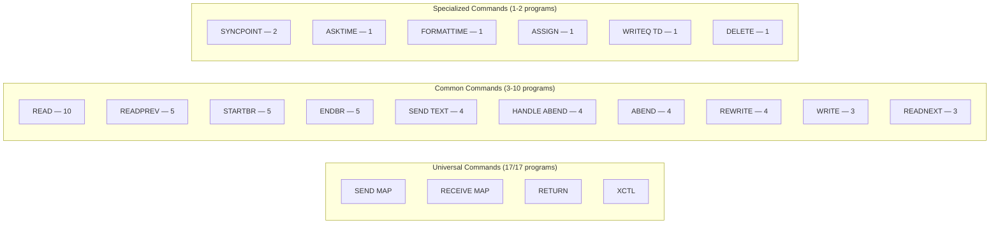
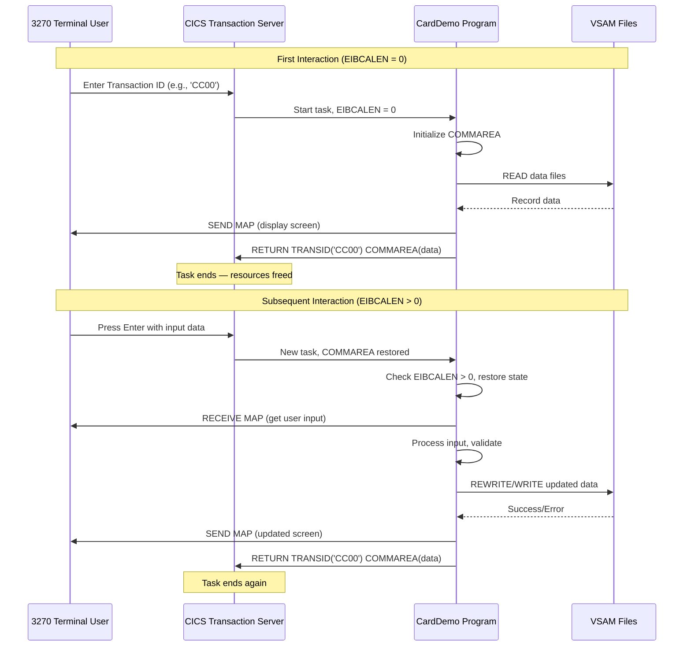

# Appendix A — CICS Command Reference

> **Document Status:** Complete | **Last Updated:** 2024 | **Classification:** Migration Analysis — Appendix
>
> Complete inventory of all EXEC CICS commands used across the 17 online CICS programs in the AWS CardDemo application, organized by functional category with behavioral specifications, parameter analysis, RESP/RESP2 error handling patterns, and Spring MVC/JPA mapping recommendations.

---

## Table of Contents

- [A.1 Overview](#a1-overview)
- [A.2 File Control Commands — VSAM Record-Level Access](#a2-file-control-commands--vsam-record-level-access)
  - [A.2.1 READ](#a21-read)
  - [A.2.2 WRITE](#a22-write)
  - [A.2.3 REWRITE](#a23-rewrite)
  - [A.2.4 DELETE](#a24-delete)
  - [A.2.5 STARTBR](#a25-startbr)
  - [A.2.6 READNEXT](#a26-readnext)
  - [A.2.7 READPREV](#a27-readprev)
  - [A.2.8 ENDBR](#a28-endbr)
- [A.3 Terminal I/O Commands — BMS Map Interaction](#a3-terminal-io-commands--bms-map-interaction)
  - [A.3.1 SEND MAP](#a31-send-map)
  - [A.3.2 RECEIVE MAP](#a32-receive-map)
  - [A.3.3 SEND TEXT](#a33-send-text)
- [A.4 Program Control Commands](#a4-program-control-commands)
  - [A.4.1 RETURN](#a41-return)
  - [A.4.2 XCTL](#a42-xctl)
- [A.5 Error Handling Commands](#a5-error-handling-commands)
  - [A.5.1 HANDLE ABEND](#a51-handle-abend)
  - [A.5.2 ABEND](#a52-abend)
- [A.6 System Service Commands](#a6-system-service-commands)
  - [A.6.1 ASKTIME](#a61-asktime)
  - [A.6.2 FORMATTIME](#a62-formattime)
  - [A.6.3 ASSIGN](#a63-assign)
  - [A.6.4 WRITEQ TD](#a64-writeq-td)
  - [A.6.5 SYNCPOINT](#a65-syncpoint)
- [A.7 Per-Program Usage Matrix](#a7-per-program-usage-matrix)
- [A.8 RESP/RESP2 Error Handling Patterns](#a8-respresp2-error-handling-patterns)
- [A.9 Pseudo-Conversational Pattern Documentation](#a9-pseudo-conversational-pattern-documentation)
- [A.10 Spring MVC/JPA Mapping Summary](#a10-spring-mvcjpa-mapping-summary)
- [Navigation](#navigation)

---

## A.1 Overview

This appendix provides a complete reference for all **EXEC CICS** commands used across the **17 online CICS programs** in the CardDemo application. The analysis identified **19 distinct EXEC CICS command types** organized into five functional categories:

| Category | Commands | Programs Using |
|----------|----------|----------------|
| **File Control** | READ, WRITE, REWRITE, DELETE, STARTBR, READNEXT, READPREV, ENDBR | 14 of 17 programs |
| **Terminal I/O** | SEND MAP, RECEIVE MAP, SEND TEXT | All 17 programs |
| **Program Control** | RETURN, XCTL | All 17 programs |
| **Error Handling** | HANDLE ABEND, ABEND | 4 programs |
| **System Services** | ASKTIME, FORMATTIME, ASSIGN, WRITEQ TD, SYNCPOINT | 4 programs |

**Source Files Analyzed:**

All programs reside in `app/cbl/` and follow the `CO*` naming prefix for online CICS programs:

| # | Program | Description |
|---|---------|-------------|
| 1 | `COACTUPC.cbl` | Account Update |
| 2 | `COACTVWC.cbl` | Account View |
| 3 | `COADM01C.cbl` | Admin Menu |
| 4 | `COBIL00C.cbl` | Bill Payment |
| 5 | `COCRDLIC.cbl` | Credit Card List |
| 6 | `COCRDSLC.cbl` | Credit Card Detail |
| 7 | `COCRDUPC.cbl` | Credit Card Update |
| 8 | `COMEN01C.cbl` | Main Menu |
| 9 | `CORPT00C.cbl` | Report Selection |
| 10 | `COSGN00C.cbl` | Sign-On |
| 11 | `COTRN00C.cbl` | Transaction List |
| 12 | `COTRN01C.cbl` | Transaction Detail |
| 13 | `COTRN02C.cbl` | Transaction Add |
| 14 | `COUSR00C.cbl` | User List |
| 15 | `COUSR01C.cbl` | User Add |
| 16 | `COUSR02C.cbl` | User Update |
| 17 | `COUSR03C.cbl` | User Delete |

> **Note:** The Agent Action Plan references 19 online programs; however, `COTRN04C` and `COTRN05C` do not exist in the repository. The actual count is **17 online CICS programs**. All analysis in this appendix is based on the 17 files confirmed present.

---

## A.2 File Control Commands — VSAM Record-Level Access

File control commands provide CRUD (Create, Read, Update, Delete) operations against VSAM KSDS (Key-Sequenced Data Set) files. In the CardDemo application, these commands interact with datasets including ACCTFILE, CARDDATA, CARDXREF, CUSTDATA, TRANSACT, and USRSEC.

### A.2.1 READ

**Purpose:** Retrieves a single record from a VSAM KSDS file by primary key or alternate index key.

**Parameters Used in CardDemo:**

| Parameter | Description | Usage Pattern |
|-----------|-------------|---------------|
| `FILE` / `DATASET` | Target VSAM file name | Literal or working-storage variable |
| `INTO` | Receiving data area | Record layout copybook structure |
| `RIDFLD` | Record identification field (key value) | Working-storage key field |
| `KEYLENGTH` | Length of the key portion of RIDFLD | `LENGTH OF` key-field |
| `LENGTH` | Length of the record area | `LENGTH OF` record-structure |
| `UPDATE` | Indicates record will be modified (exclusive lock) | Present on read-for-update operations |
| `RESP` | Primary response code | `WS-RESP-CD` |
| `RESP2` | Secondary response code | `WS-REAS-CD` |

**Programs Using READ:**

| Program | File(s) Accessed | Line(s) | UPDATE? |
|---------|-----------------|---------|---------|
| `COACTUPC.cbl` | CARDXREF (via AIX), ACCTFILE, CUSTDATA | 3654, 3703, 3753, 3894, 3921 | Yes (3894, 3921) |
| `COACTVWC.cbl` | CARDXREF (via AIX), ACCTFILE, CUSTDATA | 727, 776, 826 | No |
| `COBIL00C.cbl` | ACCTFILE, CARDXREF (via AIX) | 345, 410 | Yes (345) |
| `COCRDSLC.cbl` | CARDDATA, CARDDATA (via AIX) | 742, 783 | No |
| `COCRDUPC.cbl` | CARDDATA | 1382, 1427 | Yes (1427) |
| `COSGN00C.cbl` | USRSEC | 211 | No |
| `COTRN01C.cbl` | TRANSACT | 269 | Yes |
| `COTRN02C.cbl` | CARDXREF (via AIX), CARDXREF | 578, 611 | No |
| `COUSR02C.cbl` | USRSEC | 322 | Yes |
| `COUSR03C.cbl` | USRSEC | 269 | Yes |

**Representative Code — Read with Update Lock:**

Source: [`app/cbl/COBIL00C.cbl:345-358`](../../../app/cbl/COBIL00C.cbl)

```cobol
       READ-ACCTDAT-FILE.

           EXEC CICS READ
                DATASET   (WS-ACCTDAT-FILE)
                INTO      (ACCOUNT-RECORD)
                LENGTH    (LENGTH OF ACCOUNT-RECORD)
                RIDFLD    (ACCT-ID)
                KEYLENGTH (LENGTH OF ACCT-ID)
                UPDATE
                RESP      (WS-RESP-CD)
                RESP2     (WS-REAS-CD)
           END-EXEC
```

**Java Migration Mapping:** `JpaRepository.findById()` or `EntityManager.find()` with pessimistic locking for UPDATE semantics.

```java
// Direct read
Optional<Account> account = accountRepository.findById(acctId);

// Read for update (pessimistic lock equivalent)
@Lock(LockModeType.PESSIMISTIC_WRITE)
@Query("SELECT a FROM Account a WHERE a.acctId = :acctId")
Optional<Account> findByIdForUpdate(@Param("acctId") String acctId);
```

---

### A.2.2 WRITE

**Purpose:** Inserts a new record into a VSAM KSDS file.

**Parameters Used in CardDemo:**

| Parameter | Description | Usage Pattern |
|-----------|-------------|---------------|
| `FILE` / `DATASET` | Target VSAM file name | Working-storage variable |
| `FROM` | Source data area for the new record | Record layout structure |
| `RIDFLD` | Record key value | Key field in record |
| `KEYLENGTH` | Length of key | `LENGTH OF` key-field |
| `LENGTH` | Length of the record | `LENGTH OF` record-structure |
| `RESP` | Primary response code | `WS-RESP-CD` |
| `RESP2` | Secondary response code | `WS-REAS-CD` |

**Programs Using WRITE:**

| Program | File Written | Line |
|---------|-------------|------|
| `COBIL00C.cbl` | TRANSACT | 512 |
| `COTRN02C.cbl` | TRANSACT | 713 |
| `COUSR01C.cbl` | USRSEC | 240 |

**Representative Code — Write New Transaction Record:**

Source: [`app/cbl/COBIL00C.cbl:512-522`](../../../app/cbl/COBIL00C.cbl)

```cobol
       WRITE-TRANSACT-FILE.

           EXEC CICS WRITE
                DATASET   (WS-TRANSACT-FILE)
                FROM      (TRAN-RECORD)
                LENGTH    (LENGTH OF TRAN-RECORD)
                RIDFLD    (TRAN-ID)
                KEYLENGTH (LENGTH OF TRAN-ID)
                RESP      (WS-RESP-CD)
                RESP2     (WS-REAS-CD)
           END-EXEC
```

**Java Migration Mapping:** `JpaRepository.save()` for new entity persistence.

```java
Transaction transaction = new Transaction();
transaction.setTranId(tranId);
// ... populate fields
transactionRepository.save(transaction);
```

---

### A.2.3 REWRITE

**Purpose:** Updates an existing record that was previously read with the `UPDATE` option. The record must be held under an exclusive lock from a prior `READ UPDATE`.

**Parameters Used in CardDemo:**

| Parameter | Description | Usage Pattern |
|-----------|-------------|---------------|
| `FILE` / `DATASET` | Target VSAM file name | File name literal or variable |
| `FROM` | Updated data area | Modified record structure |
| `LENGTH` | Length of updated record | `LENGTH OF` record-structure |
| `RESP` | Primary response code | `WS-RESP-CD` |
| `RESP2` | Secondary response code | `WS-REAS-CD` |

**Programs Using REWRITE:**

| Program | File Rewritten | Line |
|---------|---------------|------|
| `COACTUPC.cbl` | ACCTFILE, CUSTDATA | 4065, 4085 |
| `COBIL00C.cbl` | ACCTFILE | 379 |
| `COCRDUPC.cbl` | CARDDATA | 1477 |
| `COUSR02C.cbl` | USRSEC | 360 |

**Representative Code — Rewrite Account Record:**

Source: [`app/cbl/COBIL00C.cbl:379-387`](../../../app/cbl/COBIL00C.cbl)

```cobol
       UPDATE-ACCTDAT-FILE.

           EXEC CICS REWRITE
                DATASET   (WS-ACCTDAT-FILE)
                FROM      (ACCOUNT-RECORD)
                LENGTH    (LENGTH OF ACCOUNT-RECORD)
                RESP      (WS-RESP-CD)
                RESP2     (WS-REAS-CD)
           END-EXEC
```

**Java Migration Mapping:** `JpaRepository.save()` for existing (managed) entities, leveraging JPA merge semantics.

```java
// Entity already loaded and managed via findById
account.setBalance(newBalance);
accountRepository.save(account); // JPA merge (UPDATE)
```

---

### A.2.4 DELETE

**Purpose:** Removes a record from a VSAM KSDS file. In CardDemo, DELETE is used after a `READ UPDATE` to remove the record held under lock.

**Parameters Used in CardDemo:**

| Parameter | Description | Usage Pattern |
|-----------|-------------|---------------|
| `FILE` / `DATASET` | Target VSAM file name | Working-storage variable |
| `RESP` | Primary response code | `WS-RESP-CD` |
| `RESP2` | Secondary response code | `WS-REAS-CD` |

**Programs Using DELETE:**

| Program | File | Line |
|---------|------|------|
| `COUSR03C.cbl` | USRSEC | 307 |

**Representative Code — Delete User Security Record:**

Source: [`app/cbl/COUSR03C.cbl:307-312`](../../../app/cbl/COUSR03C.cbl)

```cobol
           EXEC CICS DELETE
                DATASET   (WS-USRSEC-FILE)
                RESP      (WS-RESP-CD)
                RESP2     (WS-REAS-CD)
           END-EXEC.
```

**Java Migration Mapping:** `JpaRepository.deleteById()` or `JpaRepository.delete(entity)`.

```java
userSecurityRepository.deleteById(userId);
```

---

### A.2.5 STARTBR

**Purpose:** Initiates a browse (sequential read) operation on a VSAM file, positioning the cursor at or after the specified key value. This is always paired with `READNEXT`/`READPREV` and terminated by `ENDBR`.

**Parameters Used in CardDemo:**

| Parameter | Description | Usage Pattern |
|-----------|-------------|---------------|
| `FILE` / `DATASET` | Target VSAM file name | Working-storage variable |
| `RIDFLD` | Starting key value | Key field for positioning |
| `KEYLENGTH` | Length of key for generic positioning | `LENGTH OF` key-field |
| `GTEQ` | Position at key greater-than-or-equal | Used in `COCRDLIC`, `COUSR00C` |
| `RESP` | Primary response code | `WS-RESP-CD` |
| `RESP2` | Secondary response code | `WS-REAS-CD` |

**Programs Using STARTBR:**

| Program | File Browsed | Line(s) | Positioning |
|---------|-------------|---------|-------------|
| `COBIL00C.cbl` | TRANSACT | 443 | Default (EQUAL) |
| `COCRDLIC.cbl` | CARDDATA | 1129, 1273 | GTEQ |
| `COTRN00C.cbl` | TRANSACT | 593 | Default |
| `COTRN02C.cbl` | TRANSACT | 644 | Default |
| `COUSR00C.cbl` | USRSEC | 588 | Default |

**Representative Code — Start Browse with GTEQ:**

Source: [`app/cbl/COCRDLIC.cbl:1129-1139`](../../../app/cbl/COCRDLIC.cbl)

```cobol
           EXEC CICS STARTBR
                DATASET(LIT-CARD-FILE)
                RIDFLD(WS-CARD-RID-CARDNUM)
                KEYLENGTH(LENGTH OF WS-CARD-RID-CARDNUM)
                GTEQ
                RESP(WS-RESP-CD)
                RESP2(WS-REAS-CD)
           END-EXEC
```

**Java Migration Mapping:** JPA Criteria query with pagination or Spring Data `Pageable`.

```java
// STARTBR GTEQ equivalent — find records >= starting key
Page<Card> cards = cardRepository.findByCardNumGreaterThanEqual(
    startCardNum,
    PageRequest.of(0, pageSize, Sort.by("cardNum").ascending())
);
```

---

### A.2.6 READNEXT

**Purpose:** Reads the next sequential record in a browse operation initiated by `STARTBR`. Advances the browse cursor forward.

**Parameters Used in CardDemo:**

| Parameter | Description | Usage Pattern |
|-----------|-------------|---------------|
| `FILE` / `DATASET` | Target VSAM file name | Working-storage variable |
| `INTO` | Receiving data area | Record layout structure |
| `RIDFLD` | Updated with the key of the record read | Key field |
| `KEYLENGTH` | Length of key | `LENGTH OF` key-field |
| `LENGTH` | Length of record area | `LENGTH OF` record-structure |
| `RESP` | Primary response code | `WS-RESP-CD` |
| `RESP2` | Secondary response code | `WS-REAS-CD` |

**Programs Using READNEXT:**

| Program | File Browsed | Line(s) |
|---------|-------------|---------|
| `COCRDLIC.cbl` | CARDDATA | 1146, 1197 |
| `COTRN00C.cbl` | TRANSACT | 626 |
| `COUSR00C.cbl` | USRSEC | 621 |

**Representative Code:**

Source: [`app/cbl/COCRDLIC.cbl:1146-1158`](../../../app/cbl/COCRDLIC.cbl)

```cobol
           EXEC CICS READNEXT
                DATASET(LIT-CARD-FILE)
                INTO (CARD-RECORD)
                LENGTH(LENGTH OF CARD-RECORD)
                RIDFLD(WS-CARD-RID-CARDNUM)
                KEYLENGTH(LENGTH OF WS-CARD-RID-CARDNUM)
                RESP(WS-RESP-CD)
                RESP2(WS-REAS-CD)
           END-EXEC
```

**Java Migration Mapping:** JPA result set iteration or `Stream<T>` from Spring Data repository query.

```java
// Iterate through results from a paginated query
List<Card> cards = cardRepository.findByCardNumGreaterThanEqual(
    startCardNum, Sort.by("cardNum").ascending()
);
for (Card card : cards) {
    // Process each record (equivalent to READNEXT loop)
}
```

---

### A.2.7 READPREV

**Purpose:** Reads the previous sequential record in a browse operation. Moves the browse cursor backward. Used in CardDemo to find the most recent transaction (highest key) by starting at a high key value and reading backward.

**Parameters Used in CardDemo:**

| Parameter | Description | Usage Pattern |
|-----------|-------------|---------------|
| `FILE` / `DATASET` | Target VSAM file name | Working-storage variable |
| `INTO` | Receiving data area | Record layout structure |
| `RIDFLD` | Updated with key of record read | Key field |
| `KEYLENGTH` | Length of key | `LENGTH OF` key-field |
| `LENGTH` | Length of record area | `LENGTH OF` record-structure |
| `RESP` | Primary response code | `WS-RESP-CD` |
| `RESP2` | Secondary response code | `WS-REAS-CD` |

**Programs Using READPREV:**

| Program | File Browsed | Line(s) |
|---------|-------------|---------|
| `COBIL00C.cbl` | TRANSACT | 474 |
| `COCRDLIC.cbl` | CARDDATA | 1294, 1322 |
| `COTRN00C.cbl` | TRANSACT | 660 |
| `COTRN02C.cbl` | TRANSACT | 675 |
| `COUSR00C.cbl` | USRSEC | 655 |

**Representative Code — Read Previous for Latest Transaction:**

Source: [`app/cbl/COBIL00C.cbl:474-486`](../../../app/cbl/COBIL00C.cbl)

```cobol
       READPREV-TRANSACT-FILE.

           EXEC CICS READPREV
                DATASET   (WS-TRANSACT-FILE)
                INTO      (TRAN-RECORD)
                LENGTH    (LENGTH OF TRAN-RECORD)
                RIDFLD    (TRAN-ID)
                KEYLENGTH (LENGTH OF TRAN-ID)
                RESP      (WS-RESP-CD)
                RESP2     (WS-REAS-CD)
           END-EXEC
```

**Java Migration Mapping:** JPA reverse-order query using `Sort.by(...).descending()`.

```java
// READPREV equivalent — descending order query
List<Transaction> recentTransactions = transactionRepository
    .findByTranIdLessThanEqual(
        startTranId,
        Sort.by("tranId").descending()
    );
```

---

### A.2.8 ENDBR

**Purpose:** Terminates a browse operation initiated by `STARTBR`, releasing the browse cursor and any associated resources.

**Parameters Used in CardDemo:**

| Parameter | Description | Usage Pattern |
|-----------|-------------|---------------|
| `FILE` / `DATASET` | Target VSAM file name | Working-storage variable or literal |

**Programs Using ENDBR:**

| Program | File | Line(s) |
|---------|------|---------|
| `COBIL00C.cbl` | TRANSACT | 503 |
| `COCRDLIC.cbl` | CARDDATA | 1258, 1375 |
| `COTRN00C.cbl` | TRANSACT | 694 |
| `COTRN02C.cbl` | TRANSACT | 704 |
| `COUSR00C.cbl` | USRSEC | 689 |

**Representative Code:**

Source: [`app/cbl/COBIL00C.cbl:503-505`](../../../app/cbl/COBIL00C.cbl)

```cobol
       ENDBR-TRANSACT-FILE.

           EXEC CICS ENDBR
                DATASET   (WS-TRANSACT-FILE)
           END-EXEC.
```

**Java Migration Mapping:** Close cursor or stream — implicitly handled by Spring Data pagination; explicit with `Stream.close()`.

```java
// Implicit in Spring Data — pagination handles cursor lifecycle
// If using Stream API:
try (Stream<Transaction> stream = transactionRepository.streamAll()) {
    stream.forEach(this::processRecord);
} // Stream auto-closed
```

---

## A.3 Terminal I/O Commands — BMS Map Interaction

Terminal I/O commands handle communication between the CICS program and the 3270 terminal user via BMS (Basic Mapping Support) maps. Each program sends formatted screens to the terminal and receives user input through map-based data structures.

### A.3.1 SEND MAP

**Purpose:** Sends a formatted BMS map to the 3270 terminal display. The map defines the screen layout (field positions, attributes, labels), and the `FROM` data area supplies variable field values.

**Parameters Used in CardDemo:**

| Parameter | Description | Usage Pattern |
|-----------|-------------|---------------|
| `MAP` | Map name within the mapset | Literal (e.g., `'COBIL0A'`) or variable |
| `MAPSET` | Mapset name containing the map | Literal (e.g., `'COBIL00'`) or variable |
| `FROM` | Data area with output field values | Output map structure (e.g., `COBIL0AO`) |
| `CURSOR` | Position cursor at first field with cursor attribute set | Present in most programs |
| `ERASE` | Clear the screen before sending | Present in all SEND MAP commands |
| `FREEKB` | Unlock the keyboard after send | Present in some programs |
| `RESP` | Primary response code | `WS-RESP-CD` (in programs with RESP handling) |

**Programs Using SEND MAP:** All 17 online programs.

| Program | MAP Name | MAPSET Name | Line(s) |
|---------|----------|-------------|---------|
| `COACTUPC.cbl` | `CCARD-NEXT-MAP` | `CCARD-NEXT-MAPSET` | 3594 |
| `COACTVWC.cbl` | `CCARD-NEXT-MAP` | `CCARD-NEXT-MAPSET` | 583 |
| `COADM01C.cbl` | `'COADM1A'` | `'COADM01'` | 179 |
| `COBIL00C.cbl` | `'COBIL0A'` | `'COBIL00'` | 295 |
| `COCRDLIC.cbl` | `LIT-THISMAP` | `LIT-THISMAPSET` | 939 |
| `COCRDSLC.cbl` | `CCARD-NEXT-MAP` | `CCARD-NEXT-MAPSET` | 569 |
| `COCRDUPC.cbl` | `CCARD-NEXT-MAP` | `CCARD-NEXT-MAPSET` | 1329 |
| `COMEN01C.cbl` | `'COMEN1A'` | `'COMEN01'` | 189 |
| `CORPT00C.cbl` | `'CORPT0A'` | `'CORPT00'` | 563, 571 |
| `COSGN00C.cbl` | `'COSGN0A'` | `'COSGN00'` | 151 |
| `COTRN00C.cbl` | `'COTRN0A'` | `'COTRN00'` | 534, 542 |
| `COTRN01C.cbl` | `'COTRN1A'` | `'COTRN01'` | 219 |
| `COTRN02C.cbl` | `'COTRN2A'` | `'COTRN02'` | 522 |
| `COUSR00C.cbl` | `'COUSR0A'` | `'COUSR00'` | 529, 537 |
| `COUSR01C.cbl` | `'COUSR1A'` | `'COUSR01'` | 190 |
| `COUSR02C.cbl` | `'COUSR2A'` | `'COUSR02'` | 272 |
| `COUSR03C.cbl` | `'COUSR3A'` | `'COUSR03'` | 219 |

**Representative Code:**

Source: [`app/cbl/COBIL00C.cbl:295-303`](../../../app/cbl/COBIL00C.cbl)

```cobol
       SEND-BILLPAY-SCREEN.

           EXEC CICS SEND
                     MAP('COBIL0A')
                     MAPSET('COBIL00')
                     FROM(COBIL0AO)
                     ERASE
                     CURSOR
           END-EXEC.
```

**Java Migration Mapping:** Spring MVC `@Controller` returning a view model to a Thymeleaf/JSP template or React API endpoint.

```java
@Controller
@RequestMapping("/billpay")
public class BillPayController {
    @GetMapping
    public String showBillPayScreen(Model model) {
        model.addAttribute("billPayForm", new BillPayForm());
        return "billpay/cobil0a"; // Maps to Thymeleaf template
    }
}
```

---

### A.3.2 RECEIVE MAP

**Purpose:** Receives user input from the 3270 terminal into a program data area. The BMS map defines expected input fields, and user-entered values are placed into the `INTO` structure.

**Parameters Used in CardDemo:**

| Parameter | Description | Usage Pattern |
|-----------|-------------|---------------|
| `MAP` | Map name within the mapset | Same as SEND MAP |
| `MAPSET` | Mapset name | Same as SEND MAP |
| `INTO` | Data area to receive input values | Input map structure (e.g., `COBIL0AI`) |
| `RESP` | Primary response code | `WS-RESP-CD` |
| `RESP2` | Secondary response code | `WS-REAS-CD` |

**Programs Using RECEIVE MAP:** All 17 online programs.

| Program | INTO Structure | Line |
|---------|---------------|------|
| `COACTUPC.cbl` | `CACTUPAI` | 1040 |
| `COACTVWC.cbl` | `CACTVWAI` | 611 |
| `COADM01C.cbl` | `COADM1AI` | 191 |
| `COBIL00C.cbl` | `COBIL0AI` | 308 |
| `COCRDLIC.cbl` | `CCRDLIAI` | 963 |
| `COCRDSLC.cbl` | `CCRDSLAI` | 597 |
| `COCRDUPC.cbl` | `CCRDUPAI` | 579 |
| `COMEN01C.cbl` | `COMEN1AI` | 201 |
| `CORPT00C.cbl` | `CORPT0AI` | 598 |
| `COSGN00C.cbl` | (unnamed — direct MAP receive) | 110 |
| `COTRN00C.cbl` | `COTRN0AI` | 556 |
| `COTRN01C.cbl` | `COTRN1AI` | 232 |
| `COTRN02C.cbl` | `COTRN2AI` | 541 |
| `COUSR00C.cbl` | `COUSR0AI` | 551 |
| `COUSR01C.cbl` | `COUSR1AI` | 203 |
| `COUSR02C.cbl` | `COUSR2AI` | 285 |
| `COUSR03C.cbl` | `COUSR3AI` | 232 |

**Representative Code:**

Source: [`app/cbl/COBIL00C.cbl:308-315`](../../../app/cbl/COBIL00C.cbl)

```cobol
       RECEIVE-BILLPAY-SCREEN.

           EXEC CICS RECEIVE
                     MAP('COBIL0A')
                     MAPSET('COBIL00')
                     INTO(COBIL0AI)
                     RESP(WS-RESP-CD)
                     RESP2(WS-REAS-CD)
           END-EXEC.
```

**Java Migration Mapping:** Spring `@PostMapping` with form binding via `@ModelAttribute`.

```java
@PostMapping("/billpay")
public String processBillPay(
        @ModelAttribute BillPayForm form,
        BindingResult result,
        Model model) {
    if (result.hasErrors()) {
        return "billpay/cobil0a";
    }
    billPayService.processPayment(form);
    return "redirect:/billpay/confirmation";
}
```

---

### A.3.3 SEND TEXT

**Purpose:** Sends unformatted text directly to the 3270 terminal without using a BMS map. Used in CardDemo for error messages and informational displays.

**Parameters Used in CardDemo:**

| Parameter | Description | Usage Pattern |
|-----------|-------------|---------------|
| `FROM` | Text data area | Working-storage message field |
| `LENGTH` | Length of text | `LENGTH OF` message-field |
| `ERASE` | Clear screen before display | Always present |
| `FREEKB` | Unlock keyboard | Always present |

**Programs Using SEND TEXT:**

| Program | Line(s) | Context |
|---------|---------|---------|
| `COACTVWC.cbl` | 878, 897 | Error/return messages |
| `COCRDLIC.cbl` | 1423, 1442 | Error/long messages |
| `COCRDSLC.cbl` | 821, 839 | Error/return messages |
| `COSGN00C.cbl` | 164 | Welcome/sign-on message |

**Representative Code:**

Source: [`app/cbl/COSGN00C.cbl:164-170`](../../../app/cbl/COSGN00C.cbl)

```cobol
           EXEC CICS SEND TEXT
                     FROM(WS-MESSAGE)
                     LENGTH(LENGTH OF WS-MESSAGE)
                     ERASE
                     FREEKB
           END-EXEC.
```

**Java Migration Mapping:** REST API plain-text response or redirect with flash attributes.

```java
@GetMapping("/error")
@ResponseBody
public ResponseEntity<String> sendErrorText() {
    return ResponseEntity.ok()
        .contentType(MediaType.TEXT_PLAIN)
        .body(errorMessage);
}
```

---

## A.4 Program Control Commands

Program control commands manage the pseudo-conversational flow between CICS programs, including returning control to CICS and transferring execution to other programs.

### A.4.1 RETURN

**Purpose:** Returns control to CICS from the current program. When `TRANSID` and `COMMAREA` are specified, CICS will re-invoke the program when the user presses an AID key (Enter, PF key, etc.), passing the COMMAREA to preserve state between interactions. This is the foundation of the **pseudo-conversational programming model**.

**Parameters Used in CardDemo:**

| Parameter | Description | Usage Pattern |
|-----------|-------------|---------------|
| `TRANSID` | Transaction ID to associate with next terminal input | `WS-TRANID` or `LIT-THISTRANID` |
| `COMMAREA` | Communication area to pass to next invocation | `CARDDEMO-COMMAREA` or `WS-COMMAREA` |
| `LENGTH` | Length of COMMAREA | `LENGTH OF CARDDEMO-COMMAREA` |

**Programs Using RETURN:** All 17 online programs.

| Program | Line(s) | TRANSID | COMMAREA |
|---------|---------|---------|----------|
| `COACTUPC.cbl` | (within main flow) | Yes | `CARDDEMO-COMMAREA` |
| `COACTVWC.cbl` | 402, 885, 904 | Yes (402), No (885, 904) | `WS-COMMAREA` |
| `COADM01C.cbl` | 107 | Yes | `CARDDEMO-COMMAREA` |
| `COBIL00C.cbl` | 146 | Yes | `CARDDEMO-COMMAREA` |
| `COCRDLIC.cbl` | 615, 1430, 1449 | Yes (615), No (1430, 1449) | `WS-COMMAREA` |
| `COCRDSLC.cbl` | 402, 828, 846 | Yes (402), No (828, 846) | `WS-COMMAREA` |
| `COCRDUPC.cbl` | 554 | Yes | `WS-COMMAREA` |
| `COMEN01C.cbl` | 107 | Yes | `CARDDEMO-COMMAREA` |
| `CORPT00C.cbl` | 199, 587 | Yes | `CARDDEMO-COMMAREA` |
| `COSGN00C.cbl` | 98, 171 | Yes (98), No (171) | `CARDDEMO-COMMAREA` |
| `COTRN00C.cbl` | 138 | Yes | `CARDDEMO-COMMAREA` |
| `COTRN01C.cbl` | 136 | Yes | `CARDDEMO-COMMAREA` |
| `COTRN02C.cbl` | 156, 530 | Yes | `CARDDEMO-COMMAREA` |
| `COUSR00C.cbl` | 141 | Yes | `CARDDEMO-COMMAREA` |
| `COUSR01C.cbl` | 107 | Yes | `CARDDEMO-COMMAREA` |
| `COUSR02C.cbl` | 135 | Yes | `CARDDEMO-COMMAREA` |
| `COUSR03C.cbl` | 134 | Yes | `CARDDEMO-COMMAREA` |

**Representative Code — Pseudo-Conversational RETURN:**

Source: [`app/cbl/COMEN01C.cbl:107-111`](../../../app/cbl/COMEN01C.cbl)

```cobol
           EXEC CICS RETURN
                     TRANSID (WS-TRANID)
                     COMMAREA (CARDDEMO-COMMAREA)
           END-EXEC.
```

**Java Migration Mapping:** HTTP response with session state management.

```java
@PostMapping("/menu")
public String processMenuSelection(
        @ModelAttribute MenuForm form,
        HttpSession session) {
    // Preserve state (COMMAREA equivalent)
    session.setAttribute("cardDemoCommArea", commArea);
    return "redirect:/menu"; // Pseudo-conversational return
}
```

---

### A.4.2 XCTL

**Purpose:** Transfers control to another CICS program within the same task. Unlike `LINK`, the transferring program does not receive control back — it is a one-way transfer. The COMMAREA is passed to the target program.

**Parameters Used in CardDemo:**

| Parameter | Description | Usage Pattern |
|-----------|-------------|---------------|
| `PROGRAM` | Target program name | Literal (e.g., `'COADM01C'`) or variable (`CDEMO-TO-PROGRAM`) |
| `COMMAREA` | Data area to pass to target program | `CARDDEMO-COMMAREA` |
| `LENGTH` | Length of COMMAREA | Implicit in most invocations |

**Programs Using XCTL:**

| Program | Target(s) | Line(s) |
|---------|-----------|---------|
| `COACTUPC.cbl` | `CDEMO-TO-PROGRAM` | (within main flow) |
| `COACTVWC.cbl` | `CDEMO-TO-PROGRAM` | 349 |
| `COADM01C.cbl` | Menu option program, `CDEMO-TO-PROGRAM` | 142, 165 |
| `COBIL00C.cbl` | `CDEMO-TO-PROGRAM` | 281 |
| `COCRDLIC.cbl` | `LIT-MENUPGM`, `CCARD-NEXT-PROG` | 402, 538, 566 |
| `COCRDSLC.cbl` | `CDEMO-TO-PROGRAM` | 331 |
| `COCRDUPC.cbl` | `CDEMO-TO-PROGRAM` | 473 |
| `COMEN01C.cbl` | Menu option program, `CDEMO-TO-PROGRAM` | 152, 175 |
| `CORPT00C.cbl` | `CDEMO-TO-PROGRAM` | 548 |
| `COSGN00C.cbl` | `'COADM01C'`, `'COMEN01C'` | 231, 236 |
| `COTRN00C.cbl` | `CDEMO-TO-PROGRAM` | 192, 518 |
| `COTRN01C.cbl` | `CDEMO-TO-PROGRAM` | 205 |
| `COTRN02C.cbl` | `CDEMO-TO-PROGRAM` | 508 |
| `COUSR00C.cbl` | `CDEMO-TO-PROGRAM` | 196, 206, 514 |
| `COUSR01C.cbl` | `CDEMO-TO-PROGRAM` | 175 |
| `COUSR02C.cbl` | `CDEMO-TO-PROGRAM` | 258 |
| `COUSR03C.cbl` | `CDEMO-TO-PROGRAM` | 205 |

**Representative Code — Transfer to Sign-On Target:**

Source: [`app/cbl/COSGN00C.cbl:231-236`](../../../app/cbl/COSGN00C.cbl)

```cobol
                       IF CDEMO-USRTYP-ADMIN
                            EXEC CICS XCTL
                              PROGRAM ('COADM01C')
                              COMMAREA(CARDDEMO-COMMAREA)
                            END-EXEC
                       ELSE
                            EXEC CICS XCTL
                              PROGRAM ('COMEN01C')
                              COMMAREA(CARDDEMO-COMMAREA)
                            END-EXEC
                       END-IF
```

**Java Migration Mapping:** Spring service method invocation or HTTP redirect.

```java
@Service
public class SignOnService {
    @Autowired private AdminMenuService adminMenuService;
    @Autowired private MainMenuService mainMenuService;

    public String routeAfterSignOn(CardDemoCommArea commArea) {
        if (commArea.isAdmin()) {
            return "redirect:/admin/menu"; // XCTL to COADM01C
        } else {
            return "redirect:/main/menu";  // XCTL to COMEN01C
        }
    }
}
```

---

## A.5 Error Handling Commands

Error handling commands establish abend handlers and initiate controlled program termination when unrecoverable errors are detected.

### A.5.1 HANDLE ABEND

**Purpose:** Establishes an abend exit routine. When an abend occurs, CICS transfers control to the specified `LABEL` paragraph instead of terminating the task. The `CANCEL` option removes a previously established handler.

**Parameters Used in CardDemo:**

| Parameter | Description | Usage Pattern |
|-----------|-------------|---------------|
| `LABEL` | Paragraph name to receive control on abend | `ABEND-ROUTINE` |
| `CANCEL` | Removes the abend handler | Used before explicit ABEND |

**Programs Using HANDLE ABEND:**

| Program | LABEL | Line(s) |
|---------|-------|---------|
| `COACTUPC.cbl` | `ABEND-ROUTINE` (set), `CANCEL` (clear) | 862, 4218 |
| `COACTVWC.cbl` | `ABEND-ROUTINE` (set), `CANCEL` (clear) | 264, 930 |
| `COCRDSLC.cbl` | `ABEND-ROUTINE` (set), `CANCEL` (clear) | 250, 871 |
| `COCRDUPC.cbl` | `ABEND-ROUTINE` (set), `CANCEL` (clear) | 370, 1546 |

**Representative Code — Establish Abend Handler:**

Source: [`app/cbl/COACTUPC.cbl:862-864`](../../../app/cbl/COACTUPC.cbl)

```cobol
           EXEC CICS HANDLE ABEND
                     LABEL(ABEND-ROUTINE)
           END-EXEC
```

**Java Migration Mapping:** `@ControllerAdvice` with `@ExceptionHandler` for global error handling.

```java
@ControllerAdvice
public class AbendHandler {
    @ExceptionHandler(Exception.class)
    public String handleAbend(Exception ex, Model model) {
        model.addAttribute("abendMessage", ex.getMessage());
        model.addAttribute("abendCulprit", getCurrentProgram());
        return "error/abend"; // Equivalent to ABEND-ROUTINE
    }
}
```

---

### A.5.2 ABEND

**Purpose:** Forces a controlled program abend (abnormal end) with a user-defined abend code. In CardDemo, this is always preceded by `HANDLE ABEND CANCEL` to prevent recursive abend handling, and an error message is sent to the terminal first.

**Parameters Used in CardDemo:**

| Parameter | Description | Usage Pattern |
|-----------|-------------|---------------|
| `ABCODE` | 4-character abend code | `'9999'` (all programs use this code) |

**Programs Using ABEND:**

| Program | ABCODE | Line |
|---------|--------|------|
| `COACTUPC.cbl` | `'9999'` | 4222 |
| `COACTVWC.cbl` | `'9999'` | 934 |
| `COCRDSLC.cbl` | `'9999'` | 875 |
| `COCRDUPC.cbl` | `'9999'` | 1550 |

**Representative Code — Abend Routine Pattern:**

Source: [`app/cbl/COACTUPC.cbl:4204-4225`](../../../app/cbl/COACTUPC.cbl)

```cobol
       ABEND-ROUTINE.

           IF ABEND-MSG EQUAL LOW-VALUES
              MOVE 'UNEXPECTED ABEND OCCURRED.' TO ABEND-MSG
           END-IF

           MOVE LIT-THISPGM       TO ABEND-CULPRIT

           EXEC CICS SEND
                            FROM (ABEND-DATA)
                            LENGTH(LENGTH OF ABEND-DATA)
                            NOHANDLE
                            ERASE
           END-EXEC

           EXEC CICS HANDLE ABEND
                CANCEL
           END-EXEC

           EXEC CICS ABEND
                ABCODE('9999')
           END-EXEC
```

**Java Migration Mapping:** Custom exception with application-specific error code.

```java
public class CardDemoAbendException extends RuntimeException {
    private final String abendCode;
    private final String culpritProgram;

    public CardDemoAbendException(String abendCode, String culprit,
                                   String message) {
        super(message);
        this.abendCode = abendCode;
        this.culpritProgram = culprit;
    }
}

// Usage:
throw new CardDemoAbendException("9999", "COACTUPC",
    "UNEXPECTED ABEND OCCURRED.");
```

---

## A.6 System Service Commands

System service commands provide access to CICS system facilities including timestamp retrieval, system identification, transient data queues, and transaction synchronization.

### A.6.1 ASKTIME

**Purpose:** Retrieves the current date and time as an absolute time value (packed decimal, number of milliseconds since January 1, 1900). This value is typically passed to `FORMATTIME` for human-readable formatting.

**Parameters Used in CardDemo:**

| Parameter | Description | Usage Pattern |
|-----------|-------------|---------------|
| `ABSTIME` | Receiving field for absolute time value | `WS-ABS-TIME` |

**Programs Using ASKTIME:**

| Program | Line |
|---------|------|
| `COBIL00C.cbl` | 251 |

**Representative Code:**

Source: [`app/cbl/COBIL00C.cbl:251-253`](../../../app/cbl/COBIL00C.cbl)

```cobol
       GET-CURRENT-TIMESTAMP.

           EXEC CICS ASKTIME
             ABSTIME(WS-ABS-TIME)
           END-EXEC
```

**Java Migration Mapping:** `java.time.Instant.now()`

```java
Instant absTime = Instant.now();
```

---

### A.6.2 FORMATTIME

**Purpose:** Converts an absolute time value (from `ASKTIME`) into formatted date and time strings with configurable separators.

**Parameters Used in CardDemo:**

| Parameter | Description | Usage Pattern |
|-----------|-------------|---------------|
| `ABSTIME` | Input absolute time value | `WS-ABS-TIME` |
| `YYYYMMDD` | Output date in YYYY-MM-DD format | `WS-CUR-DATE-X10` |
| `DATESEP` | Date separator character | `'-'` |
| `TIME` | Output time in HH:MM:SS format | `WS-CUR-TIME-X08` |
| `TIMESEP` | Time separator character | `':'` |

**Programs Using FORMATTIME:**

| Program | Line |
|---------|------|
| `COBIL00C.cbl` | 255 |

**Representative Code:**

Source: [`app/cbl/COBIL00C.cbl:255-262`](../../../app/cbl/COBIL00C.cbl)

```cobol
           EXEC CICS FORMATTIME
             ABSTIME(WS-ABS-TIME)
             YYYYMMDD(WS-CUR-DATE-X10)
             DATESEP('-')
             TIME(WS-CUR-TIME-X08)
             TIMESEP(':')
           END-EXEC
```

**Java Migration Mapping:** `java.time.format.DateTimeFormatter`

```java
LocalDateTime now = LocalDateTime.now();
String formattedDate = now.format(
    DateTimeFormatter.ofPattern("yyyy-MM-dd"));  // YYYYMMDD with DATESEP('-')
String formattedTime = now.format(
    DateTimeFormatter.ofPattern("HH:mm:ss"));    // TIME with TIMESEP(':')
```

---

### A.6.3 ASSIGN

**Purpose:** Retrieves CICS system information into program variables. In CardDemo, used to obtain the CICS application ID and system ID for display on the sign-on screen.

**Parameters Used in CardDemo:**

| Parameter | Description | Usage Pattern |
|-----------|-------------|---------------|
| `APPLID` | CICS application identifier | `APPLIDO OF COSGN0AO` |
| `SYSID` | CICS system identifier | `SYSIDO OF COSGN0AO` |

**Programs Using ASSIGN:**

| Program | Parameters | Line(s) |
|---------|------------|---------|
| `COSGN00C.cbl` | `APPLID`, `SYSID` | 198, 202 |

**Representative Code:**

Source: [`app/cbl/COSGN00C.cbl:198-203`](../../../app/cbl/COSGN00C.cbl)

```cobol
           EXEC CICS ASSIGN
               APPLID(APPLIDO OF COSGN0AO)
           END-EXEC

           EXEC CICS ASSIGN
               SYSID(SYSIDO OF COSGN0AO)
           END-EXEC.
```

**Java Migration Mapping:** Spring `@Value` annotations or `Environment` bean.

```java
@Value("${app.application-id}")
private String applicationId;

@Value("${app.system-id}")
private String systemId;
```

---

### A.6.4 WRITEQ TD

**Purpose:** Writes a record to a Transient Data Queue (TDQ). In CardDemo, this is the critical mechanism for coupling online CICS transactions to batch job submission — the report program writes JCL records to the `JOBS` TDQ, which triggers batch job execution through JES (Job Entry Subsystem).

**Parameters Used in CardDemo:**

| Parameter | Description | Usage Pattern |
|-----------|-------------|---------------|
| `QUEUE` | TDQ name | `'JOBS'` |
| `FROM` | Data area containing the record | `JCL-RECORD` |
| `LENGTH` | Length of the record | `LENGTH OF JCL-RECORD` |
| `RESP` | Primary response code | `WS-RESP-CD` |
| `RESP2` | Secondary response code | `WS-REAS-CD` |

**Programs Using WRITEQ TD:**

| Program | Queue | Line |
|---------|-------|------|
| `CORPT00C.cbl` | `'JOBS'` | 517 |

**Representative Code — Online-to-Batch Job Submission:**

Source: [`app/cbl/CORPT00C.cbl:517-525`](../../../app/cbl/CORPT00C.cbl)

```cobol
       WIRTE-JOBSUB-TDQ.

           EXEC CICS WRITEQ TD
             QUEUE ('JOBS')
             FROM (JCL-RECORD)
             LENGTH (LENGTH OF JCL-RECORD)
             RESP(WS-RESP-CD)
             RESP2(WS-REAS-CD)
           END-EXEC.
```

**Java Migration Mapping:** Amazon SQS `sendMessage()` or AWS Step Functions for async batch job submission.

```java
@Service
public class BatchJobSubmissionService {
    @Autowired
    private SqsTemplate sqsTemplate;

    public void submitBatchJob(String jclContent) {
        sqsTemplate.send("batch-jobs-queue", jclContent);
        // AWS Step Functions can pick up and orchestrate
        // the batch processing pipeline
    }
}
```

---

### A.6.5 SYNCPOINT

**Purpose:** Establishes a synchronization point (commit) for recoverable resources, or rolls back changes to the last syncpoint. In CardDemo, `SYNCPOINT` commits multi-file updates and `SYNCPOINT ROLLBACK` reverts changes on error.

**Parameters Used in CardDemo:**

| Parameter | Description | Usage Pattern |
|-----------|-------------|---------------|
| (none) | Commit all changes since last syncpoint | Default SYNCPOINT |
| `ROLLBACK` | Roll back all changes since last syncpoint | Error recovery |

**Programs Using SYNCPOINT:**

| Program | Type | Line(s) |
|---------|------|---------|
| `COACTUPC.cbl` | SYNCPOINT (commit), SYNCPOINT ROLLBACK | 953, 4100 |
| `COCRDUPC.cbl` | SYNCPOINT (commit) | 469 |

**Representative Code — Commit and Rollback:**

Source: [`app/cbl/COACTUPC.cbl:953`](../../../app/cbl/COACTUPC.cbl)

```cobol
           EXEC CICS
                SYNCPOINT
           END-EXEC
```

Source: [`app/cbl/COACTUPC.cbl:4099-4101`](../../../app/cbl/COACTUPC.cbl)

```cobol
           EXEC CICS
                SYNCPOINT ROLLBACK
           END-EXEC
```

**Java Migration Mapping:** Spring `@Transactional` annotation with declarative transaction management.

```java
@Transactional
public void updateAccountAndCustomer(AccountUpdate update) {
    accountRepository.save(update.getAccount());
    customerRepository.save(update.getCustomer());
    // SYNCPOINT is implicit at method completion
}

@Transactional
public void updateWithRollback(AccountUpdate update) {
    try {
        accountRepository.save(update.getAccount());
        customerRepository.save(update.getCustomer());
    } catch (Exception e) {
        // SYNCPOINT ROLLBACK is automatic on exception
        throw e; // Transaction rolls back
    }
}
```

---

## A.7 Per-Program Usage Matrix

The following matrix maps each of the 17 online CICS programs against all 19 EXEC CICS command types identified in CardDemo. A checkmark (✓) indicates the program uses that command type at least once.

| Program | READ | WRITE | REWRITE | DELETE | STARTBR | READNEXT | READPREV | ENDBR | SEND MAP | RECEIVE MAP | SEND TEXT | RETURN | XCTL | HANDLE ABEND | ABEND | ASKTIME | FORMATTIME | ASSIGN | WRITEQ TD | SYNCPOINT |
|---------|------|-------|---------|--------|---------|----------|----------|-------|----------|-------------|-----------|--------|------|--------------|-------|---------|------------|--------|-----------|-----------|
| **COACTUPC** | ✓ | | ✓ | | | | | | ✓ | ✓ | | ✓ | ✓ | ✓ | ✓ | | | | | ✓ |
| **COACTVWC** | ✓ | | | | | | | | ✓ | ✓ | ✓ | ✓ | ✓ | ✓ | ✓ | | | | | |
| **COADM01C** | | | | | | | | | ✓ | ✓ | | ✓ | ✓ | | | | | | | |
| **COBIL00C** | ✓ | ✓ | ✓ | | ✓ | | ✓ | ✓ | ✓ | ✓ | | ✓ | ✓ | | | ✓ | ✓ | | | |
| **COCRDLIC** | | | | | ✓ | ✓ | ✓ | ✓ | ✓ | ✓ | ✓ | ✓ | ✓ | | | | | | | |
| **COCRDSLC** | ✓ | | | | | | | | ✓ | ✓ | ✓ | ✓ | ✓ | ✓ | ✓ | | | | | |
| **COCRDUPC** | ✓ | | ✓ | | | | | | ✓ | ✓ | | ✓ | ✓ | ✓ | ✓ | | | | | ✓ |
| **COMEN01C** | | | | | | | | | ✓ | ✓ | | ✓ | ✓ | | | | | | | |
| **CORPT00C** | | | | | | | | | ✓ | ✓ | | ✓ | ✓ | | | | | | ✓ | |
| **COSGN00C** | ✓ | | | | | | | | ✓ | ✓ | ✓ | ✓ | ✓ | | | | | ✓ | | |
| **COTRN00C** | | | | | ✓ | ✓ | ✓ | ✓ | ✓ | ✓ | | ✓ | ✓ | | | | | | | |
| **COTRN01C** | ✓ | | | | | | | | ✓ | ✓ | | ✓ | ✓ | | | | | | | |
| **COTRN02C** | ✓ | ✓ | | | ✓ | | ✓ | ✓ | ✓ | ✓ | | ✓ | ✓ | | | | | | | |
| **COUSR00C** | | | | | ✓ | ✓ | ✓ | ✓ | ✓ | ✓ | | ✓ | ✓ | | | | | | | |
| **COUSR01C** | | ✓ | | | | | | | ✓ | ✓ | | ✓ | ✓ | | | | | | | |
| **COUSR02C** | ✓ | | ✓ | | | | | | ✓ | ✓ | | ✓ | ✓ | | | | | | | |
| **COUSR03C** | ✓ | | | ✓ | | | | | ✓ | ✓ | | ✓ | ✓ | | | | | | | |
| **Total** | **10** | **3** | **4** | **1** | **5** | **3** | **5** | **5** | **17** | **17** | **4** | **17** | **17** | **4** | **4** | **1** | **1** | **1** | **1** | **2** |

### Command Frequency Analysis



---

## A.8 RESP/RESP2 Error Handling Patterns

All CardDemo CICS programs follow a consistent error handling pattern using `RESP` and `RESP2` options on file control commands. This pattern enables programmatic error checking without using the older `HANDLE CONDITION` approach.

### Standard Pattern

Every file control command captures the response code into `WS-RESP-CD` (RESP) and `WS-REAS-CD` (RESP2), followed by an `EVALUATE` statement that checks for specific conditions:

```cobol
           EXEC CICS READ
                DATASET   (WS-FILE-NAME)
                INTO      (RECORD-AREA)
                LENGTH    (LENGTH OF RECORD-AREA)
                RIDFLD    (KEY-FIELD)
                KEYLENGTH (LENGTH OF KEY-FIELD)
                RESP      (WS-RESP-CD)
                RESP2     (WS-REAS-CD)
           END-EXEC

           EVALUATE WS-RESP-CD
               WHEN DFHRESP(NORMAL)
                   CONTINUE
               WHEN DFHRESP(NOTFND)
                   MOVE 'Y'     TO WS-ERR-FLG
                   MOVE 'Record NOT found...' TO WS-MESSAGE
                   PERFORM SEND-SCREEN
               WHEN OTHER
                   DISPLAY 'RESP:' WS-RESP-CD 'REAS:' WS-REAS-CD
                   MOVE 'Y'     TO WS-ERR-FLG
                   MOVE 'Unable to process request...' TO WS-MESSAGE
                   PERFORM SEND-SCREEN
           END-EVALUATE.
```

Source: Composite pattern from [`app/cbl/COBIL00C.cbl:345-400`](../../../app/cbl/COBIL00C.cbl)

### DFHRESP Conditions Used in CardDemo

| DFHRESP Condition | Numeric Value | Meaning | Usage Context |
|-------------------|---------------|---------|---------------|
| `NORMAL` | 0 | Operation completed successfully | All file control commands |
| `NOTFND` | 13 | Record not found for specified key | READ, STARTBR |
| `ENDFILE` | 20 | End of file reached during browse | READNEXT, READPREV |
| `DUPREC` | 14 | Duplicate key on WRITE | WRITE operations |
| `OTHER` | (catch-all) | Any unhandled condition | All commands |

### Browse-Specific Error Handling

For browse operations (`READNEXT`, `READPREV`), the `ENDFILE` condition is used to detect when no more records are available:

```cobol
           EVALUATE WS-RESP-CD
               WHEN DFHRESP(NORMAL)
                   CONTINUE
               WHEN DFHRESP(ENDFILE)
                   MOVE ZEROS TO TRAN-ID
               WHEN OTHER
                   DISPLAY 'RESP:' WS-RESP-CD 'REAS:' WS-REAS-CD
                   MOVE 'Y'     TO WS-ERR-FLG
                   MOVE 'Unable to lookup Transaction...' TO
                                   WS-MESSAGE
                   PERFORM SEND-SCREEN
           END-EVALUATE.
```

Source: [`app/cbl/COBIL00C.cbl:487-501`](../../../app/cbl/COBIL00C.cbl)

### Java Migration Equivalent

The RESP/RESP2 pattern maps to Java exception handling with specific catch blocks:

```java
public Optional<Account> readAccount(String acctId) {
    try {
        Account account = accountRepository.findById(acctId)
            .orElseThrow(() -> new RecordNotFoundException(
                "Account ID NOT found: " + acctId));  // DFHRESP(NOTFND)
        return Optional.of(account);
    } catch (RecordNotFoundException e) {
        // WHEN DFHRESP(NOTFND) — set error flag, return message
        throw new BusinessException("Account ID NOT found...", e);
    } catch (DataAccessException e) {
        // WHEN OTHER — log RESP/REAS, set error flag
        log.error("RESP: {} REAS: {}", e.getClass().getSimpleName(),
                  e.getMessage());
        throw new SystemException("Unable to process request...", e);
    }
}
```

---

## A.9 Pseudo-Conversational Pattern Documentation

### Overview

All 17 online CardDemo programs implement the **CICS pseudo-conversational programming model**. This is the most significant architectural pattern to understand for migration, as it fundamentally shapes the application's interaction model and state management approach.

### How Pseudo-Conversational Works

In a pseudo-conversational CICS program, the task does **not** remain active while waiting for user input. Instead:

1. **Program sends a screen** to the terminal via `SEND MAP`
2. **Program returns control to CICS** via `RETURN TRANSID(xxxx) COMMAREA(data)`
3. **The CICS task ends** — freeing all resources (memory, file locks, DB connections)
4. **User enters data** and presses an AID key (Enter, PF1-PF24, Clear, etc.)
5. **CICS creates a new task** under transaction ID `xxxx`
6. **The program is re-invoked** with the saved `COMMAREA` passed in via `DFHCOMMAREA`
7. **Program checks `EIBCALEN`** — if zero, this is the first invocation; if non-zero, the COMMAREA contains previous state

### COMMAREA State Management

The `CARDDEMO-COMMAREA` (defined in copybook `COCOM01Y.cpy`) carries all inter-interaction state:

```
CARDDEMO-COMMAREA contains:
├── CDEMO-FROM-PROGRAM    — Source program identifier
├── CDEMO-TO-PROGRAM      — Target program for XCTL routing
├── CDEMO-USER-ID         — Authenticated user identifier
├── CDEMO-USER-TYPE       — User type (Admin/Regular)
├── CDEMO-PGM-CONTEXT     — Program-specific context flags
├── CDEMO-ACCT-ID         — Current account identifier
├── CDEMO-CARD-NUM        — Current card number
├── CDEMO-CUST-ID         — Current customer identifier
├── CDEMO-LAST-MAP        — Last map sent
└── (additional program-specific fields)
```

### Flow Diagram



### First-Invocation Detection

Every program checks `EIBCALEN` (EIB Communication Area Length) to determine if this is the initial invocation:

```cobol
       0000-MAIN.
           IF EIBCALEN = 0
               MOVE LOW-VALUES TO CARDDEMO-COMMAREA
               INITIALIZE WS-COMMAREA
               PERFORM SEND-SCREEN
           ELSE
               MOVE DFHCOMMAREA TO WS-COMMAREA
               PERFORM RECEIVE-SCREEN
               PERFORM PROCESS-INPUT
           END-IF

           EXEC CICS RETURN
                     TRANSID (WS-TRANID)
                     COMMAREA (CARDDEMO-COMMAREA)
           END-EXEC.
```

### Java Migration Architecture

The pseudo-conversational pattern maps to a **stateless HTTP request/response model** with server-side session state:

| CICS Concept | Java/Spring Equivalent |
|--------------|----------------------|
| `COMMAREA` | `HttpSession` attributes or Spring Session (Redis-backed) |
| `RETURN TRANSID` | HTTP response (browser renders page, waits for user action) |
| `EIBCALEN = 0` check | Session attribute null check (new session) |
| `DFHCOMMAREA` restoration | `@SessionAttributes` or `HttpSession.getAttribute()` |
| Task termination on RETURN | Request thread released back to pool |
| AID key press | HTTP POST from form submit or AJAX call |
| Transaction ID routing | URL mapping via `@RequestMapping` |

```java
@Controller
@SessionAttributes("commArea")
@RequestMapping("/transaction/{tranId}")
public class TransactionController {

    @GetMapping
    public String handleGet(
            @PathVariable String tranId,
            @ModelAttribute("commArea") CardDemoCommArea commArea,
            Model model) {
        if (commArea.isNew()) {
            // EIBCALEN = 0 equivalent
            commArea.initialize();
            model.addAttribute("commArea", commArea);
        }
        return "transaction/" + tranId;
    }

    @PostMapping
    public String handlePost(
            @ModelAttribute("commArea") CardDemoCommArea commArea,
            @ModelAttribute TransactionForm form,
            Model model) {
        // RECEIVE MAP + process input equivalent
        transactionService.process(commArea, form);
        return "transaction/" + commArea.getTransId();
    }
}
```

---

## A.10 Spring MVC/JPA Mapping Summary

The following table provides a consolidated mapping of every EXEC CICS command type to its recommended Spring/Java equivalent, with specific framework classes, annotations, and library references.

| CICS Command | Category | Spring/Java Equivalent | Specific Class/Annotation | Notes |
|-------------|----------|----------------------|--------------------------|-------|
| `READ` | File Control | `JpaRepository.findById()` | `org.springframework.data.jpa.repository.JpaRepository` | Use `@Lock(PESSIMISTIC_WRITE)` for READ UPDATE |
| `WRITE` | File Control | `JpaRepository.save()` | `org.springframework.data.jpa.repository.JpaRepository` | For new entities (INSERT) |
| `REWRITE` | File Control | `JpaRepository.save()` | `org.springframework.data.jpa.repository.JpaRepository` | For managed entities (UPDATE/merge) |
| `DELETE` | File Control | `JpaRepository.deleteById()` | `org.springframework.data.jpa.repository.JpaRepository` | Or `JpaRepository.delete(entity)` |
| `STARTBR` | File Control | JPA Criteria / `Pageable` | `org.springframework.data.domain.PageRequest` | Use with `Sort` for key ordering |
| `READNEXT` | File Control | Result iteration / `Stream<T>` | `java.util.stream.Stream` | Auto-closeable stream from repository |
| `READPREV` | File Control | Descending sort query | `org.springframework.data.domain.Sort.Direction.DESC` | Reverse-order pagination |
| `ENDBR` | File Control | Close stream / implicit | `java.lang.AutoCloseable` | Managed by try-with-resources |
| `SEND MAP` | Terminal I/O | `@Controller` + view return | `org.springframework.stereotype.Controller` | Return view name from `@GetMapping`/`@PostMapping` |
| `RECEIVE MAP` | Terminal I/O | `@ModelAttribute` form binding | `org.springframework.web.bind.annotation.ModelAttribute` | Spring MVC form binding |
| `SEND TEXT` | Terminal I/O | `@ResponseBody` text response | `org.springframework.web.bind.annotation.ResponseBody` | Plain text or redirect with flash attributes |
| `RETURN` | Program Control | HTTP response + session | `javax.servlet.http.HttpSession` | `@SessionAttributes` for COMMAREA |
| `XCTL` | Program Control | Redirect / service call | `org.springframework.web.servlet.view.RedirectView` | Or `@Autowired` service injection |
| `HANDLE ABEND` | Error Handling | `@ExceptionHandler` | `org.springframework.web.bind.annotation.ExceptionHandler` | In `@ControllerAdvice` for global handling |
| `ABEND` | Error Handling | `throw` exception | Custom `RuntimeException` subclass | With application-specific error code |
| `ASKTIME` | System Services | `Instant.now()` | `java.time.Instant` | JDK standard library |
| `FORMATTIME` | System Services | `DateTimeFormatter` | `java.time.format.DateTimeFormatter` | Pattern-based formatting |
| `ASSIGN` | System Services | `@Value` / `Environment` | `org.springframework.beans.factory.annotation.Value` | Externalized configuration |
| `WRITEQ TD` | System Services | SQS `sendMessage()` | `io.awspring.cloud.sqs.operations.SqsTemplate` | AWS SDK for Java v2 |
| `SYNCPOINT` | System Services | `@Transactional` | `org.springframework.transaction.annotation.Transactional` | Declarative transaction management |

### Recommended Library Dependencies

For implementing all CICS command equivalents, the following Spring Boot starter dependencies are recommended:

```xml
<!-- Spring Data JPA — File Control command equivalents -->
<dependency>
    <groupId>org.springframework.boot</groupId>
    <artifactId>spring-boot-starter-data-jpa</artifactId>
    <version>3.2.x</version>
</dependency>

<!-- Spring MVC — Terminal I/O and Program Control equivalents -->
<dependency>
    <groupId>org.springframework.boot</groupId>
    <artifactId>spring-boot-starter-web</artifactId>
    <version>3.2.x</version>
</dependency>

<!-- Spring Session — COMMAREA/pseudo-conversational state management -->
<dependency>
    <groupId>org.springframework.session</groupId>
    <artifactId>spring-session-data-redis</artifactId>
    <version>3.2.x</version>
</dependency>

<!-- AWS SQS — WRITEQ TD equivalent -->
<dependency>
    <groupId>io.awspring.cloud</groupId>
    <artifactId>spring-cloud-aws-starter-sqs</artifactId>
    <version>3.1.x</version>
</dependency>

<!-- Thymeleaf — BMS Map screen rendering -->
<dependency>
    <groupId>org.springframework.boot</groupId>
    <artifactId>spring-boot-starter-thymeleaf</artifactId>
    <version>3.2.x</version>
</dependency>
```

---

## Navigation

[← Back to Proprietary Utility Inventory](../01-proprietary-utility-inventory.md) | [Back to Dependency Impact Analysis](../03-dependency-impact-analysis.md) | [Back to Migration Strategy](../04-migration-strategy-per-utility.md) | [Executive Summary](../00-executive-summary.md)

---

> **Source Code References:** All COBOL code snippets and line-number citations in this appendix reference files in the [`app/cbl/`](../../../app/cbl/) directory of the AWS CardDemo repository. Line numbers were verified against the current repository state.
>
> **External References:** For official IBM CICS command documentation, see [IBM CICS TS Application Programming Reference](https://www.ibm.com/docs/en/cics-ts). Spring Framework references are based on [Spring Boot 3.2.x](https://docs.spring.io/spring-boot/docs/3.2.x/reference/html/) and [Spring Data JPA](https://docs.spring.io/spring-data/jpa/reference/html/).
