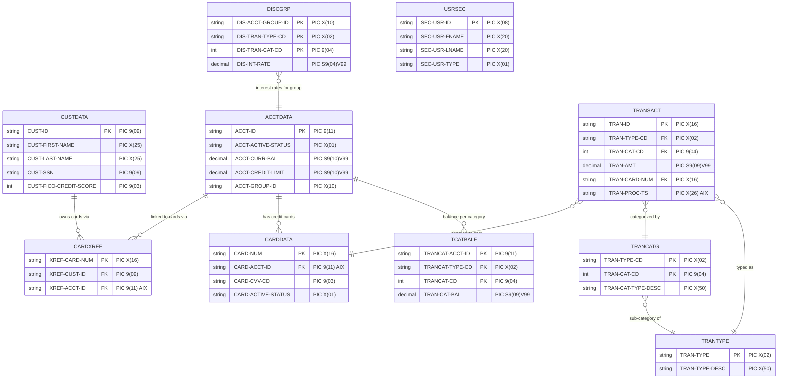

# Appendix B — VSAM Dataset Catalog

> **Navigation:** [Executive Summary](../00-executive-summary.md) | [Proprietary Utility Inventory](../01-proprietary-utility-inventory.md) | [Dependency Impact Analysis](../03-dependency-impact-analysis.md) | [Migration Strategy](../04-migration-strategy-per-utility.md)

---

## Overview

The AWS CardDemo application persists all business data in **VSAM (Virtual Storage Access Method)** datasets organized as **KSDS (Key-Sequenced Data Sets)**. VSAM is IBM's high-performance file management system on z/OS, and KSDS is its indexed-access organization where records are stored in logical key sequence with a companion index component enabling both keyed and sequential retrieval.

This appendix provides a complete catalog of every VSAM object discovered from the IDCAMS `LISTCAT` snapshot at [`app/catlg/LISTCAT.txt`](../../app/catlg/LISTCAT.txt). It inventories:

- **10 KSDS clusters** with key lengths, record sizes, and copybook mappings
- **3 Alternate Index (AIX)** paths with their key extraction positions
- **7 GDG (Generation Data Group)** base entries for versioned sequential output
- **Record layouts** cross-referenced from COBOL copybooks in [`app/cpy/`](../../app/cpy/)
- **RDS migration target mappings** with proposed relational table schemas
- **S3 migration targets** for GDG and sequential (NONVSAM) datasets

All attribute values (KEYLEN, AVGLRECL, RKP, AXRKP) are extracted directly from the LISTCAT output and validated against the corresponding COBOL copybook field definitions.

**Source:** [`app/catlg/LISTCAT.txt`](../../app/catlg/LISTCAT.txt) — IDCAMS LISTCAT ALL output generated 09/01/2022 at 15:36:44.

---

## 1. KSDS Cluster Inventory

The following table catalogs all 10 VSAM KSDS clusters used by the CardDemo application. Each cluster stores a distinct business entity with a defined primary key structure.

| # | Cluster Name | CICS File ID | KEYLEN | RKP | AVGLRECL | MAXLRECL | Copybook | Primary Key Field |
|---|-------------|-------------|--------|-----|----------|----------|----------|-------------------|
| 1 | `AWS.M2.CARDDEMO.ACCTDATA.VSAM.KSDS` | ACCTFILE | 11 | 0 | 300 | 300 | [`CVACT01Y.cpy`](../../app/cpy/CVACT01Y.cpy) | `ACCT-ID` PIC 9(11) |
| 2 | `AWS.M2.CARDDEMO.CARDDATA.VSAM.KSDS` | CARDFILE | 16 | 0 | 150 | 150 | [`CVACT02Y.cpy`](../../app/cpy/CVACT02Y.cpy) | `CARD-NUM` PIC X(16) |
| 3 | `AWS.M2.CARDDEMO.CARDXREF.VSAM.KSDS` | XREFFILE | 16 | 0 | 50 | 50 | [`CVACT03Y.cpy`](../../app/cpy/CVACT03Y.cpy) | `XREF-CARD-NUM` PIC X(16) |
| 4 | `AWS.M2.CARDDEMO.CUSTDATA.VSAM.KSDS` | CUSTFILE | 9 | 0 | 500 | 500 | [`CVCUS01Y.cpy`](../../app/cpy/CVCUS01Y.cpy) | `CUST-ID` PIC 9(09) |
| 5 | `AWS.M2.CARDDEMO.DISCGRP.VSAM.KSDS` | DISCGRP | 16 | 0 | 50 | 50 | [`CVTRA02Y.cpy`](../../app/cpy/CVTRA02Y.cpy) | `DIS-GROUP-KEY` (composite) |
| 6 | `AWS.M2.CARDDEMO.TCATBALF.VSAM.KSDS` | TCATBALF | 17 | 0 | 50 | 50 | [`CVTRA01Y.cpy`](../../app/cpy/CVTRA01Y.cpy) | `TRAN-CAT-KEY` (composite) |
| 7 | `AWS.M2.CARDDEMO.TRANCATG.VSAM.KSDS` | TRANCATG | 6 | 0 | 60 | 60 | [`CVTRA04Y.cpy`](../../app/cpy/CVTRA04Y.cpy) | `TRAN-CAT-KEY` (composite) |
| 8 | `AWS.M2.CARDDEMO.TRANSACT.VSAM.KSDS` | TRANSACT | 16 | 0 | 350 | 350 | [`CVTRA05Y.cpy`](../../app/cpy/CVTRA05Y.cpy) | `TRAN-ID` PIC X(16) |
| 9 | `AWS.M2.CARDDEMO.TRANTYPE.VSAM.KSDS` | TRANTYPE | 2 | 0 | 60 | 60 | [`CVTRA03Y.cpy`](../../app/cpy/CVTRA03Y.cpy) | `TRAN-TYPE` PIC X(02) |
| 10 | `AWS.M2.CARDDEMO.USRSEC.VSAM.KSDS` | USRSEC | 8 | 0 | 80 | 80 | [`CSUSR01Y.cpy`](../../app/cpy/CSUSR01Y.cpy) | `SEC-USR-ID` PIC X(08) |

**Column Definitions:**

- **KEYLEN** — Length in bytes of the primary key field within each record
- **RKP** (Relative Key Position) — Byte offset where the primary key begins within the record (0 = first byte)
- **AVGLRECL** — Average logical record length in bytes
- **MAXLRECL** — Maximum logical record length in bytes
- **Copybook** — COBOL copybook defining the record layout for this cluster

> **Note:** All 10 clusters use `RKP=0`, meaning the primary key occupies the leading bytes of every record. All clusters are `UNIQUE` keyed (no duplicate primary keys allowed) with `INDEXED` organization and `SHROPTNS(1,3)` (single region write, multiple region read).

**Source:** [`app/catlg/LISTCAT.txt`](../../app/catlg/LISTCAT.txt)

---

## 2. Alternate Index (AIX) Topology

Three VSAM Alternate Indexes provide secondary access paths into base clusters, enabling record retrieval by non-primary key fields. Each AIX has a corresponding PATH object that applications reference for access.

### 2.1 AIX Definitions

| # | AIX Name | Base Cluster | KEYLEN | AXRKP | RKP | AVGLRECL | Unique | Purpose |
|---|----------|-------------|--------|-------|-----|----------|--------|---------|
| 1 | `AWS.M2.CARDDEMO.CARDDATA.VSAM.AIX` | CARDDATA KSDS | 11 | 16 | 5 | 150 | No | Look up credit cards by account ID (`CARD-ACCT-ID` at byte 16) |
| 2 | `AWS.M2.CARDDEMO.CARDXREF.VSAM.AIX` | CARDXREF KSDS | 11 | 25 | 5 | 50 | No | Look up card cross-references by account ID (`XREF-ACCT-ID` at byte 25) |
| 3 | `AWS.M2.CARDDEMO.TRANSACT.VSAM.AIX` | TRANSACT KSDS | 26 | 304 | 5 | 350 | No | Browse transactions by processed timestamp (`TRAN-PROC-TS` at byte 304) |

**Column Definitions:**

- **AXRKP** (Alternate Index Key Relative Position) — Byte offset in the **base cluster record** where the alternate key value is extracted
- **KEYLEN** — Length of the alternate key extracted from the base record
- **RKP** — Relative Key Position within the AIX data component's own records
- **Unique** — Whether the AIX enforces unique alternate keys (`NONUNIQKEY` = No for all three)

### 2.2 AIX Key Derivation

**CARDDATA AIX** — Extracts `CARD-ACCT-ID` (PIC 9(11), 11 bytes) starting at byte offset 16 in the CARD-RECORD. This allows the application to browse all credit cards belonging to a specific account without scanning the entire CARDDATA cluster.

**CARDXREF AIX** — Extracts `XREF-ACCT-ID` (PIC 9(11), 11 bytes) starting at byte offset 25 in the CARD-XREF-RECORD. This enables lookup of all card-to-customer cross-reference entries for a given account.

**TRANSACT AIX** — Extracts `TRAN-PROC-TS` (PIC X(26), 26 bytes) starting at byte offset 304 in the TRAN-RECORD. This enables chronological browsing of transactions by their processing timestamp.

### 2.3 PATH Definitions

Each AIX has a PATH object that acts as the named entry point for application access:

| PATH Name | Points To | Used By |
|-----------|-----------|---------|
| `AWS.M2.CARDDEMO.CARDDATA.VSAM.AIX.PATH` | CARDDATA AIX | CICS programs accessing cards by account |
| `AWS.M2.CARDDEMO.CARDXREF.VSAM.AIX.PATH` | CARDXREF AIX | CICS programs accessing cross-references by account |
| `AWS.M2.CARDDEMO.TRANSACT.VSAM.AIX.PATH` | TRANSACT AIX | CICS programs browsing transactions chronologically |

> **Migration Note:** In a relational database, AIX paths map directly to **secondary indexes** on the target table columns. The NONUNIQKEY attribute on all three AIXes means the secondary indexes do not need a UNIQUE constraint.

**Source:** [`app/catlg/LISTCAT.txt`](../../app/catlg/LISTCAT.txt)

---

## 3. GDG Base Definitions

Generation Data Groups (GDGs) provide automatic versioning for sequential datasets on z/OS. Each GDG base defines a naming template, and individual generations (G0001V00, G0002V00, etc.) are created as batch jobs execute. The CardDemo application uses 7 GDG bases for batch output management.

| # | GDG Base Name | Purpose | Associated Batch Jobs | Current Generations |
|---|--------------|---------|----------------------|---------------------|
| 1 | `AWS.M2.CARDDEMO.DALYREJS` | Daily rejected transaction records | POSTTRAN (`CBTRN02C`) | G0001V00 – G0027V00 (27 generations) |
| 2 | `AWS.M2.CARDDEMO.SYSTRAN` | System-generated transaction records | Batch processing pipeline | G0001V00 (1 generation) |
| 3 | `AWS.M2.CARDDEMO.TCATBALF.BKUP` | Transaction category balance backup | TCATBALF backup job | G0001V00 (1 generation) |
| 4 | `AWS.M2.CARDDEMO.TRANREPT` | Transaction reports (statement generation) | CREASTMT (`CBSTM03A`) | G0001V00 – G0028V00 (28 generations) |
| 5 | `AWS.M2.CARDDEMO.TRANSACT.BKUP` | Transaction file backup | TRANBKP job | G0001V00 (1 generation) |
| 6 | `AWS.M2.CARDDEMO.TRANSACT.COMBINED` | Combined (merged) transactions | COMBTRAN job (DFSORT) | G0001V00 – G0028V00 (28 generations) |
| 7 | `AWS.M2.CARDDEMO.TRANSACT.DALY` | Daily transaction extracts | POSTTRAN processing | G0001V00 – G0025V00 (25 generations) |

**GDG Lifecycle in Batch Processing:**

The batch processing chain produces GDG generations at each stage:

1. **POSTTRAN** — Posts daily transactions, creating `TRANSACT.DALY` generations and routing rejects to `DALYREJS`
2. **COMBTRAN** — Merges daily transactions (via DFSORT) into `TRANSACT.COMBINED` generations
3. **CREASTMT** — Generates customer statements written to `TRANREPT` generations
4. **Backup jobs** — Periodically create `TRANSACT.BKUP` and `TCATBALF.BKUP` generations

> **Migration Note:** GDG bases map to **Amazon S3 buckets with versioning enabled**. Each GDG generation becomes a versioned S3 object, preserving the automatic version numbering semantics. See [Section 7](#7-s3-migration-for-gdg-and-sequential-datasets) for detailed mapping.

**Source:** [`app/catlg/LISTCAT.txt`](../../app/catlg/LISTCAT.txt)

---

## 4. Record Layout Cross-Reference

This section documents the COBOL copybook record structure for each KSDS cluster, showing field names, PIC clauses, byte lengths, and byte offsets. These layouts are authoritative for data migration schema design.

### 4.1 ACCTDATA — Account Record

**Copybook:** [`CVACT01Y.cpy`](../../app/cpy/CVACT01Y.cpy) | **Record Name:** `ACCOUNT-RECORD` | **Record Length:** 300 bytes

| # | Field Name | PIC Clause | Length (bytes) | Offset | Description |
|---|-----------|------------|---------------|--------|-------------|
| 1 | `ACCT-ID` | 9(11) | 11 | 0 | **Primary Key** — Account identifier |
| 2 | `ACCT-ACTIVE-STATUS` | X(01) | 1 | 11 | Account status flag (active/inactive) |
| 3 | `ACCT-CURR-BAL` | S9(10)V99 | 12 | 12 | Current account balance (signed decimal) |
| 4 | `ACCT-CREDIT-LIMIT` | S9(10)V99 | 12 | 24 | Credit limit |
| 5 | `ACCT-CASH-CREDIT-LIMIT` | S9(10)V99 | 12 | 36 | Cash advance credit limit |
| 6 | `ACCT-OPEN-DATE` | X(10) | 10 | 48 | Account opening date |
| 7 | `ACCT-EXPIRAION-DATE` | X(10) | 10 | 58 | Account expiration date |
| 8 | `ACCT-REISSUE-DATE` | X(10) | 10 | 68 | Card reissue date |
| 9 | `ACCT-CURR-CYC-CREDIT` | S9(10)V99 | 12 | 78 | Current cycle credits |
| 10 | `ACCT-CURR-CYC-DEBIT` | S9(10)V99 | 12 | 90 | Current cycle debits |
| 11 | `ACCT-ADDR-ZIP` | X(10) | 10 | 102 | Account holder ZIP code |
| 12 | `ACCT-GROUP-ID` | X(10) | 10 | 112 | Disclosure group identifier |
| 13 | `FILLER` | X(178) | 178 | 122 | Reserved space |
| | **Total** | | **300** | | |

### 4.2 CARDDATA — Card Record

**Copybook:** [`CVACT02Y.cpy`](../../app/cpy/CVACT02Y.cpy) | **Record Name:** `CARD-RECORD` | **Record Length:** 150 bytes

| # | Field Name | PIC Clause | Length (bytes) | Offset | Description |
|---|-----------|------------|---------------|--------|-------------|
| 1 | `CARD-NUM` | X(16) | 16 | 0 | **Primary Key** — Credit card number |
| 2 | `CARD-ACCT-ID` | 9(11) | 11 | 16 | **AIX Key** — Associated account ID |
| 3 | `CARD-CVV-CD` | 9(03) | 3 | 27 | Card verification value |
| 4 | `CARD-EMBOSSED-NAME` | X(50) | 50 | 30 | Cardholder name as embossed |
| 5 | `CARD-EXPIRAION-DATE` | X(10) | 10 | 80 | Card expiration date |
| 6 | `CARD-ACTIVE-STATUS` | X(01) | 1 | 90 | Card active status flag |
| 7 | `FILLER` | X(59) | 59 | 91 | Reserved space |
| | **Total** | | **150** | | |

> **AIX Note:** The CARDDATA AIX extracts `CARD-ACCT-ID` at byte offset 16 (AXRKP=16), enabling lookup of all cards for a given account.

### 4.3 CARDXREF — Card Cross-Reference Record

**Copybook:** [`CVACT03Y.cpy`](../../app/cpy/CVACT03Y.cpy) | **Record Name:** `CARD-XREF-RECORD` | **Record Length:** 50 bytes

| # | Field Name | PIC Clause | Length (bytes) | Offset | Description |
|---|-----------|------------|---------------|--------|-------------|
| 1 | `XREF-CARD-NUM` | X(16) | 16 | 0 | **Primary Key** — Card number |
| 2 | `XREF-CUST-ID` | 9(09) | 9 | 16 | Customer identifier (FK to CUSTDATA) |
| 3 | `XREF-ACCT-ID` | 9(11) | 11 | 25 | **AIX Key** — Account identifier (FK to ACCTDATA) |
| 4 | `FILLER` | X(14) | 14 | 36 | Reserved space |
| | **Total** | | **50** | | |

> **AIX Note:** The CARDXREF AIX extracts `XREF-ACCT-ID` at byte offset 25 (AXRKP=25), enabling lookup of all cross-reference entries for a given account.

### 4.4 CUSTDATA — Customer Record

**Copybook:** [`CVCUS01Y.cpy`](../../app/cpy/CVCUS01Y.cpy) | **Record Name:** `CUSTOMER-RECORD` | **Record Length:** 500 bytes

| # | Field Name | PIC Clause | Length (bytes) | Offset | Description |
|---|-----------|------------|---------------|--------|-------------|
| 1 | `CUST-ID` | 9(09) | 9 | 0 | **Primary Key** — Customer identifier |
| 2 | `CUST-FIRST-NAME` | X(25) | 25 | 9 | Customer first name |
| 3 | `CUST-MIDDLE-NAME` | X(25) | 25 | 34 | Customer middle name |
| 4 | `CUST-LAST-NAME` | X(25) | 25 | 59 | Customer last name |
| 5 | `CUST-ADDR-LINE-1` | X(50) | 50 | 84 | Address line 1 |
| 6 | `CUST-ADDR-LINE-2` | X(50) | 50 | 134 | Address line 2 |
| 7 | `CUST-ADDR-LINE-3` | X(50) | 50 | 184 | Address line 3 |
| 8 | `CUST-ADDR-STATE-CD` | X(02) | 2 | 234 | State code |
| 9 | `CUST-ADDR-COUNTRY-CD` | X(03) | 3 | 236 | Country code |
| 10 | `CUST-ADDR-ZIP` | X(10) | 10 | 239 | ZIP / postal code |
| 11 | `CUST-PHONE-NUM-1` | X(15) | 15 | 249 | Primary phone number |
| 12 | `CUST-PHONE-NUM-2` | X(15) | 15 | 264 | Secondary phone number |
| 13 | `CUST-SSN` | 9(09) | 9 | 279 | Social Security Number |
| 14 | `CUST-GOVT-ISSUED-ID` | X(20) | 20 | 288 | Government-issued ID |
| 15 | `CUST-DOB-YYYY-MM-DD` | X(10) | 10 | 308 | Date of birth |
| 16 | `CUST-EFT-ACCOUNT-ID` | X(10) | 10 | 318 | EFT (electronic funds transfer) account |
| 17 | `CUST-PRI-CARD-HOLDER-IND` | X(01) | 1 | 328 | Primary cardholder indicator |
| 18 | `CUST-FICO-CREDIT-SCORE` | 9(03) | 3 | 329 | FICO credit score |
| 19 | `FILLER` | X(168) | 168 | 332 | Reserved space |
| | **Total** | | **500** | | |

### 4.5 DISCGRP — Disclosure Group Record

**Copybook:** [`CVTRA02Y.cpy`](../../app/cpy/CVTRA02Y.cpy) | **Record Name:** `DIS-GROUP-RECORD` | **Record Length:** 50 bytes

| # | Field Name | PIC Clause | Length (bytes) | Offset | Description |
|---|-----------|------------|---------------|--------|-------------|
| 1 | `DIS-GROUP-KEY` (group) | — | 16 | 0 | **Primary Key** — Composite group key |
| 1a | ↳ `DIS-ACCT-GROUP-ID` | X(10) | 10 | 0 | Account group identifier |
| 1b | ↳ `DIS-TRAN-TYPE-CD` | X(02) | 2 | 10 | Transaction type code |
| 1c | ↳ `DIS-TRAN-CAT-CD` | 9(04) | 4 | 12 | Transaction category code |
| 2 | `DIS-INT-RATE` | S9(04)V99 | 6 | 16 | Interest rate for this disclosure group |
| 3 | `FILLER` | X(28) | 28 | 22 | Reserved space |
| | **Total** | | **50** | | |

> **Key Structure Note:** The 16-byte composite key `DIS-GROUP-KEY` consists of three sub-fields: the account group ID (linking to `ACCT-GROUP-ID` in ACCTDATA), the transaction type code, and the transaction category code. This composite key enables interest rate lookup by account group and transaction classification.

### 4.6 TCATBALF — Transaction Category Balance Record

**Copybook:** [`CVTRA01Y.cpy`](../../app/cpy/CVTRA01Y.cpy) | **Record Name:** `TRAN-CAT-BAL-RECORD` | **Record Length:** 50 bytes

| # | Field Name | PIC Clause | Length (bytes) | Offset | Description |
|---|-----------|------------|---------------|--------|-------------|
| 1 | `TRAN-CAT-KEY` (group) | — | 17 | 0 | **Primary Key** — Composite balance key |
| 1a | ↳ `TRANCAT-ACCT-ID` | 9(11) | 11 | 0 | Account identifier (FK to ACCTDATA) |
| 1b | ↳ `TRANCAT-TYPE-CD` | X(02) | 2 | 11 | Transaction type code |
| 1c | ↳ `TRANCAT-CD` | 9(04) | 4 | 13 | Transaction category code |
| 2 | `TRAN-CAT-BAL` | S9(09)V99 | 11 | 17 | Balance amount for this category |
| 3 | `FILLER` | X(22) | 22 | 28 | Reserved space |
| | **Total** | | **50** | | |

> **Key Structure Note:** The 17-byte composite key `TRAN-CAT-KEY` links an account (via `TRANCAT-ACCT-ID`) to a specific transaction type and category, storing the running balance for that combination. This supports per-account, per-category balance tracking.

### 4.7 TRANCATG — Transaction Category Record

**Copybook:** [`CVTRA04Y.cpy`](../../app/cpy/CVTRA04Y.cpy) | **Record Name:** `TRAN-CAT-RECORD` | **Record Length:** 60 bytes

| # | Field Name | PIC Clause | Length (bytes) | Offset | Description |
|---|-----------|------------|---------------|--------|-------------|
| 1 | `TRAN-CAT-KEY` (group) | — | 6 | 0 | **Primary Key** — Composite category key |
| 1a | ↳ `TRAN-TYPE-CD` | X(02) | 2 | 0 | Transaction type code (FK to TRANTYPE) |
| 1b | ↳ `TRAN-CAT-CD` | 9(04) | 4 | 2 | Transaction category code |
| 2 | `TRAN-CAT-TYPE-DESC` | X(50) | 50 | 6 | Category description |
| 3 | `FILLER` | X(04) | 4 | 56 | Reserved space |
| | **Total** | | **60** | | |

### 4.8 TRANSACT — Transaction Record

**Copybook:** [`CVTRA05Y.cpy`](../../app/cpy/CVTRA05Y.cpy) | **Record Name:** `TRAN-RECORD` | **Record Length:** 350 bytes

| # | Field Name | PIC Clause | Length (bytes) | Offset | Description |
|---|-----------|------------|---------------|--------|-------------|
| 1 | `TRAN-ID` | X(16) | 16 | 0 | **Primary Key** — Transaction identifier |
| 2 | `TRAN-TYPE-CD` | X(02) | 2 | 16 | Transaction type code (FK to TRANTYPE) |
| 3 | `TRAN-CAT-CD` | 9(04) | 4 | 18 | Transaction category code (FK to TRANCATG) |
| 4 | `TRAN-SOURCE` | X(10) | 10 | 22 | Transaction source identifier |
| 5 | `TRAN-DESC` | X(100) | 100 | 32 | Transaction description |
| 6 | `TRAN-AMT` | S9(09)V99 | 11 | 132 | Transaction amount (signed decimal) |
| 7 | `TRAN-MERCHANT-ID` | 9(09) | 9 | 143 | Merchant identifier |
| 8 | `TRAN-MERCHANT-NAME` | X(50) | 50 | 152 | Merchant name |
| 9 | `TRAN-MERCHANT-CITY` | X(50) | 50 | 202 | Merchant city |
| 10 | `TRAN-MERCHANT-ZIP` | X(10) | 10 | 252 | Merchant ZIP code |
| 11 | `TRAN-CARD-NUM` | X(16) | 16 | 262 | Card number used (FK to CARDDATA) |
| 12 | `TRAN-ORIG-TS` | X(26) | 26 | 278 | Original transaction timestamp |
| 13 | `TRAN-PROC-TS` | X(26) | 26 | 304 | **AIX Key** — Processed timestamp |
| 14 | `FILLER` | X(20) | 20 | 330 | Reserved space |
| | **Total** | | **350** | | |

> **AIX Note:** The TRANSACT AIX extracts `TRAN-PROC-TS` at byte offset 304 (AXRKP=304), enabling chronological browsing of transactions by processing timestamp. The `NONUNIQKEY` attribute allows multiple transactions with the same timestamp.

### 4.9 TRANTYPE — Transaction Type Record

**Copybook:** [`CVTRA03Y.cpy`](../../app/cpy/CVTRA03Y.cpy) | **Record Name:** `TRAN-TYPE-RECORD` | **Record Length:** 60 bytes

| # | Field Name | PIC Clause | Length (bytes) | Offset | Description |
|---|-----------|------------|---------------|--------|-------------|
| 1 | `TRAN-TYPE` | X(02) | 2 | 0 | **Primary Key** — Transaction type code |
| 2 | `TRAN-TYPE-DESC` | X(50) | 50 | 2 | Transaction type description |
| 3 | `FILLER` | X(08) | 8 | 52 | Reserved space |
| | **Total** | | **60** | | |

### 4.10 USRSEC — User Security Record

**Copybook:** [`CSUSR01Y.cpy`](../../app/cpy/CSUSR01Y.cpy) | **Record Name:** `SEC-USER-DATA` | **Record Length:** 80 bytes

| # | Field Name | PIC Clause | Length (bytes) | Offset | Description |
|---|-----------|------------|---------------|--------|-------------|
| 1 | `SEC-USR-ID` | X(08) | 8 | 0 | **Primary Key** — User login identifier |
| 2 | `SEC-USR-FNAME` | X(20) | 20 | 8 | User first name |
| 3 | `SEC-USR-LNAME` | X(20) | 20 | 28 | User last name |
| 4 | `SEC-USR-PWD` | X(08) | 8 | 48 | User password (plaintext) |
| 5 | `SEC-USR-TYPE` | X(01) | 1 | 56 | User type (e.g., 'A' = admin, 'U' = user) |
| 6 | `SEC-USR-FILLER` | X(23) | 23 | 57 | Reserved space |
| | **Total** | | **80** | | |

> **Security Note:** The `SEC-USR-PWD` field stores passwords in plaintext within the VSAM record. The migration to RDS **must** implement proper password hashing (e.g., bcrypt, PBKDF2) as part of the security modernization.

**Source:** Copybooks in [`app/cpy/`](../../app/cpy/)

---

## 5. Entity-Relationship Diagram

The following Mermaid ER diagram illustrates the relationships between VSAM KSDS clusters based on foreign key references identified in the copybook record layouts.



**Relationship Descriptions:**

| Relationship | Cardinality | Description |
|-------------|-------------|-------------|
| CUSTDATA → CARDXREF | One-to-Many | A customer can have multiple card cross-reference entries |
| ACCTDATA → CARDXREF | One-to-Many | An account can be linked to multiple cards via cross-references |
| ACCTDATA → CARDDATA | One-to-Many | An account can have multiple credit cards (AIX access path) |
| CARDDATA → TRANSACT | One-to-Many | A card can have multiple transactions (`TRAN-CARD-NUM` FK) |
| TRANTYPE → TRANSACT | One-to-Many | A transaction type applies to multiple transactions |
| TRANCATG → TRANSACT | One-to-Many | A transaction category applies to multiple transactions |
| TRANTYPE → TRANCATG | One-to-Many | A transaction type has multiple sub-categories |
| ACCTDATA → TCATBALF | One-to-Many | An account tracks balances across multiple categories |
| ACCTDATA → DISCGRP | One-to-Many | An account group has disclosure rules per type/category |

> **Note:** The `USRSEC` cluster stores application user credentials and is not directly linked to `CUSTDATA` by a foreign key in the VSAM design. In the migrated relational schema, an explicit relationship should be established if business requirements dictate user-to-customer mapping.

---

## 6. RDS Table Mapping

This section maps each VSAM KSDS cluster to a proposed Amazon RDS (PostgreSQL) relational table schema. The mapping preserves all primary keys, replicates AIX paths as secondary indexes, and enforces referential integrity through foreign key constraints that were implicit in the VSAM design.

### 6.1 Table Schema Overview

| # | VSAM Cluster | RDS Table Name | Primary Key | Secondary Indexes | Foreign Keys |
|---|-------------|---------------|-------------|-------------------|--------------|
| 1 | ACCTDATA | `card_accounts` | `acct_id VARCHAR(11)` | `idx_acct_status`, `idx_acct_group` | — |
| 2 | CARDDATA | `credit_cards` | `card_num VARCHAR(16)` | `idx_card_acct_id` ← AIX | `acct_id → card_accounts` |
| 3 | CARDXREF | `card_xref` | `card_num VARCHAR(16)` | `idx_xref_acct_id` ← AIX, `idx_xref_cust_id` | `cust_id → customers`, `acct_id → card_accounts` |
| 4 | CUSTDATA | `customers` | `cust_id VARCHAR(9)` | `idx_cust_name`, `idx_cust_ssn` | — |
| 5 | DISCGRP | `disclosure_groups` | `(acct_group_id, tran_type_cd, tran_cat_cd)` | — | — |
| 6 | TCATBALF | `tran_cat_balances` | `(acct_id, type_cd, cat_cd)` | — | `acct_id → card_accounts` |
| 7 | TRANCATG | `transaction_categories` | `(type_cd, cat_cd)` | — | `type_cd → transaction_types` |
| 8 | TRANSACT | `transactions` | `tran_id VARCHAR(16)` | `idx_tran_proc_ts` ← AIX, `idx_tran_card`, `idx_tran_type_cat` | `card_num → credit_cards`, `type_cd → transaction_types` |
| 9 | TRANTYPE | `transaction_types` | `tran_type VARCHAR(2)` | — | — |
| 10 | USRSEC | `user_security` | `usr_id VARCHAR(8)` | — | — |

### 6.2 Detailed DDL Specifications

#### 6.2.1 card_accounts (from ACCTDATA)

```sql
CREATE TABLE card_accounts (
    acct_id             VARCHAR(11)     NOT NULL,   -- ACCT-ID PIC 9(11)
    active_status       CHAR(1),                     -- ACCT-ACTIVE-STATUS PIC X(01)
    curr_bal            DECIMAL(12,2),               -- ACCT-CURR-BAL PIC S9(10)V99
    credit_limit        DECIMAL(12,2),               -- ACCT-CREDIT-LIMIT PIC S9(10)V99
    cash_credit_limit   DECIMAL(12,2),               -- ACCT-CASH-CREDIT-LIMIT PIC S9(10)V99
    open_date           VARCHAR(10),                 -- ACCT-OPEN-DATE PIC X(10)
    expiration_date     VARCHAR(10),                 -- ACCT-EXPIRAION-DATE PIC X(10)
    reissue_date        VARCHAR(10),                 -- ACCT-REISSUE-DATE PIC X(10)
    curr_cyc_credit     DECIMAL(12,2),               -- ACCT-CURR-CYC-CREDIT PIC S9(10)V99
    curr_cyc_debit      DECIMAL(12,2),               -- ACCT-CURR-CYC-DEBIT PIC S9(10)V99
    addr_zip            VARCHAR(10),                 -- ACCT-ADDR-ZIP PIC X(10)
    group_id            VARCHAR(10),                 -- ACCT-GROUP-ID PIC X(10)
    CONSTRAINT pk_card_accounts PRIMARY KEY (acct_id)
);

CREATE INDEX idx_acct_status ON card_accounts (active_status);
CREATE INDEX idx_acct_group ON card_accounts (group_id);
```

#### 6.2.2 credit_cards (from CARDDATA)

```sql
CREATE TABLE credit_cards (
    card_num            VARCHAR(16)     NOT NULL,   -- CARD-NUM PIC X(16)
    acct_id             VARCHAR(11)     NOT NULL,   -- CARD-ACCT-ID PIC 9(11)
    cvv_code            VARCHAR(3),                  -- CARD-CVV-CD PIC 9(03)
    embossed_name       VARCHAR(50),                 -- CARD-EMBOSSED-NAME PIC X(50)
    expiration_date     VARCHAR(10),                 -- CARD-EXPIRAION-DATE PIC X(10)
    active_status       CHAR(1),                     -- CARD-ACTIVE-STATUS PIC X(01)
    CONSTRAINT pk_credit_cards PRIMARY KEY (card_num),
    CONSTRAINT fk_card_account FOREIGN KEY (acct_id)
        REFERENCES card_accounts (acct_id)
);

-- Mirrors CARDDATA AIX (AXRKP=16, KEYLEN=11)
CREATE INDEX idx_card_acct_id ON credit_cards (acct_id);
```

#### 6.2.3 card_xref (from CARDXREF)

```sql
CREATE TABLE card_xref (
    card_num            VARCHAR(16)     NOT NULL,   -- XREF-CARD-NUM PIC X(16)
    cust_id             VARCHAR(9)      NOT NULL,   -- XREF-CUST-ID PIC 9(09)
    acct_id             VARCHAR(11)     NOT NULL,   -- XREF-ACCT-ID PIC 9(11)
    CONSTRAINT pk_card_xref PRIMARY KEY (card_num),
    CONSTRAINT fk_xref_customer FOREIGN KEY (cust_id)
        REFERENCES customers (cust_id),
    CONSTRAINT fk_xref_account FOREIGN KEY (acct_id)
        REFERENCES card_accounts (acct_id)
);

-- Mirrors CARDXREF AIX (AXRKP=25, KEYLEN=11)
CREATE INDEX idx_xref_acct_id ON card_xref (acct_id);
CREATE INDEX idx_xref_cust_id ON card_xref (cust_id);
```

#### 6.2.4 customers (from CUSTDATA)

```sql
CREATE TABLE customers (
    cust_id             VARCHAR(9)      NOT NULL,   -- CUST-ID PIC 9(09)
    first_name          VARCHAR(25),                 -- CUST-FIRST-NAME PIC X(25)
    middle_name         VARCHAR(25),                 -- CUST-MIDDLE-NAME PIC X(25)
    last_name           VARCHAR(25),                 -- CUST-LAST-NAME PIC X(25)
    addr_line_1         VARCHAR(50),                 -- CUST-ADDR-LINE-1 PIC X(50)
    addr_line_2         VARCHAR(50),                 -- CUST-ADDR-LINE-2 PIC X(50)
    addr_line_3         VARCHAR(50),                 -- CUST-ADDR-LINE-3 PIC X(50)
    state_cd            CHAR(2),                     -- CUST-ADDR-STATE-CD PIC X(02)
    country_cd          CHAR(3),                     -- CUST-ADDR-COUNTRY-CD PIC X(03)
    zip                 VARCHAR(10),                 -- CUST-ADDR-ZIP PIC X(10)
    phone_num_1         VARCHAR(15),                 -- CUST-PHONE-NUM-1 PIC X(15)
    phone_num_2         VARCHAR(15),                 -- CUST-PHONE-NUM-2 PIC X(15)
    ssn                 VARCHAR(9),                  -- CUST-SSN PIC 9(09)
    govt_issued_id      VARCHAR(20),                 -- CUST-GOVT-ISSUED-ID PIC X(20)
    dob                 VARCHAR(10),                 -- CUST-DOB-YYYY-MM-DD PIC X(10)
    eft_account_id      VARCHAR(10),                 -- CUST-EFT-ACCOUNT-ID PIC X(10)
    pri_card_holder_ind CHAR(1),                     -- CUST-PRI-CARD-HOLDER-IND PIC X(01)
    fico_credit_score   SMALLINT,                    -- CUST-FICO-CREDIT-SCORE PIC 9(03)
    CONSTRAINT pk_customers PRIMARY KEY (cust_id)
);

CREATE INDEX idx_cust_name ON customers (last_name, first_name);
CREATE INDEX idx_cust_ssn ON customers (ssn);
```

#### 6.2.5 disclosure_groups (from DISCGRP)

```sql
CREATE TABLE disclosure_groups (
    acct_group_id       VARCHAR(10)     NOT NULL,   -- DIS-ACCT-GROUP-ID PIC X(10)
    tran_type_cd        VARCHAR(2)      NOT NULL,   -- DIS-TRAN-TYPE-CD PIC X(02)
    tran_cat_cd         INTEGER         NOT NULL,   -- DIS-TRAN-CAT-CD PIC 9(04)
    int_rate            DECIMAL(6,2),                -- DIS-INT-RATE PIC S9(04)V99
    CONSTRAINT pk_disclosure_groups
        PRIMARY KEY (acct_group_id, tran_type_cd, tran_cat_cd)
);
```

#### 6.2.6 tran_cat_balances (from TCATBALF)

```sql
CREATE TABLE tran_cat_balances (
    acct_id             VARCHAR(11)     NOT NULL,   -- TRANCAT-ACCT-ID PIC 9(11)
    type_cd             VARCHAR(2)      NOT NULL,   -- TRANCAT-TYPE-CD PIC X(02)
    cat_cd              INTEGER         NOT NULL,   -- TRANCAT-CD PIC 9(04)
    balance             DECIMAL(11,2),               -- TRAN-CAT-BAL PIC S9(09)V99
    CONSTRAINT pk_tran_cat_balances
        PRIMARY KEY (acct_id, type_cd, cat_cd),
    CONSTRAINT fk_tcatbal_account FOREIGN KEY (acct_id)
        REFERENCES card_accounts (acct_id)
);
```

#### 6.2.7 transaction_categories (from TRANCATG)

```sql
CREATE TABLE transaction_categories (
    type_cd             VARCHAR(2)      NOT NULL,   -- TRAN-TYPE-CD PIC X(02)
    cat_cd              INTEGER         NOT NULL,   -- TRAN-CAT-CD PIC 9(04)
    description         VARCHAR(50),                 -- TRAN-CAT-TYPE-DESC PIC X(50)
    CONSTRAINT pk_transaction_categories
        PRIMARY KEY (type_cd, cat_cd),
    CONSTRAINT fk_trancat_type FOREIGN KEY (type_cd)
        REFERENCES transaction_types (tran_type)
);
```

#### 6.2.8 transactions (from TRANSACT)

```sql
CREATE TABLE transactions (
    tran_id             VARCHAR(16)     NOT NULL,   -- TRAN-ID PIC X(16)
    type_cd             VARCHAR(2),                  -- TRAN-TYPE-CD PIC X(02)
    cat_cd              INTEGER,                     -- TRAN-CAT-CD PIC 9(04)
    source              VARCHAR(10),                 -- TRAN-SOURCE PIC X(10)
    description         VARCHAR(100),                -- TRAN-DESC PIC X(100)
    amount              DECIMAL(11,2),               -- TRAN-AMT PIC S9(09)V99
    merchant_id         VARCHAR(9),                  -- TRAN-MERCHANT-ID PIC 9(09)
    merchant_name       VARCHAR(50),                 -- TRAN-MERCHANT-NAME PIC X(50)
    merchant_city       VARCHAR(50),                 -- TRAN-MERCHANT-CITY PIC X(50)
    merchant_zip        VARCHAR(10),                 -- TRAN-MERCHANT-ZIP PIC X(10)
    card_num            VARCHAR(16),                 -- TRAN-CARD-NUM PIC X(16)
    orig_ts             VARCHAR(26),                 -- TRAN-ORIG-TS PIC X(26)
    proc_ts             VARCHAR(26),                 -- TRAN-PROC-TS PIC X(26)
    CONSTRAINT pk_transactions PRIMARY KEY (tran_id),
    CONSTRAINT fk_tran_card FOREIGN KEY (card_num)
        REFERENCES credit_cards (card_num),
    CONSTRAINT fk_tran_type FOREIGN KEY (type_cd)
        REFERENCES transaction_types (tran_type)
);

-- Mirrors TRANSACT AIX (AXRKP=304, KEYLEN=26)
CREATE INDEX idx_tran_proc_ts ON transactions (proc_ts);
CREATE INDEX idx_tran_card ON transactions (card_num);
CREATE INDEX idx_tran_type_cat ON transactions (type_cd, cat_cd);
```

#### 6.2.9 transaction_types (from TRANTYPE)

```sql
CREATE TABLE transaction_types (
    tran_type           VARCHAR(2)      NOT NULL,   -- TRAN-TYPE PIC X(02)
    description         VARCHAR(50),                 -- TRAN-TYPE-DESC PIC X(50)
    CONSTRAINT pk_transaction_types PRIMARY KEY (tran_type)
);
```

#### 6.2.10 user_security (from USRSEC)

```sql
CREATE TABLE user_security (
    usr_id              VARCHAR(8)      NOT NULL,   -- SEC-USR-ID PIC X(08)
    first_name          VARCHAR(20),                 -- SEC-USR-FNAME PIC X(20)
    last_name           VARCHAR(20),                 -- SEC-USR-LNAME PIC X(20)
    password_hash       VARCHAR(255),                -- SEC-USR-PWD — MUST be hashed
    user_type           CHAR(1),                     -- SEC-USR-TYPE PIC X(01)
    CONSTRAINT pk_user_security PRIMARY KEY (usr_id)
);
```

> **Data Type Mapping Notes:**
> - COBOL `PIC 9(n)` (numeric display) → `VARCHAR(n)` to preserve leading zeros, or `BIGINT`/`INTEGER` if leading zeros are not significant
> - COBOL `PIC S9(n)V99` (signed decimal) → `DECIMAL(n+2, 2)` for exact arithmetic
> - COBOL `PIC X(n)` (alphanumeric) → `VARCHAR(n)` with `RTRIM` applied during migration to remove trailing spaces
> - COBOL `FILLER` fields → Not migrated; serve only as record padding in fixed-length VSAM records
> - Dates stored as `PIC X(10)` → Consider migration to `DATE` type with format validation
> - Timestamps stored as `PIC X(26)` → Consider migration to `TIMESTAMP` type with format parsing

### 6.3 Recommended Table Creation Order

Due to foreign key dependencies, tables must be created in the following order:

1. `transaction_types` — No dependencies
2. `card_accounts` — No dependencies
3. `customers` — No dependencies
4. `user_security` — No dependencies
5. `credit_cards` — Depends on `card_accounts`
6. `card_xref` — Depends on `customers` and `card_accounts`
7. `transaction_categories` — Depends on `transaction_types`
8. `transactions` — Depends on `credit_cards` and `transaction_types`
9. `tran_cat_balances` — Depends on `card_accounts`
10. `disclosure_groups` — No FK constraints (linked via `group_id` convention)

---

## 7. S3 Migration for GDG and Sequential Datasets

GDG bases and sequential (Physical Sequential / PS) datasets do not have relational structure and are best migrated to **Amazon S3** with versioning and lifecycle policies.

### 7.1 GDG-to-S3 Mapping

| GDG Base | S3 Bucket / Prefix | Versioning | Lifecycle Policy |
|----------|-------------------|------------|------------------|
| `DALYREJS` | `s3://carddemo-batch/daily-rejects/` | Enabled | Retain 90 days, then transition to S3 Glacier |
| `SYSTRAN` | `s3://carddemo-batch/system-transactions/` | Enabled | Retain indefinitely |
| `TCATBALF.BKUP` | `s3://carddemo-batch/tcatbal-backup/` | Enabled | Retain 30 days, then delete |
| `TRANREPT` | `s3://carddemo-batch/transaction-reports/` | Enabled | Retain 7 years (regulatory compliance) |
| `TRANSACT.BKUP` | `s3://carddemo-batch/transaction-backup/` | Enabled | Retain 30 days, then transition to Glacier |
| `TRANSACT.COMBINED` | `s3://carddemo-batch/combined-transactions/` | Enabled | Retain 90 days |
| `TRANSACT.DALY` | `s3://carddemo-batch/daily-transactions/` | Enabled | Retain 90 days |

**GDG Generation Numbering → S3 Object Versioning:**

- Each GDG generation (e.g., `TRANSACT.DALY.G0001V00`) maps to a versioned S3 object at the prefix path
- S3 version IDs replace the GDG `GnnnnVnn` numbering scheme
- To preserve explicit ordering, include a timestamp or sequence number in the S3 object key (e.g., `daily-transactions/2022-08-30-001.dat`)
- The `+1` / `-1` relative generation references in JCL (e.g., `DISP=(NEW,CATLG)` for `(+1)`) translate to uploading a new version to the S3 prefix

### 7.2 Sequential Dataset (NONVSAM PS) to S3 Mapping

Physical Sequential datasets used for data loading and staging map to S3 objects:

| NONVSAM Dataset | Purpose | S3 Target | Format |
|----------------|---------|-----------|--------|
| `ACCTDATA.PS` | Account data load file | `s3://carddemo-data/seed/acctdata.dat` | Fixed-width 300-byte records |
| `CARDDATA.PS` | Card data load file | `s3://carddemo-data/seed/carddata.dat` | Fixed-width 150-byte records |
| `CARDXREF.PS` | Card cross-reference load | `s3://carddemo-data/seed/cardxref.dat` | Fixed-width 50-byte records |
| `CUSTDATA.PS` | Customer data load file | `s3://carddemo-data/seed/custdata.dat` | Fixed-width 500-byte records |
| `DISCGRP.PS` | Disclosure group load | `s3://carddemo-data/seed/discgrp.dat` | Fixed-width 50-byte records |
| `TCATBALF.PS` | Category balance load | `s3://carddemo-data/seed/tcatbalf.dat` | Fixed-width 50-byte records |
| `TRANCATG.PS` | Transaction category load | `s3://carddemo-data/seed/trancatg.dat` | Fixed-width 60-byte records |
| `TRANTYPE.PS` | Transaction type load | `s3://carddemo-data/seed/trantype.dat` | Fixed-width 60-byte records |
| `USRSEC.PS` | User security load | `s3://carddemo-data/seed/usrsec.dat` | Fixed-width 80-byte records |
| `SECURITY.PS` | Security configuration | `s3://carddemo-data/seed/security.dat` | Fixed-width records |
| `DATEPARM` | Date parameter file | `s3://carddemo-config/dateparm.dat` | Parameter file |
| `TCATBALF.REPT` | Category balance report | `s3://carddemo-batch/tcatbal-report/` | Report output |

> **Encoding Note:** The original EBCDIC-encoded `.PS` files in [`app/data/EBCDIC/`](../../app/data/EBCDIC/) must be converted to ASCII (or UTF-8) during migration. ASCII equivalents already exist in [`app/data/ASCII/`](../../app/data/ASCII/) and can serve as reference for validation.

---

## 8. NONVSAM Dataset Inventory

The LISTCAT output includes 160 NONVSAM entries encompassing source libraries, load libraries, JCL, and data files. The following tables summarize entries relevant to the migration analysis.

### 8.1 Data Files (Physical Sequential)

These flat files are used for initial VSAM cluster loading via IDCAMS REPRO or IEBGENER:

| Dataset Name | Record Length | Corresponding KSDS | Load Method |
|-------------|--------------|-------------------|-------------|
| `AWS.M2.CARDDEMO.ACCTDATA.PS` | 300 | ACCTDATA | IDCAMS REPRO |
| `AWS.M2.CARDDEMO.CARDDATA.PS` | 150 | CARDDATA | IDCAMS REPRO |
| `AWS.M2.CARDDEMO.CARDXREF.PS` | 50 | CARDXREF | IDCAMS REPRO |
| `AWS.M2.CARDDEMO.CUSTDATA.PS` | 500 | CUSTDATA | IDCAMS REPRO |
| `AWS.M2.CARDDEMO.DISCGRP.PS` | 50 | DISCGRP | IDCAMS REPRO |
| `AWS.M2.CARDDEMO.TCATBALF.PS` | 50 | TCATBALF | IDCAMS REPRO |
| `AWS.M2.CARDDEMO.TRANCATG.PS` | 60 | TRANCATG | IDCAMS REPRO |
| `AWS.M2.CARDDEMO.TRANTYPE.PS` | 60 | TRANTYPE | IDCAMS REPRO |
| `AWS.M2.CARDDEMO.USRSEC.PS` | 80 | USRSEC | IEBGENER / REPRO |

### 8.2 Operational Libraries

| Dataset Name | Purpose |
|-------------|---------|
| `AWS.M2.CARDDEMO.CBL` | COBOL source library (PDS) |
| `AWS.M2.CARDDEMO.CPY` | Copybook library (PDS) |
| `AWS.M2.CARDDEMO.BMS` | BMS map source library (PDS) |
| `AWS.M2.CARDDEMO.JCL` | JCL procedure library (PDS) |
| `AWS.M2.CARDDEMO.JCL.UTIL` | JCL utility procedures (PDS) |
| `AWS.M2.CARDDEMO.PROC` | Cataloged procedures (PDS) |
| `AWS.M2.CARDDEMO.PRC.UTIL` | Utility procedures (PDS) |
| `AWS.M2.CARDDEMO.LOADLIB` | Executable load library (PDS) |
| `AWS.M2.CARDDEMO.BIND` | CICS bind output (PDS) |
| `AWS.M2.CARDDEMO.LISTING` | Compilation listings (PDS) |
| `AWS.M2.CARDDEMO.LST` | Listing output (PDS) |
| `AWS.M2.CARDDEMO.DCL` | Declaration library (PDS) |
| `AWS.M2.CARDDEMO.CNTL` | Control card library (PDS) |
| `AWS.M2.CARDDEMO.REXX.UTIL` | REXX utility scripts (PDS) |
| `AWS.M2.CARDDEMO.LISTCAT` | LISTCAT output dataset |

### 8.3 GDG Generation Entries

The 160 NONVSAM entries include numerous GDG generation datasets:

| GDG Base | Generation Range | Count |
|----------|-----------------|-------|
| DALYREJS | G0001V00 – G0027V00 | 27 |
| SYSTRAN | G0001V00 | 1 |
| TCATBALF.BKUP | G0001V00 | 1 |
| TRANREPT | G0001V00 – G0028V00 | 28 |
| TRANSACT.BKUP | G0001V00 | 1 |
| TRANSACT.COMBINED | G0001V00 – G0028V00 | 28 |
| TRANSACT.DALY | G0001V00 – G0025V00 | 25 |
| **Total GDG generations** | | **111** |

---

## 9. LISTCAT Summary Statistics

The following statistics are extracted from the end of [`app/catlg/LISTCAT.txt`](../../app/catlg/LISTCAT.txt):

| Object Type | Count | Description |
|------------|-------|-------------|
| AIX | 3 | Alternate Index definitions (CARDDATA, CARDXREF, TRANSACT) |
| ALIAS | 0 | Catalog aliases |
| CLUSTER | 10 | VSAM KSDS cluster definitions |
| DATA | 13 | Data components (10 KSDS + 3 AIX) |
| GDG | 7 | Generation Data Group base definitions |
| INDEX | 13 | Index components (10 KSDS + 3 AIX) |
| NONVSAM | 160 | Non-VSAM entries (PS files, PDSs, GDG generations) |
| PAGESPACE | 0 | Page space definitions |
| PATH | 3 | AIX path definitions (CARDDATA, CARDXREF, TRANSACT) |
| SPACE | 0 | Space definitions |
| USERCATALOG | 0 | User catalog definitions |
| TAPELIBRARY | 0 | Tape library definitions |
| TAPEVOLUME | 0 | Tape volume definitions |
| **TOTAL** | **209** | **All catalog entries** |

**Key Observations:**

- **13 DATA + 13 INDEX = 26 components** — Each of the 10 KSDS clusters has a DATA and INDEX component, plus 3 AIX definitions each contribute a DATA and INDEX component (10 + 3 = 13)
- **3 PATH entries** correspond 1:1 with the 3 AIX definitions
- **160 NONVSAM entries** include operational libraries (PDS), data load files (PS), GDG generations, and configuration files
- **7 GDG bases** produce 111 generation entries (counted in the 160 NONVSAM total)
- All entries reside in catalog `CATALOG.XXXXXXXX.YYYY` with zero protected entries suppressed

---

## 10. Migration Considerations

### 10.1 Data Conversion Requirements

| Aspect | VSAM (Source) | RDS/S3 (Target) | Conversion Required |
|--------|--------------|-----------------|---------------------|
| Character encoding | EBCDIC | UTF-8 | Yes — full EBCDIC-to-UTF-8 translation |
| Numeric format | DISPLAY (zoned decimal) | `DECIMAL` / `INTEGER` | Yes — zone bits must be stripped |
| Signed decimals | Overpunched sign in last byte | Standard sign representation | Yes — sign extraction required |
| Fixed-length records | Padded with spaces/nulls | Variable-length columns | Yes — `RTRIM` trailing spaces |
| Date formats | `PIC X(10)` strings | `DATE` / `TIMESTAMP` | Yes — format parsing and validation |
| Key structure | Physical byte position (RKP) | Logical column constraints | Implicit — handled by schema design |

### 10.2 Referential Integrity Enhancement

The VSAM design relies on **implicit relationships** (matching field names across copybooks) rather than enforced constraints. The RDS migration introduces **explicit foreign key constraints** that must be validated during data loading:

1. All `XREF-ACCT-ID` values in CARDXREF must exist in ACCTDATA
2. All `XREF-CUST-ID` values in CARDXREF must exist in CUSTDATA
3. All `CARD-ACCT-ID` values in CARDDATA must exist in ACCTDATA
4. All `TRAN-CARD-NUM` values in TRANSACT must exist in CARDDATA
5. All `TRAN-TYPE-CD` values in TRANSACT must exist in TRANTYPE
6. All `TRANCAT-ACCT-ID` values in TCATBALF must exist in ACCTDATA

> **Risk:** If the source VSAM data contains orphaned references (e.g., a transaction referencing a deleted card), the RDS load will fail on foreign key constraints. A pre-migration data quality audit is recommended.

### 10.3 VSAM Access Pattern to SQL Mapping

| VSAM Operation | CICS Command | SQL Equivalent |
|---------------|-------------|----------------|
| Keyed read | `EXEC CICS READ FILE(...) RIDFLD(key)` | `SELECT * FROM table WHERE pk = ?` |
| Keyed update | `EXEC CICS READ ... UPDATE` + `REWRITE` | `UPDATE table SET ... WHERE pk = ?` |
| Keyed delete | `EXEC CICS DELETE FILE(...) RIDFLD(key)` | `DELETE FROM table WHERE pk = ?` |
| Keyed write | `EXEC CICS WRITE FILE(...) FROM(rec)` | `INSERT INTO table VALUES (...)` |
| Browse start | `EXEC CICS STARTBR FILE(...)` | `SELECT ... WHERE pk >= ? ORDER BY pk` (cursor) |
| Browse next | `EXEC CICS READNEXT FILE(...)` | `FETCH NEXT FROM cursor` |
| Browse prev | `EXEC CICS READPREV FILE(...)` | `FETCH PRIOR FROM cursor` (scrollable) |
| Browse end | `EXEC CICS ENDBR FILE(...)` | `CLOSE cursor` |
| AIX browse | `EXEC CICS STARTBR FILE(aix-path)` | `SELECT ... WHERE aix_col >= ? ORDER BY aix_col` |

---

## Navigation

| Link | Description |
|------|-------------|
| [Executive Summary](../00-executive-summary.md) | Return to the migration analysis overview |
| [Proprietary Utility Inventory](../01-proprietary-utility-inventory.md) | Complete catalog of IBM proprietary utilities |
| [External Documentation Research](../02-external-documentation-research.md) | IBM documentation research findings |
| [Dependency Impact Analysis](../03-dependency-impact-analysis.md) | Cross-referenced behavioral analysis |
| [Migration Strategy](../04-migration-strategy-per-utility.md) | Java migration recommendations per utility |
| [Risk Assessment](../05-risk-assessment.md) | Risk matrix and gap analysis |
| [Testing & Validation Framework](../06-testing-validation-framework.md) | Testing strategy for behavioral parity |
| [Appendix A — CICS Command Reference](./A-cics-command-reference.md) | Full CICS command inventory |
| [Appendix C — Batch Job Dependency Map](./C-batch-job-dependency-map.md) | Batch chain documentation |
| [Appendix D — BMS Screen Inventory](./D-bms-screen-inventory.md) | BMS mapset catalog |
| [Appendix E — Source Code Cross-Reference](./E-source-code-cross-reference.md) | Master file-to-dependency index |

---

*Document generated from analysis of [`app/catlg/LISTCAT.txt`](../../app/catlg/LISTCAT.txt) and COBOL copybooks in [`app/cpy/`](../../app/cpy/). All VSAM attributes (KEYLEN, AVGLRECL, RKP, AXRKP) are sourced directly from the IDCAMS LISTCAT output dated 09/01/2022.*
