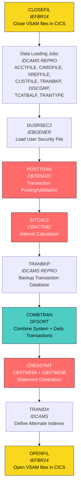
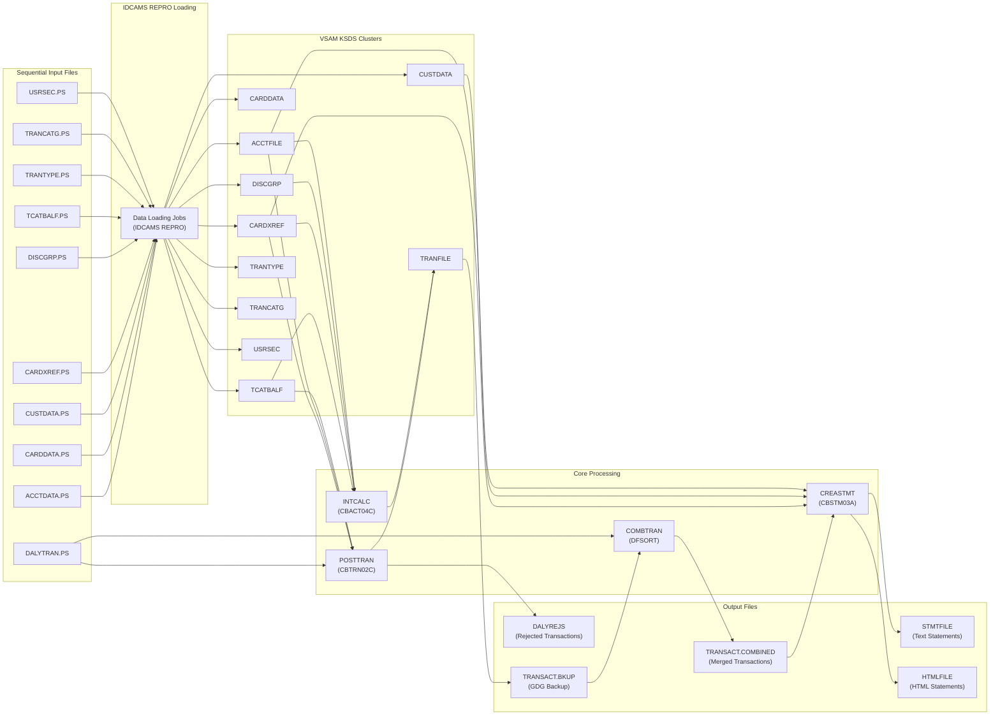
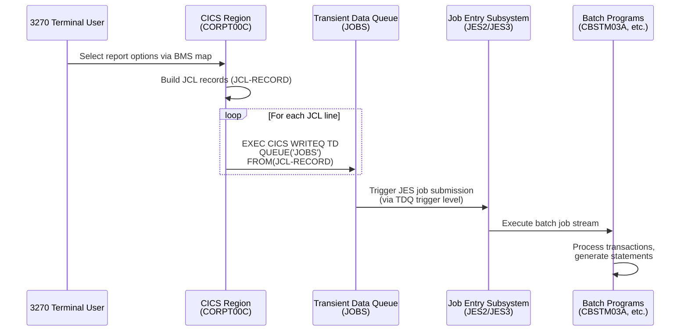
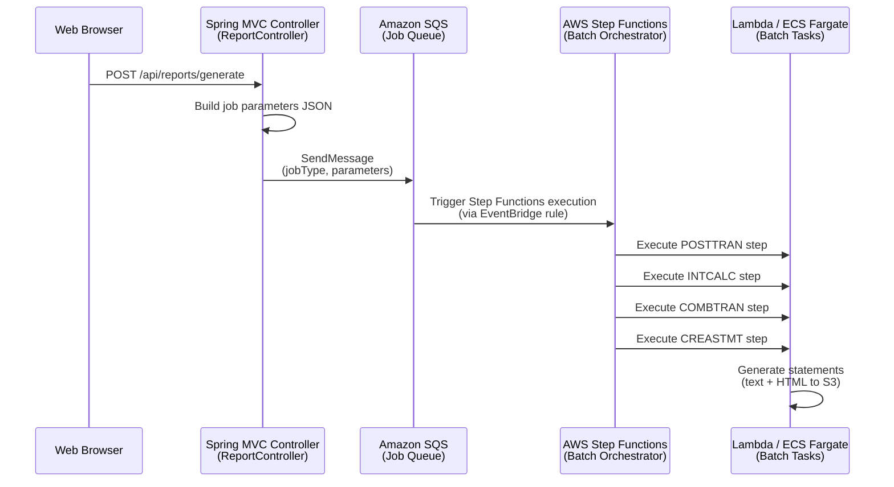

# Appendix C — Batch Job Dependency Map

[Back to Proprietary Utility Inventory](../01-proprietary-utility-inventory.md) | [Back to Risk Assessment](../05-risk-assessment.md) | [Executive Summary](../00-executive-summary.md)

---

## Table of Contents

- [1. Overview](#1-overview)
- [2. Core Batch Processing Chain](#2-core-batch-processing-chain)
- [3. Detailed Job Descriptions](#3-detailed-job-descriptions)
  - [3.1 Data Initialization Jobs](#31-data-initialization-jobs)
  - [3.2 File Availability Control](#32-file-availability-control)
  - [3.3 Core Processing Pipeline](#33-core-processing-pipeline)
- [4. Data Flow Diagram](#4-data-flow-diagram)
- [5. Online-to-Batch Coupling](#5-online-to-batch-coupling)
- [6. JCL-to-AWS Step Functions Migration Mapping](#6-jcl-to-aws-step-functions-migration-mapping)
- [7. Program-to-File Access Matrix](#7-program-to-file-access-matrix)
- [8. CEE3ABD Usage in Batch Programs](#8-cee3abd-usage-in-batch-programs)
- [9. Batch Program Summary Table](#9-batch-program-summary-table)
- [Navigation](#navigation)

---

## 1. Overview

The CardDemo application uses a structured batch processing pipeline for credit card transaction processing, interest calculation, statement generation, and data management. This appendix maps every batch job defined in the application, its utility dependencies, the data files it accesses, and the migration path to AWS services.

### Scope

The batch subsystem consists of:

- **9 batch COBOL programs** (`CBACT01C`, `CBACT02C`, `CBACT03C`, `CBACT04C`, `CBCUS01C`, `CBSTM03A`, `CBTRN01C`, `CBTRN02C`, `CBTRN03C`) plus 1 I/O subroutine (`CBSTM03B`)
- **4 JCL utility programs** (IDCAMS, DFSORT, IEBGENER, IEFBR14) referenced across 18 batch job definitions
- **13 VSAM KSDS clusters** accessed during batch processing
- **2 GDG base entries** (DALYREJS, SYSTRAN) for versioned output management
- **1 online-to-batch coupling point** via CICS Transient Data Queue in `CORPT00C`

All batch job names and descriptions are sourced from the authoritative batch catalog in [README.md](../../../README.md) (lines 84–98 for initial setup, lines 165–183 for full batch run). Proprietary utility classifications reference the [Proprietary Utility Inventory](../01-proprietary-utility-inventory.md) and the [Source Code Cross-Reference](./E-source-code-cross-reference.md).

---

## 2. Core Batch Processing Chain

The following diagram illustrates the end-to-end batch processing sequence as documented in `README.md` (lines 165–183). Jobs must execute in the order shown, as each step depends on the output of the preceding step.



**Legend:**
- 🟡 **Yellow** — IEFBR14 no-op jobs (file availability control)
- 🔴 **Red** — Custom COBOL batch programs (business logic)
- 🟢 **Teal** — JCL utility programs (DFSORT, IDCAMS)

> **Source:** [README.md — Running full batch](../../../README.md) (lines 161–183)

---

## 3. Detailed Job Descriptions

### 3.1 Data Initialization Jobs

These jobs load reference data from physical sequential (PS) files into VSAM KSDS clusters. They are executed once during environment setup or at the start of each batch cycle.

#### 3.1.1 DUSRSECJ — Load User Security File

| Property | Value |
|----------|-------|
| **Job Name** | DUSRSECJ |
| **Program/Utility** | IEBGENER |
| **Function** | Sets up user security VSAM file from sequential input |
| **Input** | `AWS.M2.CARDDEMO.USRSEC.PS` (FB 80, copybook `CSUSR01Y`) |
| **Output** | USRSEC VSAM KSDS cluster |
| **Proprietary APIs** | IEBGENER (IBM z/OS DFSMSdfp sequential copy utility) |
| **Dependencies** | VSAM USRSEC cluster must be pre-defined via IDCAMS |

> **Source:** [README.md](../../../README.md) line 86: "DUSRSECJ — Sets up user security vsam file"

#### 3.1.2 DEFGDGB — Define GDG Bases

| Property | Value |
|----------|-------|
| **Job Name** | DEFGDGB |
| **Program/Utility** | IDCAMS |
| **Function** | Defines Generation Data Group (GDG) base entries for versioned output datasets |
| **IDCAMS Commands** | DEFINE GDG |
| **GDG Bases Created** | DALYREJS, SYSTRAN, TCATBALF.BKUP, TRANREPT, TRANSACT.BKUP, TRANSACT.COMBINED, TRANSACT.DALY |
| **Proprietary APIs** | IDCAMS DEFINE GDG (IBM z/OS DFSMS Access Method Services) |
| **Dependencies** | Must execute before any batch job that writes to GDG datasets |

> **Source:** [README.md](../../../README.md) line 98: "DEFGDGB — Defines GDG Base"

#### 3.1.3 IDCAMS REPRO Data Loading Jobs

The following jobs all use **IDCAMS REPRO** to copy records from physical sequential (PS) input files into VSAM KSDS clusters. Each job follows the same pattern: `DELETE` existing cluster data, then `REPRO` from the PS file.

| Job Name | Function | Input PS File | Target VSAM Cluster | Copybook (Record Layout) |
|----------|----------|---------------|---------------------|--------------------------|
| **ACCTFILE** | Refresh Account Master | `ACCTDATA.PS` (FB 300) | ACCTFILE KSDS | `CVACT01Y` |
| **CARDFILE** | Refresh Card Master | `CARDDATA.PS` (FB 150) | CARDDATA KSDS | `CVACT02Y` |
| **CUSTFILE** | Create Customer Database | `CUSTDATA.PS` (FB 500) | CUSTDATA KSDS | `CVCUS01Y` |
| **XREFFILE** | Load Card-Account Cross Reference | `CARDXREF.PS` (FB 50) | CARDXREF KSDS | `CVACT03Y` |
| **TRANFILE** | Load Transaction Master | `TRANSACT.VSAM.KSDS` init record (FB 350) | TRANFILE KSDS | `CVTRA05Y` |
| **DISCGRP** | Load Disclosure Groups | `DISCGRP.PS` (FB 50) | DISCGRP KSDS | `CVTRA02Y` |
| **TCATBALF** | Refresh Transaction Category Balance | `TCATBALF.PS` (FB 50) | TCATBALF KSDS | `CVTRA01Y` |
| **TRANCATG** | Load Transaction Categories | `TRANCATG.PS` (FB 60) | TRANCATG KSDS | `CVTRA04Y` |
| **TRANTYPE** | Load Transaction Types | `TRANTYPE.PS` (FB 60) | TRANTYPE KSDS | `CVTRA03Y` |

> **Proprietary API for all:** IDCAMS REPRO — IBM z/OS DFSMS Access Method Services  
> **Source:** [README.md](../../../README.md) lines 88–96 (setup) and lines 239–249 (batch catalog)

---

### 3.2 File Availability Control

These jobs use IEFBR14 as a no-op placeholder. The actual file open/close operations are accomplished through JCL DD statement allocation and deallocation, which signal the CICS region to release or acquire VSAM file control.

#### 3.2.1 CLOSEFIL — Close VSAM Files in CICS

| Property | Value |
|----------|-------|
| **Job Name** | CLOSEFIL |
| **Program/Utility** | IEFBR14 |
| **Function** | Closes VSAM files held by the CICS region to allow batch processing |
| **Mechanism** | JCL DD DISP=(OLD,KEEP) acquires exclusive control of VSAM clusters, forcing CICS to release them |
| **Files Affected** | All 13 VSAM KSDS clusters used by both online and batch programs |
| **Proprietary APIs** | IEFBR14 (IBM z/OS MVS no-operation utility) |
| **Dependencies** | Must execute before any data loading or processing job |

> **Source:** [README.md](../../../README.md) line 87/167: "CLOSEFIL — Closes files opened by CICS"

#### 3.2.2 OPENFIL — Open VSAM Files in CICS

| Property | Value |
|----------|-------|
| **Job Name** | OPENFIL |
| **Program/Utility** | IEFBR14 |
| **Function** | Releases exclusive file control, making VSAM files available to the CICS region |
| **Mechanism** | JCL DD DISP=(SHR,KEEP) releases exclusive locks, allowing CICS to reacquire file control |
| **Files Affected** | All 13 VSAM KSDS clusters used by online CICS programs |
| **Proprietary APIs** | IEFBR14 (IBM z/OS MVS no-operation utility) |
| **Dependencies** | Must execute as the final step after all batch processing completes |

> **Source:** [README.md](../../../README.md) line 97/183: "OPENFIL — Makes files available to CICS"

---

### 3.3 Core Processing Pipeline

These jobs form the heart of the CardDemo batch processing cycle. They must execute in strict sequence: **POSTTRAN → INTCALC → TRANBKP → COMBTRAN → CREASTMT → TRANIDX**.

#### 3.3.1 POSTTRAN — Transaction Posting and Validation

| Property | Value |
|----------|-------|
| **Job Name** | POSTTRAN |
| **Program** | `CBTRN02C` |
| **Function** | Posts records from the daily transaction file; validates cross-references, enforces credit limits, creates TRANSACT records, updates account balances, writes rejected transactions |
| **Input Files** | DALYTRAN (sequential, daily transaction input) |
| **Output Files** | TRANFILE (VSAM KSDS, posted transactions), DALYREJS (sequential, rejected transactions) |
| **I-O Files** | ACCTFILE (VSAM KSDS, account balances updated), TCATBALF (VSAM KSDS, category balances updated) |
| **Lookup Files** | XREFFILE (VSAM KSDS, card-to-account cross-reference) |
| **Proprietary APIs** | `CALL 'CEE3ABD'` (IBM z/OS LE — terminate enclave with abend, line 711), COBOL native file I/O with FILE STATUS handling |
| **Copybooks** | `CVTRA06Y` (daily transaction record), `CVTRA05Y` (transaction record), `CVACT03Y` (cross-reference), `CVACT01Y` (account record), `CVTRA01Y` (transaction category balance) |
| **Error Handling** | On any file I/O error: display diagnostic, call `9910-DISPLAY-IO-STATUS`, then `9999-ABEND-PROGRAM` which calls `CEE3ABD` with abend code 999 |

> **Source:** [app/cbl/CBTRN02C.cbl](../../../app/cbl/CBTRN02C.cbl) — Lines 1–730  
> **CEE3ABD call:** [app/cbl/CBTRN02C.cbl:711](../../../app/cbl/CBTRN02C.cbl)

**Key Processing Logic:**

```cobol
*  Main processing loop (CBTRN02C.cbl lines 202-219)
       PERFORM UNTIL END-OF-FILE = 'Y'
           IF  END-OF-FILE = 'N'
               PERFORM 1000-DALYTRAN-GET-NEXT
               IF  END-OF-FILE = 'N'
                 ADD 1 TO WS-TRANSACTION-COUNT
                 MOVE 0 TO WS-VALIDATION-FAIL-REASON
                 MOVE SPACES TO WS-VALIDATION-FAIL-REASON-DESC
                 PERFORM 1500-VALIDATE-TRAN
                 IF WS-VALIDATION-FAIL-REASON = 0
                   PERFORM 2000-POST-TRANSACTION
                 ELSE
                   ADD 1 TO WS-REJECT-COUNT
                   PERFORM 2500-WRITE-REJECT-REC
                 END-IF
               END-IF
           END-IF
       END-PERFORM.
```

#### 3.3.2 INTCALC — Interest Calculation

| Property | Value |
|----------|-------|
| **Job Name** | INTCALC |
| **Program** | `CBACT04C` |
| **Function** | Calculates monthly interest for each transaction category balance; generates system interest transactions; updates account records with computed interest |
| **Input Files** | TCATBALF (VSAM KSDS, sequential read of all category balances), XREFFILE (VSAM KSDS, card-to-account cross-reference), DISCGRP (VSAM KSDS, disclosure groups with interest rates) |
| **Output Files** | TRANSACT (sequential, generated interest transactions) |
| **I-O Files** | ACCTFILE (VSAM KSDS, accounts updated with interest totals) |
| **Proprietary APIs** | `CALL 'CEE3ABD'` (IBM z/OS LE — terminate enclave with abend, line 632), COBOL `COMPUTE` verb for interest arithmetic |
| **Copybooks** | `CVTRA01Y` (transaction category balance), `CVACT03Y` (cross-reference), `CVTRA02Y` (disclosure group), `CVACT01Y` (account record), `CVTRA05Y` (transaction record) |
| **Parameters** | Accepts `PARM-DATE` (10-character date) via `PROCEDURE DIVISION USING EXTERNAL-PARMS` for transaction ID generation |
| **Error Handling** | On any file I/O error: display diagnostic, call `9910-DISPLAY-IO-STATUS`, then `9999-ABEND-PROGRAM` which calls `CEE3ABD` with abend code 999 |

> **Source:** [app/cbl/CBACT04C.cbl](../../../app/cbl/CBACT04C.cbl) — Lines 1–653  
> **CEE3ABD call:** [app/cbl/CBACT04C.cbl:632](../../../app/cbl/CBACT04C.cbl)

**Interest Calculation Formula:**

```cobol
*  Interest computation (CBACT04C.cbl lines 462-470)
       1300-COMPUTE-INTEREST.
           COMPUTE WS-MONTHLY-INT
            = ( TRAN-CAT-BAL * DIS-INT-RATE) / 1200
           ADD WS-MONTHLY-INT  TO WS-TOTAL-INT
           PERFORM 1300-B-WRITE-TX.
           EXIT.
```

> The formula divides by 1200 (12 months × 100 for percentage) to convert an annual percentage rate to a monthly interest amount.

#### 3.3.3 TRANBKP — Backup Transaction Database

| Property | Value |
|----------|-------|
| **Job Name** | TRANBKP |
| **Program/Utility** | IDCAMS (REPRO) |
| **Function** | Creates a backup copy of the transaction VSAM KSDS cluster before merging operations |
| **Input** | TRANFILE VSAM KSDS (current transaction database) |
| **Output** | TRANSACT.BKUP GDG (+1) (new generation backup) |
| **Proprietary APIs** | IDCAMS REPRO (IBM z/OS DFSMS Access Method Services) |
| **Dependencies** | Must execute after INTCALC completes interest posting; must execute before COMBTRAN |

> **Source:** [README.md](../../../README.md) line 172/179: "TRANBKP — Creates/Backup Transaction database"

#### 3.3.4 COMBTRAN — Combine Transaction Files

| Property | Value |
|----------|-------|
| **Job Name** | COMBTRAN |
| **Program/Utility** | DFSORT (SORT) |
| **Function** | Merges system-generated transactions (interest, fees) with daily input transactions into a consolidated transaction file, sorted by transaction key |
| **Input** | TRANSACT.DALY (daily transactions), TRANSACT.BKUP (backed-up system transactions) |
| **Output** | TRANSACT.COMBINED (merged and sorted transaction dataset) |
| **Sort Key** | Transaction ID (16-byte key: card number + transaction sequence) |
| **Proprietary APIs** | DFSORT / SORT (IBM z/OS DFSORT — Data Facility Sort, publication SC23-6878) |
| **Dependencies** | Requires TRANBKP to have completed successfully; output feeds CREASTMT |

> **Source:** [README.md](../../../README.md) line 180/254: "COMBTRAN — Combine system transactions with daily ones" / "SORT — Combine transaction files"

#### 3.3.5 CREASTMT — Statement Generation

| Property | Value |
|----------|-------|
| **Job Name** | CREASTMT |
| **Program** | `CBSTM03A` (driver) + `CBSTM03B` (I/O subroutine) |
| **Function** | Generates account statements in both plain text and HTML formats from the combined transaction dataset |
| **Architecture** | `CBSTM03A` is the main driver; calls `CBSTM03B` via `CALL 'CBSTM03B' USING WS-M03B-AREA` for all VSAM file I/O operations (open, close, read, read-by-key, write, rewrite) |
| **Files via CBSTM03B** | TRNXFILE (VSAM KSDS, combined transactions — sequential read), XREFFILE (VSAM KSDS, cross-reference — sequential read), CUSTFILE (VSAM KSDS, customer data — random read), ACCTFILE (VSAM KSDS, account data — random read) |
| **Files via CBSTM03A** | STMTFILE (sequential output, plain text statements), HTMLFILE (sequential output, HTML statements) |
| **Proprietary APIs** | `CALL 'CEE3ABD'` (IBM z/OS LE — terminate enclave with abend, line 923 in CBSTM03A), `CALL 'CBSTM03B'` (application-level I/O subroutine, 15+ call sites in CBSTM03A) |
| **Copybooks** | `COSTM01` (statement layout), `CVACT03Y` (cross-reference), `CUSTREC` (customer record), `CVACT01Y` (account record) |
| **Features Exercised** | COMP and COMP-3 variables, 2-dimensional arrays, mainframe control block addressing, ALTER and GO TO statements (per program header comments) |
| **Error Handling** | On any CBSTM03B return code error: display diagnostic, then call `9999-ABEND-PROGRAM` which calls `CEE3ABD` |

> **Source:** [app/cbl/CBSTM03A.CBL](../../../app/cbl/CBSTM03A.CBL) — Lines 1–925  
> **Source:** [app/cbl/CBSTM03B.CBL](../../../app/cbl/CBSTM03B.CBL) — Lines 1–200+  
> **CEE3ABD call:** [app/cbl/CBSTM03A.CBL:923](../../../app/cbl/CBSTM03A.CBL)

#### 3.3.6 TRANIDX — Define Alternate Indexes

| Property | Value |
|----------|-------|
| **Job Name** | TRANIDX |
| **Program/Utility** | IDCAMS |
| **Function** | Defines alternate indexes (AIX) on the transaction VSAM file to enable multi-key access patterns |
| **IDCAMS Commands** | DEFINE ALTERNATEINDEX, DEFINE PATH, BLDINDEX |
| **AIX Definitions** | TRANSACT-AIX1 (alternate key 1), TRANSACT-AIX2 (alternate key 2) — as documented in [Appendix B](./B-vsam-dataset-catalog.md) |
| **Proprietary APIs** | IDCAMS (IBM z/OS DFSMS Access Method Services) |
| **Dependencies** | Must execute after CREASTMT; AIX paths are used by subsequent online CICS programs |

> **Source:** [README.md](../../../README.md) line 182/251: "TRANIDX — Define AIX for transaction file"

---

## 4. Data Flow Diagram

The following diagram shows how data flows between batch jobs through VSAM files and sequential datasets. Arrows indicate the direction of data flow (read → write).



> **Key Insight:** The ACCTFILE and XREFFILE VSAM clusters are the most heavily shared resources, accessed by POSTTRAN, INTCALC, and CREASTMT. In the migrated architecture, these correspond to the Account and Cross-Reference database tables, which will require careful transaction isolation and connection pool management in the Java/Spring Data JPA implementation.

---

## 5. Online-to-Batch Coupling

The CardDemo application implements an **online-to-batch coupling pattern** through the CICS Transient Data Queue (TDQ). The online report program `CORPT00C` writes JCL records to a TDQ named `JOBS`, which is then processed by the Job Entry Subsystem (JES) to submit batch jobs.

### 5.1 Current Mainframe Pattern



> **Source:** [app/cbl/CORPT00C.cbl:517–524](../../../app/cbl/CORPT00C.cbl) — `EXEC CICS WRITEQ TD QUEUE ('JOBS') FROM (JCL-RECORD) LENGTH (LENGTH OF JCL-RECORD)`

### 5.2 Migrated AWS Pattern



### 5.3 Migration Considerations

| Mainframe Component | AWS Equivalent | Migration Notes |
|---------------------|----------------|-----------------|
| `EXEC CICS WRITEQ TD QUEUE('JOBS')` | `AmazonSQS.sendMessage()` | Replace TDQ with SQS FIFO queue for ordered job submission |
| JES Job Submission | AWS Step Functions | Step Functions provides visual workflow, retry logic, and error handling |
| JCL Job Stream | Step Functions State Machine | Each JCL EXEC step maps to a Step Functions Task state |
| TDQ Trigger Level | EventBridge Rule + SQS | EventBridge monitors SQS and triggers Step Functions on message arrival |
| JCL-RECORD format | JSON message payload | Replace fixed-format JCL records with structured JSON job parameters |

> **Risk Level:** HIGH — The online-to-batch coupling is a critical integration point. Incorrect migration can break the report generation workflow. See [Risk Assessment](../05-risk-assessment.md) for detailed analysis.

---

## 6. JCL-to-AWS Step Functions Migration Mapping

The following table maps each JCL batch job to its recommended AWS equivalent, including the specific AWS service and implementation approach. For detailed migration recommendations per utility, see [Migration Strategy Per Utility](../04-migration-strategy-per-utility.md).

| JCL Job | JCL Utility/Program | Function | AWS Equivalent | AWS Service | Implementation Notes |
|---------|---------------------|----------|----------------|-------------|---------------------|
| **CLOSEFIL** | IEFBR14 | Close VSAM files in CICS | No-op or RDS connection pool drain | N/A | In AWS, database connections are managed by the connection pool (HikariCP). No explicit file close needed. Optionally, drain connections before batch window. |
| **DUSRSECJ** | IEBGENER | Load user security file | `java.nio.file.Files.copy()` or S3-to-RDS data pipeline | AWS Lambda + RDS | Use Spring Batch `FlatFileItemReader` to parse FB 80 records and `JdbcBatchItemWriter` to load into USRSEC table. |
| **DEFGDGB** | IDCAMS (DEFINE GDG) | Define GDG bases | S3 versioned buckets or RDS schema migrations | CloudFormation / Flyway | GDG versioning maps to S3 versioning or database migration version numbering via Flyway. Define as infrastructure-as-code. |
| **ACCTFILE** | IDCAMS (REPRO) | Refresh Account Master | Spring Batch `ItemReader`/`ItemWriter` | Step Functions + Lambda | Read from S3 (converted PS file), write to RDS ACCOUNT table. Use `JdbcBatchItemWriter` with upsert semantics. |
| **CARDFILE** | IDCAMS (REPRO) | Refresh Card Master | Spring Batch `ItemReader`/`ItemWriter` | Step Functions + Lambda | Read from S3, write to RDS CARD_DATA table. |
| **CUSTFILE** | IDCAMS (REPRO) | Create Customer Database | Spring Batch `ItemReader`/`ItemWriter` | Step Functions + Lambda | Read from S3, write to RDS CUSTOMER table. |
| **XREFFILE** | IDCAMS (REPRO) | Load Cross-Reference | Spring Batch `ItemReader`/`ItemWriter` | Step Functions + Lambda | Read from S3, write to RDS CARD_XREF table. |
| **TRANFILE** | IDCAMS (REPRO) | Load Transaction Master | Spring Batch `ItemReader`/`ItemWriter` | Step Functions + Lambda | Read from S3, write to RDS TRANSACTION table. |
| **DISCGRP** | IDCAMS (REPRO) | Load Disclosure Groups | Spring Batch `ItemReader`/`ItemWriter` | Step Functions + Lambda | Read from S3, write to RDS DISCLOSURE_GROUP table. |
| **TCATBALF** | IDCAMS (REPRO) | Refresh Category Balance | Spring Batch `ItemReader`/`ItemWriter` | Step Functions + Lambda | Read from S3, write to RDS TRAN_CAT_BAL table. |
| **TRANCATG** | IDCAMS (REPRO) | Load Transaction Categories | Spring Batch `ItemReader`/`ItemWriter` | Step Functions + Lambda | Read from S3, write to RDS TRAN_CATEGORY table. |
| **TRANTYPE** | IDCAMS (REPRO) | Load Transaction Types | Spring Batch `ItemReader`/`ItemWriter` | Step Functions + Lambda | Read from S3, write to RDS TRAN_TYPE table. |
| **POSTTRAN** | CBTRN02C | Transaction posting/validation | Java service (Spring Batch step) | Step Functions + ECS Fargate | Implement `TransactionPostingService` with validation logic, reject file writer, and JDBC-based account/balance updates. |
| **INTCALC** | CBACT04C | Interest calculation | Java service (Spring Batch step) | Step Functions + ECS Fargate | Implement `InterestCalculationService` with `BigDecimal` arithmetic: `(catBal * intRate) / 1200`. Use `@Transactional` for atomicity. |
| **TRANBKP** | IDCAMS (REPRO) | Backup Transaction DB | RDS automated snapshot or S3 export | RDS / S3 | Use RDS automated backups or `pg_dump`/`mysqldump` to S3 before merge step. |
| **COMBTRAN** | DFSORT (SORT) | Merge transaction files | `java.util.Comparator` sort in Lambda/Fargate | Step Functions + Lambda | Read both transaction sources, sort using `Comparator<Transaction>` on transaction ID, write merged output. Consider Apache Commons IO for large file streaming. |
| **CREASTMT** | CBSTM03A + CBSTM03B | Statement generation | Java service (Spring Batch step) | Step Functions + ECS Fargate | Implement `StatementGenerationService` with `StatementFileIOHelper` (replacing CBSTM03B). Generate text via `PrintWriter` and HTML via Thymeleaf templates. |
| **TRANIDX** | IDCAMS (DEFINE AIX) | Define alternate indexes | RDS secondary indexes | Flyway DDL migration | Create database indexes via Flyway migration scripts: `CREATE INDEX idx_trans_aix1 ON TRANSACTION(...)`. |
| **OPENFIL** | IEFBR14 | Open VSAM files in CICS | No-op or health check | N/A | In AWS, connections are established on demand by the connection pool. Optionally, implement a health check endpoint to verify RDS connectivity. |

> **Source:** Migration approach recommendations from [Migration Strategy Per Utility](../04-migration-strategy-per-utility.md)

---

## 7. Program-to-File Access Matrix

The following matrix shows which VSAM files each batch program opens, along with the access mode (I=Input, O=Output, IO=Input-Output, Seq=Sequential, Rnd=Random).

| Program | ACCTFILE | CARDDATA | CUSTDATA | XREFFILE | TRANFILE | TCATBALF | DISCGRP | DALYTRAN | DALYREJS | TRANCATG | TRANTYPE | STMTFILE | HTMLFILE |
|---------|----------|----------|----------|----------|----------|----------|---------|----------|----------|----------|----------|----------|----------|
| **CBACT01C** | I/Seq | — | — | — | — | — | — | — | — | — | — | — | — |
| **CBACT02C** | — | I/Seq | — | — | — | — | — | — | — | — | — | — | — |
| **CBACT03C** | — | — | — | I/Seq | — | — | — | — | — | — | — | — | — |
| **CBACT04C** | IO/Rnd | — | — | I/Rnd | O/Seq | I/Seq | I/Rnd | — | — | — | — | — | — |
| **CBCUS01C** | — | — | I/Seq | — | — | — | — | — | — | — | — | — | — |
| **CBSTM03A** | — | — | — | — | — | — | — | — | — | — | — | O/Seq | O/Seq |
| **CBSTM03B** | I/Rnd | — | I/Rnd | I/Seq | I/Seq | — | — | — | — | — | — | — | — |
| **CBTRN01C** | I/Rnd | — | I/Rnd | I/Rnd | IO/Rnd | — | — | I/Seq | — | — | — | — | — |
| **CBTRN02C** | IO/Rnd | — | — | I/Rnd | O/Rnd | IO/Rnd | — | I/Seq | O/Seq | — | — | — | — |
| **CBTRN03C** | — | — | — | I/Seq | I/Seq | — | — | — | — | I/Rnd | I/Rnd | — | — |

**Column Legend:**
- **I** = Input (read-only), **O** = Output (write-only), **IO** = Input-Output (read-write)
- **Seq** = Sequential access mode, **Rnd** = Random (keyed) access mode
- **—** = File not accessed by this program

**Key Observations:**
1. **ACCTFILE** is the most shared resource — accessed by 5 of 10 batch programs (CBACT01C, CBACT04C, CBSTM03B, CBTRN01C, CBTRN02C)
2. **XREFFILE** is accessed by 5 programs (CBACT03C, CBACT04C, CBSTM03B, CBTRN01C, CBTRN02C)
3. **CBSTM03B** acts as a centralized I/O layer for CBSTM03A, accessing 4 VSAM files on its behalf
4. Only **CBTRN02C** and **CBTRN01C** write to TRANFILE; all others read from it
5. **CBTRN03C** is unique in requiring TRANCATG and TRANTYPE reference files plus the CARDXREF alternate path

> **Source:** File-control sections extracted from each program's ENVIRONMENT DIVISION. See [Appendix E — Source Code Cross-Reference](./E-source-code-cross-reference.md) for line-number citations.

---

## 8. CEE3ABD Usage in Batch Programs

All 9 batch COBOL programs use `CALL 'CEE3ABD'` for controlled program termination (abend) when unrecoverable errors occur. The CEE3ABD routine is an IBM z/OS Language Environment callable service that terminates the current enclave with a user-specified abend code.

### 8.1 CEE3ABD Call Inventory

| Program | Line Number | Abend Code | Timing | Context |
|---------|-------------|------------|--------|---------|
| **CBACT01C** | [173](../../../app/cbl/CBACT01C.cbl) | 999 | 0 | File I/O error on ACCTFILE |
| **CBACT02C** | [158](../../../app/cbl/CBACT02C.cbl) | 999 | 0 | File I/O error on CARDFILE |
| **CBACT03C** | [158](../../../app/cbl/CBACT03C.cbl) | 999 | 0 | File I/O error on XREFFILE |
| **CBACT04C** | [632](../../../app/cbl/CBACT04C.cbl) | 999 | 0 | File I/O error on TCATBALF, XREFFILE, DISCGRP, ACCTFILE, or TRANFILE |
| **CBCUS01C** | [158](../../../app/cbl/CBCUS01C.cbl) | 999 | 0 | File I/O error on CUSTFILE |
| **CBSTM03A** | [923](../../../app/cbl/CBSTM03A.CBL) | N/A | N/A | I/O error in CBSTM03B subroutine (TRNXFILE, XREFFILE, CUSTFILE, ACCTFILE) or statement output |
| **CBTRN01C** | [473](../../../app/cbl/CBTRN01C.cbl) | 999 | 0 | File I/O error on DALYTRAN, CUSTFILE, XREFFILE, CARDFILE, ACCTFILE, or TRANFILE |
| **CBTRN02C** | [711](../../../app/cbl/CBTRN02C.cbl) | 999 | 0 | File I/O error on DALYTRAN, TRANFILE, XREFFILE, DALYREJS, ACCTFILE, or TCATBALF |
| **CBTRN03C** | [630](../../../app/cbl/CBTRN03C.cbl) | 999 | 0 | File I/O error on TRANFILE, CARDXREF, TRANTYPE, TRANCATG, or TRANREPT |

### 8.2 Common Abend Pattern

All batch programs follow an identical abend pattern:

```cobol
*  Standard abend handler (example from CBTRN02C.cbl lines 707-711)
       9999-ABEND-PROGRAM.
           DISPLAY 'ABENDING PROGRAM'
           MOVE 0 TO TIMING
           MOVE 999 TO ABCODE
           CALL 'CEE3ABD'.
```

### 8.3 Java Migration Equivalent

The CEE3ABD abend pattern maps to a custom exception hierarchy in Java:

```java
// Java equivalent of CEE3ABD abend pattern
public class BatchAbendException extends RuntimeException {
    private final int abendCode;

    public BatchAbendException(int abendCode, String message) {
        super(message);
        this.abendCode = abendCode;
    }

    public int getAbendCode() { return abendCode; }
}

// Usage in migrated batch program (replacing CALL 'CEE3ABD')
throw new BatchAbendException(999, "ABENDING PROGRAM - File I/O error");
```

> **Source:** CEE3ABD behavioral specification from [External Documentation Research](../02-external-documentation-research.md). Migration recommendation from [Migration Strategy Per Utility](../04-migration-strategy-per-utility.md).

---

## 9. Batch Program Summary Table

| Program | Job(s) | Function | Files Accessed | CEE3ABD Line | Other CALLs |
|---------|--------|----------|----------------|--------------|-------------|
| **CBACT01C** | Data validation | Read and print account data file | ACCTFILE | 173 | — |
| **CBACT02C** | Data validation | Read and print card data file | CARDDATA | 158 | — |
| **CBACT03C** | Data validation | Read and print cross-reference data file | XREFFILE | 158 | — |
| **CBACT04C** | INTCALC | Interest calculator — computes monthly interest per category balance | TCATBALF, XREFFILE, DISCGRP, ACCTFILE, TRANSACT | 632 | — |
| **CBCUS01C** | Data validation | Read and print customer data file | CUSTFILE | 158 | — |
| **CBSTM03A** | CREASTMT | Print account statements (text + HTML) from transaction data | STMTFILE, HTMLFILE (+ via CBSTM03B: TRNXFILE, XREFFILE, CUSTFILE, ACCTFILE) | 923 | `CALL 'CBSTM03B'` (15+ sites) |
| **CBSTM03B** | CREASTMT (sub) | Centralized file I/O subroutine for statement generation | TRNXFILE, XREFFILE, CUSTFILE, ACCTFILE | — | — |
| **CBTRN01C** | Transaction preprocessing | Post records from daily transaction file (variant 1) | DALYTRAN, CUSTFILE, XREFFILE, CARDFILE, ACCTFILE, TRANFILE | 473 | — |
| **CBTRN02C** | POSTTRAN | Transaction posting/validation with reject handling | DALYTRAN, TRANFILE, XREFFILE, DALYREJS, ACCTFILE, TCATBALF | 711 | — |
| **CBTRN03C** | Report generation | Print transaction detail report | TRANFILE, CARDXREF, TRANTYPE, TRANCATG, TRANREPT, DATEPARM | 630 | — |

> **Source:** Program headers and FILE-CONTROL sections from each source file. See [Appendix E](./E-source-code-cross-reference.md) for complete cross-reference with line numbers.

---

## Navigation

| Link | Description |
|------|-------------|
| [← Back to Proprietary Utility Inventory](../01-proprietary-utility-inventory.md) | Complete catalog of all IBM proprietary utilities |
| [← Back to Migration Strategy](../04-migration-strategy-per-utility.md) | Per-utility Java migration recommendations |
| [← Back to Risk Assessment](../05-risk-assessment.md) | Risk matrix with classifications per utility |
| [Executive Summary](../00-executive-summary.md) | Stakeholder-facing overview of migration analysis |
| [Appendix A — CICS Command Reference](./A-cics-command-reference.md) | Full CICS command inventory for online programs |
| [Appendix B — VSAM Dataset Catalog](./B-vsam-dataset-catalog.md) | Complete VSAM topology and RDS mapping |
| [Appendix D — BMS Screen Inventory](./D-bms-screen-inventory.md) | BMS mapset catalog for screen migration |
| [Appendix E — Source Code Cross-Reference](./E-source-code-cross-reference.md) | Master file-to-dependency index |

---

> **Document Classification:** Migration Analysis — Appendix C  
> **Scope:** AWS CardDemo Batch Processing Subsystem  
> **Source Repository:** [aws-samples/aws-mainframe-modernization-carddemo](../../../README.md)  
> **Related Sections:** [01 — Proprietary Utility Inventory](../01-proprietary-utility-inventory.md) | [04 — Migration Strategy](../04-migration-strategy-per-utility.md) | [05 — Risk Assessment](../05-risk-assessment.md) | [06 — Testing Framework](../06-testing-validation-framework.md)
