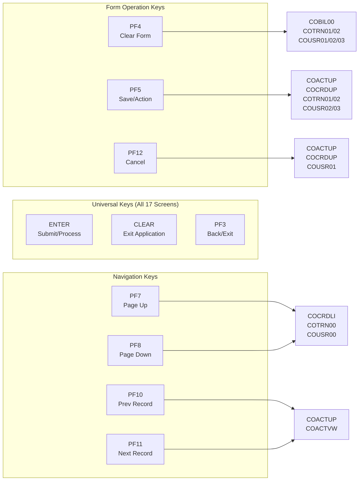
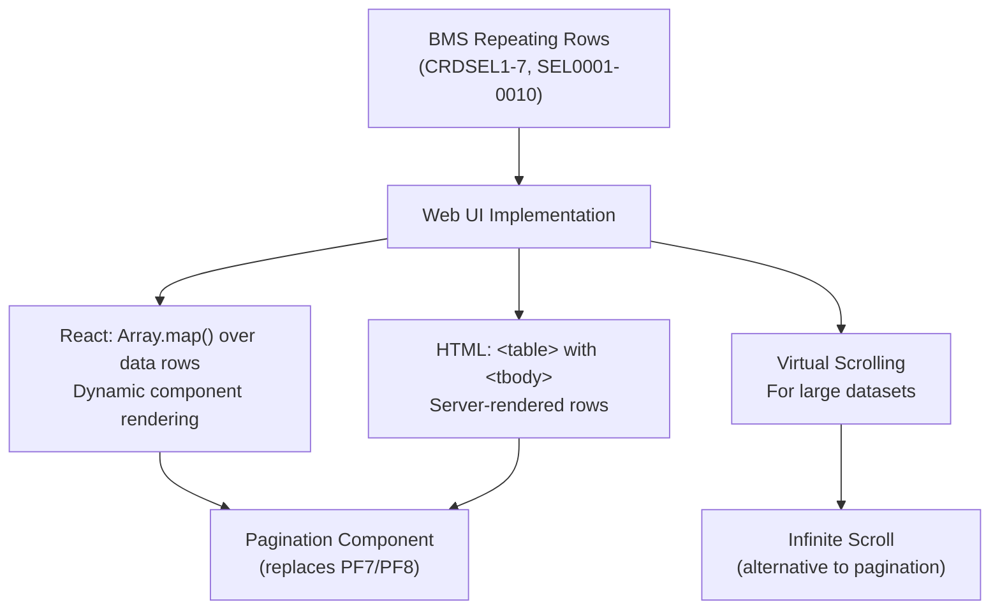
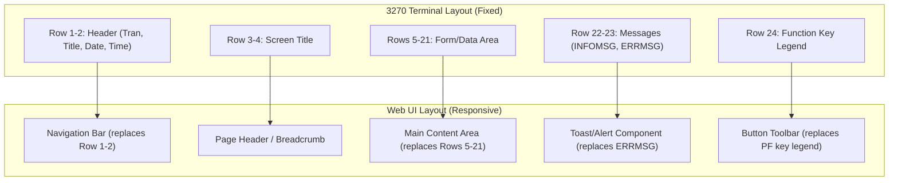

# Appendix D — BMS Screen Inventory

[← Back to Proprietary Utility Inventory](../01-proprietary-utility-inventory.md) | [Back to Migration Strategy](../04-migration-strategy-per-utility.md) | [Executive Summary](../00-executive-summary.md)

---

## Overview

The CardDemo application uses **17 BMS (Basic Mapping Support) mapset definitions** for 3270 terminal screen presentations. All mapsets target a **24×80 coordinate grid** and use **DFHMSD/DFHMDI/DFHMDF** macros compiled by the IBM BMS macro processor. These mapsets define the user interface for the entire online CICS subsystem — covering sign-on, menu navigation, account management, credit card operations, transaction processing, report generation, and user administration.

This appendix catalogs each screen's structure, field definitions, attribute handling, AID key processing, color specifications, and provides web UI migration considerations for translating 3270 terminal screens to modern HTML/CSS/React interfaces.

**Source:** All 17 BMS mapset files in [`app/bms/`](../../../app/bms/) and BMS-generated copybooks in [`app/cpy-bms/`](../../../app/cpy-bms/)

---

## Table of Contents

- [BMS Macro Reference](#bms-macro-reference)
- [Master Mapset Inventory](#master-mapset-inventory)
- [Common Screen Elements](#common-screen-elements)
- [Field Attribute Analysis](#field-attribute-analysis)
- [AID Key Handling](#aid-key-handling)
- [Repeating Row Patterns](#repeating-row-patterns)
- [Web UI Migration Considerations](#web-ui-migration-considerations)
- [BMS-Generated Copybooks](#bms-generated-copybooks)
- [Navigation](#navigation)

---

## BMS Macro Reference

All 17 CardDemo BMS mapsets are constructed using three core IBM BMS macros, supported by two standard CICS copybooks. These macros are processed by the CICS BMS macro assembler to generate both physical maps (load modules) and symbolic maps (COBOL copybooks).

### DFHMSD — Mapset Definition

The **DFHMSD** macro defines the outermost mapset container. Each `.bms` file contains exactly one DFHMSD declaration at the top and one `DFHMSD TYPE=FINAL` terminator at the bottom.

**Common parameters across all 17 CardDemo mapsets:**

| Parameter | Value | Purpose |
|-----------|-------|---------|
| `LANG` | `COBOL` | Target language for generated symbolic map copybooks |
| `MODE` | `INOUT` | Mapset supports both SEND MAP and RECEIVE MAP operations |
| `STORAGE` | `AUTO` | BMS allocates storage for map data areas automatically |
| `TIOAPFX` | `YES` | Includes the Terminal I/O Area Prefix in generated structures |
| `TYPE` | `&&SYSPARM` | Assembly-time parameter selects physical map (`MAP`) or symbolic map (`DSECT`) generation |

**Extended attribute support:**
- **15 of 17 mapsets** specify `EXTATT=YES` on the DFHMSD macro, enabling extended attributes (color, highlighting, programmed symbols, validation) — these include COADM01, COBIL00, COMEN01, CORPT00, COSGN00, COTRN00, COTRN01, COTRN02, COUSR00, COUSR01, COUSR02, COUSR03, and others
- **2 mapsets** (COACTUP, COACTVW) omit `EXTATT=YES` at the mapset level but define extended attributes via their DFHMDI `DSATTS`/`MAPATTS` parameters instead

**Control options:**
- **15 mapsets** specify `CTRL=(ALARM,FREEKB)` — enabling the audible alarm and freeing the keyboard after each SEND
- **2 mapsets** (COACTUP, COACTVW) specify `CTRL=(FREEKB)` at the DFHMDI level only

**Example** (from `app/bms/COACTUP.bms`):
```
COACTUP DFHMSD LANG=COBOL,
               MODE=INOUT,
               STORAGE=AUTO,
               TIOAPFX=YES,
               TYPE=&&SYSPARM
```

### DFHMDI — Map Definition

The **DFHMDI** macro defines an individual map within a mapset. Each CardDemo mapset contains exactly **one** map definition.

**Two DFHMDI configuration patterns are used:**

**Pattern A — Explicit attribute specification (COACTUP, COACTVW, COCRDLI, COCRDSL, COCRDUP):**

| Parameter | Value | Purpose |
|-----------|-------|---------|
| `CTRL` | `(FREEKB)` | Free keyboard after SEND |
| `DSATTS` | `(COLOR,HILIGHT,PS,VALIDN)` | Extended attributes sent to COBOL via symbolic map |
| `MAPATTS` | `(COLOR,HILIGHT,PS,VALIDN)` | Extended attributes received from BMS physical map |
| `SIZE` | `(24,80)` | Standard 3270 screen dimensions |

**Pattern B — Position-based specification (remaining 12 mapsets):**

| Parameter | Value | Purpose |
|-----------|-------|---------|
| `COLUMN` | `1` | Map starts at column 1 |
| `LINE` | `1` | Map starts at line 1 |
| `SIZE` | `(24,80)` | Standard 3270 screen dimensions |

**Mapset-to-map name mapping:**

| Mapset Name | Map Name | DFHMDI Pattern |
|-------------|----------|----------------|
| COACTUP | CACTUPA | A (DSATTS/MAPATTS) |
| COACTVW | CACTVWA | A (DSATTS/MAPATTS) |
| COADM01 | COADM1A | B (COLUMN/LINE) |
| COBIL00 | COBIL0A | B (COLUMN/LINE) |
| COCRDLI | CCRDLIA | A (DSATTS/MAPATTS) |
| COCRDSL | CCRDSLA | A (DSATTS/MAPATTS) |
| COCRDUP | CCRDUPA | A (DSATTS/MAPATTS) |
| COMEN01 | COMEN1A | B (COLUMN/LINE) |
| CORPT00 | CORPT0A | B (COLUMN/LINE) |
| COSGN00 | COSGN0A | B (COLUMN/LINE) |
| COTRN00 | COTRN0A | B (COLUMN/LINE) |
| COTRN01 | COTRN1A | B (COLUMN/LINE) |
| COTRN02 | COTRN2A | B (COLUMN/LINE) |
| COUSR00 | COUSR0A | B (COLUMN/LINE) |
| COUSR01 | COUSR1A | B (COLUMN/LINE) |
| COUSR02 | COUSR2A | B (COLUMN/LINE) |
| COUSR03 | COUSR3A | B (COLUMN/LINE) |

### DFHMDF — Field Definition

The **DFHMDF** macro defines individual fields within a map. Fields are positioned using `POS=(row,col)` coordinates on the 24×80 grid. Fields may be **named** (accessible in COBOL via the symbolic map) or **unnamed** (attribute-only delimiters and literals).

**Common parameters:**

| Parameter | Example Values | Purpose |
|-----------|---------------|---------|
| `POS` | `(1,1)`, `(5,38)` | Row and column position on 24×80 screen |
| `LENGTH` | `1` to `79` | Field data length in characters |
| `ATTRB` | `(ASKIP,NORM)`, `(UNPROT)` | Field attributes controlling editability and display |
| `COLOR` | `BLUE`, `YELLOW`, `TURQUOISE`, `GREEN`, `RED`, `NEUTRAL`, `DEFAULT` | Extended color attribute |
| `HILIGHT` | `UNDERLINE`, `OFF` | Highlighting attribute |
| `INITIAL` | `'Account Number :'` | Default field content displayed on SEND |
| `PICIN` | `'99999999999'` | Input picture clause (numeric formatting) |
| `PICOUT` | `'+ZZZ,ZZZ,ZZZ.99'` | Output picture clause (display formatting) |
| `JUSTIFY` | `(RIGHT)` | Field justification for input data |

### DFHBMSCA — Character Attribute Copybook

The **DFHBMSCA** copybook is a standard IBM-supplied CICS copybook that defines symbolic constants for BMS field attributes. While not referenced directly in the `.bms` source files, it is included by all 17 online COBOL programs via `COPY DFHBMSCA` to manipulate field attributes programmatically at runtime.

**Key constants provided:**

| Constant | Hex Value | Purpose |
|----------|-----------|---------|
| `DFHBMASK` | `X'20'` | Auto-skip (ASKIP) |
| `DFHBMPRF` | `X'20'` | Protected (PROT) |
| `DFHBMUNP` | `X'00'` | Unprotected (UNPROT) |
| `DFHBMFSE` | `X'01'` | Modified data tag (FSET) |
| `DFHBMPRO` | `X'20'` | Protected |
| `DFHBMBRY` | `X'08'` | Bright (BRT) |
| `DFHBMDAR` | `X'0C'` | Dark (DRK) — hides content |

### DFHAID — Attention Identifier Copybook

The **DFHAID** copybook is a standard IBM-supplied CICS copybook that defines symbolic constants for Attention Identifier (AID) keys. All 17 online COBOL programs include `COPY DFHAID` to evaluate the `EIBAID` field from the Execute Interface Block (EIB) to determine which key the user pressed.

**Key constants used in CardDemo:**

| Constant | Key | Usage in CardDemo |
|----------|-----|-------------------|
| `DFHENTER` | ENTER | Primary submit action in all screens |
| `DFHCLEAR` | CLEAR | Return to previous screen / exit |
| `DFHPF3` | PF3 | Back / Exit navigation |
| `DFHPF4` | PF4 | Clear form fields |
| `DFHPF5` | PF5 | Save / Delete / Copy Last / Browse |
| `DFHPF7` | PF7 | Page backward (list screens) |
| `DFHPF8` | PF8 | Page forward (list screens) |
| `DFHPF10` | PF10 | Previous record |
| `DFHPF11` | PF11 | Next record |
| `DFHPF12` | PF12 | Cancel operation |
| `DFHPA1` | PA1 | Program attention key 1 |
| `DFHPA2` | PA2 | Program attention key 2 |

**Cross-reference:** The copybook [`app/cpy/CSSTRPFY.cpy`](../../../app/cpy/CSSTRPFY.cpy) maps `EIBAID` values (DFHENTER, DFHCLEAR, DFHPF1–DFHPF24, DFHPA1–DFHPA2) to application-level flags (CCARD-AID-ENTER, CCARD-AID-CLEAR, CCARD-AID-PFK01–CCARD-AID-PFK12) used by the business logic in all online programs.

---

## Master Mapset Inventory

The following table catalogs all 17 BMS mapset definitions with their associated CICS programs, transaction identifiers, field counts, and key editable fields.

| # | Mapset | Map Name | Screen Function | CICS Program | Trans ID | Total DFHMDF | Named Fields | Key Editable Fields |
|---|--------|----------|-----------------|--------------|----------|-------------|-------------|---------------------|
| 1 | COACTUP | CACTUPA | Account Update | COACTUPC | CAUP | 128 | 54 | ACCTSID, ACSTTUS, ACRDLIM, ACURBAL, OPNYEAR/OPNMON/OPNDAY, EXPYEAR/EXPMON/EXPDAY |
| 2 | COACTVW | CACTVWA | Account View | COACTVWC | CAVW | 100 | 37 | ACCTSID (view-only with IC) |
| 3 | COADM01 | COADM1A | Admin Menu | COADM01C | CA00 | 28 | 20 | OPTION (POS 20,41, LEN 2, NUM) |
| 4 | COBIL00 | COBIL0A | Bill Payment | COBIL00C | CB00 | 24 | 10 | ACTIDIN, CONFIRM (Y/N) |
| 5 | COCRDLI | CCRDLIA | Credit Card List | COCRDLIC | CCLI | 72 | 45 | CRDSEL1–7, ACCTSID, CARDSID, PAGENO |
| 6 | COCRDSL | CCRDSLA | Credit Card View | COCRDSLC | CCDL | 31 | 15 | ACCTSID, CARDSID |
| 7 | COCRDUP | CCRDUPA | Credit Card Update | COCRDUPC | CCUP | 34 | 17 | ACCTSID, CARDSID, CRDNAME, CRDSTCD, EXPMON/EXPYEAR |
| 8 | COMEN01 | COMEN1A | Main Menu | COMEN01C | CM00 | 28 | 20 | OPTION (POS 20,41, LEN 2, NUM) |
| 9 | CORPT00 | CORPT0A | Transaction Reports | CORPT00C | CR00 | 42 | 17 | MONTHLY, YEARLY, CUSTOM, SDTMM/SDTDD/SDTYYYY, EDTMM/EDTDD/EDTYYYY, CONFIRM |
| 10 | COSGN00 | COSGN0A | Sign-on | COSGN00C | CC00 | 37 | 11 | USERID (IC), PASSWD (DRK attribute) |
| 11 | COTRN00 | COTRN0A | Transaction List | COTRN00C | CT00 | 89 | 59 | TRNIDIN, SEL0001–SEL0010, PAGENUM |
| 12 | COTRN01 | COTRN1A | Transaction View | COTRN01C | CT01 | 56 | 21 | TRNIDIN (search with IC) |
| 13 | COTRN02 | COTRN2A | Transaction Add | COTRN02C | CT02 | 61 | 21 | ACTIDIN, CARDNIN, TTYPCD, TCATCD, TRNSRC, TDESC, TRNAMT, TORIGDT, TPROCDT, CONFIRM |
| 14 | COUSR00 | COUSR0A | List Users | COUSR00C | CU00 | 89 | 59 | USRIDIN, SEL0001–SEL0010, PAGENUM |
| 15 | COUSR01 | COUSR1A | Add User | COUSR01C | CU01 | 28 | 12 | FNAME, LNAME, USERID, PASSWD (DRK), USRTYPE |
| 16 | COUSR02 | COUSR2A | Update User | COUSR02C | CU02 | 29 | 12 | USRIDIN, PASSWD (DRK), FNAME, LNAME, USRTYPE |
| 17 | COUSR03 | COUSR3A | Delete User | COUSR03C | CU03 | 26 | 11 | USRIDIN (search), delete confirmation |

**Totals:** 17 mapsets, 17 maps, **902 total DFHMDF declarations**, **441 named fields**

---

## Common Screen Elements

All 17 BMS mapsets share a consistent header and footer layout pattern. The following named fields appear across every screen:

### Header Fields (Rows 1–2)

| Field Name | Position | Length | Purpose | Attributes |
|------------|----------|--------|---------|------------|
| `TRNNAME` | (1,7) | 4 | Current CICS transaction ID | ASKIP, FSET, NORM — Display only |
| `TITLE01` | (1,21) | 40 | Screen title line 1 | ASKIP, NORM — Populated by program |
| `CURDATE` | (1,71) | 8 | Current date (`mm/dd/yy`) | ASKIP, NORM — Set by ASKTIME/FORMATTIME |
| `PGMNAME` | (2,7) | 8 | Executing COBOL program name | ASKIP, NORM — Display only |
| `TITLE02` | (2,21) | 40 | Screen title line 2 | ASKIP, NORM — Populated by program |
| `CURTIME` | (2,71) | 8 | Current time (`hh:mm:ss`) | ASKIP, NORM — Set by ASKTIME/FORMATTIME |

**Unnamed header labels:** Each screen includes static literal fields for "Tran:", "Date:", "Prog:", and "Time:" labels at fixed positions (1,1), (1,65), (2,1), and (2,65) respectively, defined as unnamed DFHMDF entries with `INITIAL` values.

### Footer Fields (Rows 22–24)

| Field Name | Position | Purpose | Attributes |
|------------|----------|---------|------------|
| `ERRMSG` | Row 23 | Error message display area | ASKIP, BRT, FSET — RED color for visibility |
| `INFOMSG` | Row 22 | Informational message area | ASKIP, NORM — Present in COACTUP, COACTVW, COCRDLI, COCRDSL, COCRDUP |
| `FKEYS` | Row 24 | Function key legend text | ASKIP, NORM — Shows available PF key options |

**ERRMSG presence:** Found in **all 17 mapsets** — this is the universal error feedback mechanism.

**INFOMSG presence:** Found in **5 mapsets** — COACTUP, COACTVW, COCRDLI, COCRDSL, COCRDUP.

**FKEYS presence:** Explicitly named `FKEYS` field found in **3 mapsets** — COACTUP, COCRDSL, COCRDUP. Other mapsets define function key legends as unnamed DFHMDF fields with `INITIAL` values.

### Function Key Legend Examples

| Mapset | PF Key Legend Content |
|--------|---------------------|
| COACTUP | `ENTER=Process F3=Exit`, `F5=Save`, `F12=Cancel` |
| COACTVW | `F3=Exit` |
| COADM01 | `ENTER=Continue  F3=Exit` |
| COBIL00 | `ENTER=Continue  F3=Back  F4=Clear` |
| COCRDLI | `F3=Exit F7=Backward  F8=Forward` |
| COCRDSL | `ENTER=Search Cards  F3=Exit` |
| COCRDUP | `ENTER=Process F3=Exit`, `F5=Save F12=Cancel` |
| COMEN01 | `ENTER=Continue  F3=Exit` |
| CORPT00 | `ENTER=Continue  F3=Back` |
| COSGN00 | `ENTER=Sign-on  F3=Exit` |
| COTRN00 | `ENTER=Continue  F3=Back  F7=Backward  F8=Forward` |
| COTRN01 | `ENTER=Fetch  F3=Back  F4=Clear  F5=Browse Tran.` |
| COTRN02 | `ENTER=Continue  F3=Back  F4=Clear  F5=Copy Last` |
| COUSR00 | `ENTER=Continue  F3=Back  F7=Backward  F8=Forward` |
| COUSR01 | `ENTER=Add User  F3=Back  F4=Clear  F12=Exit` |
| COUSR02 | `ENTER=Fetch  F3=Save&Exit  F4=Clear  F5=Save` |
| COUSR03 | `ENTER=Fetch  F3=Back  F4=Clear  F5=Delete` |

---

## Field Attribute Analysis

BMS field attributes control the editability, visibility, and behavior of each field on the 3270 terminal. The following attributes are used across the CardDemo mapsets:

### Attribute Definitions

| Attribute | Full Name | Behavior | Migration Impact |
|-----------|-----------|----------|-----------------|
| **ASKIP** | Auto-Skip | Cursor automatically skips this field; user cannot tab into it | Map to `readonly` or `<span>` / `<label>` in HTML |
| **PROT** | Protected | Field is protected from user input; cursor cannot enter | Map to `readonly` input or display-only element |
| **UNPROT** | Unprotected | Field accepts user input; cursor can be positioned here | Map to editable `<input>` element |
| **FSET** | Field Set | Modified Data Tag (MDT) is pre-set; field is always returned on RECEIVE MAP even if user did not modify it | Implement as JavaScript form dirty tracking or `hidden` field resubmission |
| **NUM** | Numeric | Only numeric input accepted; cursor auto-skips on field fill | Map to `<input type="number">` with numeric validation |
| **IC** | Initial Cursor | Cursor is placed in this field when the screen is displayed | Map to HTML `autofocus` attribute |
| **NORM** | Normal Intensity | Field displayed at normal brightness | Default CSS display; no special styling needed |
| **BRT** | Bright | Field displayed at high intensity / bright | Map to CSS `font-weight: bold` or `.field-bright` class |
| **DRK** | Dark | Field content is invisible (hidden from display) | Map to `<input type="password">` for sensitive fields |

### Attribute Usage Distribution

The following table shows how attributes are distributed across the 17 mapsets:

| Attribute | Mapsets Using | Total Occurrences | Primary Use Case |
|-----------|--------------|-------------------|-----------------|
| ASKIP | All 17 | ~350+ | Labels, headers, display-only data |
| FSET | All 17 | ~200+ | Ensuring field data returned on RECEIVE |
| NORM | All 17 | ~300+ | Normal display intensity |
| UNPROT | 12 mapsets | ~120+ | User-editable input fields |
| PROT | 8 mapsets | ~40+ | Protected display fields |
| NUM | 9 mapsets | ~20+ | Numeric-only input (OPTION, date fields, selection) |
| BRT | 16 mapsets | ~30+ | Emphasized display (titles, error messages) |
| DRK | 5 mapsets | ~12 | Password fields (COSGN00, COUSR01, COUSR02), hidden fields (COACTUP, COCRDLI, COCRDUP) |
| IC | 15 mapsets | 15 | Initial cursor positioning — one per screen |

### DRK (Dark) Attribute — Password and Hidden Fields

The DRK attribute is used for two distinct purposes in CardDemo:

**Password fields (sensitive data concealment):**

| Mapset | Field | Attributes | Length | Purpose |
|--------|-------|------------|--------|---------|
| COSGN00 | `PASSWD` | `DRK,FSET,UNPROT` | 8 | Sign-on password entry |
| COUSR01 | `PASSWD` | `DRK,FSET,UNPROT` | 8 | New user password entry |
| COUSR02 | `PASSWD` | `DRK,FSET,UNPROT` | 8 | User password update |

**Hidden control fields (not for user interaction):**

| Mapset | Field | Attributes | Purpose |
|--------|-------|------------|---------|
| COACTUP | `FKEY05` | `ASKIP,DRK` | Hidden function key indicator for F5 |
| COACTUP | `FKEY12` | `ASKIP,DRK` | Hidden function key indicator for F12 |
| COCRDLI | `CRDSTP2`–`CRDSTP7` | `ASKIP,DRK,FSET` | Hidden row type indicator fields for list rows 2–7 |
| COCRDUP | `EXPDAY` | `DRK,FSET,PROT` | Hidden day field (expiry day not shown) |
| COCRDUP | `FKEYSC` | `ASKIP,DRK` | Hidden function key state field |

### HILIGHT (Highlighting) Attribute Usage

The `HILIGHT` attribute provides visual emphasis beyond the base attributes:

| Value | Usage Count | Mapsets | Purpose |
|-------|-------------|---------|---------|
| `HILIGHT=UNDERLINE` | 170+ total | All 17 (varies in density) | Marks editable fields with underline visual cue |
| `HILIGHT=OFF` | ~32 total | COACTUP, COACTVW, COCRDLI, COCRDSL, COCRDUP, COSGN00 | Explicitly disables highlighting |

**Highest HILIGHT=UNDERLINE density:**
- **COACTUP** — 43 underlined fields (Account Update has the most editable fields)
- **COACTVW** — 29 underlined fields (Account View displays all fields with underline for visual consistency)
- **COCRDLI** — 9 underlined fields
- **COTRN02** — 14 underlined fields (Transaction Add has many input fields)

### Color Usage

All 17 mapsets use the IBM 3270 extended color set. Colors follow a consistent semantic pattern:

| Color | Hex Code | Semantic Use | CSS Equivalent |
|-------|----------|-------------|----------------|
| **BLUE** | `F1` | Labels, static text, header fields | `.field-blue { color: #0000FF; }` |
| **YELLOW** | `F7` | Screen titles, emphasis | `.field-yellow { color: #FFFF00; }` |
| **TURQUOISE** | `F5` | Data entry labels, prompts | `.field-turquoise { color: #00FFFF; }` |
| **GREEN** | `F4` | Status indicators, user input fields, informational | `.field-green { color: #00FF00; }` |
| **RED** | `F2` | Error messages (`ERRMSG` field) | `.field-red { color: #FF0000; }` |
| **NEUTRAL** | `F0` | Screen section titles, neutral emphasis | `.field-neutral { color: inherit; }` |
| **DEFAULT** | `--` | Inherit from map/mapset defaults | No explicit styling |

**Color distribution by mapset:**

| Mapset | BLUE | YELLOW | TURQUOISE | GREEN | RED | NEUTRAL | DEFAULT |
|--------|------|--------|-----------|-------|-----|---------|---------|
| COACTUP | ✓ | ✓ | ✓ | — | ✓ | ✓ | — |
| COACTVW | ✓ | ✓ | ✓ | ✓ | ✓ | ✓ | — |
| COADM01 | ✓ | ✓ | ✓ | ✓ | ✓ | ✓ | — |
| COBIL00 | ✓ | ✓ | ✓ | ✓ | ✓ | ✓ | — |
| COCRDLI | ✓ | ✓ | ✓ | ✓ | ✓ | ✓ | ✓ |
| COCRDSL | ✓ | ✓ | ✓ | — | ✓ | ✓ | ✓ |
| COCRDUP | ✓ | ✓ | ✓ | — | ✓ | ✓ | ✓ |
| COMEN01 | ✓ | ✓ | ✓ | ✓ | ✓ | ✓ | — |
| CORPT00 | ✓ | ✓ | ✓ | ✓ | ✓ | ✓ | — |
| COSGN00 | ✓ | ✓ | ✓ | ✓ | ✓ | ✓ | — |
| COTRN00 | ✓ | ✓ | ✓ | ✓ | ✓ | ✓ | — |
| COTRN01 | ✓ | ✓ | ✓ | ✓ | ✓ | ✓ | — |
| COTRN02 | ✓ | ✓ | ✓ | ✓ | ✓ | ✓ | — |
| COUSR00 | ✓ | ✓ | ✓ | ✓ | ✓ | ✓ | — |
| COUSR01 | ✓ | ✓ | ✓ | ✓ | ✓ | ✓ | — |
| COUSR02 | ✓ | ✓ | ✓ | ✓ | ✓ | ✓ | — |
| COUSR03 | ✓ | ✓ | ✓ | ✓ | ✓ | ✓ | — |

### PICIN / PICOUT — Numeric Formatting

The `PICIN` and `PICOUT` parameters provide input/output picture clauses for numeric formatting. In CardDemo, these are used exclusively in the **COACTVW** (Account View) mapset for formatted currency display:

| Field | PICIN | PICOUT | Purpose |
|-------|-------|--------|---------|
| `ACCTSID` | `'99999999999'` | — | 11-digit account number input mask |
| `ACRDLIM` | — | `'+ZZZ,ZZZ,ZZZ.99'` | Credit limit display with comma formatting |
| `ACSHLIM` | — | `'+ZZZ,ZZZ,ZZZ.99'` | Cash credit limit display |
| `ACURBAL` | — | `'+ZZZ,ZZZ,ZZZ.99'` | Current balance display |
| `ACRCYCR` | — | `'+ZZZ,ZZZ,ZZZ.99'` | Cycle credit display |
| `ACRCYDB` | — | `'+ZZZ,ZZZ,ZZZ.99'` | Cycle debit display |

**Migration Note:** PICOUT formatting maps to JavaScript number formatters such as `Intl.NumberFormat` or libraries like `numeral.js`. The `+ZZZ,ZZZ,ZZZ.99` pattern means: optional sign, suppress leading zeros, comma-separated thousands, two decimal places.

### JUSTIFY — Field Justification

The `JUSTIFY=(RIGHT)` parameter is used in mapsets with numeric date and currency fields to right-align input data:

| Mapset | Fields Using JUSTIFY=(RIGHT) | Count |
|--------|------------------------------|-------|
| COACTUP | OPNYEAR, OPNMON, OPNDAY, EXPYEAR, EXPMON, EXPDAY, RISYEAR, RISMON, RISDAY, ACRDLIM, ACSHLIM, ACURBAL, ACRCYCR, ACRCYDB, AADDGRP, ACSTNUM, DOBYEAR, DOBMON | 18 |
| COACTVW | ACCTSID, ACRDLIM, ACSHLIM, ACURBAL, ACRCYCR, ACRCYDB | 6 |
| COADM01 | OPTION | 1 |
| COCRDUP | EXPMON, EXPYEAR, EXPDAY | 3 |
| COMEN01 | OPTION | 1 |

---

## AID Key Handling

Attention Identifier (AID) keys are the 3270 terminal's mechanism for user-initiated actions. When a user presses a PF key, ENTER, or CLEAR, CICS sets the `EIBAID` field in the Execute Interface Block (EIB). Each CardDemo COBOL program evaluates `EIBAID` against constants from the `DFHAID` copybook to determine the requested action.

### AID Key Usage by Screen

| AID Key | Constant | Action | Screens Using |
|---------|----------|--------|---------------|
| **ENTER** | `DFHENTER` | Submit / Process / Continue | All 17 screens |
| **CLEAR** | `DFHCLEAR` | Return to CICS / Exit application | All 17 screens |
| **PF3** | `DFHPF3` | Back / Exit to previous screen | All 17 screens |
| **PF4** | `DFHPF4` | Clear form / Reset fields | COBIL00, COTRN01, COTRN02, COUSR01, COUSR02, COUSR03 |
| **PF5** | `DFHPF5` | Save / Delete / Browse / Copy | COACTUP, COCRDUP, COTRN01, COTRN02, COUSR02, COUSR03 |
| **PF7** | `DFHPF7` | Page backward (scroll up) | COCRDLI, COTRN00, COUSR00 |
| **PF8** | `DFHPF8` | Page forward (scroll down) | COCRDLI, COTRN00, COUSR00 |
| **PF10** | `DFHPF10` | Previous record navigation | COACTUP, COACTVW |
| **PF11** | `DFHPF11` | Next record navigation | COACTUP, COACTVW |
| **PF12** | `DFHPF12` | Cancel operation | COACTUP, COCRDUP, COUSR01 |

### EIBAID-to-Application Flag Mapping

The [`CSSTRPFY.cpy`](../../../app/cpy/CSSTRPFY.cpy) copybook centralizes AID key processing by mapping EIBAID values to application-level flags used across all online programs:

```cobol
EVALUATE TRUE
  WHEN EIBAID IS EQUAL TO DFHENTER
    SET CCARD-AID-ENTER TO TRUE
  WHEN EIBAID IS EQUAL TO DFHCLEAR
    SET CCARD-AID-CLEAR TO TRUE
  WHEN EIBAID IS EQUAL TO DFHPF3
    SET CCARD-AID-PFK03 TO TRUE
  WHEN EIBAID IS EQUAL TO DFHPF7
    SET CCARD-AID-PFK07 TO TRUE
  WHEN EIBAID IS EQUAL TO DFHPF8
    SET CCARD-AID-PFK08 TO TRUE
  ...
END-EVALUATE
```

**Source:** [`app/cpy/CSSTRPFY.cpy`](../../../app/cpy/CSSTRPFY.cpy)

**Migration Note:** In a web application, AID key handling maps to:
- **ENTER** → HTML form `submit` event or button click handler
- **CLEAR** → Browser navigation (`window.history.back()` or route change)
- **PF3 (Back)** → Back button or route navigation
- **PF4 (Clear)** → Form `reset()` method
- **PF5 (Save)** → Save button with AJAX POST/PUT request
- **PF7/PF8 (Page)** → Pagination component with API calls
- **PF10/PF11 (Prev/Next)** → Record navigation buttons
- **PF12 (Cancel)** → Cancel button with confirmation dialog

### AID Key Distribution Diagram



---

## Repeating Row Patterns

Three CardDemo list screens use a repeating row pattern where multiple data rows are displayed on a single screen with numbered field suffixes. This is the BMS equivalent of a data table or list component.

### COCRDLI — Credit Card List (7 rows)

**Row structure:** Each row contains 4 fields with numeric suffixes 1–7.

| Column | Field Pattern | Length | Attribute | Purpose |
|--------|--------------|--------|-----------|---------|
| Selection | `CRDSEL1`–`CRDSEL7` | 1 | FSET, NORM, UNPROT | Row selection indicator |
| Row Type | `CRDSTP2`–`CRDSTP7` | 1 | ASKIP, DRK, FSET | Hidden row type (rows 2–7 only) |
| Account No | `ACCTNO1`–`ACCTNO7` | 11 | NORM, PROT | Account number display |
| Card Number | `CRDNUM1`–`CRDNUM7` | 16 | NORM, PROT | Credit card number display |
| Card Status | `CRDSTS1`–`CRDSTS7` | 1 | NORM, PROT | Card active status |

**Additional filters:** `ACCTSID` (account search) and `CARDSID` (card search) fields above the list, plus `PAGENO` for page number display.

**Source:** [`app/bms/COCRDLI.bms`](../../../app/bms/COCRDLI.bms)

### COTRN00 — Transaction List (10 rows)

**Row structure:** Each row contains 5 fields with numeric suffixes 01–10.

| Column | Field Pattern | Length | Attribute | Purpose |
|--------|--------------|--------|-----------|---------|
| Selection | `SEL0001`–`SEL0010` | 1 | FSET, NORM, UNPROT | Row selection indicator |
| Transaction ID | `TRNID01`–`TRNID10` | 16 | ASKIP, FSET, NORM | Transaction identifier |
| Date | `TDATE01`–`TDATE10` | 10 | ASKIP, FSET, NORM | Transaction date |
| Description | `TDESC01`–`TDESC10` | 26 | ASKIP, FSET, NORM | Transaction description |
| Amount | `TAMT001`–`TAMT010` | 12 | ASKIP, FSET, NORM | Transaction amount |

**Additional controls:** `TRNIDIN` (transaction ID filter), `PAGENUM` (page number).

**Source:** [`app/bms/COTRN00.bms`](../../../app/bms/COTRN00.bms)

### COUSR00 — User List (10 rows)

**Row structure:** Each row contains 5 fields with numeric suffixes 01–10.

| Column | Field Pattern | Length | Attribute | Purpose |
|--------|--------------|--------|-----------|---------|
| Selection | `SEL0001`–`SEL0010` | 1 | FSET, NORM, UNPROT | Row selection indicator |
| User ID | `USRID01`–`USRID10` | 8 | ASKIP, FSET, NORM | User identifier |
| First Name | `FNAME01`–`FNAME10` | 20 | ASKIP, FSET, NORM | User first name |
| Last Name | `LNAME01`–`LNAME10` | 20 | ASKIP, FSET, NORM | User last name |
| User Type | `UTYPE01`–`UTYPE10` | 1 | ASKIP, FSET, NORM | User type code |

**Additional controls:** `USRIDIN` (user ID filter), `PAGENUM` (page number).

**Source:** [`app/bms/COUSR00.bms`](../../../app/bms/COUSR00.bms)

### Repeating Row Migration Strategy



---

## Web UI Migration Considerations

The following table maps every BMS concept to its web equivalent, providing implementation guidance for migrating 3270 terminal screens to modern web interfaces.

### BMS-to-Web Mapping

| BMS Concept | Web Equivalent | Implementation Notes |
|-------------|---------------|---------------------|
| **DFHMSD** mapset | HTML page / React component | One top-level component per mapset; 17 React components total |
| **DFHMDI** map | HTML `<form>` section | Single form container within the page component |
| **DFHMDF** field (named) | HTML `<input>` / `<label>` / `<span>` | Element type determined by ATTRB (UNPROT→input, ASKIP→span) |
| **DFHMDF** field (unnamed) | Static text / CSS layout | Literal labels and spacing; use CSS for positioning |
| **ASKIP + PROT** | `<span>` or `<input readonly>` | Display-only fields; no user interaction |
| **UNPROT** | `<input type="text">` | Standard editable text input field |
| **UNPROT + NUM** | `<input type="number">` or `<input inputmode="numeric" pattern="[0-9]*">` | Numeric-only input with HTML5 validation |
| **DRK** (password) | `<input type="password">` | Applies to COSGN00 PASSWD, COUSR01 PASSWD, COUSR02 PASSWD |
| **DRK** (hidden control) | `<input type="hidden">` or omit | Applies to FKEY05, FKEY12, CRDSTP2–7, FKEYSC |
| **IC** (Initial Cursor) | `autofocus` attribute | One per form; set on primary input field |
| **FSET** | JavaScript form change tracking | Use `FormData` comparison or React state to detect modifications |
| **BRT** (Bright) | CSS `font-weight: bold` | Or custom `.field-bright` class |
| **NORM** (Normal) | Default CSS | No special styling required |
| **COLOR=BLUE** | CSS `.field-blue { color: #3B82F6; }` | Used for labels and header text |
| **COLOR=YELLOW** | CSS `.field-yellow { color: #EAB308; }` | Used for screen titles |
| **COLOR=TURQUOISE** | CSS `.field-turquoise { color: #06B6D4; }` | Used for data labels and prompts |
| **COLOR=GREEN** | CSS `.field-green { color: #22C55E; }` | Used for status and user input |
| **COLOR=RED** | CSS `.field-red { color: #EF4444; }` | Used for error messages (ERRMSG) |
| **COLOR=NEUTRAL** | CSS `color: inherit` | Inherits from parent element |
| **HILIGHT=UNDERLINE** | CSS `text-decoration: underline` or `border-bottom: 1px solid` | Marks editable fields; consider using `outline` or `border` instead for modern UI |
| **HILIGHT=OFF** | No additional styling | Explicitly no highlighting |
| **POS(row,col)** | CSS Grid or Flexbox layout | `grid-row` and `grid-column` for exact positioning, or responsive Flexbox layout |
| **PF keys** (ENTER, PF3, etc.) | `<button>` elements + keyboard shortcuts | Button toolbar with `accessKey` or `onKeyDown` event handlers |
| **ERRMSG** field | Alert / Toast / Banner component | Error display with dismissible notification pattern |
| **INFOMSG** field | Info banner or status bar | Non-error informational feedback |
| **Repeating rows** (SEL0001–SEL0010) | Dynamic `<table>` or list component | React `Array.map()` rendering; paginated or virtual scrolled |
| **PICIN** | Input mask library (`react-input-mask`) | Enforces input format pattern |
| **PICOUT** (`+ZZZ,ZZZ,ZZZ.99`) | `Intl.NumberFormat` or `numeral.js` | Currency display formatting with locale support |
| **JUSTIFY=(RIGHT)** | CSS `text-align: right` | Right-align numeric/currency input fields |
| **SIZE(24,80)** | Responsive viewport | No fixed grid; use responsive CSS breakpoints |
| **COMMAREA** | Session state / JWT token / React Context | Application state management between screen transitions |
| **Pseudo-conversational** | Stateless HTTP / SPA routing | Each RETURN TRANSID maps to a route transition |

### Screen-by-Screen Migration Component Mapping

| BMS Screen | React Component | Route Path | Key UI Elements |
|------------|----------------|------------|-----------------|
| COSGN00 (Sign-on) | `<LoginPage />` | `/login` | Username input, password input (type=password), submit button |
| COMEN01 (Main Menu) | `<MainMenu />` | `/menu` | Radio/select for option, enter button |
| COADM01 (Admin Menu) | `<AdminMenu />` | `/admin` | Radio/select for option, enter button |
| COACTUP (Account Update) | `<AccountUpdate />` | `/accounts/:id/edit` | Editable form with 43+ UNDERLINE fields, save/cancel buttons |
| COACTVW (Account View) | `<AccountView />` | `/accounts/:id` | Read-only display with formatted currency (PICOUT) |
| COBIL00 (Bill Payment) | `<BillPayment />` | `/billing` | Account input, balance display, Y/N confirmation |
| COCRDLI (Card List) | `<CardList />` | `/cards` | Data table with 7 rows, pagination (PF7/PF8), selection |
| COCRDSL (Card View) | `<CardDetail />` | `/cards/:id` | Read-only card details display |
| COCRDUP (Card Update) | `<CardUpdate />` | `/cards/:id/edit` | Editable card fields, save/cancel |
| CORPT00 (Reports) | `<ReportSelection />` | `/reports` | Report type selection (monthly/yearly/custom), date range |
| COTRN00 (Transaction List) | `<TransactionList />` | `/transactions` | Data table with 10 rows, pagination, selection |
| COTRN01 (Transaction View) | `<TransactionDetail />` | `/transactions/:id` | Read-only transaction details |
| COTRN02 (Transaction Add) | `<TransactionAdd />` | `/transactions/new` | Input form with 13+ fields, confirmation |
| COUSR00 (User List) | `<UserList />` | `/users` | Data table with 10 rows, pagination, selection |
| COUSR01 (Add User) | `<UserAdd />` | `/users/new` | Form with name, credentials (password=DRK), type |
| COUSR02 (Update User) | `<UserUpdate />` | `/users/:id/edit` | Editable user fields, password (DRK) |
| COUSR03 (Delete User) | `<UserDelete />` | `/users/:id/delete` | User details display, delete confirmation |

### Layout Migration Strategy

The 3270 terminal uses a fixed 24×80 character grid. Modern web UIs should adapt this layout using responsive design:



### Recommended Technology Stack

| Layer | Technology | Purpose |
|-------|-----------|---------|
| UI Framework | React 18+ | Component-based UI matching BMS mapset-per-screen pattern |
| Styling | Tailwind CSS or CSS Modules | Utility-first or scoped CSS for BMS color/attribute mapping |
| Form Handling | React Hook Form | Form state management replacing FSET/MDT tracking |
| Validation | Zod or Yup | Schema-based validation replacing NUM/VALIDN attributes |
| Routing | React Router v6+ | SPA routing replacing CICS RETURN TRANSID pseudo-conversational pattern |
| State Management | React Context or Redux | Session state replacing COMMAREA |
| Data Tables | TanStack Table (React Table) | Paginated list screens replacing BMS repeating row patterns |
| Number Formatting | `Intl.NumberFormat` (built-in) | PICOUT currency formatting |
| Input Masking | `react-input-mask` or `imask` | PICIN input pattern enforcement |

---

## BMS-Generated Copybooks

When BMS mapset source files are compiled by the BMS macro processor, they produce two outputs:
1. **Physical maps** — Load modules used at runtime for screen I/O
2. **Symbolic maps** — COBOL copybooks defining data structures for programmatic field access

The following 17 BMS-generated copybooks reside in [`app/cpy-bms/`](../../../app/cpy-bms/) and are referenced by their corresponding COBOL programs via `COPY` statements:

| Copybook File | Source BMS | Size (bytes) | COBOL Program |
|--------------|-----------|--------------|---------------|
| [`COACTUP.CPY`](../../../app/cpy-bms/COACTUP.CPY) | COACTUP.bms | 26,048 | COACTUPC |
| [`COACTVW.CPY`](../../../app/cpy-bms/COACTVW.CPY) | COACTVW.bms | 18,399 | COACTVWC |
| [`COADM01.CPY`](../../../app/cpy-bms/COADM01.CPY) | COADM01.bms | 10,506 | COADM01C |
| [`COBIL00.CPY`](../../../app/cpy-bms/COBIL00.CPY) | COBIL00.bms | 5,886 | COBIL00C |
| [`COCRDLI.CPY`](../../../app/cpy-bms/COCRDLI.CPY) | COCRDLI.bms | 22,016 | COCRDLIC |
| [`COCRDSL.CPY`](../../../app/cpy-bms/COCRDSL.CPY) | COCRDSL.bms | 8,172 | COCRDSLC |
| [`COCRDUP.CPY`](../../../app/cpy-bms/COCRDUP.CPY) | COCRDUP.bms | 9,074 | COCRDUPC |
| [`COMEN01.CPY`](../../../app/cpy-bms/COMEN01.CPY) | COMEN01.bms | 10,506 | COMEN01C |
| [`CORPT00.CPY`](../../../app/cpy-bms/CORPT00.CPY) | CORPT00.bms | 9,012 | CORPT00C |
| [`COSGN00.CPY`](../../../app/cpy-bms/COSGN00.CPY) | COSGN00.bms | 6,302 | COSGN00C |
| [`COTRN00.CPY`](../../../app/cpy-bms/COTRN00.CPY) | COTRN00.bms | 28,494 | COTRN00C |
| [`COTRN01.CPY`](../../../app/cpy-bms/COTRN01.CPY) | COTRN01.bms | 10,784 | COTRN01C |
| [`COTRN02.CPY`](../../../app/cpy-bms/COTRN02.CPY) | COTRN02.bms | 10,802 | COTRN02C |
| [`COUSR00.CPY`](../../../app/cpy-bms/COUSR00.CPY) | COUSR00.bms | 28,472 | COUSR00C |
| [`COUSR01.CPY`](../../../app/cpy-bms/COUSR01.CPY) | COUSR01.bms | 6,756 | COUSR01C |
| [`COUSR02.CPY`](../../../app/cpy-bms/COUSR02.CPY) | COUSR02.bms | 6,766 | COUSR02C |
| [`COUSR03.CPY`](../../../app/cpy-bms/COUSR03.CPY) | COUSR03.bms | 6,316 | COUSR03C |

**Symbolic map structure:** Each generated copybook defines two COBOL record structures:
- **Input structure** (suffixed `I`) — Fields populated by `EXEC CICS RECEIVE MAP`, containing user-entered data with corresponding `L` (length), `F` (flag), and `A` (attribute) subfields
- **Output structure** (suffixed `O`) — Fields populated by the COBOL program before `EXEC CICS SEND MAP`, including data values and attribute overrides

**Migration Impact:** In a Java/web migration, these symbolic maps are replaced by:
- **Java DTOs (Data Transfer Objects)** or **Form Beans** matching the named field structure
- **Spring MVC `@ModelAttribute`** binding for form submission handling
- **JSON request/response objects** for REST API implementations

---

## Navigation

[← Back to Proprietary Utility Inventory](../01-proprietary-utility-inventory.md) | [Back to Migration Strategy](../04-migration-strategy-per-utility.md) | [Executive Summary](../00-executive-summary.md)

**Related Appendices:**
- [Appendix A — CICS Command Reference](./A-cics-command-reference.md)
- [Appendix B — VSAM Dataset Catalog](./B-vsam-dataset-catalog.md)
- [Appendix C — Batch Job Dependency Map](./C-batch-job-dependency-map.md)
- [Appendix E — Source Code Cross-Reference](./E-source-code-cross-reference.md)
