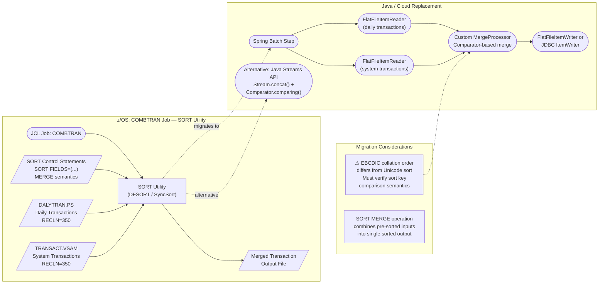
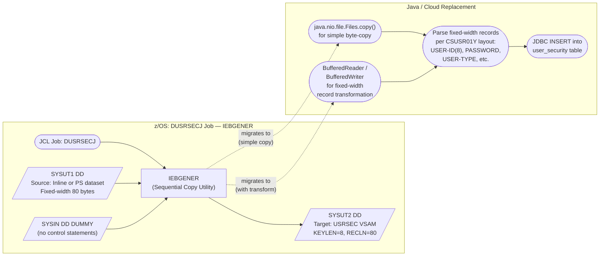
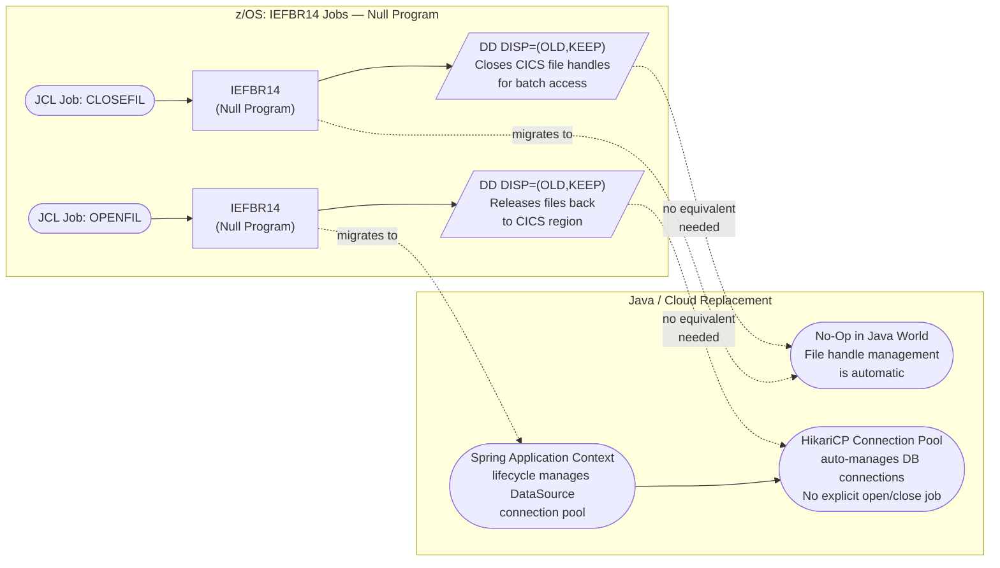
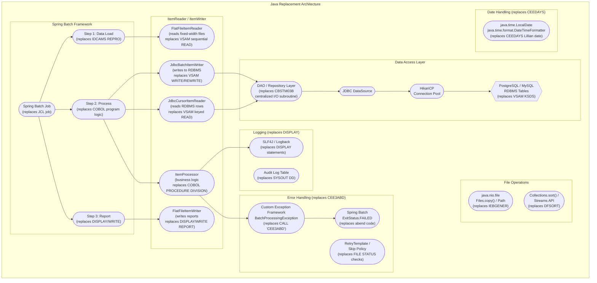
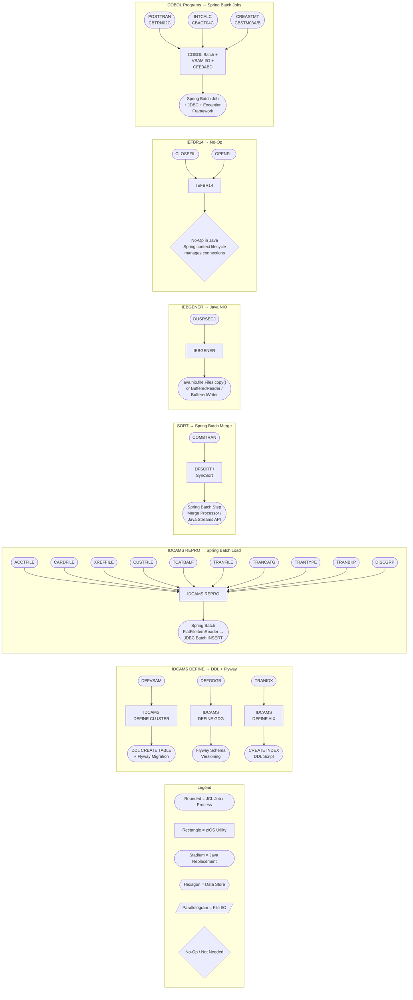

# Batch Job Migration Flow — CardDemo Application

> **Purpose:** Mermaid flowchart diagrams mapping each CardDemo z/OS batch job through its
> proprietary utility chain to the corresponding Java/cloud replacement pipeline.
>
> **Referenced by:** [03-migration-strategy.md](../03-migration-strategy.md) — Batch Utility Replacement Flow Visual
>
> **Source Citations:**
> - Batch job inventory: `README.md` — "Batch" table (lines 233–256)
> - COBOL batch programs: `app/cbl/CBACT01C.cbl` – `app/cbl/CBTRN03C.cbl`, `app/cbl/CBSTM03A.CBL`, `app/cbl/CBSTM03B.CBL`, `app/cbl/CSUTLDTC.cbl`
> - VSAM cluster attributes: `app/catlg/LISTCAT.txt` (IDCAMS LISTCAT ALL output)

---

## Legend

| Shape | Meaning |
|---|---|
| Rounded rectangle (`([...])`) | Process / Job Step |
| Rectangle (`[...]`) | z/OS Utility / Program |
| Stadium / Pill (`([...])`) | Java / Cloud Replacement |
| Hexagon (`{{...}}`) | Data Store (VSAM / RDBMS) |
| Diamond (`{...}`) | Decision / Condition |
| Parallelogram (`[/..../]`) | File / Data Input-Output |

---

## 1. IDCAMS Jobs — Dataset Definition and Data Loading

This diagram shows all batch jobs that use the IBM IDCAMS (Access Method Services) utility
for VSAM dataset definition (`DEFINE CLUSTER`, `DEFINE GDG`) and data loading (`REPRO`),
along with their Java/cloud replacement paths.

> **Source:** `README.md` lines 233–256 (Batch job table); `app/catlg/LISTCAT.txt` (VSAM cluster attributes)

```mermaid
graph TD
    subgraph zOS_IDCAMS["z/OS: IDCAMS Jobs"]
        DEFVSAM(["JCL Job: DEFVSAM"])
        DEFGDGB(["JCL Job: DEFGDGB"])
        ACCTFILE_JOB(["JCL Job: ACCTFILE"])
        CARDFILE_JOB(["JCL Job: CARDFILE"])
        XREFFILE_JOB(["JCL Job: XREFFILE"])
        CUSTFILE_JOB(["JCL Job: CUSTFILE"])
        TCATBALF_JOB(["JCL Job: TCATBALF"])
        TRANFILE_JOB(["JCL Job: TRANFILE"])
        TRANCATG_JOB(["JCL Job: TRANCATG"])
        TRANTYPE_JOB(["JCL Job: TRANTYPE"])
        TRANBKP_JOB(["JCL Job: TRANBKP"])
        TRANIDX_JOB(["JCL Job: TRANIDX"])

        IDCAMS_DEF["IDCAMS<br/>DEFINE CLUSTER"]
        IDCAMS_GDG["IDCAMS<br/>DEFINE GDG"]
        IDCAMS_REPRO["IDCAMS<br/>REPRO"]
        IDCAMS_AIX["IDCAMS<br/>DEFINE AIX"]

        DEFVSAM --> IDCAMS_DEF
        DEFGDGB --> IDCAMS_GDG
        ACCTFILE_JOB --> IDCAMS_REPRO
        CARDFILE_JOB --> IDCAMS_REPRO
        XREFFILE_JOB --> IDCAMS_REPRO
        CUSTFILE_JOB --> IDCAMS_REPRO
        TCATBALF_JOB --> IDCAMS_REPRO
        TRANFILE_JOB --> IDCAMS_REPRO
        TRANCATG_JOB --> IDCAMS_REPRO
        TRANTYPE_JOB --> IDCAMS_REPRO
        TRANBKP_JOB --> IDCAMS_REPRO
        TRANIDX_JOB --> IDCAMS_AIX
    end

    subgraph VSAM_Targets["VSAM Datasets Created / Loaded"]
        ACCTDAT{{"ACCTDATA.VSAM.KSDS<br/>KEYLEN=11, RECLN=300"}}
        CARDDAT{{"CARDDATA.VSAM.KSDS<br/>KEYLEN=16, RECLN=150"}}
        XREFDAT{{"CARDXREF.VSAM.KSDS<br/>KEYLEN=16, RECLN=50"}}
        CUSTDAT{{"CUSTDATA.VSAM.KSDS<br/>KEYLEN=9, RECLN=500"}}
        TCATBAL{{"TCATBALF.VSAM.KSDS<br/>KEYLEN=17, RECLN=50"}}
        TRANACT{{"TRANSACT.VSAM.KSDS<br/>KEYLEN=16, RECLN=350"}}
        TRNCATG{{"TRANCATG.VSAM.KSDS<br/>KEYLEN=6, RECLN=60"}}
        TRNTYPE{{"TRANTYPE.VSAM.KSDS<br/>KEYLEN=2, RECLN=60"}}
        DISCGRP_DS{{"DISCGRP.VSAM.KSDS<br/>KEYLEN=16, RECLN=50"}}
    end

    IDCAMS_DEF --> ACCTDAT
    IDCAMS_DEF --> CARDDAT
    IDCAMS_DEF --> XREFDAT
    IDCAMS_DEF --> CUSTDAT
    IDCAMS_DEF --> TCATBAL
    IDCAMS_DEF --> TRANACT
    IDCAMS_DEF --> TRNCATG
    IDCAMS_DEF --> TRNTYPE
    IDCAMS_DEF --> DISCGRP_DS
    IDCAMS_REPRO --> ACCTDAT
    IDCAMS_REPRO --> CARDDAT
    IDCAMS_REPRO --> XREFDAT
    IDCAMS_REPRO --> CUSTDAT
    IDCAMS_REPRO --> TCATBAL
    IDCAMS_REPRO --> TRANACT
    IDCAMS_REPRO --> TRNCATG
    IDCAMS_REPRO --> TRNTYPE
    IDCAMS_AIX --> TRANACT

    subgraph Java_IDCAMS["Java / Cloud Replacement"]
        DDL_CREATE(["DDL: CREATE TABLE +<br/>CREATE INDEX scripts"])
        FLYWAY(["Flyway / Liquibase<br/>schema migration"])
        SPRING_BATCH_LOAD(["Spring Batch Job<br/>FlatFileItemReader →<br/>JPA/JDBC ItemWriter"])
        JDBC_INSERT(["JDBC Batch INSERT<br/>via DataSource"])
        RDBMS_IDX(["CREATE INDEX /<br/>DDL ALTER TABLE"])

        DDL_CREATE --> FLYWAY
        SPRING_BATCH_LOAD --> JDBC_INSERT
    end

    subgraph RDBMS_Tables["RDBMS Tables (PostgreSQL / MySQL)"]
        TBL_ACCT{{"account_data<br/>PK: acct_id VARCHAR(11)"}}
        TBL_CARD{{"card_data<br/>PK: card_num VARCHAR(16)"}}
        TBL_XREF{{"card_xref<br/>PK: card_num VARCHAR(16)"}}
        TBL_CUST{{"customer_data<br/>PK: cust_id VARCHAR(9)"}}
        TBL_TCAT{{"tcat_balance<br/>PK: composite(17)"}}
        TBL_TRAN{{"transaction_data<br/>PK: tran_id VARCHAR(16)"}}
        TBL_TCATG{{"tran_category<br/>PK: cat_cd VARCHAR(6)"}}
        TBL_TTYPE{{"tran_type<br/>PK: type_cd VARCHAR(2)"}}
        TBL_DISC{{"disclosure_group<br/>PK: disc_group VARCHAR(16)"}}
    end

    IDCAMS_DEF -.->|"migrates to"| DDL_CREATE
    IDCAMS_GDG -.->|"migrates to"| FLYWAY
    IDCAMS_REPRO -.->|"migrates to"| SPRING_BATCH_LOAD
    IDCAMS_AIX -.->|"migrates to"| RDBMS_IDX

    JDBC_INSERT --> TBL_ACCT
    JDBC_INSERT --> TBL_CARD
    JDBC_INSERT --> TBL_XREF
    JDBC_INSERT --> TBL_CUST
    JDBC_INSERT --> TBL_TCAT
    JDBC_INSERT --> TBL_TRAN
    JDBC_INSERT --> TBL_TCATG
    JDBC_INSERT --> TBL_TTYPE
    JDBC_INSERT --> TBL_DISC

    ACCTDAT -.->|"KEYLEN=11 → PK VARCHAR(11)"| TBL_ACCT
    CARDDAT -.->|"KEYLEN=16 → PK VARCHAR(16)"| TBL_CARD
    XREFDAT -.->|"KEYLEN=16 → PK VARCHAR(16)"| TBL_XREF
    CUSTDAT -.->|"KEYLEN=9 → PK VARCHAR(9)"| TBL_CUST
    TCATBAL -.->|"KEYLEN=17 → PK composite"| TBL_TCAT
    TRANACT -.->|"KEYLEN=16 → PK VARCHAR(16)"| TBL_TRAN
    TRNCATG -.->|"KEYLEN=6 → PK VARCHAR(6)"| TBL_TCATG
    TRNTYPE -.->|"KEYLEN=2 → PK VARCHAR(2)"| TBL_TTYPE
    DISCGRP_DS -.->|"KEYLEN=16 → PK VARCHAR(16)"| TBL_DISC
```

### VSAM Cluster-to-Table Attribute Mapping

> **Source:** `app/catlg/LISTCAT.txt` — IDCAMS LISTCAT ALL output for AWS.M2.CARDDEMO datasets

| VSAM Cluster | KEYLEN | AVGLRECL | z/OS Source File | RDBMS Table | PK Column Type |
|---|---|---|---|---|---|
| ACCTDATA.VSAM.KSDS | 11 | 300 | acctdata.txt (CVACT01Y) | `account_data` | `acct_id VARCHAR(11)` |
| CARDDATA.VSAM.KSDS | 16 | 150 | carddata.txt (CVACT02Y) | `card_data` | `card_num VARCHAR(16)` |
| CARDXREF.VSAM.KSDS | 16 | 50 | cardxref.txt (CVACT03Y) | `card_xref` | `card_num VARCHAR(16)` |
| CUSTDATA.VSAM.KSDS | 9 | 500 | custdata.txt (CVCUS01Y) | `customer_data` | `cust_id VARCHAR(9)` |
| DISCGRP.VSAM.KSDS | 16 | 50 | discgrp.txt (CVTRA02Y) | `disclosure_group` | `disc_group VARCHAR(16)` |
| TCATBALF.VSAM.KSDS | 17 | 50 | tcatbal.txt (CVTRA01Y) | `tcat_balance` | composite key (17 bytes) |
| TRANCATG.VSAM.KSDS | 6 | 60 | trancatg.txt (CVTRA04Y) | `tran_category` | `cat_cd VARCHAR(6)` |
| TRANSACT.VSAM.KSDS | 16 | 350 | transact.txt (CVTRA05Y) | `transaction_data` | `tran_id VARCHAR(16)` |
| TRANTYPE.VSAM.KSDS | 2 | 60 | trantype.txt (CVTRA03Y) | `tran_type` | `type_cd VARCHAR(2)` |
| USRSEC.VSAM.KSDS | 8 | 80 | DUSRSECJ inline (CSUSR01Y) | `user_security` | `user_id VARCHAR(8)` |

---

## 2. SORT Job — Transaction File Merge

This diagram shows the COMBTRAN batch job that uses the z/OS SORT utility (DFSORT/SyncSort)
to merge daily transaction files with system transaction files, and its Java replacement path.

> **Source:** `README.md` line 254 — `COMBTRAN | SORT | Combine transaction files`

---

## 3. IEBGENER Job — Sequential File Copy

This diagram shows the DUSRSECJ batch job that uses the z/OS IEBGENER utility to copy
sequential source data into the USRSEC VSAM file for user security initialization.

> **Source:** `README.md` line 237 — `DUSRSECJ | IEBGENER | Initial Load of User security file`
> **Record layout:** `app/cpy/CSUSR01Y.cpy` — 80-byte fixed-width record (KEYLEN=8 per LISTCAT.txt)

---

## 4. IEFBR14 Jobs — File Allocation / Deallocation

This diagram shows the CLOSEFIL and OPENFIL batch jobs that use IEFBR14 (a null program)
purely for DD statement side effects — allocating or deallocating VSAM files for CICS.

> **Source:** `README.md` lines 247, 252 — `CLOSEFIL | IEFBR14 | Close VSAM files in CICS`, `OPENFIL | IEFBR14 | Open files in CICS`

---

## 5. Batch COBOL Program Execution Flow

This diagram shows the 12 batch COBOL programs, their VSAM file I/O chains,
CEE3ABD abend handling, inter-program calls (CBSTM03A → CBSTM03B), and the CSUTLDTC
date validation utility wrapping CEEDAYS.

> **Source:** `app/cbl/CBACT01C.cbl` through `app/cbl/CBTRN03C.cbl`, `app/cbl/CBSTM03A.CBL`, `app/cbl/CBSTM03B.CBL`, `app/cbl/CSUTLDTC.cbl`

```mermaid
graph TD
    subgraph Batch_Programs["Batch COBOL Programs — VSAM I/O and Utility Chains"]

        subgraph Account_Programs["Account Processing"]
            CBACT01C(["CBACT01C<br/>Read & Print<br/>Account Data"])
            CBACT02C(["CBACT02C<br/>Read & Print<br/>Card Data"])
            CBACT03C(["CBACT03C<br/>Read & Print<br/>Cross-Reference Data"])
            CBACT04C(["CBACT04C<br/>Interest Calculation<br/>FUNCTION CURRENT-DATE, MOD"])
        end

        subgraph Transaction_Programs["Transaction Processing"]
            CBTRN01C(["CBTRN01C<br/>Validate Daily<br/>Transactions"])
            CBTRN02C(["CBTRN02C<br/>Post Daily<br/>Transactions"])
            CBTRN03C(["CBTRN03C<br/>Transaction<br/>Detail Report"])
        end

        subgraph Other_Programs["Other Batch Programs"]
            CBCUS01C(["CBCUS01C<br/>Read & Print<br/>Customer Data"])
            CBSTM03A(["CBSTM03A<br/>Generate Account<br/>Statements"])
            CBSTM03B["CBSTM03B<br/>Centralized VSAM<br/>I/O Subroutine"]
            CSUTLDTC["CSUTLDTC<br/>Date Validation<br/>Wrapper"]
        end

        subgraph LE_Runtime["IBM LE Runtime"]
            CEE3ABD["CALL 'CEE3ABD'<br/>Abend Handler<br/>(9 batch programs)"]
            CEEDAYS["CALL 'CEEDAYS'<br/>Lillian Date<br/>Conversion"]
        end
    end

    subgraph VSAM_Files["VSAM Files (I/O Targets)"]
        V_ACCTFILE{{"ACCTFILE<br/>(ACCTDATA.VSAM.KSDS)"}}
        V_CARDFILE{{"CARDFILE<br/>(CARDDATA.VSAM.KSDS)"}}
        V_XREFFILE{{"XREFFILE<br/>(CARDXREF.VSAM.KSDS)"}}
        V_CUSTFILE{{"CUSTFILE<br/>(CUSTDATA.VSAM.KSDS)"}}
        V_TRANFILE{{"TRANFILE<br/>(TRANSACT.VSAM.KSDS)"}}
        V_DALYTRAN[/"DALYTRAN<br/>(Sequential PS)"/]
        V_DALYREJS[/"DALYREJS<br/>(Rejected Txns)"/]
        V_TCATBALF{{"TCATBALF<br/>(TCATBALF.VSAM.KSDS)"}}
        V_DISCGRP{{"DISCGRP<br/>(DISCGRP.VSAM.KSDS)"}}
        V_TRANSACT{{"TRANSACT<br/>(TRANSACT.VSAM.KSDS)"}}
        V_CARDXREF{{"CARDXREF<br/>(CARDXREF.VSAM.KSDS)"}}
        V_TRANTYPE{{"TRANTYPE<br/>(TRANTYPE.VSAM.KSDS)"}}
        V_TRANCATG{{"TRANCATG<br/>(TRANCATG.VSAM.KSDS)"}}
        V_TRNXFILE{{"TRNXFILE<br/>(Transaction file)"}}
        V_TRANREPT[/"TRANREPT<br/>(Report Output)"/]
        V_STMTFILE[/"STMTFILE<br/>(Statement Output)"/]
    end

    %% CBACT01C: reads ACCTFILE
    CBACT01C -->|"READ"| V_ACCTFILE
    CBACT01C -->|"on error"| CEE3ABD

    %% CBACT02C: reads CARDFILE
    CBACT02C -->|"READ"| V_CARDFILE
    CBACT02C -->|"on error"| CEE3ABD

    %% CBACT03C: reads XREFFILE
    CBACT03C -->|"READ"| V_XREFFILE
    CBACT03C -->|"on error"| CEE3ABD

    %% CBACT04C: reads TCATBALF, XREFFILE, ACCTFILE, DISCGRP; writes TRANSACT
    CBACT04C -->|"READ"| V_TCATBALF
    CBACT04C -->|"READ"| V_XREFFILE
    CBACT04C -->|"READ"| V_ACCTFILE
    CBACT04C -->|"READ"| V_DISCGRP
    CBACT04C -->|"WRITE"| V_TRANSACT
    CBACT04C -->|"on error"| CEE3ABD

    %% CBCUS01C: reads CUSTFILE
    CBCUS01C -->|"READ"| V_CUSTFILE
    CBCUS01C -->|"on error"| CEE3ABD

    %% CBTRN01C: reads DALYTRAN, CUSTFILE, XREFFILE, CARDFILE, ACCTFILE, TRANFILE
    CBTRN01C -->|"READ"| V_DALYTRAN
    CBTRN01C -->|"READ"| V_CUSTFILE
    CBTRN01C -->|"READ"| V_XREFFILE
    CBTRN01C -->|"READ"| V_CARDFILE
    CBTRN01C -->|"READ"| V_ACCTFILE
    CBTRN01C -->|"READ"| V_TRANFILE
    CBTRN01C -->|"on error"| CEE3ABD

    %% CBTRN02C: reads DALYTRAN, TRANFILE, XREFFILE, DALYREJS, ACCTFILE, TCATBALF
    CBTRN02C -->|"READ"| V_DALYTRAN
    CBTRN02C -->|"READ"| V_TRANFILE
    CBTRN02C -->|"READ"| V_XREFFILE
    CBTRN02C -->|"READ/WRITE"| V_DALYREJS
    CBTRN02C -->|"READ"| V_ACCTFILE
    CBTRN02C -->|"READ"| V_TCATBALF
    CBTRN02C -->|"on error"| CEE3ABD

    %% CBTRN03C: reads TRANFILE, CARDXREF, TRANTYPE, TRANCATG; writes TRANREPT
    CBTRN03C -->|"READ"| V_TRANFILE
    CBTRN03C -->|"READ"| V_CARDXREF
    CBTRN03C -->|"READ"| V_TRANTYPE
    CBTRN03C -->|"READ"| V_TRANCATG
    CBTRN03C -->|"WRITE"| V_TRANREPT
    CBTRN03C -->|"on error"| CEE3ABD

    %% CBSTM03A: calls CBSTM03B 13 times
    CBSTM03A -->|"CALL x13"| CBSTM03B
    CBSTM03A -->|"WRITE"| V_STMTFILE
    CBSTM03A -->|"on error"| CEE3ABD

    %% CBSTM03B: centralized I/O for TRNXFILE, XREFFILE, CUSTFILE, ACCTFILE
    CBSTM03B -->|"OPEN/READ/CLOSE"| V_TRNXFILE
    CBSTM03B -->|"OPEN/READ/CLOSE"| V_XREFFILE
    CBSTM03B -->|"OPEN/READ/CLOSE"| V_CUSTFILE
    CBSTM03B -->|"OPEN/READ/CLOSE"| V_ACCTFILE

    %% CSUTLDTC: wraps CEEDAYS
    CSUTLDTC -->|"CALL"| CEEDAYS
```

---

## 6. Java Replacement Architecture

This diagram shows the target Java/Spring Batch architecture that replaces the z/OS
batch execution environment, including the framework stack, data access layer, error
handling, and logging replacements.

> **Source:** Derived from batch program analysis of `app/cbl/CBACT01C.cbl`–`app/cbl/CBTRN03C.cbl`

---

## 7. End-to-End Batch Migration Overview

This diagram provides a consolidated view mapping each z/OS batch job to its Java replacement
type, organized by the utility being replaced.

> **Source:** `README.md` lines 233–256 — Batch job table; `app/cbl/` batch program sources

---

## Source Citations

| Source File | Lines/Content Referenced | Information Extracted |
|---|---|---|
| `README.md` | Lines 82–99, 161–184, 233–256 | Batch job names, program mappings, job descriptions, execution order |
| `app/cbl/CBACT01C.cbl` | Lines 29, 173 | `SELECT ACCTFILE-FILE ASSIGN TO ACCTFILE`, `CALL 'CEE3ABD'` |
| `app/cbl/CBACT02C.cbl` | Lines 29, 158 | `SELECT CARDFILE-FILE ASSIGN TO CARDFILE`, `CALL 'CEE3ABD'` |
| `app/cbl/CBACT03C.cbl` | Lines 29, 158 | `SELECT XREFFILE-FILE ASSIGN TO XREFFILE`, `CALL 'CEE3ABD'` |
| `app/cbl/CBACT04C.cbl` | Lines 28–53, 614, 632 | TCATBALF, XREFFILE, ACCTFILE, DISCGRP, TRANSACT assignments; `FUNCTION CURRENT-DATE`; `CALL 'CEE3ABD'` |
| `app/cbl/CBCUS01C.cbl` | Lines 29, 158 | `SELECT CUSTFILE-FILE ASSIGN TO CUSTFILE`, `CALL 'CEE3ABD'` |
| `app/cbl/CBSTM03A.CBL` | Lines 39–40, 351–909, 923 | STMTFILE, HTMLFILE assignments; 13× `CALL 'CBSTM03B'`; `CALL 'CEE3ABD'` |
| `app/cbl/CBSTM03B.CBL` | Lines 31–49 | TRNXFILE, XREFFILE, CUSTFILE, ACCTFILE assignments (centralized I/O subroutine) |
| `app/cbl/CBTRN01C.cbl` | Lines 29–58, 473 | DALYTRAN, CUSTFILE, XREFFILE, CARDFILE, ACCTFILE, TRANFILE assignments; `CALL 'CEE3ABD'` |
| `app/cbl/CBTRN02C.cbl` | Lines 29–57, 711 | DALYTRAN, TRANFILE, XREFFILE, DALYREJS, ACCTFILE, TCATBALF assignments; `CALL 'CEE3ABD'` |
| `app/cbl/CBTRN03C.cbl` | Lines 29–55, 630 | TRANFILE, CARDXREF, TRANTYPE, TRANCATG, TRANREPT, DATEPARM assignments; `CALL 'CEE3ABD'` |
| `app/cbl/CSUTLDTC.cbl` | Line 116 | `CALL "CEEDAYS"` — LE date validation wrapper |
| `app/catlg/LISTCAT.txt` | Lines 22–100, 164–233, 365–434, 595–663, 859–894, 1334–1440, 3555–3742, 3846 | VSAM KSDS cluster attributes: KEYLEN, AVGLRECL, RKP for all 10 clusters |
