# Utility Dependency Map — AWS CardDemo Application

## Overview

This diagram maps all 28 COBOL programs in the AWS CardDemo application to their proprietary utility dependencies. Programs are organized into two execution contexts (Batch and CICS Online), and utilities are grouped by category (IBM LE Runtime, CICS API, z/OS Batch Utilities, BMS Macros, IBM Copybooks, and VSAM File I/O).

The dependency edges are derived from static analysis of `CALL` statements, `EXEC CICS` commands, `COPY` directives, `FUNCTION` references, and `FILE STATUS` declarations across all source files in `app/cbl/`.

---

## Program-to-Utility Dependency Graph

```mermaid
graph LR

%% ============================================================
%% PROGRAM NODES — Batch Programs (11 programs)
%% ============================================================
subgraph BATCH["🔷 Batch Programs"]
    direction TB
    CBACT01C["CBACT01C<br/>Account File<br/>List"]
    CBACT02C["CBACT02C<br/>Card File<br/>List"]
    CBACT03C["CBACT03C<br/>Cross-Ref<br/>List"]
    CBACT04C["CBACT04C<br/>Interest<br/>Calculation"]
    CBCUS01C["CBCUS01C<br/>Customer File<br/>List"]
    CBSTM03A["CBSTM03A<br/>Statement<br/>Generator"]
    CBSTM03B["CBSTM03B<br/>I/O<br/>Subroutine"]
    CBTRN01C["CBTRN01C<br/>Transaction<br/>Validation"]
    CBTRN02C["CBTRN02C<br/>Transaction<br/>Posting"]
    CBTRN03C["CBTRN03C<br/>Transaction<br/>Report"]
    CSUTLDTC["CSUTLDTC<br/>Date Utility<br/>Wrapper"]
end

%% ============================================================
%% PROGRAM NODES — CICS Online Programs (17 programs)
%% ============================================================
subgraph CICS["🔶 CICS Online Programs"]
    direction TB
    COACTUPC["COACTUPC<br/>Account<br/>Update"]
    COACTVWC["COACTVWC<br/>Account<br/>View"]
    COADM01C["COADM01C<br/>Admin<br/>Menu"]
    COBIL00C["COBIL00C<br/>Bill<br/>Payment"]
    COCRDLIC["COCRDLIC<br/>Card<br/>List"]
    COCRDSLC["COCRDSLC<br/>Card<br/>Detail"]
    COCRDUPC["COCRDUPC<br/>Card<br/>Update"]
    COMEN01C["COMEN01C<br/>Main<br/>Menu"]
    CORPT00C["CORPT00C<br/>Report<br/>Request"]
    COSGN00C["COSGN00C<br/>Sign-On"]
    COTRN00C["COTRN00C<br/>Transaction<br/>List"]
    COTRN01C["COTRN01C<br/>Transaction<br/>Detail"]
    COTRN02C["COTRN02C<br/>Transaction<br/>Add"]
    COUSR00C["COUSR00C<br/>User<br/>List"]
    COUSR01C["COUSR01C<br/>User<br/>Add"]
    COUSR02C["COUSR02C<br/>User<br/>Update"]
    COUSR03C["COUSR03C<br/>User<br/>Delete"]
end

%% ============================================================
%% UTILITY NODES — IBM LE Runtime Services
%% ============================================================
subgraph LE["🟥 IBM LE Runtime Services"]
    CEE3ABD{{"CEE3ABD<br/>Abend Handler"}}
    CEEDAYS{{"CEEDAYS<br/>Lillian Date<br/>Conversion"}}
end

%% ============================================================
%% UTILITY NODES — CICS API Commands
%% ============================================================
subgraph CICSAPI["🟧 CICS API Commands"]
    CICS_FC[/"File Control<br/>READ · WRITE · REWRITE<br/>DELETE · STARTBR<br/>READNEXT · READPREV · ENDBR"/]
    CICS_PC[/"Program Control<br/>XCTL · RETURN"/]
    CICS_TC[/"Terminal Control<br/>SEND MAP · RECEIVE MAP<br/>SEND TEXT"/]
    CICS_SS[/"System Services<br/>ASSIGN · ASKTIME<br/>FORMATTIME"/]
    CICS_TDQ[/"Transient Data Queue<br/>WRITEQ TD"/]
end

%% ============================================================
%% UTILITY NODES — z/OS Batch Utilities
%% ============================================================
subgraph ZOS["🟦 z/OS Batch Utilities"]
    IDCAMS[["IDCAMS<br/>Access Method<br/>Services"]]
    SORT_U[["SORT<br/>DFSORT /<br/>SyncSort"]]
    IEBGENER[["IEBGENER<br/>Sequential<br/>Copy"]]
    IEFBR14[["IEFBR14<br/>Null<br/>Program"]]
end

%% ============================================================
%% UTILITY NODES — BMS Map Macros
%% ============================================================
subgraph BMS["🟪 BMS Map Macros"]
    BMS_MACROS(["DFHMSD · DFHMDI · DFHMDF<br/>3270 Screen Definitions<br/>17 Map Sources"])
end

%% ============================================================
%% UTILITY NODES — IBM Copybooks
%% ============================================================
subgraph CPYBOOKS["🟩 IBM Proprietary Copybooks"]
    DFHBMSCA(["DFHBMSCA<br/>BMS Character<br/>Attribute Set"])
    DFHAID_U(["DFHAID<br/>AID Key<br/>Definitions"])
end

%% ============================================================
%% UTILITY NODES — VSAM File I/O
%% ============================================================
subgraph VSAM["🟫 VSAM File I/O"]
    VSAM_IO[("VSAM KSDS<br/>File Operations<br/>OPEN · READ · WRITE<br/>CLOSE · FILE STATUS")]
end

%% ============================================================
%% EDGES — CEE3ABD (9 batch programs)
%% ============================================================
CBACT01C -->|"CALL"| CEE3ABD
CBACT02C -->|"CALL"| CEE3ABD
CBACT03C -->|"CALL"| CEE3ABD
CBACT04C -->|"CALL"| CEE3ABD
CBCUS01C -->|"CALL"| CEE3ABD
CBSTM03A -->|"CALL"| CEE3ABD
CBTRN01C -->|"CALL"| CEE3ABD
CBTRN02C -->|"CALL"| CEE3ABD
CBTRN03C -->|"CALL"| CEE3ABD

%% ============================================================
%% EDGES — CEEDAYS (1 wrapper program)
%% ============================================================
CSUTLDTC -->|"CALL"| CEEDAYS

%% ============================================================
%% EDGES — Inter-Program Calls (CSUTLDTC, CBSTM03B)
%% ============================================================
CORPT00C -->|"CALL 'CSUTLDTC'"| CSUTLDTC
COTRN02C -->|"CALL 'CSUTLDTC'"| CSUTLDTC
CBSTM03A -->|"CALL ×13"| CBSTM03B

%% ============================================================
%% EDGES — CICS File Control (14 CICS programs)
%% ============================================================
COACTUPC --> CICS_FC
COACTVWC --> CICS_FC
COBIL00C --> CICS_FC
COCRDLIC --> CICS_FC
COCRDSLC --> CICS_FC
COCRDUPC --> CICS_FC
COSGN00C --> CICS_FC
COTRN00C --> CICS_FC
COTRN01C --> CICS_FC
COTRN02C --> CICS_FC
COUSR00C --> CICS_FC
COUSR01C --> CICS_FC
COUSR02C --> CICS_FC
COUSR03C --> CICS_FC

%% ============================================================
%% EDGES — CICS Program Control / XCTL (7 CICS programs)
%% ============================================================
COACTUPC --> CICS_PC
COACTVWC --> CICS_PC
COCRDLIC --> CICS_PC
COCRDSLC --> CICS_PC
COCRDUPC --> CICS_PC
COMEN01C --> CICS_PC
COSGN00C --> CICS_PC

%% ============================================================
%% EDGES — CICS Terminal Control (all 17 CICS programs)
%% ============================================================
COACTUPC --> CICS_TC
COACTVWC --> CICS_TC
COADM01C --> CICS_TC
COBIL00C --> CICS_TC
COCRDLIC --> CICS_TC
COCRDSLC --> CICS_TC
COCRDUPC --> CICS_TC
COMEN01C --> CICS_TC
CORPT00C --> CICS_TC
COSGN00C --> CICS_TC
COTRN00C --> CICS_TC
COTRN01C --> CICS_TC
COTRN02C --> CICS_TC
COUSR00C --> CICS_TC
COUSR01C --> CICS_TC
COUSR02C --> CICS_TC
COUSR03C --> CICS_TC

%% ============================================================
%% EDGES — CICS System Services (2 programs)
%% ============================================================
COSGN00C -->|"ASSIGN"| CICS_SS
COBIL00C -->|"ASKTIME FORMATTIME"| CICS_SS

%% ============================================================
%% EDGES — CICS Transient Data Queue (1 program)
%% ============================================================
CORPT00C -->|"WRITEQ TD 'JOBS'"| CICS_TDQ

%% ============================================================
%% EDGES — DFHBMSCA Copybook (all 17 CICS programs via CSSETATY.cpy)
%% ============================================================
COACTUPC --> DFHBMSCA
COACTVWC --> DFHBMSCA
COADM01C --> DFHBMSCA
COBIL00C --> DFHBMSCA
COCRDLIC --> DFHBMSCA
COCRDSLC --> DFHBMSCA
COCRDUPC --> DFHBMSCA
COMEN01C --> DFHBMSCA
CORPT00C --> DFHBMSCA
COSGN00C --> DFHBMSCA
COTRN00C --> DFHBMSCA
COTRN01C --> DFHBMSCA
COTRN02C --> DFHBMSCA
COUSR00C --> DFHBMSCA
COUSR01C --> DFHBMSCA
COUSR02C --> DFHBMSCA
COUSR03C --> DFHBMSCA

%% ============================================================
%% EDGES — DFHAID Copybook (all 17 CICS programs via CSSTRPFY.cpy)
%% ============================================================
COACTUPC --> DFHAID_U
COACTVWC --> DFHAID_U
COADM01C --> DFHAID_U
COBIL00C --> DFHAID_U
COCRDLIC --> DFHAID_U
COCRDSLC --> DFHAID_U
COCRDUPC --> DFHAID_U
COMEN01C --> DFHAID_U
CORPT00C --> DFHAID_U
COSGN00C --> DFHAID_U
COTRN00C --> DFHAID_U
COTRN01C --> DFHAID_U
COTRN02C --> DFHAID_U
COUSR00C --> DFHAID_U
COUSR01C --> DFHAID_U
COUSR02C --> DFHAID_U
COUSR03C --> DFHAID_U

%% ============================================================
%% EDGES — BMS Map Macros (all 17 CICS programs use BMS maps)
%% ============================================================
COACTUPC --> BMS_MACROS
COACTVWC --> BMS_MACROS
COADM01C --> BMS_MACROS
COBIL00C --> BMS_MACROS
COCRDLIC --> BMS_MACROS
COCRDSLC --> BMS_MACROS
COCRDUPC --> BMS_MACROS
COMEN01C --> BMS_MACROS
CORPT00C --> BMS_MACROS
COSGN00C --> BMS_MACROS
COTRN00C --> BMS_MACROS
COTRN01C --> BMS_MACROS
COTRN02C --> BMS_MACROS
COUSR00C --> BMS_MACROS
COUSR01C --> BMS_MACROS
COUSR02C --> BMS_MACROS
COUSR03C --> BMS_MACROS

%% ============================================================
%% EDGES — VSAM File I/O (all batch programs)
%% ============================================================
CBACT01C --> VSAM_IO
CBACT02C --> VSAM_IO
CBACT03C --> VSAM_IO
CBACT04C --> VSAM_IO
CBCUS01C --> VSAM_IO
CBSTM03A --> VSAM_IO
CBSTM03B --> VSAM_IO
CBTRN01C --> VSAM_IO
CBTRN02C --> VSAM_IO
CBTRN03C --> VSAM_IO

%% ============================================================
%% EDGES — z/OS Batch Utilities (referenced in JCL / README.md)
%% ============================================================
CBACT01C -.->|"JCL"| IDCAMS
CBACT04C -.->|"JCL"| SORT_U
CBCUS01C -.->|"JCL"| IEBGENER
CBSTM03A -.->|"JCL"| IEFBR14

%% ============================================================
%% STYLES
%% ============================================================
classDef batchProg fill:#4a90d9,stroke:#2c5282,color:#ffffff,stroke-width:2px
classDef cicsProg fill:#ed8936,stroke:#c05621,color:#ffffff,stroke-width:2px
classDef leUtil fill:#e53e3e,stroke:#9b2c2c,color:#ffffff,stroke-width:2px
classDef cicsUtil fill:#dd6b20,stroke:#9c4221,color:#ffffff,stroke-width:2px
classDef zosUtil fill:#3182ce,stroke:#2a4365,color:#ffffff,stroke-width:2px
classDef bmsNode fill:#805ad5,stroke:#553c9a,color:#ffffff,stroke-width:2px
classDef cpyNode fill:#38a169,stroke:#276749,color:#ffffff,stroke-width:2px
classDef vsamNode fill:#8b6914,stroke:#5a4510,color:#ffffff,stroke-width:2px

class CBACT01C,CBACT02C,CBACT03C,CBACT04C,CBCUS01C,CBSTM03A,CBSTM03B,CBTRN01C,CBTRN02C,CBTRN03C,CSUTLDTC batchProg
class COACTUPC,COACTVWC,COADM01C,COBIL00C,COCRDLIC,COCRDSLC,COCRDUPC,COMEN01C,CORPT00C,COSGN00C,COTRN00C,COTRN01C,COTRN02C,COUSR00C,COUSR01C,COUSR02C,COUSR03C cicsProg
class CEE3ABD,CEEDAYS leUtil
class CICS_FC,CICS_PC,CICS_TC,CICS_SS,CICS_TDQ cicsUtil
class IDCAMS,SORT_U,IEBGENER,IEFBR14 zosUtil
class BMS_MACROS bmsNode
class DFHBMSCA,DFHAID_U cpyNode
class VSAM_IO vsamNode
```

---

## Dependency Summary Statistics

| Utility Category | Utility | Batch Programs | CICS Programs | Total Dependents |
|---|---|---|---|---|
| **IBM LE Runtime** | CEE3ABD (Abend Handler) | 9 | 0 | **9** |
| **IBM LE Runtime** | CEEDAYS (Date Conversion) | 1 (CSUTLDTC) | 0 | **1** |
| **CICS API** | File Control (READ/WRITE/etc.) | 0 | 14 | **14** |
| **CICS API** | Program Control (XCTL/RETURN) | 0 | 7 | **7** |
| **CICS API** | Terminal Control (SEND/RECEIVE MAP) | 0 | 17 | **17** |
| **CICS API** | System Services (ASSIGN/ASKTIME) | 0 | 2 | **2** |
| **CICS API** | Transient Data Queue (WRITEQ TD) | 0 | 1 | **1** |
| **z/OS Utilities** | IDCAMS (Access Method Services) | JCL ref | 0 | **JCL** |
| **z/OS Utilities** | SORT (DFSORT/SyncSort) | JCL ref | 0 | **JCL** |
| **z/OS Utilities** | IEBGENER (Sequential Copy) | JCL ref | 0 | **JCL** |
| **z/OS Utilities** | IEFBR14 (Null Program) | JCL ref | 0 | **JCL** |
| **BMS Macros** | DFHMSD/DFHMDI/DFHMDF | 0 | 17 | **17** |
| **IBM Copybooks** | DFHBMSCA (Attribute Set) | 0 | 17 | **17** |
| **IBM Copybooks** | DFHAID (AID Key Defs) | 0 | 17 | **17** |
| **VSAM File I/O** | VSAM KSDS Operations | 10 | 0 | **10** |

---

## Legend

| Symbol | Meaning |
|---|---|
| 🔷 Blue rounded boxes | Batch COBOL programs (11 programs in `app/cbl/CB*.cbl`, `CSUTLDTC.cbl`) |
| 🔶 Orange rounded boxes | CICS online COBOL programs (17 programs in `app/cbl/CO*.cbl`) |
| 🟥 Red double-bordered hexagons | IBM Language Environment runtime services (CEE3ABD, CEEDAYS) |
| 🟧 Orange parallelograms | CICS Transaction Server API commands (File Control, Program Control, Terminal Control, System Services, TDQ) |
| 🟦 Blue double-bordered boxes | z/OS batch utility programs (IDCAMS, SORT, IEBGENER, IEFBR14) |
| 🟪 Purple stadium shapes | BMS (Basic Mapping Support) screen definition macros |
| 🟩 Green stadium shapes | IBM proprietary CICS copybooks (DFHBMSCA, DFHAID) |
| 🟫 Brown cylinder | VSAM KSDS file I/O operations with FILE STATUS checking |
| Solid arrows (`-->`) | Direct runtime dependency (CALL statement or EXEC CICS command) |
| Dashed arrows (`-.->`) | JCL job-level dependency (utility invoked via batch JCL, not COBOL code) |
| Labels on arrows | Specific invocation mechanism (CALL, ASSIGN, WRITEQ TD, etc.) |

---

## Inter-Program Call Dependencies

In addition to proprietary utility dependencies, the following inter-program CALL relationships exist within the CardDemo application:

| Caller | Callee | Mechanism | Call Count | Purpose |
|---|---|---|---|---|
| CBSTM03A | CBSTM03B | `CALL 'CBSTM03B'` | 13 | Centralized VSAM I/O subroutine for statement generation |
| CORPT00C | CSUTLDTC | `CALL 'CSUTLDTC'` | Multiple | Date validation via CEEDAYS wrapper |
| COTRN02C | CSUTLDTC | `CALL 'CSUTLDTC'` | Multiple | Date validation for transaction date entry |

These inter-program dependencies are significant for migration because:

- **CBSTM03B** acts as a centralized Data Access Object (DAO) pattern — in Java, this maps to a `@Repository` service class with methods for each VSAM file operation.
- **CSUTLDTC** wraps the IBM LE `CEEDAYS` service — in Java, this maps to a utility class using `java.time.temporal.JulianFields` for Lillian day conversion.

---

## CICS File Control — Per-Program Access Patterns

The following table details which CICS File Control operations each program performs, based on `EXEC CICS` command analysis:

| Program | READ | WRITE | REWRITE | DELETE | STARTBR | READNEXT | READPREV | ENDBR | VSAM Files Accessed |
|---|---|---|---|---|---|---|---|---|---|
| COACTUPC | ✓ | — | ✓ | — | — | — | — | — | ACCTDAT, CARDDAT, XREFDAT |
| COACTVWC | ✓ | — | — | — | — | — | — | — | ACCTDAT, CARDDAT, XREFDAT |
| COBIL00C | ✓ | ✓ | ✓ | — | ✓ | — | ✓ | ✓ | ACCTDAT, TRANSACT |
| COCRDLIC | ✓ | — | — | — | ✓ | ✓ | ✓ | ✓ | CARDDAT, XREFDAT |
| COCRDSLC | ✓ | — | — | — | — | — | — | — | CARDDAT, XREFDAT |
| COCRDUPC | ✓ | ✓ | ✓ | — | — | — | — | — | CARDDAT, XREFDAT, ACCTDAT |
| COSGN00C | ✓ | — | — | — | — | — | — | — | USRSEC |
| COTRN00C | ✓ | — | — | — | ✓ | ✓ | ✓ | ✓ | TRANSACT, XREFDAT |
| COTRN01C | ✓ | — | — | — | — | — | — | — | TRANSACT |
| COTRN02C | ✓ | ✓ | — | — | ✓ | — | ✓ | ✓ | TRANSACT, XREFDAT, ACCTDAT, CARDDAT |
| COUSR00C | — | — | — | — | ✓ | ✓ | ✓ | ✓ | USRSEC |
| COUSR01C | — | ✓ | — | — | — | — | — | — | USRSEC |
| COUSR02C | ✓ | — | ✓ | — | — | — | — | — | USRSEC |
| COUSR03C | ✓ | — | — | ✓ | — | — | — | — | USRSEC |

---

## z/OS Batch Utility References

The z/OS batch utilities (IDCAMS, SORT, IEBGENER, IEFBR14) are not invoked directly from COBOL source code via `CALL` statements. Instead, they are referenced in JCL job control language that orchestrates batch execution. The dashed edges in the diagram represent these JCL-level dependencies.

| Utility | JCL Job | Purpose | Source |
|---|---|---|---|
| IDCAMS | DEFVSAM | Define VSAM KSDS clusters and load initial data via REPRO | `README.md`, `app/catlg/LISTCAT.txt` |
| SORT | COMBTRAN | Merge daily transactions with system transaction file | `README.md` |
| IEBGENER | DUSRSECJ | Copy sequential user security data to USRSEC VSAM file | `README.md` |
| IEFBR14 | CLOSEFIL / OPENFIL | Allocate/deallocate VSAM files for CICS open/close | `README.md` |

---

## BMS Map Source-to-Program Mapping

Each CICS program references a corresponding BMS map source for its 3270 screen definition:

| BMS Map Source | CICS Program | Map Name | Mapset Name |
|---|---|---|---|
| `app/bms/COACTUP.bms` | COACTUPC | COACTUPA | COACTUP |
| `app/bms/COACTVW.bms` | COACTVWC | COACTVWA | COACTVW |
| `app/bms/COADM01.bms` | COADM01C | COADM1A | COADM01 |
| `app/bms/COBIL00.bms` | COBIL00C | COBIL0A | COBIL00 |
| `app/bms/COCRDLI.bms` | COCRDLIC | COCRDLIA | COCRDLI |
| `app/bms/COCRDSL.bms` | COCRDSLC | COCRDSA | COCRDSL |
| `app/bms/COCRDUP.bms` | COCRDUPC | COCRDUPA | COCRDUP |
| `app/bms/COMEN01.bms` | COMEN01C | COMEN1A | COMEN01 |
| `app/bms/CORPT00.bms` | CORPT00C | CORPT0A | CORPT00 |
| `app/bms/COSGN00.bms` | COSGN00C | COSGN0A | COSGN00 |
| `app/bms/COTRN00.bms` | COTRN00C | COTRN0A | COTRN00 |
| `app/bms/COTRN01.bms` | COTRN01C | COTRN1A | COTRN01 |
| `app/bms/COTRN02.bms` | COTRN02C | COTRN2A | COTRN02 |
| `app/bms/COUSR00.bms` | COUSR00C | COUSR0A | COUSR00 |
| `app/bms/COUSR01.bms` | COUSR01C | COUSR1A | COUSR01 |
| `app/bms/COUSR02.bms` | COUSR02C | COUSR2A | COUSR02 |
| `app/bms/COUSR03.bms` | COUSR03C | COUSR3A | COUSR03 |

---

## Source Citations

All dependency data in this diagram was extracted from static analysis of the following source files:

- **CALL statement analysis**: `app/cbl/CBACT01C.cbl`, `app/cbl/CBACT02C.cbl`, `app/cbl/CBACT03C.cbl`, `app/cbl/CBACT04C.cbl`, `app/cbl/CBCUS01C.cbl`, `app/cbl/CBSTM03A.CBL`, `app/cbl/CBSTM03B.CBL`, `app/cbl/CBTRN01C.cbl`, `app/cbl/CBTRN02C.cbl`, `app/cbl/CBTRN03C.cbl`, `app/cbl/CSUTLDTC.cbl`
- **EXEC CICS command analysis**: `app/cbl/COACTUPC.cbl`, `app/cbl/COACTVWC.cbl`, `app/cbl/COADM01C.cbl`, `app/cbl/COBIL00C.cbl`, `app/cbl/COCRDLIC.cbl`, `app/cbl/COCRDSLC.cbl`, `app/cbl/COCRDUPC.cbl`, `app/cbl/COMEN01C.cbl`, `app/cbl/CORPT00C.cbl`, `app/cbl/COSGN00C.cbl`, `app/cbl/COTRN00C.cbl`, `app/cbl/COTRN01C.cbl`, `app/cbl/COTRN02C.cbl`, `app/cbl/COUSR00C.cbl`, `app/cbl/COUSR01C.cbl`, `app/cbl/COUSR02C.cbl`, `app/cbl/COUSR03C.cbl`
- **BMS map macro analysis**: All 17 files in `app/bms/*.bms`
- **IBM copybook analysis**: `app/cpy/DFHAID.cpy`, `app/cpy/DFHBMSCA.cpy`, `app/cpy/CSSETATY.cpy` (DFHBMSCA usage), `app/cpy/CSSTRPFY.cpy` (DFHAID usage)
- **VSAM catalog analysis**: `app/catlg/LISTCAT.txt`
- **Batch JCL references**: `README.md` (DEFVSAM, COMBTRAN, DUSRSECJ, CLOSEFIL, OPENFIL batch job descriptions)

**Extraction methodology**: `grep` pattern matching for `CALL '...'`, `EXEC CICS <verb>`, `COPY <copybook>`, `FILE STATUS`, and `FUNCTION <name>` across all `.cbl`, `.CBL`, `.cpy`, and `.bms` files in the `app/` directory tree.
