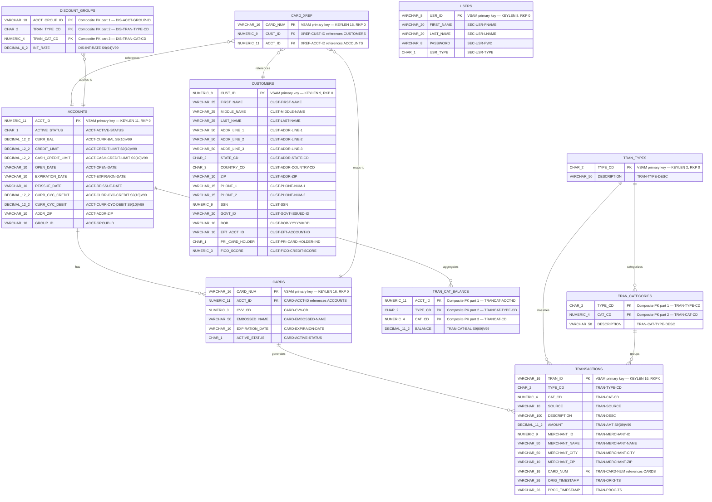

# VSAM-to-RDBMS Data Mapping

> **CardDemo Application — Proprietary Utility Migration Analysis**
>
> This diagram maps all 10 VSAM KSDS (Key-Sequenced Data Set) clusters from the
> AWS CardDemo mainframe application to their relational database table equivalents.
> Column definitions are derived from COBOL copybook record layouts; cluster
> attributes (key length, record length, CI size) are sourced from the IDCAMS
> LISTCAT catalog snapshot.
>
> **Primary Sources:**
> - `app/catlg/LISTCAT.txt` — IDCAMS LISTCAT ALL output for AWS.M2.CARDDEMO datasets
> - `app/cpy/CVACT01Y.cpy` — Account record layout (RECLN 300)
> - `app/cpy/CVACT02Y.cpy` — Card record layout (RECLN 150)
> - `app/cpy/CVACT03Y.cpy` — Card cross-reference record layout (RECLN 50)
> - `app/cpy/CUSTREC.cpy` — Customer record layout (RECLN 500)
> - `app/cpy/CVTRA01Y.cpy` — Transaction category balance record layout (RECLN 50)
> - `app/cpy/CVTRA02Y.cpy` — Discount group record layout (RECLN 50)
> - `app/cpy/CVTRA03Y.cpy` — Transaction type record layout (RECLN 60)
> - `app/cpy/CVTRA04Y.cpy` — Transaction category record layout (RECLN 60)
> - `app/cpy/CVTRA05Y.cpy` — Transaction record layout (RECLN 350)
> - `app/cpy/CSUSR01Y.cpy` — Security user data record layout (RECLN 80)

---

## Entity-Relationship Diagram

The following Mermaid ER diagram shows each VSAM KSDS cluster mapped to a
relational database table. Primary keys (PK), foreign keys (FK), and composite
keys are annotated. FILLER fields present in the COBOL copybooks are omitted in
the RDBMS schema as they carry no business data.



---

## VSAM Cluster Attribute Summary

The table below summarizes the VSAM KSDS cluster attributes from the IDCAMS
LISTCAT output (`Source: app/catlg/LISTCAT.txt`). These attributes inform the
RDBMS schema design — key lengths drive primary key column sizes, record lengths
drive row storage estimates, and CI sizes influence page/block sizing.

| VSAM Cluster Name | Cluster DSN | KEYLEN | RKP | AVGLRECL | MAXLRECL | CISIZE | SHROPTNS | Copybook | RDBMS Table |
|---|---|---|---|---|---|---|---|---|---|
| ACCTDATA | AWS.M2.CARDDEMO.ACCTDATA.VSAM.KSDS | 11 | 0 | 300 | 300 | 18432 | (2,3) | CVACT01Y.cpy | ACCOUNTS |
| CARDDATA | AWS.M2.CARDDEMO.CARDDATA.VSAM.KSDS | 16 | 0 | 150 | 150 | 18432 | (2,3) | CVACT02Y.cpy | CARDS |
| CARDXREF | AWS.M2.CARDDEMO.CARDXREF.VSAM.KSDS | 16 | 0 | 50 | 50 | 18432 | (2,3) | CVACT03Y.cpy | CARD_XREF |
| CUSTDATA | AWS.M2.CARDDEMO.CUSTDATA.VSAM.KSDS | 9 | 0 | 500 | 500 | 18432 | (2,3) | CUSTREC.cpy | CUSTOMERS |
| DISCGRP | AWS.M2.CARDDEMO.DISCGRP.VSAM.KSDS | 16 | 0 | 50 | 50 | 18432 | (2,3) | CVTRA02Y.cpy | DISCOUNT_GROUPS |
| TCATBALF | AWS.M2.CARDDEMO.TCATBALF.VSAM.KSDS | 17 | 0 | 50 | 50 | 18432 | (2,3) | CVTRA01Y.cpy | TRAN_CAT_BALANCE |
| TRANSACT | AWS.M2.CARDDEMO.TRANSACT.VSAM.KSDS | 16 | 0 | 350 | 350 | 18432 | (2,3) | CVTRA05Y.cpy | TRANSACTIONS |
| TRANCATG | AWS.M2.CARDDEMO.TRANCATG.VSAM.KSDS | 6 | 0 | 60 | 60 | 18432 | (2,3) | CVTRA04Y.cpy | TRAN_CATEGORIES |
| TRANTYPE | AWS.M2.CARDDEMO.TRANTYPE.VSAM.KSDS | 2 | 0 | 60 | 60 | 18432 | (1,4) | CVTRA03Y.cpy | TRAN_TYPES |
| USRSEC | AWS.M2.CARDDEMO.USRSEC.VSAM.KSDS | 8 | 0 | 80 | 80 | 8192 | (1,3) | CSUSR01Y.cpy | USERS |

---

## Table-by-Table Mapping Details

### 1. ACCOUNTS — from ACCTDATA VSAM KSDS

- **VSAM Cluster:** `AWS.M2.CARDDEMO.ACCTDATA.VSAM.KSDS`
- **Copybook:** `app/cpy/CVACT01Y.cpy` — `ACCOUNT-RECORD` (RECLN 300)
- **LISTCAT Attributes:** KEYLEN=11, RKP=0, AVGLRECL=300, CISIZE=18432, SHROPTNS(2,3), RECOVERY, UNIQUE, ERASE
- **Source:** `app/catlg/LISTCAT.txt:59-61`

| COBOL Field | PIC Clause | RDBMS Column | SQL Type | Key | Notes |
|---|---|---|---|---|---|
| ACCT-ID | PIC 9(11) | ACCT_ID | NUMERIC(11) | PK | VSAM primary key at RKP 0 |
| ACCT-ACTIVE-STATUS | PIC X(01) | ACTIVE_STATUS | CHAR(1) | | Account active flag |
| ACCT-CURR-BAL | PIC S9(10)V99 | CURR_BAL | DECIMAL(12,2) | | Signed with implied decimal |
| ACCT-CREDIT-LIMIT | PIC S9(10)V99 | CREDIT_LIMIT | DECIMAL(12,2) | | Signed with implied decimal |
| ACCT-CASH-CREDIT-LIMIT | PIC S9(10)V99 | CASH_CREDIT_LIMIT | DECIMAL(12,2) | | Signed with implied decimal |
| ACCT-OPEN-DATE | PIC X(10) | OPEN_DATE | VARCHAR(10) | | Date as string (YYYY-MM-DD) |
| ACCT-EXPIRAION-DATE | PIC X(10) | EXPIRATION_DATE | VARCHAR(10) | | Note: COBOL has typo "EXPIRAION" |
| ACCT-REISSUE-DATE | PIC X(10) | REISSUE_DATE | VARCHAR(10) | | Card reissue date |
| ACCT-CURR-CYC-CREDIT | PIC S9(10)V99 | CURR_CYC_CREDIT | DECIMAL(12,2) | | Current cycle credit total |
| ACCT-CURR-CYC-DEBIT | PIC S9(10)V99 | CURR_CYC_DEBIT | DECIMAL(12,2) | | Current cycle debit total |
| ACCT-ADDR-ZIP | PIC X(10) | ADDR_ZIP | VARCHAR(10) | | Account holder ZIP code |
| ACCT-GROUP-ID | PIC X(10) | GROUP_ID | VARCHAR(10) | | Links to DISCOUNT_GROUPS |
| FILLER | PIC X(178) | — | — | | **Dropped** — no business data |

### 2. CARDS — from CARDDATA VSAM KSDS

- **VSAM Cluster:** `AWS.M2.CARDDEMO.CARDDATA.VSAM.KSDS`
- **Copybook:** `app/cpy/CVACT02Y.cpy` — `CARD-RECORD` (RECLN 150)
- **LISTCAT Attributes:** KEYLEN=16, RKP=0, AVGLRECL=150, CISIZE=18432, SHROPTNS(2,3), RECOVERY, UNIQUE, ERASE
- **VSAM AIX:** `AWS.M2.CARDDEMO.CARDDATA.VSAM.AIX` — Alternate index on ACCT_ID (AXRKP=16, KEYLEN=11); maps to secondary index `IDX_CARDS_ACCT_ID` in RDBMS
- **Source:** `app/catlg/LISTCAT.txt:202-204` (DATA), `app/catlg/LISTCAT.txt:281-283` (AIX)

| COBOL Field | PIC Clause | RDBMS Column | SQL Type | Key | Notes |
|---|---|---|---|---|---|
| CARD-NUM | PIC X(16) | CARD_NUM | VARCHAR(16) | PK | VSAM primary key at RKP 0 |
| CARD-ACCT-ID | PIC 9(11) | ACCT_ID | NUMERIC(11) | FK | References ACCOUNTS.ACCT_ID |
| CARD-CVV-CD | PIC 9(03) | CVV_CD | NUMERIC(3) | | Card verification value |
| CARD-EMBOSSED-NAME | PIC X(50) | EMBOSSED_NAME | VARCHAR(50) | | Name on physical card |
| CARD-EXPIRAION-DATE | PIC X(10) | EXPIRATION_DATE | VARCHAR(10) | | Note: COBOL has typo "EXPIRAION" |
| CARD-ACTIVE-STATUS | PIC X(01) | ACTIVE_STATUS | CHAR(1) | | Card active flag |
| FILLER | PIC X(59) | — | — | | **Dropped** — no business data |

**RDBMS Secondary Index (from VSAM AIX):**
```sql
CREATE INDEX IDX_CARDS_ACCT_ID ON CARDS (ACCT_ID);
-- Replaces VSAM AIX: KEYLEN=11, AXRKP=16 (byte offset of CARD-ACCT-ID in base record)
-- AIX SHROPTNS(1,3), NONUNIQKEY — multiple cards per account allowed
```

### 3. CARD_XREF — from CARDXREF VSAM KSDS

- **VSAM Cluster:** `AWS.M2.CARDDEMO.CARDXREF.VSAM.KSDS`
- **Copybook:** `app/cpy/CVACT03Y.cpy` — `CARD-XREF-RECORD` (RECLN 50)
- **LISTCAT Attributes:** KEYLEN=16, RKP=0, AVGLRECL=50, CISIZE=18432, SHROPTNS(2,3), RECOVERY, UNIQUE, ERASE
- **VSAM AIX:** `AWS.M2.CARDDEMO.CARDXREF.VSAM.AIX` — Alternate index on ACCT_ID (AXRKP=25, KEYLEN=11); maps to secondary index `IDX_CARD_XREF_ACCT_ID` in RDBMS
- **Source:** `app/catlg/LISTCAT.txt:403-405` (DATA), `app/catlg/LISTCAT.txt:482-486` (AIX)

| COBOL Field | PIC Clause | RDBMS Column | SQL Type | Key | Notes |
|---|---|---|---|---|---|
| XREF-CARD-NUM | PIC X(16) | CARD_NUM | VARCHAR(16) | PK | VSAM primary key at RKP 0 |
| XREF-CUST-ID | PIC 9(09) | CUST_ID | NUMERIC(9) | FK | References CUSTOMERS.CUST_ID |
| XREF-ACCT-ID | PIC 9(11) | ACCT_ID | NUMERIC(11) | FK | References ACCOUNTS.ACCT_ID |
| FILLER | PIC X(14) | — | — | | **Dropped** — no business data |

**RDBMS Secondary Index (from VSAM AIX):**
```sql
CREATE INDEX IDX_CARD_XREF_ACCT_ID ON CARD_XREF (ACCT_ID);
-- Replaces VSAM AIX: KEYLEN=11, AXRKP=25 (byte offset of XREF-ACCT-ID in base record)
-- AIX SHROPTNS(1,3), NONUNIQKEY — multiple xref entries per account allowed
```

> **Junction Table Note:** CARD_XREF serves as a cross-reference (junction) table
> linking CARDS, CUSTOMERS, and ACCOUNTS. In the relational model this enables
> many-to-one relationships: each card maps to exactly one customer and one
> account, but a customer or account may have multiple cards.

### 4. CUSTOMERS — from CUSTDATA VSAM KSDS

- **VSAM Cluster:** `AWS.M2.CARDDEMO.CUSTDATA.VSAM.KSDS`
- **Copybook:** `app/cpy/CUSTREC.cpy` — `CUSTOMER-RECORD` (RECLN 500)
- **LISTCAT Attributes:** KEYLEN=9, RKP=0, AVGLRECL=500, CISIZE=18432, SHROPTNS(2,3), RECOVERY, UNIQUE, ERASE
- **Source:** `app/catlg/LISTCAT.txt:632-634`

| COBOL Field | PIC Clause | RDBMS Column | SQL Type | Key | Notes |
|---|---|---|---|---|---|
| CUST-ID | PIC 9(09) | CUST_ID | NUMERIC(9) | PK | VSAM primary key at RKP 0 |
| CUST-FIRST-NAME | PIC X(25) | FIRST_NAME | VARCHAR(25) | | |
| CUST-MIDDLE-NAME | PIC X(25) | MIDDLE_NAME | VARCHAR(25) | | |
| CUST-LAST-NAME | PIC X(25) | LAST_NAME | VARCHAR(25) | | |
| CUST-ADDR-LINE-1 | PIC X(50) | ADDR_LINE_1 | VARCHAR(50) | | |
| CUST-ADDR-LINE-2 | PIC X(50) | ADDR_LINE_2 | VARCHAR(50) | | |
| CUST-ADDR-LINE-3 | PIC X(50) | ADDR_LINE_3 | VARCHAR(50) | | |
| CUST-ADDR-STATE-CD | PIC X(02) | STATE_CD | CHAR(2) | | US state abbreviation |
| CUST-ADDR-COUNTRY-CD | PIC X(03) | COUNTRY_CD | CHAR(3) | | ISO country code |
| CUST-ADDR-ZIP | PIC X(10) | ZIP | VARCHAR(10) | | Postal code |
| CUST-PHONE-NUM-1 | PIC X(15) | PHONE_1 | VARCHAR(15) | | Primary phone |
| CUST-PHONE-NUM-2 | PIC X(15) | PHONE_2 | VARCHAR(15) | | Secondary phone |
| CUST-SSN | PIC 9(09) | SSN | NUMERIC(9) | | Social Security Number |
| CUST-GOVT-ISSUED-ID | PIC X(20) | GOVT_ID | VARCHAR(20) | | Government-issued ID |
| CUST-DOB-YYYYMMDD | PIC X(10) | DOB | VARCHAR(10) | | Date of birth |
| CUST-EFT-ACCOUNT-ID | PIC X(10) | EFT_ACCT_ID | VARCHAR(10) | | EFT account reference |
| CUST-PRI-CARD-HOLDER-IND | PIC X(01) | PRI_CARD_HOLDER | CHAR(1) | | Primary card holder flag |
| CUST-FICO-CREDIT-SCORE | PIC 9(03) | FICO_SCORE | NUMERIC(3) | | Credit score |
| FILLER | PIC X(168) | — | — | | **Dropped** — no business data |

### 5. DISCOUNT_GROUPS — from DISCGRP VSAM KSDS

- **VSAM Cluster:** `AWS.M2.CARDDEMO.DISCGRP.VSAM.KSDS`
- **Copybook:** `app/cpy/CVTRA02Y.cpy` — `DIS-GROUP-RECORD` (RECLN 50)
- **LISTCAT Attributes:** KEYLEN=16, RKP=0, AVGLRECL=50, CISIZE=18432, SHROPTNS(2,3), RECOVERY, UNIQUE, ERASE
- **Source:** `app/catlg/LISTCAT.txt:896-898`

| COBOL Field | PIC Clause | RDBMS Column | SQL Type | Key | Notes |
|---|---|---|---|---|---|
| DIS-ACCT-GROUP-ID | PIC X(10) | ACCT_GROUP_ID | VARCHAR(10) | PK (composite) | Part 1 of VSAM key (bytes 0-9) |
| DIS-TRAN-TYPE-CD | PIC X(02) | TRAN_TYPE_CD | CHAR(2) | PK (composite) | Part 2 of VSAM key (bytes 10-11) |
| DIS-TRAN-CAT-CD | PIC 9(04) | TRAN_CAT_CD | NUMERIC(4) | PK (composite) | Part 3 of VSAM key (bytes 12-15) |
| DIS-INT-RATE | PIC S9(04)V99 | INT_RATE | DECIMAL(6,2) | | Interest rate for this group/type/category |
| FILLER | PIC X(28) | — | — | | **Dropped** — no business data |

> **Composite Key Note:** The VSAM KEYLEN=16 comprises the concatenation of
> DIS-ACCT-GROUP-ID (10) + DIS-TRAN-TYPE-CD (2) + DIS-TRAN-CAT-CD (4) = 16 bytes.
> In RDBMS this maps to a composite primary key constraint on all three columns.

### 6. TRAN_CAT_BALANCE — from TCATBALF VSAM KSDS

- **VSAM Cluster:** `AWS.M2.CARDDEMO.TCATBALF.VSAM.KSDS`
- **Copybook:** `app/cpy/CVTRA01Y.cpy` — `TRAN-CAT-BAL-RECORD` (RECLN 50)
- **LISTCAT Attributes:** KEYLEN=17, RKP=0, AVGLRECL=50, CISIZE=18432, SHROPTNS(2,3), RECOVERY, UNIQUE, ERASE
- **Source:** `app/catlg/LISTCAT.txt:1371-1373`

| COBOL Field | PIC Clause | RDBMS Column | SQL Type | Key | Notes |
|---|---|---|---|---|---|
| TRANCAT-ACCT-ID | PIC 9(11) | ACCT_ID | NUMERIC(11) | PK (composite) | Part 1 of VSAM key (bytes 0-10) |
| TRANCAT-TYPE-CD | PIC X(02) | TYPE_CD | CHAR(2) | PK (composite) | Part 2 of VSAM key (bytes 11-12) |
| TRANCAT-CD | PIC 9(04) | CAT_CD | NUMERIC(4) | PK (composite) | Part 3 of VSAM key (bytes 13-16) |
| TRAN-CAT-BAL | PIC S9(09)V99 | BALANCE | DECIMAL(11,2) | | Running balance for acct/type/category |
| FILLER | PIC X(22) | — | — | | **Dropped** — no business data |

> **Composite Key Note:** The VSAM KEYLEN=17 comprises TRANCAT-ACCT-ID (11) +
> TRANCAT-TYPE-CD (2) + TRANCAT-CD (4) = 17 bytes. This maps to a composite
> primary key in RDBMS. The ACCT_ID column also serves as a foreign key to
> the ACCOUNTS table.

### 7. TRANSACTIONS — from TRANSACT VSAM KSDS

- **VSAM Cluster:** `AWS.M2.CARDDEMO.TRANSACT.VSAM.KSDS`
- **Copybook:** `app/cpy/CVTRA05Y.cpy` — `TRAN-RECORD` (RECLN 350)
- **LISTCAT Attributes:** KEYLEN=16, RKP=0, AVGLRECL=350, CISIZE=18432, SHROPTNS(2,3), RECOVERY, UNIQUE, ERASE
- **VSAM AIX:** `AWS.M2.CARDDEMO.TRANSACT.VSAM.AIX` — Alternate index present (details in LISTCAT)
- **Source:** `app/catlg/LISTCAT.txt:3591-3593`

| COBOL Field | PIC Clause | RDBMS Column | SQL Type | Key | Notes |
|---|---|---|---|---|---|
| TRAN-ID | PIC X(16) | TRAN_ID | VARCHAR(16) | PK | VSAM primary key at RKP 0 |
| TRAN-TYPE-CD | PIC X(02) | TYPE_CD | CHAR(2) | | Transaction type code |
| TRAN-CAT-CD | PIC 9(04) | CAT_CD | NUMERIC(4) | | Transaction category code |
| TRAN-SOURCE | PIC X(10) | SOURCE | VARCHAR(10) | | Originating source identifier |
| TRAN-DESC | PIC X(100) | DESCRIPTION | VARCHAR(100) | | Transaction description |
| TRAN-AMT | PIC S9(09)V99 | AMOUNT | DECIMAL(11,2) | | Signed transaction amount |
| TRAN-MERCHANT-ID | PIC 9(09) | MERCHANT_ID | NUMERIC(9) | | Merchant identifier |
| TRAN-MERCHANT-NAME | PIC X(50) | MERCHANT_NAME | VARCHAR(50) | | Merchant display name |
| TRAN-MERCHANT-CITY | PIC X(50) | MERCHANT_CITY | VARCHAR(50) | | Merchant city |
| TRAN-MERCHANT-ZIP | PIC X(10) | MERCHANT_ZIP | VARCHAR(10) | | Merchant postal code |
| TRAN-CARD-NUM | PIC X(16) | CARD_NUM | VARCHAR(16) | FK | References CARDS.CARD_NUM |
| TRAN-ORIG-TS | PIC X(26) | ORIG_TIMESTAMP | VARCHAR(26) | | Original transaction timestamp |
| TRAN-PROC-TS | PIC X(26) | PROC_TIMESTAMP | VARCHAR(26) | | Processing timestamp |
| FILLER | PIC X(20) | — | — | | **Dropped** — no business data |

### 8. TRAN_CATEGORIES — from TRANCATG VSAM KSDS

- **VSAM Cluster:** `AWS.M2.CARDDEMO.TRANCATG.VSAM.KSDS`
- **Copybook:** `app/cpy/CVTRA04Y.cpy` — `TRAN-CAT-RECORD` (RECLN 60)
- **LISTCAT Attributes:** KEYLEN=6, RKP=0, AVGLRECL=60, CISIZE=18432, SHROPTNS(2,3), RECOVERY, UNIQUE, ERASE
- **Source:** `app/catlg/LISTCAT.txt:1475-1477`

| COBOL Field | PIC Clause | RDBMS Column | SQL Type | Key | Notes |
|---|---|---|---|---|---|
| TRAN-TYPE-CD | PIC X(02) | TYPE_CD | CHAR(2) | PK (composite) | Part 1 of VSAM key (bytes 0-1) |
| TRAN-CAT-CD | PIC 9(04) | CAT_CD | NUMERIC(4) | PK (composite) | Part 2 of VSAM key (bytes 2-5) |
| TRAN-CAT-TYPE-DESC | PIC X(50) | DESCRIPTION | VARCHAR(50) | | Category description |
| FILLER | PIC X(04) | — | — | | **Dropped** — no business data |

> **Composite Key Note:** The VSAM KEYLEN=6 comprises TRAN-TYPE-CD (2) +
> TRAN-CAT-CD (4) = 6 bytes. The TYPE_CD column also serves as a foreign key
> to TRAN_TYPES.TYPE_CD.

### 9. TRAN_TYPES — from TRANTYPE VSAM KSDS

- **VSAM Cluster:** `AWS.M2.CARDDEMO.TRANTYPE.VSAM.KSDS`
- **Copybook:** `app/cpy/CVTRA03Y.cpy` — `TRAN-TYPE-RECORD` (RECLN 60)
- **LISTCAT Attributes:** KEYLEN=2, RKP=0, AVGLRECL=60, CISIZE=18432, SHROPTNS(1,4), RECOVERY, UNIQUE, ERASE
- **Source:** `app/catlg/LISTCAT.txt:3783-3785`

| COBOL Field | PIC Clause | RDBMS Column | SQL Type | Key | Notes |
|---|---|---|---|---|---|
| TRAN-TYPE | PIC X(02) | TYPE_CD | CHAR(2) | PK | VSAM primary key at RKP 0 |
| TRAN-TYPE-DESC | PIC X(50) | DESCRIPTION | VARCHAR(50) | | Type description text |
| FILLER | PIC X(08) | — | — | | **Dropped** — no business data |

### 10. USERS — from USRSEC VSAM KSDS

- **VSAM Cluster:** `AWS.M2.CARDDEMO.USRSEC.VSAM.KSDS`
- **Copybook:** `app/cpy/CSUSR01Y.cpy` — `SEC-USER-DATA` (RECLN 80)
- **LISTCAT Attributes:** KEYLEN=8, RKP=0, AVGLRECL=80, CISIZE=8192, SHROPTNS(1,3), RECOVERY, UNIQUE, NOERASE, REUSE
- **Source:** `app/catlg/LISTCAT.txt:3881-3884`

| COBOL Field | PIC Clause | RDBMS Column | SQL Type | Key | Notes |
|---|---|---|---|---|---|
| SEC-USR-ID | PIC X(08) | USR_ID | VARCHAR(8) | PK | VSAM primary key at RKP 0 |
| SEC-USR-FNAME | PIC X(20) | FIRST_NAME | VARCHAR(20) | | User first name |
| SEC-USR-LNAME | PIC X(20) | LAST_NAME | VARCHAR(20) | | User last name |
| SEC-USR-PWD | PIC X(08) | PASSWORD | VARCHAR(8) | | User password (plaintext in VSAM) |
| SEC-USR-TYPE | PIC X(01) | USR_TYPE | CHAR(1) | | User type/role indicator |
| SEC-USR-FILLER | PIC X(23) | — | — | | **Dropped** — no business data |

---

## Relationship Details

The ER relationships modeled above reflect the business logic and data access
patterns observed in the COBOL programs. The following table documents each
foreign key relationship and the COBOL programs that exercise it.

| Parent Table | Child Table | FK Column(s) | Relationship | Exercised By |
|---|---|---|---|---|
| ACCOUNTS | CARDS | ACCT_ID | One-to-Many | COACTVWC, COACTUPC, COBIL00C |
| CARDS | TRANSACTIONS | CARD_NUM | One-to-Many | COTRN00C, COTRN01C, COTRN02C |
| CUSTOMERS | CARD_XREF | CUST_ID | One-to-Many | COCRDLIC, COCRDSLC |
| ACCOUNTS | CARD_XREF | ACCT_ID | One-to-Many | COACTVWC, COACTUPC |
| CARDS | CARD_XREF | CARD_NUM | One-to-One | COCRDLIC, COCRDSLC |
| ACCOUNTS | TRAN_CAT_BALANCE | ACCT_ID | One-to-Many | CBACT04C (batch) |
| TRAN_TYPES | TRAN_CATEGORIES | TYPE_CD | One-to-Many | COTRN02C |
| TRAN_TYPES | TRANSACTIONS | TYPE_CD | One-to-Many | COTRN01C, COTRN02C |
| TRAN_CATEGORIES | TRANSACTIONS | TYPE_CD, CAT_CD | One-to-Many | COTRN01C, COTRN02C |
| ACCOUNTS | DISCOUNT_GROUPS | GROUP_ID | Logical (via GROUP_ID) | CBACT04C (batch) |

---

## VSAM-Specific Attributes with No Direct RDBMS Equivalent

The following VSAM attributes from LISTCAT.txt do not have direct relational
database counterparts and require special handling during migration.

### Control Interval (CI) and Control Area (CA) Sizing

| Attribute | VSAM Purpose | RDBMS Equivalent | Migration Note |
|---|---|---|---|
| CISIZE | Control Interval size — the physical I/O transfer unit (18432 or 8192 bytes for these clusters) | Database page/block size | RDBMS page size is configured at the tablespace level (e.g., PostgreSQL 8 KB default, Oracle 8 KB default). No per-table CI equivalent exists. Storage engine auto-manages page allocation. |
| CI/CA | Number of Control Intervals per Control Area (45 or 90) | N/A | No direct equivalent. RDBMS extent sizing is managed automatically or via tablespace configuration. |
| FREESPACE-%CI / FREESPACE-%CA | Percentage of free space reserved in each CI/CA for future inserts | Table FILLFACTOR / PCTFREE | PostgreSQL: `ALTER TABLE ... SET (fillfactor = N)`. Oracle: `PCTFREE N`. Default settings (typically 10-20%) are usually sufficient. |

### Share Options (SHROPTNS)

| Cluster | SHROPTNS | Meaning | RDBMS Equivalent |
|---|---|---|---|
| ACCTDATA, CARDDATA, CARDXREF, CUSTDATA, DISCGRP, TCATBALF, TRANSACT, TRANCATG | (2,3) | Cross-region: read integrity, write integrity; Cross-system: multiple readers allowed | Standard RDBMS transaction isolation levels (READ COMMITTED or higher). RDBMS lock managers handle concurrent access natively. |
| TRANTYPE | (1,4) | Cross-region: full read integrity; Cross-system: no restrictions | Read-only lookup table pattern — minimal locking needed. |
| USRSEC | (1,3) | Cross-region: full read integrity; Cross-system: multiple readers | Standard row-level locking with READ COMMITTED isolation. |

### Recovery and Integrity Flags

| Attribute | VSAM Value | RDBMS Equivalent | Migration Note |
|---|---|---|---|
| RECOVERY | Present on all 10 clusters | Transaction logging / WAL | RDBMS databases use Write-Ahead Logging (WAL) by default. No special configuration needed. |
| UNIQUE | Present on all 10 clusters | PRIMARY KEY / UNIQUE constraint | Already mapped to PK constraints in the schema above. |
| ERASE | Present on 8 of 10 clusters | N/A (or `SECURE DELETE` in some RDBMS) | VSAM ERASE overwrites deleted records with binary zeros for security. RDBMS typically does not overwrite deleted rows. If required, implement via application-level secure delete or database-level encryption at rest. |
| NOERASE | USRSEC, CARDDATA indexes | Default RDBMS behavior | No action needed — standard delete behavior. |
| REUSE | USRSEC only | `TRUNCATE TABLE` | VSAM REUSE allows the dataset to be reloaded without delete/redefine. RDBMS equivalent is `TRUNCATE TABLE users;` before bulk reload. |

### VSAM Alternate Index (AIX) to RDBMS Secondary Index

| VSAM AIX | Base Cluster | AIX Key (AXRKP, KEYLEN) | NONUNIQKEY | RDBMS Equivalent |
|---|---|---|---|---|
| AWS.M2.CARDDEMO.CARDDATA.VSAM.AIX | CARDDATA | AXRKP=16, KEYLEN=11 (CARD-ACCT-ID) | Yes | `CREATE INDEX IDX_CARDS_ACCT_ID ON CARDS (ACCT_ID)` |
| AWS.M2.CARDDEMO.CARDXREF.VSAM.AIX | CARDXREF | AXRKP=25, KEYLEN=11 (XREF-ACCT-ID) | Yes | `CREATE INDEX IDX_CARD_XREF_ACCT_ID ON CARD_XREF (ACCT_ID)` |
| AWS.M2.CARDDEMO.TRANSACT.VSAM.AIX | TRANSACT | See LISTCAT for details | Yes | `CREATE INDEX IDX_TRANSACTIONS_CARD_NUM ON TRANSACTIONS (CARD_NUM)` |

> **AIX PATH Note:** Each VSAM AIX has an associated PATH object that provides
> an access path through the alternate index to the base cluster. In RDBMS, the
> query optimizer automatically uses secondary indexes when beneficial — no
> explicit PATH equivalent is needed.

### FILLER Fields Dropped in Migration

Every COBOL copybook contains FILLER fields that pad the record to the declared
fixed record length (AVGLRECL). These fields carry no business data and are
artifacts of the fixed-length record format required by VSAM KSDS.

| Copybook | FILLER Size | Record Length | Business Data Size | Notes |
|---|---|---|---|---|
| CVACT01Y.cpy | 178 bytes | 300 bytes | 122 bytes | 59% padding |
| CVACT02Y.cpy | 59 bytes | 150 bytes | 91 bytes | 39% padding |
| CVACT03Y.cpy | 14 bytes | 50 bytes | 36 bytes | 28% padding |
| CUSTREC.cpy | 168 bytes | 500 bytes | 332 bytes | 34% padding |
| CVTRA01Y.cpy | 22 bytes | 50 bytes | 28 bytes | 44% padding |
| CVTRA02Y.cpy | 28 bytes | 50 bytes | 22 bytes | 56% padding |
| CVTRA03Y.cpy | 8 bytes | 60 bytes | 52 bytes | 13% padding |
| CVTRA04Y.cpy | 4 bytes | 60 bytes | 56 bytes | 7% padding |
| CVTRA05Y.cpy | 20 bytes | 350 bytes | 330 bytes | 6% padding |
| CSUSR01Y.cpy | 23 bytes | 80 bytes | 57 bytes | 29% padding |

> **Storage Savings:** Migrating to RDBMS with VARCHAR columns eliminates the
> fixed-length padding overhead. The total FILLER across all 10 datasets is
> 524 bytes per complete record set, which translates directly to storage savings
> in the relational schema.

---

## COBOL PIC Clause to SQL Type Conversion Reference

The following table documents the systematic PIC-to-SQL type mapping rules applied
throughout this diagram.

| COBOL PIC Clause | SQL Type | Conversion Rule | Example |
|---|---|---|---|
| PIC 9(n) | NUMERIC(n) | Unsigned integer — maps to exact numeric | PIC 9(11) → NUMERIC(11) |
| PIC S9(n)V99 | DECIMAL(n+2, 2) | Signed with 2 implied decimal places | PIC S9(10)V99 → DECIMAL(12,2) |
| PIC S9(n)V99 | DECIMAL(n+2, 2) | Signed with 2 implied decimal places | PIC S9(09)V99 → DECIMAL(11,2) |
| PIC S9(n)V99 | DECIMAL(n+2, 2) | Signed with 2 implied decimal places | PIC S9(04)V99 → DECIMAL(6,2) |
| PIC X(n) where n ≤ 3 | CHAR(n) | Fixed-length character for short codes | PIC X(01) → CHAR(1) |
| PIC X(n) where n > 3 | VARCHAR(n) | Variable-length for longer text fields | PIC X(50) → VARCHAR(50) |

---

## Cross-References

- **Referenced by:** [Dependency Impact Analysis](../02-dependency-impact-analysis.md) — for VSAM-to-RDBMS complexity assessment
- **Referenced by:** [Migration Strategy](../03-migration-strategy.md) — for data layer migration planning
- **Referenced by:** [Testing Validation Framework](../05-testing-validation-framework.md) — for database state validation test design
- **See also:** [Utility Dependency Map](utility-dependency-map.md) — for program-to-VSAM file dependency relationships
- **See also:** [Batch Job Migration Flow](batch-job-migration-flow.md) — for IDCAMS DEFINE CLUSTER to DDL migration flow
