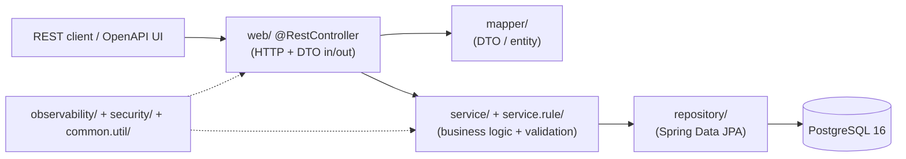

# Extending & Continued Development

This guide explains **how to add or modify functionality** in the migrated CardDemo
application while preserving behavioral parity and passing the quality gates. It assumes you
already have a working local setup (see [`./getting-started.md`](./getting-started.md)) and a
working understanding of the credit-card domain (see [`./domain-context.md`](./domain-context.md)).

> **Guardrail — read this first.** CardDemo is a **behavioral-parity re-platforming**, not a
> rewrite. There is **no feature expansion beyond the COBOL scope**. "Extending" here means:
> adding tests, refactoring within parity, wiring observability, or implementing already-scoped
> behavior — **not** inventing new business capabilities. Every change must **preserve the
> observable contracts** (screen fields, PF-key paths, batch reject codes, file record layouts,
> return codes, and monetary computations), be reflected in
> [`../traceability-matrix.md`](../traceability-matrix.md), and — if it involves any non-trivial
> decision or deviation — be recorded in [`../decision-log.md`](../decision-log.md). External MQ
> integration, RACF / mainframe-security replatform, and 3270 / BMS screen emulation are
> **out of scope**.

The COBOL source is retained **read-only under [`legacy/`](../../legacy)** for reference; never
edit it (see [`./pitfalls.md`](./pitfalls.md)).

---

## 1. The layered architecture you must follow

All classes live under the root package `com.aws.carddemo` in a **package-by-layer** arrangement
(authoritatively described in [`../architecture.md`](../architecture.md)). Put new code in the
package that matches its responsibility:

| Package | Responsibility |
|---------|----------------|
| `config` | Spring configuration (`DataSourceConfig`, `BatchConfig`, `OpenApiConfig`, `ObservabilityConfig`, `SecurityConfig`, `JacksonConfig`) |
| `domain` | JPA entities from copybook record layouts (`Customer`, `Account`, `Card`, `CardXref`, `Transaction`, `UserSecurity`, `TransactionType`, `TransactionCategory`, `DisclosureGroup`, `TransactionCategoryBalance`, `DailyTransaction`) |
| `domain.type` | the `Money` value object — `BigDecimal` at scale 2 with `RoundingMode.HALF_UP` |
| `repository` | one Spring Data JPA repository per entity (replaces VSAM file I/O) |
| `dto` | request/response DTOs, one pair per BMS screen (from the symbolic copybooks) |
| `mapper` | hand-written entity ↔ DTO mappers (no MapStruct) |
| `web` | one `@RestController` per online program (17 controllers) |
| `service` | business logic ported from COBOL paragraphs/sections |
| `service.rule` | discrete validation rule components (Strategy pattern) — one per COBOL edit paragraph |
| `batch` | Spring Batch job configs, with `reader` / `processor` / `writer` subpackages |
| `exception` | typed exception model (`FileStatusException`, `RejectCode`, `GlobalExceptionHandler`, `CicsRespMapper`) |
| `observability` | `CorrelationIdFilter` and tracing configuration |
| `security` | `UserDetailsService` over `user_security` and role mapping |
| `common.util` | shared utilities (`DateUtils`, `IdGenerator`, `FixedWidthCodec`) |

### Online request flow

An HTTP request enters the web layer and flows down through hand-written mappers to the service
layer, which applies business rules and reaches PostgreSQL **only** through repositories:



- **`web/` (`@RestController`)** — owns only the HTTP surface: binds the request DTO, calls a
  service, returns the response DTO. No business logic here.
- **`mapper/`** — converts DTO ↔ entity with explicit, hand-written field mapping (keeps
  field-level traceability visible).
- **`service/` (+ `service.rule/`)** — holds the ported COBOL business logic and validation rules,
  preserving control flow and evaluation order.
- **`repository/`** — the only path to the database (Spring Data JPA over PostgreSQL 16).
- **Cross-cutting** — `observability/`, `security/`, and `common.util/` feed all layers.

### Batch flow

The batch surface reuses the same service layer. A `batch/` `Job` is composed of chunk-oriented
`Step`s, each built from a `reader` → `processor` → `writer`, with the processor delegating
business logic to `service/`:

```
batch/ Job
  └── Step (chunk-oriented)
        reader/     FlatFileItemReader via FixedWidthCodec, or a paged repository reader
        processor/  delegates business logic to service/
        writer/     FlatFileItemWriter preserving exact record layouts, or a JPA writer
```

---

## 2. Walkthrough: add or modify an online endpoint

To add or adjust a screen behavior, work top-down through the layers. Tie each step to the layer
it belongs in:

1. **DTOs (`dto/`).** Define or adjust the request/response DTO pair from the screen's BMS
   symbolic copybook. **Preserve the BMS field names, maximum lengths, PIC-derived types, edit
   rules, and PF-key action fields** (encode `Enter` / `PF3` / `PF7` / `PF8`, etc. as explicit
   action fields — never a rendered terminal). Cross-check the field contract against
   [`../traceability-matrix.md`](../traceability-matrix.md).
2. **Validation (`service.rule/`).** Add input validation as **Bean Validation annotations** on
   the DTO and/or a discrete **rule component under `service/rule/`** (Strategy pattern — **one
   component per COBOL edit/validation paragraph**).
3. **Business logic (`service/`).** Implement the behavior in the appropriate `service/` class,
   **preserving the COBOL control flow and evaluation order** of the source paragraphs.
4. **Mapper (`mapper/`).** Add a hand-written `mapper/` method for entity ↔ DTO. **Do not**
   introduce MapStruct or any annotation-processor mapper — the hand-written choice is deliberate
   and recorded in [`../decision-log.md`](../decision-log.md).
5. **Controller (`web/`).** Expose the behavior through a `@RestController` that binds the request
   DTO, calls the service, and returns the response DTO. Use **constructor injection** for every
   dependency (never field `@Autowired`).
6. **Data access (`repository/`).** Reach data **only** through `repository/` interfaces — no
   direct SQL in services except through repository query methods. Reproduce VSAM browse patterns
   as sorted/paged queries.
7. **Tests.** Add **unit tests** (JUnit 5 + Mockito) for the service and rule components and
   **Testcontainers integration tests** against a real PostgreSQL 16 for the repository/controller
   path. Keep combined line coverage **≥ 80%** (JaCoCo gate).

> **Preserve pseudo-conversational behavior.** Where a screen distinguishes first-time entry from
> re-entry, model the `CDEMO-PGM-CONTEXT` first-time-vs-re-entry flag explicitly so screen
> initialization matches the legacy. See [`./pitfalls.md`](./pitfalls.md).

---

## 3. Walkthrough: add or modify a batch job

Work from the batch program and its JCL trigger. Everything business-related lives in `service/`,
so the online and batch surfaces share one implementation.

1. **Reader (`batch/reader/`).** For an **external fixed-width file input**, use a `FlatFileItemReader`
   wired to the `FixedWidthCodec` so column positions and record lengths match the legacy layout
   exactly — the reference implementation is `DailyTransactionFileItemReader` in
   `dailyTransactionLoadJob`, which ingests the raw 350-byte DALYTRAN file into the
   `daily_transaction` staging table. For a **database-driven step**, use a paged/keyed
   `RepositoryItemReader` (or `RepositoryItemReader`-backed reader) ordered by the key — this is what
   the posting, validate, interest, and report steps use, because they read rows that have already
   been staged in the database rather than a flat file.
2. **Processor (`batch/processor/`).** Put the per-item business logic here, **delegating to
   `service/`** — do not duplicate business rules in the batch layer.
3. **Writer (`batch/writer/`).** Use a `FlatFileItemWriter` that **preserves the exact record
   layout** for external file outputs (e.g. the reject file), or a JPA writer for database output.
4. **Job config (`batch/`).** Compose the step(s) into a `Job`. Map JCL step ordering and DD
   dependencies to **step / flow ordering**; map SORT utilities to a Java `Comparator` or an
   `ORDER BY` query; and map job return codes to batch exit codes **0 / 4 / 8** (for example,
   posting returns a non-zero RC when rejects occur).
5. **Scheduling.** Batch scheduling lives in the **CI/CD workflow** (`.github/workflows/ci.yml`) —
   there is **no in-application scheduler**.

> **Parity anchors — do not drift.** Three batch computations carry the highest regression risk
> and must be reproduced exactly (see [`./pitfalls.md`](./pitfalls.md)):
>
> - **Posting reject codes `100` / `101` / `102` / `103`** — reproduce the exact validation order
>   and short-circuit behavior of [`legacy/cbl/CBTRN02C.cbl`](../../legacy/cbl/CBTRN02C.cbl);
>   reordering changes which code a record receives.
> - **Interest formula** — [`legacy/cbl/CBACT04C.cbl`](../../legacy/cbl/CBACT04C.cbl) computes
>   `WS-MONTHLY-INT = (TRAN-CAT-BAL * DIS-INT-RATE) / 1200`, reproduced with `BigDecimal` (scale 2,
>   `HALF_UP` per AAP §0.4.2) as
>   `monthlyInterest = tranCatBal.multiply(intRate).divide(BigDecimal.valueOf(1200), 2, RoundingMode.HALF_UP)`.
>   The legacy `COMPUTE` has no `ROUNDED` phrase and truncates, so this is an intentional, documented
>   divergence in the exact-half boundary case (decision log **D31**), not a bit-for-bit reproduction.
> - **`TRAN-ID` generation** — the increment-from-max parity of
>   [`legacy/cbl/COTRN02C.cbl`](../../legacy/cbl/COTRN02C.cbl), centralized in `IdGenerator`.
>
> Assert these with **golden-file tests** comparing output row-for-row against fixtures derived
> from the legacy layouts and seed data.

---

## 4. Walkthrough: schema change (Flyway)

The database schema is managed by **Flyway** under
[`src/main/resources/db/migration/`](../../src/main/resources/db/migration) (`V1__schema.sql`,
with `V2__reference_data.sql` planned, ...). To change the schema:

1. **Add a new versioned migration** — **never edit a migration that has already been applied.**
   Create the next `V*__*.sql` file.
2. **Keep monetary columns `DECIMAL(x,2)`** to match the `BigDecimal` scale-2 discipline; never
   store money as a floating-point type.
3. **Add indexes and foreign keys consistent with [`../architecture.md`](../architecture.md).**
   Formalize VSAM alternate indexes as B-tree indexes and application-enforced relationships as
   real foreign keys (documented improvements — see [`../decision-log.md`](../decision-log.md)).
4. **Seed data** lives under
   [`src/main/resources/db/seed/`](../../src/main/resources/db/seed) and is derived from the
   delimited ASCII files in [`legacy/data/ASCII/`](../../legacy/data/ASCII); keep seed rows
   consistent with the reference-data migration.

Add or change a domain entity alongside the migration: derive fields from the copybook in
[`legacy/cpy/`](../../legacy/cpy) (monetary fields → `BigDecimal`), add the Spring Data repository
under `repository/`, and use a JPA `@Version` column for optimistic locking to reproduce the COBOL
READ-UPDATE-REWRITE integrity (an intentional improvement recorded in
[`../decision-log.md`](../decision-log.md)).

---

## 5. Repository conventions (MUST enforce)

These are hard rules — the build enforces most of them, and a violation will fail CI:

- **Constructor injection only** — no field `@Autowired`. Declare dependencies `final` and inject
  them through the constructor.
- **Jakarta namespace only** — use `jakarta.*` (persistence, servlet, validation), **never**
  `javax.*` (Spring Boot 3.x).
- **`BigDecimal` scale 2 with `RoundingMode.HALF_UP` for ALL money** — `double` / `float` are
  **prohibited** for monetary values; centralize monetary arithmetic through the `Money` value
  object.
- **No wildcard imports** — explicit imports only (keeps the build warning-free).
- **Zero-warning build** — `./mvnw -B clean verify` must compile cleanly with no warnings.
- **≥ 80% line coverage** — enforced by the JaCoCo gate.
- **Zero critical/high CVEs** — enforced by OWASP `dependency-check` via `failBuildOnCVSS`.
- **No hardcoded secrets** — all connection strings and secrets resolve from environment variables
  (e.g. `${DB_URL}`, `${DB_USERNAME}`, `${DB_PASSWORD}`); **never log the card CVV or passwords**.
- **Rationale goes in the decision log, not in code comments** — record the *why* in
  [`../decision-log.md`](../decision-log.md).

Versions are fixed for the whole project: **Java 25 (LTS)**, **Spring Boot 3.5.16**,
**PostgreSQL 16**, and **springdoc-openapi 2.8.17**. Do not introduce alternative versions.

---

## 6. Contribution workflow

The contribution process follows the repository's
[`CONTRIBUTING.md`](../../CONTRIBUTING.md). Before sending a pull request, ensure that:

1. You are working against the **latest source on the `main` branch**.
2. You have **checked existing open and recently merged pull requests** so you are not duplicating
   work already addressed.
3. You have **opened an issue to discuss any significant work** first — so your time is not wasted.

Then, to submit a change:

1. **Fork** the repository.
2. Make a **focused change** — modify only what your contribution needs. Do **not** reformat
   unrelated code; broad reformatting makes the real change hard to review.
3. **Ensure local tests pass.** Run the full gate before submitting:
   ```bash
   ./mvnw -B clean verify
   ```
   This must be green: a **zero-warning compile under Java 25**, all unit + Testcontainers
   integration tests passing, **JaCoCo ≥ 80%**, and the **OWASP dependency-check** reporting
   **zero critical/high CVEs**.
4. **Commit** to your fork using **clear commit messages**.
5. **Open a pull request**, answering any default questions in the pull-request template.
6. **Pay attention to the automated CI results** on the pull request and stay involved in the
   conversation — address any failures reported.

**Security issues.** If you discover a potential security vulnerability, **do not create a public
GitHub issue**. Report it privately to AWS/Amazon Security via the
[vulnerability reporting page](http://aws.amazon.com/security/vulnerability-reporting/).

**Code of Conduct.** This project has adopted the
[Amazon Open Source Code of Conduct](https://aws.github.io/code-of-conduct).

**License.** Contributions are made under the **Apache License 2.0**; see the root
[`LICENSE`](../../LICENSE). You will be asked to confirm the licensing of your contribution.

---

## 7. Explainability & traceability discipline

Every change carries two documentation obligations:

- **Record every non-trivial decision or deviation** in
  [`../decision-log.md`](../decision-log.md) — capture the decision, the alternatives considered,
  the rationale, and the risk. This is where design rationale belongs (not in code comments).
- **Reflect every new or changed source construct** in
  [`../traceability-matrix.md`](../traceability-matrix.md) — keep the mapping **bidirectional** and
  at **100% COBOL-paragraph coverage**, with no gaps. Add the program's paragraphs and every DTO
  field / PF-key you touch.

---

## 8. Suggested next tasks

Discovered during the migration review; ordered roughly by priority. Each stays within parity and
the no-feature-expansion boundary.

> **Already delivered at this milestone** (previously listed here as future work): the application
> modules under `src/main/**` and `src/test/**`; the Flyway schema; the core batch pipelines
> (`dailyTransactionLoadJob`, `dailyTransactionValidateJob`, `dailyTransactionPostingJob`,
> `interestCalculationJob`, `transactionReportJob`, `transactionCombineJob`, plus the master-print
> and backup jobs); the golden-file parity tests and the per-reject-code coverage
> (`100` / `101` / `102` / `103`); the local observability stack (`docker-compose.yml` with
> PostgreSQL + Prometheus + Tempo + Grafana, verified locally); the CI workflow
> (`.github/workflows/ci.yml`); and the Maven wrapper (`mvnw` / `mvnw.cmd` / `.mvn/`). Those items are
> removed from the list below.

1. **Statement generation job (`CREASTMT` / `CBSTM03A` + `CBSTM03B`).** The one remaining unmapped
   batch pipeline. Implement `StatementGenerationJob` with the `CBSTM03B` file I/O re-expressed as an
   injected file service (see the CALL-graph mapping in
   [`../traceability-matrix.md`](../traceability-matrix.md)); preserve the statement record layout via
   `common/util/FixedWidthCodec`.
2. **Real executed-COBOL golden fixtures.** The current golden files derive from the legacy record
   layouts and seed data, not from a live legacy run (no running COBOL system is assumed —
   [`../decision-log.md`](../decision-log.md), D21). If a legacy runtime becomes available, capture the
   real POSTTRAN / INTCALC / report outputs and assert row-for-row against them, which would also
   close the interest-rounding divergence question (HALF_UP vs. COBOL truncation, D31) against
   authoritative output.
3. **Field-contract tests for online DTOs.** Assert each screen DTO preserves the BMS field names,
   lengths, types, edit rules, and PF-key actions.
4. **`@StepScope` batch writers for in-JVM concurrency.** The three fixed-width writers are singletons
   and therefore support one job launch per JVM (D37). Convert them to `@StepScope` if concurrent
   same-JVM launches are ever required — the recorded, sanctioned forward path.
5. **Parameterized scheduled batch flow.** The in-scope jobs need job parameters (`parmDate`,
   `startDate` / `endDate`, `inputResource`) or externally-staged DALYTRAN input, so today they run via
   the integration-test suite and manual launch (see
   [`./getting-started.md`](./getting-started.md), "Run the batch jobs"). Add a parameterized scheduled
   flow (load → validate → post → interest → report) when operational scheduling beyond the nightly
   master-print/backup smoke loop is required.
6. **Spring Boot lifecycle.** Track the Boot 3.5.x support status and plan a supported upgrade path
   before any production use (see [`../decision-log.md`](../decision-log.md)).
7. **Data anomalies.** Carry the classified legacy source anomalies (see
   [`./pitfalls.md`](./pitfalls.md)) into fixtures/tests as known conditions — **classify, never
   edit** the legacy bytes.

---

## Related documentation

- [`./getting-started.md`](./getting-started.md) — clean-machine setup, build, and run.
- [`./domain-context.md`](./domain-context.md) — the credit-card business model and the legacy
  authorities.
- [`./pitfalls.md`](./pitfalls.md) — the traps to avoid (decimal fidelity, fixed-width layouts, the
  alternate-index timestamp, the disclosure-group key, EBCDIC bytes).
- [`../architecture.md`](../architecture.md) — the authoritative target-architecture map.
- [`../decision-log.md`](../decision-log.md) — rationale for every non-trivial decision and
  deviation.
- [`../traceability-matrix.md`](../traceability-matrix.md) — bidirectional source-construct →
  target mapping (100% paragraph coverage).
- [`../../README.md`](../../README.md) — project overview and the Java build/run entry point.
